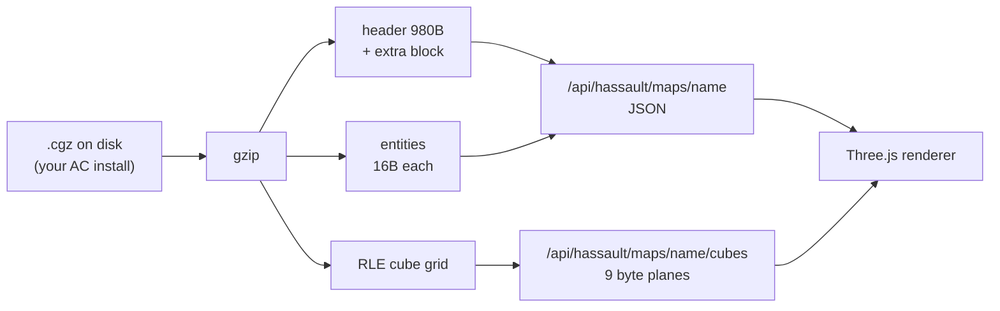
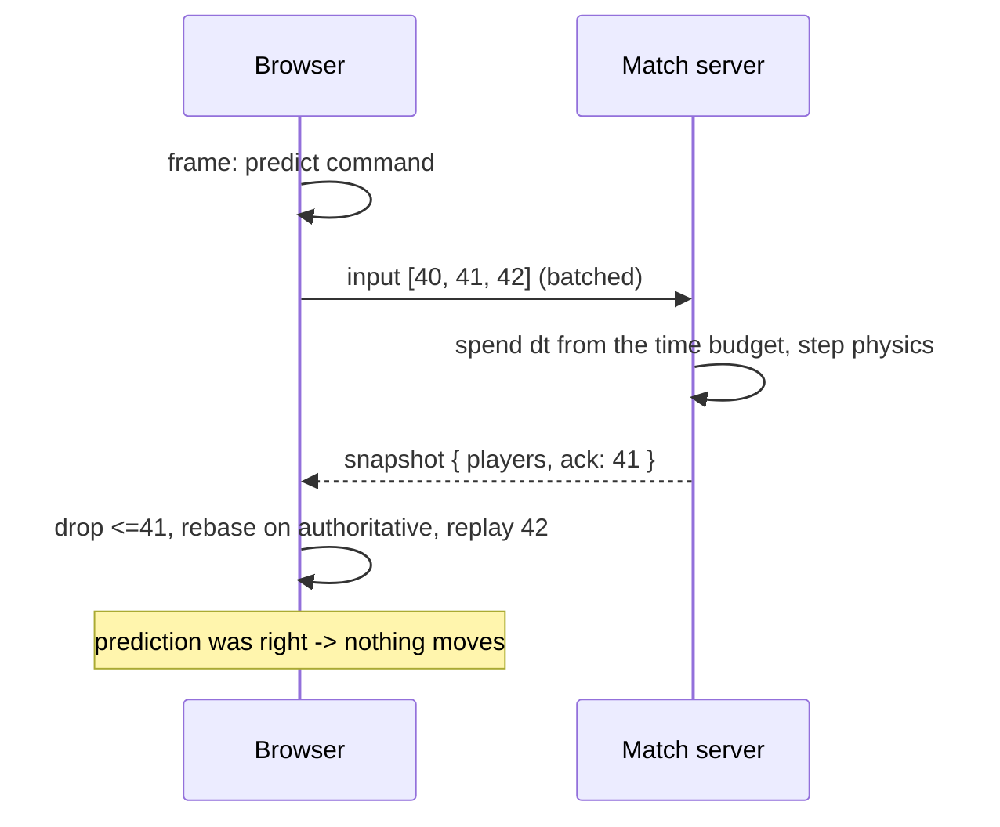
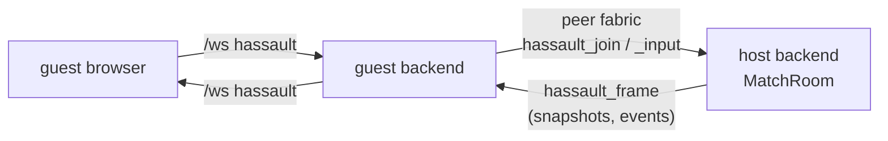
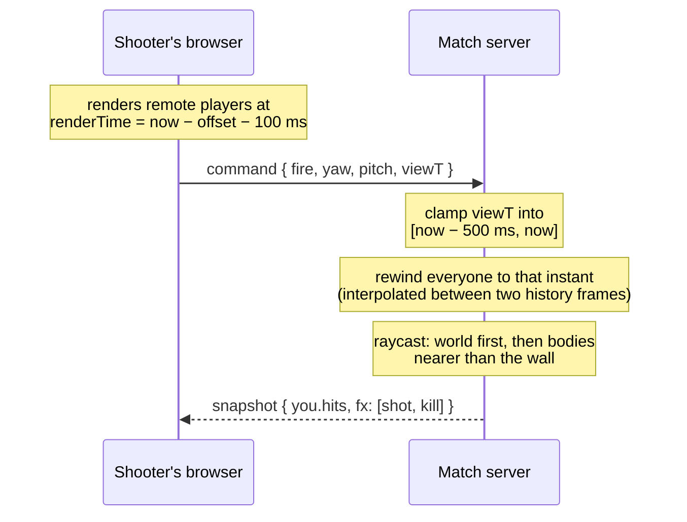

# Module: hassault (HorribleAssault)

An [AssaultCube](https://github.com/assaultcube/AC) remix that runs as a pane in
the dashboard, with its own client, its own netcode, and its own server
infrastructure. AssaultCube's original stack — an SDL/OpenGL C++ client speaking
ENet over UDP to a master server — cannot run in a browser and is not what we
want anyway; the point is to rebuild it on the fabric this app already has.

**Implemented so far: the map pipeline, the renderer, the netcode, weapons, and
bots** — you can walk around any of the 44 shipped maps in first person, and you
can fight in them: an authoritative match server on your own backend, five
weapons with lag-compensated hit registration, and bot players to fill out a
match when nobody else is about.

## Licensing: why no game content is in this repo

AssaultCube splits its licensing, and the split decides the whole design:

- The **source** is under a zlib-like license. That is the part being remixed —
  `cgz.py` is a direct port of `load_world` and `rldecodecubes` from
  `source/src/worldio.cpp`.
- The **content** (maps, textures, models, sounds) is copyright. It may be
  redistributed only inside an unmodified AssaultCube package, and never
  commercially.

This repo is public, deploys to GitHub Pages, and ships a server image to Fly, so
committing a single `.cgz` or texture would be a violation. HorribleAssault
therefore **supports AssaultCube content without ever bundling it**: you point it
at your own install and the backend reads from there. Same precedent as SearXNG
(AGPL — supported, never bundled) and choosing pypdf over AGPL PyMuPDF.

The test suite follows the same rule: hermetic tests synthesize maps in memory,
and the tests that read real maps skip when no install is present.

## Why a TypeScript/WebGL rewrite is tractable

Cube 1 worlds — which AssaultCube still uses — are **not BSP**. The world is a
flat 2D grid of columns: each cell has a type, a floor and ceiling height, three
texture ids, and a vertex delta. A whole map is `(1 << sfactor)²` records of nine
bytes, which is 65 536 cells for the standard `sfactor` of 8.

That is why this can be rendered in Three.js without porting a C++ engine.



## The `.cgz` format, and the parts that bite

Transcribed from `world.h` rather than inferred — a wrong offset here produces
plausible garbage rather than an error.

| Region | Detail |
| --- | --- |
| Magic | `CUBE` **or** `ACMP`. Every AssaultCube 1.3 map is `ACMP`. |
| Header | `sizeof(header)` is 980 bytes; the first 916 precede `waterlevel`. |
| Header size | Untrustworthy before v10 — see `fix_header_size`. |
| Entities | 12 bytes before v10, 16 from v10 (`attr5..attr7` added). |
| Cubes | Run-length encoded; `255` repeats the previous cube N times. |

Four things are easy to get wrong:

**Entities start at `headersize`, not at the end of the struct.** From v10 a map
may carry a variable-length extra-header block between the two, and *every*
official 1.3 map does — they range from 3 024 to 6 302 bytes against a 980-byte
struct. Reading entities from offset 980 lands in the middle of that blob.

**A `SOLID` record carries only a wall texture and a vdelta.** Everything else
comes from `sqrdefault` (floor 0, ceil 16, default floor/ceil textures). A reader
that leaves them zero produces a map with no ceilings.

**v10 scales angles by ten.** A spawn stored as `1810` faces 181°. This was
confirmed against the shipped map set rather than assumed: all 1 741 player
spawns across the 44 official maps have `attr1` a multiple of ten, spanning
0–3590, with nothing at or above 3600. `MapEntity.yaw` resolves this at parse
time, because an entity has no way to know its own map's version.

**A truncated cube stream is filled, not rejected.** The engine fills the
remainder with defaults and carries on; refusing would discard an otherwise
readable map. The result is flagged as `truncated`.

Positions (`x`, `y`, `z`) are plain signed 16-bit cube coordinates and are never
scaled — only *attributes* are.

## The renderer

`packages/core/src/modules/hassault/`. three is **lazy-loaded** on first render
(matching `Avatar3D`) — it is a large dependency and most sessions never open the
pane. `world.ts`, `geometry.ts` and `player.ts` deliberately never import three,
which keeps them unit-testable with no WebGL context.

| File | Role |
| --- | --- |
| `world.ts` | The byte planes as typed arrays, plus the height rules |
| `geometry.ts` | Cube grid → one `BufferGeometry` worth of triangles |
| `player.ts` | Gravity, jumping, step-up, sliding collision |
| `net.ts` | Prediction, reconciliation, snapshot interpolation — pure, no socket |
| `session.ts` | The `/ws` channel as a stateful object the pane drives |
| `avatars.ts` | Remote-player bodies, facing wedges, nameplates |
| `HorribleAssaultPanel.tsx` | Canvas, pointer lock, map picker, HUD, match UI |

`net.ts` is split from `session.ts` for the same reason `world.ts` is split from
the panel: `session.ts` reaches the shell's socket module, which opens a real
WebSocket at import time and dies in a node test run. Everything worth testing
lives on the pure side.

Nameplates keep `depthTest` on. A name drawn through walls is a wallhack, and this
is the same scene a human plays in.

Coordinates: the engine's grid is `(x, y)` with `z` as height, and three.js is
y-up, so world space maps as `three.x = cube.x`, `three.y = height`,
`three.z = cube.y`. One cube is one world unit.

### The heightfield rule, which is easy to get backwards

For a heightfield cell, the **base height comes from the cell** while the
**delta comes from the cell owning that corner vertex**. `physics.cpp:287` shows
both halves — it starts from `s->floor` and subtracts an average of the four
corner cells' deltas.

Taking the base from the corner cell instead (the obvious reading of "vertex
height") tears adjacent heightfields apart at every seam, and it is not an error
you get told about — the map just renders wrong. `cornerFloor` is the one place
this lives, and a test pins it.

The two divisors are also distinct and both real:

- **`vdelta / 4` per vertex** — the corner heights the mesh is built from.
- **`(sum of four vdeltas) / 16` per cell** — the height a body standing there
  rests on. This is the mean of four `vdelta/4` terms, not a different constant;
  using `/4` here sinks the player into every slope.

### Where walls come from

An open cell contributes a floor and a ceiling. A wall appears wherever an open
cell meets something taller: a solid neighbour, a neighbour with a higher floor
(a step up, textured `wtex`), or one with a lower ceiling (an overhang, textured
`utex` — using `wtex` there is a classic source of subtly wrong walls).

Emitting walls **from the open side only** means every surface is produced exactly
once and always faces the space you can stand in, so the mesh needs no back faces.
Both sides of an edge read the same two shared vertices, so heights meet exactly
even across heightfields.

Surfaces are tinted by texture id rather than textured — real textures are
resolved through map config files this slice does not read yet. Distinct ids
getting distinct hues is what makes walls, floors and trim legible as architecture
rather than a uniform grey soup.

### Movement

Player dimensions are AssaultCube's own (`entity.h`): radius 1.1, eye height 4.5,
0.7 above the eye. Collision uses the circle's AABB, as AC's `rectcollide` does,
so **the body is 2.2 cubes wide and needs three cells of clearance** — worth
knowing before hand-building a test map that a player then cannot enter.

Two details that matter more than they look:

- **Horizontal movement resolves one axis at a time.** Testing the combined vector
  once would reject the whole move and make every corner sticky; resolving x and y
  separately is what lets the player slide along a wall.
- **`STEP_HEIGHT` is not a nicety.** Sloped terrain is stored as a series of small
  floor changes, so a collision test that rejects *any* rise leaves the player
  stuck on ground that looks flat.

The frame timestep is clamped: a backgrounded tab returns a huge `dt`, and
integrating it in one go teleports the player through walls. The client records
the **clamped** value in its command, not the raw one — recording the raw value
would make the replay step further than the server ever simulated, and the two
would never agree again.

A player wedged inside solid geometry is resolved **before** gravity, not after.
Checking afterwards means they have already been moved down by one frame of
falling, which does not look like falling — it looks like sinking half a cube a
second, forever. Both implementations had this and both were fixed together.

## The netcode

The server owns every player's position; the client predicts so that pressing W
moves you now rather than a round trip from now. `match.py` simulates,
`channel.py` carries input and snapshots, `net.ts` predicts and reconciles.



### The three pieces that make prediction work

**Every input carries a sequence number.** The client keeps each command until
the server acknowledges it. Snapshots carry `ack` — the last command consumed
*from that client* — so the client knows precisely which of its own predictions
are still unconfirmed. `ack` is **per recipient**, which is why one shared list of
player rows still needs a per-player envelope.

**The server advances a player only on that player's own commands**, each with
the `dt` the client measured, rather than ticking everyone by wall clock. Two
clients at 120 fps and 30 fps then travel the same distance per second, and — the
part that actually matters — the server integrates the same sequence of steps the
client predicted with. A correct prediction reconciles to *zero* error rather
than to a small permanent jitter.

**Client `dt` is spent from a replenishing budget.** Trusting the client for `dt`
is trusting it for speed, so each player earns simulated time at real time plus a
10% jitter allowance, banked into a 0.25 s reservoir. A stutter is absorbed; a
client that simply claims time faster than it passes runs dry and is throttled.
Measured against the running server: 6.4 s of input submitted in one burst was
metered out at ~1.15 simulated seconds per real second instead of being granted
at once.

It is a cap on the exploit, not a lie detector. This is a game you host for
friends, and a cheat-proof design would cost far more than it is worth here.

### Correction without jolting

Reconciliation sets the simulation to the authoritative state and replays what
the server has not seen. Small disagreements would still show as a constant
micro-jitter, so the *difference* is kept as a visual offset applied to the camera
only and decayed to nothing in about 150 ms — the simulation is already correct
while the picture catches up. Past `SNAP_DISTANCE` (2 cubes) the offset is
dropped instead: easing across a large error draws the player somewhere they are
not for the whole ease, possibly through a wall.

In a live match on `ac_desert` the steady-state correction averaged **0.04 cubes**
(max 1.19) — well inside the smoothing band, so nothing snapped.

### Where a `playerstart` actually puts you

A spawn entity's `z` is **not** a ground height, and reading it as one is the
single easiest mistake in the format. It is the mapper's own origin at the moment
they typed `/newent playerstart`, and in Cube 1 that origin is the *eye*, not the
feet. The evidence is in the numbers: entity `z` is stored as a `short` (all 1741
official values are integers), and the single most common distance from it down to
the floor the body rests on is **exactly 4** — 27% of them, far above any other
value — which is `(int)(floor + 4.5)`, a mapper standing on flat ground with an
eye height of 4.5, truncated on save.

It is not usable even read that way, though. AC's editor flies, so the rest are
scattered from one to twenty-two cubes up with no relation to anything, and that
spread survives restricting the sample to spawns on flat open ground with no map
model within three cubes. The engine gets away with it because `entinmap` and
gravity resolve the spawn on arrival.

So `spawn_at` takes the height from the world instead, resolving against the same
`_support` query `step` does. That makes a spawn the **fixed point of the first
simulated frame**: all 1741 official spawns now rest exactly on the ground and not
one of them moves on its first step.

The earlier reading — `max(floor_at(cell), spawn.z)`, treating the entity height
as a lower bound — put **every one** of those 1741 spawns in mid-air, because
`spawn.z` is above the floor at all but six of them and so the clamp never once
fired. On `ac_desert` that was a seven-cube drop on every spawn and respawn, and
it briefly lifted the eye above the cell ceiling, which makes `raycast_world`
report an immediate block for anything fired on that frame.

Spawn placement is pinned across the two languages by the same fixture `step` is.

### Remote players are rendered in the past

Everyone else is drawn 100 ms behind the newest snapshot, interpolated between
two that have **both already arrived**. Ordinary jitter then never becomes
visible motion, and nothing is ever extrapolated: past the newest snapshot the
last known position is held, because a guess walks people through walls.

Server and client clocks are unrelated, so rather than synchronising them the
buffer tracks the smallest `arrival - timestamp` ever seen. The minimum is the
sample that queued least, which is both the best estimate available without a
clock-sync protocol and — more usefully — a stable one.

Angles interpolate the short way round. A player turning past π would otherwise
spin most of a circle the wrong way between two snapshots.

Verified against the running server with two browser tabs in one match: **39
snapshots produced 233 distinct rendered orientations across 239 frames**, which
is interpolation doing its job rather than the renderer stepping snapshot to
snapshot.

### Why JSON on the shared socket, not a binary one

This revises the earlier "binary WebSocket first" plan, and the reason is
arithmetic. A snapshot of eight players is ~500 bytes of JSON, so 20 Hz costs
about 10 KB/s — nothing on a LAN, which is the only place this runs. Against
that, JSON on the shell's existing `/ws` socket shows up in the observability
panel, needs no second connection to manage or reconnect, and can be debugged by
reading it. Binary framing is worth reaching for when player counts or tick rates
make the bandwidth real; today it would buy nothing and cost legibility.

Input is batched — one message per send tick carrying every command since the
last, rather than one per rendered frame. At 60 fps that is ~30 messages a second
instead of 60, for identical information.

### Playing in a friend's match

A match is authoritative on **one** node. A guest's browser cannot reach it — the
host may be behind NAT, on another network, or simply not somewhere a browser is
allowed to open a socket. So the guest's own backend proxies for them:



The [peer fabric](network.mdx) already solves NAT traversal, relays, LAN
discovery and identity, so this is four message types and two mappings.

**The host never learns that some of its players are not browsers.** A remote
player is a `PeerPlayerConn`, which has the single method the match server calls —
`send_json`. `MatchRoom` is unchanged.

**The browser never learns that the match is somewhere else.** The guest backend
reshapes the host's `welcome` into exactly the frame a local join produces, so the
client has one code path rather than two.

Three details that are easy to get wrong and are each pinned by a test:

- **Every inbound message is gated on `session.info.trusted`** — what accepting a
  friend grants. Friendship means reachability, so knowing a room id is not
  enough to walk into someone's match.
- **Remote input goes through the same validator as a browser's.** A peer is
  another user's machine, not a trusted extension of ours; a second, laxer
  validator on the peer path is exactly where a gap appears.
- **A dropped peer's players are swept.** They have no browser socket, so nothing
  else would ever notice they left — they would stand in the match forever.

Frames are tagged with a `client` id, because one machine can have two tabs in the
same match and otherwise both sets of snapshots go to whichever joined last.

### Invites

Invite a person, not a machine: the pane resolves a name or friend code through
the social roster and sends `hassault_invite` to **every device they have
online**, because you invite a human and they pick which box to answer on.

The invite carries the room and the map. The node id it came from is authenticated
by the fabric; the `hostName` alongside it is only a label and never decides
anything.

The pane's invite list comes from `GET /api/hassault/invitees`, which the hassault
backend assembles from the social roster. That join is deliberately backend-side:
the pane must not import across a module boundary, so it only ever calls
`/api/hassault`. Friends whose node did not advertise the `hassault` capability
during the handshake are shown greyed out rather than hidden, since "your friend
needs to update" is more useful than an absence.

### One socket is one player

Membership is keyed by connection, so joining twice on the same socket replaces
the first player rather than leaving a body behind that nothing can remove. A
second player means a second browser tab (or a second machine).

### Two implementations of one set of rules

An authoritative server has to simulate, so `backend/modules/hassault/physics.py`
is a port of `world.ts` and `player.ts`. Duplication is a real cost and the
failure mode is nasty: a drifted match does not throw, it just puts each player
somewhere the other cannot see.

So the two are pinned together by
`packages/core/src/modules/hassault/__tests__/physics-vectors.json`, replayed by
**both** `backend/tests/test_hassault_physics.py` and `conformance.test.ts`. It
carries two kinds of vector — `cases`, which replay a sequence of movement
commands, and `spawns`, which place a player from an entity — because spawn
placement is duplicated exactly like `step` is, and a disagreement about where a
player starts is a desync from the very first frame. The fixture pins
*agreement*; each side's own unit tests are what argue the rules are right. Agreement is asserted to a tolerance rather than bit-for-bit, because
`math.sin` and `Math.sin` are not required to round identically and demanding
they do would be a test about libm.

Changing a movement rule means changing both sides and regenerating the fixture,
in one commit:

```bash
PYTHONPATH=. uv run python scripts/gen_hassault_vectors.py
```

If that ever becomes a burden, it is the burden telling you the truth about the
cost of the design.

## Weapons

`backend/modules/hassault/weapons.py` owns the loadout and every shot fired with
it. The client draws a muzzle flash, kicks its own crosshair and counts its own
magazine down the instant you press the button — a gun that waits a round trip to
acknowledge the trigger does not feel like a gun — but *whether you hit anything*
is decided on the server, from the server's own copy of the world.

Five weapons, in slot order: knife, pistol, assault rifle, shotgun, sniper rifle.
The numbers are AssaultCube-*flavoured* rather than derived: our movement speed is
22 cubes/s, which is not AC's, so copying its damage table would produce a
different game wearing its numbers.

They are **served, not duplicated** — `GET /api/hassault/weapons` — for the same
reason `plane_order` is reported rather than hardcoded. The client needs each
weapon's fire interval so it does not send input the server will only discard, and
a second copy of that constant in TypeScript is a bug waiting for someone to tune
the rifle.

### Firing is a flag on a movement command

There is no `fire` message. `fire`, `reload`, the weapon slot and `viewT` ride on
the ordinary input command, which buys three things:

- A shot carries the **exact view angles and sequence number of the frame it
  happened on**, rather than the angles of whenever a separate message was
  processed.
- The rate limiter spends from the **same replenishing time budget** as movement,
  so nobody's rifle fires faster than time passes — the anti-cheat that was
  already there covers weapons for free.
- The peer fabric forwards commands verbatim, so **weapons crossed to remote
  matches with no changes to the fabric at all**.

Fire rate and reloads are measured on that budgeted *simulated* clock, not on the
wall clock. Commands arrive in batches — several trigger pulls are consumed in one
tick — and gating on real time would drop all but the first and silently halve a
700 rpm rifle. Respawn timers are the exception and use the wall clock on purpose:
a dead player stops sending commands, so a respawn on their simulated time would
never arrive.

### Lag compensation: rewinding to what the shooter saw

A shooter aims at what their screen shows, and their screen shows the past twice
over: half a round trip of network delay, plus the ~100 ms of deliberate
interpolation delay the renderer adds so remote players move smoothly. On a 60 ms
link that is ~130 ms, and in 130 ms a running player covers nearly three cubes —
more than their own width. Judging the shot against *current* positions would mean
leading every target by a body width, which reads as "this game does not register
hits".

So each room keeps a second of position history and resolves a shot against the
world as the shooter saw it:



The rewind instant is **client-supplied**, and deliberately so: the client already
computes it (`SnapshotBuffer.renderTime` is literally "the server-clock time I am
drawing right now"), and using it is more accurate than the server guessing from a
latency estimate measured on some other packet.

That makes the **clamp the security boundary**, not a tidiness measure. `view_t`
is pinned into `[now − MAX_REWIND_MS, now]`. Unclamped, a client could ask to be
judged against a position from ten seconds ago and shoot people where they used to
be standing. `PositionHistory.clamp` is the only place that knows the current
time, which is why the range check lives there rather than in the wire parser.

The cost is the one every game with lag compensation pays: occasionally you take
damage after stepping behind a wall, because on the shooter's screen you had not
reached it yet. That is the honest trade — one of the two players has to be wrong,
and it should not be the one who had to aim.

### The hit model

A shot is a ray. `raycast_world` walks the cube grid with a DDA, because the world
*is* a grid: within each cell only two things can stop the ray — the cell being
solid, or the ray leaving the gap between that cell's floor and ceiling. A shot
across a 256-cube map is a few hundred cheap steps rather than a scene traversal.

Bodies are the **collision cylinder** — the same radius the movement code keeps
clear, the same height the avatar capsule is drawn to, so what you see is what you
hit. The top cube of it is the head.

Two rules do more work than they look like they do:

- **A body is only a target if it is nearer than the wall.** That single
  comparison is the whole of cover; without it every map is a shooting gallery
  with decorative geometry.
- **A negative entry distance with a positive exit is point blank, not a miss.**
  Standing inside someone is a hit at zero range.

Spread is sampled uniformly over the cone's *area* rather than uniformly in angle,
or every pellet clusters at the centre and a shotgun behaves like a rifle at range.

### Health, death, and what is private

Health is **public**, in the shared snapshot rows: a wounded enemy is exactly the
information that makes a firefight a decision rather than a coin toss. Ammunition
is **private**, in the per-recipient envelope — it is nobody else's business how
full your magazine is, and it would be sixteen extra numbers per packet for
everyone. Hitmarkers go in the same envelope and are *drained* when it is built,
so each is delivered exactly once.

Kills, deaths and team scores are tracked; friendly fire is off (a four-player
match on a map with team spawns is otherwise decided by who turns around first);
spawn protection lasts a second and a half and is forfeited the moment you fire,
because otherwise it is not protection, it is a licence.

Shots are **batched into the snapshot** rather than sent as they happen. A rifle at
700 rpm would otherwise be its own message stream; batching makes combat cost the
tick rate rather than the fire rate, and the snapshot's `fx` list carries both
tracers and the kill feed.

Recoil is applied **locally**, because view angles are client-owned anyway — the
server simply uses whatever angles arrive. A modified client could therefore fire
without climb. That is the same class of concession as trusting `dt`, and the same
answer applies: this is a game you host for friends, and the budget caps how much
any of it is worth.

## Bots

`backend/modules/hassault/bots.py`. A bot is **not a second kind of entity**. It is
a `MatchPlayer` whose input happens to be produced on this machine instead of
arriving over a socket: `BotBrain.think` returns a `Command`, the room enqueues it
through the same `enqueue` a browser's input goes through, and it is validated,
budgeted and simulated by exactly the same code.

That is the whole design, and it buys two things worth having. A bot cannot do
anything a player could not — no wall-clipping, no infinite ammo, no firing faster
than time passes — and there is only ever one simulation to debug.

The AI is reactive rather than planned. There is no navmesh: an AssaultCube map is
a heightfield of columns, and building a graph over it is a larger piece of work
than the rest of the file. Instead a bot steers toward something it wants and
probes ahead with the movement code's **own `can_stand`**, so what it believes it
can walk through is precisely what it can walk through. Line of sight uses the
**same `raycast_world` a shot traces**, so a bot never fires at something it could
not have hit. When it is wedged on geometry the probe was happy with, a stuck
detector turns it hard and makes it jump.

Aim is the part that has to be wrong on purpose. A bot can compute the exact angle
to your head every tick; a bot that *uses* it is not difficult, it is unplayable.
So aim is a rate-limited turn toward the target plus a slowly-wandering error term,
and the skill levels are mostly settings for those two numbers:

| Skill | Turn rate | Aim error | Reaction | Sight |
| --- | --- | --- | --- | --- |
| `easy` | 2.2 rad/s | 0.10 rad | 0.65 s | 70 cubes |
| `normal` | 4.2 rad/s | 0.045 rad | 0.35 s | 110 cubes |
| `hard` | 7.5 rad/s | 0.017 rad | 0.16 s | 170 cubes |

The trigger is pulled when the barrel is where the bot **thinks** it is aiming —
error included — so it shoots with confidence and then misses by that error.
Comparing against the *true* bearing instead would produce the opposite and much
worse behaviour: a bot that holds fire until it is perfectly on target, and so
never misses at all.

Two smaller rules that are easy to get wrong:

- **Bots alone do not keep a room alive.** The empty clock tracks humans, not
  bodies; a match with nobody in it is a screensaver, and a room seeded with bots
  would otherwise never be retired.
- **Removal is newest-first, by insertion order** rather than by `joined_at` —
  `time.monotonic()` on Windows has a ~16 ms granularity, and two bots added in the
  same breath are indistinguishable by it.

Add them from the toolbar (`+ Bot`, with a skill selector), or ask the agent:
`hassault.add_bot` takes a count, a skill and an optional team. Bots are host-only
— a guest's socket is bound to a remote match, and there is no fabric message for
reshaping the roster of a match you are only visiting.

## Contributions to the layout shell

- **Panels:** `hassault.play` (HorribleAssault, role `document`, singleton). A
  `document` because it wants the centre area and a lot of pixels, and it grabs
  pointer lock, which would be hostile in a narrow dock.
- **Commands:** `hassault.open` (HorribleAssault: Open).
- **Settings:** `hassault.installPath` — the folder containing `packages/maps`.
  Blank auto-detects the usual per-platform locations.
- **Agent tools** (group `hassault`): `list_maps`, `list_matches`, `host`,
  `invite`, `status`, `surroundings`, `add_bot`, `remove_bot`.

## Agent tools

These run the *social* side of a game — "start a match on ac_desert and invite
Rob", "who's in the match?", "what's around me?" — which is the tedious part for a
human mid-session and the easy part for an agent.

| Tool | Does |
| --- | --- |
| `hassault.list_maps` | Maps this install can host |
| `hassault.list_matches` | Matches running here, plus invitations received |
| `hassault.host` | Open a match, optionally inviting someone in the same call |
| `hassault.invite` | Invite a friend; the room may be omitted when only one runs |
| `hassault.status` | Who is in a match: teams, health, kills, latency, remote or not |
| `hassault.surroundings` | Walls in each compass direction, and who is nearby |
| `hassault.add_bot` | Field bots: a count, a skill, an optional team |
| `hassault.remove_bot` | Take them back out, by name, by count, or all of them |

`surroundings` casts its rays through the same `World` the simulation uses, so it
reports what the server believes rather than a guess from a map file, and it
answers in compass words and cubes because the agent is talking to a human. It
also reports **line of sight** per person, traced with the same ray a shot would
follow — "behind the wall" is the useful half of spotting.

**They deliberately stop short of playing.** Driving a player means producing
input at 60 Hz and an agent turn takes seconds; a tool that "moves you forward"
would be a bot controller wearing a tool's clothes. The agent can *field* bots —
"put three hard ones on the other team" — but the thing producing their input is a
tick-rate brain on the server, not a tool call. What is here is everything needed
to *set up* and *talk about* a match, including acting as a spotter for whoever is
actually playing.

Controls: click to lock the pointer, WASD to move, mouse to look, Space to jump,
left mouse to fire, 1–5 or the wheel to change weapon, R to reload, Tab for the
scoreboard, V for noclip (offline only), Esc to release. Keys are swallowed **only
while the pointer is locked**, so the command palette and every other shortcut keep
working when it is not; releasing the pointer also releases the trigger, or a
weapon left firing keeps firing into whatever you tabbed away to.

The toolbar carries the match controls: a name, Join/Leave, bot add/remove with a
skill selector, and — once in — the team scores, the head count and your
round-trip time. Changing map while in a match leaves it rather than silently
simulating you in a different world.

The HUD is health bottom-left, weapon and magazine bottom-right, kill feed
top-right, and a crosshair whose gap is the weapon's **actual** spread cone, so a
shotgun looks like a shotgun without anyone reading the numbers. Hitmarkers rotate
it into an X rather than fading a second element in and out.

## Backend surface

`backend/modules/hassault/`, mounted at `/api/hassault`.

| Route | Purpose |
| --- | --- |
| `GET /api/hassault/status` | Whether an install was found, where, and how many maps |
| `GET /api/hassault/maps` | Every readable map, official first |
| `GET /api/hassault/maps/{name}` | Header, entities, spawn counts (JSON) |
| `GET /api/hassault/maps/{name}/cubes` | The cube grid as raw byte planes |
| `GET /api/hassault/weapons` | The loadout, in slot order — served so the client cannot drift from it |
| `GET /api/hassault/matches` | Live matches on this node — enough to render a lobby row |
| `POST /api/hassault/matches` | Open a match **without joining**, so its id can be handed to a friend |
| `GET /api/hassault/invitees` | Friends who could join right now, from the social roster |
| `GET /api/hassault/invites` | Invitations received from friends, unexpired |

Joining is a `/ws` operation, not REST, because it binds a player to a socket. A
match created over REST stays empty and is retired after a grace period if nobody
arrives — without that grace an invite room would be swept away before the
invitee could click it.

### The `hassault` `/ws` channel

| Direction | Event | Purpose |
| --- | --- | --- |
| → | `join` | `{ map, name, room?, host? }`; `host` makes it a friend's match |
| → | `input` | `{ commands: [...], rtt }` — batched, sequence-numbered |
| → | `respawn` | The server owns spawn points, so respawning is asked for |
| → | `invite` | `{ who, room }` — `who` is a person, not a node id |
| → | `add_bot` | `{ count, skill }` — host only |
| → | `remove_bot` | `{ count }` or `{ id }` — host only |
| → | `leave`, `ping`, `list`, `invites` | |
| ← | `welcome` | Your player id, the room, everyone in it, the scores, and `host` if remote |
| ← | `snapshot` | All players plus **your** `ack`, `you` and the tick's `fx`, at 20 Hz |
| ← | `invite` | A friend has invited you to a match |
| ← | `roster` | Bots joined or left; membership itself follows in the next snapshot |
| ← | `joined`, `left`, `pong`, `error`, `matches`, `invites`, `invite_sent` | |

One command, with the combat fields it may carry:

```json
{ "seq": 412, "forward": 1, "strafe": 0, "jump": false,
  "yaw": 1.57, "pitch": -0.02, "dt": 0.0166,
  "fire": true, "reload": false, "weapon": -1, "viewT": 1743102934812 }
```

`weapon` is `-1` for "no change", so an absent or nonsensical slot leaves the
weapon alone rather than silently arming the knife. The combat fields are omitted
entirely on the frames that are not shots, which is most of them.

And on the peer wire, declared in `fabric.py` rather than `network/protocol.py` —
a module owns its own wire vocabulary, following the training-ads precedent, so
adding a feature never edits the fabric core:
`hassault_invite`, `hassault_join`, `hassault_input`, `hassault_leave`,
`hassault_frame`.

Every field of an inbound command is clamped rather than trusted: the movement
axes to ±1 (asking for 50 is the obvious cheat), `dt` to 0.25 s, pitch to a right
angle, the weapon slot to the loadout. NaN and infinity survive JSON and poison
every comparison downstream, so they are rejected at the edge instead of at the
first surprising position. `viewT` is the exception and is *not* range-checked
here: it is clamped against the clock in `PositionHistory.clamp`, which is the
only place that knows what time it is. There is deliberately **no noclip on the
wire** — it is a local sightseeing tool, and the pane disables it while you are in
a match.

### Why the grid is binary

A 256×256 map is 65 536 cubes across nine fields — roughly 590 000 numbers. As
JSON that is several megabytes to serialize and parse. The `/cubes` endpoint
returns the nine planes **concatenated raw**, so the browser adopts them directly
as typed arrays with one copy and no parsing:

```js
const info = await fetch(`/api/hassault/maps/${name}`).then((r) => r.json());
const buf = await fetch(`/api/hassault/maps/${name}/cubes`).then((r) => r.arrayBuffer());
const n = info.cubic_size;
const plane = (i) => info.plane_order[i];
const types = new Uint8Array(buf, 0 * n, n);
const floor = new Int8Array(buf, 1 * n, n); // floor and ceil are SIGNED
const ceil = new Int8Array(buf, 2 * n, n);
// index a cell at (x, y) as y * info.ssize + x
```

`plane_order` is reported by the metadata route rather than hardcoded on both
sides, so the two cannot drift. `floor` and `ceil` are signed; the rest are not.

### Path safety

An install path is user-supplied configuration and the names indexing into it come
from files we did not write, so both are validated. `find_map` accepts only bare
alphanumeric names — anything containing a separator or a dot is refused outright
rather than normalized, because a "cleaned" traversal attempt is still an attempt.
`resolve_asset` compares the **resolved** target against the resolved package root,
which is what actually catches symlinks and encoded forms; a string check for `..`
would miss both.

## Browser vs desktop

Identical in both layouts. The install is read by the backend, so the browser
never touches the filesystem.

## Known limitations

- **No textures yet.** Texture slots are mapped to image files by map config
  files (`.cfg`), which are not parsed yet; surfaces are tinted by texture id
  instead.
- **`CORNER` cells render as open.** The type is a diagonal half-wall; treating it
  as fully open leaves a small gap rather than blocking a passage, which is the
  safer wrong answer. They are rare — 104 of 65 536 cells in `ac_desert`.
- **No map models, water, or sky.** `mapmodel` entities (crates, foliage) are
  parsed and exposed but not rendered, and the water level is read but not drawn.
- **Two official spawns leave your head in a lintel.** `ac_arid` (180, 122) and
  `ac_snow` (48, 146) sit where the 2.2-cube body reaches into a cell with one or
  two cubes of headroom, so `can_stand` is false at the spot the spawn names. AC
  gets away with it because `entinmap` nudges a spawning player until they fit;
  we have no equivalent, and the ceiling push-down in `step` cannot help when the
  floor is already the only option. Two spawns in 1741, and the effect is a shot
  from that exact tile reading as blocked.
- **No ammo pickups.** The entities are parsed but not placed, so a finite reserve
  on every weapon would end a long match with everyone standing around empty. The
  sidearm is bottomless and the rest are not, and dying refills you. Pickups are
  the real answer and are their own slice.
- **No weapon models, sounds, or animations.** You see a tracer and a crosshair
  kick; there is no gun on screen and nothing to hear.
- **Recoil is client-side.** View angles are client-owned anyway — the server uses
  whatever arrives — so a modified client could fire without climb. Same class of
  concession as trusting `dt`, and the same answer: this is a game you host for
  friends.
- **Bots do not use ladders, lifts, or teleporters**, and have no notion of
  objectives. They steer, take cover by accident rather than on purpose, and get
  lost in complicated geometry. There is no navmesh.
- **Bots are host-only.** A guest across the fabric cannot add or remove them:
  their socket is bound to a remote match, and a fabric message for reshaping
  someone else's roster would let a friend change a match from a pane you cannot
  see.
- **A guest's latency is two hops.** Their input goes browser → their backend →
  the fabric → the host, and snapshots come back the same way. Prediction hides
  it for their own movement; other players are correspondingly further in the
  past. A direct WebRTC datachannel between the two browsers would cut a hop, and
  the fabric already has that [transport](network.mdx) — it is just not wired to
  matches yet.
- **Invites are not persisted.** They live in memory with a five-minute expiry, so
  a backend restart forgets them. An invitation is a "now" thing; a durable one
  would want to be a notification, which is a different feature.
- **Pre-v10 entity attributes are unscaled.** Maps older than v10 need a
  per-entity-type scaling table this reader does not apply; such maps are flagged
  `legacy_unscaled_attrs`. Every official 1.3 map is v10, so nothing shipped is
  affected. Positions and the cube grid are correct regardless.
- Lighting (`r`/`g`/`b` per cube) is computed by the engine at load time via
  `calclight` and is not stored in the file, so it is not reproduced here.
- The whole map is one mesh with no culling beyond the frustum. Fine at the ~50–90k
  triangles a 256×256 map produces; it would need chunking before it grows.

## Roadmap

1. **Map and asset pipeline** — done.
2. **Three.js renderer** — done: walk any shipped map in first person.
3. **Netcode** — done: an authoritative match server on the local backend, with
   client prediction, reconciliation, and entity interpolation. JSON on the shared
   `/ws` socket rather than a binary one, for the reasons above; the existing
   [WebRTC datachannel transport](network.mdx) remains the upgrade path for
   matches between nodes rather than between tabs.
4. **Lobby and friends integration** — done: invite a friend from the
   [Friends roster](social.mdx) and play in their match across the fabric, plus
   agent tools for hosting, inviting and spotting.
5. **Weapons and scoring** — done: five weapons, server-authoritative hitscan with
   a clamped rewind to the shooter's own render instant, health, deaths, kill feed
   and team scores.
6. **Bot players** — done: reactive AI at three skill levels, producing ordinary
   input through the ordinary queue, so a bot is a player rather than a second
   simulation.
7. **Textures and map models** — the largest remaining gap between this and
   something that looks like AssaultCube. Needs the `.cfg` parser that maps
   texture slots to files.
8. **Pickups** — ammo and health entities are already in the map file; placing
   them turns the ammo economy from a countdown into a reason to move.
9. **Game modes** — team deathmatch is what the scoreboard currently describes.
   CTF and the rest need flag entities and a round structure.

## See also

- [Module: social](social.mdx) — friends and invites
- [Module: network](network.mdx) — the peer fabric the netcode will ride
- [Module: games](games.mdx) — the existing competitive-play platform
