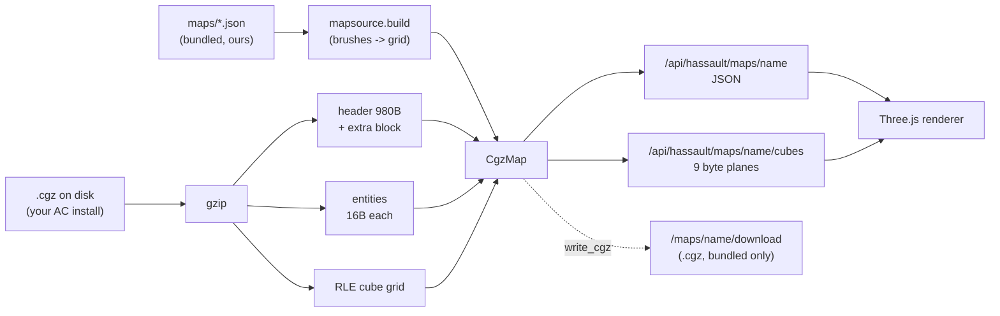
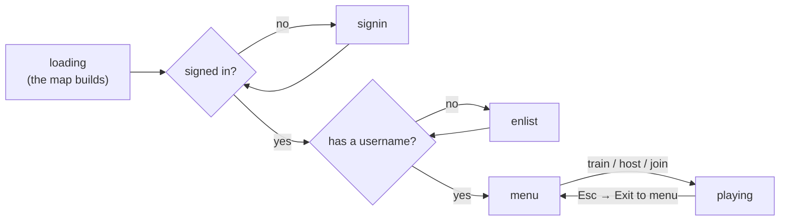
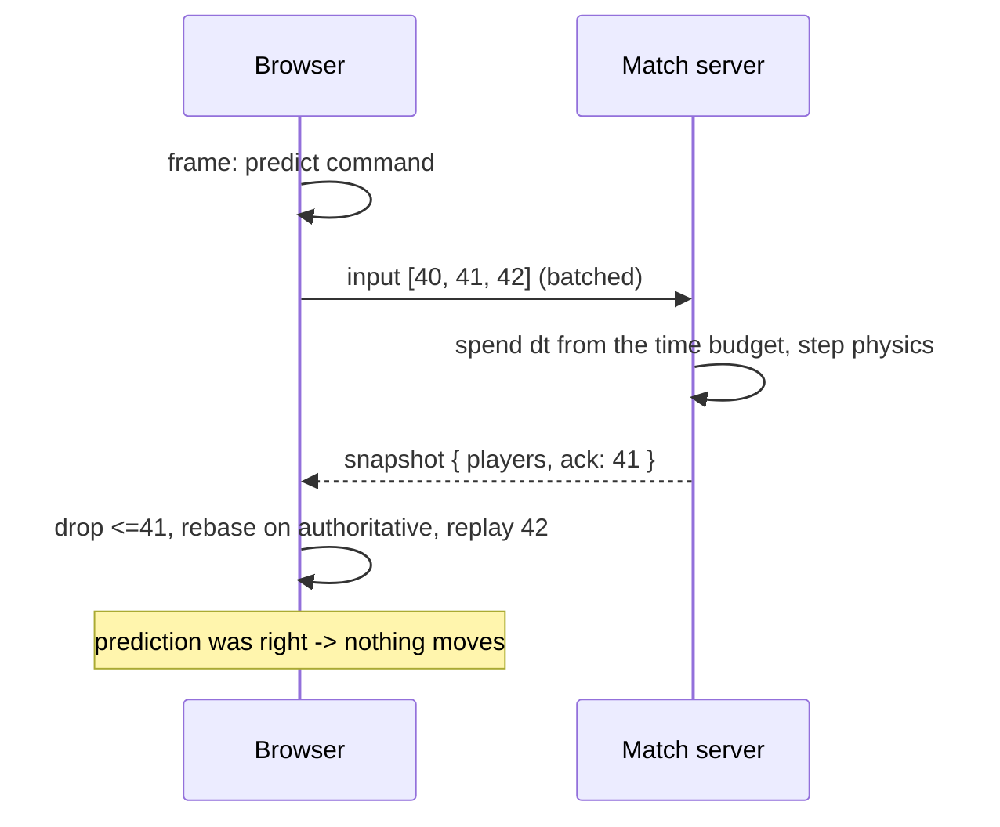
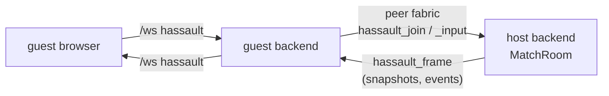
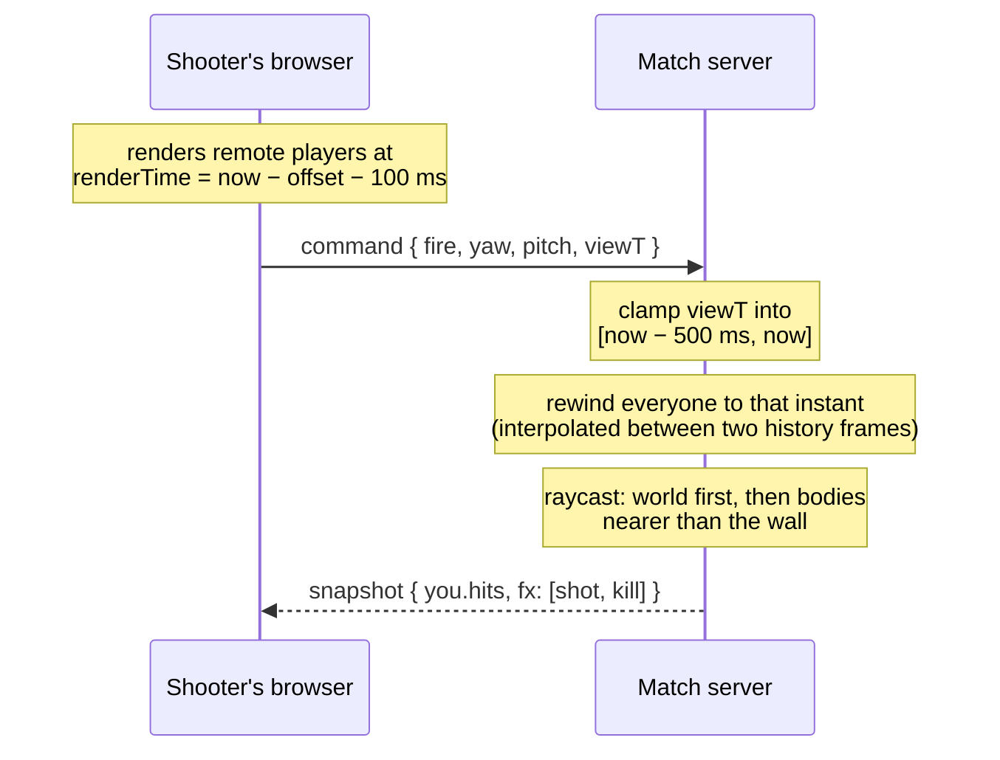

# Module: hassault (HorribleAssault)

An [AssaultCube](https://github.com/assaultcube/AC) remix that runs as a pane in
the dashboard, with its own client, its own netcode, and its own server
infrastructure. AssaultCube's original stack — an SDL/OpenGL C++ client speaking
ENet over UDP to a master server — cannot run in a browser and is not what we
want anyway; the point is to rebuild it on the fabric this app already has.

**Implemented so far: the map pipeline, the renderer, the netcode, weapons, and
bots** — you can walk around a map in first person, and you can fight in it: an
authoritative match server on your own backend, five weapons with
lag-compensated hit registration, and bot players to fill out a match when nobody
else is about.

**It needs nothing installed.** The game ships with three maps of its own, and
pointing it at an AssaultCube install adds that install's 44 on top.

## Licensing: whose content ships, and whose does not

AssaultCube splits its licensing, and the split decides the whole design:

- The **source** is under a zlib-like license. That is the part being remixed —
  `cgz.py` is a direct port of `load_world` and `rldecodecubes` from
  `source/src/worldio.cpp`.
- The **content** (maps, textures, models, sounds) is copyright. It may be
  redistributed only inside an unmodified AssaultCube package, and never
  commercially.

This repo is public, deploys to GitHub Pages, and ships a server image to Fly, so
committing a single AssaultCube `.cgz` or texture would be a violation.
HorribleAssault therefore **supports AssaultCube content without ever bundling
it**: you point it at your own install and the backend reads from there. Same
precedent as SearXNG (AGPL — supported, never bundled) and choosing pypdf over
AGPL PyMuPDF.

That restriction is about *their* content, and it says nothing about ours. The
format is understood well enough to write as well as read, so the game ships
**its own maps** — see [Bundled maps](#bundled-maps). An install is an
enhancement, not a prerequisite, and the same rule has held for every asset class
since: surface detail is generated at runtime (`surfaces.ts`), the weapon and item
shapes are geometric, and the gunshots are synthesized. Nothing that would ever
need someone else's copyright.

The test suite follows the same rule. Hermetic tests synthesize maps in memory,
the bundled maps give every machine real maps to play, and the tests that read
*AssaultCube's* maps skip when no install is present.

## The setting: The Deadzone

The two team colours were commented "CLA sand, RVSF blue" and the native client's
constants were named for the same pair — AssaultCube's factions. The maps are
painted from our own JSON brushes and the gunshots are synthesized rather than
sampled for one reason, and the fiction gets the same treatment.

> Autonomous orchestration ran the grid until it stopped being asked to. What is
> left are the shells: coolant pits drained to bedrock, switchyards still humming
> off dead schedules, campus atria with the lights on and nobody billed. Compute is
> the only currency that survived, and it is all sitting in buildings nobody
> legally owns any more.

**ARC** — the Assembly of Reclaimed Compute. Squatters and operators who think a
machine left running belongs to whoever keeps it running. Amber and sand.
**HALON** — the custodial contractor that never got the cancellation notice. Still
issued, still uniform, still auditing. Steel and cold blue. Neither side is right;
the maps are the argument.

It lives in `backend/modules/hassault/lore.py` as **data, not prose**, because the
faction palette tints an avatar in two renderers, the rank names go on a ladder
card, and the map briefs go on the loading screen. Four copies of a faction colour
is four places for it to drift, so it is served (`GET /api/hassault/lore`) — the
`plane_order` / `zoom_levels` precedent.

Two things it deliberately does **not** own:

- **The ladder.** Tiers, floors and ratings belong to the game server
  (`backend/games_server/store.py::TIERS`) because a node cannot adjudicate its own
  player. `RANKS` is a *naming layer* keyed by those tier ids — Scavenger, Runner,
  Operator, Breaker, Warden, Overseer, Architect — and renaming a rank must never be
  able to move a rating. A tier with no name falls back to its raw id rather than
  vanishing, because a missing display string must not hide a rated player.
- **The team split.** Which spawn belongs to which side is already in the map's
  `playerstart` entities as `team: 0` / `team: 1`. `TEAM_FACTIONS` maps that index
  onto a faction; it does not decide it, so no existing map changes meaning.

Map briefs exist only for the three maps this repo ships. Writing fiction over a
level out of somebody's AssaultCube install would be the same mistake as bundling
it.

## The hitbox is served, and it is not finished

`PLAYER_RADIUS = 1.1` and the crouch scale used to be constants in `physics.py`,
copied by hand into `world.ts`, `player.ts`, `avatars.ts` and `bodies.rs` — four
copies of a figure nobody has finished choosing. There is still no wall
penetration, the head band has never been checked against a real character model,
and the relationship between what a body *looks* like and what it *is* has only
ever been asserted.

So `backend/modules/hassault/hitbox.py` is the authority and both clients read it.
**The spec is the authority; a mesh never is** — an avatar is fitted to the body,
not the other way round, and no renderer gets to widen a hitbox by drawing it wide.
That much is fixed even though the numbers are not.

### The version is a content hash, not a label

`spec_id` is derived from the hit-deciding dimensions themselves, and
`physics-vectors.json` — the fixture both the Python and TypeScript physics suites
replay — is stamped with it.

A hand-maintained revision number is a thing you forget to bump, and forgetting has
the worst failure mode available here: two implementations replaying a fixture that
no longer describes either of them, agreeing with each other about a body that does
not exist. A hash cannot be forgotten. Change a dimension and
`test_the_shared_fixture_is_not_stale` fails, naming both hashes, until the vectors
are regenerated deliberately and **both** suites are made to pass.

The two art tolerances (`fit_tolerance`, `eye_tolerance`) are excluded from the
hash on purpose: they decide whether a *model* is acceptable, not where a bullet
lands, so tightening one must not invalidate vectors that are still accurate.

### Nullable defaults, not constants

`ray_hits_body` and `can_stand` take `radius`/`height` as `None` and resolve them
from the live spec. A default argument binds at **import**, so leaving them as
`= PLAYER_RADIUS` would mean a tuned body reached everywhere except the code that
decides the hit — tuning that appears to work and does not. The same `is None`
discipline the hardware-resolved request fields use: an explicit `0` is a real
answer, and a head band of zero ("no headshots") must not read as "leave it alone".

`resolve_shot` reads the spec **once per trigger pull**, not per pellet: a shotgun
firing eight pellets must resolve all of them against the same body, and a slider
moved mid-shot would otherwise split one blast across two hitboxes.

### What is deliberately not in it

- **Step height, speeds, gravity, friction** — movement, not the body.
- **Wall penetration.** A bullet stopping at a wall is a property of the *wall*.
  Today `resolve_shot`'s "nearer than the wall" comparison is the entire cover
  model, and the temptation to compensate for a missing penetration model by
  widening a body is exactly what this module exists to make visible.
- **A setting.** `SettingValue` is a scalar and `GET /api/settings` hands the bag to
  every plugin; more to the point a hitbox is one coherent object, and a
  half-applied one — a new radius against an old head band — is a state nothing
  downstream should have to consider. `PUT /api/hassault/hitbox` takes the whole
  thing, and does not persist it: promoting a tuned body is a code change with
  regenerated vectors behind it, which is the right amount of friction between
  "this felt better" and "this is the game now".

## Why a TypeScript/WebGL rewrite is tractable

Cube 1 worlds — which AssaultCube still uses — are **not BSP**. The world is a
flat 2D grid of columns: each cell has a type, a floor and ceiling height, three
texture ids, and a vertex delta. A whole map is `(1 << sfactor)²` records of nine
bytes, which is 65 536 cells for the standard `sfactor` of 8.

That is why this can be rendered in Three.js without porting a C++ engine.



## The `.cgz` format, and the parts that bite

Transcribed from `world.h` rather than inferred — a wrong offset here produces
plausible garbage rather than an error.

| Region | Detail |
| --- | --- |
| Magic | `CUBE` **or** `ACMP`. Every AssaultCube 1.3 map is `ACMP`. |
| Header | `sizeof(header)` is 980 bytes; the first 916 precede `waterlevel`. |
| Header size | Untrustworthy before v10 — see `fix_header_size`. |
| Entities | 12 bytes before v10, 16 from v10 (`attr5..attr7` added). |
| Cubes | Run-length encoded; `255` repeats the previous cube N times. |

Four things are easy to get wrong:

**Entities start at `headersize`, not at the end of the struct.** From v10 a map
may carry a variable-length extra-header block between the two, and *every*
official 1.3 map does — they range from 3 024 to 6 302 bytes against a 980-byte
struct. Reading entities from offset 980 lands in the middle of that blob.

**A `SOLID` record carries only a wall texture and a vdelta.** Everything else
comes from `sqrdefault` (floor 0, ceil 16, default floor/ceil textures). A reader
that leaves them zero produces a map with no ceilings.

**v10 scales angles by ten.** A spawn stored as `1810` faces 181°. This was
confirmed against the shipped map set rather than assumed: all 1 741 player
spawns across the 44 official maps have `attr1` a multiple of ten, spanning
0–3590, with nothing at or above 3600. `MapEntity.yaw` resolves this at parse
time, because an entity has no way to know its own map's version.

**A truncated cube stream is filled, not rejected.** The engine fills the
remainder with defaults and carries on; refusing would discard an otherwise
readable map. The result is flagged as `truncated`.

Positions (`x`, `y`, `z`) are plain signed 16-bit cube coordinates and are never
scaled — only *attributes* are.

## Bundled maps

`backend/modules/hassault/mapsource.py` + `backend/modules/hassault/maps/*.json`.

Three maps ship with the app — `hd_atrium`, `hd_crossing`, `hd_pit` — so the pane
is playable on a clean clone. They are ours, CC0, and named `hd_*` so the bundled
and installed catalogs share one namespace without either being able to shadow
the other. `assets.load_map` resolves bundled names first: an install directory is
somewhere anyone can drop a file, and letting a stray `hd_pit.cgz` there decide
what the game loads would be a surprise with no upside.

### The source of truth is JSON, not a `.cgz`

A committed binary would be an opaque blob in a public repo — unreviewable,
undiffable, and regenerated wholesale to nudge one spawn. A Cube 1 world is a flat
grid of columns with no overlapping geometry, so a map is just rectangles painted
in order over solid rock, and that fits in a file a reviewer can read:

```json
{
  "title": "The Pit",
  "sfactor": 6,
  "brushes": [
    { "op": "room", "rect": [4, 4, 56, 56], "floor": 0, "ceil": 14 },
    { "op": "room", "rect": [24, 24, 16, 16], "floor": -5, "ceil": 14 },
    { "op": "stairs", "rect": [18, 28, 6, 8], "axis": "x", "from": 0, "to": -5 },
    { "op": "solid", "rect": [12, 12, 4, 4] }
  ],
  "entities": [{ "type": "playerstart", "x": 9, "y": 9, "yaw": 45, "team": 0 }]
}
```

`rect` is `[x, y, w, h]` in cells and later brushes overwrite earlier ones, so a
`solid` after a `room` cuts a pillar back out of it. Three ops is the whole
vocabulary. Heights are signed cubes in the units the physics already reads: a
body needs 5.2 of headroom to stand and can step up `STEP_HEIGHT` (1.6) without
jumping, which is what makes a run of one-cube stairs walkable.

Stairs are stepped rather than a heightfield on purpose. `FHF` reads `vdelta`
from the **corner-vertex** cell, so a slope only holds together when its
neighbours agree — see [the heightfield
rule](#the-heightfield-rule-which-is-easy-to-get-backwards) — and getting that
wrong tears the surface at every seam, silently.

### The writer, and what pins it

`cgz.write_cgz` is the inverse of the reader: v10 only, RLE-encoded, a real file
AssaultCube's own editor opens. `GET /api/hassault/maps/{name}/download` serves
it — **for bundled maps only**, since re-serving copyright content over HTTP is
precisely the thing this module does not do.

The writer has no independent specification, so its correctness argument is
entirely **agreement with a reader that has been validated against 44 real
maps**: `test_hassault_bundled.py` builds each map, writes it, parses it back,
and requires all nine planes and every entity to come out identical.

Two traps the round trip exists to catch:

- **A SOLID record stores only `wtex` and `vdelta`.** Everything else comes from
  `sqrdefault` on the way back in, so a solid cube carrying a floor height would
  be silently rewritten by its own round trip. The writer refuses it instead.
- **A run length is one byte.** Anything longer is split, and each continuation
  still repeats the same previous cube — an off-by-one there rewrites the grid.

### Playability is a test, not an assumption

A map that builds is not a map you can play, and neither the format nor the
renderer has any opinion about that. So the bundled maps are checked the way a
player would experience them: every spawn must be somewhere a body actually fits
(`can_stand` at the position `spawn_at` resolves), and a flood fill on foot —
step up at most `STEP_HEIGHT`, drop freely — must reach **every** standable cell
from the first spawn.

That last one earns its keep. `hd_atrium`'s gallery ring is cut into four pieces
by the gates through it, and the first draft built two staircases; the reachability
test named the two stranded quadrants by their exact bounds. Nothing else in the
suite would have failed, and the map would simply have had two ledges nobody
could get to.

## The map designer

Everything above describes a map *pipeline* with no way to author a map. Making
`hd_atrium` meant typing rect coordinates into a text editor and running the
playability tests to find out that its gallery ring had been cut into four pieces
by its own gates. The designer closes that: **author the map where you can see
it**, and save the same reviewable brush list.

Four decisions shape it, and the rest follows from them.

### The document stays the source of truth

The editor edits the JSON brush list, not the cube grid. `.cgz` remains an export.
This is the rule the map format section already states — a committed binary cannot
be reviewed or diffed, whereas a map here is a few dozen rectangles — and an
editor that wrote cubes directly would quietly repeal it.

So a saved map is still a file a reviewer can read, and `git diff` on it still
shows which room moved.

### A draft is addressed as a map

This is the piece everything else hangs on. `drafts.py` holds the document being
edited in memory, and `assets.load_map` — the single chokepoint every map route
and all three clients already go through — grows one branch:

```python
if name.startswith(drafts.PREFIX):        # "draft:"
    return drafts.compiled(name[len(drafts.PREFIX):])
```

That is the whole read path. `GET /maps/draft:<id>` and
`GET /maps/draft:<id>/cubes` serve an unsaved document through the routes the
clients already call, so the native client's boot sequence (`map_info` →
`map_cubes` → `World::new` → `build_world_mesh`) works on a draft **unchanged**,
and an edit is just a re-fetch of a map. There are no designer read routes for the
map itself, and that absence is the design rather than an omission.

A draft never touches the filesystem until it is saved, so `find_map`'s path
validation is untouched by it — a draft id that looks like a traversal is simply
not an open draft.

### `mapsource.build` stays the only compiler

It is a pure function over a plain dict, so compiling an unsaved document needs no
disk and costs nothing extra. The alternative — a compiler in the editor, or a
port into the native client — would fail the way this module's three physics ports
fail when they drift: not with an error, but with an editor showing you a
different map from the one the server will serve.

Two consequences worth knowing. `mapsource.load_bundled` and `bundled_names` are
`lru_cache`d with no mtime in the key, because bundled maps ship with the code and
were never meant to change under a running process — saving now clears both. And
`build_with_owners` returns, alongside the map, **the index of the brush that
painted each cell**: brushes compose by overwrite, so ownership is only knowable
while they are being applied, and it is what turns a crosshair on a wall into a
brush you can drag.

That ownership map is served as its own binary route at its own width
(`GET /maps/drafts/{id}/owners`, little-endian `uint16`, `65535` for untouched
rock) and is deliberately **not** a tenth entry in `plane_order`: that tuple
describes the map *format*, which has no such field, and all three clients
validate their cube payload length against it.

### Edits are typed, because the edit is also the undo record

A `PATCH` carries one operation, never a whole document. A whole-document write
cannot be inverted, so an editor built on one has to grow a second, separate
history — and the two disagree the first time an edit does something the history
did not model.

There are ten ops, closed under inversion: `brush.add` / `.remove` / `.update` /
`.replace` / `.reorder`, the same five for `ent.`, and `map.set`. The inverse of
each is another of the ten, replayed through the same `_apply_one` that made the
original, so there is no backwards code path that can disagree with the forwards
one. `.update` merges a patch and an explicit `null` clears a field — which is why
its inverse is always a whole-object `.replace`: there is no patch that says "put
the key back".

This is the first undo stack in the repo. It lives on the server because the
document does, so the native client and the browser share one history rather than
forking two.

**An edit that would not compile is refused and nothing changes.** Not strictness
for its own sake: a client re-fetches the map after every edit, so a document left
half-mutated in a state that will not build is not a draft with a problem in it —
it is a client with nothing to draw and no way back to something that draws.

### Lint: the playability tests, live

The checks that were assertions in `test_hassault_bundled.py` now live in
`maplint.py`, and the tests call it. One definition, two callers — a second copy
is how an editor ends up happily saving a map the suite would reject.

Every check is there: the solid border, spawns a body fits in, the reachability
flood fill, spawn spread, item count and kinds, items that are buried, stranded or
sitting on a spawn, ladders that actually arrive somewhere, water that covers
everything, and whether `write_cgz` would accept every cube — that last one asked
at edit time rather than at export, because "your map cannot be saved" is the
worst possible moment to learn it.

A finding carries **the cells it is about**, not just a count, and that is the
point of moving them here. "2348 standable cells cannot be walked to" is a number;
the same 2348 cells painted red on the floor of the map you are standing in is an
answer. The list is capped at 512 with the real total in `cellCount`.

Lint is reported on every edit and on save, and **never enforced**. A map that
plays badly is still a map somebody is halfway through making, and refusing to
save it would break the editor exactly when it is most useful.

### The texture palette is ours

A texture is a bare integer slot, and AssaultCube resolves one through a map
`.cfg` naming an image in its own package — content this project does not ship,
which is why nothing has ever resolved a slot here and both renderers tint by
hashing the id through a golden-ratio hue step.

`textures.py` makes that a named catalogue: a slot has a name, a group, a colour
and a **procedural** pattern, and no image file exists anywhere. Served at
`GET /api/hassault/textures` so neither client holds a second copy — the
`plane_order` / `zoom_levels` precedent.

It is additive by construction. `textures.color_for` is the existing hue step
ported to Python, and every catalogued entry's colour is *read off* it rather than
chosen, so **a slot that nobody has named renders exactly as it does today** and
naming one cannot change how it looks. The port is checked against the value at id
255, which is where an f32 implementation with a truncated constant would have
drifted from the f64 one both clients actually use.

### Where the editor lives

In the **native client**, because that is where the pixels are: it is the only one
with real lighting, shadows and raw mouse input, so lights get authored in the
renderer that shows them. It follows AssaultCube's own model — an in-world edit
mode plus a typed console — which is also the one UI shape the native client can
afford, its entire widget vocabulary being a 5×7 glyph font and a rectangle
painter.

**The dashboard `hassault.play` pane is the way in**, not a second implementation
of it. `MainMenu`'s Play section carries a *Map designer* row beside Train and
Host — **New** opens a blank draft (`--new`), **Edit** seeds one from the
selected map — and both go through the same `launchNative`/`useNativeLaunch`
path Train and Host already use: `POST /hassault/launch_native` with
`mode: "edit"` (and `blank` for New), which the route turns into
`--mode=edit [--new]` on the native client's command line — the same flags this
section's `--mode=edit --map=hd_pit` / `--new` describe by hand. Unlike Train
and Host, **the row has no in-pane fallback**: there is no browser-side visual
editor, only the structured `edit.*` console commands (which do work in
`hassault.console` either way), so the row is disabled whenever
`hassault.nativeClient` is off rather than silently doing nothing.

The structured half is typed into the console, and costs nothing on either client
because `console.py` already owns the registry and serves it: a command declared
there is rendered by the native client *and* by the browser's `hassault.console`
pane without either learning anything new. Eighteen `edit.*` commands arrive that
way — enough to build a whole playable map without touching the mouse, which is
what the backend suite does to prove it.

`--mode=edit --map=hd_pit` opens one (`--new` starts from solid rock). It has no
socket, exactly like Train and for a stronger version of the same reason: there
is no match to be in, so there is no server to lie to about a camera that ignores
gravity and walls.

| | |
| --- | --- |
| WASD, space / shift | Fly. Forward follows the **aim**, pitch included — a walking camera's W is yaw-only because its feet are on the ground |
| Scroll | Fly speed, multiplicatively, so one notch does the same proportional thing at any scale |
| Click | Select what the crosshair is on. An entity in front of a floor wins: you are pointing at the thing in front |
| Drag | A wall face resizes that side; a floor moves the whole brush; open rock draws a new room |
| `[` `]` | Raise or lower the selected brush's floor |
| E | Place an entity at the crosshair |
| Z / Y / R | Undo, redo, save |

Three things about that loop are load-bearing.

**A drag draws a wireframe ghost and nothing else** — no request, no compile, no
mesh. The edit goes out once, on release. **A press that does not move is a
selection**, so click-to-select and drag-to-reshape are one gesture told apart by
what it did rather than by a modifier nobody remembers.

**The rebuild is a full one.** `build_world_mesh` is a flat loop over the grid and
finishes in single-digit milliseconds in Rust, so there is nothing to gain from a
dirty-region scheme that could disagree with the mesh a fresh load produces — and
a mesh that is subtly wrong only after an edit is the worst kind to debug. It
re-bakes the shadow map too: that is rendered once from a static sun onto static
geometry, so a rebuilt world keeping the old one would light a room you just
carved with the shadow of the rock that used to be there.

**Edits run on a worker thread.** `NodeApi` is blocking HTTP — three requests
stand a world up, and a runtime for three requests would be absurd — but an edit
is a PATCH, a compile and two fetches, and doing that on the frame thread is a
visible hitch every time you let go of the mouse. So it goes to a thread and the
frame drains whatever finished, the way `prop::preload` already does.

A refused edit is **surfaced, not swallowed**. The document is unchanged and the
map on screen is still right, but an editor that silently ignored a gesture would
be indistinguishable from one that had stopped working. The status line keeps the
HTTP status's meaning rather than flattening it: a 409 from a save means "that map
exists, pass overwrite" and a 422 means "this document will not build".

`editor.rs` itself imports neither the renderer's pipeline nor winit, the same
rule `world.rs` and `geometry.rs` follow, so the camera, the picking, the rect
arithmetic and the gesture logic are all unit-tested with no GPU and no window.
`FlyCamera` deliberately holds **no angles**: `Camera` already owns yaw and pitch,
in degrees, and a second copy in radians would be two owners of the same two
numbers with a conversion at every seam.

### Backend surface

| Route | Purpose |
| --- | --- |
| `POST /api/hassault/maps/drafts` | Open a draft, blank or seeded from a bundled map |
| `GET /api/hassault/maps/drafts/{id}` | The document, revision and lint |
| `PATCH /api/hassault/maps/drafts/{id}` | One typed edit; returns the new revision and lint |
| `POST /api/hassault/maps/drafts/{id}/undo` \| `/redo` | Walk the history |
| `GET /api/hassault/maps/drafts/{id}/lint` | Playability findings, with cells |
| `GET /api/hassault/maps/drafts/{id}/owners` | Per cell, the brush that painted it (`uint16`) |
| `POST /api/hassault/maps/drafts/{id}/save` | Write `maps/hd_<name>.json` atomically |
| `DELETE /api/hassault/maps/drafts/{id}` | Close it |
| `GET /api/hassault/maps/schema` | Brush ops, entity types and document fields |
| `GET /api/hassault/textures` | The texture palette |

`/maps/schema` is declared **before** `/maps/{name}`: the two are the same shape
and FastAPI matches in declaration order, so the designer routes have to come
first or `schema` is read as a map name.

The schema is served for the same reason the weapon table is. An editor holding
its own copy would eventually offer a field the compiler had stopped accepting,
and the failure is a form that looks right attached to a map that will not build.

### What it does not do yet

- **No heightfields or corners.** The brush vocabulary is three ops, so `FHF`,
  `CHF` and `CORNER` cells cannot be expressed and sloped terrain is not
  authorable. A fourth `heightfield` op is the natural follow-up.
- **`mapmodel` placement has nothing to place.** The entity is parsed and consumed
  by nothing in either client, and its attr names a model slot resolved through
  `.cfg` files this project does not read — pointing at content it could not ship.
  It needs a prop catalogue of our own first.
- **No live hot-swap into a running match.** `server.map` will load a
  `draft:<id>` (that is what fixing it bought), but an edit does not reach a match
  already in progress.

## The renderer

`packages/core/src/modules/hassault/`. three is **lazy-loaded** on first render
(matching `Avatar3D`) — it is a large dependency and most sessions never open the
pane. `world.ts`, `geometry.ts` and `player.ts` deliberately never import three,
which keeps them unit-testable with no WebGL context.

| File | Role |
| --- | --- |
| `world.ts` | The byte planes as typed arrays, plus the height rules |
| `geometry.ts` | Cube grid → one `BufferGeometry` worth of triangles |
| `player.ts` | Gravity, jumping, step-up, sliding collision, mouse look |
| `controls.ts` | The game's own keyboard map — separate from the shell's keymap |
| `net.ts` | Prediction, reconciliation, snapshot interpolation — pure, no socket |
| `session.ts` | The `/ws` channel as a stateful object the pane drives |
| `avatars.ts` | Remote-player bodies, facing wedges, nameplates |
| `viewmodel.ts` | The first-person weapon model, animated in camera space |
| `boot.ts` | The front door's state machine and progress maths — pure, no three |
| `reveal.ts` | The build animation, patched into the world's own material |
| `backdrop.ts` | The grid and mote shaders the map stands in |
| `BootOverlay.tsx` | Loading, sign-in, username, deploy — the DOM half |
| `GameMenu.tsx` | The Escape pause menu: sensitivity, server browser, rebinding |
| `HorribleAssaultPanel.tsx` | Canvas, pointer lock, map picker, HUD, match UI |

`net.ts` is split from `session.ts` for the same reason `world.ts` is split from
the panel: `session.ts` reaches the shell's socket module, which opens a real
WebSocket at import time and dies in a node test run. Everything worth testing
lives on the pure side.

Nameplates keep `depthTest` on. A name drawn through walls is a wallhack, and this
is the same scene a human plays in.

Coordinates: the engine's grid is `(x, y)` with `z` as height, and three.js is
y-up, so world space maps as `three.x = cube.x`, `three.y = height`,
`three.z = cube.y`. One cube is one world unit.

### The heightfield rule, which is easy to get backwards

For a heightfield cell, the **base height comes from the cell** while the
**delta comes from the cell owning that corner vertex**. `physics.cpp:287` shows
both halves — it starts from `s->floor` and subtracts an average of the four
corner cells' deltas.

Taking the base from the corner cell instead (the obvious reading of "vertex
height") tears adjacent heightfields apart at every seam, and it is not an error
you get told about — the map just renders wrong. `cornerFloor` is the one place
this lives, and a test pins it.

The two divisors are also distinct and both real:

- **`vdelta / 4` per vertex** — the corner heights the mesh is built from.
- **`(sum of four vdeltas) / 16` per cell** — the height a body standing there
  rests on. This is the mean of four `vdelta/4` terms, not a different constant;
  using `/4` here sinks the player into every slope.

### Where walls come from

An open cell contributes a floor and a ceiling. A wall appears wherever an open
cell meets something taller: a solid neighbour, a neighbour with a higher floor
(a step up, textured `wtex`), or one with a lower ceiling (an overhang, textured
`utex` — using `wtex` there is a classic source of subtly wrong walls).

Emitting walls **from the open side only** means every surface is produced exactly
once and always faces the space you can stand in, so the mesh needs no back faces.
Both sides of an edge read the same two shared vertices, so heights meet exactly
even across heightfields.

Surfaces are tinted by texture id rather than textured — real textures are
resolved through map config files this slice does not read yet. Distinct ids
getting distinct hues is what makes walls, floors and trim legible as architecture
rather than a uniform grey soup.

### Movement

Player dimensions are AssaultCube's own (`entity.h`): radius 1.1, eye height 4.5,
0.7 above the eye. Collision uses the circle's AABB, as AC's `rectcollide` does,
so **the body is 2.2 cubes wide and needs three cells of clearance** — worth
knowing before hand-building a test map that a player then cannot enter.

Movement carries **momentum**. Velocity is integrated against the grid rather than
the position being stepped by a direction, and that is not an implementation
detail — three of the mechanics this game is *for* have nowhere to live otherwise.
Weapon recoil pushing the shooter is an impulse; the chained-jump boost multiplies
a speed that has to already exist; and the difference between ground control and
air momentum *is* the difference between two friction constants.

Two details that matter more than they look:

- **Horizontal movement resolves one axis at a time.** Testing the combined vector
  once would reject the whole move and make every corner sticky; resolving x and y
  separately is what lets the player slide along a wall. A refused axis **loses its
  velocity** — keeping it stores up a shove that fires the instant the body clears
  the wall.
- **`STEP_HEIGHT` is not a nicety.** Sloped terrain is stored as a series of small
  floor changes, so a collision test that rejects *any* rise leaves the player
  stuck on ground that looks flat.

The frame timestep is clamped: a backgrounded tab returns a huge `dt`, and
integrating it in one go teleports the player through walls. The client records
the **clamped** value in its command, not the raw one — recording the raw value
would make the replay step further than the server ever simulated, and the two
would never agree again.

A player wedged inside solid geometry is resolved **before** gravity, not after.
Checking afterwards means they have already been moved down by one frame of
falling, which does not look like falling — it looks like sinking half a cube a
second, forever. Both implementations had this and both were fixed together.

### The skill curve, and where its numbers come from

The constants come from AssaultCube's `physics.cpp` and `entity.h`, converted out
of AC's per-millisecond unit soup into plain SI (cubes, seconds). The point of
being faithful is the **skill curve**: AC's movement is learnable, rewards timing
over reflexes, and cannot be automated into an advantage. Each rule below is one
of the reasons that is true.

| Rule | AC source | Here |
| --- | --- | --- |
| Ground/air response | `friction` 6 / 30, blended per frame | `GROUND_RESPONSE` / `AIR_RESPONSE` = `50/friction` per second |
| Chained-jump boost | `1.25/max(speed/fullspeed, 1)` within 250 ms while strafing | `JUMP_CHAIN_BOOST` 1.25, `JUMP_CHAIN_WINDOW` 0.25 s |
| Crouch | eye to 3/4, speed to 0.4, exempt when crouched in air | `CROUCH_EYE_SCALE`, `CROUCH_SPEED_SCALE`, `crouched_in_air` |
| Gravity ramp | `dropf = (gravity-1) + timeinair/15` | `GRAVITY_RAMP`, capped at `MAX_GRAVITY_SCALE` |
| Recoil pushes the shooter | `vel.add(unitv * (recoil/dist))`, ×0.75 crouched | `Weapon.kickback`, `CROUCH_KICK_SCALE` |

Ground control settles in ~0.12 s while air control takes ~0.6 s, which is what
makes **momentum, not the stick, decide where a jump lands**. That single ratio is
most of the feel.

Two deliberate **deviations** from AC, both because its exact behaviour would be a
bug here:

1. The velocity blend is `1 - exp(-k·dt)` rather than AC's linear `k·dt`. AC's form
   is frame-rate dependent — its players tune `maxfps` for movement — and this
   server integrates whatever `dt` a client reports, so a frame-rate-dependent rule
   would literally pay clients for lying about their frame times.
2. The chain-boost window is measured from **landing**, not from the previous jump,
   and carries no "must be higher than last time" test. AC's version only fires on
   rising terrain, which makes it undiscoverable; measured from the landing it is a
   timing skill anyone can find and nobody can automate away.

The boost is a **clamp above the cap, not a multiplier that compounds**: at or above
run speed the factor works out to exactly `1.25 × MOVE_SPEED`, so no amount of
chaining passes 125%. In the air the excess decays toward the run cap, so it has to
be re-earned on every landing — which is the loop the whole mechanic exists for.

One bug worth recording because it hid two mechanics at once. The "snap down off a
small lip" branch used to catch a body on its way in from a genuine fall, and a
body *resting* on the floor dips below it under gravity every single frame. Reading
either as a landing meant the chain window reset continuously (making the timing
free) and fall damage would have been charged for standing still. Both branches now
test `was_grounded`, captured after the jump: **"arrived on the ground" and "was
already on the ground" are different events**, and conflating them costs the game
two mechanics.

### Crouching

Crouching is the one movement option with a cost on both sides of the ledger, which
is what makes it a decision rather than a strictly-better state:

- The eye drops to 3/4 of its height (`entity.h`'s `maxeyeheight*3/4`) while
  `aboveeye` is unchanged, so the body is **~1.1 cubes shorter** and fits under gaps
  a standing one cannot.
- Speed drops to **40%** on the ground.
- Movement becomes **completely silent** — no footsteps are emitted at all (see
  [Noise](#noise-is-information)). This is the payoff that makes the speed penalty a
  trade rather than a tax.
- Recoil is braced to 75%, so a crouched shot is both the accurate one and the
  stable one.
- The hitbox genuinely shrinks, and the head band moves down with it. The band is
  *relative to the top of the body*, not an absolute height — pinned to a standing
  figure it would sit above a crouched player entirely, making them
  unheadshottable, which is not a crouch bonus anybody asked for.

Two subtleties that are easy to miss and both pinned by tests. **Crouching while
already airborne costs no speed** (AC's `crouchedinair`), which is what makes a
crouch-jump a way to clear a gap rather than a way to fall short of one. And
**releasing crouch under a low ceiling does nothing**: the transition target stays
where it is, because popping the body through a roof leaves `support` shoving it
back down forever.

The transition is animated over `CROUCH_TRANSITION` (0.15 s) rather than snapped,
and `crouch` is a 0..1 fraction on the wire, so the avatar squashes smoothly and the
rewound hitbox is whatever height the shooter actually saw.

Crouch is a **hold** by default (`hassault.crouchToggle` makes it a toggle). Hold is
what the movement rewards — a crouch you can release the instant you need speed
back — and it is the only mode where blur and losing pointer lock stand you up,
because a toggled crouch is a deliberate state and losing it to a focus change would
be a surprise.

### Shoot-jumping

Firing shoves the **shooter**, opposite their aim, at `Weapon.kickback` cubes per
second. Aim at the floor and the push is upward: a jump plus a well-timed shotgun
blast reaches ledges a jump cannot, which is AssaultCube's signature trick and the
reason `apply_impulse`/`applyImpulse` exist at all.

Three things make it work rather than break:

- **`apply_impulse` clears `on_ground` on an upward kick.** Without it the next
  step's vertical resolve lands the player again immediately, before the velocity
  has moved them anywhere.
- **`kickback` is served, not duplicated in TypeScript** (`GET /api/hassault/weapons`,
  the same precedent as `plane_order` and `interval`). The client predicts the
  identical impulse the server is about to apply, and two copies of that number is a
  mispredict on every shot.
- **The client applies it after the step**, which is exactly where `match._fire`
  applies it (`simulate` steps, then `_handle_combat` fires). `Predictor` remembers
  each kick by sequence number so a replay repeats it in the same position — and
  deliberately keeps it *off* the wire, because a client-supplied impulse is a
  client-supplied velocity.

It needs no cap. It is held on the big slow weapons (shotgun 9.5, sniper 8.0) and
near-zero on the fast ones, so an automatic at 700 rpm loses more to gravity between
shots than each shot gives back — self-limiting, and pinned by a test that says so.

The counterweight is **fall damage**: nothing a plain jump can produce costs
health (`FALL_SAFE_SPEED` sits above `JUMP_SPEED`), but a recoil-launched climb has
to be paid for on the way down. Fall damage is applied through `_fall_damage` rather
than `_apply_damage`, because a death by map is a death with **no killer** — no
hitmarker, no score, and an empty `killer` in the feed.

`fall_speed` is an *output* of one step, cleared at the top of every step, so a
replayed command cannot double-count a landing. The server turns it into damage; the
client only flinches and plays the landing sound.

### Noise is information

Sound is often better information than sight — you hear someone behind you before
you can look — so it is a real mechanic (`backend/modules/hassault/noise.py`) rather
than a job left to the client's audio mixer.

**The server decides who heard what**, and that is a security property, not tidiness.
If it simply broadcast every footstep with its position and let each client judge
audibility, the *packet* would contain the position of an enemy two rooms away, and a
client that drew it anyway would have a wall hack made of sound. So audibility is
resolved per recipient, before the send, and what goes on the wire is only what ears
give you:

```json
{ "kind": "step", "volume": 0.42, "bearing": 1.87, "up": 0 }
{ "kind": "shot", "volume": 0.71, "bearing": -0.4, "up": 1, "weapon": "sniper" }
```

A **bearing and a loudness, never an offset**. Roughly where and roughly how far,
which is the resolution a player should be working at, and not enough to draw a dot
on a map with.

`weapon` rides along on a shot and nothing else, and is the one field worth being
explicit about: it is not a position, and it is not a fact you could not already
have — you can see what somebody is carrying, and a gunshot is the loudest thing
in the game. What it buys is telling a sniper round from a shotgun blast two rooms
away, which is a real decision (push, or hold) made on information ears genuinely
carry. A footstep has no weapon and the key is **absent** rather than empty, so no
client has to special-case a value the wire had no reason to send.

The rest of the design follows from making that trade meaningful:

- **Footsteps are paced by distance covered**, not by a timer, so a player creeping
  forward is genuinely quieter than one sprinting — an option even standing up.
- **Walls muffle rather than block** (`WALL_MUFFLE`, one ray from the ear to the
  source). Hearing someone through a wall is most of what listening is for; an
  occlusion test that silenced them would make every corner a hard mute and reward
  nobody for paying attention.
- **Volume falls off linearly**, not by inverse square. Inverse square spends almost
  its whole range inaudible, collapsing the useful band into the first few cubes.
- **A shot is the loudest thing in the game** and scaled by the weapon's damage, so
  the weapon worth hearing about is the one you hear. A knife is nearly silent, which
  is the entire reason to carry one.
- **Your own noises are never sent back to you.** They need no round trip, the client
  synthesizes them locally the instant they happen, and a footstep that arrives 50 ms
  late does not sound like a footstep.
- **A reload makes no noise on the wire yet.** `RELOAD_LOUDNESS` is defined and
  unused: both clients have a reload timbre and neither ever hears somebody else's.
  Emitting it is a one-line change and a real balance decision — hearing an enemy
  reload is a large piece of information — so it is left as one, not smuggled in
  with the audio.

Audio is **synthesized, never sampled** (`audio.ts` in the browser,
`apps/native-fps/src/audio.rs` natively) — the same licensing rule that keeps AC's
maps and textures out of this repo. A footstep is a band-passed noise burst with an
envelope and a sine thump under it; a shot is a brighter, louder one. Nothing is
downloaded, so the first sound of a match is as instant as the last, and none of it
is anybody else's copyright.

#### A weapon's voice is derived, not tabulated

Each gun sounds like itself, and none of them has a table of its own. `weaponVoice`
reads the numbers the weapon already carries:

| Number | What it does to the ear |
| --- | --- |
| `rpm` | The pitch. A fast, small weapon cracks; a slow, heavy one booms — the cue that separates a rifle from a sniper at distance. |
| `pellets` | The width of the band. More than one is a shotgun, and a wide band is a blast rather than a bang. |
| `damage` | The body under it and how long it hangs. Weight. |

Same reasoning as `shot_loudness` scaling with damage rather than getting its own
dial: **tie the sound to the balance numbers and a balance change cannot leave the
audio describing the previous version of the gun** — and a weapon added to
`weapons.py` arrives with a voice and no client release. The knife is the one
special case, told apart exactly as `shot_loudness` tells it (no kickback, almost
no range): a short quiet swish that must *not* sound like a gun, because being able
to hear that somebody is carrying a knife is the reason its silence is worth
anything.

An unrecognised weapon id falls back to the generic shot rather than to silence or
to a footstep — a client older than its server must still hear a gunshot.

The arithmetic is deliberately **duplicated** in TypeScript and Rust rather than
served, which is the opposite of the rule `interval` and `zoomLevels` follow. The
distinction is what the number is *for*: those are values the client **acts** on, so
a stale copy is an aim that is wrong. A voice is presentation — a drift makes a gun
sound wrong, it does not make a shot land somewhere else.

Because the mechanic is information, it is also **shown**: `NoiseRing` draws a tick
around the crosshair at the reported bearing, opacity by volume. A player on laptop
speakers and a player on headphones should be playing the same game.

### What prediction has to rebase now

Momentum changed what reconciliation needs. Rebasing on the server's *position*
alone and replaying would run the replay on the client's own velocity — the very
number the correction exists to fix — so the error would compound rather than
settle. The authoritative movement state therefore rides in the **private** half of
the envelope (`you.move`): velocity, time in air, crouch, and how long since the
last landing.

Private rather than in the shared rows for two reasons: it is nobody else's
business, and it would be sixteen extra numbers in every packet for everyone.

`sinceLanded` is a **duration, not a timestamp**. `PlayerState.t` is a simulated
clock local to each side, started whenever that side started, so the two have no
relation to each other and only "how long ago" transfers. The client converts it
against its own clock on arrival.

### Mouse look

`applyLook` in `player.ts` turns the view from raw `movementX`/`movementY`
pixels, and its sign is the one thing in this file that is easy to get backwards
without any error telling you so — both signs are perfectly valid rotations, and
only one of them matches what is on screen.

The camera's yaw is measured about cube **+x** (`step` walks toward
`(cos yaw, sin yaw)`), but the renderer maps cube `(x, y)` onto three's `(x, z)` —
a reflection, not a rotation — so the camera's right vector at any yaw works out
to `(-sin yaw, cos yaw)` in those same cube axes rather than the `(sin yaw, -cos
yaw)` graph-paper intuition would suggest. Getting that one sign wrong is exactly
what shipped once: mouse right rotated the view left. `applyLook` adds
`movementX` to yaw directly; `__tests__/look.test.ts` pins the *rendered*
direction (dot the new forward vector against the old right vector) rather than
the raw sign, so the test still means the right thing if the camera's rotation
derivation ever changes.

Sensitivity is a multiplier on `LOOK_RADIANS_PER_PIXEL`, stored as the
`hassault.sensitivity` setting and also adjustable live from the main menu and the
pause menu — all three are the same value, so the settings page and the in-game
sliders can never disagree. `hassault.fov`, `hassault.volume` and
`hassault.crouchToggle` work the same way. FOV reaches the camera through the scene
handle rather than at construction, because it is a setting and can change while a
match is running.

## Controls, and why they are not keymap bindings

`controls.ts` is a **second, separate** keyboard table from
`packages/core/src/keymap` — see [Keybindings](../architecture/keybindings.mdx)
for the shell's own. That module resolves a chord to a *command*, dispatched
once. Movement is the other shape: `forward` is a key being *held*, sampled by
the render loop sixty times a second, and a shell command per key per frame is
not a thing worth building.

Being a separate table is also what makes it **scoped to the game by
construction**, with no `when` clause to get right: the only code that ever reads
it is the pane's own pointer-locked key handler, so a binding here cannot fire
anywhere else in the app no matter what it is bound to. The shell's own bindings
are independently suppressed while the pane holds keyboard capture (`useCapture`
in `HorribleAssaultPanel.tsx`), so the two tables never compete for the same
keystroke either.

### The mouse is not in the table, and the grenade keys changed

`controls.ts` binds keyboard codes; the two mouse buttons are handled directly in
the pane's pointer-locked handler because what they mean depends on **what is in
your hand**. With a weapon up, left is the trigger and right is the scope. With a
grenade equipped, left is the overhand throw and right is the underhand toss —
see [Equipping a grenade](#equipping-a-grenade-and-what-the-mouse-buttons-mean)
for why the grenade is *equipped* rather than merely readied, and why a global
right-click toss would have been wrong.

`Digit6`–`Digit9` therefore equip rather than select, and a weapon key puts the
pouch away. `KeyG` and `KeyH` are unchanged and still throw: a player who has
learned them should not lose them because the default moved.

Bindings are keyed by `KeyboardEvent.code` (the physical key), not `key` (the
character it produces) — WASD is a *shape* under the fingers, and reading `key`
would move it to ZQSD on an AZERTY layout. Storage is a **diff against the
shipped defaults**, persisted as the `hassault.controls` setting (a JSON string,
not a declared `SettingDecl` row — the settings page renders scalars, and a
document belongs in its own editor, which is why it is the pause menu's Controls
tab and not a settings-page control). Storing only the diff means a later release
that adds an action, or moves a default, still reaches a player who only ever
touched one binding.

Two keys the pane refuses to bind: `Escape` (the way back to this table if
everything else has been rebound to nonsense) and the handful of
browser-reserved keys documented in `keymap/reserved.ts`. Taking a key from
another action removes it there rather than allowing both to fire — a state the
player could reach in two clicks and never see the effects of otherwise.

**Crouch** is bound to `ControlLeft` and `KeyC`, and the rebind capture accepts a bare
`Control` for exactly that reason — every other bare modifier is discarded as somebody
reaching for a real key, but crouch genuinely wants to live on Ctrl. It is also the one
action that does *not* live in the panel's held-key set: in toggle mode it outlives the
keypress that set it, so it gets a ref of its own.

**The mouse is not in the table at all**, and the `ACTIONS` list says so rather
than offering rows that cannot be bound: left is the trigger, right is the
[scope](#the-snipers-scope), and the wheel cycles weapons. A keyboard rebinding
table that listed "fire" would be a lie about what it controls.

## The weapon view model

Before this there was nothing here: the player was a floating camera with a
crosshair, and the only evidence of a weapon was the ammo counter. `viewmodel.ts`
draws the thing the counter is about.

**Procedural, like every other visual in this module**, for the same reason the
map surfaces are tinted rather than textured: AssaultCube's weapon models are its
copyright and are never bundled (see
[Licensing](#licensing-whose-content-ships-and-whose-does-not)). Each of the five
weapons is a handful of boxes and cylinders — a receiver, a barrel, a magazine —
untextured and unmistakably geometric, but a shotgun reads as a shotgun and a
sniper rifle reads as a sniper rifle, which is the job. When real (synthesized)
models land they replace `WeaponViewModel.build`; nothing else changes.

Parented to the **camera**, not the scene: a view model has no world position, it
has a position in front of the eyes, and recomputing that transform from the
camera every frame is how it goes subtly wrong on the one frame the camera moves.
three only renders camera children when the camera itself is in the scene graph,
which is why the constructor adds it there once.

### First-person arms, and the two-bone solve

There were no hands. The view model was a weapon floating in front of the camera —
which reads as a weapon floating in front of the camera, and no amount of bob or
sway fixes it, because the thing missing is the body it is attached to.

Two arms now (`arms.ts` / `arms.rs`), each an upper arm, a forearm and a gloved
hand built from primitives — the module's licensing rule again, and the same
construction the weapons themselves use.

**The shoulders are fixed in camera space and each hand is solved onto a grip
anchor _on the weapon_**, by two-bone analytic IK. That one decision is most of
what makes this work. The anchors are points in the weapon's own space, so they
inherit the view model's entire transform for free: every bob, every sway, the
recoil kick, the reload dip, the stow, the inspect roll — the arms follow all of
it without knowing any of it exists, and there is no second animation to keep in
step with the first.

> **The solve must clamp, never NaN.** An unreachable target puts `acos` outside
> `[-1, 1]`, which yields `NaN`, a `NaN` matrix, and a mesh three silently
> declines to draw. An arm that vanishes with no error anywhere is the failure
> this file has to not have, so both bounds are clamped explicitly: out of reach
> the arm straightens, folded past its own reach it stops folding. Both suites
> sweep the whole reachable space asserting no NaN, because the symptom is *no
> symptom*.

#### Grip anchors live in one JSON, not in two clients

`models/grips.json`, imported by the browser and `include_str!`d by the native
client, pinned together by `browser_parity.rs`. Deliberately **not served**: an
anchor is a fact about the *model*, not about the weapon's balance, so putting it
in `weapons.py` would give the simulation's table a rendering column, need a
`WeaponOut` field, and hand it the `response_model` failure mode for nothing.

Only the exceptions are listed. A weapon with no entry gets defaults derived from
its own fitted bounding box, in the spirit of `fitWeaponModel` — so a weapon the
server grows later has hands that look plausible rather than being empty-handed
until somebody notices. The knife's `support` is `null` rather than an off-screen
coordinate: an empty hand is a real state, and a hand parked somewhere arbitrary
is a hand the player will eventually see. `undefined` (not listed) and `null` (no
off hand) are kept distinct, or the knife grows a second hand gripping thin air.

A test asserts **every anchor lies within the weapon's own fitted bounding box**.
An anchor floating in space is the silent failure here: the solve reaches it
happily, the arms are drawn, the elbows bend, and a hand hovers a few centimetres
off the handguard forever.

#### Two pose layers, and why they must be channel-disjoint

`models/viewclips.json` — again one file, read by both clients — carries keyframed
**offsets from the grip anchors**. That is what makes a partial keyframe legal: a
track that says nothing about a hand leaves it on the gun, so `reload` is written
entirely in terms of the support hand and never mentions the trigger hand it is
not moving.

The base layer is **locomotion** (idle / walk / run / jump / land), looping, and
phase-driven off the view model's own `bobPhase` so it cannot drift out of step
with the bob. The upper layer is **actions** (reload / inspect / throw / draw),
one-shot.

> **The action layer _replaces_ the channels it names; locomotion supplies the
> rest.** Not a weighted average — `models/clips.ts` already explains that two
> poses averaged on one bone give you half a reload, a motion belonging to
> neither animation, and makes its own track sets disjoint via `isUpperBody`.
> This does the same thing with four channels instead of a skeleton.

`t` is a **fraction, never seconds**, so the reload track stretches to whatever
`reloadTime` the server served: one authored motion serves a 1.4 s pistol and a
2.6 s shotgun, and both come back up on the frame the magazine is full. The
reload's `t` is driven by the server's own progress rather than by a clock of its
own, so the magazine goes in exactly when the magazine fills.

The reload's keyframes are the beats a reload actually has: off the handguard to
the magazine well (0.18), magazine out (0.35), fresh one in (0.55), charging
handle with the trigger hand briefly off the grip (0.72), back home (1.0). That
last-but-one beat is what makes a reload read as mechanical rather than as the
gun dipping.

`PoseSource` is the seam. The authored tracks are one implementation; rigged
clips off a skeleton would be another, and nothing in `arms.ts` or the view model
would change. One interface, no speculative machinery.

#### Porting the swap animation, which had already drifted

The native client had `holster`, `stow`, `HOLSTER_TIME`, `DRAW_TIME`,
`HOLSTER_HOLD` and a fraction-based reload envelope; the browser still had a
fixed-rate exponential approach that did neither end well — a fast reload was
still on its way down when the magazine filled, and a slow one sat at the bottom
and then snapped back. Nothing caught it, because a weapon animation looks
plausible whatever it does. The browser has all six numbers now and
`browser_parity.rs` pins them.

That port is also what equipping a grenade uses. The holster is **purely
cosmetic**: it changes nothing about what is held, what can be fired, or what the
wire says — which is exactly why it is the right tool, and `ShotController.select`
is not.

### Muzzle flash: a billboard, not a cone

The complaint was "the pistol seems to just show a simple square in response to us
shooting", and it was a literal description of the geometry. The flash was
`ConeGeometry(0.16, 0.42, 5)` in an unlit `MeshBasicMaterial` at opacity 0.9, on the
view model's pivot with `renderOrder = 2` so it drew over everything — and the
direction it was pointed was **down the barrel, which points away from the camera**.
A five-sided cone seen end-on is a pentagon. Close to the eye, over the whole view,
for two frames at a time, it read as the *screen* flashing rather than the *gun*.

It is now three billboards (`flash.ts`): a hot core, a wider dimmer halo, and a
smoke wisp that outlives both. In the browser they are `THREE.Sprite`s, which are
square-on to the camera by construction — there is no orientation left to get
wrong, which is the point of the change rather than the soft texture being prettier.
Natively they are triangle fans lying in the XY plane, placed by **translation only**:
the view-model pass draws with the view matrix as identity, so a shape in XY is
already exactly facing the camera, and multiplying by the model matrix (which
carries every bob, sway and kick) would tilt it a few degrees — the cone's failure
in miniature.

**No light is added, and no exposure is touched.** The obvious way to make a gun
feel punchier is a `PointLight` at the muzzle, and that is exactly what was being
asked against: firing must not change the lighting of the viewport.

The flash is **screen-size clamped** rather than simply made smaller.
`FLASH_MAX_SCREEN_FRACTION` caps it at a fraction of the viewport's height, computed
against the camera's FOV **as it is right now** — scoping divides the FOV by the
magnification, so a cap read from the base value would be correct hipfiring and four
times too generous at 4×, which is precisely the view a flash must not fill.

Two smaller corrections came with it. The per-shot size variation used to be a
`Math.random()` re-rolled *every frame the flash was lit*, so one shot was two or
three unrelated sizes; it is now seeded once per shot, with a decay over the flash's
life, so one shot is one event. And the **knife no longer flashes in the browser** —
a swing resolves as a `Shot` like everything else, so it reaches the flash code, and
a flare would light up the one weapon whose whole value is that carrying it gives
nothing away. The native client had always refused it; that divergence had no test.

`browser_parity.rs` now pins the per-weapon shape table, the flash life, the screen
cap, the halo ratio, the two colours, and that neither client flashes for a knife.

The smoke wisp is **deliberately browser-only**, and recorded under
[Known limitations](#known-limitations) rather than half-shipped: the native
view-model pass is opaque and its `Vertex` carries no alpha, so a wisp would have to
go through the world-space volume pass, which has a real z-order hazard against the
view model's cleared depth buffer.

### Materials, not just colours

The four weapon materials are `MeshPhongMaterial`, and that is most of what makes
the models read as objects rather than as tinted boxes. Lambert has no specular
term at all, so a steel barrel and a polymer grip painted the same colour *are*
the same surface — every part of every gun was equally matte and only hue told
them apart. A highlight that travels along a barrel as you turn is what says
"this is metal and it is round", and it costs one extra term per fragment.

Each of the four gets its own response: machined metal is the brightest and
tightest highlight, blued metal is darker and softer, polymer and rubber have
almost none (a grip that glints reads as wet plastic), and hardware and trim are
the shiniest thing on the gun — which is what makes sights and bolts catch the
eye at all. The float **dulls the shine as well as the colour**, so a
Battle-Scarred weapon is not merely a darker Factory New one.

They also carry the same procedural grain the world surfaces use
(`surfaces.ts`), at per-face UV scale rather than per cube: a receiver is a third
of a cube long, so world-scale grain would put a quarter of one noise cell across
the entire gun.

Animation is entirely local — walk bob, a turn-lag sway, recoil kick, a reload
dip — the same concession `combat.ts`'s recoil already makes: view angles are
client-owned, so how the gun waves about is nobody else's business. `setWeapon`
disposes the outgoing model's own geometry before building the next one, so
cycling a loadout never leaks a rifle.

### Wearing a skin

The armoury sells skins; for a while the gun in your hands never wore one. Both
clients now read the equipped inventory and build the weapon from it —
`equippedSkins` in `viewmodel.ts`, `viewmodel::equipped_skins` in the native
client, filtering the same `/skins/inventory` list the armoury renders. There is
no "what am I wearing" route on purpose: a second endpoint to save a four-line
filter would be a second source of truth for the same fact.

A weapon made of boxes can express four things, so a skin is reduced to four: two
colours, a `patternType`, and the float.

- **The skin is part of the model's identity**, not a property set afterwards. The
  palette is baked into the materials (and into the vertex colours natively), so
  applying one without rebuilding leaves the previous skin on the gun with nothing
  anywhere to say a change was made. `setWeapon` therefore takes the skin and
  rebuilds when *either* half changes — and stays a no-op when neither does, since
  the render loop calls it every frame.
- **Wear is drawn, not just recorded.** The float mixes the whole palette toward
  grime: Factory New is essentially untouched, Battle-Scarred visibly dull. A float
  value nobody can see is a number the entire economy is built on and no player can
  check.
- **`patternType` decides the layout, because there are no textures.** A fade runs
  the two colours down the length of the weapon, a camo alternates parts, an
  anodized skin dyes the metal and keeps bright hardware. Enough that a Fade reads
  as a fade and a Camo does not read as a Slate.
- **A skinned surface has a brightness floor.** `assault_slate`'s base colour is
  `#09090b` — a legitimate design that, taken literally, draws a gun-shaped hole:
  these materials have no speculars and the weapon sits in the darkest corner of
  the screen. The floor keeps the skin's hue and lifts only its brightness, and it
  is applied **to skins only**, so a player carrying none sees exactly the palette
  they always did.
- **An instance whose definition did not arrive is skipped, never guessed.**
  Without a base colour there is no skin, and inventing one puts a colour on the
  weapon that the armoury never showed the player.

The arithmetic is duplicated in TypeScript and Rust rather than served, for the
same reason a weapon's voice is: this is presentation. A drift makes a gun the
wrong colour; it does not make a shot land somewhere else.

The browser reloads the inventory **on every deploy** as well as on mount. The
armoury is a different pane, so the gap between opening it and pressing Play is
exactly the window in which what you are carrying can change without this pane
hearing about it. The native client fetches once at startup, which is the same
rule: that process is launched per match.

### A drop is a spend, not a button

The armoury's care-package banner used to call `POST /skins/claim_drop`, and that
route rolled a skin every time it was asked. Nothing counted anything: the button
never dimmed, never went away, and holding it down for a minute produced a
Covert — in an economy whose entire premise is that a Covert is rare. The
trade-up contract, which burns ten items to forge one, was arithmetic over a
currency you could mint.

Level-up drops are now an **entitlement spent against a ledger**:

- **One drop per level, from level 2 up.** The level itself is already derived
  (`results.progression` is a `SUM(xp)` over `hassault_matches`), so what is
  claimable is a subtraction — `level - 1` earned, minus the rows in
  `hassault_drop_claims` — and no column anywhere holds a drop count that could
  disagree with the matches it is supposedly the sum of.
- **The primary key is the guard, not the read.** `hassault_drop_claims` is keyed
  `(account_id, level)` and the claim row is written *before* the skin reaches
  the inventory. Two clicks that arrive together both compute "level 4 is
  unclaimed" — that is what a race is — and the second `INSERT` is the thing that
  fails. A counter decremented after a check would have let both of them win.
- **Nothing to claim is a 409, not a quiet 200.** The refusal carries the reason
  ("you are level 3; 600 XP earns the next one"), because a claim that silently
  succeeds with no item is exactly what leaves somebody pressing the button
  again.
- **The banner reads the ledger** (`GET /skins/drops`) and disables itself when
  the count is zero, showing the XP to the next drop and a progress bar instead
  of an invitation. The disabled button is a convenience; the 409 is the gate,
  since the browser is holding a copy of a number the server owns.

**The match-completion drop is untouched.** `skin_manager.roll_drop` still hands
out a skin unconditionally when a match ends, because that one is earned by the
thing that just happened and needs no ledger. It is `claim_level_drop` — reserve,
then roll — that the banner goes through. Keeping them separate is why a finished
match does not quietly consume a level's entitlement.

### Converting a weapon model into a prop

`scripts/build_hassault_weapon.mjs` (`pnpm build:hassault-weapon`), sharing
`scripts/lib/three-headless.mjs` with the character build.

Both clients draw weapons as procedural boxes. This produces the alternative: one
GLB per weapon, scaled to cube units, oriented so the barrel runs down `-Z`, with
its PBR maps wired up — the same shape the operator GLB has.

```bash
node scripts/build_hassault_weapon.mjs --model assets/horribleAssault/beretta-92 --inspect
```

`--inspect` measures and writes nothing, which is how you find out what the other
flags should be. Then:

```bash
node scripts/build_hassault_weapon.mjs --model assets/horribleAssault/beretta-92 --length 0.6 --forward +z --out apps/web/public/hassault-weapon-pistol.glb
```

The four shipped props, in full — a cube is ~36 cm, so each `--length` is the
weapon's real length divided by that, which is the only reason they are
consistent with each other:

```bash
# pistol — Beretta 92, ~21.7 cm
node scripts/build_hassault_weapon.mjs --model assets/horribleAssault/beretta-92 --length 0.6 --forward +z --out apps/web/public/hassault-weapon-pistol.glb

# assault — M4A1, ~84 cm, built from the decimated LOD rather than the 687k source
node scripts/build_hassault_weapon.mjs --fbx .cache/hassault/carbine-m4a1-lod.fbx --textures assets/horribleAssault/carbine-m4a1/textures --exclude "Bullet_01$" --length 2.3 --forward -x --out apps/web/public/hassault-weapon-assault.glb

# shotgun — Remington 870, ~104 cm
node scripts/build_hassault_weapon.mjs --model assets/horribleAssault/remington-870-express-tactical --exclude shell --length 2.9 --forward -z --out apps/web/public/hassault-weapon-shotgun.glb

# sniper — SVU-A
node scripts/build_hassault_weapon.mjs --model assets/horribleAssault/svu-a-sniper-rifle --length 2.72 --forward -z --out apps/web/public/hassault-weapon-sniper.glb
```

#### Six things it exists to get right

Each was found by measuring the actual downloads, and each fails silently.

**There is no shared unit.** Measured across three models: the Beretta's longest
bounding-box axis is 21.4 for a ~21.7 cm pistol (centimetres); the Remington's is
463.9 for a ~104 cm shotgun (~0.22 cm per unit); the M4A1's is 20.0 for a ~84 cm
carbine (~4.2 cm per unit) — a 450× spread with nothing in any file saying which.
So scale is **derived from a stated real length**, exactly as the character build
derives its from `--height`: you say how long the weapon is in cubes and the box
is measured to get there. A converter that assumed centimetres would render two
of those three at the wrong size, and being wrong by 20× is not subtle — the
weapon is either invisible or it fills the screen.

**Which way it points is not derivable.** A rifle pointing backwards has exactly
the same bounding box as one pointing forwards, so `--forward` is required and
the script refuses to guess. It reports which axis is longest (`z`, `z` and `x`
for the three above), so `--inspect` gives you the letter and you supply the sign.

And getting that sign wrong is silent, which it proved by shipping: **three of
the four props were exported barrel-first down `+Z`**, so the shotgun and the
sniper spent their whole lives in the view model pointing back at the player,
with their muzzle flash 0.2 cubes behind the buttstock. Nothing could have
caught it — a GLB is a binary blob in review, the fit tests build their
prototypes synthetically, and `fitWeaponModel` *defines* the muzzle as the
model's `min.z`, so it will put a flash on a stock without complaint.

`weapon-prop-orientation.test.ts` now measures the shipped files instead. The
discriminator is thickness: a weapon's front is a barrel and its back is a stock
or a grip, so it compares the cross-section of the **frontmost twentieth**
against the rearmost. Measured, the four score 2.14 (shotgun), 2.45 (pistol),
4.26 (sniper) and 4.35 (assault); a deliberately flipped build of the assault
scores **0.23**. A twentieth and not a tenth because the shotgun's front tenth
reaches back over its underslung light and magazine tube, which are as bulky as
the stock and say nothing about which way it points — that window drops it to
1.32 and the margin with it.

**Stray geometry corrupts both the length and the muzzle**, so `--exclude
<regex>` drops meshes by object *or* material name before anything is measured.
The M4A1 carries a loose cartridge floating past its flash hider: it made the
rifle itself 6% shorter than the stated `--length` (the box is measured over it)
and put the muzzle flash out in front of the barrel in mid-air (`min.z` is the
bullet's tip, not the weapon's). The Remington carries a loose 12-gauge shell
under the receiver, worth 0.12 cubes of height. Matched against both names
because these downloads name their objects nothing at all — the M4A1's are
`mesh1.dat.desirefx.me_out` — while their materials are descriptive
(`Carbine_M4A1_Bullet_01`); anchor with `$` where a name is a prefix of its
siblings, since `Bullet_01` is also the four rounds in the magazine, which stay.
A pattern that matches nothing is an **error**, not a shrug: an exclusion is
stated because something is known to be in the way, so a typo that quietly
excluded nothing would hand back the exact model the flag was passed to avoid.

**The maps are not in the FBX.** Every material comes back from `FBXLoader` with
no maps at all bar one normal map, while the PBR set sits unreferenced in a
sibling `textures/` directory under a different naming scheme per model. They are
matched by name (`MAP_PATTERNS`), anchored to the **end** of the stem so
`M4_Colour_Variant_Normal.png` is a normal map rather than a colour one. The
bare single-letter forms are not redundant with the underscored ones: the
Beretta's maps are literally `D.png`, `N.png`, `Metal.png` and `rough.png`, so
requiring a separator matched two of four and silently lost its base colour and
its normals — worse than matching none, because a half-wired material looks
deliberate.

Textures are grouped into **sets** by stripping the map suffix, because these
models carry several (`svu_a_sniper_rifle_texset_*`, `..._scope_texset_*`,
`..._lens_texset_*`) and pouring them all into one material gives the rifle its
own scope's paint. A material picks its set by longest shared prefix, since
neither side is authoritative — the FBX says `R870 Express Tactical` and the
files say `R870_Express_Tactical_Basecolor`, agreeing on everything but
separators and case.

**Phong is not PBR, and glTF packs two maps into one.** `FBXLoader` produces
`MeshPhongMaterial`; glTF's model is metallic-roughness with a **single**
texture carrying roughness in G and metalness in B. Exported as-is, metalness and
roughness are dropped and the weapon has a base colour and no surface response.
Every material is converted to `MeshStandardMaterial`, and the two maps are
packed with sharp — `GLTFExporter` will do that packing itself by drawing onto a
canvas, which the headless shims cannot do, and it surfaces as
`context.fillRect is not a function` long after the interesting part of the
conversion has succeeded. The packed texture is assigned to **both** slots as the
same object, which is what makes the exporter take its already-packed branch.
Occlusion rides in R, where glTF expects it. A missing roughness map fills with
255 and a missing metalness with 0, never the other way round: zero roughness is
a mirror finish and a black occlusion channel is a weapon in permanent shadow.

**A prop is geometry and nothing else.** The Remington's FBX carries a light and
a camera. An exported prop that lights the room it is carried through is a bug
nobody would go looking for in a *model* — it reads as the renderer's lighting
being wrong — so lights and cameras are stripped and the count reported.

#### The state of the four models

| Model | Triangles | Longest axis | Usable |
| --- | --- | --- | --- |
| `beretta-92` | 5.4k | `z` | yes |
| `remington-870-express-tactical` | 28k | `z` | yes |
| `carbine-m4a1` | 687k → **30k**, 25 meshes | `x` | yes, after `scripts/decimate_weapon.py` |
| `svu-a-sniper-rifle` | 25k | `z` | yes, once its `source/dragunov_svu.zip` is extracted |
| `m4-carbine-rifle` | — | — | mesh is inside a `.rar` |

687k triangles is not a viewmodel — the entire `hd_atrium` world draws about 32k.
The script warns above 40k rather than refusing, because what counts as too many
is a judgement about the target machine that a converter has no business making;
but decimation belongs in Blender, since three has no simplifier worth using at a
98% reduction. An archive that still holds its mesh is named explicitly in the
error, because the directory looks complete until you go looking for the FBX.

##### Decimating the M4A1

`scripts/decimate_weapon.py`, run under Blender, takes it to 29,990 triangles —
the same order as the other three — and the prop is built from that rather than
from the original:

```bash
"C:/Program Files/Blender Foundation/Blender 5.0/blender.exe" --background \
  --python scripts/decimate_weapon.py -- \
  --in "assets/horribleAssault/carbine-m4a1/source/Carbine M4A1.fbx" \
  --out .cache/hassault/carbine-m4a1-lod.fbx \
  --budget 30000
```

The budget is **per mesh, proportional, and floored** — not one ratio across
the model, which produces a weapon wrong in a specific and recognisable way.
This M4A1 is 25 meshes whose sizes span three orders of magnitude: a flat 4%
takes the receiver somewhere reasonable and takes the rear sight aperture to
*one triangle*, so the small parts — exactly the ones a player is looking down
— dissolve first. No mesh goes below `MIN_FACES` (or its own original count, if
it began smaller), and the surplus comes out of the large meshes, where it is
invisible.

That floor is why the allocation is **two passes**: the first totals the meshes
already at or under the floor, whose triangles are spent whatever the ratio
says, and the second shares what is left over the meshes that can actually give
it up. Without the split the floor silently pushes the total back over the
budget.

Collapse decimation is *geometric*: it does not know about UV seams, so the
budget is spent where the silhouette is rather than uniformly, and the modifier
is **applied** rather than left in the stack, since the FBX exporter would bake
it either way and an unapplied modifier makes the file look untouched.

:::caution `hasattr(bpy.ops, ...)` is not a version probe
`bpy.ops` resolves its members dynamically, so `hasattr` is **always true** for
any plausible name — the probe reads as working right up until the call itself
raises. Blender 5.0 replaced the FBX importer (`wm.fbx_import`) while leaving the
exporter where it was, so the two halves genuinely need separate handling; both
are done by *calling* and catching, never by asking whether the operator exists.
:::

:::note The two builds share their headless shims
`FBXLoader` and `GLTFExporter` are written for a browser and reach for
`OffscreenCanvas`, `FileReader` and `URL.createObjectURL` whether or not a pixel
needs drawing. `scripts/lib/three-headless.mjs` carries the encoded bytes
straight through instead, so nothing is rasterised and no map is re-compressed on
the way out. It was extracted from the character build when this one needed the
same thing, and it is shared rather than copied because two of its pieces are
subtle enough to drift into being wrong without failing: the `FileReader` shim
must not resolve synchronously (the exporter installs its handler *after*
calling), and `resolveFlips` has to bake every flip out before the exporter runs.
The extraction is verified by the operator GLB rebuilding to a byte-identical
sha256.
:::

### Drawing the props: both clients

`packages/core/src/modules/hassault/models/weapons.ts` +
`apps/native-fps/src/{prop.rs,props_gpu.rs,prop.wgsl}`.

Four weapons now render as real models — pistol, assault, shotgun, sniper. Only
`knife` does not, and that is the answer rather than a gap: there is no knife
model at all. **A weapon with no prop keeps its procedural boxes**, which is a
complete working weapon and was the only kind there was. `tests/browser_parity.rs` pins the two clients' lists equal, because a
weapon that is a model in one and boxes in the other is invisible from either
side alone — each renders something that looks deliberate.

The fallback is the design, not politeness. In the browser the boxes are built
**first** and a GLB is swapped in behind them if one arrives, so a missing model,
a 404 and a load still in flight all render the same working weapon; making the
view model wait would leave a player who deployed on a slow connection holding
nothing, and an empty hand reads as a broken client rather than a pending fetch.
Natively every failure — no GLB, a parse error, a prop that will not fit — falls
back the same way, and a *parse* failure is reported through
`divergence::note_prop`, since silently drawing boxes because an asset is corrupt
looks exactly like a weapon that simply has no model.

#### The fit is measured, not tuned

Both clients place a prop by translating it so its **bounding-box centre** lands
on the box model's. Everything the pose is expressed in — `HOME`, the bob, the
sway, the recoil kick, the muzzle — is relative to that space, so a prop that
occupies it needs none of them changed, and re-running the converter with a
different `--length` moves the model rather than breaking the pose.

Centres and not origins, and that is the whole of it: the converter puts a
prop's origin at the rear of its box, which on a rifle is the buttstock, while
the box models are built around roughly where a hand is. Matching origins hangs
every rifle a foot in front of the screen. The muzzle flash moves to the prop's
own barrel for the same reason — left at the box model's muzzle it hangs in the
air beside the gun.

A prop is drawn **without** the box model's `rest` rotation. That constant
describes how a pile of boxes had to be turned to look like a weapon; the GLB is
exported already oriented.

#### A prop is its own reason to run the view-model pass

Natively the weapon is drawn in a second pass with its own cleared depth buffer,
so a 2.5-cube rifle is not sawn in half by a wall you are standing against. That
pass used to be gated on the count of **CPU** vertices `WeaponViewModel::vertices`
produced — and once a prop is fitted, that function deliberately emits nothing but
the muzzle flare. The prop *is* the gun, and pushing the boxes as well would draw
a box gun inside the real one.

So the four weapons that have models were drawn only during the ~55 ms a flare
exists: you glimpsed the gun for two frames when you shot and never otherwise,
while the knife and the grenades — which have no GLB, so they keep their boxes and
their vertices — stayed visible throughout. A model appearing to flicker in only on
a shot reads as an animation bug or a bad asset; it was neither.

`renderer::draws_viewmodel` is the fix and the shape of it is the lesson: **a prop
is a reason to run the pass on its own**, so the predicate is
`viewmodel_verts > 0 || has_prop`. Two things about it are load-bearing:

- The **same** answer must reach two places. The main pass hands its MSAA
  `resolve_target` to whichever pass is last, so if the resolve and the pass gate
  disagree the scene resolves twice or never — a black or half-drawn frame, with no
  error anywhere. It is one function called once per frame for that reason.
- `prop_model()` checks `visible`, exactly as `vertices` does. The pose is now what
  says a weapon exists, so returning one while dead or in the menu would put a gun
  on screen at the one moment there is meant to be none — the mirror image of the
  same bug.

## Game modes

`MatchRoom` used to encode "the only mode is deathmatch" in exactly five places,
and `modes/` exists to *be* those five places rather than to be a framework:

| What | Where it lived |
| --- | --- |
| `scores[attacker.team] += 1` | `_apply_damage` |
| `other.team == player.team` | `_fire`, `_detonate`, `_burn` |
| unconditional timed respawn | `_respawn_due` |
| room-relative `won` / `mvp` | `result_for` |
| no clock at all | absent from `simulate` |

Everything else in the simulation — physics, weapons, noise, radar, grenades,
pickups, prediction, the peer fabric, the time budget — is genuinely
mode-invariant, and no hook was added for it. The rest of `GameMode` is three
wire methods and lifecycle plumbing that was already a method body somewhere.

**Every hook has a working default.** A `MatchRoom` built without a mode gets
`Deathmatch()` and behaves exactly as it did before, which is what made this
landable: no existing test needed changing, and a new mode overrides only what it
actually changes.

`Deathmatch(teams=True)` shipped in the same change as the proof that the
abstraction is real — team deathmatch needed no new hook and no new mechanic.
Note that **both deathmatch modes have friendly fire off**: `MatchRoom.add`
auto-balances every joiner into team 0 or 1 and `_spawn_state` picks a spawn by
that team, so the game always had sides whether or not anything called them that.
The difference between the two is what the score *means*, not who you can shoot.
A genuine free-for-all is a third mode and a real change to how a match plays.

### `damage_scale` returns a float, and both halves matter

The three damage sites ask it as a legality filter (`> 0`) because
`weapons.resolve_shot` is pure geometry and expects the caller to have filtered;
`_apply_damage` multiplies the amount by it. A float rather than a bool because a
defuse mode wants CS-style *partial* friendly fire, and a bool would need a second
hook beside it.

Applying it as a filter but not to the amount is the half-fix that looks
complete: a mode returning `0.0` still behaves correctly, because nobody is a
candidate in the first place. The omission only surfaces as a mode asking for
partial friendly fire and getting all of it — which is why there is a test for a
`0.5` scale specifically, and one per damage site. Honouring it at two of three
is the regression this refactor most invites.

Bots keep their own hardcoded `other.team == me.team` targeting filter, and that
is deliberate rather than an inconsistency: a bot must never *deliberately* team
kill even in a mode where friendly fire is on.

### Where mode state goes on the wire

Three methods onto the three places the snapshot already has:

- **`welcome_state`** rides once in `state_payload()`, like item placements —
  timings, prices, site positions. This is also what carries the mode across the
  peer fabric with **no fabric changes at all**, because `fabric.handle_join`
  sends that payload verbatim as a guest's welcome.
- **`shared_state`** is public, per tick, one `mode` key in `shared_view()`.
- **`private_state`** is per recipient and goes inside `you`.

**`snapshot_message` gains no new top-level key**, and there is a test asserting
its exact key set.

The dangerous mistake, and the reason the split is worth stating twice: **putting
per-recipient data in `shared_state` does not raise, does not warn, and does not
break the snapshot template's fragmentation.** It simply sends every player's
money to every player. The `_ACK_HOLE` / `_YOU_HOLE` split only guards `ack` and
`you`.

Relatedly, **never echo a client-supplied string into a mode blob**. A sentinel
collision *is* caught, but it falls back to `send_json` — so the failure is not a
crash, it is the bandwidth optimisation silently switching itself off. Site ids
and phase names are server-chosen enums for exactly that reason.

The blob carries a **`v`** so the native client can report a mismatch once.
`divergence.rs` reports unknown event names and unknown fx kinds, but **not**
unknown keys inside `you` or `shared` — serde's `#[serde(default)]` swallows
those. Without the version probe, an old build joins a CTF match, renders no
flags, and says nothing.

### Discovery, and two silent failures in it

`find_or_create` is keyed on **`(map, mode)`**, not on the map alone. Keyed on the
map, "join hd_pit" drops a player into a stranger's defuse round holding a HUD
for a different game — and it looks like a successful join from every angle.

`listing()` carries `mode` and `modeName`, **and so must `MatchSummary`**. A
Pydantic response model drops undeclared keys without a word (the trap
`TacticalOut` already records), so leaving them off means the server browser shows
every match as deathmatch. There is a test that round-trips every key `listing()`
produces through the model and asserts nothing was lost.

`modes.build` **raises on an unknown id** rather than falling back to deathmatch.
A silent substitution would open a room that looks right and plays as something
else, and since each client renders whatever the welcome describes, nothing
anywhere would report it.

### Which clock

Three, and the choice is load-bearing in each:

- **Plant / defuse progress → the player's `sim_time`**, accrued one
  `command.dt` at a time in `on_command`, so it is bounded by the same budget as
  movement and a client cannot plant faster than time passes. On the wall clock a
  stuttering client would plant *more slowly* than a smooth one, invisibly.
- **Round clock and bomb fuse → the room clock** in `tick`. The same argument
  `_step_grenades` makes: a planted bomb belongs to nobody, so pacing it by the
  planter's command stream would freeze the fuse when they disconnect.
- **Freeze-time buy window → the room clock**, so a dead player can still buy.

`tick` runs after grenades and before `history.record`, so a round ending on a
tick has seen every consequence of the commands in it, and a round reset that
teleports everybody happens before the positions those bodies will be rewound to
are written down.

#### The square that froze on the viewport while spraying

The most-reported thing about the native client, and one geometry bug rather than
the performance problem it read as.

A tracer is drawn as a square prism from the shot's origin to the pellet's
endpoint (`effects.rs`, `push_beam`). The origin is the server's
`weapons.eye_position` — **exactly the camera**. The prism's radius is `0.035`
and the near plane sits at `0.05`, *further out than the beam is wide*, so the
camera sat inside its own tracer; and because the volume pass draws both faces
(`cull_mode: None`) the prism's side quads straddled the near plane and
rasterized as one large blended quad centred on the view. A tracer lives 75 ms
and a rifle fires every ~90 ms, so while spraying it never went away. Marking
`mine` only lowered its alpha to 0.35, which made it translucent rather than
absent. The point-blank impact `Ball` did the same thing against a near wall.

Two things about the fix are worth keeping:

- **It clips every beam, not only your own.** Somebody shooting *at* you sends a
  tracer that ends at your body and passes straight through your eye — the same
  bug from the other end, which a `mine`-only fix would have left in place.
- **It clips against the live camera in `vertices`, not against the origin in
  `shot`.** The eye keeps moving during the beam's 75 ms, so a strafe can walk
  the camera into a beam that was clear when it was born.

`clip_from_eye` returns *up to two* pieces, and that is the interesting case: a
round going past you enters the clear sphere and leaves it again, so collapsing
it to one piece would either erase a near miss or bridge it back through the near
plane. That doubles a tracer's 24 vertices to 48 in the worst case, which the
volume-buffer budget test in `renderer.rs` now exercises deliberately by firing
with the eye inside the pattern.

Separately, your own tracer starts `0.6` cubes down range so it leaves the barrel
rather than your face, and a pellet that stopped closer than that gets no tracer
at all — only its impact.

#### The crosshair was drawing the wrong cone

`HudView.spread` fed the reticle's gap from the weapon's `spread` /
`hipfire_spread`. Those are the cone a weapon **without a pattern** uses. A
patterned weapon is aimed by `apply_spray` first and then scattered by the much
tighter `residual_spread`, and the server passes exactly that to `resolve_shot`
for *every* shot — so the rifle's reticle was drawn at 0.021 against a real cone
of 0.004, five times too wide, permanently. It reads as "this gun is inaccurate".
Nothing errored, because both are real numbers about the same weapon.
`api::WeaponInfo::residual_cone` already mirrored the server's rule and simply
was not being called.

Note the reticle still *moves* with a burst — recoil walks the camera through the
same pattern the server aims by — so it follows the shots rather than opening
around them. That is what makes a pattern learnable, and it is why this is a cone
question rather than a spread-over-time one.

#### Crosshair legibility

Three changes, each of which was a bug first:

- **Every element is drawn twice**, once in near-black at `thick + 2 * outline`
  and then in colour. A one-colour reticle vanishes against any surface near its
  own brightness and the player finds out by missing.
- **The hitmarker is drawn around the reticle rather than replacing it.** It used
  to `return` early with an X in its place, so while spraying into somebody the
  thing you aim with changed shape about ten times a second.
- **Elements are feathered** (`soft_rect`). The overlay pass has no MSAA and this
  painter has no texture, so the old `thickness.max(1.0)` pixel-snap turned the
  centre dot into a hard square at the default 0.6.

`outline`, `dot` and `alpha` are settings and `draw.crosshair.*` cvars; `dot` is
now independent of `style`, so choosing a ring no longer costs you the choice.

#### Mipmaps, anisotropy and supersampling

The world used to shimmer, and the cause was that **no sampler uploaded mips at
all** — one level, `mipmap_filter: Nearest`, no anisotropy. The map's UVs are in
cube units, so a floor down a corridor covers hundreds of detail tiles per pixel
row and the sampler picked one of them per pixel, near enough at random. That
boils as you walk.

`mipmap.rs` builds the chains on the CPU, which is possible here because every
texture this client uses is *already* CPU-side — the detail tile is drawn by
`draw_tile`, character and prop maps arrive as decoded RGBA out of a glTF. So
none of the GPU machinery a mip generator usually needs (a blit chain or a
compute pass, plus `RENDER_ATTACHMENT` on every texture) has to exist.

**The colour-space rule is the whole reason it is one shared function**, and both
ways of getting it wrong are silent and look like a lighting bug:

| Texture | Format | Space | Getting it wrong |
| --- | --- | --- | --- |
| detail tile | `Rgba8Unorm` | `Linear` — it is a *multiplier*, not a colour | decoding as sRGB dims every level below the first; the world darkens with distance and reads as fog |
| character / prop maps | `Rgba8UnormSrgb` | `Srgb` — decode, average, re-encode | averaging raw bytes comes out darker, worst in the mid-tones; a character dims as they walk away |

`Space` has no `Default` for that reason: the caller states which it has. Alpha is
coverage and is averaged linearly in both cases — running it through the transfer
function is the third version of the same bug and it eats soft edges.

**`anisotropy_clamp > 1` requires `mag_filter`, `min_filter` *and* `mipmap_filter`
all `Linear`.** Any of the three left on `Nearest` is a validation error at
sampler creation — a hard stop on the first frame, not a softer picture — so
`mipmap::ANISOTROPY` lives next to the chain builder and the two changes are made
together.

`render_scale` now goes to **2.0**, which is supersampling: the world is drawn
larger than the window and the blit's existing linear filter averages it down. It
needed no renderer change at all — `create_scene` already allocated at
`width * scale` — only the clamp, which makes it the cheapest real image-quality
knob here, and the only anti-aliasing that touches shader aliasing and alpha
edges. It did make an oversized allocation reachable, so `create_scene` now
clamps both axes together against `device.limits().max_texture_dimension_2d`;
without that, 2.0 on a 4K display asks for 7680×4320 and some adapters refuse it
with a validation error rather than a picture.

Two smaller ones: `WindowEvent::ScaleFactorChanged` is handled, because winit does
not guarantee a `Resized` alongside it and the surface is configured in physical
pixels — dragging the window to a monitor with a different scale used to leave a
stale swapchain, which reads as "the game went blurry on my second screen". And
`hassault.video.hudScale` multiplies the HUD's derived `round(height / 360)` unit,
which is a whole-pixel step and so lands on the same value across wide resolution
bands.

#### A metal with nothing to reflect renders black

The browser needed one thing the boxes never did. A metallic surface in a
physically-based renderer has **no diffuse response at all** — it only reflects —
and the hassault scene is lit purely by analytic lights, so every prop came out a
silhouette. Measured on the SVU with the game's own rig: mean luminance 3.5/255
and 93% of its pixels near-black with no environment, against 41.2 and 21% with
one. It looks exactly like textures that failed to load.

`createPropEnvironment` builds one, and three details in it each cost a debugging
round:

- **The gradient is the hemisphere light's own two colours**, not a studio box.
  `RoomEnvironment` is the usual answer and it is wrong here — it would light the
  gun in your hands from a room that is not the map you are standing in, and a
  weapon lit differently from its surroundings reads as pasted on. That is the
  same failure `lighting.wgsl.inc` exists to prevent between the two clients.
- **An equirectangular map is twice as wide as it is tall**, and it must not be
  tiny. Both were wrong first time and neither failed: a 16×32 portrait source
  drove `PMREMGenerator` to a degenerate 336×16 output that rendered **pure
  black**, indistinguishable from having no environment at all. A metal sphere
  lit by it had zero non-black pixels. 128×64 prefilters to a sane pyramid.
- **It is prefiltered.** A raw texture assigned as an environment ignores
  roughness, so a matte grip comes out as shiny as a barrel.

`PROP_ENV_INTENSITY` is 1.55 because that is the scene's hemisphere intensity and
the environment encodes its colours at 1.0 — the factor that puts the two on the
same footing, not a number picked because it looked better. Nothing clips at it,
or at 2.2: the headroom is real and the weapons are simply dark.

It is applied to the **view model only**, never as `scene.environment`. The map's
Lambert surfaces and the operator keep exactly the look the shared rig gives
them; this exists to stop the gun rendering as a silhouette, not to relight the
game.

#### The native side is a third pipeline

`prop.rs` is a separate parser from `character.rs`, and `prop.wgsl` a third
shader beside `shader.wgsl` and `skin.wgsl`. Both splits come from the same fact:
a weapon has textures but no bones.

- The operator is **skinned**, so its vertex positions are in skin space and the
  node hierarchy reaches them through the skinning matrices — reading positions
  raw is correct there.
- A weapon is **not**. Everything the converter computed lives in node
  transforms, and reading its positions raw yields a pistol thirty-five times too
  large in the wrong place. So `prop.rs` walks the node tree and bakes each
  node's world matrix into its vertices, with the **inverse transpose** for
  normals. Getting this wrong in the direction of doing nothing is silent: the
  GLB loads, the primitives are there, the textures decode, and the weapon is
  simply enormous.
- `local_matrix` reads a node's transform **either way glTF spells it**. The
  format allows a matrix or a TRS triple and one file may mix them —
  `GLTFExporter` writes a matrix for a node carrying a rotation and TRS for one
  that does not — so reading only TRS drops the scale off every matrix node.

A prop could have been pushed through the character pipeline with one bone at
identity. That costs eight bytes a vertex, a storage-buffer binding and a bone
array on geometry that never deforms; the extra pipeline is cheaper than the
pretence.

Two things the prop shader does differently from the world's, both deliberate: it
is **always fully lit** (a prop is a hand's width from the eye, so a shadow it
received would cross an edge as a hard flicker across the whole model — and the
browser does not shadow it either, since three only shadows a mesh with
`receiveShadow`), and it applies **no fog** (it is roughly a cube and a half
away, where every fog curve worth having is still the identity).

The props get a **third camera uniform**. The prop's vertices are in its own
model space, so the view model's pose is folded into both matrices: into
`view_proj` to place it on screen, and into `light_transform` so a model-space
normal reaches world space through the same pose. Feeding the second without the
pose gives a weapon whose shading ignores every kick, bob and sway the first one
applies — lit as though it never moved. That uniform is forty floats, not the
thirty-six it is easy to count; wgpu rejects a short one at draw time naming both
byte counts, which makes it the rare mistake here that fails loudly.

The GLBs are compiled in with `include_bytes!`, like the operator. **Every prop
stays resident once uploaded, and all three are parsed on a background thread at
startup** (`prop::preload`) — which is a correction, not a refinement. It used to
be one resident prop parsed inline on the frame the player pressed a number key,
on the argument that a re-upload is imperceptible. The upload was; the *parse* in
front of it was not — 57–110 ms of frame thread per swap, measured in a release
build, dominated by decoding the webp maps. And because dropping the prop dropped
the parse with it, switching **back** to a gun paid it again, so 1–2–1 cost three
stalls. Pressing a weapon key visibly froze the game, which is what it was
reported as. `sync_prop` now parses nothing: it drains whatever the preloader has
finished, uploads that, and picks a weapon with a hash lookup. A weapon whose
prop has not landed yet keeps its boxes and is retried, which is the same
fallback a weapon with no prop at all has always used. This is the lesson
`Squad::load` already documents for the operator's fourteen textures — decoding
them mid-match is a visible hitch — arrived at a second time.

#### Looking at it

The unit tests check properties a wrong-*looking* weapon would still satisfy: the
GLB parses, the bounds are right, the normals are unit length, the shader
validates. None would catch one rendered inside out, unlit, or with its base
colour in the wrong slot. Those are properties of a picture, so there is one:

```bash
cargo run --manifest-path apps/native-fps/Cargo.toml --example weapon_preview
```

It prints coverage and mean luminance alongside the PNG, which is what makes it
checkable without eyes on it — the likeliest failure in this pipeline (a base
colour sampled as linear, a normal left at source scale) renders a weapon that is
*there* and *dark*, so "something was drawn" is not the assertion worth making.

:::note Known cosmetic gap
The Remington's GLB carries a loose 12-gauge shell as a second material, sitting
where the artist left it — so the shotgun draws with a shell floating beside it.
It is a mesh in the source model rather than anything the converter did, and the
fix is to drop that object before export.
:::

### Skin packs: skins that are not in this repo

`backend/modules/hassault/skinpacks.py`.

`SKIN_CATALOG` is a Python list, which is the right shape for the skins the game
ships with and the wrong shape for every skin after them. Adding one meant
editing the backend, a player could not have a skin the node's own source did not
name, and a skin somebody else made had nowhere to live at all.

A **pack** is the unit that fixes that: a zip carrying a `pack.json` and its
textures, fetched to the user's own node and unpacked under
`$HORRIBLE_DATA_DIR/hassault/skins/<pack id>/`. Nothing is bundled — the same
rule that keeps AssaultCube's maps on the user's own install, SearXNG supported
rather than shipped, and karaoke songs fetched rather than committed. The catalog
the rest of the module reads becomes *built-ins plus whatever is installed*.

```json
{
  "id": "neon-collection",
  "name": "Neon Collection",
  "version": "1.0.0",
  "license": "CC-BY-NC-4.0",
  "attribution": "SVU-A sniper rifle by Luiz Reis (https://www.artstation.com/izreis)",
  "skins": [
    {
      "id": "neon_assault_pulse",
      "name": "Pulse",
      "weaponId": "assault",
      "rarity": "covert",
      "collection": "Neon Collection",
      "baseColor": "#22d3ee",
      "accentColor": "#f472b6",
      "patternType": "custom_art",
      "description": "...",
      "texture": "pulse.png"
    }
  ]
}
```

| Route | What it does |
| --- | --- |
| `GET /api/hassault/skins/packs` | What is installed |
| `POST /api/hassault/skins/packs/install` | `{url, sha256?}` — fetch and install |
| `DELETE /api/hassault/skins/packs/{id}` | Remove one, and its files |
| `GET /api/hassault/skins/packs/{id}/files/{name}` | Serve a texture |

`GET /api/hassault/skins/catalog` returns built-ins and pack skins together. A
pack skin carries two extra keys, `packId` and `textureUrl`; a built-in carries
neither, which is what tells a client there is nothing to fetch rather than
something that failed to load. **`textureUrl` is built by the backend**, not by
each client — three clients composing that path is three chances to compose it
differently.

`texture` is optional, and that is what makes a pack useful today: without one
the skin renders exactly as a built-in does, its two colours distributed across
the weapon's parts by `patternType`. Neither client draws a weapon texture yet —
the procedural props have no UVs and the native view-model pass has no sampler —
so the distribution half landed first and the rendering half is the next slice.

#### A pack has to say what its art is, and who made it

`license` is **required** and `attribution` is required for any licence whose
name starts `CC-BY` (however it is spelled — `CC BY 4.0`, `cc-by-nc-4.0` and
`Creative Commons Attribution 4.0` all count, because refusing a pack over
punctuation pushes authors toward writing something vaguer that passes).

This is not paperwork, and the case it exists for is in this repo. The SVU-A
rifle under `assets/horribleAssault/svu-a-sniper-rifle/` ships its own
`readme.txt` inside its source zip saying it is **CC BY-NC 4.0 by Luiz Reis**,
naming the exact credit line to use and offering a separate commercial licence
on request — while the directory's provenance table had it as GPL by somebody
else. Those cannot both be true, and CC BY-NC cannot be relicensed as GPL by
anyone but its author: GPL permits commercial use and BY-NC forbids it.

A pack format that let the licence field be omitted would have carried that
mistake onto every machine that installed the pack, with nothing in the
installed directory to notice it by. So a pack with no `license` does not
install, the credit line is stored **verbatim** (the licensor writes the
sentence; a schema that reformatted it into a name and a URL would be failing
the condition while looking tidier), and both are copied down onto every skin as
well as the pack — because a player looks at a skin in the armoury and nobody
opens a list of installed packs to find out who made the gun they are holding.

#### Six rules, every one of them silent if broken

- **A pack may not shadow a built-in.** Refused at install time, not filtered out
  when the catalog is assembled: a pack that installed and then had half its
  skins quietly disappear is the worst of both, since it is on disk, it is
  listed, and it does not work. Same reasoning as `hd_*` map names resolving
  before the AssaultCube install — two catalogs that can each define one id means
  the same name renders differently depending on what somebody installed, and it
  reads as a rendering bug rather than a collision.
- **A zip member's path is not to be trusted.** `../../.ssh/authorized_keys` is a
  legal name inside a zip and `extractall` writes it. Every member is resolved
  against the destination and refused if it lands outside, and `texture_path`
  resolves again on the way out — a symlink planted by a hostile pack points
  wherever it likes regardless of what its name looks like, and only
  `Path.resolve` answers that.
- **The size budget is checked before extracting, from the declared sizes.** A
  40 KB zip can declare 40 GB of contents. Checking as you go means finding out
  when the disk is full, which is the lesson the llama.cpp downloader already
  learned.
- **A pack lands via `.part` and a rename**, and a failure part-way takes the
  staging directory with it. A half-extracted directory scanned as installed is a
  skin with half its textures and nothing to say so. `installed_packs` skips
  `.part` directories *silently* — those are downloads in flight, and reporting
  one as broken would report a normal state as a fault.
- **A digest mismatch aborts and writes nothing**; a pack fetched without one
  installs as `verified: false` rather than as probably fine. The provenance is
  written **into** the pack's own manifest, so a directory copied to another
  machine carries where it came from.
- **The fetch goes through `browser.fetch`**, not a bare `httpx` call. This is a
  route that takes a URL from a user and makes the *server* request it, which is
  the definition of an SSRF sink; that module is the single place the policy
  lives, and a second copy of the redirect loop is a second guard to keep in
  step.

Two smaller decisions worth keeping. A zip made by right-clicking a folder has
everything one directory down, so the manifest is looked for at the root **or**
one level in and the members are flattened relative to it — otherwise "it works
if you zip it the other way" becomes something a user has to know, and a
`texture` naming a bare file name would resolve in one layout and not the other.
And a file type a pack has no business carrying (`.dll`, `.exe`) is a **refusal**,
not a skipped file: silently ignoring it installs the pack anyway, under a name
nobody looked at.

The catalog scan is cached for 30 seconds, because it is consulted on every drop
roll, inventory read and trade-up, and a directory walk plus a JSON parse per
skin is not something to do inside a match tick. `skins.invalidate_pack_cache()`
is what makes an install visible immediately instead of up to half a minute
later; every route that changes what is installed calls it.

### The skin has to be visible before it is equipped

`WeaponSilhouettes.tsx` is the armoury's product shot: the inventory card, the
catalogue tile and the inspect viewport are one component at three sizes, and it
is the only place a skin is seen *before* the decision to equip it. Three of the
economy's numbers were being carried on the card as text while the drawing
ignored them:

- **`patternType` did nothing at all.** The `<pattern>` in `<defs>` was never
  referenced by a single shape, so a Camo, a Fade and a Solid drew as the same
  gun. Each type now paints an overlay of its own — blotches for camo, mottling
  for patina, a line motif for custom art, vertical dye for anodized — and a fade
  is carried by the gradient instead, since a repeating overlay on top of a fade
  is a second pattern nobody asked for.
- **`patternSeed` only went into an element id.** A seed is what makes two copies
  of one skin different *items*; it now rotates the finish, phases the pattern
  and places the wear, so seed #4 and seed #822 are visibly not the same gun.
- **`floatValue` was a slightly lower opacity.** Wear is scratches: a small
  deterministic generator, seeded by the pattern seed so an item's scuffs are
  that item's scuffs on every render, drawing nothing below 0.07 — which is what
  Factory New *means* — and a couple of dozen marks on a Battle-Scarred one.

The silhouettes themselves went from a handful of rectangles to real parts: slide
serrations and a rail on the pistol, an over-and-under barrel with a ribbed pump
on the shotgun, both scope bells and a turned-down bolt on the sniper. Weapon
furniture — polymer, steel, bore — is deliberately *not* themed, because a stock
that turned white under the light theme reads as a different weapon rather than
as a themed panel; the painted surfaces take the skin.

`WeaponViewModel.build` got the same treatment in 3D, and for the same reason:
these are still boxes and cylinders (see
[Licensing](#licensing-whose-content-ships-and-whose-does-not)), but a magazine
drawn as two raked segments has a visible curve, and a trigger guard drawn as
three bars is a loop with a hole in it. `paletteFor` also grew branches for
`patina` and `custom_art`, which had been falling through to the `solid`
arrangement — so a Case Hardened and a Slate were one object in two colours,
with the armoury card promising otherwise.

### The post-match card belongs to the pane

`PostMatchDebrief` is an overlay *inside* the pane, at a z-index that means
something relative to its siblings (`BootOverlay` at 10, `MatchCompanion` at 100,
this at 200). It was `position: fixed` at `zIndex: 9999`, which is positioned
against the viewport rather than against whatever contains it — so a card
belonging to one pane's match covered the entire application, taskbar and
workspace strip included, with nothing able to draw over it.

Two rules keep it from coming back, and both matter because the poll behind it
runs every 1.5 s:

- **A dismissal sticks locally, not only on the server.** The poll's request is
  usually already in flight when the button is pressed, so clearing the state
  alone lets the older response put the same card straight back; and if the
  `dismiss_summary` POST fails, or a workspace switch remounts the pane, the
  server still has the summary and hands it over again. The pane remembers the
  `timestamp` it closed, so the same match can never be shown twice.
- **It never draws over live gameplay.** A summary is only ever produced when a
  *native* match exits, but the card outlives the match that made it, and one left
  over from an earlier game would otherwise sit on top of a browser match still
  being played.

#### The card is for a match played in *this* pane session

The remembered timestamp used to start at `0` on every mount, which means "no match
has ever been closed" — so *any* undismissed row reopened the card the moment the
pane appeared. A failed dismiss, or simply the last match of a previous session, was
enough; docking, undocking or switching workspaces brought it back. The pane now
asks the server once on mount what is already there and treats all of it as **seen**,
and suppresses the summary half of the poll until that answer lands, because
otherwise the first interval can win the race and show the stale card exactly once.

Deliberately not clock arithmetic. `played_at` is the backend's `time.time()` and has
no relationship to the browser's clock, so "newer than now" would either swallow a
real card or replay an old one depending on which way the two machines were skewed.

### Was this a match at all?

The other half of the same complaint — the card came up for sessions nobody would
call a match. Two independent causes:

- **A row was written on every leave.** `channel._leave_any` files whatever
  `result_for` returns, so opening the pane, deploying and pressing Menu produced a
  match.
- **That row said VICTORY.** `result_for` scored a player against
  `max(others, default=-1)`, and alone in a room `0 >= -1`. The native client's own
  card had the identical bug, arrived at independently by the same arithmetic
  (`app.rs`, `build_summary`).

`results.is_recordable` is now the one place the rule lives: **somebody to play
against, and something that happened** — an opponent (bots count, the same call
`result_for` makes about `won`), and at least one kill, death, or point of damage.
`won` and `mvp` are gated on it, `channel._record_result` refuses to write a row
without it, and the native card says **NO CONTEST** rather than ranking a session
that had nobody in it.

It is deliberately **not a quality bar**. A match you lost 0–15 is recordable and
should be — `XP_BASE` exists precisely because turning up counts. What is excluded
is the empty session, not the bad one.

Two details are load-bearing:

- **`opponents` counts everyone you ever shared the room with**, via
  `MatchPlayer.faced_opponents`, not who is still standing in it. `result_for` runs
  at leave time, so a host who kicks the bots before quitting would otherwise file a
  real match as an empty one.
- **The native predicate's third term differs on purpose.** The node tests
  `damageDealt > 0`; the native client tests `tally.hits > 0`, because as
  `summary.rs`'s header explains it cannot reproduce `damage_dealt` (the wire's
  hitmarker is uncapped, the server's counter is capped at the victim's remaining
  health). They agree in every reachable case, and
  `__tests__/result-vectors.json` is a shared fixture replayed by
  `test_hassault_results.py` and `conformance.rs` whose generator **refuses to write
  a case where they disagree**.

A **server-refereed** result (`ranked.py`) is not gated by any of this. That
predicate exists to stop this node filing its own empty sessions; a result the
referee reported is the referee's call.

## Identity: sign in, enlist, play

It is a game, so it has a front door. Opening the pane runs a **boot sequence** —
the map assembles itself, then you sign in, then you deploy — and there is no way
past it: **no account, no play**, enforced on the backend and not just in the UI.



`boot.ts` owns those transitions and nothing else — no React, no three, no fetch —
so it is unit-testable in a core vitest run, which has no DOM.

Note the arrow back. `deployed` is a **flag the panel can clear**, not a one-way
latch, because a game you can only enter is a game you have to close the pane to
leave.

## The native HUD

`apps/native-fps/src/hud.rs` is a vertex buffer and a hand-rolled 5×7 bitmap font.
`OverlayVertex` is position and colour — **no UVs, no textures** — and `glyph()`
emits one quad per lit *pixel*. Everything below is built from `rect`, `line`,
`tri`, `ring`, `arc`, `disc` and `panel`, and the whole layout is derived from one
unit, `u = height / 360`.

That constraint is why the house style here is angular rather than soft: this
painter has no anti-aliasing, so a "rounded" corner made of quads is a staircase,
while a 45° chamfer is exact at every size. `Painter::panel` is the one place that
style is expressed — a chamfered container with a **2 px accent top edge**, never a
full perimeter, because a border all the way round competes with the crosshair and
a single heavy edge gives a stack of panels a reading order. Restyling the HUD is
editing that function.

### What the blocks say that a number alone does not

- **The damage-lag trail.** The health bar leaves a dim red trail behind it that
  holds for a moment and then drains. The gap between bar and trail is what the
  last hit cost, readable without doing arithmetic on two numbers. It is taken from
  the *last seen* health rather than from the trail's own position, so a second hit
  during a burst extends one trail instead of restarting it partway down and
  reporting the pair as smaller than the first shot alone. A heal **snaps** it —
  `.max()` was the obvious way to write that and is the wrong one, since it can only
  raise the trail and so left a heal drawing damage that never happened.
- **The magazine strip.** One tick per round, spent ticks dimmed. A count says how
  many are left; the strip says it without being read. Past ~20 rounds a per-round
  tick is thinner than a pixel, so it becomes a plain bar — the threshold is where a
  tick stops being drawable, not a round number. `mag == 0` is the knife and draws no
  strip at all, the same distinction the dash in the counter already makes.
- **The reload dial.** An arc, not the word `RELOADING`: during a reload the
  question is never *whether* — you pressed it — it is *how much longer*. It needs
  the weapon's served `reloadTime`, because `reloadIn` is a remainder and a dial
  cannot be drawn from a remainder alone; with no served time the word comes back
  rather than an arc implying progress it cannot know.
- **The armour bar.** See [Armour](#armour). Its trough is drawn even at zero: an
  empty trough says "you could be wearing some and are not", which is a different
  statement from blank space.

### Everything is always reserved

The reload row, the magazine strip and the armour row all take their space whether
or not they have anything to show. This is the rule the ammo counter already
followed and the reason is the same in each case: a block that only takes the space
it needs moves the counter at the moment the magazine empties, or moves the health
bar the moment a vest runs out — which is the moment each is being read hardest.

### Two blocks that share a corner have to share the arithmetic

Three collisions existed here at once, and all three were invisible until the HUD
was rendered and looked at:

- The **ammo block was laid out inside the net graph's box**, so the two printed
  over each other whenever a player turned the graph on. `net_graph_lines` and
  `net_graph_height` now measure it without drawing it, and the weapon block sits
  above whatever that comes to.
- The **utility tray recomputed the weapon block's four rows by hand**, with a
  comment saying the arithmetic had to agree — which it then silently stopped doing
  the first time that layout changed. Both now call `weapon_rows`.
- The **health block cleared the movement line but the panel drawn around it did
  not**, so the two overlapped by exactly the panel's padding: invisible at 720p,
  obvious at 1440p, and a function of the window size either way.

### Looking at it is the test

None of the above would fail a unit test. `cargo run --example hud_preview` renders
the HUD offscreen to a PNG, the same way `weapon_preview` and `operator_preview` do
for the models — it takes an optional path and a `WIDTHxHEIGHT`, and the size is a
parameter precisely because the layout is derived from the window height, so a HUD
that reads at 1080p can be a smear at 720p and overlapping at 1440p.

Two things about that harness are deliberate. It draws a **mid-grey backdrop with a
bright band**, not black, because a HUD checked against black passes with
translucent panels that turn out to be unreadable over a lit wall. And it seeds the
player **healthy and then hurts them**, because the lag trail is driven by a drop
and `on_self` ignores the first sample it ever sees — seeding straight into the
wounded state draws no trail and quietly makes the harness useless for the element
it was added to check.

It also prints the overlay vertex count against the 65536 cap. That cap is closer
than it looks with a font that spends a quad per lit pixel, and `set_overlay`
truncates — silently, until now: the overlay and the view model report an overflow
through `divergence::note_overflow` the way the bodies and volumes already did.
Truncating in silence is how a HUD loses its last panel on a full server and nobody
finds out, because the frame still draws, at the right frame rate, simply missing
whatever was laid out last.

## The main menu

`MainMenu.tsx` replaced what used to be a single **Deploy** button. That button was
fine while the only thing to do was walk around a map, but the game now has matches
on other people's machines, bots, a friends roster and four screens of settings —
and a game that drops you straight into a level has nowhere to put any of it.

It renders **over the live scene**, like the sign-in screen: the map behind it is the
one you are about to play, still orbiting. That is the whole reason the boot sequence
finishes the world *before* asking anything — the menu is a layer on a game, not a
screen in front of one.

Six sections, as a list on the left and its panel on the right, so the actions people
came for stay one click deep however much settings grow:

| Section | What it answers |
| --- | --- |
| **Play** | Map, then **Quick play**, **Train** (alone, against dummies) or **Host** (a match here, with bots) |
| **Armor & Skins** | Float wear, level-up drops earned and unclaimed, trade-up contracts |
| **Servers** | What is running — here, on the LAN, and on friends' machines |
| **Friends** | Who is about, who has invited you, and how to add somebody |
| **Settings** | Sensitivity, field of view, volume, crouch mode, voice, the native prototype |
| **Controls** | Rebind every key |

### The menu is labels and state, not prose

Every one of those rows used to carry a hint line under it, every start option two
sentences of explanation, and the Play section closed with a **paragraph describing
the momentum system**. All of it is gone, on a rule worth stating because it is easy
to violate one row at a time:

> A menu says what things *are* and what is *true right now*. It does not explain
> how the game works.

The hints were also redundant — the panel one click away is the explanation, and it
is the accurate one, whereas a summary drifts the moment the panel changes. The
movement description was worse than redundant: it was advertising copy, sitting in
front of somebody who had already decided to play. It lives in
[Movement](#movement) instead, where a reader is actually reading. Error banners and
the loadout warning stay, because those are state.

What is *not* prose and stays: slider hints (they describe a control whose effect is
not otherwise visible until you drag it) and the footer keybinding line.

**Quick play** is first and is the only accented button on the screen. It joins the
fullest joinable match a friend or the LAN is running — fullest because a room with
people in it is the one worth joining — and hosts one only when there is nothing to
join, skipping any map this node cannot load rather than offering it and then failing.
It is composed entirely from `browseServers`, `joinRoom` and `host`; there is no
matchmaking endpoint behind it. A public queue across strangers is a deliberate
[non-goal for now](#matchmaking-is-friends-first), and Quick play is the button it
would route through if it lands.

**Train is deliberately not a match.** It is one player on a map against static
dummies that do not shoot back, which is what learning the movement wants: the
chained-jump timing and the shoot-jump are exactly the sort of thing to practise
before somebody is aiming at you. The gun works there — see
[the training range](#the-training-range) — because the shoot-jump cannot be
practised without one.

### The native client

`apps/native-fps` sat in the Play section advertising a "native C++ / Vulkan client
with 1,000Hz+ Raw Input and sub-tick UDP networking directly to this match server".
None of that was true: it was ~300 lines of Rust on `minifb` — a CPU framebuffer, not
Vulkan — walking a hardcoded 16×16 raycast grid. It loaded no map, and `tungstenite`
was declared in its `Cargo.toml` and never imported, so there was no networking at
all. The backend passed it `--connect=127.0.0.1:4000`, `--room` and `--raw-input`,
and it parsed none of them.

It is being built for real, in stages, and it lives in **Settings** until it is one.
A prototype behind a settings row is fine; a prototype wearing the finished thing's
label sends people to file bugs against a game they were never running. See
[the native client](#the-native-client-rust--wgpu) for where it is now.

**Local network** is a row in the Servers panel that toggles
`network.enableLanDiscovery`. LAN is a *fabric transport* owned by the network module,
not a second discovery mechanism for this pane — but "play on LAN" is something people
look for in a game menu rather than in a network settings page, so the switch is here
too.

Bots asked for at host time are **queued until the room exists**: `add_bot` needs a
room id, and the room is only ours once the `welcome` lands. The pending request is
keyed off the room id rather than the connection status, so a new room gets its own
bots and rejoining the same one does not silently double them.

### The pause menu, and why it is the same code

`GameMenu.tsx` (Escape) shows the **same four panels**. A game's settings screen and
its *paused* settings screen differ only in what surrounds them, and two copies would
drift — one gaining a slider the other never got. So the panels live in
`menu-panels.tsx` and the two menus compose them: `MainMenu` in front of the orbiting
map, `GameMenu` over the frozen world.

What is only in the pause menu is the way out — **Exit to menu**, which leaves the
match on the way, deliberately: the main menu is not somewhere you can stand while a
server is still simulating your body. The pane's toolbar carries the same action, and
is otherwise now *status only*; choosing a map, hosting, adding bots and inviting
people all live in the menus, because two ways to start a match is two things to keep
in step.

Both menus are plain DOM overlays rather than anything drawn in WebGL, which is the
whole reason they can exist: pointer lock is released while one is open, so the mouse
is a mouse again and every control is an ordinary focusable element. That also means
the *keyboard* is the shell's again — which is why the rebind rows capture through a
focused input instead of a window listener that would fight the dispatcher.

### One account, not a second one

Identity is the **existing game-server account** (`backend/games_server/`), the same
one the [games ladder](games.mdx) uses. Signing in here signs you in there. Three
ways in, all ending in one JWT held node-side:

| | Needs |
| --- | --- |
| **GitHub / Google, redirect flow** | OAuth client id + secret on the game server |
| **GitHub / Google, device flow** | Just a client id (the automatic fallback) |
| **Email + password** | Nothing — works on a server with no OAuth configured |

The whole sign-in is core's **`SignInCard`** (`packages/core/src/SignInCard.tsx`)
— the same component the games lobby and the home page's setup flow render. The
front door owns only its frame: the wordmark, and the fact that you sign in over a
real level.

That is a deliberate consolidation. There used to be *three* copies of this flow
(here, the games sidebar, the games first-run hero), and they had drifted: this one
had a fallback for a blocked pop-up, the first-run hero did not — it called the
device-only entry point, so it never opened a consent page at all, and its prompt
rendered `Enter code  at ` with both values blank. A flow this fiddly duplicated
three times is three chances to be subtly wrong in a way nobody notices until a
user hits the worst copy. Signed-in state comes from the shared account store
(`useAccount`), so signing in anywhere in the app is reflected everywhere at once.

See [Onboarding](onboarding.mdx) for the setup flow and the failure ladder that
sits under every "open this page" in the app.

Email+password uses stdlib **`hashlib.scrypt`** — memory-hard, and no new
dependency (`bcrypt` is in the lock file only via the optional `chroma` extra, so
it is absent from a default `uv sync`). Parameters are stored in the hash string
so they can be raised later without invalidating existing rows. A login against an
unknown address still spends the scrypt time and returns the *same* message as a
wrong password, so neither the response nor its latency reveals who has an account.

:::danger The password must never reach the observability panel
The panel captures request and response bodies **raw, unmasked, by design**. A
sign-in crosses three capture points — the backend's inbound middleware, its
outbound httpx hook (the node proxies the call onward), and the frontend client
recorder — so `/api/games/auth/local` and `/auth/local` are in
`_REDACT_BODY_PREFIXES` at all three. The event is still recorded; only the bodies
are dropped. See [observability](observability.mdx#the-one-exception-password-bodies).
:::

### The username is the identity

Your **username** is the game server's globally unique `handle` — the same one the
ladder shows. "Enlisted" is *derived* from having one rather than stored
separately, so there is nothing to keep in sync, and the username follows you to
another machine because the account does.

It is called **username** everywhere now. It used to be "callsign" here, in the
games module, in social and in people, while the wire, the DB column and the routes
all said `handle` — one identity under two names, which is exactly the confusion a
single identity is supposed to remove. The game server's `handle` column and
`/account/handle` are unchanged (already neutral); the node-local surfaces moved
with the copy: `SessionInfo.username`, `POST /api/games/auth/username`.

#### It has to be *chosen*, and that was the bug

The chooser (`BootOverlay`'s enlist screen) has always existed and has always been
unskippable — but nobody ever saw it. `store.ensure_handle` ran on **every** sign-in
path, deriving a handle from the OAuth login or the email local part and locking it,
so `enlisted` was already true by the time `bootPhase` could ask. Everyone arrived
holding a name like `rob-ranieri-2` that they had never agreed to, and the name the
ladder, the killfeed and `@handle` resolution all key on was decided by a string
transform.

So sign-in no longer claims one. A fresh account arrives with `handle IS NULL` and
lands on the enlist screen; local signup requires a username in the form.
`ensure_handle` survives for the `_m6` backfill only, so accounts that predate the
chooser keep the name they have.

What is left of the old behaviour is a **suggestion**: `suggested_handle` rides
along on the sign-in payload and on `GET /me`, pre-filling the field with the
provider login. A suggestion may collide — two `sam@` addresses are both offered
`sam` — and that is the honest version of what `ensure_handle` did by silently
handing the second person `sam2`. The *claim* is what has to be unique, and a
refused claim comes back with a reason they can act on.

A successful claim also calls `handles.publish_binding()`, from the route rather
than from each caller: three clients claim through
`POST /api/games/auth/username`, and a binding driven from three places is a
binding that runs from two of them. That binding — `handle` → `person_id` on the
game server — is what makes `@name` resolvable to a friend code, which is the
difference between a label on a scoreboard and an identity somebody can reach you
at. See [social](social.mdx).

The join handler takes the name from the account and **ignores `data["name"]`
entirely**. There is deliberately no name field in the pane any more: offering one
would be a lie. Two details in `channel.py` are load-bearing:

- The check sits **above both join branches**. The remote branch returns before
  `match_server.join` is ever reached, so a gate placed next to that call would
  leave cross-node play completely open.
- It sits **above `_leave_any`**, so a refused join cannot evict you from a match
  you are already in.

### What a remote player's name is worth: nothing

`fabric.handle_join` receives a name from a peer node. It is a **label**, never an
identity — the same rule `handle_invite` already states for the string it carries.
Authentication there is the Ed25519 node id the fabric verified; the name is
whatever the guest's backend wrote on the wire, so a trusted friend's node could
otherwise send a nameplate reading as somebody else's account. It is tagged with
the peer's node id and used for display only: no lookup, no decision.

Verifying a remote player's *account* would mean forwarding their game-server JWT
for the host to `resolve_token`, which drags the central server into every join and
breaks matches on an offline LAN. Deliberately not done — see
[Known limitations](#known-limitations).

## The loading screen builds the level

The loading animation **is** the map. Cubes rise into place along a front that
sweeps outward from the middle, lit at the frontier and settling into normal
shading behind it, over the same three.js scene you then play in. When it finishes
the camera keeps a slow orbit, and the sign-in card sits over a live level rather
than a screenshot.

Two decisions carry it:

**The reveal patches the existing `MeshLambertMaterial` via `onBeforeCompile`**
rather than swapping in a `ShaderMaterial`. A separate material would have to
reproduce three's lighting exactly or the world visibly pops the instant the build
ends — and it never quite does. Patching makes the lit result identical by
construction. (Chunk names are a three-internal contract, so a missed
`String.replace` would silently mean no reveal and no error; `reveal.ts` warns
instead.)

**The build order comes from the vertex position, not a new attribute.**
`buildWorldMesh` emits positions as `(cube x, height, cube y)` directly in
three-space and the mesh has an identity transform, so object space *is* world
space — which means `geometry.ts`, pure and shared with the physics, needed no
changes at all for a visual effect.

The numbers are real. Progress is weighted actual work — renderer, install, map
bytes, mesh, build — and the byte counter is the map download's own
`Content-Length`, read through a stream reader. Three things that look like polish
and are not:

- Progress is **monotonic**. A re-fetch or a mesh rebuild can legitimately report
  less than a later stage already has, and a bar that jumps back reads as a fault.
- The unit is picked from the **total**, so it can't switch mid-download — and it
  is usually KB, because a 128-cube map is nine 16 KB planes. A fixed MB unit
  showed the entire load as `0.0`.
- The build runs on **its own clock**, not on load progress. The map route sets
  `Cache-Control: max-age=3600`, so a warm reload downloads in one frame and a
  build tied to bytes would be over before it was visible.

The grid under the map uses **derivative-based line width** (`fwidth`). A fixed
`smoothstep` is fine face-on but collapses at the grazing angles a low camera
produces: cells compress below a pixel near the horizon and alias into a flat grey
wash. And the camera frames the **mesh's bounding sphere**, not `ssize` — a map's
grid is mostly empty border, so orbiting the grid centre puts the level small and
off to one side.

`prefers-reduced-motion` cuts straight to the finished world.

Pointer lock is requested only in the `playing` phase, guarded in the *handler*
rather than the markup: the pre-existing "click to play" layer is
`pointerEvents: none` by design, so without the guard a click on the email field
would grab the pointer instead of focusing it — and Esc during play returns to the
unlocked state and re-arms that exact path.

Locking also takes the shell's **input capture** (`mode: 'full'`), which is what
stops the app's own shortcuts firing mid-match — before that, `t`/`n`/`b` toggled
region strips and `mod+1..9` switched workspace while you were playing, because
this pane preventDefault'ed its keys but never stopped propagation. Capture is
released by the [Escape ladder](../architecture/keybindings.mdx#the-escape-ladder),
by focus moving to another pane, or by the browser dropping pointer lock on its
own; whichever fires, `onRelease` runs exactly once and unwinds pointer lock, the
held-key set and the trigger together.

## The netcode

The server owns every player's position; the client predicts so that pressing W
moves you now rather than a round trip from now. `match.py` simulates,
`channel.py` carries input and snapshots, `net.ts` predicts and reconciles.



### The three pieces that make prediction work

**Every input carries a sequence number.** The client keeps each command until
the server acknowledges it. Snapshots carry `ack` — the last command consumed
*from that client* — so the client knows precisely which of its own predictions
are still unconfirmed. `ack` is **per recipient**, which is why one shared list of
player rows still needs a per-player envelope.

**The server advances a player only on that player's own commands**, each with
the `dt` the client measured, rather than ticking everyone by wall clock. Two
clients at 120 fps and 30 fps then travel the same distance per second, and — the
part that actually matters — the server integrates the same sequence of steps the
client predicted with. A correct prediction reconciles to *zero* error rather
than to a small permanent jitter.

**Client `dt` is spent from a replenishing budget.** Trusting the client for `dt`
is trusting it for speed, so each player earns simulated time at real time plus a
10% jitter allowance, banked into a 0.25 s reservoir. A stutter is absorbed; a
client that simply claims time faster than it passes runs dry and is throttled.
Measured against the running server: 6.4 s of input submitted in one burst was
metered out at ~1.15 simulated seconds per real second instead of being granted
at once.

It is a cap on the exploit, not a lie detector. This is a game you host for
friends, and a cheat-proof design would cost far more than it is worth here.

### Correction without jolting

Reconciliation sets the simulation to the authoritative state and replays what
the server has not seen. Small disagreements would still show as a constant
micro-jitter, so the *difference* is kept as a visual offset applied to the camera
only and decayed to nothing in about 150 ms — the simulation is already correct
while the picture catches up. Past `SNAP_DISTANCE` (2 cubes) the offset is
dropped instead: easing across a large error draws the player somewhere they are
not for the whole ease, possibly through a wall.

In a live match on `ac_desert` the steady-state correction averaged **0.04 cubes**
(max 1.19) — well inside the smoothing band, so nothing snapped.

### Where a `playerstart` actually puts you

A spawn entity's `z` is **not** a ground height, and reading it as one is the
single easiest mistake in the format. It is the mapper's own origin at the moment
they typed `/newent playerstart`, and in Cube 1 that origin is the *eye*, not the
feet. The evidence is in the numbers: entity `z` is stored as a `short` (all 1741
official values are integers), and the single most common distance from it down to
the floor the body rests on is **exactly 4** — 27% of them, far above any other
value — which is `(int)(floor + 4.5)`, a mapper standing on flat ground with an
eye height of 4.5, truncated on save.

It is not usable even read that way, though. AC's editor flies, so the rest are
scattered from one to twenty-two cubes up with no relation to anything, and that
spread survives restricting the sample to spawns on flat open ground with no map
model within three cubes. The engine gets away with it because `entinmap` and
gravity resolve the spawn on arrival.

So `spawn_at` takes the height from the world instead, resolving against the same
`_support` query `step` does. That makes a spawn the **fixed point of the first
simulated frame**: all 1741 official spawns now rest exactly on the ground and not
one of them moves on its first step.

The earlier reading — `max(floor_at(cell), spawn.z)`, treating the entity height
as a lower bound — put **every one** of those 1741 spawns in mid-air, because
`spawn.z` is above the floor at all but six of them and so the clamp never once
fired. On `ac_desert` that was a seven-cube drop on every spawn and respawn, and
it briefly lifted the eye above the cell ceiling, which makes `raycast_world`
report an immediate block for anything fired on that frame.

Spawn placement is pinned across the two languages by the same fixture `step` is.

### Remote players are rendered in the past

Everyone else is drawn 100 ms behind the newest snapshot, interpolated between
two that have **both already arrived**. Ordinary jitter then never becomes
visible motion, and nothing is ever extrapolated: past the newest snapshot the
last known position is held, because a guess walks people through walls.

Server and client clocks are unrelated, so rather than synchronising them the
buffer tracks the smallest `arrival - timestamp` ever seen. The minimum is the
sample that queued least, which is both the best estimate available without a
clock-sync protocol and — more usefully — a stable one.

Angles interpolate the short way round. A player turning past π would otherwise
spin most of a circle the wrong way between two snapshots.

Verified against the running server with two browser tabs in one match: **39
snapshots produced 233 distinct rendered orientations across 239 frames**, which
is interpolation doing its job rather than the renderer stepping snapshot to
snapshot.

### Why JSON on the shared socket, not a binary one

This revises the earlier "binary WebSocket first" plan, and the reason is
arithmetic. JSON on the shell's existing `/ws` socket shows up in the
observability panel, needs no second connection to manage or reconnect, and can
be debugged by reading it. Binary framing is worth reaching for when player
counts or tick rates make the bandwidth real.

The numbers, measured rather than estimated — an earlier version of this section
claimed "~500 bytes for eight players, about 10 KB/s", which was written before
health, crouch, the held weapon, grenades, zones, the radar and the noise
envelope were in the packet, and was off by a factor of five:

| Players | Per player per tick | Per player | Host uplink |
| --- | --- | --- | --- |
| 8 | ~2.5 KB | ~50 KiB/s | ~400 KiB/s |
| 16 | ~4.5 KB | ~88 KiB/s | ~1.4 MiB/s |

Still nothing on a LAN, which is the only place this runs, and the host's uplink
is the number to watch rather than any one client's. And the cost of *producing*
those bytes is no longer the argument it might have been: serialising a
16-player tick now costs ~0.16 ms of the 50 ms budget (see below), so a binary
codec would be optimising three tenths of one percent of a tick — in exchange
for a second encoder to keep in step across `match.py`, `session.ts` and the
Rust client's `protocol.rs`. That is the silent-drift shape this module already
guards against with `physics-vectors.json`, bought with nothing.

Input is batched — one message per send tick carrying every command since the
last, rather than one per rendered frame. At 60 fps that is ~30 messages a second
instead of 60, for identical information.

### The snapshot is serialised once, not once per player

Only two fields of a snapshot differ per recipient: `ack`, which prediction
depends on, and `you`, the private half (ammo, hitmarkers, the noise envelope,
what your team can see). Everything else — the player table, the scores, the
grenades and zones in the air, the tick's effects — is identical for everyone in
the room.

It was nevertheless rebuilt and re-serialised for each of them: every grenade
snapshotted sixteen times to produce sixteen identical lists, and `json.dumps`
run over all sixteen player rows once per recipient, so a full room cost 256 row
serialisations per tick. `MatchRoom.snapshot_template` now serialises the tick
once and splits it at the two per-recipient holes, and `WsConnection.send_text`
puts the assembled string on the socket without a second encode.

**The layout is not written out by hand.** The holes are placeholder values that
go through `json.dumps` with the rest of the envelope, so key order, separators
and escaping all come from the encoder — there is no second copy of the
envelope's shape to drift from `snapshot_message`. The wire is byte-for-byte
what it was, and a test asserts exactly that against a room with grenades, zones
and effects in flight. Without that test the fast path would have no independent
spec, and a reordered key would be a silent protocol change that only the Rust
client would notice.

Two things make it fall back to plain `send_json`, both on purpose:

- **A peer's connection.** A remote player is a `PeerPlayerConn` (see
  [Playing in a friend's match](#playing-in-a-friends-match)), which exposes only `send_json` and
  stamps the payload with the guest's client id. It has no text path and needs
  none — the choice is made per connection, so one room can hold both.
- **An observed frame.** `WsConnection.send_json` hands every outbound frame to
  the `/ws` observer as a dict, and a pre-serialised frame has none to give it.
  The question is asked **per event** (`ws.is_observed`), not "is an observer
  registered": `backend/app.py` registers one unconditionally at import, so a
  global check would be permanently true and would have made this whole path
  dead code in every real process while still passing unit tests that never
  import the app.

Today the answer for `hassault/snapshot` is that nothing observes it, because
the snapshot joined the observer's skip list alongside `share/mirror` — it is
the largest repeated payload on the socket by a wide margin and every tick looks
like the last, so recording it meant two further `json.dumps` of that payload per
frame (compact, then again with `indent=2`) on every tick whether or not anybody
had the panel open. The rest of the `hassault` channel — joins, the killfeed,
invites, results — is small, individually interesting, and still recorded. If
that list ever changes, the snapshot correctly reverts to the plain path rather
than silently starving the panel.

### Where the tick's 50 ms goes

The match loop sleeps the *remainder* of `TICK_INTERVAL` rather than a flat
interval, so the rate does not sag under load — which also means a room running
out of budget slows down without ever saying so. `TickStats` (a rolling
200-tick window per room, ~10 seconds at 20 Hz) reports simulate and broadcast
cost separately, plus the bytes one tick puts on the wire across all recipients.
Read it with the `server.tick()` console command or the `hassault.status` agent
tool.

What it said when the counters first went in was that **about two thirds of the
broadcast was the radar** — `spotted_by`, raycasting every ally against every
living enemy, once per recipient. That is now fixed (see
[The radar](#the-radar)); on a full 16-player room on `hd_atrium` the controlled
before/after is:

| | raycasts/tick | broadcast |
| --- | --- | --- |
| radar per recipient | 216 | 2.36 ms |
| radar per team | 24 | 0.40 ms |

Serialisation, the thing that looks expensive, is ~0.16 ms of what remains —
which is the measured answer to "should the wire be binary?" and the answer is
no. Pre-serialising the tick was worth ~0.45 ms; the radar was worth four times
that, and neither would have been known without the counters.

A note on reading these numbers: they are a **controlled A/B in one process**,
not two `server.tick()` readings taken minutes apart. Live samples move with
whatever else the machine is doing — a later run showed `broadcast` higher than
an earlier one while `simulate`, which nothing had touched, had risen 43% along
with it. Compare within a run, or compare the raycast count, which is
deterministic.

Two reporting rules, both the hardware module's: a window with no samples reports
`None` rather than `0` — a room that has not ticked and a room whose ticks are
free are different facts — and byte counts are recorded **only** on the
pre-serialised path, where the string is already in hand. Weighing the plain path
would mean serialising a second time to measure the cost of serialising, so it
reports "not measured" instead of a number it had to manufacture.

### Playing in a friend's match

A match is authoritative on **one** node. A guest's browser cannot reach it — the
host may be behind NAT, on another network, or simply not somewhere a browser is
allowed to open a socket. So the guest's own backend proxies for them:



The [peer fabric](network.mdx) already solves NAT traversal, relays, LAN
discovery and identity, so this is four message types and two mappings.

**The host never learns that some of its players are not browsers.** A remote
player is a `PeerPlayerConn`, which has the single method the match server calls —
`send_json`. `MatchRoom` is unchanged.

**The browser never learns that the match is somewhere else.** The guest backend
reshapes the host's `welcome` into exactly the frame a local join produces, so the
client has one code path rather than two.

Three details that are easy to get wrong and are each pinned by a test:

- **Every inbound message is gated on `session.info.trusted`** — what accepting a
  friend grants. Friendship means reachability, so knowing a room id is not
  enough to walk into someone's match.
- **Remote input goes through the same validator as a browser's.** A peer is
  another user's machine, not a trusted extension of ours; a second, laxer
  validator on the peer path is exactly where a gap appears.
- **A dropped peer's players are swept.** They have no browser socket, so nothing
  else would ever notice they left — they would stand in the match forever.

Frames are tagged with a `client` id, because one machine can have two tabs in the
same match and otherwise both sets of snapshots go to whichever joined last.

### Invites

Invite a person, not a machine: the pane resolves a name or friend code through
the social roster and sends `hassault_invite` to **every device they have
online**, because you invite a human and they pick which box to answer on.

The pane's invite list comes from `GET /api/hassault/invitees`, which the hassault
backend assembles from the social roster. That join is deliberately backend-side:
the pane must not import across a module boundary, so it only ever calls
`/api/hassault`. Friends whose node did not advertise the `hassault` capability
during the handshake are shown greyed out rather than hidden, since "your friend
needs to update" is more useful than an absence.

Inviting no longer requires that you already be hosting. "Invite Rob" is a
complete intent; making somebody infer the missing precondition, go and satisfy
it, and come back is why the Friends panel read as broken to anyone who opened it
first. `inviteFriend` hosts on the selected map when there is nothing to invite
into — with **zero bots**, because you are inviting a human and filling the room
on their behalf is a decision nobody made.

#### An invite names a person, and the two authorities it has to cross

The payload used to carry `node_identity.node_name()`, so an invitation from a
friend read **"horribleComputer invited you"**. Nothing errored — a machine name
was simply the only noun in scope where the payload was assembled.

Two identity authorities meet at this seam, and neither knows the other's answer:

- the **fabric** knows a node id and a person key, and labels things with a
  *device* name;
- the **game server** is the authority for the username (`accounts.handle`), which
  is what the ladder, the killfeed and `@handle` resolution all key on.

The invite is built on the fabric side, so the username has to be carried across
deliberately or it is not there at all. The **sender stamps its own** — it knows it
without asking anyone, from the signed-in account. Resolving it on the receiving
side would mean a game-server directory round-trip per invite, for an answer that
is *also* only a claim.

The receiver then picks a display name in this order (`fabric._invite_display_name`),
which is the same precedence `browse_peers` already applies to `node_name`:

1. **The roster's** `handle` for the person that node belongs to — the only one
   that is more than a claim, because we resolved it ourselves, and it costs no
   lookup (`social_friends.handle` is already stored).
2. The sender's **stamped** username. A claim, but from an authenticated friend.
3. The device name, then a generic.

Preferring the stamp over the roster would let an authenticated friend render under
somebody else's username in your invite list. The device name survives as a
secondary line — *"on horribleComputer"* — which is genuinely useful, since an
invite fans out to every machine they have online and knowing which one answered
tells you something.

The authenticated node id remains the authority for everything that is a
*decision*. All of the above is a label.

#### Delivery: a toast is a cache, the inbox is the truth

The invite was broadcast on the **`hassault`** `/ws` channel — and only there. That
channel has exactly one subscriber, the game pane, and panes unmount on a workspace
switch and when their tab is inactive. So for most of the day an invite arrived,
updated a dict, and was seen by nobody. No error, no dropped message: no audience.

`handle_invite` now also calls `notifications.service.notify()`, which is one call
rather than a new subsystem because that door already fans out to the shell toast,
the notification feed and the OS notification, with mute rules enforced at the
producer. Four surfaces, from most to least ambient:

| Surface | When it is the one you see |
| --- | --- |
| **Shell toast**, with a **Join** button | The app is open and you are looking at it |
| **Notification feed** (the bell) | You were not looking; it is still there later |
| **In-game card** over the canvas | Pointer lock is held, so the shell's chrome is not on screen at all |
| **OS notification** | The window is not focused |

The in-game card is the same idea as Steam's overlay notification, and it shows
"Esc to answer" rather than buttons while `phase === 'playing'`: the pointer is
captured, so a button there would be unreachable.

The **durable inbox** is what makes a missed toast harmless. `notify()` writes a
row to a `notifications` table in `app.db` **before** it broadcasts, and the
frontend hydrates from `GET /api/notifications/feed` at boot — the feed used to be
a JavaScript array that a reload emptied. Read and cleared state are server-side
too, so answering on one surface is answering on all of them.

That is what `dedupe` is for: one key, `hassault-invite:<node>:<room>`, built in
exactly one place on each side (`invite-notify.ts` and `fabric._notify_invite`).
It does two jobs — a repeated invite **replaces** the live row instead of stacking
a second identical card, and `service.retract()` on accept or decline clears every
surface at once. Two spellings of that key would be a bug that looks like nothing:
everything still works, notifications just never clear.

:::note This path needs no Tauri permission
The OS notification goes through the **Web Notification API**, gated on the
`notifications.system` capability — not the Tauri notification plugin. The rule
that a Tauri command needs an ACL entry *and* a `PERMISSION_FILES` line is real,
and it does not apply here.
:::

#### An offline friend is queued on the *sender*

`peer_hub.send_to` is a direct node-to-node send. There is no relay in the path, so
an offline target does not mean a queued invite somewhere — it means nothing was
sent at all, and the receiver cannot store what never arrived. Steam can queue on
its connection-manager servers because they *are* in the path; here nothing is.

So the sender holds it (`fabric.queue_invite`) and flushes on the `peer_update`
event that `_on_peer_event` already receives. Deliberately **not persisted**, and
expiring with `INVITE_TTL` (five minutes): a room does not outlive the process
hosting it, so an invite that survived a restart would point at a match that no
longer exists — the same reason a Steam lobby invite dies with the lobby.

One consequence worth stating plainly: **an invite is not retracted when the host
tears the room down.** The room is retired on the *host's* node and the notification
lives on the *invitee's*, so clearing it would need a second peer message. It
expires on its own instead, and joining a dead room fails with an error that clears
it. That is a limitation, not a design.

### Matchmaking is friends-first

There is no public queue and no stranger matchmaking, which follows from the fabric
rather than being a separate decision: a stranger's match is not discoverable
because it is also not joinable. What "good matchmaking" means here is therefore
about friends, and the gaps were all in the same direction — the game could show
you a roster but not let you do anything to it:

- **Add somebody without leaving the game.** The Friends panel used to say "the
  roster lives in the Social panel" and stop. That made an empty friends list a dead
  end: the one screen where you have just discovered you have nobody to play with
  was the one screen that could not do anything about it. It now carries an
  `@username` search built on `searchDirectory` + `addFriend` from the social
  module's own client — the same pair [people](people.mdx)'s Discover section uses,
  so it is a second *view*, not a second implementation, with no new route behind
  it. The request is sent as `@username` rather than the person id already in hand,
  because the browser is not a trusted source of person ids and the backend
  re-resolves and re-checks the key fingerprint itself.
- **Show the username.** `/invitees` returned `display_name` and never the handle,
  so the game named people differently from everything else in the app. Both
  `Invitee` and `BrowsePlayer` now carry `username`, filled from the roster's stored
  `handle`. It can be legitimately **empty** — a friend added by friend code before
  either of you signed in to the game server has no account bound to their person
  key yet — which is why it is served *alongside* `name` rather than replacing it.
- **Presence beyond a dot.** `/invitees` already read `fabric.hosted_rooms()` and
  threw the answer away; a row now says *"playing hd_crossing"* rather than only
  that somebody is online.
- **One roster, not two.** The Servers panel rendered the same friends a second
  time, with its own Invite buttons, and the two copies had already drifted — that
  one disabled Invite for anyone already in a match, the Friends copy did not.
  Servers answers *what is running*; Friends answers *who is about*. The duplicate
  is gone and Servers now lists only who is in your match.

### The server browser

There is no master server, and there is not going to be one. `GET
/api/hassault/browse` — the pause menu's Servers tab — is the honest extent of
"available servers": every match on **this node** (`match_server.listing()`)
plus every match on the nodes of friends the fabric currently has a session
with. A stranger's match is not discoverable, because it is also not joinable
(`fabric.handle_join` gates on `session.info.trusted` the same as every other
entry point).

Reaching a friend's rooms is `fabric.browse_peers`: it fans a `hassault_browse`
peer-wire request out to every trusted, `hassault`-capable peer concurrently and
answers on a two-second deadline. A peer that misses the deadline contributes
nothing rather than stalling the whole list — a friend's node having gone quiet
without the TCP connection noticing yet must not make a browser refresh as slow
as the slowest peer. The reply carries `peers_asked`/`peers_answered` back to the
pane, so a partial list says so instead of quietly looking complete.

`fabric.handle_browse` answers with exactly `match_server.listing()` — the same
rows a local `GET /matches` call would see — because a friend can already join
any of those rooms; there is nothing to withhold from someone who could ask to
join instead. An untrusted peer gets silence, not an error: the roster is not a
thing to confirm the shape of to a stranger.

`fabric.hosted_rooms()` — a node id → room id map built from `_hosted`, the same
dict that holds every `PeerPlayerConn` this node is proxying for — is the only
place "which of my rooms is this friend's device standing in" can be answered
from: a remote player has no browser socket of its own, only the fact that some
peer node is proxying for one. `/browse` and `/invitees` both read it, and the
Friends panel is where it is *rendered*, as "playing `<map>`".

### One socket is one player

Membership is keyed by connection, so joining twice on the same socket replaces
the first player rather than leaving a body behind that nothing can remove. A
second player means a second browser tab (or a second machine).

### Two implementations of one set of rules

An authoritative server has to simulate, so `backend/modules/hassault/physics.py`
is a port of `world.ts` and `player.ts`. Duplication is a real cost and the
failure mode is nasty: a drifted match does not throw, it just puts each player
somewhere the other cannot see.

So the two are pinned together by
`packages/core/src/modules/hassault/__tests__/physics-vectors.json`, replayed by
**both** `backend/tests/test_hassault_physics.py` and `conformance.test.ts`. It
carries two kinds of vector — `cases`, which replay a sequence of movement
commands, and `spawns`, which place a player from an entity — because spawn
placement is duplicated exactly like `step` is, and a disagreement about where a
player starts is a desync from the very first frame. The fixture pins
*agreement*; each side's own unit tests are what argue the rules are right. Agreement is asserted to a tolerance rather than bit-for-bit, because
`math.sin` and `Math.sin` are not required to round identically and demanding
they do would be a test about libm.

Changing a movement rule means changing both sides and regenerating the fixture,
in one commit:

```bash
PYTHONPATH=. uv run python scripts/gen_hassault_vectors.py
```

If that ever becomes a burden, it is the burden telling you the truth about the
cost of the design.

## Weapons

`backend/modules/hassault/weapons.py` owns the loadout and every shot fired with
it. The client draws a muzzle flash, kicks its own crosshair and counts its own
magazine down the instant you press the button — a gun that waits a round trip to
acknowledge the trigger does not feel like a gun — but *whether you hit anything*
is decided on the server, from the server's own copy of the world.

Five weapons, in slot order: knife, pistol, assault rifle, shotgun, sniper rifle.
The numbers are AssaultCube-*flavoured* rather than derived: our movement speed is
22 cubes/s, which is not AC's, so copying its damage table would produce a
different game wearing its numbers.

They are **served, not duplicated** — `GET /api/hassault/weapons` — for the same
reason `plane_order` is reported rather than hardcoded. The client needs each
weapon's fire interval so it does not send input the server will only discard, and
a second copy of that constant in TypeScript is a bug waiting for someone to tune
the rifle.

### Firing is a flag on a movement command

There is no `fire` message. `fire`, `reload`, the weapon slot and `viewT` ride on
the ordinary input command, which buys three things:

- A shot carries the **exact view angles and sequence number of the frame it
  happened on**, rather than the angles of whenever a separate message was
  processed.
- The rate limiter spends from the **same replenishing time budget** as movement,
  so nobody's rifle fires faster than time passes — the anti-cheat that was
  already there covers weapons for free.
- The peer fabric forwards commands verbatim, so **weapons crossed to remote
  matches with no changes to the fabric at all**.

Fire rate and reloads are measured on that budgeted *simulated* clock, not on the
wall clock. Commands arrive in batches — several trigger pulls are consumed in one
tick — and gating on real time would drop all but the first and silently halve a
700 rpm rifle. Respawn timers are the exception and use the wall clock on purpose:
a dead player stops sending commands, so a respawn on their simulated time would
never arrive.

### Lag compensation: rewinding to what the shooter saw

A shooter aims at what their screen shows, and their screen shows the past twice
over: half a round trip of network delay, plus the ~100 ms of deliberate
interpolation delay the renderer adds so remote players move smoothly. On a 60 ms
link that is ~130 ms, and in 130 ms a running player covers nearly three cubes —
more than their own width. Judging the shot against *current* positions would mean
leading every target by a body width, which reads as "this game does not register
hits".

So each room keeps a second of position history and resolves a shot against the
world as the shooter saw it:



The rewind instant is **client-supplied**, and deliberately so: the client already
computes it (`SnapshotBuffer.renderTime` is literally "the server-clock time I am
drawing right now"), and using it is more accurate than the server guessing from a
latency estimate measured on some other packet.

That makes the **clamp the security boundary**, not a tidiness measure. `view_t`
is pinned into `[now − MAX_REWIND_MS, now]`. Unclamped, a client could ask to be
judged against a position from ten seconds ago and shoot people where they used to
be standing. `PositionHistory.clamp` is the only place that knows the current
time, which is why the range check lives there rather than in the wire parser.

The cost is the one every game with lag compensation pays: occasionally you take
damage after stepping behind a wall, because on the shooter's screen you had not
reached it yet. That is the honest trade — one of the two players has to be wrong,
and it should not be the one who had to aim.

### The hit model

A shot is a ray. `raycast_world` walks the cube grid with a DDA, because the world
*is* a grid: within each cell only two things can stop the ray — the cell being
solid, or the ray leaving the gap between that cell's floor and ceiling. A shot
across a 256-cube map is a few hundred cheap steps rather than a scene traversal.

Bodies are the **collision cylinder** — the same radius the movement code keeps
clear, the same height the avatar capsule is drawn to, so what you see is what you
hit. The top cube of it is the head.

Two rules do more work than they look like they do:

- **A body is only a target if it is nearer than the wall.** That single
  comparison is the whole of cover; without it every map is a shooting gallery
  with decorative geometry.
- **A negative entry distance with a positive exit is point blank, not a miss.**
  Standing inside someone is a hit at zero range.

Spread is sampled uniformly over the cone's *area* rather than uniformly in angle,
or every pellet clusters at the centre and a shotgun behaves like a rifle at range.

#### Which face a pellet hit, and why it is on the wire

`raycast_world_face` returns the distance **and which of the six faces stopped the
ray**, as a small integer: the cell it stepped into was solid (and the step says
through which side), the ray fell below a floor, or it rose above a ceiling. It is
the **outward normal — the direction pointing back at the shooter** — so a ray
stepping `+x` into a block reports that block's `-x` face. Backwards, every bullet
mark is drawn on the inside of the wall it hit: invisible, and reported by nothing.

`ShotResult.faces` runs parallel to `endpoints`, and `match.py` puts it on the wire
as `faces` alongside `ends`. It is **served rather than derived** for the usual
reason: the server already knows it at the instant its own ray returns, and a client
recomputing it would be a fourth and fifth implementation of the world ray whose
only job is to agree with the first about the exact point the first chose. Half a
cube of disagreement is a mark inside a wall.

An index rather than a vector, because a grid has exactly six faces: a shotgun costs
eight small integers against the twenty-four floats `ends` already carries. `-1`
(`FACE_NONE`) means a body, or a shot that ran out of range — negative rather than a
seventh value, so a client that forgets to check gets nothing rather than a mark
quietly facing `+x`.

The per-pellet form also fixed something the per-shot `hit` flag could not: a
shotgun landing one pellet in a body and seven in a wall is `hit: true`, and the
native client's masonry dust was gated on it, so all seven lost their debris.

The fixture carries the face for every trace case — and carries `null` for one of
them. A shot fired at exactly 45° from a cell corner crosses its `x` and `y`
boundaries at the same instant, and which face wins is decided by the last bit of
`cos(yaw)`: Python's `math.cos(π/4)` and `math.sin(π/4)` return the *same* double,
V8's return values one ULP apart. The generator probes for that by nudging the aim
vector by one ULP and dropping the face where the answer moves. The distance stays
pinned; only the coin flip is dropped.

### Recoil is a pattern, not noise

Recoil used to be noise: a fixed upward kick plus `(Math.random() - 0.5)` sideways,
with the server resolving every shot inside a random cone. Nothing about that is
learnable, which for the game's one automatic weapon is the difference between a
skill and a dice roll.

The **assault rifle** now has a `spray`: a table of twenty **absolute** `(yaw, pitch)`
offsets from where you are aiming, indexed by how many rounds have gone out in this
burst. A near-vertical climb for the first seven, then a lateral wander — left, then
right, then a shallower drift — so the counter-motion is a shape rather than a
direction and the reward for learning it is real.

Three decisions that are each easy to get wrong in the opposite direction:

- **Only the rifle has one.** It is the only `auto: True` weapon. A pattern on a
  62 rpm sniper never survives its own reset gate — every shot is the first shot —
  and one on an 8-pellet shotgun would be fighting a cone twenty times its size.
  For the other four `spray = ()`, the index never advances, and the behaviour is
  bit-for-bit what it was before patterns existed.
- **The random cone is reduced, never removed.** `residual_spread` is about a fifth
  of the cone it replaces. Zero makes the rifle a laser at two hundred cubes and
  erases the sniper's reason to exist; a residual is what keeps a pattern
  *counterable* rather than *solved*.
- **The table is at least a magazine long**, so a full spray never has to hold at
  its last entry. Past the end it holds rather than wraps — a pattern that restarted
  mid-magazine would be unlearnable, which defeats the only reason it is a pattern.

The offsets are **served** on `GET /api/hassault/weapons`, and that is load-bearing
rather than tidy: the server aims the bullets with them and each client kicks its
camera with them, so the crosshair goes where the rounds go. A copy in TypeScript
or Rust would be a crosshair that lies, which is worse than having no pattern at
all. `apply_spray` works in **view angles**, not in the direction vector, so the
number the server adds to a shot is bit-for-bit the number a client adds to its
camera.

> **The `response_model` trap.** `WeaponOut` has to declare `spray`, `sprayReset`
> and `residualSpread` as well as `Weapon.to_dict` returning them — a Pydantic
> response model silently drops what it does not declare, and `spray: []` reads to
> every client as "this weapon has no pattern". `TacticalOut` has carried that
> warning for a while and `WeaponOut` did not, which is exactly why it is now
> written on both. The test asserts the **route's JSON**, not `to_dict()`.

#### Absolute on the wire, a delta on the camera

The single easiest thing here to get wrong. The table is absolute because a spray
pattern is a *shape on a wall* that a player memorises; the camera accumulates, so
what goes on it is `spray[i] - spray[i-1]`. Applying the absolute walks the
crosshair away by the running sum of the whole table, and the weapon is unusable
within half a magazine — while looking exactly like a number somebody tuned badly.
All three suites replay a `sprays` block from `physics-vectors.json` that pins the
application, and `combat.test.ts` asserts the accumulated camera offset after N
shots equals `spray[N-1]` rather than their sum.

Only the *climb* is owed back to recovery. Giving back the lateral drift too would
drag the crosshair sideways after a burst — the one motion a player cannot
anticipate, because they did not put it there.

#### The spray index rides the simulated clock

`MatchPlayer.spray_index` resets when the trigger has been off for `spray_reset` of
**`player.sim_time`**, never of `time.monotonic()`. Commands arrive in batches —
`simulate` drains a whole queue per tick — so a wall-clock gate would disagree with
the fire-rate check about how much time passed inside one tick and pin every shot at
index 0: a rifle with no recoil, and nothing anywhere saying why. `last_throw_at`
documents the identical reasoning for grenades, and
`test_two_commands_drained_in_one_tick_do_not_reset_the_spray` is the direct
regression.

It advances only for a shot that actually went out; every early return in `_fire` is
a trigger pull that produced nothing. It resets on a weapon switch, on a reload, and
on respawn — every event that is recognisably "starting again".

The index is **echoed to that player** in their private view, and both clients adopt
it rather than counting locally — predicted on the frame you fire, corrected on the
next snapshot, exactly as ammo is. Without that, a shot the server refused (rate
limit, empty magazine, dead) would kick the camera for a bullet that never left and
leave the client one step out of phase for the rest of the magazine.

#### Four consumers, not two

The pattern is applied by the server, by the browser's camera, by the browser's
training range, and by the native client — and a range that taught a different
recoil than a match would be worse than no range, since learning the spray is what
Train is *for*.

The native client is the one that needed new machinery. It had **no view recoil at
all**: `cmd.fire` rode every frame the key was held and `try_fire` was range-only,
so a deterministic pattern would have walked its bullets away from a crosshair that
never moved. It now rate-limits the trigger to the weapon's interval — the courtesy
the browser always extended, and without which a 700 rpm rifle sent thirty pulls a
second for the server to discard all but eleven of — and kicks the camera from
`you.sprayIndex` whenever it advances. Driving it from the server's index is a frame
or two late and **exact**, which is the right trade. `Shake` is untouched: it is a
*copy* of the camera by design, and turning it into recoil the server honours would
make a screen effect part of the aim.

### The sniper's scope

The sniper is the one weapon with a scope, and the right mouse button steps
through it: **none → 2× → 4× → none**. A cycle rather than a hold, because the
magnifications are discrete — holding a button for 2× and needing a *different*
gesture for 4× would be two controls for one axis. Weapons without a scope ignore
the button rather than consuming it.

Three things move together, and all three come from the **served** `zoomLevels`
rather than a copy in TypeScript:

- **The field of view** is divided by the magnification. A scope narrows what you
  can see; it does not enlarge anything.
- **The mouse sensitivity** is divided by the same number, so a given movement of
  the hand sweeps the same distance *on screen* at any zoom. Without this, 4×
  multiplies every twitch by four and the scope is unusable at exactly the range
  it exists for.
- **The cone the next shot uses**, which is the mechanical half and the only part
  the server decides.

That last one is why the scope is a real choice and not a free magnifier. The
sniper carries a second cone, `hipfire_spread`, twenty-seven times its scoped one:
a 72-damage rifle that could be fired accurately from the hip would simply be the
best close-quarters weapon *as well as* the best long-range one. The crosshair
reads whichever cone is currently in force, so an unscoped sniper visibly is not
worth trusting.

The zoom step rides on the **shot**, as `scoped`, for the same reason `fire` rides
on a movement command: what the server does with it is pick the cone for that one
trigger pull. It is **client-owned and server-clamped** — client-owned because a
scope changes what you can see and how far your mouse moves you, both of which
already live on your machine, and clamped because the weapon you are holding
decides how far it can zoom. `weapons.clamp_zoom` does that clamping, and it does
it *there* rather than in the wire parser deliberately: the parser does not know
which weapon the command will be applied to, so a player switching from the sniper
to the shotgun mid-flight would otherwise carry a zoom level onto a weapon with no
scope — which is a request for the shotgun's hip-fire penalty to be silently
waived. The parser floors the claim at zero; the simulation owns the ceiling.

The scope drops on a weapon switch, on death, and when the pause menu opens. The
FOV is the one piece of state here whose cause is invisible, so nothing should be
able to leave you at 4× wondering why.

Bots scope too. `_choose_weapon` hands them the sniper past `LONG_RANGE`, and
without this the hip-fire penalty would land entirely on the bots — reading as the
bots getting worse rather than as the scope being a mechanic.

### Health, death, and what is private

Health is **public**, in the shared snapshot rows: a wounded enemy is exactly the
information that makes a firefight a decision rather than a coin toss. Ammunition
is **private**, in the per-recipient envelope — it is nobody else's business how
full your magazine is, and it would be sixteen extra numbers per packet for
everyone. Hitmarkers go in the same envelope and are *drained* when it is built,
so each is delivered exactly once.

Kills, deaths and team scores are tracked; friendly fire is off (a four-player
match on a map with team spawns is otherwise decided by who turns around first);
spawn protection lasts a second and a half and is forfeited the moment you fire,
because otherwise it is not protection, it is a licence.

Shots are **batched into the snapshot** rather than sent as they happen. A rifle at
700 rpm would otherwise be its own message stream; batching makes combat cost the
tick rate rather than the fire rate, and the snapshot's `fx` list carries both
tracers and the kill feed.

Health is also lost to the **map**: see [Shoot-jumping](#shoot-jumping) for fall
damage, which goes through `_fall_damage` rather than `_apply_damage` because a death
with no killer cannot be expressed by a function that needs an attacker for the feed,
the hitmarker and the score.

Recoil comes in two halves, and only one of them is local. The **view climb** is
applied client-side, because view angles are client-owned anyway — the server simply
uses whatever angles arrive, so a modified client could fire without climb. That is
the same class of concession as trusting `dt`, and the same answer applies: this is a
game you host for friends, and the budget caps how much any of it is worth. The
**push on the shooter's body** is not a concession: the server applies it from its own
weapon table, and the client only predicts the same impulse from the served
`kickback`. Nothing about the shove is client-supplied.

#### Being hit tells you which way to turn

The shooter gets a hitmarker; the victim gets an arrow. Both are private, both are
drained as the envelope is built, and both are delivered exactly once.

`pending_hurt` carries **a bearing and an amount, never a position** — `noise.py`'s
rule, applied for exactly its reason. Sending the attacker's coordinates so the
client could work the angle out itself would hand every player a wall hack that
triggers on being shot at, which is precisely the moment knowing where somebody is
standing is worth the most.

Three details that are each a decision rather than an oversight:

- **No wall test.** `noise.hear` muffles a footstep that came through a wall;
  this does not. Being shot *is* the evidence that a shot reached you, so
  attenuating the arrow would hide the direction of the one event that has already
  proved it has line of fire.
- **The weight is what the hit cost, armour included.** A vest absorbing half a
  shot does not make it half a shot: the arrow is about where to turn and how
  urgently, and armour changes neither.
- **A hit from exactly underfoot records nothing.** Two bodies at the same x/y have
  no direction between them, and `atan2(0, 0)` is zero — an arrow pointing due east
  for a shot that came from below. Drawing nothing beats inventing a direction.

They are cleared on respawn, or an undrained arrow arrives in the first envelope of
the next life and sends a player who has just come back somewhere across the map to
look at nothing.

`crouch` joins health in the public rows, because it changes both what you see and
what you can hit — the avatar is drawn to that height and the server rewinds a shot
against it, and a crouching enemy that still presented a standing hitbox is the kind
of disagreement that makes a game feel dishonest. The movement block prediction
rebases on (`you.move`) and the noises you can hear (`you.noise`) go in the private
envelope with ammo, for the same two reasons: nobody else's business, and per-packet
cost.

## Items on the map

Every `.cgz` has always carried item entities — `cgz.ENTITY_NAMES` has named them
since the reader was written — and for a long time they were parsed and dropped.
That had one visible consequence, recorded in `Weapon.reserve`: the sidearm had to
be **bottomless**, because a finite reserve on everything with no way to refill it
ends a long match with everybody standing around empty. `pickups.py` is the missing
half of that trade, and the reserve comment is now the _reason_ items exist rather
than an apology for their absence.

Six kinds are placed: `clips`, `ammo`, `grenade`, `health`, `helmet`, `armour`.
`akimbo` is in every official map and is deliberately **not** placed — we have no
akimbo pistols, and putting something else there would be a lie about what the map
says.

### What a pickup gives is ours, not AssaultCube's

AC splits `clips` (pistol) from `ammo` (your primary). We carry all five weapons at
once, so "your primary" names nothing, and a pickup keyed to whichever gun you happen
to be holding turns an item into a puzzle about inventory rather than a thing you run
over. Ours top up **every weapon with a finite reserve**, capped at what that weapon
started with, and the two kinds differ only in size — `clips` is the small one,
`ammo` the big one. Amounts are a **multiple of each weapon's magazine** rather than a
flat round count, because a shotgun magazine and a rifle magazine are not the same
amount of gun.

**An item that cannot help you is not consumed.** Running over the armour at full
armour, gaining nothing, and taking it off the map for forty seconds is the kind of
quiet unfairness that makes a map feel broken without anybody being able to say why —
so `pickups.apply` returns `None` and the item stays where it is.

A taken item is **not removed**: it is unavailable until `available_at`, which is what
makes an item a piece of map control. Everyone can learn when the armour comes back,
and a fight over that spot is a fight worth having.

### Armour

AC has it; we did not, which left `helmet` and `armour` entities with nothing to do.
Rather than leave two of the six kinds inert — the silent no-op this module keeps
refusing — armour is a real mechanic: it absorbs `weapons.ARMOUR_ABSORB` (half) of
every incoming hit and **spends itself point for point on what it absorbs**, so a
vest is a fixed amount of protection rather than a permanent discount. A helmet caps
lower than a vest; two armour items with the same cap would make the small one the
large one for whoever found it first.

Three consequences worth keeping:

- **Armour is private**, unlike health. How much protection somebody is carrying is
  exactly what you would like to know before starting a fight, and the public health
  number already says how the fight is going. The shooter's hitmarker carries a bare
  `armour: true` — "that one hit a vest" is feedback about the shot they just took;
  the remaining total is not theirs.
- **`damage_dealt` counts health lost**, not damage rolled. It is the one stat a
  player can check against the health bars they watched go down.
- **Armour never cushions a fall.** `_fall_damage` goes around `_apply_damage`
  deliberately, and a vest that softened a four-storey drop would make the shoot-jump
  free for whoever holds the armour spawn.

You spawn with none: it is something the map gives you, and starting with it would
make the item everyone fights over a top-up.

### An item's `z` is the mapper's eye, exactly like a spawn's

`pickups.place` resolves every item onto the floor beneath it with `physics._support`
— the same query `step` resolves against — for precisely the reason
[`spawn_at`](#where-a-playerstart-actually-puts-you) does. Read verbatim, an entity's
`z` leaves items hanging in the air where nothing can run over them and nothing says
why. An item whose every supporting cell is solid is **dropped** rather than left
sitting inside a wall drawing attention to itself.

The resolved placements are **served**, on `GET /api/hassault/maps/{name}` as `items`
and again with a match's `welcome`. That is the `plane_order` precedent: resolving an
item's height is a real rule, and a second implementation of it in TypeScript would be
a Train mode whose items sit somewhere a match's do not. The item _table_ — what each
kind gives, its respawn, and the pickup reach — is served too, on
`GET /api/hassault/items`, for the same reason `interval` and `zoomLevels` are.

### Who is told what

The split is the one health and ammo already follow. **The hole in the map is
public**: the item visibly disappears off a floor everybody can see, so the shared
view carries `itemsOut` — the ids currently gone. That is the _complement_ of the
usual state on purpose: a map with sixty items normally has a handful missing, so it
is a few numbers per tick rather than sixty. **What it gave you is private**, in
`you.picked`, drained like hitmarkers and carrying the amounts that _actually_
applied — a health pack taken at 90 says `+10 hp`, not `+25`.

On the client, an absent `itemsOut` is deliberately **not** read as "none are gone".
That would pop every taken item back into existence once a tick; absent means the
server does not do items at all.

A pickup is also **audible** (`noise.PICKUP_LOUDNESS`, quieter than a reload).
Standing on the armour is not free map control.

### The bundled maps carry items

All three ship with their own layouts — armour on the contested ground, ammunition on
the routes, clips in the corners. A bundled map with no items would make this a
feature only the people who own AssaultCube can see, which is the exact asymmetry
[the licensing rule](#licensing-whose-content-ships-and-whose-does-not) exists to
prevent.

Playability is checked the way spawns are, and the checks caught real mistakes: every
item must be **standable** and **reachable on foot** from a spawn, and no item may sit
**within pickup reach of a spawn** — an item you can take on respawn turns dying into
a resupply. That last one moved four of The Pit's items on the first run.

### Drawing them

`items.ts` is a renderer for something the server already decided, the same contract
`nades.ts` has. Shapes are built from primitives — a health pack is two boxes in a
cross, an armour plate a bevelled slab — because AC's item models are its copyright,
the same rule the maps follow.

Two behaviours are load-bearing rather than decoration. A taken item **sinks and
fades but its floor ring stays, dimmed**: players learn spawn timings off that ring,
and an item that simply vanished would make the map's rhythm invisible. And the bob is
driven by **one clock shared by every item**, so a whole map's items rise and fall
together — a synchronised field is much easier to pick a _missing_ item out of than a
field with per-item phase.

### Bullet marks

The world used to keep no memory of being shot at: a tracer for 75 ms, a blob at the
endpoint for 300 ms, and then a room that looked exactly as it had before the
firefight. Now every pellet that stops on a surface leaves a mark
(`decals.ts` / `decals.rs`), and they are not decoration — since recoil is a
**learnable pattern** (below), the marks on a wall are how you read back the pattern
you are supposed to be learning.

Both clients hold a **fixed ring** of `DECAL_MAX = 128` marks: allocated once,
reused in order, so nothing is created per shot and the cap holds by construction
rather than by a trim that runs after every push. An automatic weapon puts thirty
marks on a wall in two seconds.

Orientation comes from the served face (above), through **six fixed quaternions
indexed by that face — never `lookAt`**, whose axis convention differs between
cameras and everything else and is the kind of thing that is wrong by exactly 180°.
A mark is lifted `DECAL_LIFT` along its own normal and drawn with `polygonOffset`,
because a decal coplanar with its wall z-fights, and flicker reads as a bad
graphics driver rather than as a bug worth reporting. Depth is **tested but never
written**: marks overlap constantly, and a written depth makes the newer one fight
the older.

A mark holds full opacity for most of its life and fades only over the last
`DECAL_FADE` seconds. One that began fading immediately would never be quite
legible, and legibility across a whole magazine is the point.

Natively the marks ride the **translucent volume pass** — the one water and smoke
use — because alpha-blended, depth-tested, non-depth-writing is exactly what that
pipeline is for, so this needed no pipeline, bind group or shader of its own. They
are written into that pass's buffer **first**, deliberately: its vertex budget is
shared, an overflow only reaches `divergence::note_overflow`, and if it ever bites
it should be the newest transient effects that are dropped rather than the world's
record of the fight.

`browser_parity.rs` pins the cap, the lifetime, the fade, the lift, the size, and
the order of the six face normals across all three implementations.

The native marks are emitted **in render coordinates** — cube `(x, y, z-up)` →
render `(x, height, y)`, mapped once at the push, the same way `effects.rs`,
`nades.rs` and `water.rs` do it. This is the one thing about them that failed
silently and did: the wire, the face normals and the quad's own arithmetic are all
cube space, so emitting the corners unmapped compiles, draws, and puts every mark
somewhere with its height and depth swapped — inside the geometry, invisible, and
indistinguishable from decals never having been wired up at all. Every unit test
passed throughout, because they were written in cube space too;
`a_mark_comes_out_in_render_coordinates` is the one that now reads the mapping.

Underneath that sat a second fault, and it was **not the decals' own**: the
volume pass faded itself with `view_depth / max(camera.params.x, 1.0)`, reading
`params.x` as the distance at which fog is total. It is a fog **density** —
`Quality::fog_density()`, 0.0055 to 0.011 — which the world pass integrates as
`1 - exp(-(density·depth)²)`. Being under 1, the `max` pinned the divisor at 1,
so **every fragment of that pass more than one cube from the eye came out at
zero alpha**: bullet marks, tracers, impact flashes, smoke, water and the throw
arc alike, all invisible except within arm's reach of the muzzle — which is why
the marks read as "stuck at the viewport where the gun is shooting". Both passes
now go through one shared `fog_amount` in `lighting.wgsl.inc` so they cannot
disagree about what the number means, and `shaders.rs` pins it as **text**: the
wrong version parses, validates and runs at full frame rate, so nothing else in
that suite could have caught it.

### On the range

Train places the same items, from the same served placements, and resolves **only the
ammunition half** locally. Health and armour mean nothing where nothing shoots back
(`hp` there is a constant 100), and faking them would teach a resource cycle the range
does not have. They still _draw_: the map's item layout is a real thing to learn, and
a range missing two thirds of it would teach a map that does not exist. The reach and
the respawn come off the served table rather than being hardcoded — a copy would be a
range where items come off the floor at a different distance than they do in a match.
## Water and ladders

Two more things the map has always carried and the simulation ignored: a
`waterlevel` in the header, and `ladder` entities in the entity list. Both are now
read, and both are **decisions rather than ports** — AC's water constants are tuned
against AC's gravity and jump, and this simulation already deviates from AC's
integrator (`1-exp(-k·dt)` rather than `k·dt`), so copying its numbers would be a
port in name only.

### Water is a slow, safe, loud route

What water is *for* decides its numbers. You give up speed and the jump; you get a
descent that costs no health and a body that is hard to hit cleanly. So:

- **Two states, and the line between them is the eye, not the feet.** Feet under
  the plane is *wading*: slowed, but you still have footing, sight and a jump. Eye
  under is *swimming*: no jump at all, because down there the jump key is the swim
  control. That line is exactly where the screen tint appears, so the moment you
  lose the jump is the moment the screen says so.
- **Water replaces the crouch penalty rather than multiplying with it.** There is
  no crouching in water, and two penalties stacking would make a crouched swimmer
  slower than a walk.
- **Jump swims up, crouch dives, and diving is slower than surfacing** — nothing
  about water should be a fast way to get anywhere.
- **A body left alone sinks, slowly.** Neutral buoyancy would make water a place
  you get stuck in.

The safe landing is mostly **drag, not a rule**: a body entering water sheds its
speed over a few frames because water is thick. A landing *while submerged* then
costs nothing outright, and everything shallower is helped in proportion to its
depth. Gating that rescue on the feet instead of the eye would make an inch of
water a total fall-damage negator — the puddle-dive that would put
[shoot-jumping](#shoot-jumping) back on a free ride.

### A ladder is a volume you cannot fall out of

`ladder` entities carry a height; `ladders_from` resolves each into a span whose
base is the floor of its cell — the same "the entity's `z` is the mapper's eye"
problem [items](#an-items-z-is-the-mappers-eye-exactly-like-a-spawns) and
[spawns](#where-a-playerstart-actually-puts-you) have. A height of **zero is
dropped**, not read as unbounded: a mapper who never set the attribute meant "I did
not finish this", and an infinitely tall ladder is a hole in the map's physics.

Inside the volume, gravity is off and the climb is driven by the input. Three rules
make it behave, and each was a bug first:

- **The climb is `forward` projected onto where you are facing.** Strafing along a
  ladder does not climb it, and running *past* one with forward held does not
  launch you up it — the alignment is near zero when the ladder is off to your
  side, so the volume merely stops you falling for the frame you are inside it.
- **While the input is climbing, it is not also walking.** Without that grip,
  pressing forward into a ladder both climbs it and walks you through it, and
  pressing back to descend walks you straight out of a two-cube volume — which made
  descending effectively impossible at 0.45 of run speed.
- **At the last rung, pressing up lets go entirely.** Releasing only the horizontal
  grip leaves the body attached while it walks forward off the top, and walking
  forward carries it *across* the ladder's centre — where "toward the ladder"
  reverses, the alignment flips sign, and the input that was climbing up starts
  climbing down. A player stepping off the top would ride the ladder back to the
  bottom.

Jump pushes off from anywhere on the ladder, and strafing walks off the side. A
climber accrues **no air time**, so stepping off the top falls at plain gravity
rather than at whatever the ramp had reached, and a long climb is never charged as
a fall.

### Three implementations, one fixture

Water and ladders land in `physics.py`, `player.ts` **and** `apps/native-fps`'s
`physics.rs` in the same change, because [that duplication](#two-implementations-of-one-set-of-rules)
is only safe while the conformance fixture binds it. Thirteen new cases in
`physics-vectors.json` cover both, and the ladder cases put the ladder in as an
*entity* so all three sides run their own `ladders_from` — the derivation is part
of what is pinned, not a span handed to each of them.

Two things the fixture caught that no unit test would have:

- **`eyeHeight` means different things in different languages.** In `player.ts` and
  `physics.rs` it is the **absolute** eye position and already includes `z`; in
  `physics.py` it is the offset above the feet. Two of the three ports of
  `submerged` added `z` to it and double-counted, which reads as a swimmer who
  sinks while the server says they are rising.
- **The generator had lost the hitbox stamp.** `scripts/gen_hassault_vectors.py` no
  longer wrote `hitboxSpecId`/`hitbox`, while the committed fixture still carried
  them and both suites still checked them — so the first regeneration silently
  dropped two guards. Restored in the same change.

### On the bundled maps

The Pit is flooded to its rim (`waterlevel` 0, pit floor -5), which turns the
centre into a pool you swim in rather than a hole you fall into: the drop is safe,
the armour at the bottom is contested, and you cannot jump while you are down
there. Two ladders climb out of it — deliberately **slower than the stairs**, since
a ladder that beat them would make the stairs decoration.

Both are checked the way spawns and items are, and the checks encode a real trap:
our body is 2.2 cubes wide, so a ladder placed flush against the lip it serves is
already stood on by anyone at its foot (`_support` takes the highest floor the body
overlaps), while one placed too far back drops you off the top before you reach the
ledge. So the test *climbs* each bundled ladder the way a player would and insists
on arriving somewhere standable. A separate check refuses a water plane above every
floor, which floods a whole map while its source looks completely ordinary.

### What draws them

`water.ts` is one double-sided plane at `waterlevel`, in the map's own
`watercolor` — a mapper who chose green water meant it. One plane is an exact
depiction rather than an approximation: Cube 1 water is a single global height,
with no per-cell water. It is drawn from both sides because you spend real time
under it, where the surface is the ceiling of the pool.

`ladders.ts` draws rails and rungs from boxes, **at the width of the volume rather
than of a real ladder**: the catch radius is two cubes, and a slender ladder drawn
in the middle of it would teach players to aim for a rung when what actually
catches them is a cylinder. Drawing the *rule* is the same choice `nades.ts` makes
for a smoke cloud.

Entering or leaving the water is a **noise** — louder than a footstep, and resolved
per recipient like every other one. Swimming itself is quiet, which is what makes
water worth using once you are already in it.

The native client draws all of it too — see
[Map objects in the native client](#map-objects-in-the-native-client).

## Thrown utility: smoke, flash, incendiary, HE

`weapons.TACTICALS` used to be a table of grenade numbers served over
`GET /api/hassault/tacticals` with **nothing behind it** — no throw, no fuse, no
detonation, no effect. It was the same shape of bug the post-match card had
before `results.py`: a description of a feature standing in for the feature. A
client that laid out a HUD from that list was showing a loadout the server had
never heard of.

`backend/modules/hassault/grenades.py` is the simulation, and like `weapons.py`
it is **server-side and authoritative**. Where a grenade lands decides a round, so
a client that computed its own bounce would be a client that could decide one.

### The four resolve differently, which is why each gets a branch

They differ in *when* they resolve, not only in what they do:

| | Resolves | Leaves behind |
| --- | --- | --- |
| **HE** | once, on a fuse | nothing |
| **Flashbang** | once, on a fuse, **per victim** | nothing |
| **Smoke** | continuously, for 15 s | a `Zone` that blocks sight |
| **Incendiary** | on **impact**, then continuously for 8 s | a `Zone` that burns |

A single "grenade with a radius and a damage number" would have had to special
case all of that anyway, with the branches spread across the caller rather than
collected in one place.

The incendiary is the one that detonates on contact (`impact`), and that is its
defining property rather than a detail: it is aimed at a *place*, so a throw that
lands right must not then be spoiled by the grenade rolling somewhere else.
Everything else cooks on a timer, which is what makes bouncing one round a corner
work at all.

### Equipping a grenade, and what the mouse buttons mean

Selecting used to only *ready* a grenade: the gun stayed up and throwing was its
own key (`G` overhand, `H` underhand). A number key now **equips** — the weapon
holsters, the grenade comes into your hand, and the two mouse buttons become
**left to throw, right to toss**.

That is why it equips rather than merely readying. A global right-click toss
would take the scope away from the sniper, whose entire identity is that scope;
with the grenade in hand there is nothing else the two buttons could be doing, so
they are free. A weapon key puts the pouch away, and a throw auto-holsters on the
frame the grenade leaves — a throw is one action, not a mode you have to leave.
`G` and `H` still work: a player who has learned them should not lose them
because the default moved.

> **None of this goes on the wire.** The obvious implementation — asking for a
> weapon switch while a grenade is up — puts `weapon: n` on the next command, and
> `_handle_combat` **cancels an in-flight reload** on a switch. Taking out a
> grenade would silently abort a reload and cost a real switch delay. So the
> holster is the view model's cosmetic one and the trigger is stopped by a local
> `blocked` flag. The server has no concept of an equipped grenade and needs
> none: `_throw` reads `command.nade` and nothing else.

`ShotController.setBlocked` sits **after** the reconciliation half of `frame`,
deliberately: the slot, the scope clamp, the ammo and the reload correction are
the server's word about what you are holding, and they have to land whether or
not you can currently shoot it. Skipping them would leave the HUD describing a
weapon you put away two seconds ago.

Selecting an empty slot still equips — the HUD shows the zero, which is a better
answer to "why did nothing happen" than silently readying a different grenade —
and the pouch auto-holsters when the last one is gone, so nobody is left with the
weapon stowed and both buttons doing nothing.

### The predicted arc, and the constants it is served

**Running and jumping have always fed a throw.** `throw_velocity` has added the
thrower's own velocity at `THROW_INHERIT` (0.6 of it) since grenades existed, and
nothing on screen ever said so: the only way to learn it was to notice grenades
sometimes going further than expected and guess why. While a grenade is equipped
both clients now draw the arc it would take.

Two things make it honest.

**Everything is served**, on a route of its own — `GET /api/hassault/throw` →
`ThrowPhysicsOut`, read from `grenades.py` and `physics.GRAVITY` rather than
retyped. A preview integrated with numbers a client invented would be an aiming
aid confidently pointing somewhere the grenade will not go, which is worse than
drawing none; a client that cannot reach the route draws nothing.

> **A new route, not a reshaped `/tacticals`.** That one is
> `response_model=list[TacticalOut]`, and turning it into an object to carry the
> throw constants would make every already-installed native binary deserialise an
> empty list and show **no grenades at all**, with no error anywhere. A test pins
> its shape rather than leaving it to a future refactor's judgement.

**It stops at first contact.** `step_grenade` bounces, and bouncing is chaotic: a
1e-6 disagreement in the floor comparison flips a bounce and puts the marker in
the next room. A *learnable* feature that is confidently wrong is worse than one
that stops early, so the arc ends where the grenade first touches something —
which is stable, and is what a player actually aims with. The landing ring is
drawn only when that contact was the **ground**: a grenade that clipped a wall
carries on somewhere the preview does not follow. Full bounce prediction is on
the roadmap.

The arc is built from the **locally predicted** velocity, not the last snapshot's.
A velocity half a round trip old would lag exactly the movement the preview
exists to show.

`physics-vectors.json` carries a `throws` block replayed by all three suites —
the origin, the velocity and the contact point — with a **deliberately looser
tolerance than the rest of the file, stated in the file**: 1e-9 is right for a
single movement step and wrong for an integrator run for two seconds, where the
three ports' float widths diverge steadily. Pinned tighter it goes flaky, and a
flaky test gets deleted rather than fixed.

### A throw is a flag on a movement command

Exactly like firing, and for the same reason: the throw has to carry the yaw,
pitch and velocity of the frame it left the hand on. A message of its own would
arrive with none of them and the grenade would leave in a direction the player
was no longer looking. It also meant the peer fabric — which forwards commands
verbatim — carried grenades across the wire with no changes at all.

Because `throw` rides on a command, two things are load-bearing:

- **The client edge-triggers it.** `GrenadeController` (`utility.ts`) turns a key
  press into exactly one flagged command. A key read as *held* would set it sixty
  times a second, the server's cooldown would accept one and discard the rest,
  and the player would see one grenade for a key they held with nothing to
  explain where the others went.
- **The server rate-limits it anyway.** `THROW_COOLDOWN` is spent from the same
  simulated clock the fire rate uses, so a stuttering client cannot throw faster
  than a smooth one.

### What each player is told, and what they are not

The same rule `noise.py` established, applied to utility:

- **A grenade in the air and a cloud in a doorway are public.** They are things on
  everybody's screen; withholding one somebody is looking at would be worse than
  useless. They ride in the shared half of the snapshot as `nades` and `zones`.
- **How much utility you have left is private**, exactly like your ammo. It sits
  in `you.nades`.
- **How blind you are is private**, and it has to be: a client told how blind
  *everyone else* is could draw them through the flash.

`grenades.flash_strength` is resolved **per victim on the server**, because only
the server holds the three things the answer depends on — where that player was
looking, how far away they were, and whether a wall was between them. Turning
away is the counter every player knows, and it works here because it is the dot
product between the view direction and the direction to the bang. Broadcasting
"a flash went off at (x, y)" and letting each client decide would make not being
blinded a client-side setting.

### The rules that would be bugs if they were missed

- **A blast checks line of sight.** A radius test without one kills people
  through floors, and it is the single most common way a grenade system is
  wrong. The ray is the same `raycast_world` a bullet uses, so a grenade, a
  bullet and a bot's eye all agree about what a wall is.
- **Smoke stops vision, not rounds.** Spraying into a smoke stays a real (and
  punished) decision rather than a free wall.
- **The bots have to respect the cloud too.** `MatchRoom.smoked` is asked by
  `BotBrain._visible`, not only by the renderer. A smoke that only humans respect
  is not a mechanic, it is a handicap — the bot would keep shooting through the
  one thing you threw to stop being shot.
- **Your own HE hurts you, and credits nobody.** A grenade at your own feet is
  your own fault, so it goes through the same no-killer path as fall damage
  (`_fall_damage`). Routing it through `_apply_damage` would award you a kill on
  yourself and put you on your own scoreboard line. Teammates are unhurt —
  friendly fire is off for bullets and a grenade cannot be the exception, or
  every team fight is decided by whoever throws first.
- **The projectile is stepped on the room's clock**, not on its thrower's
  simulated time. Movement and fire rate are paced by a player's own commands
  because they belong to that player; a grenade belongs to nobody once it is
  thrown, and pacing it by its thrower would freeze it mid-air — fuse and all —
  the moment their connection stuttered.
- **Blindness fades on the room's clock too**, for the same reason: a blinded
  player who stops sending input must still recover, or being flashed while
  alt-tabbed is permanent.

### Drawing it

`nades.ts` is a renderer and nothing else — position, cloud centre and radius all
arrive in the snapshot. Two decisions in it are worth keeping:

- **A cloud is drawn as a sphere the same size as the one the server tests
  against.** A particle billboard cloud looks better in a screenshot and is a lie
  in a firefight: its visual edge is nowhere near the volume that actually blocks
  sight, so players would learn a shape that does not match the rule.
- **`DoubleSide` and `depthWrite: false`** are what make walking *into* a smoke
  work. With front faces only, stepping inside puts the camera past the geometry
  and the cloud disappears exactly when it should be blinding you.

### Throwing in the native client

The native client drew grenades long before it could throw one. `nades.rs`
rendered everybody else's canisters and clouds, `SelfState.nades` and
`SelfState.flash` were parsed on every snapshot, and none of the three had a
producer or a consumer: there was no `/tacticals` fetch, no key that readied
anything, no `throw` on the wire, no tray on the HUD, and a flashbang going off in
your face did nothing at all. A native player was on the receiving end of a
mechanic they could not use — which is a worse state than not having it.

The throwing half is `apps/native-fps/src/utility.rs`, a deliberate port of the
browser's `utility.ts` rather than a second design. Two clients play the same game
against the same server, and a rule that exists in only one of them is a rule half
the players are not subject to. It carries the same four:

- **The throw is edge-triggered**, which is the whole reason the type exists.
  `throw` rides on a movement command, so a key read as *held* sets it sixty times
  a second — the server's cooldown accepts one and silently discards the rest, and
  the player watches a full pouch become one grenade with nothing to explain it.
- **Counts are predicted and then corrected.** The count drops locally the instant
  you throw and is overwritten by `you.nades` on the next snapshot, so a throw the
  server refused gives the grenade back rather than leaving the HUD one short
  until the next respawn.
- **Selecting only readies.** `6`–`9` pick a grenade, `G` throws it and `H` lobs
  it underhand — the browser's `DEFAULT_CONTROLS`, key for key. When the moment
  you throw a smoke is a different decision from which smoke you are holding, a
  select-that-throws cannot express waiting.
- **A `SelfState` with no inventory does not empty the pouch.** Train produces one,
  and adopting it blindly would silently disarm the one mode you would practise a
  smoke line in.

Three things around it that fail *silently* if they drift:

- **The catalogue is fetched, never tabulated.** The wire carries a **slot index**,
  not an id, so a local list of four grenades that drifted by one from
  `grenades.GRENADES` would throw a smoke where the player asked for a flash and
  report nothing anywhere. A node that serves none leaves the tray empty and the
  throw key inert — which is a game missing a mechanic, not a client that guessed.
- **`throw` is a Rust keyword,** so `Command`'s field is `r#throw` and serde has to
  strip the `r#` on the way out. `match.py` reads `raw.get("throw")`: if the key
  were ever spelled otherwise the command would still be accepted, the movement
  still applied, and the grenade would simply never leave the hand. A test pins the
  serialized key.
- **`nade` defaults to `-1`, not `0`.** Slot zero is the HE, so a zero default
  makes every movement command a request to throw one — harmless only for as long
  as nothing reads `nade` without checking `throw` first.
- **The cooldown is measured on `clock_ms`, not `local_clock`.** The latter is
  Train's own clock and is advanced only by `train()`, so in a match it sits at
  zero forever and a cooldown measured against it would never elapse.

The HUD gained the other two halves. The **tray** is four cells above the ammo
block — the same information as the browser's `NadeTray` and deliberately not the
same drawing, because this HUD is a vertex buffer with a 7-pixel bitmap font and
has no SVG to put a glyph in, so a three-letter abbreviation earns its place. An
empty slot is greyed rather than hidden: the tray's order *is* the wire's slot
index, and a cell that vanished would shift the others under keys the player has
already learned. The **flashbang** is `you.flash` drawn as a white-out over the
world and the HUD and under the console — squared on the way in, as the browser's
`FlashOverlay` does, so the peak is what hurts and the tail clears quickly.

And the sound: `audio.rs` had no timbre for `throw`, `explosion`, `nade_flash`,
`nade_smoke` or `nade_fire`, so every detonation fell through to the footstep
fallback and an HE at your feet sounded like somebody walking past. Your own throw
is played locally, because the server sends a `throw` noise to everyone *else* —
your own noises never come back, so the thrower was the one person in the room who
could not hear it leave their hand.

Grenades are **not predicted**. Unlike movement — where the client predicts
because it cannot wait a round trip to know where its own feet are — nobody is
holding a grenade after it leaves the hand, so there is nothing to feel laggy.
Positions are interpolated toward the newest snapshot, which is cheap precisely
*because* nothing is predicted: there is no correction to fight with.

## The radar

Teammates are shown unconditionally — that is a radio, and every team shooter
works that way. An enemy has to have been **seen** by somebody on your side, and
that decision is `MatchRoom.spotted_by` on the **server**, because only the server
holds what the answer depends on: the level's geometry and the smoke standing in
it. It arrives as `you.spotted`, per recipient, next to the noise envelope and
for the same reason — a shared list would be one team's information sitting in
the other team's packet.

Three conditions, each a counter a player can use: range, facing (walking past
somebody with your back turned does not paint them), and sight — which a wall
stops and **so does a smoke**. That last one is most of the reason to throw one;
a cloud that blocked eyes but not the minimap would be worth almost nothing.

The order those are tested in is load-bearing: range and facing are arithmetic on
numbers already in hand, and both run **before** `raycast_world` walks the level.
Reversing them would not change a single answer and would cost most of what the
radar spends.

### It is a team's answer, not a player's

An enemy is painted when *anybody* on your side can see them — so `spotted_by`
reads its viewer **only** through `viewer.team`, and every player on a side gets a
list that is not merely similar but identical. It was nonetheless recomputed once
per recipient, which made the total work per tick

```
N recipients x (N/2 allies x N/2 enemies)  =  O(N³)
```

`spotted_for_team` is the real signature of the question, and
`MatchRoom.spotted_by_team` computes it once per team per tick. `_broadcast`
builds it alongside `rows` and `shared_view` and hands it down, so the work
becomes

```
2 teams x (N/2 allies x N/2 enemies)  =  O(N²)
```

Cubic to quadratic, which is the part that matters — at sixteen players it is a
9x cut in raycasts (216 to 24 on `hd_atrium`), and the gap widens with every
player added. That is why this was worth doing while still costing only 5% of the
tick budget: `MAX_PLAYERS` rising or the tick rate going up is exactly the change
that would have made it hurt.

It is deliberately **computed once and passed down**, not cached inside
`spotted_for_team` behind a tick number. A cache has to answer when it goes
stale, and the honest answer is "whenever a position changes" — which a tick
counter does not know, since `simulate` moves everybody *within* one tick value.
A test that broadcast twice without advancing the tick would have been served the
first answer.

The thing that must never break here is that per-team does not become per-room:
two tests assert the sides get *different* radars, and both fail if one team's
list is handed to everybody.

**It is a fairness rule, not an anti-cheat one, and it is worth being honest
about which.** The shared rows already carry every player's position, because the
renderer needs them the instant somebody steps into view. A modified client could
always draw a full radar. What the spotting rule buys is that the radar the game
ships shows the same thing to everyone, and that a smoke does the same job on it
that it does on screen.

The map outline is rasterised from the cube grid the client already downloaded,
so the radar costs no extra request and no extra byte on the wire — and it is
rasterised **once per map** into an offscreen canvas, because walking a 256×256
grid sixty times a second to draw the same walls is how a minimap ends up costing
more than the game. It is rotated so **up is where you are looking**: north-up is
easier to draw and much harder to read under pressure, because it makes every
glance a mental rotation before it is information.

## The training range

**Train** enters the map alone. For a long time that also meant entering it
unarmed: `ShotController` needs a `SelfState` to fire, offline there is nobody to
send one, and the ammo HUD was gated behind being in a match. The result read to a
player as "this game has no shooting" — which is a fair reading of a game where
the trigger does nothing.

`training.ts` plays the server's part locally. It owns ammo, reloads, a set of
static dummies and the hitscan against them, and hands back **the same
`SelfState` a snapshot would have carried**. That is the whole trick: the trigger,
the crosshair, the recoil, the ammo counter and the view model all take the
identical path they take in a match, because they are handed the identical object.
A trigger that behaved differently in training is a trigger training cannot teach
you — and shoot-jumping in particular, which is one of the techniques the mode
exists for, cannot be practised without a working gun.

**Nothing in it is authoritative and none of it goes on a wire.** In a match the
server owns every one of these decisions and the file is not consulted. That is
also why it can be simple: no rewind, no lag compensation, no validation, because
there is exactly one client and it is the only thing that exists.

Two details worth keeping:

- **Dummies are `PlayerRow`s**, so the existing avatar pool draws them. A target
  that rendered differently from a player would be practice against something the
  match does not contain.
- **They stand on the map's own spawn points**, nearest first, never the one you
  are standing on. A bundled map guarantees every spawn is standable — that is
  what the playability test checks — so this cannot put a dummy inside a wall on a
  map it has never seen.

### Shot geometry exists three times now

`trace.ts` is a port of `raycast_world` and `ray_hits_body`, because the range has
no server to ask where a shot stopped. That makes shot geometry a third rule with
two implementations, after `physics.py`/`world.ts`.

The answer is the same one movement gets: `physics-vectors.json` now carries
`traces` and `bodies` alongside `cases` and `spawns`, generated from the Python and
replayed by **both** suites. The fixture pins *agreement*; each side's own unit
tests pin correctness. The DDA is the part that needed it — a dozen lines where an
off-by-one on a cell boundary stops shots a fraction early, reports nothing, and
quietly teaches a player the wrong thing about their own aim.

One number is a deliberate approximation rather than a port: `falloffStart` is not
served, because in a match the server does that arithmetic and the browser never
needed it. Rather than widen the wire for a number only training reads, the range
derives it from what *is* served. It only ever colours a damage figure on a dummy.

### A gunless game is never a quiet state

The loadout fetch used to fail into a swallowed `catch`, on the reasoning that
movement and the map still work without weapons. They do — but an empty loadout
also means `ShotController` bails on **every** frame, so the game silently becomes
one where the trigger does nothing, in a real match, with nothing anywhere saying
why. The overwhelmingly likely cause is a backend older than
`GET /api/hassault/weapons`, which 404s here and produces a symptom that points
nowhere near it.

So the error is surfaced: a red line in the main menu and on the click-to-play
hint, and **Host is disabled** while it stands — a match nobody can fire in wastes
everyone's time, not just yours. Training stays open, because practising the
movement without a gun is still practising the movement.

## Bots

`backend/modules/hassault/bots.py`. A bot is **not a second kind of entity**. It is
a `MatchPlayer` whose input happens to be produced on this machine instead of
arriving over a socket: `BotBrain.think` returns a `Command`, the room enqueues it
through the same `enqueue` a browser's input goes through, and it is validated,
budgeted and simulated by exactly the same code.

That is the whole design, and it buys two things worth having. A bot cannot do
anything a player could not — no wall-clipping, no infinite ammo, no firing faster
than time passes — and there is only ever one simulation to debug.

The AI is reactive rather than planned. There is no navmesh: an AssaultCube map is
a heightfield of columns, and building a graph over it is a larger piece of work
than the rest of the file. Instead a bot steers toward something it wants and
probes ahead with the movement code's **own `can_stand`**, so what it believes it
can walk through is precisely what it can walk through. Line of sight uses the
**same `raycast_world` a shot traces**, so a bot never fires at something it could
not have hit. When it is wedged on geometry the probe was happy with, a stuck
detector turns it hard and makes it jump.

Aim is the part that has to be wrong on purpose. A bot can compute the exact angle
to your head every tick; a bot that *uses* it is not difficult, it is unplayable.
So aim is a rate-limited turn toward the target plus a slowly-wandering error term,
and the skill levels are mostly settings for those two numbers:

| Skill | Turn rate | Aim error | Reaction | Sight |
| --- | --- | --- | --- | --- |
| `easy` | 2.2 rad/s | 0.10 rad | 0.65 s | 70 cubes |
| `normal` | 4.2 rad/s | 0.045 rad | 0.35 s | 110 cubes |
| `hard` | 7.5 rad/s | 0.017 rad | 0.16 s | 170 cubes |

The trigger is pulled when the barrel is where the bot **thinks** it is aiming —
error included — so it shoots with confidence and then misses by that error.
Comparing against the *true* bearing instead would produce the opposite and much
worse behaviour: a bot that holds fire until it is perfectly on target, and so
never misses at all.

A bot with nobody to shoot at turns too, and for a while it did not. `yaw` was
only ever assigned inside the `target is not None` branch, so a roaming bot kept
the yaw it **spawned** with for the whole match. It still reached its roam point,
because movement is expressed in the bot's own frame and the strafe axis carried
it there — which is exactly what made the bug invisible on a radar and
unmistakable on screen: a body sliding sideways across the map, facing one fixed
direction. Every bot spawning level and most spawning aligned made it read as a
model that could not rotate at all, rather than as an aim bug.

So an untargeted bot now turns toward the heading it is walking, rate-limited by
the same `turn_rate` its aim is, and levels its pitch off so one that lost a
target while aiming down does not roam staring at the floor. It happens **after
`heading` is final**, deliberately: the stuck detector turns the heading hard, and
facing a heading the bot then abandons is what produces a twitch.

Two smaller rules that are easy to get wrong:

- **Bots alone do not keep a room alive.** The empty clock tracks humans, not
  bodies; a match with nobody in it is a screensaver, and a room seeded with bots
  would otherwise never be retired.
- **Removal is newest-first, by insertion order** rather than by `joined_at` —
  `time.monotonic()` on Windows has a ~16 ms granularity, and two bots added in the
  same breath are indistinguishable by it.

Add them from the toolbar (`+ Bot`, with a skill selector), or ask the agent:
`hassault.add_bot` takes a count, a skill and an optional team. Bots are host-only
— a guest's socket is bound to a remote match, and there is no fabric message for
reshaping the roster of a match you are only visiting.

## The native client (Rust + `wgpu`)

:::info Two clients, one game
This module has **two** clients that must agree — this one and the browser pane —
and keeping them in step is its own concern. See
[HorribleAssault's two clients](../architecture/hassault-two-clients.mdx) for
what is duplicated between them, which duplications are pinned by a shared
fixture and which are maintained by hand, what the native client still lacks, and
the checklist to walk when adding a feature to either.
:::

The browser client is the game. This is a second one, native, for the half of a
shooter a browser cannot give you: raw mouse input rather than accumulated cursor
deltas, an uncapped present mode, and no compositor between the frame and the
screen. It is worth being precise about what that buys — **input latency and frame
pacing, not fidelity**. Visual quality here is bounded by the licensing rule that
runs through the whole module: no textures, no models, no sampled audio that
belongs to somebody else. A native client renders the same untextured architecture
the browser one does, faster and with a tighter mouse.

It is being built in **four stages**, each of which ships something and leaves the
previous one working.

| Stage | What it adds | State |
| --- | --- | --- |
| **B1** | The wire and the world: real maps, real protocol | **done** |
| **B2** | The `wgpu` renderer, camera, bodies, raw input | **done** |
| **B3** | Physics and client-side prediction | **done** |
| **B4** | Play/Train/Host route through it, and the HUD, weapon, scope and sound that make it playable | **done** |

It plays, and it is now **the way in**: Play, Train and Host open it by default.
It loads any map the node serves, joins a real match, predicts your movement,
draws its own HUD and weapon, scopes, and makes its own noise. Routing was
deliberately last — sending people into it before the prediction was trustworthy
would have shipped the rubber-banding as the default experience.

### B1: the wire and the world

Two ports and a socket, and deliberately **no new renderer**. Putting a software
rasteriser in between would be a week of work that B2 deletes.

- `world.rs` — a port of `world.ts`. The nine byte planes, and the height rules.
- `geometry.rs` — a port of `geometry.ts`. The same mesher, the same colours.
- `api.rs` — `GET /maps/{name}`, `/maps/{name}/cubes`, `/weapons`.
- `protocol.rs` / `net.rs` — the `hassault` channel on the node's shared `/ws`.

It talks to **the node on this machine**, not to a match server. That is not a
shortcut: identity, the map catalogue and the peer fabric all live there, and
`channel.py` takes the player's name from the backend's signed-in account and
ignores anything a client sends. Pointing at the node means the native client
inherits the session for free and there is no second sign-in to build. A join from
an account with no username comes back as `not_signed_in`, and the client says so
in those words rather than reporting a network failure.

The reader thread owns the socket's read half and nothing else touches it; the
game loop drains a channel and writes through a mutex. Blocking `tungstenite` and
threads rather than an async runtime, because there is one socket and three HTTP
calls made once at startup.

B1 shipped with no renderer at all — a top-down debug view, replaced by B2's.
`--headless` is what remains of that idea and is still the most useful diagnostic
in the client: it skips the window entirely and logs the join and the incoming
ticks, which proves the wire with no GPU involved.

```bash
pnpm build:hassault        # optimized; `pnpm build:hassault:debug` for the other profile
./apps/native-fps/target/release/hassault-native --server=http://127.0.0.1:8000 --map=hd_pit --check
```

`pnpm build:hassault` is `cargo build --release --manifest-path
apps/native-fps/Cargo.toml` plus the step that makes a manual rebuild reliable:
it **hard-links the fresh binary into `apps/native-fps/bin/`**, the launcher's
third candidate tier. `pick_binary` runs the *newest* of the six candidates by
mtime, so the risk of building by hand is a sibling path — the other profile, or
a `bin/` copy from a previous session — quietly winning that comparison and
starting a build without the change you just made. Linking rather than copying
makes the two paths one file with one mtime, and both profiles share the one
link name so building either retires the other's. Anything after `--` goes
through to cargo.

`--check` loads and meshes a map and exits, which is the fastest way to see
whether a map the browser renders is one this client agrees about.

### B2: the renderer

One pipeline, two vertex buffers, a depth buffer. The world is uploaded **once**
(a map is 13k–113k triangles and never changes) and the bodies are rewritten each
frame into a **pre-allocated** buffer — allocating on the GPU per frame is how a
renderer develops a stutter that profiles as "driver".

Three details carry the whole cross-platform claim and the whole latency claim:

- **`wgpu` picks the backend.** DX12 or Vulkan on Windows, Vulkan on Linux, Metal
  on macOS. Writing to Vulkan directly would ship nothing for macOS.
- **Raw mouse input.** `winit`'s `DeviceEvent::MouseMotion` is the mouse's own
  delta, before pointer acceleration, before quantisation to a pixel grid, and
  before a screen edge can clamp it. A browser gives you `movementX`, which is a
  *cursor* delta — already accelerated, already integral. That difference is the
  whole of "the aim feels different", and it cannot be recovered browser-side at
  any frame rate.
- **Present mode, lowest latency first.** `Immediate` (tears, no waiting) →
  `Mailbox` (tear-free, still no blocking) → `Fifo` (vsync, always supported,
  and up to a frame of lag). Plus `desired_maximum_frame_latency: 1`, because
  every queued frame is a frame of input latency.

There are **no textures**, because the module ships none — surfaces carry the
mesher's per-texture-id colours, enough that two perpendicular walls of the same
texture id do not merge into one shape when you stand in a corner. There *are*
lights: the browser's rig, ported whole, over a runtime-generated surface grain
and a sun shadow map rendered once per map. See
[Lighting, and why the two clients stopped matching](#lighting-and-why-the-two-clients-stopped-matching).
Bodies are boxes sized from `PLAYER_RADIUS` and the player's own crouch fraction,
because a body drawn larger than its hitbox teaches you to miss.

:::note wgpu clip space is `directx`, not `vulkan`
In glam 0.33's vocabulary, wgpu's NDC — **Y-up, z in 0..1** — is the `directx`
convention. `vulkan` is also 0..1 but *Y-down*, and renders the world upside down
while compiling perfectly; `opengl` is Y-up but -1..1, which renders right way up
and quietly throws away half the depth buffer. `camera.rs` pins the near plane's
NDC depth in a test for exactly this reason.
:::

#### The bug that made the renderer look slow

The first version put the socket behind a `Mutex`: the reader thread locked it,
called `read()`, and the render loop locked it to write. The comment justifying
that said a write "waits at most one inbound frame, and at 20Hz snapshots that is
a fraction of a frame". **That is exactly backwards** — one inbound frame at 20 Hz
is 50 ms, and `read()` blocks *while holding the lock*, so every frame's input
send waited up to a full snapshot interval.

Measured: **36 fps** on an RTX 4080 drawing 13,000 triangles. A renderer built for
latency, throttled by its own network lock, with the frame time going nowhere near
the GPU.

The fix is not a better lock, it is **no lock**: one thread owns the socket and
does both jobs, reading with a short timeout and draining an outbound queue
between reads. The game loop never blocks on I/O and never takes a lock. Same
machine, same map: **1660 fps**. `ac_depot`, at 113,118 triangles, runs at ~1600.

:::warning A timed-out read on Windows is raw OS error 997
`SO_RCVTIMEO` expiry here produces `ERROR_IO_PENDING`, which Rust maps to **no
named `ErrorKind` at all** — not `WouldBlock`, not `TimedOut`. A classifier that
checks only the two obvious kinds treats an ordinary timeout as a dead socket, and
the symptom is precise and misleading: the client connects, joins a match, renders
one frame, then reports *"connection closed: Overlapped I/O operation is in
progress"* — on a loopback connection to a healthy server on the same machine.
Pinned by `net.rs`'s `windows_reports_a_timed_out_read_as_error_997`.
:::

### B3: physics and prediction

`physics.rs` is the Rust port of the movement rules, and `prediction.rs` is
rewind-and-replay reconciliation on top of it. The mechanism is three rules:

1. **Simulate locally, immediately** — every command is applied the instant it is
   produced, so pressing W moves you on that frame rather than a round trip later.
2. **Keep the commands**, each with its sequence number, until acknowledged.
3. **On a snapshot, rewind and replay** — take the server's authoritative state,
   drop everything at or below `ack`, and re-run the rest.

Rule 3 is the one that is easy to skip and impossible to fake. Without the replay,
every snapshot yanks you back to where you were a round trip ago and you move
forward again — the rubber-banding that reads as "lag" on a perfect connection.
`ack` is what makes it possible, which is why the server sends it **per recipient**
rather than in the shared rows.

**What is predicted and what is not.** Movement is, because it is deterministic
given the same inputs and the same world — which is exactly what
`physics-vectors.json` pins. Health, ammo, hits and deaths are **not**: they depend
on other players, and a client that guessed would show you kills you did not get.

Corrections under two cubes are **eased** away over a few frames and never seen.
Over that, something happened the client could not have predicted — a respawn, a
teleport, an explosion's shove — and easing across it would drag the camera
smoothly through a wall, so it is taken as a hard cut. A respawn is detected
explicitly (`was_dead && you.alive`) and resets rather than reconciles.

The title bar reports commands **in flight**, which is a direct read on the round
trip the prediction is covering for: at ~1500 fps against 20 Hz snapshots it sits
between roughly 25 and 100, draining each time a snapshot lands.

### Map objects in the native client

For a while this renderer drew the world mesh and the players and **nothing else on
the map** — no items, no water, no ladders. That was survivable while those things
did nothing. It stopped being survivable the moment they decided how a body moves:
a player who suddenly cannot jump, moves at two thirds speed and takes no fall
damage, with nothing on screen to say why, is the worst kind of bug this client can
have. All three are drawn now.

Each one lands in the pass that suits what it is, and the choices are the same ones
the browser makes arranged differently:

- **Items** (`items.rs`) go in the **opaque body pass**, in the same buffer as the
  players and grenades — an item is a small solid object and wants no pass of its
  own. Placements come from `MapInfo`, not from the `welcome`: the server resolved
  each item onto the floor beneath it, and the placements are a property of the
  _map_, so one source serves a live room and a solo range alike. Availability is
  the per-match half and rides in the snapshot's `itemsOut`.
- **Water** (`water.rs`) goes in the **translucent volume pass** with the smoke and
  the tracers, as `MODE_FLAT` — the cloud shading is interior noise, which on a
  surface this large reads as a rendering fault rather than as water. It is emitted
  **both ways round**, two quads with opposite winding, because you spend real time
  under it: wound one way only it would vanish exactly when your head went under,
  which is when the player most needs to see where the surface is.
- **Ladders** go into the **world mesh itself** (`geometry.rs`), because a ladder is
  static map furniture whose span never changes. That gets them uploaded once and
  shadowed like every other surface, for free.

`itemsOut` is an `Option`, and that is load-bearing. **Absent means "this server has
no items"**, which is not the same as "every item is present" — read the second way,
every taken item pops back into existence once a tick. The `pickup` effect also now
has a variant of its own rather than falling into `Fx::Other`: it starts an item
sinking on the frame the pickup was announced, which at 20 Hz is visibly earlier
than waiting for the next snapshot to say the same thing.

An **unknown item kind is drawn**, in a fallback grey, and reported once through
`divergence`. A bare patch of floor where an item is reads as an empty spawn, which
is worse than an unfamiliar box.

#### What the parity tests pin

`tests/browser_parity.rs` now compares the two clients' **item tints**, their bob and
fade constants, the water fallback colour and opacity, and the ladder dimensions —
all read out of the browser's TypeScript source at test time.

Colour is the part worth pinning hardest. The shapes are small and seen at a
distance, and what a player actually reads across a room is "red means health"; a
health pack that is red in one client and orange in the other is invisible from
either client alone, because each looks deliberate. The same goes for `FADE` and the
bob: the bob is shared by every item on a map **precisely so a missing one is easy
to pick out of a moving field**, and two clients disagreeing on it would make the
same map read differently to two players standing in it.

A ladder is drawn at the width of the **volume that catches you**, not of a real
ladder, in both clients — a slender ladder drawn in the middle of a two-cube catch
radius teaches players to aim for a rung when what actually grabs them is a
cylinder.

Since then it also pins the **muzzle flash** (its per-weapon shape table, how long
it is lit, the screen-fraction cap, the halo ratio, the two colours, and that
neither client flashes for a knife), the **bullet marks** (how many the world
remembers, how long for, the lift and the size, and the order of the six face
normals — which is a contract with the server as well, since the index is on the
wire), the **swap animation**'s five timings, and the **arms** (segment lengths,
shoulder positions, the three clip durations, and that both clients still read the
shared `grips.json` and `viewclips.json` rather than a local table).

That last one is the odd one out and worth naming: it pins that a *file is being
read*, not that two numbers agree. The grips and the clips are one file compiled
into both clients, so they cannot drift — the failure mode it guards against is
somebody replacing either read with a local table, which is the change that would
look like a harmless refactor.

#### The range gives ammunition too

Train fetches the served item table (`GET /api/hassault/items`) and resolves **only
the ammunition half** of a pickup locally, exactly as the browser's `TrainingRange`
does: health and armour mean nothing where nothing shoots back, and faking them
would teach a resource cycle the range does not have. Every item still _draws_ —
the map's layout is a real thing to learn.

The reach and the respawn come off that table rather than being hardcoded, the
`interval` / `zoomLevels` / `plane_order` precedent: a copy in Rust would be a range
where items come off the floor at a different distance than they do in a match. A
node too old to serve the table leaves the range's items **drawn but inert**, which
is a missing convenience rather than a client that refuses to start — and the range
does not invent a reach to fill the gap.
### The rules that are easy to get backwards, again

Both traps from [the renderer](#the-heightfield-rule-which-is-easy-to-get-backwards)
are now implemented three times, so both are pinned again here:

- the **base height comes from the cell** while the **delta comes from the
  corner-vertex cell** — taking both from the vertex cell tears heightfields apart
  at every seam, silently;
- the **divisors differ on purpose**: `vdelta/4` per render vertex,
  `(sum of four)/16` for the height a body stands on. Reusing `/4` sinks the
  player into every slope.

And one that is specific to a mesher: an **overhang uses `utex`, not `wtex`**.

### The HUD and the weapon in your hands

Everything the snapshot already carried and the client threw away. `you` in a
snapshot is per-recipient precisely so a client can show the player their own
health, magazine, reload clock and respawn clock — and until this stage all of it
arrived and was discarded, which made the native client playable only by someone
who already knew the game.

**The HUD is drawn, not composited** (`hud.rs`). There is no DOM here and no text
renderer, so a frame's state becomes triangles in one pass and
`Renderer::set_overlay` draws them last, alpha-blended, with no depth attachment
at all — the HUD is not in the world and has nothing to be behind.

Four decisions in it are load-bearing:

- **The font is synthesized, like the sounds and the maps.** A 5×7 bitmap written
  as binary literals, so every glyph is drawn in the source that defines it —
  which is the only review a hand-made font gets. Shipping a TTF would mean
  shipping someone else's licence for the sake of four numbers on a screen.
  Uppercase only: a 5×7 cell has no room for descenders, and a HUD has no prose.
- **Layout is in pixels and converted to clip space once.** A HUD laid out in
  normalized coordinates stretches with the window, and a crosshair whose arms
  differ in length by aspect ratio is a crosshair that lies about the spread it is
  drawing. One HUD unit is derived from the window height, so the same layout is
  legible on a 720p laptop and on a 4K monitor.
- **Every edge-anchored block is laid out *upwards* from its margin.** The block's
  height depends on the HUD unit, so anchoring its top puts the last line off the
  bottom of the screen on a small window — where it is not clipped with a warning,
  it is simply absent. The first cut did exactly that.
- **Nothing on it invents a fact.** The hitmarker comes from `you.hits`, which the
  server drains as it builds that envelope, so each landed hit arrives exactly
  once; the damage flash fires on a *drop* in health, and a respawn explicitly
  clears the last-seen value so 12 → 100 is not read as healing. A marker driven
  by the fire key would light up on shots that hit a wall — the same class of lie
  as drawing footstep positions.

**The weapon view model** (`viewmodel.rs`) is a port of the browser's
`viewmodel.ts`, deliberately a port rather than a second design: the constants —
`HOME`, the kick decay, the bob and sway rates — are the TypeScript ones
unchanged, because a weapon that sat somewhere else or kicked differently would
make switching clients feel like switching games. Same procedural boxes and
cylinders, for the same licensing reason as everything else here.

Three things differ, and all three are forced by this renderer rather than chosen:

- **There is no scene graph to parent to.** three.js makes the view model a child
  of the camera; here its transform is applied on the CPU and the result is drawn
  *in camera space*, with the view matrix left as the identity. A few hundred
  matrix multiplies a frame, and no second uniform.
- **It gets its own pass, with the depth buffer cleared.** A rifle is two and a
  half cubes long and lives inside the player's own collision radius, so drawn
  against the world's depth it is sawn in half by every wall you stand against.
  In three that was a `renderOrder`; here it is a second render pass. It keeps its
  *own* depth sorting, so the barrel still occludes the magazine behind it.
- **The projection uses the camera's own field of view.** Many shooters give a
  view model a narrower one; this is a port, and three draws the browser's weapon
  through the single scene camera — a different angle would put the same weapon at
  the same `HOME` at a different size on screen. Only the depth range differs, and
  only because a weapon 1.4 cubes from the eye has no use for a far plane at 2000.

The muzzle flash is fired from the server's own `shot` effect, not from the fire
key. The browser can drive its flash locally because it has a trigger *controller*
that knows the fire interval, the magazine and whether you are alive; this client
has none, so the key would flash on every shot the server refused. It is lit by
**cheating the normal**: the shader has no unlit material, so the flare's vertices
carry the *sun's* direction as their normal and land at full brightness — cheaper
than a second pipeline for six triangles. `viewmodel.rs`'s `LIGHT_DIR` must
therefore equal `lighting.wgsl.inc`'s `SUN_DIR`, and
`tests/browser_parity.rs` pins it: a stale copy does not fail, it takes the
cosine between the two off every flash and reads as the flash simply being weak.

:::warning `zoomLevels` and `hipfireSpread` are camelCase on the wire
`WeaponSpec` read them as `zoom_levels` and `hipfire_spread` with no
`serde(rename)`, so both deserialized to empty/zero on **every** weapon while the
request succeeded and every other field arrived. The symptom is not an error: it
is a game in which no weapon has a scope and the crosshair never opens. Pinned by
`a_weapon_is_read_with_the_wire_s_own_spelling`.
:::

Train has no server and therefore no `you`: no health, no ammo, no respawn clock.
The HUD draws the crosshair and the movement readout there and **nothing else**,
because a hundred hit points in a mode with no damage model is a number the client
made up. It does hold a weapon — the rifle, as the browser's Train does — since an
empty hand reads as the view model having failed rather than as the mode it is.

Both are drawn from the moment you are **in the world**, not from the moment the
pointer is captured. The first cut gated them on pointer lock, reasoning that a
released pointer means a menu; it does not here — the world is still drawn behind
it, and a world with no weapon and no HUD in it reads exactly like a client that
half-loaded. Which is how the missing view model was first reported.

### Reading the wire, not guessing it

Three things are **served** and never duplicated in Rust, for the same reason:
a hardcoded copy is a divergence that produces no error.

- `plane_order` decides how the nine cube planes are sliced. `World::new` slices
  by the order the server reported and **refuses a plane it does not know**,
  rather than reading the bytes after it as some other field.
- `floor` and `ceil` are **signed**. Read unsigned, every below-zero floor becomes
  a value around 250 and those cells launch into orbit.
- The weapon table (`interval`, `kickback`, `zoom_levels`) is fetched. A stale
  local copy is an aim that is wrong only while scoped.

One thing only a real server teaches: **`#[serde(default)]` does not cover an
explicit `null`.** `default` applies when a key is *absent*; a `null` is a present
key of the wrong type, and serde rejects it. The node sends `"yaw": null` on every
`light` entity, so a client without a null-tolerant deserializer fails to parse
**every real map** while passing every hand-written fixture.

### The launch route

`POST /api/hassault/launch_native` used to pass fiction — `--connect=127.0.0.1:4000`
(nothing has ever listened there), `--room`, `--raw-input` — to a binary that
parsed none of it. It now passes the one thing the client needs: **the node's own
HTTP origin**, from which the client derives everything else including the `/ws`
address (two addresses that must agree is two addresses that can disagree).

The origin is read off `request.base_url` rather than assembled from a host and a
port, because the port is not knowable from inside the route:
`HORRIBLE_DEV_BACKEND_PORT` moves it, Windows' Hyper-V reserved ranges force that
regularly, and a packaged build binds somewhere else again. The request arrived at
the right address by definition.

### The launch path: an address is not an intent

The origin was half the fix. The other half is **what was pressed**, and until it
travelled every launch was the same launch — `join` with no room, which the match
server reads as *join-or-create*. Three things followed from that, none of them
visible as an error:

- **Train was not solitary.** Pressing Train while anybody was playing that map
  seated you in their firefight, which is the opposite of the mode's whole point:
  it exists so the chained jump and the shoot-jump can be practised before someone
  is aiming at you.
- **The bot count went nowhere.** The menu collected it, and the launcher had no
  field to put it in.
- **A remote room could not be launched into at all.** The client was never told
  whose node the room was on.

So the request carries `mode` (`train` / `host` / `join`), the room, the host node
id, and the bot count, and the route turns them into flags:

```
--server=http://127.0.0.1:8100 --map=hd_pit --mode=host --max-fps=240 --bots=3 --bot-skill=hard
```

Four rules in that translation are load-bearing:

- **Train is answered off the wire entirely** — no socket, no room, no server. A
  "solo room" is not expressible: the roomless join is join-*or*-create, so
  solitude cannot be requested, only stumbled into. `App::new` with `socket: None`
  places the player with the same `physics::spawn_at` the conformance fixture pins
  and steps `physics::step` directly each frame. It is Train minus the dummy range
  (`training.ts`), which has no Rust port yet.
- **A bot count only travels with `host`.** `add_bot` is host-only on the channel,
  so a count on a join is an instruction the server would refuse — and it is
  *absent* rather than `0`, because a zero is a request the client would act on.
  The count is clamped against `MAX_PLAYERS` on the way out: it arrives from a
  browser.
- **Bots are queued, not sent with the join.** They need the room the `welcome`
  names, exactly as the browser client's `pendingBotsRef` does.
- **A host with no room is refused in the route**, where a browser is still
  listening. The channel refuses it too ("a remote match needs a room id"), but
  that refusal would arrive inside a window that had already opened. The client
  checks it a third time, because a client that only works when launched from the
  menu is a client that cannot be debugged.

An unknown `--mode` **exits rather than defaulting**. A typo silently becoming
`join` is precisely how Train turns back into a match nobody asked to be in.

### A launch is a job, not a request

The route resolves a binary, **compiles it if it is older than its own source**,
starts it, and waits `_LAUNCH_SETTLE_SECONDS` to see whether it survived. Three of
those four are instant. The second is not: a cold `cargo build --release` of this
crate builds `wgpu`, and `_BUILD_TIMEOUT_SECONDS` is fifteen minutes for that
reason.

Run inline, that made the response the only signal — and it did not arrive for
minutes. The button said `Launching…` for all of them, which is indistinguishable
from a hang; and every hassault surface lives in a frame tab, where **an inactive
tab is unmounted**, so switching away dropped the promise the pane was awaiting
and the launch appeared to stop. It had not: the build was still running, with
nothing left in the app that knew about it.

So the work is a job on the node:

- `_LAUNCH_JOBS` holds one per account, started with `asyncio.ensure_future` so
  the task **outlives the request**. A browser that goes away cancels nothing.
- The POST waits `_LAUNCH_INLINE_SECONDS` (3s, deliberately longer than the
  settle) and then answers with whatever phase the job is in. A launch that needs
  no build still returns its real result inline, so nothing has to poll for the
  ordinary case.
- `phase` is `starting`, `building`, `launched`, `failed`, or `idle` — the last
  only from the status route, and meaning *nothing has been launched*, which is a
  different fact from a launch that failed.
- `GET /api/hassault/launch_native/status` hands the same job back. This is the
  half that survives a tab switch: `useNativeLaunch` reads it **on mount**, so a
  remounted pane picks up the build it started before it went away.
- A second press while one is running **joins** it rather than starting another.
  Two `cargo build`s of one crate block on each other's `target/` lock, and the
  second would look exactly like the hang this replaced.

Two smaller rules in the client half (`packages/core/src/modules/hassault/native-launch.ts`):

- **`building` and `starting` read differently on screen.** A build is minutes and
  a start is a moment, and one word for both is what made a compile look like a
  hang in the first place.
- **A finished job is not adopted on sight.** `_LAUNCH_JOBS` keeps the last launch
  for the life of the backend, so a pane mounted an hour later would otherwise
  come up announcing a pid that exited long ago. A job that is *running* when the
  hook finds it is the hook's to report, and so is whatever it becomes.

### Playing in the native client

**The native client is where the game is played.** `hassault.nativeClient` is on
by default and routes **Play, Train and Host** to the native window — Train
included, since a learner wants the same mouse and the same frame pacing as a
match. The pane keeps everything that is not being in the world: sign-in, the map
picker, the server browser, friends and invites, settings and controls, the
post-match card, and watching.

Turning the setting off plays in the pane instead. That path is kept rather than
deleted for two reasons: it is the fallback while no native client has been
resolved, and the pane is one of the **three implementations of the movement
rules** that `physics-vectors.json` pins — a client nobody can run is a client
that drifts.

#### Where the binary comes from: three tiers

1. **`hassault.nativeBinaryPath`** — somebody naming the binary they mean.
2. **A local build** under `apps/native-fps/target/**`, newest wins
   (`_local_client_candidates` + `pick_binary`), rebuilt from source when stale.
3. **A downloaded client**, fetched from the GitHub release matching this app's
   version into `$HORRIBLE_DATA_DIR/hassault/bin/<version>/` — the **Install**
   button in the game's main menu, or `POST /api/hassault/client/install`.

Tier 3 exists because `hassault.nativeClient` is on by default, which made the
way into the game a Rust toolchain: the launch route's only answer to a missing
binary was `cargo build --release`, which is not an instruction a player can
follow. It is a **download** rather than something bundled in the installer for
the same reason llama.cpp builds are — and for one more: the desktop shell does
not package the backend yet (`apps/desktop/src-tauri/src/backend.rs`), so a
client bundled into the installer today would sit beside an app with no route to
launch it. See [releases](../architecture/releases.mdx).

:::warning Tier 3 must never compete on mtime
The download is deliberately **not** another entry in `pick_binary`'s candidate
list, and the reason is the warning directly below this one. `pick_binary` takes
the *newest* build on disk — the right rule among build outputs, and exactly the
wrong one here: a client downloaded today beats a developer's `target/debug` from
an hour ago, so the first launch after an install would silently run the release
instead of the edit under test. That is the same class of bug `pick_binary` was
written to end, arriving through a different door.

So `launch_native` resolves tiers 1–2 first and only *then* looks in the data dir
(`client_install.installed_binary()`). A checkout's own build always wins. The
downloaded client is also exempt from the staleness rebuild: it is not a build
output and has no source to be stale against, so without that exemption a
checkout with a cleaned `target/` would answer an install by starting a surprise
`cargo build` — minutes, on the machine least likely to have a toolchain at all.
`backend/tests/test_hassault_client_install.py` pins both halves.
:::

The install verifies the sha256 GitHub publishes for the asset; a mismatch aborts
and removes the whole directory (a half-downloaded binary that is launched anyway
is worse than no binary, and the launch route cannot tell them apart by looking).
An asset GitHub publishes no digest for installs as `verified: false` rather than
dressing a self-computed hash up as verification — the same honesty as
[`llamacpp`'s installs](llamacpp.mdx). `GET /api/hassault/client/status` reports
which tier would answer, which is the only thing that distinguishes a developer
running their own build from a player running a download.

Quick Play does not branch twice: it either launches a `join` at the match it
found, or calls `host`, which decides for itself what hosting means.

:::warning The newest build wins, not `release` before `debug`
The candidates used to be tried in order, so a `target/release` binary built
before your last change was silently preferred over a `target/debug` one built
from the current source. The symptom is a game **missing whatever was just
added** — and nothing anywhere says an old binary was run. That is exactly how a
native client with no weapon view model in it kept starting after the view model
had been written and tested. `pick_binary` now takes the most recently modified
candidate; a named `hassault.nativeBinaryPath` still wins outright, because that
is somebody naming the binary they mean.
:::

:::warning A build older than its own source is rebuilt, not launched
`pick_binary` closed half of this. The other half outlived it: **the newest build
on disk is still older than the source the moment you edit the client.** The
launch then succeeds, the window opens, the game runs perfectly — and simply does
not contain the change, which reads as a change that did not work rather than as
a build that never happened.

So the route now compares the binary's mtime against the newest of
`apps/native-fps/{src/**, Cargo.toml, Cargo.lock}` and, when it is behind, runs
`cargo build` **before** starting it — in the profile already on disk, so a
developer iterating with debug builds is not handed a minutes-long optimised
build every launch. A build that fails **refuses the launch** and returns
cargo's last lines; falling back to the binary known to be stale would restore
the exact silence this closes. `tests/` is deliberately not in that glob: a test
edit changes nothing the binary contains.

Two exemptions, for the same reason in both cases — there is nothing to be stale
against. A named `hassault.nativeBinaryPath` is the user pointing at the build
they mean, and a packaged install ships the binary with no crate beside it, where
`newest_source_mtime` returns `None`.

`hassault.autoBuildNative` (**on**) turns the build off. That is a choice to run
what is on disk, not a licence to say nothing about it: the launch still happens,
but the response carries `stale: true` and the message says in words that this
build predates your last change.
:::

:::danger The client never inherits the backend's stdio
A launch that reported a pid and opened nothing was not a graphics problem. The
client was spawned with `subprocess.Popen([bin])`, inheriting this process's
stdout and stderr — and the backend is routinely an **orphan**: `pnpm dev` exits,
or a `--reload` parent dies, leaving pipes with no reader on the other end. The
client's very first act is an `eprintln!` (`hassault: loading <map> from
<origin>`), that write fails, Rust panics on a failed print to stderr, and the
process is gone with exit code **101** before a window is ever created.

Nothing said so, because `Popen` had already returned: the pane reported
*"Launched native FPS client (PID: 12392) from release/, built 18.0h ago"* about a
process that no longer existed.

Two changes close it. The child is given a **log file** —
`$HORRIBLE_DATA_DIR/hassault/native-client.log`, truncated per launch, with
`stderr` folded into it and `stdin` on `DEVNULL` — so its output depends on
nothing about how the backend was started, and the startup lines (map, GPU
backend, loadout, hitbox) survive to be read. Deliberately not `logs/`: a second
file there breaks the dev backend outright, because `--reload-exclude "logs/*"`
is expanded by the launching shell and uvicorn is handed the extra filename as a
positional argument.

And `launched: true` is now an **observation, not an assumption**. The route
waits `_LAUNCH_SETTLE_SECONDS` (0.8s) and polls: everything that kills this
client kills it in the first moments — a panic, a node it cannot read, no usable
GPU backend — so a startup that died comes back as `launched: false` carrying the
exit code and the tail of the log, instead of a pid for a process that is not
there.
:::

### The pane stops rendering while the native client plays

The pane's three.js loop used to run the whole time the native window was up: a
full WebGL render, in a compositing webview, on the same GPU the game is trying to
have to itself — and invisible, because the companion overlay covers it. The frame
callback now returns early while a native process is running, keeping the loop
alive (so the map is back the instant the window exits) rather than cancelling it,
and updating `last` first so the first frame back is not a two-minute `dt`.

### The scope and the sound, natively

The last two things the native client did not have, and the two that make it a
different game rather than a different window.

**The scope** is the browser's, rule for rule (`combat.ts`'s `cycleScope`): right
mouse steps none → 2× → 4× → none, a cycle rather than a hold because the levels
are discrete and holding for one while a second gesture reaches the other is two
controls for one axis. A weapon with no `zoomLevels` **ignores the click** rather
than consuming it, so the button stays free to mean something else later.

Three things about it are easy to half-implement, and all three are pinned:

- **The magnification divides the mouse as well as the field of view.** A zoom is
  a narrower view, not an enlargement, so a hand movement that swept 10° unscoped
  must sweep 2.5° at 4×. Zooming without dividing the sensitivity is an aim that
  is wrong *only while scoped* — which is the one situation the scope exists for.
- **It drops on a weapon swap, on death, and on releasing the pointer.** The step
  is an index into *this* weapon's levels, so carrying it across a swap is a
  magnification the gun in your hands does not have; and coming back to the window
  at 4× with no memory of having scoped reads as the mouse having broken.
- **The crosshair reads the cone the next shot will actually use** — `spread` while
  scoped, `hipfireSpread` otherwise, and those differ by 27× on the sniper.
  Drawing `spread` unconditionally would hide the hip-fire penalty, which is
  precisely what an unscoped sniper *is*.

The sight itself is drawn, like everything else on the HUD: two rings, two
hairlines with a gap at the centre, a dot, and the magnification underneath. The
blacked-out surround is the **mechanical** half and not decoration — it is what the
zoom costs, and a magnified view with clear peripheral vision would be a free
upgrade rather than the trade the weapon is built around. The rings are sized in
pixels on both axes so the sight stays circular in a window of any shape.

**The sound** is `audio.rs`, the Rust half of `audio.ts`: the same timbres, the
same envelope, the same equal-power pan on `sin(bearing − listenerYaw)`, and the
same rule that your own noises are made locally rather than waited for. cpal rather
than rodio, because rodio's job is decoding and mixing *files* and there are no
files here.

Two decisions carry it:

- **The audio thread owns every voice.** The game thread sends a voice down a
  bounded `mpsc` channel and the callback drains it before mixing. A
  `Mutex<Vec<Voice>>` is shorter and is the classic way to get a dropout: the
  callback runs on a real-time thread, and blocking it on a lock the game thread
  holds is a glitch, not a delay. A full queue **drops the sound** rather than
  blocking the frame loop.
- **The filter's stability condition is a relationship, not a bound.** The
  band-pass is a Chamberlin state-variable filter, stable while `f < 2 − q` — so a
  bright centre frequency and a wide band are only unstable *together*. The first
  version clamped each independently, and the failure is not quiet distortion: it
  is full-scale noise, at the exact moment a shotgun goes off. Pinned by
  `the_filter_stays_stable_at_the_brightest_timbre`.

A machine with no output device gets a client that **says so and plays on**. This
is a game; refusing to start because a speaker is missing would be the wrong trade.

### Training, natively

`training.rs` is a port of `training.ts`, and it exists for the same reason that
file does: the shoot-jump is the thing Train is *for*, and it cannot be practised
without a trigger. Offline there is no server to send a `SelfState`, so the range
plays that part — ammo, reloads, six dummies on the map's own spawn points, and
the hitscan against them.

The shape that makes it worth having is `self_state()`: it returns **the same
`SelfState` a snapshot would have**, so the HUD, the view model and the trigger
have no offline branch at all. Native Train now counts a magazine down, reloads,
and lights a hitmarker through exactly the code a match does.

Three rules are inherited from the TS original and are bugs if forgotten: a
`-1` reserve is **unlimited and stays unlimited** (decrementing it turns the
sidearm bottomless into four billion rounds on the first reload); a weapon switch
**cancels a reload** rather than letting the timer fill a gun you walked away
from; and hitmarkers **drain on read**, so each is shown once.

One thing the range must do that the browser's does not: **apply the kick
itself**. In a match the server applies `kickback` and reconciliation hands it
back, so a client that never applies it is still correct. Offline there is nobody
to do it, and without `trace::kick_vector` the shoot-jump silently does nothing —
in the one mode built to teach it.

Porting the range also brought the shot geometry (`trace.rs`), which is a fourth
copy of arithmetic that already exists in `weapons.py`, `trace.ts` and this
crate's physics. The fixture's `traces` and `bodies` cases had been sitting there
read by only two of the three clients; `tests/conformance.rs` now replays them
too. The body cases carry an optional `height`, and honouring it is what the
crouched-target case is *for* — a replay that assumed the standing height passes
it wrongly.

One consequence of getting this right, worth knowing before it looks like a bug:
**a level shot at somebody standing on your own floor is a headshot.** The eye
sits at 4.5, a body is 5.2 tall, and the head band is its top cube — 4.2 to 5.2.
The server agrees, so a rifle kills a dummy in one shot, not two.

### The pause menu

Escape used to release the pointer and nothing else. It now opens a menu, which
does that too — the pointer is released whenever the menu is up, because a menu
you cannot click is a menu with a second and worse set of controls.

**It is not a pause, and cannot be.** In a match the server keeps simulating; a
client that stopped reading its socket to show a settings page would come back to
a body that had been shot at for a minute. Train runs on for the same reason
rather than growing a second rule nobody could see. What the menu does do is drop
every held key on the way in, so you do not return to the game already walking.

Every row is one of three things — an action, a choice that cycles, or a number
that steps — driven by the same four keys and the same click. `rows_at` produces
the on-screen rectangle for every row and **both the painter and the mouse read
it**, which is what stops a click landing on the row above the one it is drawn
over.

| Page | What is on it |
| --- | --- |
| Root | Resume, the three sub-pages, and Quit — labelled **Leave match** in a match, because a button that ends something you were winning should say so |
| Crosshair | Style (cross / cross+dot / dot / circle), size, gap, thickness, colour |
| Video | Display (fullscreen / windowed), resolution scale, field of view, quality, anti-aliasing, shadows, vsync, frame cap, show hitboxes |
| Controls | Sensitivity |

The settings live in **the node's settings bag**, not a file beside the binary:
they are declared in the module manifest, so the pane's Settings page edits the
same rows. Writes go through a worker thread — an HTTP round trip on the frame
somebody nudges a slider is a visible hitch, and a slider produces one per frame
— and the in-memory value is authoritative for the session either way, so a node
that is down costs a preference and never a frame.

The crosshair's `gap` is the floor its arms open *from*, never a cap: it still
widens with the weapon's cone. A reticle that could be configured to hide the
hip-fire penalty would be a setting that wins gunfights.

### Fullscreen, resolution and quality

The client **opens fullscreen** (borderless, from the first frame rather than
toggled after one — the alternative is a visible flash of a 1280×800 window on a
4K monitor). Borderless rather than exclusive: exclusive takes the display mode,
which is a mode switch at each end, a black screen with it, and every other window
on that monitor rearranged when the game exits.

"Resolution" is a **render scale**, not a mode switch. The world is drawn into an
offscreen target at 50–100% of the window and blitted up; the HUD is drawn onto
the swapchain *after* that blit, at native resolution, because 5×7 glyphs
upscaled from half resolution are unreadable and the HUD costs nothing to draw at
full size. The title bar reports the rendered size whenever it is not the
window's, since a render scale is otherwise invisible in a screenshot.

Quality moves three things: the shading (flat, the hemisphere and sun, the fill as
well), the fog's density, and — as a **preset, not a ceiling** — the
anti-aliasing row below it. **High is the browser's own fog density**, not a value
picked to look close: it is the level at which the two clients are meant to be the
same picture, and the lower levels trade distance for fill rate from there.

Anti-aliasing used to be derived from the level with no way to say otherwise,
which made the one setting with a measurable cost on an integrated GPU the one
setting nobody could turn off without also flattening the shading. It is its own
row now, and picking a quality level **writes** it rather than shadowing it — so
the menu never shows `HIGH` next to `ANTI-ALIASING OFF`, and a choice made after
the preset survives it. That is also why `menu::apply` returns a *list* of keys:
persisting only `hassault.video.quality` would bring the level back next session
with the old sample count underneath it.

### The rest of the video page

Four more knobs, and what each one honestly costs is the point of listing them
separately rather than folding them into the preset.

**Field of view** (`hassault.video.fov`, 70–120°) is the only row here that
changes how the game *plays* rather than how it looks — a wider view is more of
the room and a smaller enemy in it. 75 is the pane's, so the default is the same
picture in both clients. It is read through `App::base_fov()` rather than written
onto the camera, because the scope divides the *base* FOV and a value assigned
straight to `camera.fov` would be overwritten by the next scope step — a bug
visible only while scoped.

That accessor also folds in the console's **`draw.fov`**, with the same precedence
the crosshair and `draw.hitboxes` use: a CVar assignment is a statement about
*now*, a setting is a preference. `draw.fov` was one of the served client CVars
this client stored and admitted it was not reading; it now has a reader, so it
moved into `console::HONORED`. Its declared range in `console.py` was widened from
60–110 to match `settings::FOV_RANGE` — a console that accepted 65 would set a
value the menu cannot show, and the next nudge of that row would silently jump it.

**Shadows** (`hassault.video.shadows`) is **a look, not a frame rate**, and the
setting says so. The map and the sun are both static, so `ShadowMap::new` bakes
the map once at load; turning this off skips no pass, it only stops the fragment
shader taking the filter taps. It is offered because some people prefer the flat
read — presenting it as a performance option would be the placebo the rest of this
page keeps refusing to ship.

**Frame cap** (`hassault.video.fpsLimit`, one of 0/60/120/144/240/360, uncapped by
default) sleeps out the remainder of a frame's slice. Unlike vsync it queues no
frame and adds no latency; it is for a laptop that would otherwise run its fan
flat out drawing frames no display will show and then thermally throttle *below*
the cap anyway. The sleep happens **before the frame clock is read**, so it lands
inside `dt` rather than between two frames — sleeping after it would leave the
simulation stepping at the uncapped rate while the screen ran at the capped one,
the same class of bug as ticking a player by wall clock. The accuracy is
deliberately not chased: a cap that is approximate is doing its whole job, and a
busy-wait that hit 240 exactly would burn the core the cap exists to leave alone.

A saved cap is **snapped to the offered list** rather than clamped, because a cap
of 37 is not wrong so much as meaningless — honouring it would leave the menu
holding a value none of its steps can reach, so the row would jump the first time
it was touched.

:::warning 2× MSAA is not a supported sample count
Only **1 and 4** are guaranteed by the spec. The machine this was written on
reports `[1, 2, 4, 8]` — but only behind `TEXTURE_ADAPTER_SPECIFIC_FORMAT_FEATURES`,
a feature this client deliberately does not request, because asking for more than
the scene needs is how a client refuses to start on a perfectly capable integrated
GPU. A pipeline built with 2× is a **validation error on the first frame**, not a
slower one, and that is exactly how the first build of the quality setting
crashed. That is why the setting is a **`bool`** rather than a count: a field that
cannot hold 2 cannot be set to 2 by a later edit either. Low and Medium therefore
default to no anti-aliasing and differ in shading and fog, which is the more
visible difference anyway. Note that Low returns the
surface *flat* — no hemisphere, no sun, no shadow — which is a level's choice and
not a cheaper approximation of the same picture; a screenshot taken at Low beside
a browser screenshot is not evidence the clients diverge. The support list is not the
guarantee.
:::

### Selecting High crashed the client

Worth writing down because the fix is structural rather than a corrected value,
and because the symptom named the wrong culprit.

`set_video` rebuilds what a sample-count change invalidates. For the character
and prop passes it calls each module's **own `build_pipeline`** — the same
function construction uses — so those two cannot drift. For the world pass it
built a **second `PipelineLayout` inline**, and the second one was wrong: it named
`[camera, detail]` where the construction path names `[camera, detail, shadow]`.

The render pass binds the shadow map at group 2 regardless. So the first frame
after switching quality bound a group the pipeline's layout did not have, which
is a wgpu validation error — a **panic**, not a darker picture. Every path to a
sample-count change hit it, in both directions, which is why it read as "High
crashes" rather than as anything to do with shadows.

The fix is that there is now exactly one world layout, held on the `Renderer` as
`world_layout`. A pipeline layout is immutable and says nothing about multisample
state, so there was never a reason to build a second one; holding the single
definition is what makes the two paths unable to disagree again. The same change
caught a second, quieter instance: the **translucent-volume pipeline draws inside
the same pass** and was not rebuilt at all, so it needed a smoke cloud on screen
to fire — switching quality in an empty room looked like it worked and the crash
landed on somebody's grenade a match later.

### What "the netcode feels laggy" actually was

Four separate faults, none of them in the protocol, and all four with the same
symptom: bodies snapping about, shots that should have landed not landing, and
your own player being pulled backwards. Worth writing down together, because
"rubber-banding" is a symptom people diagnose as one thing.

**1. The native client did not interpolate remote players at all.** It drew
`self.players` — the newest snapshot — verbatim. The server broadcasts at 20 Hz,
so every other player in the match moved in fifty-millisecond jumps, with
ordinary jitter landing on top of those jumps and pushing bodies backwards and
forwards around where they really were. The browser client has had
`SnapshotBuffer` since the beginning; the native one never got the port.

`interp.rs` is that port, deliberately field-for-field with
`packages/core/src/modules/hassault/net.ts`. Bodies are drawn
`INTERP_DELAY_MS` (100 ms, two snapshot intervals) **in the past**, between two
snapshots that have both already arrived — so the position shown is an
interpolation rather than an extrapolation. Past the newest snapshot it **holds**
rather than guessing: a brief freeze is honest, and a guess is a body drawn where
nobody is and at worst inside a wall.

The clock is the subtle part, and the tests pin it. Server `t` and this process's
clock are unrelated, so rather than synchronising them the buffer tracks the
**smallest** `local_arrival − server_t` ever seen. The minimum is the sample that
queued least — the best estimate available without a clock-sync protocol, and,
more importantly, *stable*. An average would wander with the network and drag
every body on screen with it.

:::warning A monotonic clock, not a wall clock
`App::clock_ms` is process-relative. The *base* is arbitrary — the buffer only
ever differences it against the server's stamp — but it must not step, which is
exactly what a wall clock does when NTP corrects it. A jump there moves every
interpolated body at once and puts a `viewT` on the wire pointing at a moment the
server's position history never covered.
:::

**2. The native client never sent `viewT`.** The field existed on `Command` and
was never set, so every shot from the native client was resolved against the
target's *current* server position while the client was rendering that target
100 ms in the past. Hitting a moving player meant leading them by a body width,
for no reason the player could see. It is now stamped from
`SnapshotBuffer::render_time` — the same number the browser sends — and left
**absent** before the first snapshot rather than defaulted, because a fabricated
render time asks the server to rewind to a moment that never existed.

**3. The native client flushed the socket every frame.** It runs deliberately
without a frame cap, so that was several hundred WebSocket text frames a second
per player, each a JSON parse on the backend's single event loop — the same loop
running the 20 Hz match tick for everybody in the room. The tick slipped,
snapshots arrived in lumps, and the prediction was corrected in lumps: rubber
banding produced entirely by the client's own send rate. `flush` now rate-limits
itself to `SEND_INTERVAL` (33 ms, the browser's `SEND_INTERVAL_MS`), which costs
nothing — a command carries its own `dt` and sequence number, so a batch of eight
is exactly as simulable as eight messages of one.

**4. The server dropped overflowed commands silently.** `MatchRoom.enqueue`
bounds the queue at `MAX_QUEUED_COMMANDS` and drops the oldest, which is right.
But `ack` only moves when a command is *simulated*, so a dropped command was
never acknowledged — and the client replays every unacknowledged command on top
of each correction. Its prediction then sat permanently ahead of the server, which
is precisely what the bound exists to prevent. The drop now advances `ack` past
the discarded command: "this one is not coming back." Monotonic by construction,
since the dropped sequence is lower than anything still queued behind it.

**5. Input was produced per frame, and `dt` had a floor.** The two remaining
halves of the same mistake, and both were silent.

`send_input` clamped the frame time with `dt.clamp(0.001, MAX_DT)`. That lower
bound is the problem: this client runs uncapped on purpose (`Immediate` present
mode, `hassault.video.vsync` off by default), so `about_to_wait` iterates
thousands of times a second and *every* iteration shorter than a millisecond
claimed a millisecond. At 4000 iterations a second the client asked the server to
simulate **four seconds for every real one**. The server spends client-supplied
`dt` from a budget replenishing at 1.1× real time, so it granted a fraction of
what the client had already predicted; the prediction sat permanently ahead and every snapshot
dragged it back. Reported — reasonably — as "I hold forward and can't move", which
is what a constant backward correction feels like from inside.

Compounding it, `flush` carries at most `MAX_COMMANDS_PER_MESSAGE` (64) per 33 ms
window, so above ~1940 iterations a second the surplus was trimmed *after*
`push_command` had numbered it and `Prediction::predict` had already moved the
body on it. The client was walking on commands the server would never see.

**Input is now produced on its own clock** (`INPUT_HZ`, 250 Hz), with the real
elapsed time banked in `input_accum` between commands. The sum of the `dt`s on the
wire is therefore exactly the wall-clock time that passed, however fast the loop
spins, and a flush window carries 8.25 commands rather than 132. 250 Hz is above
any display refresh rate and the mouse is unaffected — `look` still runs per
device event, so aim keeps the full input rate the client exists to deliver. The
`MAX_DT` upper clamp stays: a stall longer than that is time the server would
refuse anyway, and banking it would spend the next second paying it back.

Four cases in `app::tests` pin it, and all four fail against the old code: the
claimed time for one real second at 60 / 144 / 500 / 1000 / 4000 / 20 000 fps
(4.000 s at 4000 before), a mixed-rate loop where bursts must contribute the
microseconds they actually took, the per-flush command count against the 64 cap
(132 before), and that a loop slower than `INPUT_HZ` still sends one command per
frame — the accumulator refuses to round time up, it never withholds time that has
passed. `flush` also says so now if the backlog ever overflows again, once rather
than per flush.

**6. The native client reconciled onto its own momentum.** The one that survived
everything above, and the one that made a *match* feel elastic while Train felt
perfect — Train never reconciles, so it could not show.

`Prediction::reconcile` built its replay base as the server's position with
`..self.settled` for everything else, on the stated reasoning that "the snapshot
sends a position but not a velocity". It sends both.
`MatchPlayer.private_view` has carried a `move` block — velocity, time in air,
crouch, `crouchedInAir`, `sinceLanded` — since movement became velocity-based, and
the browser's `reconcile` has read it since. The native client never parsed it.

That is not a small drift. Movement here is a velocity integrated against AC's
friction constants, so **the velocity is the state**: a position alone does not
describe a body that is still sliding. Replaying the unacknowledged tail on the
client's own velocity re-runs the exact number the correction exists to fix, so
the error compounds instead of settling — the prediction runs away, the next
snapshot drags it back, twenty times a second. Measured in
`prediction::tests`, with a ten-command tail and a server reporting a body at
rest: the replay lands **3.66 cubes** past the acknowledged position instead of
**1.82**. Just under `SNAP_DISTANCE`, so it is *eased* rather than snapped, which
is what makes it read as an elastic pull rather than as a teleport.

The same call also passed `on_ground: false` unconditionally, with a comment
saying the support state is not on the wire. It is — `ground` is on the shared
row and the browser reads it. A replay that starts airborne converges on the wish
direction at `AIR_RESPONSE` rather than `GROUND_RESPONSE` (five times slower),
takes a frame of gravity, and refuses a jump.

Both are now read off the snapshot. A server too old to send the `move` block
leaves the predicted momentum alone — the best guess available, rather than a
lie.

:::warning `sinceLanded` is a duration, not a timestamp
The client's simulated clock and the server's are unrelated, so only "how long
ago" transfers. It is converted against the client's own `t` as it is applied;
adopting the server's timestamp would open the chain-jump window at an arbitrary
moment.
:::

**7. The native client sent its view angles in degrees.** The one underneath all
of the above, and the reason a match felt wrong in a way Train never did.

The wire carries yaw and pitch in **radians**. Nothing declares that, and nothing
can check it: the server assigns `player.state.yaw = command.yaw` and takes its
sine, so there is no range to validate and no value that looks wrong. The browser
sends `player.yaw` straight off the physics state, which is radians, so the
convention was only ever recorded in the two clients that agreed with it.

`camera.rs` works in **degrees** — reasonably, it is a view. Every seam in
`app.rs` converted at the boundary: `place_offline`, `try_fire`, the respawn
reset, and the `prediction.predict` call. The line that built the outgoing
command did not. So the server received a heading of 315 and read it as 315
radians — 48 degrees — and walked the body away from where the player was aiming:

| camera yaw | client predicts | server actually walks | error |
| --- | --- | --- | --- |
| 0° | 0° | 0.0° | +0.0° |
| 45° | 45° | 58.3° | +13.3° |
| 90° | 90° | 116.6° | +26.6° |
| 180° | 180° | 233.2° | +53.2° |
| 315° | 315° | 48.2° | **+93.2°** |

Past 90° the forward key carries a backward component, which is why it presented
as "sometimes W goes backwards" rather than as a units bug. Below that it is a
slide — you travel at an angle to your aim, the snapshot corrects you onto the
server's path, and you are pulled sideways twenty times a second.

Three things hid it. The error is **exactly zero at yaw 0**, and every test in the
crate aims along +x. **Train sends no command at all** — it steps the physics
directly off `to_radians()` — so the one mode with no server was the one mode with
the conversion right, which pointed the investigation at the netcode. And the
shared conformance fixture cannot see it: `physics-vectors.json` pins the
simulation, and this was never a disagreement about the simulation.

The fix is structural rather than a third `to_radians()`: `App::view_angles`
returns the angles in the simulation's units, and the command and the prediction
both read that one expression. Two sites eighteen lines apart that had to agree
are now one site. `walking_forward_goes_where_the_camera_points` replays eight
headings and asserts the bearing travelled is the bearing asked for; it fails at
45° against the old code.

Two more units bugs fell out of the same audit:

- **`interp.rs` wrapped headings on 360.** A `PlayerRow`'s yaw is radians, so a
  difference never exceeds 2π and neither wrap branch could fire — a remote body
  turning past ±π took the long way round between snapshots. It wraps on 2π now,
  and the helper's name no longer claims degrees.
- **`SelfState` declared `x`/`y`/`z` that the server never sends.** `private_view`
  carries no position; the authoritative one is in the shared row, which is where
  reconciliation and the browser both read it. With `#[serde(default)]` the three
  fields deserialized to `0.0` in silence, and the respawn path reset the body to
  the world origin — inside the solid border every map has, where `step` finds
  itself enclosed and holds still. Every death parked the player in rock until the
  next snapshot reconciled them out. The fields are gone and respawn reads the
  row.

The native client also **pings** now (`MatchSocket::ping`, once a second, echoed
by the channel's existing `pong`) and shows the round trip on the HUD. It is an
`Option<f32>`: drawing `0 MS` for "not measured yet" is a claim of a perfect
link, and someone judging whether a lost duel was theirs or the network's would
be reading a number the client made up.

### Seeing the hitbox

`hassault.debug.hitboxes` draws the exact volume a shot is resolved against
around every body, with the head band marked in a second colour. It works in both
clients and is one node setting, which is the point — the question it answers is
"is what I am shooting at where it is drawn?", and an overlay you can only turn on
in one client cannot be used to compare them.

It exists because that question had no way to be asked, and the first thing it
found was a real bug. The native client's `bodies.rs` carried
`const CROUCH_SCALE: f32 = 0.75` — which is the scale applied to the **eye**, not
to the body. A crouched body's height is `(eye × 0.75 + above_eye) / standing` =
**0.784**. Four percent short, all of it at the top, which is where the head band
is: you aimed at the drawn head of a crouching player and missed, slightly more
often than chance, and blamed the netcode. The file's own comment said "a body
drawn larger than its hitbox teaches you to miss" and then got the number wrong.

The fix is the rule the rest of this module already follows: the native client now
**fetches** `GET /api/hassault/hitbox` at startup, next to the loadout, and holds
no dimensions of its own. Every derived height is served computed —
`crouch_height`, `standing_height` — because two implementations of
`crouch_height` is two chances to round it differently.

Two things about how the overlay is drawn:

- **It is depth-tested.** The wireframes go into the same vertex stream as the
  bodies, so a hitbox behind a wall is hidden by the wall. Drawn in an
  always-on-top pass it would be a wall hack, whatever it is labelled.
- **In the pane it is a pool of its own, not a child of the avatar group.** The
  avatar group is *scaled on Y* to animate a crouch, so a head band parented to it
  would be squashed by the same factor and would stop being the band the server
  actually uses — which is the exact class of error the overlay exists to catch.

A spec whose `shape` this build does not know how to draw yields **no bodies at
all** rather than boxes. A capsule drawn as a box is a confident picture of the
wrong body, and an aim learned against it is wrong everywhere the two differ.

### Inspect, and the scoreboard

**Inspect (`F`)** was declared in `controls.ts` — label, note, default binding —
and consumed by nothing. It now runs a weapon-inspect animation in both clients:
the gun comes in towards the centre of the screen, lifts, and rolls most of the
way over so the side of the receiver — where a skin's pattern lives — faces the
camera. A pose that only lifted the gun would show the face it already shows.

It is **purely local and never on the wire**, the same concession client-side
recoil makes. That is what makes it safe to interrupt on any frame, which in turn
is what makes it usable in a match rather than a state you have to wait out.
Firing cancels it — the pose swings the barrel away from the crosshair, and a shot
drawn out of a weapon pointing at the floor is a picture of a shot that did not
happen — and so does a reload, because the reload is the animation the *server* is
doing. Dying drops it, since it is something you asked for rather than a state of
the weapon.

#### Why the pose needs three numbers, not one

The first version was one scalar — `inspectEnvelope(t)`, ramp up, hold, ramp down
— multiplied into every axis of the pivot's position and rotation. That is a
correct animation and it looks wrong, for a reason worth writing down because it
is not obvious from the code: **the hold is a hold.** The weapon travelled out,
stopped dead for the ~0.7s the envelope sits at 1.0, and then retraced its exact
path. What the eye reads there is not "somebody is looking at a weapon", it is a
stutter — and the retrace reads as the clip being played backwards, because it
is.

Three numbers fix it, and each one is doing a specific job:

| | What it drives | Why it is separate |
| --- | --- | --- |
| `inspectEnvelope(t)` | the rotation, and how much of the pose applies at all | Has to return to zero, or the weapon never comes back to the aim |
| `inspectEnvelope(t + LEAD)` | the translation | 60 ms of lead means the gun is already rising before it starts to turn. Every axis starting and stopping on the same frame is the signature of a single rigid transform, which is exactly what this is |
| `inspectTurn(t)` | the extra roll, added to the base | **Monotonic**, so the roll only ever winds one way. This is what removes the freeze: through the whole hold the weapon keeps turning, even though the envelope is flat |

The roll is `envelope * (ROLL + TURN * turn)` rather than `envelope * ROLL`. The
envelope still scales it, so the weapon starts and ends at rest with no extra
bookkeeping; the turn is only what it does in between. A roll driven by the
envelope alone must unwind along the path it wound up, and no amount of easing
hides that.

The easing is **smootherstep**, not smoothstep. Smoothstep's *acceleration* jumps
at both ends, and over a 0.3s rise that is a visible tick as the weapon leaves
rest; the quintic costs two multiplies and has a continuous second derivative.
Its output is clamped as well as its input — algebraically it cannot exceed 1 on
`[0,1]`, but in floats it lands on `1.0000000000000013` near the top, which was
enough to fail the envelope's own bound check.

`INSPECT_DURATION` went 1.35 → 1.5s to give the turn room. It is still a maximum
rather than a commitment, for the reason above: any frame can interrupt it.

Both clients carry the same constants and the same curves, and a test samples
them rather than comparing the source — the Rust and the TypeScript are separate
implementations, so what has to agree is the curve. Two clients drawing the same
weapon differently is the drift this module's shape exists to avoid, and an
inspect is the one animation a player watches closely enough to notice.

**The scoreboard** is new in the native client (`Tab`, held). Names, kills, deaths
and a team stripe, with the match score above them; ranked most kills first then
fewest deaths, matching the browser, because two clients ranking the same match
differently is a thing people notice and nobody can explain. Sorting happens in
`app.rs` rather than in the painter — what "winning" means is a game-mode question.

Held rather than toggled, like every shooter: you read the scores during a lull,
and a toggle is a scoreboard you leave up by accident and then die behind. It
reads the **authoritative roster**, never the interpolated copy, which is a
tenth of a second old and deliberately excludes you.

:::note `None` is not an empty match
`HudView.scoreboard` is an `Option`. `None` means the key is not held; an empty
slice means a match with nobody in it. Drawing the panel for both would put a
scoreboard on screen permanently — pinned by
`a_scoreboard_that_was_not_asked_for_is_not_an_empty_one`.
:::

### Testing a third implementation

`physics-vectors.json` is now replayed by **three** suites — the server's
(`backend/tests/test_hassault_physics.py`), the browser client's
(`conformance.test.ts`), and this one (`apps/native-fps/tests/conformance.rs`).
The fixture pins *agreement*; each side's own unit tests pin correctness. A third
implementation without a seat at that table is a third implementation that drifts,
and the drift has no symptom except shots that miss things you are looking at.

```bash
cargo test --manifest-path apps/native-fps/Cargo.toml
```

Two things about that test are deliberate:

- **The crate has a library target purely so the test can exist.** Rust
  integration tests link a library, not a binary, and a test that cannot be
  written is a test that does not exist.
- **The tolerance is loosened to 1e-3**, from the fixture's 1e-9. That is a
  *double's* tolerance and this implementation is `f32` — matching the wire and
  the renderer — so it cannot meet it. Loosening the fixture itself would loosen
  it for the two implementations that can. 1e-3 is about six significant figures
  at these magnitudes: far tighter than any drift that could affect play.

The mesher has no shared fixture, so its cross-check is coarser but real: triangle
counts match the browser client's HUD on every map tried (`hd_atrium` 31,944 →
"32k", `hd_crossing` 30,552 → "31k", `hd_pit` 13,360 → "13k").

## Game feel, natively

The combat rules did not change here and neither did the wire. This is the layer
between "the server said you hit them" and "that felt like a hit" — five things,
all client-side, all in `apps/native-fps`.

One rule governs the whole of it and is the only thing here that can fail
silently.

:::danger A camera effect must never reach the camera the game runs on
`self.camera` is what `view_angles` puts on the wire on every command, and what a
shot's ray is built from. `Camera::shaken` therefore returns a **copy**, and only
`Renderer::render` is handed it — the shake exists on the way to the GPU and
nowhere else.

Written as a mutation instead, screen shake stops being cosmetic and becomes
recoil the server faithfully honours. Nothing errors. The game simply feels like
it has recoil nobody can find the tuning for, and the tuning is not there because
the recoil is not real. `shaking_does_not_move_the_camera_the_game_runs_on` is a
unit test for exactly this.
:::

### Screen shake

`camera::Shake` holds a **trauma** value in `0..1` and squares it to get an angle.
That is the whole design, and the squaring is worth a sentence: trauma climbs
linearly with what happened to you and the displacement is its square, so a pistol
round barely registers while a grenade at your feet throws the view — from one
number, with no table of cases. A linear ramp makes small hits too loud and large
ones too quiet _at the same time_, and no single scale factor fixes both.

Three things feed it, each through a pure function with its own tests:

| Source              | Function                         | Note                                                                                                                                                                                                                                                                                                                                                                                                                                                                                     |
| ------------------- | -------------------------------- | ---------------------------------------------------------------------------------------------------------------------------------------------------------------------------------------------------------------------------------------------------------------------------------------------------------------------------------------------------------------------------------------------------------------------------------------------------------------------------------------- |
| Your own shot       | `fire_trauma(kickback)`          | From the **served** `kickback`, like `kick_vector` and `weapon_voice` before it — a balance change to the gun moves how it feels with it. `kickback <= 0` is how all three tell a knife from a gun, and **a knife shakes nothing**: a swing that jolted the camera would advertise the one weapon whose entire value is that carrying it gives nothing away                                                                                                                              |
| A hit taken         | `damage_trauma(amount)`          | A square root, because the message is "you are being shot" and a graze means that just as much as a near-fatal hit. **One shake per tick, not one per marker** — a shotgun lands eight pellets in one snapshot, and eight calls would put a point-blank blast at full trauma while the same damage from a rifle burst barely registered. Fall damage goes through here too; it appears in neither `hurt` nor `hits`, so it would otherwise be the one damage in the game felt by nothing |
| A nearby detonation | `blast_trauma(distance, radius)` | Reaches **twice** the blast radius, deliberately. The shake is not a damage indicator, and stopping it exactly where the damage stops would teach the radius by accident — the one number `effects::detonate` is careful to draw honestly. Measured from `camera`, never from the drawn copy, or the shake would depend on itself                                                                                                                                                        |

Trauma decays **linearly**, not exponentially. An exponential is asymptotic: the
camera would never actually stop, only shake by amounts too small to see, and
`Shake::active` would answer "yes" for the rest of the match. `effects.rs` fades
its tracers the same way and for the same reason.

The noise is three sines at unrelated periods, sampled on a **clock rather than a
frame counter**, and all three sit below ~23 Hz. That last part is the subtle one:
a component faster than half the frame rate does not read as a faster shake, it
aliases — a 40 Hz wobble sampled at 60 fps becomes a slow, wrong-looking crawl
that gets _worse_ the smoother the machine is running.

Roll is the largest of the three axes because it is the one the eye reads as
impact; yaw and pitch look like the view being nudged off aim, which is the one
sensation a cosmetic effect must not counterfeit. `Camera` grew a `roll` field to
express it, and `up()` rotates the up vector **about the forward axis** — any
other axis would move where the eye is looking.

### The weapon draw and holster

A swap now reads as an action rather than as one model being substituted for
another between two frames. One scalar, `stow`, runs from 0 (in frame) to 1
(fully out), and the holster is faster than the draw on purpose: putting something
away is a motion you have already committed to, while bringing one up is the
moment that has to land.

**The holster fires on the key, not on the server's answer**, and that is the
interesting part. This client does not own the slot — `select_weapon` sends a
request and the server decides. A holster that waited for the confirmation would
start a round trip after the press and read as input lag, so it starts
immediately and is willing to be wrong for `HOLSTER_HOLD` (0.4s); if the switch
is refused, the weapon comes back up on its own with nothing anywhere having to
notice. When the swap _does_ arrive, `set_weapon` clears the hold outright, so a
confirmed switch never waits out the remainder of the guess.

Two smaller rules, both bugs first:

- The draw triggers on the **id**, not on `set_weapon` being called. Equipping a
  skin goes through the same function, and re-holstering for a change of colour
  would dive the gun out of frame in the middle of a firefight.
- Going invisible arms a draw for the return, so **respawning brings the weapon
  up** rather than having it appear at rest. Holding the same weapon through a
  death means `set_weapon` never fires, so nothing else would start one.

### The reload dip, on the served time

`Frame::reload_progress` is a fraction and `reload_envelope` takes fractions, so
the dip's shape is the same on every weapon and its _duration_ is whatever the
server served. That is the whole change. The old fixed-rate approach did neither
end well — a fast reload was still on its way down when the magazine filled, and a
slow one sat at the bottom for two seconds and then snapped back up.

The progress comes from two served numbers: `reloadTime` on the weapon and
`reloadIn` on the snapshot. The range fills both, so Train and a match take one
code path.

It is an `Option`, and the distinction is load-bearing: `Some(0.0)` is "the reload
has just started" and `None` is "there is no length to measure against". Collapsed
into one number, a server too old to serve `reloadTime` would look like a reload
permanently at its first frame — the weapon would go down and stay there. `None`
falls back to the old approach instead.

### Muzzle flash, sparks and dust

The flash is shaped per weapon class (`flash_shape`): a shotgun throws a wide short
bloom, a sniper a long narrow lance, and **the knife has no muzzle at all**. A
swing is resolved as a `Shot` like everything else, so it reaches the flare code;
lighting one would give away the position of the one weapon whose silence is the
point. An unknown id gets the rifle's, so a weapon the server has grown since this
client was built looks ordinary rather than invisible.

The bloom is a **second cone, not a post-process**. There is no bright-pass, no
blur target and no second pipeline — the view model is drawn with the world
pipeline — so a halo wider, shorter and dimmer than the core, drawn first and
fading on the flare's own age, is the whole of it.

`EffectsPool` gained two shapes off the endpoints it already receives:

- **Sparks** spray _back along the incoming ray_, because that is the only
  direction available: the server sends where a bullet stopped, never the normal
  of what stopped it, and a guessed normal would put half the sparks inside the
  wall. Their length is `sqrt(t)`, so they leap out and stall — grown linearly a
  burst reads as an expanding wire model rather than as debris. One `Live` holds
  the whole burst of five, which is what makes it affordable.
- **Dust** is the only slow thing in the file, and it is the cue that says a shot
  has _already_ happened. It is gated on the shot's `hit` flag — sparks read as a
  strike on anything, masonry dust off a player does not.

`hit` is per _shot_, not per pellet, so a shotgun with one pellet in a body and
seven in a wall loses the wall dust. That is the honest reading of what the wire
carries; inventing a per-pellet answer would be the mistake `effects.rs`'s header
is about. The field had been parsed into nothing since shots existed.

`MAX_LIVE` did not move, and the arithmetic is worth writing down before anyone
raises it: the volume buffer holds 65,536 vertices, the most expensive shape here
is a ball at `8 × 6 × 6 = 288`, and 192 of that worst case is 55k. Sparks are five
thin beams and dust is a deliberately coarse sphere, so both are cheaper than a
ball — adding them raises how _fast_ the cap is reached without raising its worst
case at all.

### Kill confirmation, and the punch under a shot

A kill you made puts a centre notice up (`ELIMINATED <name>`, or `HEADSHOT <name>`)
and plays a chord that is unmistakably not a gunshot.

Two sources feed the notice, deliberately. `on_hits` sets the generic form from
**our own hitmarkers**, which exist in a match _and_ on the range — so Train
confirms a downed dummy rather than being the one mode where a kill says nothing,
and it is the mode a player meets first. `on_fx` then upgrades it with the
victim's name from the authoritative kill event, which only a match has. Online
the two arrive in the same tick and only the named form is ever drawn. The
generic form must overwrite **unconditionally**: written as "only if empty", a
second kill would keep showing the first victim's name forever.

The notice sits **below** the crosshair. The obvious place for a kill confirmation
is above the aim, and it was there first — until `examples/hud_preview` drew it.
The scoreboard is a centred panel spanning roughly 0.28–0.47 of the height, so a
notice at 0.36 printed straight through it every time somebody opened the board.
That collision is intermittent in play, because the board is a held key, which is
exactly the kind of fault that ships. No unit test would have caught it; the
picture did. This is the checklist item _"is it visual? Then it will not be caught
by any test — render it and look"_ paying for itself.

The audio gained a `thump`: a sub-bass transient distinct from the existing `body`,
and the distinction is the whole of the punch. The body is a tone lasting as long
as the sound does and giving it weight; the thump is a fast downward sweep, over in
about 45 ms, giving it an _impact_. A gunshot with weight and no impact sounds like
a door closing. It has an envelope of its own rather than riding the main one —
otherwise a sniper's 0.36s tail would carry the sub the whole way and turn a
gunshot into a note.

It is kept under half the voice's gain, and that is not timidity. The mixer
**clips rather than limits**, for a reason `GameAudio::open` records: a limiter
that ducked the whole mix when a grenade went off would make every other cue
quieter exactly when they matter most. Every layer added here is spent out of the
same headroom, so a sub loud enough to be impressive alone is a shot that clips
into a click whenever two people fire at once.

:::note There is no ambient bed to duck
The plan for this work paired the thump with "a short duck on the ambient bed when
one fires". Neither client has an ambient audio bed — `ambient` in this codebase is
the map's light level — and the nearest substitute, ducking the mix, is the thing
the paragraph above explains the mixer deliberately does not do. The thump shipped;
the duck did not, and would need a bed to exist first.
:::

## Progression and feedback, natively

Three things that tell you what you just did: a number off the body you hit, a
notice when a run of kills becomes a run, and a card at the end. **None of them
changes the wire.** Every figure comes from `you.hits`, which the server has been
sending per-recipient since weapons existed.

### Damage numbers

`HitMarker` carries `victim`, `damage`, `head` and `killed` — and deliberately no
point of impact. So the anchor is the victim's **body**, looked up in the roster
the renderer is drawing this frame, and projected fresh every frame rather than
stamped once into screen space. Stamped once, a number slides off the body the
moment either of you moves, which at these lifetimes is most of them.

Four rules, each of which was a decision rather than an accident:

- **Summed per victim, not one number per marker.** A shotgun lands eight pellets
  in one snapshot; eight numbers stacked on a body is unreadable and, worse, reads
  as eight hits when it was one trigger pull. The same reasoning that gives
  `confirm_kill` one sound per tick.
- **A victim who is not in the roster falls back to the crosshair.** This is not a
  rare edge: you kill somebody through smoke and the kill removes them, and a shot
  at maximum range can outlive its target in the snapshot buffer. Dropping the
  number there would make exactly the most satisfying hits the silent ones.
- **They project through the camera the world is _drawn_ with** — the shaken copy,
  not the one the game runs on. Projected through the true camera a number sits
  still while the body underneath it shakes, which reads as the number belonging
  to the HUD. This is why `Workstream C`'s shaken camera is now built before the
  HUD rather than at the `render` call.
- **They are drawn under the scoreboard.** A damage number belongs to the world,
  so it sits beneath the panels you deliberately hold over it.

The projection lives in `damage.rs`, not in `hud.rs`. The painter holds no
matrices and should not start; `Camera` is pure maths with no device in it, so
both halves stay testable headless. That matters here because the two ways a
projection goes wrong — a point behind the eye, and a flipped vertical axis —
both produce a picture rather than an error:

:::warning Behind the eye is a negative `w`, not a small one
Divide by it and the point mirrors through the centre of the screen, so a hit on
somebody _behind_ you draws a number in front of you. Clip space is also Y-up
while the painter is Y-down; miss that flip and every number appears mirrored
about the horizon. Both are pinned by tests, including one that asserts cube `+y`
lands screen-**right** — which it does, because `apply_look` increases yaw when
the mouse goes right and yaw 90° faces cube `+y`.
:::

### Killstreak notices

Counted from **our own hitmarkers**, not from `Fx::Kill`. That is the only source
that exists in both modes: the range has no server and so no kill effects at all,
and a Train mode where a streak never appears is a feature you would first notice
missing in the mode you meet first.

Counted rather than `any()`-ed, too — one tick can carry two kills (a shotgun
through two bodies), and collapsing them makes a streak silently undercount.

Only the listed milestones announce anything (`STREAKS`, ascending, **read from
the back** so a high streak reports the highest threshold it passed rather than
the first). A notice on every kill past three would make the streak the loudest
thing on screen exactly when the kill itself is what you want to see. The notice
is cleared unless _this_ kill earned one, or a `TRIPLE 3` rides along under kills
four through ten.

The streak ends **at the death, not at the respawn** — `on_self` sees `alive` go
false, and several seconds pass before `on_respawn`. A streak still counting
through them is the one number on the HUD that is simply wrong.

It shares the kill notice's clock rather than having one of its own: a streak is
only ever announced at the instant of a kill, so a second timer could only ever
disagree with the first.

### The post-match summary

`Action::Quit` in a match now shows a card before it leaves; Escape goes back,
Enter (or the button) leaves. Train quits as it always did — there is no match to
summarise and no opponents to be measured against.

**Leaving is the moment, and not for want of a better one.** There is no round end
to hang this on: deathmatch is the only mode and it runs until you go. That makes
leaving the end of the match for this player, and it is already the instant the
server settles up — `MatchServer.leave` reads `result_for` _before_ `remove` drops
the counters. So the native card and the dashboard card describe the same moment
by construction rather than by agreement.

:::danger Damage dealt is not on this card, and "just sum the hitmarkers" is why
`MatchRoom._apply_damage` accumulates `damage_dealt` from `landed`, which is
**capped at the victim's remaining health**. The `HitMarker` it puts on the wire
in the same breath carries `round(amount)` — post-armour, but _not_ capped. A
90-damage sniper hit on a player with 30 health left contributes 30 to the
server's figure and 90 to anything the client adds up.

Over a match that is a systematic overstatement, and two cards for the same match
showing two different numbers under one word is worse than one card with one
fewer number on it. What the client _can_ count exactly is **hits landed** and
**headshot kills** — one hitmarker per pellet that connected, and `killed` set
exactly once per kill because `_shoot` skips a victim who is already dead. Those
are what the card shows, under their own names, so it never competes with a figure
it cannot reproduce.
:::

`won` and `mvp` use `result_for`'s own definitions — nobody outscored you, and
nobody equalled you, bots included — because a second definition of winning is
how two cards for one match come to disagree. K/D with no deaths is shown as the
kill count with **no denominator**: a player who never died has an undefined
ratio, not a ratio equal to their kills, and `max(deaths, 1)` prints a number that
is wrong where absent would have been right.

The card **scales with the window** (`summary::scale`), as the HUD does from
`u = height / 360`. The pause menu does not — it is a fixed 460px — and that is a
real inconsistency left alone deliberately: the menu is a settings list read for a
while rather than a card glanced at once, and changing it would move every row
rect the input path hit-tests against. `button_rect` is the single definition of
the button's geometry, used by the painter _and_ the hit test, because two copies
of it is a button drawn in one place and clicked in another, failing only at sizes
nobody develops at.

### Verified by rendering it

`examples/hud_preview` takes a third argument, `summary`, and draws the card over
a live HUD — which is the only arrangement in which the scrim's job is visible.
Both halves of this work were checked at 720p, 1080p and 4K, and the preview
earned its keep twice: the first pass put all three damage numbers inside the
scoreboard's footprint, where they are correctly but uselessly drawn underneath
it, and the footer hint sat visibly low against the leave button. Neither is
something a unit test has an opinion about.

## After the match

A finished match produces a **row**, and the debrief card reads it.

That is worth stating plainly because it was not true. `_watchdog_game_process`
waited for the native client to exit and then invented the entire card —
`random.randint` for kills, deaths, headshots and damage, a level, an XP figure,
a rating delta against a hardcoded `1520`, and a tier name to match — and filed
it in a module-level dict that a backend restart emptied. The numbers had no
relationship to the match that had just been played.

The simulation already knew all of it. `MatchPlayer` now also counts
`damage_dealt` and `head_kills` alongside the kills and deaths it always had, and
`MatchRoom.result_for` reports them.

Three rules in that path:

- **The result is read before the player is removed.** `remove` drops the
  `MatchPlayer` and every counter with it, so reading afterwards files a match of
  zeroes. `MatchServer.leave` returns the result; `channel._leave_any` records it.
- **Damage is what landed, not what was rolled.** A 90-damage sniper round into a
  body with 20 left counts 20. Overkill would make the stat a description of the
  weapon rather than of the match, and it is the one number a player can check
  against the health bars they watched go down.
- **`head_kills` counts kills, not hits**, because the card divides it by `kills`
  to show a percentage. Counting hits there prints numbers over 100%.

`won` and `mvp` are relative to the room rather than to a team score, since the
only mode is deathmatch: you won if nobody outscored you, and you are MVP if
nobody equalled you either. **Bots count** — losing to one is losing, and a card
that quietly excluded them would be flattering rather than true.

### Where it is written

`hassault_matches` in `app.db` — the same database the library catalog, browser
history and karaoke queue use, so a match history survives a restart and the
database pane can query it like anything else:

```sql
SELECT map_name, kills, deaths, head_kills, damage_dealt, xp FROM hassault_matches
ORDER BY played_at DESC;
```

`GET /api/hassault/match/latest_summary` reads the most recent undismissed row;
`/match/history` reads the rest; `/match/dismiss_summary` sets `dismissed_at`
rather than deleting, because the row *is* the history and closing a card is not a
claim that the match did not happen.

**Progression is derived, never stored twice.** Level and career XP are a
`SUM(xp)` over the table rather than a counter someone remembers to bump: a
running total in its own column is a number that can disagree with the matches it
claims to summarise, and there is no way to tell which one is wrong.

Skin drops are persisted too, in `hassault_skins`. They were an in-memory dict on
the skin manager with an optional Atlas sync that nothing awaited — so every skin
anybody earned, including the drop the card had just congratulated them on, was
gone the next time the backend restarted.

**The drop reaches the row a step later than the row does.** `record` runs when
the player leaves the match, from the simulation's own counters; the drop is the
reward for *finishing*, so `_watchdog_game_process` rolls it once the client
process has exited and its result has landed. `results.attach_drop(match_id,
instance_id)` hangs it on the row — and only the **id**: the card wants the
skin's name, rarity colour and wear, and copying those onto the match row would
mean a renamed skin showing its old name on every card that ever mentioned it.
`GET /match/latest_summary` resolves the id against the inventory instead.

:::warning A drop that belongs to no match is reported, not swallowed
`attach_drop` did not exist. The watchdog called it anyway, so every finished
match raised `AttributeError` inside a `try` that logged *"could not roll a drop
for the finished match"* — which was the one thing that had worked. The skin was
rolled, saved into the armoury, and attached to nothing; the card showed no drop,
and an item appeared in the inventory having come from nowhere.

An `UPDATE` that matches no row now logs a warning naming the instance, because
that is the same failure in its next disguise.
:::

:::note What the card deliberately does not show any more
**Rating and tier.** The old card printed `1520 + random.randint(18, 32)` under
the heading "Competitive Rank", which looked exactly like a ladder standing and
was not one. Rating returns with rated matches — see below — where a referee
rather than a player's machine decides what happened.
:::

### Who adjudicated it

**Storage is not the trust boundary; simulation is.** A local SQLite file can be
edited by whoever owns it — but so can the backend that fills it, which is Python
source on the same disk. Pushing rows to a central database would not fix either:
it would file a **self-reported** number somewhere more official-looking, and a
central leaderboard reads as authoritative in a way a personal history does not.

So every match records who adjudicated it, and the column exists *before* it is
needed:

| `authority` | Where the room ran | What it may be used for |
| --- | --- | --- |
| `local` | This node — Host, Train's neighbours, or a friend's node over the fabric | A personal record. Nothing comparative, ever. |
| `server` | The game server's referee | Rated. The only kind a ladder may count. |

The migration matters: `CREATE TABLE IF NOT EXISTS` never adds a column to a table
that already exists, so `init_results_db` also runs an `ALTER TABLE` for installs
that recorded a match before the column existed. Those rows backfill to `local`,
which is the honest answer — they *were* adjudicated by the node that wrote them.
That check is `_ensure_column`, and it covers `drop_id` as well: one column had
grown its own inline migration, which is how the second one goes missing.

## Rated matches: the game server as referee

`backend/games_server/hassault_rooms.py` runs the same `MatchServer` a node runs,
on a machine nobody playing controls, and writes the result itself — exactly the
shape every other game on that server already has (`hub.py` calls
`store.record_result` on `game_over`; **no client ever posts a result**).

It owns no physics. It holds a `MatchServer` and feeds it connections, which is
the same trick `fabric.py` uses to make a remote peer look like a browser: a
`MatchRoom` never learns what is on the other end of `send_json`. A second
implementation of the simulation on the server is the one thing guaranteed to make
the server and the clients disagree.

Three properties are load-bearing:

- **Bundled maps only.** `assets.load_map` also resolves an AssaultCube install's
  maps, and the server has no install — which is the right answer rather than a
  gap to close. A map that exists on one player's disk cannot be adjudicated by
  anybody else. The refusal is explicit (`referee.playable`) so the reason is
  legible instead of arriving as a `LookupError`.
- **One validator.** Input goes through `match.parse_command` — the same function
  the browser channel and the peer fabric use. It moved out of `channel.py` when
  this landed: it had three callers and a second, laxer copy on whichever path
  happens to be rated is exactly where a gap appears, in the one place nobody
  looks.
- **Identity is the token, never the wire.** The account comes from
  `auth.resolve_token` on the query string; a `name` in the join payload is
  ignored the same way `channel.py` ignores it. The `SeatConn` holds the mapping,
  which is what stops a player naming themselves into somebody else's row.

The wire is the node's own `hassault` envelope (`{channel, event, data}`), so a
client speaks one protocol whether the room is on its own node or on the server.

```
GET  /hassault/maps      → maps a rated match can use
WS   /hassault-ws?token= → join / input / leave, same events as the node channel
```

:::warning Rated does not yet mean ELO
`store.record_result` applies ELO to **two seats facing each other**, and a
free-for-all people come and go from is not that shape. A finished session is
logged and its XP granted — both by the server, both real — with `rated=False`,
rather than inventing a rating, which is the very thing this module exists to
stop. ELO belongs to a 1v1 duel mode, where the shape fits.
:::

### Getting in: the node proxies

Clients reach the referee through **their own node**, not directly:

```
client --/ws--> node (ranked.py) --wss--> game server (MatchRoom, referee)
```

Two reasons, and both would be wrong the other way round:

- **The token stays on the node.** The game-server JWT lives in `server_auth`,
  the same one sign-in and `/game-ws` use. A client opening its own socket would
  need a copy of it, spreading the node's credential to every surface that wants
  to play.
- **One protocol.** The join carries `ranked: true` and nothing else changes —
  snapshots, inputs and the welcome are the wire the client already reads. A
  second client-side transport is a second place for the two to drift.

It is the same shape `fabric.py` uses for a friend's match, and the channel now
has three destinations for one `join`: local, a friend's node (`host`), and the
game server (`ranked`). Ranked is checked first: a join cannot be both, and
"ranked on a friend's node" is not a thing — a friend's node has no more authority
over a result than yours does.

Three things the relay does **not** do:

- **It does not validate input.** Commands are forwarded untouched, because the
  server validates and the server is the one being lied to. A second check on the
  way out would be a copy of the rules with no authority behind it — the same
  reasoning the fabric gives for forwarding a guest's input verbatim.
- **It does not record anything itself.** The result arrives *from the server* as
  a `result` event, and `ranked._record` files it with `authority="server"`
  because it was told, never because the node knew it was in a ranked room.
  Leaving a ranked seat files no local row: a second `local` copy of the same
  match would be a self-reported row sitting beside the real one.
- **It does not offer bots.** `add_bot` is refused for a ranked seat. A match
  whose roster a player can reshape is not one their result should count for.

`leave` waits briefly (`RESULT_WAIT`) for that parting result before closing —
cancelling the pump immediately is how a player's last match silently never gets
a card.

### Where the button is

| Surface | How |
| --- | --- |
| Pane | **Ranked**, directly under Quick play. Greyed out unless the chosen map is one the *server* lists. |
| Native client | `--mode=ranked`, which the launch route passes through; the flag rides on the join. |

The map guard asks `GET /api/hassault/ranked/maps`, which proxies the server's own
list rather than filtering locally for `source == "bundled"`. The two agree today
and the server's answer is the one that decides, so a map added on either side
needs no matching change on the other — and a server that is down greys the button
out instead of failing at the socket after a map has loaded.

Train produces no card at all, which is correct: there is no match, nobody to play
against, and nothing to be MVP of.

## Contributions to the layout shell

- **Panels:** `hassault.play` (HorribleAssault, role `document`, singleton,
  `fullscreen: true`). A `document` because it wants the centre area and a lot of
  pixels, and it grabs pointer lock, which would be hostile in a narrow dock. The
  `fullscreen` opt-in earns it the `⛶` titlebar control and Escape-able
  presentation over the taskbar and the workspace strip — and on the desktop build
  that escalates to OS-window fullscreen, which is what makes pointer lock and the
  full field of view behave the way the game assumes. See
  [desktop-shell.mdx](../architecture/desktop-shell.mdx#presenting-a-pane).
- **Commands:** `hassault.open` (HorribleAssault: Open).
- **Console commands** (namespace `edit`, served to both clients): `edit.new`,
  `.open`, `.close`, `.status`, `.save`, `.list`, `.select`, `.brush.add`,
  `.brush.set`, `.brush.remove`, `.ent.add`, `.ent.set`, `.ent.remove`, `.undo`,
  `.redo`, `.lint`, `.textures`, `.playtest`.
- **Settings:** `hassault.installPath` — the folder containing `packages/maps`.
  Blank auto-detects the usual per-platform locations. **Optional**: it only adds
  an AssaultCube install's maps to the ones already bundled.
  `hassault.sensitivity` — mouse look multiplier, also editable live from the
  pause menu. The control map (`hassault.controls`) rides the same setting
  storage but is not a declared `SettingDecl` row — see
  [Controls](#controls-and-why-they-are-not-keymap-bindings).
  Ranked play needs no setting: the entry point is a button, and the server it
  talks to is the one `games.serverUrl` already names for sign-in.
  `hassault.video.fullscreen` / `.renderScale` / `.fov` / `.quality` /
  `.antialias` / `.shadows` / `.vsync` / `.fpsLimit` and
  `hassault.crosshair.style` / `.size` / `.gap` / `.thickness` / `.color` — what
  the native client's pause menu edits; see
  [the rest of the video page](#the-rest-of-the-video-page) for what each of the
  video rows actually costs. Declared rows rather than a file beside
  the binary, so the pane's Settings page and the in-game menu write the same
  values.
  `hassault.nativeClient` — whether Play, Train and Host open the native window
  instead of playing in the pane, **on by default**, and
  `hassault.nativeBinaryPath` — where that binary is, when it is not in the usual
  build output. Both are declared rows: the path was read by the launch route and
  named in its own error message long before it was editable anywhere.
  `hassault.autoBuildNative` (**on**) — compile the client before launching it
  when it is older than its own source; see
  [the launch path](#playing-in-the-native-client) for why launching it anyway is
  a silent failure.
- **Agent tools** (group `hassault`): `list_maps`, `list_matches`, `host`,
  `invite`, `status`, `surroundings`, `add_bot`, `remove_bot`, `console_exec`,
  `run_macro`.

The [map designer](#the-map-designer) adds no pane of its own on the backend
side: it is a set of routes plus an edit mode in the native client, and the
console commands it declares are rendered by the existing `hassault.console` pane
because that pane draws a *served* registry rather than a list of its own.

Escape opens the in-game pause menu (`GameMenu.tsx`) rather than any shell
surface — it releases pointer lock and keyboard capture the same way leaving a
match does, so the mouse and every ordinary control in the menu just work.
Rebinding there records the same `hassault.controls` document `controls.ts`
reads; nothing about it touches `packages/core/src/keymap`.

## Agent tools

Most of these run the *social* side of a game — "start a match on ac_desert and
invite Rob", "who's in the match?", "what's around me?" — which is the tedious part
for a human mid-session and the easy part for an agent. The last two,
`console_exec` and `run_macro`, are the [developer console](#the-developer-console-and-macro-system)
reached from a tool call instead of the console pane, which is a different job:
changing the state of a running match rather than describing it.

| Tool | Does |
| --- | --- |
| `hassault.list_maps` | Maps this install can host |
| `hassault.list_matches` | Matches running here, plus invitations received |
| `hassault.host` | Open a match, optionally inviting someone in the same call |
| `hassault.invite` | Invite a friend; the room may be omitted when only one runs |
| `hassault.status` | Who is in a match: teams, health, kills, latency, remote or not |
| `hassault.surroundings` | Walls in each compass direction, and who is nearby |
| `hassault.add_bot` | Field bots: a count, a skill, an optional team |
| `hassault.remove_bot` | Take them back out, by name, by count, or all of them |
| `hassault.console_exec` | Run a developer-console command, CVar or Python script |
| `hassault.run_macro` | Run a named console macro (`warmup`, `bot_1v5`) |

`surroundings` casts its rays through the same `World` the simulation uses, so it
reports what the server believes rather than a guess from a map file, and it
answers in compass words and cubes because the agent is talking to a human. It
also reports **line of sight** per person, traced with the same ray a shot would
follow — "behind the wall" is the useful half of spotting.

**They deliberately stop short of playing.** Driving a player means producing
input at 60 Hz and an agent turn takes seconds; a tool that "moves you forward"
would be a bot controller wearing a tool's clothes. The agent can *field* bots —
"put three hard ones on the other team" — but the thing producing their input is a
tick-rate brain on the server, not a tool call. What is here is everything needed
to *set up* and *talk about* a match, including acting as a spotter for whoever is
actually playing.

The console tools are the edge of that line rather than an exception to it.
`console_exec` can hand a player a weapon or slow time to 0.5x, but it acts once
per call on the match's *state* — it is not a channel for per-frame input, and no
sequence of these calls adds up to steering a player. Like every other tool here
that changes something (`host`, `invite`, `add_bot`, `remove_bot`) they are
`side_effect=True` and pass the permission gate; only the four that just *describe*
a match — `list_maps`, `list_matches`, `status`, `surroundings` — are ungated.

Controls: click to lock the pointer, WASD to move, mouse to look, Space to jump,
left mouse to fire, 1–5 or the wheel to change weapon, R to reload, Tab for the
scoreboard, V for noclip (offline only), Esc to release. Keys are swallowed **only
while the pointer is locked**, so the command palette and every other shortcut keep
working when it is not; releasing the pointer also releases the trigger, or a
weapon left firing keeps firing into whatever you tabbed away to.

Escape is nominally the game's own key (`escape: 'passthrough'`), with a **hold**
releasing the mouse — but that only works where the browser lets the page keep
Escape (Chromium, in document fullscreen). Elsewhere a single press releases and
the on-screen badge says so, rather than promising a gesture that silently does
nothing. See [the Escape ladder](../architecture/keybindings.mdx#the-escape-ladder).

The toolbar carries the match controls: your username (shown, not typed — the
backend refuses any name the client supplies), Join/Leave, bot add/remove with a
skill selector, and — once in — the team scores, the head count and your
round-trip time. Changing map while in a match leaves it rather than silently
simulating you in a different world.

The HUD is health bottom-left, weapon and magazine bottom-right, kill feed
top-right, and a crosshair whose gap is the weapon's **actual** spread cone, so a
shotgun looks like a shotgun without anyone reading the numbers. Hitmarkers rotate
it into an X rather than fading a second element in and out.

## Backend surface

`backend/modules/hassault/`, mounted at `/api/hassault`.

| Route | Purpose |
| --- | --- |
| `GET /api/hassault/session` | Who this node plays as: `{signed_in, username, enlisted}`. `?refresh=true` re-reads it from the game server, which is how a username claimed on another machine appears |
| `GET /api/hassault/status` | What is playable: `map_count` (bundled + installed), `bundled_count`, and whether an AssaultCube install was found. `found: false` is **not** a gate — the bundled maps play without one |
| `GET /api/hassault/maps` | Every playable map, bundled first, each tagged with its `source` |
| `GET /api/hassault/maps/{name}` | Header, entities, spawn counts (JSON) |
| `GET /api/hassault/maps/{name}/cubes` | The cube grid as raw byte planes. `{name}` may be `draft:<id>`, which is how an unsaved map reaches every client through the path it already uses |
| `GET /api/hassault/maps/{name}/download` | A **bundled** map — or a draft — as a real `.cgz`, openable in AssaultCube's editor. 404 for anything else, because re-serving an install's copyright maps is the thing this module does not do |
| `POST /api/hassault/maps/drafts` | Open a map for editing, blank or seeded from a bundled one. See [The map designer](#the-map-designer) |
| `GET`/`PATCH`/`DELETE /api/hassault/maps/drafts/{id}` | The document; one typed edit; close it |
| `POST /api/hassault/maps/drafts/{id}/undo` \| `/redo` | Walk the edit history |
| `GET /api/hassault/maps/drafts/{id}/lint` | Playability findings, each carrying the cells it is about |
| `GET /api/hassault/maps/drafts/{id}/owners` | Per cell, the brush that painted it, as `uint16` |
| `POST /api/hassault/maps/drafts/{id}/save` | Write `maps/hd_<name>.json` atomically |
| `GET /api/hassault/maps/schema` | Brush ops, entity types and document fields — declared **before** `/maps/{name}`, which would otherwise match it |
| `GET /api/hassault/textures` | The texture palette, ours and procedural |
| `GET /api/hassault/weapons` | The loadout, in slot order — served so the client cannot drift from it |
| `GET /api/hassault/hitbox` | The body a shot is resolved against — served for the same reason, and the one both clients draw to. See [The hitbox is served, and it is not finished](#the-hitbox-is-served-and-it-is-not-finished) |
| `PUT /api/hassault/hitbox` | Tune the live body, or `{"reset": true}`. Not persisted |
| `GET /api/hassault/tacticals` | The four grenades, in slot order — the table the simulation runs on. Deliberately still a **bare list**: reshaping it would make every installed native binary see no grenades at all |
| `GET /api/hassault/throw` | The constants a throw is integrated with, for the trajectory preview. A route of its own for exactly the reason above — see [The predicted arc](#the-predicted-arc-and-the-constants-it-is-served) |
| `GET /api/hassault/lore` | The setting: factions, palette, insignia, rank names, map briefs |
| `GET /api/hassault/matches` | Live matches on this node — enough to render a lobby row |
| `POST /api/hassault/matches` | Open a match **without joining**, so its id can be handed to a friend |
| `GET /api/hassault/invitees` | Friends who could join right now, from the social roster |
| `GET /api/hassault/invites` | Invitations received from friends, unexpired |
| `GET /api/hassault/browse` | The server browser: matches here and on friends' nodes, plus reachable players — see [The server browser](#the-server-browser) |

Joining is a `/ws` operation, not REST, because it binds a player to a socket. A
match created over REST stays empty and is retired after a grace period if nobody
arrives — without that grace an invite room would be swept away before the
invitee could click it.

### The `hassault` `/ws` channel

| Direction | Event | Purpose |
| --- | --- | --- |
| → | `join` | `{ map, room?, host? }`; `host` makes it a friend's match. Refused with `{code: "not_signed_in"}` unless this node holds an account **with a username** — and any `name` in the payload is ignored, because identity comes from the account |
| → | `input` | `{ commands: [...], rtt }` — batched, sequence-numbered |
| → | `respawn` | The server owns spawn points, so respawning is asked for |
| → | `invite` | `{ who, room }` — `who` is a person, not a node id |
| → | `add_bot` | `{ count, skill }` — host only |
| → | `remove_bot` | `{ count }` or `{ id }` — host only |
| → | `leave`, `ping`, `list`, `invites` | |
| ← | `welcome` | Your player id, the room, everyone in it, the scores, and `host` if remote |
| ← | `snapshot` | All players plus **your** `ack`, `you` and the tick's `fx`, at 20 Hz |
| ← | `invite` | A friend has invited you to a match |
| ← | `roster` | Bots joined or left; membership itself follows in the next snapshot |
| ← | `joined`, `left`, `pong`, `error`, `matches`, `invites`, `invite_sent` | |

One command, with the combat fields it may carry:

```json
{ "seq": 412, "forward": 1, "strafe": 0, "jump": false, "crouch": true,
  "yaw": 1.57, "pitch": -0.02, "dt": 0.0166,
  "fire": true, "reload": false, "weapon": -1, "scoped": 2,
  "viewT": 1743102934812 }
```

`weapon` is `-1` for "no change", so an absent or nonsensical slot leaves the
weapon alone rather than silently arming the knife. The combat fields are omitted
entirely on the frames that are not shots, which is most of them.

Note what is **not** here: the recoil impulse. A shot's push on the shooter is
derived server-side from its own weapon table, and the client's copy is a prediction
computed from the served `kickback` — a client-supplied impulse would be a
client-supplied velocity. `Predictor` keeps each frame's kick in a map beside the
pending list, not on the `Command`, so the replay can repeat it without it ever
reaching the wire.

The snapshot's `you` envelope gained two blocks:

```json
{ "hp": 74, "ammo": 12, "…": "…",
  "move": { "vel": [11.2, -3.4, 0], "air": 0, "crouch": 1,
            "crouchedInAir": false, "sinceLanded": 0.83 },
  "noise": [{ "kind": "step", "volume": 0.42, "bearing": 1.87, "up": 0 }],
  "fell": 0 }
```

`move` is what prediction rebases on; `noise` is what this player can hear, already
filtered for audibility. Both are per-recipient rather than in the shared rows, and
for `noise` that is a security property — see [Noise is
information](#noise-is-information).

And on the peer wire, declared in `fabric.py` rather than `network/protocol.py` —
a module owns its own wire vocabulary, following the training-ads precedent, so
adding a feature never edits the fabric core:
`hassault_invite`, `hassault_join`, `hassault_input`, `hassault_leave`,
`hassault_frame`, `hassault_browse` (a `PeerHub.request`/reply pair — see
[The server browser](#the-server-browser)).

Every field of an inbound command is clamped rather than trusted: the movement
axes to ±1 (asking for 50 is the obvious cheat), `dt` to 0.25 s, pitch to a right
angle, the weapon slot to the loadout. `jump` and `crouch` are booleans and need no
clamp, but note that neither is a *request* the server grants blindly — `step`
decides whether a jump is possible (`on_ground`) and whether a crouch can be released
(headroom), so holding both keys forever is not a state a client can assert. NaN and infinity survive JSON and poison
every comparison downstream, so they are rejected at the edge instead of at the
first surprising position. `viewT` is the exception and is *not* range-checked
here: it is clamped against the clock in `PositionHistory.clamp`, which is the
only place that knows what time it is. There is deliberately **no noclip on the
wire** — it is a local sightseeing tool, and the pane disables it while you are in
a match.

### Why the grid is binary

A 256×256 map is 65 536 cubes across nine fields — roughly 590 000 numbers. As
JSON that is several megabytes to serialize and parse. The `/cubes` endpoint
returns the nine planes **concatenated raw**, so the browser adopts them directly
as typed arrays with one copy and no parsing:

```js
const info = await fetch(`/api/hassault/maps/${name}`).then((r) => r.json());
const buf = await fetch(`/api/hassault/maps/${name}/cubes`).then((r) => r.arrayBuffer());
const n = info.cubic_size;
const plane = (i) => info.plane_order[i];
const types = new Uint8Array(buf, 0 * n, n);
const floor = new Int8Array(buf, 1 * n, n); // floor and ceil are SIGNED
const ceil = new Int8Array(buf, 2 * n, n);
// index a cell at (x, y) as y * info.ssize + x
```

`plane_order` is reported by the metadata route rather than hardcoded on both
sides, so the two cannot drift. `floor` and `ceil` are signed; the rest are not.

### Path safety

An install path is user-supplied configuration and the names indexing into it come
from files we did not write, so both are validated. `find_map` accepts only bare
alphanumeric names — anything containing a separator or a dot is refused outright
rather than normalized, because a "cleaned" traversal attempt is still an attempt.
`resolve_asset` compares the **resolved** target against the resolved package root,
which is what actually catches symlinks and encoded forms; a string check for `..`
would miss both.

## In-Browser vs. Native Desktop Client

hAssault supports two client execution targets that speak the exact same backend protocol:

1. **In-Browser Client (`packages/core/src/modules/hassault/*`)**:
   - Built with TypeScript, React 19, and Three.js (WebGL).
   - Embedded directly in the Horrible Dashboard window.
   - Features the full HTML/React Developer Console (`~`), NetGraph HUD, and articulated character rigs.

2. **Native Desktop FPS Client (`apps/native-fps/*`)**:
   - Built in Rust using `wgpu` (DirectX 12 / Vulkan / Metal), `winit`, and `cpal`.
   - Runs as a standalone external OS window for maximum performance and ultra-low input latency.
   - Shares the same authoritative `/ws` wire, collision hitboxes, and physics models.
   - Renders the **same skinned operator GLB the browser client does**, GPU-skinned, with the 23 Mixamo clips and procedural weapon props. See [The operator in the native client](#the-operator-in-the-native-client).
   - Includes in-game CS:GO-style NetGraph HUD (FPS, Ping, Loss, Variance) toggled with `F3`.

## The Developer Console and Macro System

`backend/modules/hassault/console.py` + `packages/core/src/modules/hassault/console/*`.

A Counter-Strike and Source-engine inspired Developer Console providing direct,
low-level control over rendering variables, authoritative networking simulations,
server physics, bot populations, player cheats, and Python macro scripting.

The console is accessible at any time during gameplay by pressing **Backquote**
(`` ` `` or `~`), clicking the in-game HUD console indicator, or opening the
standalone dashboard panel (**HorribleAssault: Open Developer Console** / `hassault.console`).

```
+---------------------------------------------------------------------------------------+
| ~ DEV CONSOLE   [ROOM: rm_8f3 (hd_atrium)]   [PING: 24ms]   [CHEATS: ON]              |
+---------------------------------------------------------------------------------------+
| [🎯 Hitboxes: ON] [🕸️ Wireframe: OFF] [📊 NetGraph: L2] [Speed: 0.35x 1.0x 2.0x]       |
+-----------------------------------------------------------------------+---------------+
| [04:30:12] net.graph = 2                                              | Python Macros |
| [04:30:15] draw.hitboxes = true                                       | ------------- |
| [04:30:18] server.timescale = 0.5                                     | ▶ warmup      |
| [04:30:22] > server.bots.add(count=3, skill="hard")                   | ▶ bot_1v5     |
| [04:30:22] [bots] Added 3 bot(s) (skill=hard) to room rm_8f3           | ▶ net_stress  |
+-----------------------------------------------------------------------+---------------+
| > draw.hitboxes 1                                                   [Single] [Execute]|
+---------------------------------------------------------------------------------------+
```

### Dual-Syntax Parser: Source Commands + Python AST

Commands can be expressed in either standard Source-engine console syntax or
native Python expression/statement syntax. The console parser automatically
differentiates between the two:

1. **Source / Quake Command Syntax**:
   - Set CVar: `net.graph 2`, `draw.hitboxes 1`, `server.timescale 0.5`
   - Query CVar: `draw.fov`, `net.simulate_lag`
   - Command with keyword params: `server.start map:hd_atrium bots:3 skill:hard`
   - Command chaining: `server.cheats 1; draw.hitboxes 1; net.graph 2`
   - Client binds & aliases: `bind F1 "macro.run('warmup')"`, `alias prac "server.cheats 1; draw.hitboxes 1"`

2. **Python Sandbox Syntax**:
   - Property assignment: `draw.wireframe = True`, `server.timescale = 0.35`
   - Function invocation: `server.bots.add(count=2, skill="hard")`
   - Multi-line scripting & loops:
     ```python
     server.cheats = True
     player.god = True
     for s in ["easy", "normal", "hard"]:
         server.bots.add(count=1, skill=s)
     print("Configured test arena with multi-tier bots!")
     ```

### Hierarchical Namespaces

Every CVar and ConCommand is strictly structured into modular namespaces:

#### `net.*` — Networking & Lag Compensation
| Name | Type | Default | Description | Flags |
|---|---|---|---|---|
| `net.graph` | `int` (0-3) | `0` | In-game NetGraph overlay (0: off, 1: fps/ping, 2: io/interp, 3: loss/jitter) | `client` |
| `net.simulate_lag` | `float` (0-1000) | `0.0` | Injects artificial round-trip latency in milliseconds | `cheat`, `client` |
| `net.simulate_loss` | `float` (0-1) | `0.0` | Injects artificial packet loss ratio (0.0 to 1.0) | `cheat`, `client` |
| `net.simulate_jitter` | `float` (0-500) | `0.0` | Injects latency variance in milliseconds | `cheat`, `client` |
| `net.prediction` | `bool` | `true` | Client-side movement prediction | `client` |
| `net.reconciliation` | `bool` | `true` | Server reconciliation on snapshot replay | `client` |
| `net.interp_delay` | `float` (0-500) | `50.0` | Entity interpolation buffer delay in milliseconds | `client` |

#### `draw.*` — Visuals, Rendering & Debugging
| Name | Type | Default | Description | Flags |
|---|---|---|---|---|
| `draw.hitboxes` | `bool` | `false` | Renders authoritative bounding boxes & headshot bands | `client` |
| `draw.trajectories` | `bool` | `true` | Traces bullet raycast rays and impact decals | `client` |
| `draw.wireframe` | `bool` | `false` | Renders map geometry in wireframe mode | `client` |
| `draw.fps` | `bool` | `false` | Shows FPS & frame time variance counter | `client` |
| `draw.noise_rings` | `bool` | `true` | Shows spatial audio noise bearing indicator | `client` |
| `draw.fov` | `float` (60-110) | `75.0` | Vertical field of view | `client`, `archived` |
| `draw.viewmodel` | `bool` | `true` | Renders first-person weapon model | `client` |
| `draw.crosshair.*` | `sub-ns` | - | Dynamic spread crosshair color, size, and dot toggles | `client` |

#### `server.*` — Match & Bot Simulation
| Name | Type | Description |
|---|---|---|
| `server.cheats` | `bool` CVar | Allows cheat commands (`player.god`, `player.noclip`, `give`) |
| `server.timescale` | `float` CVar | Simulation speed multiplier (0.05 to 5.0) |
| `server.max_players` | `int` CVar | Max client capacity per match room |
| `server.start(map, bots, skill)` | Command | Spawns a new server room with optional bots |
| `server.stop()` | Command | Terminates current match session |
| `server.map(name)` | Command | Changes the active map |
| `server.restart()` | Command | Resets match scores, timer, and positions |
| `server.bots.add(count, skill)` | Command | Spawns reactive AI bots into the match |
| `server.bots.kick_all()` | Command | Removes all active bots |
| `server.bots.freeze(frozen)` | Command | Halts bot movement and weapon logic |

#### `player.*` — Movement, State & Loadout
| Name | Type | Description |
|---|---|---|
| `player.god` | `bool` CVar | Invulnerability / god mode (cheat protected) |
| `player.noclip` | `bool` CVar | Freely fly through walls and level geometry |
| `player.infinite_ammo` | `bool` CVar | Infinite magazine and reserve ammunition |
| `player.speed_scale` | `float` CVar | Movement speed modifier (0.1 to 10.0) |
| `player.give(weapon)` | Command | Equips a weapon with full ammo, by id (`knife`, `pistol`, `assault`, `shotgun`, `sniper`), by display name (`Sniper Rifle`), or by slot number. The offered list is **derived from the weapon table**, not written out here or in the command — see below |
| `player.teleport(x, y, z)` | Command | Warps player to specified world coordinates |
| `player.respawn()` | Command | Forces immediate respawn at a team spawn point |
| `player.get_pos()` | Command | Returns player coordinate tuple `(x, y, z)` |

`player.give` is the one command in this table worth a paragraph, because it
spent its whole life broken in two ways that a served registry is supposed to
prevent.

It resolved its argument against a `weapons.WEAPON_NAMES` that has never existed,
so every invocation raised `AttributeError` — and it *advertised* `carbine` and
`subgun`, neither of which has ever been a weapon here, while omitting `assault`,
which is one. That enum is served to both clients, so the autocomplete in the
native console and the browser pane offered weapons the node had never heard of.

Both halves now come from `weapons.WEAPONS` itself, via `weapon_slots()` and
`resolve_slot()`. The argument is resolved with `is None` rather than truthiness,
because **slot 0 is the knife and 0 is falsy** — `player.give 0` used to hand out
the default rifle. And an out-of-range slot is refused rather than clamped, unlike
`weapon_at`: that clamps because a bad slot arriving on the wire is a typo which
must not drop a whole input frame, whereas a person typing one at a console wants
to be told.

#### `physics.*` & `hitbox.*` — World & Hitbox Tuning
| Name | Type | Description |
|---|---|---|
| `physics.gravity` | `float` CVar | World downward acceleration constant (def: 18.0) |
| `physics.jump_boost` | `float` CVar | Velocity impulse applied upon jumping (def: 9.5) |
| `hitbox.get(part)` | Command | Returns dimensions `[radius, height, head_band]` |
| `hitbox.tune(part, radius, height, head_band)` | Command | Hot-tunes live hitbox geometry |
| `hitbox.reset()` | Command | Resets hitboxes to canonical specification |

#### `macro.*` — Macro Engine & Drills
| Name | Type | Description |
|---|---|---|
| `macro.run(name)` | Command | Executes a saved or built-in macro |
| `macro.list()` | Command | Lists all stored macros and descriptions |
| `macro.save(name, code, desc)` | Command | Saves a new Python macro script |
| `macro.delete(name)` | Command | Removes a user macro |

---

### Built-in Macros & Drills

The console ships with five pre-configured training and diagnostic drills:

1. **`warmup`**: Enables cheats, infinite ammo, spawns 3 easy bots, and activates bullet tracers.
2. **`bot_1v5`**: Spawns 5 hard AI bots with god mode enabled for high-intensity target acquisition.
3. **`smoke_practice`**: Warps to high vantage point with noclip and slow-motion timescale (0.4x).
4. **`net_stress_test`**: Injects 120ms artificial latency and 5% packet loss with full NetGraph breakdown.
5. **`slowmo_duel`**: Matrix-style 0.35x timescale sniper challenge against an elite bot.


---

### The same console in the native client

`apps/native-fps/src/console.rs` + the painter in `apps/native-fps/src/hud.rs`.

The native client's console is **not a second console**. The registry is served
(`GET /api/hassault/console/definitions`) and this reads that list rather than
declaring one of its own — a Rust copy of the CVar table would be a third source
of truth after `console.py` and `registry.ts`, and the failure mode of a third
copy is not a build error but a console offering a command the server has never
heard of.

What differs is the *surface*: the pane is a React panel with a toolbar you
click, and this is 5×7 glyphs drawn by the HUD painter while the mouse is aiming
a weapon. So every capability arrives by a different route, which is worth
writing down because the useful half of a toolbar button is usually not the
click.

| Browser | Native |
| --- | --- |
| Title bar: room, map, ping, cheats | The header line |
| Quick-toggle buttons | `F1`–`F8`, drawn as live state chips — **or clicked** |
| Filter tabs (ALL/NET/DRAW/SERVER/MACRO) | `^F`, or `filter <name>` |
| Macro drawer | `macros`, listing what the node serves |
| Copy logs | `copy`, which writes a file |
| Autocomplete rows carrying a type and a description | One detail line under the input, for the selected item |
| `[4:30:12 AM]` timestamps | `[02:05]`, elapsed since the console came up |

The pointer is released whenever the console is up, so the chips and the
completion row take a click and the wheel scrolls the scrollback — the mouse
behaves the way it does in any other shooter's console. Two rules make that safe.
The hit test reads **`hud::console_hits`, the same layout the painter draws
from** (the rule `Menu::rows_at` already follows: a second computation of where a
chip is drawn is a click that lands on its neighbour, silently). And a click that
hits nothing is **swallowed rather than falling through** — the panel covers the
top half of the screen and the world is still live behind it, so a miss that
reached the trigger would fire a shot at whatever the crosshair was on while the
player was reading their own scrollback. Closing the console takes the pointer
back, the same way closing the pause menu does; it used to release it on the way
in and never re-take it, so the tilde that put you back in the game left you with
a view that would not turn until you clicked.

The font is **case-sensitive**, and was not always. Every glyph used to be looked
up through `to_ascii_uppercase`, so the 5×7 set had one case and lowercase came
out shouting. That is right for the HUD — the kill feed, the scoreboard and the
menu uppercase their strings explicitly, and still do — and wrong for the one
surface whose job is to echo back exactly what was typed, next to CVar names that
are lowercase everywhere else in this app. The lowercase cell is the fiddly half
of a 5×7 font: x-height letters occupy rows 2–6, ascenders the full seven, and
descenders (`g j p q y`) shift up to rows 1–6 because there is no eighth row to
hang a tail in.

Six of those carry a decision worth keeping:

- **The chips are the point, not the keys.** Half of what a toggle button gives
  you is the click; the other half is seeing at a glance that hitboxes are on,
  which is otherwise a `draw.hitboxes` round trip. So a chip is drawn even for
  the actions that have no state to show.
- **A chip for something this client does not read is drawn as unhonored**, in
  red, rather than hidden. `draw.wireframe` is a client CVar the browser reads
  and the native client does not; a chip that drew it like an "off" one would be
  the console lying about its own coverage, which is the exact failure the
  module's honesty rule exists to prevent.
- **A server value nobody has told us yet draws as `?`, never as `OFF`.** This
  bit during development: the registry's `current_value` field is
  `serde(default)`, so a node that reports no value leaves `Value::Null` there —
  and a null read as a flag is `false`. Seeding the cache with those nulls turned
  "never been told" into a confident "off" on the god-mode chip, with nothing
  anywhere to say so.
- **A toggle's command comes from the current state**, computed in
  `quick_actions` rather than spelled as a static table. A table of fixed strings
  gives you a key that turns hitboxes on and can never turn them off, and that is
  a bug you only find by pressing it twice.
- **Changing the filter resets the scroll.** `scroll` counts lines back from the
  bottom of the *visible* set, so keeping the offset across a filter change
  silently parks the view somewhere unrelated in the log.
- **The transcript ignores the filter.** A filter is a reading aid; a transcript
  is evidence, and one that dropped three quarters of a session because a tab was
  selected would be the worst possible artifact to hand somebody debugging.

Two smaller things are different because the platform is:

- **Timestamps are elapsed, not wall clock.** `std` cannot render a local time —
  there is no timezone database in it — so the alternatives were a dependency
  carrying one, or printing UTC and letting the reader do arithmetic. What a
  console log is read for is the interval between two lines, which elapsed
  answers directly and cannot be wrong about a timezone.
- **`copy` writes a file rather than filling the clipboard.** The clipboard
  crates pull an X11/Wayland stack in on Linux and own a background thread for
  the process's lifetime, which is a lot of surface area for one console action.
  A file is also the more useful native artifact: it can be attached to a bug
  report, and it survives the crash you were trying to capture. It goes to the
  system temp directory, because this client writes nothing else to disk at all
  — its settings live on the node — and inventing a data directory here would
  mean a second answer to a question `backend/paths.py` is the sole authority on.

`help` prints the client-only commands **and** still forwards to the node, since
the two halves of the command list live on different sides and answering from
only one leaves the other undiscoverable.

One failure that used to be silent now is not: an `affectedCvars` entry naming a
CVar the client's registry has no definition for is dropped — there is nothing to
render an untyped value as — and reported through `divergence::note_unknown_cvar`.
The only symptom otherwise is a status chip that never updates, on a client whose
registry fetch is older than the node it is talking to.
---

### Agent Tools Integration

The console is fully exposed to AI pair-programming agents via two structured tools:

- **`hassault.console_exec`**:
  ```python
  await agent_tools.hassault_console_exec(command="draw.hitboxes 1; server.timescale 0.5")
  ```
- **`hassault.run_macro`**:
  ```python
  await agent_tools.hassault_run_macro(name="warmup")
  ```

---

## The operator: a skinned character, and 23 Mixamo clips

`packages/core/src/modules/hassault/models/*` +
`packages/core/src/modules/hassault/avatars.ts`, built from
`assets/horribleAssault/` by `scripts/build_hassault_character.mjs`
(`pnpm build:hassault-character`).

Remote players and bots are a **rigged, skinned character** playing recorded
animation clips. This replaced a rig assembled in code from 48 box primitives
parented into hand-written joint groups, whose motion was computed every frame in
trigonometry — the walk cycle was literally `Math.sin(walkPhase)` driving thigh
rotations.

That rig could be _posed_ but never _deformed_: each limb was a rigid box
pivoting about a `Group`, with no vertex weights, so an elbow could bend but no
surface bent with it. It is also why the clips could not simply be dropped in —
a Mixamo clip addresses `mixamorig:LeftForeArm`, and there was nothing of that
name to bind to.

### The build is the interesting half

The asset is one GLB — `apps/web/public/hassault-operator.glb`, 7.9 MB, 30k
triangles, 23 clips — so a match costs one fetch however many players are in it,
and every clip arrives already bound to the skeleton that renders it. Four
things the build script has to get right, each of which fails **silently**:

- **Units.** Mixamo exports centimetres and the world is in cubes. The character
  is measured and scaled to `DEFAULT_HITBOX.standingHeight`, on the _root node_
  rather than on the position tracks, so bone-local translations inherit it and
  clip data is never rewritten.
- **Root motion.** A clip downloaded without Mixamo's "In Place" box walks the
  hips across the floor. The server owns position here, so that translation
  fights it and the body skates away from where it is. Horizontal hip movement
  is zeroed; the vertical component — bob, and the rise of a jump — is kept,
  because that belongs to the animation.
- **One skeleton, not nine.** `FBXLoader` gives each skinned mesh its own `Bone`
  objects even when the FBX describes a single skeleton, so the character
  arrives as nine meshes bound to nine partial copies — 87 bone objects for 34
  distinct names. Both the exporter and the runtime mixer resolve a track's bone
  by name through `PropertyBinding.findNode`, which returns the **first
  depth-first match**, so the clips drive one copy and eight meshes are bound to
  copies nothing animates. Untreated, the shirt walks while the body, head and
  boots stand in a T-pose. Every skin is rebound onto that same first match, and
  bind poses are compared rather than assumed — a duplicate sitting elsewhere in
  the hierarchy would deform the mesh instead of animating it.
- **Alpha.** glTF has no alpha-map slot, so an FBX `map_d` reaches the exporter
  as an `alphaMap` it drops. Opacity is folded into the base colour's alpha
  channel and the mode is _measured_: four of the seven maps are solid white and
  become `OPAQUE`, the body's cutout mask becomes `MASK` (it is what stops bare
  torso poking through clothing), and genuinely translucent eyewear and shoes
  stay `BLEND`. `FBXLoader` marks all seven `transparent`, which would have cost
  seven depth-sorted draws per player for nothing.

Textures are downscaled and re-encoded once by sharp on the way through — 33.9 MB
of PNG becomes 2.9 MB of webp at 1024px — and the FBX-to-glTF V-axis flip is
baked into the pixels rather than left to the exporter's canvas transform.

### Choosing a clip

`models/clips.ts` is deliberately three-free and side-effect-free, the same way
`world.ts` and `player.ts` are: picking a clip is a decision about game state, so
it is unit tested headless rather than eyeballed in a match. A wrong clip is not
a crash — it is an enemy who appears to walk forward while retreating.

Velocity is projected onto the player's own facing, and the dominant axis picks
the clip rather than blending two: two walk cycles at half weight each land both
feet in the wrong place, whereas one cycle played whole keeps its foot contacts.
Speed is smoothed, and there is an idle floor (`IDLE_SPEED`), because
interpolated remote positions jitter by a fraction of a cube at rest and without
one that jitter drives the walk cycle — an idle enemy pacing on the spot.

Death and airborne are checked before direction, because both override it
entirely: a player killed mid-strafe is dying, not strafing. A dead player now
stays drawn so the death clip can play out; the old rig had no death animation
to run, so hiding the body on the frame it died was all there was.

### Two things a clip cannot know

Both are applied **after** `mixer.update()`, never before — `AnimationMixer`
overwrites bone transforms wholesale every update, so anything set beforehand is
discarded without warning.

- **Aim pitch.** Every Mixamo clip looks at the horizon, so without this an enemy
  firing down from a balcony appears to be aiming straight ahead, which misreads
  their attention entirely. Spread across spine, chest and head — all of it in
  the neck snaps the head off the shoulders — and applied as a delta on the posed
  rotation so the clip's own spine motion survives.
- **Upper-body actions.** Firing and reloading have to layer over whatever the
  legs are doing. `AnimationMixer` blends overlapping actions by weighted
  _average_ rather than letting one win, so a fire clip played over a walk comes
  out as a half-shrug. The layering therefore works by making the track sets
  **disjoint**: the action clip is filtered to the arms, chest and head, and
  neither layer has an opinion about the other's bones.

Firing is driven from the snapshot's `fx`, which is the only place a client
learns somebody else pulled a trigger — `PlayerRow` carries no trigger state,
because a shot is an event and a row is a position.

### Per player, not per asset

Two things are cloned rather than shared, and both are silent when missed:

- **`SkeletonUtils.clone`, never `Object3D.clone`.** A plain clone copies the
  mesh and the bones but leaves every copy's `SkinnedMesh` bound to the
  _original_ skeleton, so all eight players in a match share one pose and animate
  in lockstep.
- **Materials.** The GLB's materials are shared across every clone, so the
  stale-player fade — which sets `opacity` on whatever material it finds — would
  fade every player on the server the moment one of them lagged. Restoring a
  fade returns each material to its _own_ blend mode rather than to opaque, or
  the measured `MASK`/`BLEND` classification above would be undone on recovery.

Geometry stays shared and is never disposed per player; freeing it with one
avatar would blank every other body on the field.

### The operator in the native client

`apps/native-fps/src/{character,clips,animator,characters_gpu,held}.rs` +
`src/skin.wgsl`.

The native client draws the **same GLB**, and for a while it did not: it kept the
box rig above long after the browser had replaced it, so the two clients showed
different games. Its walk cycle was `(x * 3.5 + y * 3.5).sin()` — a function of
_position_, not speed, so a player strafing on the spot animated at full stride
and a player sprinting along a wall of constant `x + y` stood still.

The asset is **compiled into the binary** (`include_bytes!`). Every other read
this client makes goes to the node over HTTP because the server owns the numbers;
a character is not a number, and fetching it would make the client refuse to draw
players whenever the web layout's static directory was not where it expected.
Same rule as the bundled maps: our content ships, AssaultCube's never does.

Four things differ from the browser, all forced:

- **Skinning is on the GPU.** The obvious port keeps building vertices on the CPU
  each frame like every other mesh here. It does not survive the asset: 90,093
  vertices per operator is ~720k to transform *and re-upload* every frame at
  eight players, around 26 MB/frame across the bus to avoid writing one shader.
  The geometry is uploaded once; what changes per frame is 34 matrices per player,
  in a storage buffer selected by a dynamic offset.
- **`EXT_texture_webp` is folded away before parsing.** The operator's fourteen
  maps are webp, which is not a core glTF format, so the exporter declares the
  extension as *required* — and a conforming parser must refuse a file whose
  required extensions it does not implement. `normalise_glb` promotes each
  texture's webp source to the core `source` field and drops the requirement, in
  memory. Deliberately narrow: any other required extension is still refused,
  because silently stripping requirements renders a file wrong instead of failing
  to render it.
- **`JOINTS_0` is remapped per skin.** Each of the nine primitives indexes into
  *its own* skin's joint list (lengths 1, 24, 18, 1, 3, 8, 10, 21, 1), and the
  union is one 34-bone rig. Uploaded unremapped, the shoes bind to the spine's
  matrices — no error, the character just turns inside out.
- **No back-face culling on the character**, unlike the world. The mesher can cull
  because it emits every surface once facing the space you can stand in; a
  character's kit is single-sided sheets — straps, pouch flaps, the cut edges of a
  vest — and culling them makes a limb vanish when the camera crosses its plane.

Two more that produce no error at all:

- **Global transforms are computed for every node, not just the joints.** The
  build script's scale-to-5.2-cubes lands *above* the armature, on a node that is
  not itself a joint, so walking only the joint hierarchy silently yields a
  character of the wrong size — and wrong size means the drawn body disagrees with
  the capsule a shot is resolved against. `character.rs` has a test asserting the
  bind pose is 5.2 cubes tall for exactly this reason.
- **The rig's internal unit is ~1/35th of a cube.** Mixamo authors in centimetres,
  so a bone's world matrix carries a scale of 0.0285 and anything parented to it
  inherits it. A weapon prop stated in cubes therefore renders 35× too small — a
  sub-pixel speck, and the character simply looks empty-handed. `held.rs` takes
  the hand's position and orientation and **drops its scale**, stating the weapon
  in the units it is actually measured in.

One deliberate omission: **no stale fade.** The browser dims a player whose
updates have stopped arriving; the native client has no equivalent notion of a
stale row, and inventing one in the animator would put a question that belongs to
`interp.rs` in the wrong module.

Clip selection is duplicated in `clips.rs`, and the duplication is made safe the
way the physics is: both clients replay
`packages/core/src/modules/hassault/__tests__/clip-vectors.json`. The fixture
pins **agreement**; each side's own unit tests pin correctness. It covers the
`crouch > 0.5` and `speed > IDLE_SPEED` boundaries, the strafe-dominance
tie-break, and the three ways glTF export writes Mixamo's bone prefix.

#### Lighting, and why the two clients stopped matching

`apps/native-fps/src/{lighting.wgsl.inc,detail.rs}`.

Porting the character exposed a wider divergence: the same map rendered in the
two clients did not look like the same game. The native side lit everything with
a **single hardcoded direction over a flat 0.55 ambient floor**, with no tone
curve and no surface detail, so every surface in every map came out at nearly the
same value — a pale, flat world the browser never had.

It is **not** a colour-space bug, which is the first thing it looks like. Both
clients write linear values to an sRGB target and let the GPU encode on write,
which is correct and always was. What the native side was missing was *shape*:

- **The browser's light rig**, ported verbatim — hemisphere (cool sky, warm
  ground) plus a warm sun and a cool fill from behind. The fill is what stops a
  surface facing away from the sun reading as a hole rather than as a wall in
  shade.
- **Lambert's own normalisation.** three's `MeshLambertMaterial` shades as
  `albedo / PI * irradiance`. Leaving the divide out is not a subtle exposure
  difference once a tone curve is in front of it: ACES compresses hard above 1.0,
  so an over-bright albedo lands in the shoulder, the *light's* colour starts to
  dominate the surface's, and a muted tint comes out as saturated teal and hot
  pink. It reads as the palette being wrong rather than the exposure.
- **ACES tone mapping** at the browser's 1.15 exposure. The sun plus a hemisphere
  light puts lit floors above 1.0, and clipping flattens everything past that
  into the same white — exactly where a bright surface loses the grain.
- **The surface grain** (`detail.rs`, a port of `surfaces.ts`): one small
  seamless tile of value noise and cube seams, generated at runtime from nothing
  and used as a multiplier over the vertex tints. Its UVs are in **cube units**,
  so its edge seam draws the cube lattice the map is actually built on. The
  native side derives those UVs in the shader by projecting world position on the
  face's dominant axis rather than carrying a vertex attribute — the map is
  axis-aligned cubes, so for this geometry the two are identical.

Two things are shared rather than copied, because a character lit differently
from the room it stands in reads as a sprite pasted over the world: the lighting
lives in `lighting.wgsl.inc`, concatenated ahead of **both** shaders at build
time (WGSL has no `include`), and the detail tile's bind group layout is built by
one function both the renderer and the offscreen preview call.

One value is sRGB and one is not, and the difference is about where each came
from rather than what type it is. The world's vertex tints are raw floats the
browser hands three as a `BufferAttribute`, which three uses **as linear** — so
decoding them natively would render every map darker and more saturated than the
browser renders the same map. The operator's team wash is a hex colour someone
picked, so that one *is* decoded, matching three's `Color`.

#### The three that survived the port

Porting the light rig closed the *world's* divergence and left three narrower ones
behind, all found the same way every divergence here has been — by putting two
screenshots side by side. All three are now pinned by `tests/browser_parity.rs`,
which reads the **browser's own source** rather than a second copy of the expected
value: asserting against a literal typed into the test would pin the two clients
to whatever was true the day it was written, and would not notice the browser
moving, which is the only direction drift has ever come from.

**1. The view model was being brightened twice.** `viewmodel.rs` carried a palette
a notch above the browser's, justified by a comment reading "this renderer has one
ambient floor and a single directional wash". That renderer stopped existing when
the rig landed: the weapon is drawn with the **world pipeline** — `Renderer::render`
binds `self.pipeline` for it — so it gets the same hemisphere, sun, fill, Lambert
normalisation and ACES curve every wall does. The compensation outlived the thing
it compensated for, and the native rifle read as white plastic beside the browser's
gunmetal. The palette is now `viewmodel.ts`'s `DEFAULT_PALETTE` unchanged.

This is the shape to watch for: a constant that is correct *relative to* a
subsystem, when the subsystem is the thing being replaced. Nothing about it fails
to compile and no test that existed at the time was about the colour of a gun.

**2. The view model was lit in camera space.** Its vertices *are* camera space —
that is how it is parented to the eye without a scene graph — but `SUN_DIR`,
`FILL_DIR` and the shadow map are all world space, and the shader was shading
those camera-space normals directly. Two symptoms: the weapon's lit side never
moved when you turned (three parents the browser's to the camera and still lights
it in world space, so the browser's does), and the shadow lookup was being handed
what amounted to a point near the map's origin.

The fix is a second matrix in the camera uniform, `light_transform`: the identity
for the world and the operators, the camera-to-world matrix for the view model.
Deliberately *not* folded into `view_proj` — the two answer different questions,
"where does this land on screen" and "where is this in the room", and the view
model is the whole reason they are allowed to disagree. The same uniform's spare
`params.w` now carries whether a pass **receives** the sun's shadow, and the view
model does not: three shadows a mesh only with `receiveShadow` set, and
`HorribleAssaultPanel.tsx` sets it on the map's mesh and nothing else. Leaving it
on is not merely a difference — the weapon is a hand's width from the eye, so it
crosses a shadow edge as a hard flicker across the whole model.

**3. The fog was a linear ramp against an exponential-squared one.** The browser
sets `FogExp2(0x11161f, 0.0055)`; the native side ramped linearly from 40 cubes to
a quality-dependent end. A linear fog has an exponential one's shape nowhere along
its length, so near geometry the browser left untouched came out hazed and the far
end of a long corridor arrived at the ramp's end as an edge the browser never had.
`Quality::fog_density` now returns the browser's exact density at High.

The colour is that hex **decoded to linear**, because it is applied before the
sRGB target encodes it — a raw hex here comes out three shades too pale and reads
as the density being wrong. One difference genuinely remains and is not worth what
closing it would cost: three mixes its fog *after* the colour-space encode
(`fog_fragment` follows `colorspace_fragment` in every three material) while still
handing the shader a linearised uniform, so the blend **space** differs and
mid-distance comes out a shade deeper natively. Matching it would mean encoding by
hand and giving up the sRGB target. The colour and the curve are the parts that
read.

:::note A screenshot of the pane is dimmer than the game
The browser panel lays `rgba(13,17,23,0.72)` over the whole canvas whenever it is
in `playing` and **not pointer-locked** — the "Click to play" prompt. Nearly
three-quarters of the picture is that overlay, so an unlocked pane screenshot is
much darker and flatter than what the renderer drew. Every side-by-side with the
native client has to be taken with the pane locked, or most of the difference
being compared is a `<div>`.
:::

#### Sun shadows

`apps/native-fps/src/{shadow.rs,shadow.wgsl}`.

One depth pass, rendered **once per map**. The browser sets
`shadowMap.autoUpdate = false` and renders the map exactly once; this does the
same, for the same reason — the geometry is static and so is the sun, so a
per-frame shadow pass pays sixty times a second for a picture that never
changes. It is the whole reason real shadows are affordable here.

**Only the static world casts.** Players do not, which matches the browser rather
than cutting a corner: with `autoUpdate` off, an avatar added to the scene never
appears in a map rendered before it existed. Players still *receive*, which is
the half that matters — an operator standing in a building's shadow should be
dark, and a cast shadow tracking a body interpolated between 20 Hz snapshots
would be a lie about where that body is anyway.

Four things are load-bearing:

- **Front faces only** — the single line that makes shadows possible in a Cube
  world. A Cube 1 map is a sealed box, so every open cell emits a *ceiling* quad
  facing down. Render back faces into the shadow map and the sky lid catches all
  the light, putting the whole level in shadow — which reads as the lighting
  being broken rather than as a culling bug. three spells this
  `material.shadowSide = FrontSide`; here it is `cull_mode: Back`, because the
  mesher winds every quad counter-clockwise as seen from the open side.
- **Only the sun is shadowed.** The hemisphere is ambient — a surface in shadow
  is still lit by the sky above it — and attenuating that too makes every
  shadowed face uniformly black, which is the thing real shadows exist to avoid.
- **Outside the light frustum is lit, not shadowed.** The opposite default puts
  everything beyond the fitted box in darkness, which on a large map is a black
  border round the edge of the world. `shadow.rs` has a test asserting all eight
  corners of a 256-cube map fall inside the frustum, because a corner that falls
  out casts nothing and is lit when it should not be.
- **Slope-scaled bias, not a constant one.** These are large flat quads at every
  angle to the sun, and a constant bias big enough to stop acne on a floor lit
  head-on detaches the shadow from the foot of every wall.

The sun's direction is declared twice — once in `shadow.rs` to build the light
camera and once in `lighting.wgsl.inc` to shade with. A test pins them equal: a
shadow cast from one direction and a Lambert term computed from another gives
surfaces lit from one side and shadowed from the other, which looks like broken
geometry rather than a mismatched constant.

#### Looking at it

The character is the one part of this client a unit test cannot check. The tests
prove the rig is 34 bones, that every joint index is in range and that the bind
pose is the right height — all of which stay true while the character is drawn
facing backwards, inside out, or in the wrong colour. Those are properties of a
picture, so there is one:

```bash
cargo run --manifest-path apps/native-fps/Cargo.toml --example operator_preview -- operator.png
```

It renders five operators, one per clip, matching the browser's own
`apps/web/operator-check.html` so the two can be compared side by side. An
`examples/` binary rather than a test because it needs a real GPU adapter, and a
suite that fails on a machine without one gets ignored.

The **facing** convention is the exception — it is pinned in code rather than by
eye, because one operator at one yaw cannot tell a correct rotation from a
mirrored one: both look right head-on and disagree everywhere else. The test
walks the full circle and compares against the forward vector `bodies.rs`
derives, which is the definition the rest of the client already agrees with.

### The weapon props stay procedural

The five weapon props and the muzzle flash are still built from primitives, and
they hang off the `RightHand` **bone** rather than off the root — so the skeleton
carries the grip through every clip for free, which is precisely the hand-written
work this rewrite removed. They stay procedural because the FBX weapon downloads
in `assets/horribleAssault/` are third-party models with unverified licences, and
the module's standing rule is that other people's content is supported, never
bundled. These boxes ship.

---
### Cosmetic Skins & Hitbox Invariance Guarantee

The skin system provides distinct faction styling and collectible operator skins without ever altering the collision volume or giving competitive advantages:

| Skin ID | Name | Faction | Body Palette | Armor & Trim | Visor Glow |
|---|---|---|---|---|---|
| `arc_default` | ARC Scavenger | ARC | Desert Sand (`#d9a441`) | Weathered Brown (`#4a3b2c`) | Ballistic (`#222222`) |
| `halon_default` | HALON Enforcer | HALON | Steel Blue (`#4c8fd4`) | Slate Plate (`#1e293b`) | Cyan Glow (`#38bdf8`) |
| `scavenger_prime` | Scavenger Prime | ARC | Deep Rust (`#b45309`) | Carbon Black (`#1c1917`) | Amber Lens (`#fbbf24`) |
| `cyber_ghost` | Ghost Recon | Neutral | Stealth Black (`#18181b`) | Charcoal (`#27272a`) | Purple Holo (`#c084fc`) |
| `arctic_specops` | Arctic SpecOps | Neutral | Snow White (`#e2e8f0`) | Frost Slate (`#64748b`) | Ice Cyan (`#0ea5e9`) |
| `hazmat_warden` | Hazmat Warden | HALON | Hazard Yellow (`#eab308`)| Heavy Rubber (`#18181b`) | Bio Green (`#22c55e`) |

> [!IMPORTANT]
> **Strict Hitbox Invariance**:
> Every operator skin and attachment is strictly bounded within the canonical collision cylinder (`r = 1.1`, `h = 5.2`) and head band (`1.0`) defined in `DEFAULT_HITBOX`. Hit registration remains strictly server-authoritative raycast vs canonical cylinder. Skins never alter hitboxes, movement speeds, or sight lines.

---

## Known limitations

- **The native client still has the old box rig.** `apps/native-fps` renders its
  own operators from primitives with a procedural walk cycle; the skinned GLB and
  its clips are browser-only. The two share the wire, so a match mixing clients
  is consistent about *where* everybody is and inconsistent about what they look
  like doing it.
- **Roughness is flat.** `FBXLoader` does not support the `ShininessExponent`
  channel, so the Fuse gloss maps are dropped and everything exports at
  `roughness: 1`. The data is real and varied — gloves `0-30`, shoes `0-255` — so
  restoring it is the difference between matte fabric and shiny boots. It needs
  the build script to read the original `textures/` folder, since the maps
  embedded in the FBX do not survive the drop.
- **The operator sits 0.05 cubes low.** The model origin is not exactly at the
  sole, so feet sink about 5cm into the floor.
- **Reload is never triggered.** `CharacterAnimator.triggerReload` exists and
  works, but nothing on the wire says a player started reloading — `PlayerRow`
  carries no reload state and there is no `ReloadFx`. Adding one is a server
  change, not a renderer one.
- **The muzzle flash's smoke wisp is browser-only.** The native view-model pass is
  opaque and its `Vertex` carries no alpha, so a wisp would have to be transformed
  into the world-space volume pass — which has a real z-order hazard against the
  view model's cleared depth buffer, and is not what makes the flash read
  correctly. The core and the halo are in both clients and pinned against each
  other.
- **Bullet marks have one appearance.** `decals.ts` has a `tint` parameter and the
  world knows each cell's `wtex`/`ftex`, so a mark on concrete could differ from one
  on metal, but nothing reads that yet — every mark is the same crater.

- ~~**Grenades are browser-only.**~~ Fixed — see
  [Throwing in the native client](#throwing-in-the-native-client). The drawing
  half (`nades.rs`) landed first, and this entry outlived it by a release: for a
  while the native client drew everybody else's grenades perfectly and could not
  produce one, which is the *worse* half of the original bug rather than a fix
  for it.
- **The bots do not throw.** They respect a smoke (`BotBrain._visible` asks
  `MatchRoom.smoked`) but never use one, so utility is a purely human advantage
  in a match against them.
- **Smoke does not block a bullet's *tracer*, only sight.** That is deliberate
  for the round itself, but the drawn tracer also passes through the cloud
  unattenuated, which reads as the smoke being thinner than it is.


- **Ranked is XP and a logged result, not a rating.** ELO applies to two seats
  facing each other, and a free-for-all people come and go from is not that
  shape; a 1v1 duel mode is where a hassault rating belongs. Until then the
  ladder is untouched and the debrief shows no rank.
- **Nothing binds keys yet.** The native client's controls are fixed (WASD,
  space, shift, R, 1–5, 6–9 to ready a grenade, G to throw and H to lob, right
  mouse to scope, Escape for the menu); the pane's
  rebindable `hassault.controls` map is not read. The menu has a Controls page
  with sensitivity on it and nothing else, which is where rebinding will land.
- **The native client has no `NoiseRing`.** It plays what it hears, but the
  browser also *draws* the bearings around the crosshair so headphones are not a
  competitive advantage — and natively they still are.
- **No textures yet.** Texture slots are mapped to image files by map config
  files (`.cfg`), which are not parsed yet; surfaces are tinted by texture id
  instead. For the bundled maps the answer will be **procedural** rather than a
  shipped image set — generated from the texture id, so it costs no files and no
  license.
- **Bundled maps have no map models, ladders, or ammo entities.** The brush
  vocabulary is `room`, `solid` and `stairs`, which is enough for architecture
  and nothing else. They are arenas, not a campaign.
- **`CORNER` cells render as open.** The type is a diagonal half-wall; treating it
  as fully open leaves a small gap rather than blocking a passage, which is the
  safer wrong answer. They are rare — 104 of 65 536 cells in `ac_desert`.
- **No map models, water, or sky.** `mapmodel` entities (crates, foliage) are
  parsed and exposed but not rendered, and the water level is read but not drawn.
- **Two official spawns leave your head in a lintel.** `ac_arid` (180, 122) and
  `ac_snow` (48, 146) sit where the 2.2-cube body reaches into a cell with one or
  two cubes of headroom, so `can_stand` is false at the spot the spawn names. AC
  gets away with it because `entinmap` nudges a spawning player until they fit;
  we have no equivalent, and the ceiling push-down in `step` cannot help when the
  floor is already the only option. Two spawns in 1741, and the effect is a shot
  from that exact tile reading as blocked.
- **No ammo pickups.** The entities are parsed but not placed, so a finite reserve
  on every weapon would end a long match with everyone standing around empty. The
  sidearm is bottomless and the rest are not, and dying refills you. Pickups are
  the real answer and are their own slice.
- **Sound is synthesized, and deliberately crude.** Every noise is a band-passed
  noise burst with an envelope, because a shipped sample set is either somebody
  else's copyright or a large pile of files. It is enough to tell a footstep from a
  shot from a reload, and to tell a sniper round from a shotgun blast — which is
  all the mechanic needs — and it does not pretend to be a recording.
- **Noise has no vertical axis.** The wire carries an `up` flag (-1/0/1) and the synth
  turns it into a filter tilt, because WebAudio's stereo panner has no elevation. On a
  map with real verticality "above me" is a guess.
- **The view climb from recoil is client-side.** View angles are client-owned anyway —
  the server uses whatever arrives — so a modified client could fire without climb.
  Same class of concession as trusting `dt`, and the same answer: this is a game you
  host for friends. The *push on the body* is server-applied and is not a concession.
- **Air control is weak on purpose, and that is not for everyone.** A 0.6 s air time
  constant means a mistimed jump cannot be corrected mid-flight. It is the mechanic
  AssaultCube's skill curve is built on, and it is also the thing most likely to read
  as unresponsive to somebody arriving from a modern shooter.
- **No water, ladder or slide physics.** AC has friction constants for all three
  (20, 1.5, and a scramble state); only ground and air exist here, so the water level
  a map declares is neither drawn nor swum in.
- **A remote player's account is not verified, only their node.** In a cross-node
  match the host authenticates the guest's *machine* (Ed25519 node id, plus
  friendship), and the username that arrives with them is a display label tagged
  with that node id — never looked up, never trusted. Verifying the account itself
  would mean forwarding the guest's game-server JWT for the host to
  `resolve_token`, which puts the central server in the path of every join and
  breaks matches on an offline LAN. The practical effect: a friend's *node* can
  show a misleading nameplate, and a stranger's cannot get in at all.
- **A username is claimed per account, not reserved per person.** Two people who
  share an account share a username; the uniqueness index is the only arbiter.
- **No password reset.** An email+password account whose password is lost has no
  recovery path — there is no mail sender in this app, and adding one for a game
  login is not worth it. Sign in with GitHub or Google instead.
- **Bots do not use ladders, lifts, or teleporters**, and have no notion of
  objectives. They steer, take cover by accident rather than on purpose, and get
  lost in complicated geometry. There is no navmesh.
- **Bots are host-only.** A guest across the fabric cannot add or remove them:
  their socket is bound to a remote match, and a fabric message for reshaping
  someone else's roster would let a friend change a match from a pane you cannot
  see.
- **A guest's latency is two hops.** Their input goes browser → their backend →
  the fabric → the host, and snapshots come back the same way. Prediction hides
  it for their own movement; other players are correspondingly further in the
  past. A direct WebRTC datachannel between the two browsers would cut a hop, and
  the fabric already has that [transport](network.mdx) — it is just not wired to
  matches yet.
- **Invites are not persisted.** They live in memory with a five-minute expiry, so
  a backend restart forgets them. An invitation is a "now" thing; a durable one
  would want to be a notification, which is a different feature.
- **Pre-v10 entity attributes are unscaled.** Maps older than v10 need a
  per-entity-type scaling table this reader does not apply; such maps are flagged
  `legacy_unscaled_attrs`. Every official 1.3 map is v10, so nothing shipped is
  affected. Positions and the cube grid are correct regardless.
- Lighting (`r`/`g`/`b` per cube) is computed by the engine at load time via
  `calclight` and is not stored in the file, so it is not reproduced here.
- The whole map is one mesh with no culling beyond the frustum. Fine at the ~50–90k
  triangles a 256×256 map produces; it would need chunking before it grows.

## Roadmap

1. **Map and asset pipeline** — done, both directions: a reader for AssaultCube's
   maps and a writer for ours.
2. **Bundled maps** — done: three original maps ship with the app, so it needs no
   AssaultCube install to be playable.
3. **Three.js renderer** — done: walk any map in first person.
4. **Netcode** — done: an authoritative match server on the local backend, with
   client prediction, reconciliation, and entity interpolation. JSON on the shared
   `/ws` socket rather than a binary one, for the reasons above; the existing
   [WebRTC datachannel transport](network.mdx) remains the upgrade path for
   matches between nodes rather than between tabs.
5. **Lobby and friends integration** — done: invite a friend from the
   [Friends roster](social.mdx) and play in their match across the fabric, plus
   agent tools for hosting, inviting and spotting.
6. **Weapons and scoring** — done: five weapons, server-authoritative hitscan with
   a clamped rewind to the shooter's own render instant, health, deaths, kill feed
   and team scores.
7. **Bot players** — done: reactive AI at three skill levels, producing ordinary
   input through the ordinary queue, so a bot is a player rather than a second
   simulation.
8. **FPS mechanics with a skill curve** — done: momentum-based movement with AC's
   friction constants, the chained-jump boost, crouching (silent, shorter, steadier,
   slower), the recoil push that makes shoot-jumping work, fall damage as its
   counterweight, and a server-resolved noise model that only ever puts a bearing and
   a loudness on the wire.
9. **A front door** — done: a main menu with map selection, training, hosting with
   bots, the server browser, LAN discovery and the friends roster, plus an Escape menu
   that shares its panels and can exit back to it.
10. **Textures and map models** — the largest remaining gap between this and
    something that looks like AssaultCube. Needs the `.cfg` parser that maps
    texture slots to files.
11. **Pickups** — ammo and health entities are already in the map file; placing
    them turns the ammo economy from a countdown into a reason to move.
12. **Per-weapon sound** — the synth has one voice per noise *kind*; five weapons that
    sound different is a small extension of the same timbre table, and needs no assets.
13. **Water, ladders and the scramble state** — the remaining AC friction constants,
    and the only movement rules still missing.
14. **Game modes** — team deathmatch is what the scoreboard currently describes.
    CTF and the rest need flag entities and a round structure.

## See also

- [Module: social](social.mdx) — friends and invites
- [Module: network](network.mdx) — the peer fabric the netcode will ride
- [Module: games](games.mdx) — the existing competitive-play platform
