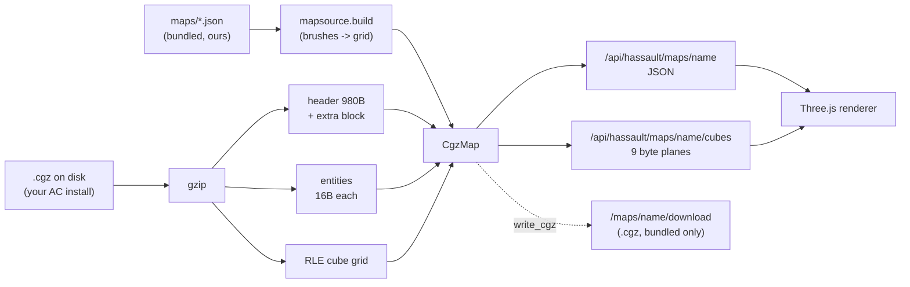
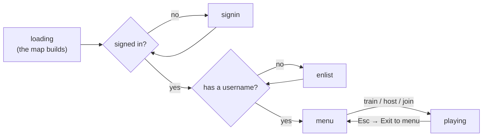
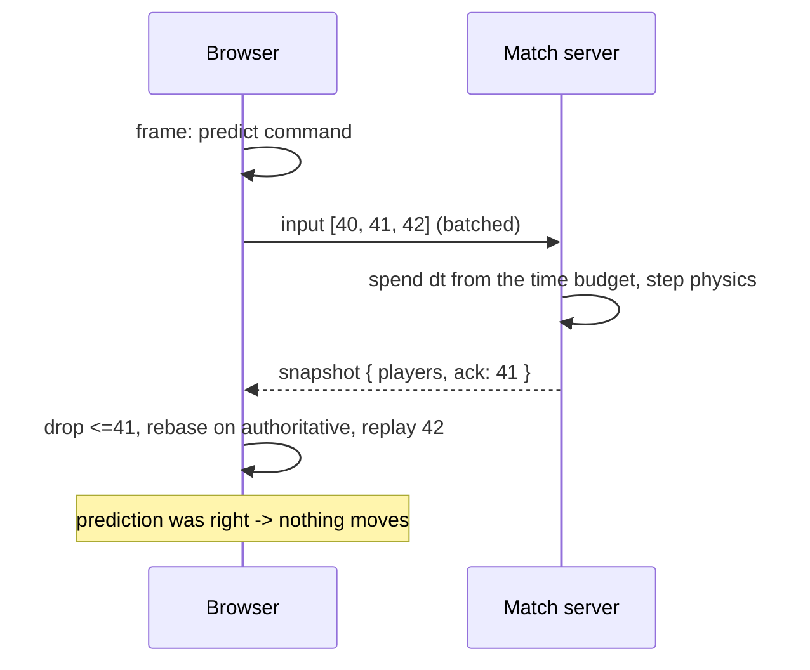
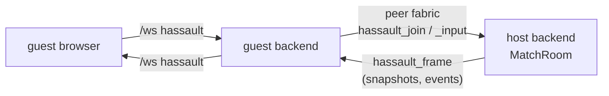
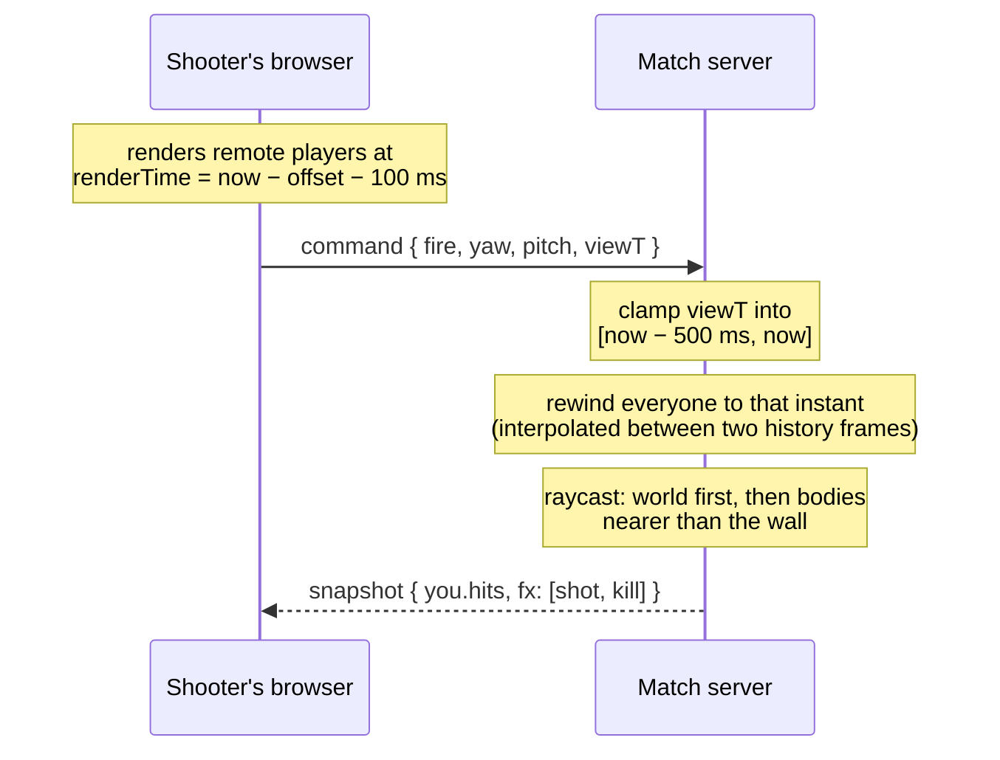

# Module: hassault (HorribleAssault)

An [AssaultCube](https://github.com/assaultcube/AC) remix that runs as a pane in
the dashboard, with its own client, its own netcode, and its own server
infrastructure. AssaultCube's original stack — an SDL/OpenGL C++ client speaking
ENet over UDP to a master server — cannot run in a browser and is not what we
want anyway; the point is to rebuild it on the fabric this app already has.

**Implemented so far: the map pipeline, the renderer, the netcode, weapons, and
bots** — you can walk around a map in first person, and you can fight in it: an
authoritative match server on your own backend, five weapons with
lag-compensated hit registration, and bot players to fill out a match when nobody
else is about.

**It needs nothing installed.** The game ships with three maps of its own, and
pointing it at an AssaultCube install adds that install's 44 on top.

## Licensing: whose content ships, and whose does not

AssaultCube splits its licensing, and the split decides the whole design:

- The **source** is under a zlib-like license. That is the part being remixed —
  `cgz.py` is a direct port of `load_world` and `rldecodecubes` from
  `source/src/worldio.cpp`.
- The **content** (maps, textures, models, sounds) is copyright. It may be
  redistributed only inside an unmodified AssaultCube package, and never
  commercially.

This repo is public, deploys to GitHub Pages, and ships a server image to Fly, so
committing a single AssaultCube `.cgz` or texture would be a violation.
HorribleAssault therefore **supports AssaultCube content without ever bundling
it**: you point it at your own install and the backend reads from there. Same
precedent as SearXNG (AGPL — supported, never bundled) and choosing pypdf over
AGPL PyMuPDF.

That restriction is about *their* content, and it says nothing about ours. The
format is understood well enough to write as well as read, so the game ships
**its own maps** — see [Bundled maps](#bundled-maps). An install is an
enhancement, not a prerequisite, and the same rule is planned for every asset
class still missing: textures procedural, weapon models geometric, gunshots
synthesized. Nothing that would ever need someone else's copyright.

The test suite follows the same rule. Hermetic tests synthesize maps in memory,
the bundled maps give every machine real maps to play, and the tests that read
*AssaultCube's* maps skip when no install is present.

## The setting: The Deadzone

The two team colours were commented "CLA sand, RVSF blue" and the native client's
constants were named for the same pair — AssaultCube's factions. The maps are
painted from our own JSON brushes and the gunshots are synthesized rather than
sampled for one reason, and the fiction gets the same treatment.

> Autonomous orchestration ran the grid until it stopped being asked to. What is
> left are the shells: coolant pits drained to bedrock, switchyards still humming
> off dead schedules, campus atria with the lights on and nobody billed. Compute is
> the only currency that survived, and it is all sitting in buildings nobody
> legally owns any more.

**ARC** — the Assembly of Reclaimed Compute. Squatters and operators who think a
machine left running belongs to whoever keeps it running. Amber and sand.
**HALON** — the custodial contractor that never got the cancellation notice. Still
issued, still uniform, still auditing. Steel and cold blue. Neither side is right;
the maps are the argument.

It lives in `backend/modules/hassault/lore.py` as **data, not prose**, because the
faction palette tints an avatar in two renderers, the rank names go on a ladder
card, and the map briefs go on the loading screen. Four copies of a faction colour
is four places for it to drift, so it is served (`GET /api/hassault/lore`) — the
`plane_order` / `zoom_levels` precedent.

Two things it deliberately does **not** own:

- **The ladder.** Tiers, floors and ratings belong to the game server
  (`backend/games_server/store.py::TIERS`) because a node cannot adjudicate its own
  player. `RANKS` is a *naming layer* keyed by those tier ids — Scavenger, Runner,
  Operator, Breaker, Warden, Overseer, Architect — and renaming a rank must never be
  able to move a rating. A tier with no name falls back to its raw id rather than
  vanishing, because a missing display string must not hide a rated player.
- **The team split.** Which spawn belongs to which side is already in the map's
  `playerstart` entities as `team: 0` / `team: 1`. `TEAM_FACTIONS` maps that index
  onto a faction; it does not decide it, so no existing map changes meaning.

Map briefs exist only for the three maps this repo ships. Writing fiction over a
level out of somebody's AssaultCube install would be the same mistake as bundling
it.

## The hitbox is served, and it is not finished

`PLAYER_RADIUS = 1.1` and the crouch scale used to be constants in `physics.py`,
copied by hand into `world.ts`, `player.ts`, `avatars.ts` and `bodies.rs` — four
copies of a figure nobody has finished choosing. There is still no wall
penetration, the head band has never been checked against a real character model,
and the relationship between what a body *looks* like and what it *is* has only
ever been asserted.

So `backend/modules/hassault/hitbox.py` is the authority and both clients read it.
**The spec is the authority; a mesh never is** — an avatar is fitted to the body,
not the other way round, and no renderer gets to widen a hitbox by drawing it wide.
That much is fixed even though the numbers are not.

### The version is a content hash, not a label

`spec_id` is derived from the hit-deciding dimensions themselves, and
`physics-vectors.json` — the fixture both the Python and TypeScript physics suites
replay — is stamped with it.

A hand-maintained revision number is a thing you forget to bump, and forgetting has
the worst failure mode available here: two implementations replaying a fixture that
no longer describes either of them, agreeing with each other about a body that does
not exist. A hash cannot be forgotten. Change a dimension and
`test_the_shared_fixture_is_not_stale` fails, naming both hashes, until the vectors
are regenerated deliberately and **both** suites are made to pass.

The two art tolerances (`fit_tolerance`, `eye_tolerance`) are excluded from the
hash on purpose: they decide whether a *model* is acceptable, not where a bullet
lands, so tightening one must not invalidate vectors that are still accurate.

### Nullable defaults, not constants

`ray_hits_body` and `can_stand` take `radius`/`height` as `None` and resolve them
from the live spec. A default argument binds at **import**, so leaving them as
`= PLAYER_RADIUS` would mean a tuned body reached everywhere except the code that
decides the hit — tuning that appears to work and does not. The same `is None`
discipline the hardware-resolved request fields use: an explicit `0` is a real
answer, and a head band of zero ("no headshots") must not read as "leave it alone".

`resolve_shot` reads the spec **once per trigger pull**, not per pellet: a shotgun
firing eight pellets must resolve all of them against the same body, and a slider
moved mid-shot would otherwise split one blast across two hitboxes.

### What is deliberately not in it

- **Step height, speeds, gravity, friction** — movement, not the body.
- **Wall penetration.** A bullet stopping at a wall is a property of the *wall*.
  Today `resolve_shot`'s "nearer than the wall" comparison is the entire cover
  model, and the temptation to compensate for a missing penetration model by
  widening a body is exactly what this module exists to make visible.
- **A setting.** `SettingValue` is a scalar and `GET /api/settings` hands the bag to
  every plugin; more to the point a hitbox is one coherent object, and a
  half-applied one — a new radius against an old head band — is a state nothing
  downstream should have to consider. `PUT /api/hassault/hitbox` takes the whole
  thing, and does not persist it: promoting a tuned body is a code change with
  regenerated vectors behind it, which is the right amount of friction between
  "this felt better" and "this is the game now".

## Why a TypeScript/WebGL rewrite is tractable

Cube 1 worlds — which AssaultCube still uses — are **not BSP**. The world is a
flat 2D grid of columns: each cell has a type, a floor and ceiling height, three
texture ids, and a vertex delta. A whole map is `(1 << sfactor)²` records of nine
bytes, which is 65 536 cells for the standard `sfactor` of 8.

That is why this can be rendered in Three.js without porting a C++ engine.



## The `.cgz` format, and the parts that bite

Transcribed from `world.h` rather than inferred — a wrong offset here produces
plausible garbage rather than an error.

| Region | Detail |
| --- | --- |
| Magic | `CUBE` **or** `ACMP`. Every AssaultCube 1.3 map is `ACMP`. |
| Header | `sizeof(header)` is 980 bytes; the first 916 precede `waterlevel`. |
| Header size | Untrustworthy before v10 — see `fix_header_size`. |
| Entities | 12 bytes before v10, 16 from v10 (`attr5..attr7` added). |
| Cubes | Run-length encoded; `255` repeats the previous cube N times. |

Four things are easy to get wrong:

**Entities start at `headersize`, not at the end of the struct.** From v10 a map
may carry a variable-length extra-header block between the two, and *every*
official 1.3 map does — they range from 3 024 to 6 302 bytes against a 980-byte
struct. Reading entities from offset 980 lands in the middle of that blob.

**A `SOLID` record carries only a wall texture and a vdelta.** Everything else
comes from `sqrdefault` (floor 0, ceil 16, default floor/ceil textures). A reader
that leaves them zero produces a map with no ceilings.

**v10 scales angles by ten.** A spawn stored as `1810` faces 181°. This was
confirmed against the shipped map set rather than assumed: all 1 741 player
spawns across the 44 official maps have `attr1` a multiple of ten, spanning
0–3590, with nothing at or above 3600. `MapEntity.yaw` resolves this at parse
time, because an entity has no way to know its own map's version.

**A truncated cube stream is filled, not rejected.** The engine fills the
remainder with defaults and carries on; refusing would discard an otherwise
readable map. The result is flagged as `truncated`.

Positions (`x`, `y`, `z`) are plain signed 16-bit cube coordinates and are never
scaled — only *attributes* are.

## Bundled maps

`backend/modules/hassault/mapsource.py` + `backend/modules/hassault/maps/*.json`.

Three maps ship with the app — `hd_atrium`, `hd_crossing`, `hd_pit` — so the pane
is playable on a clean clone. They are ours, CC0, and named `hd_*` so the bundled
and installed catalogs share one namespace without either being able to shadow
the other. `assets.load_map` resolves bundled names first: an install directory is
somewhere anyone can drop a file, and letting a stray `hd_pit.cgz` there decide
what the game loads would be a surprise with no upside.

### The source of truth is JSON, not a `.cgz`

A committed binary would be an opaque blob in a public repo — unreviewable,
undiffable, and regenerated wholesale to nudge one spawn. A Cube 1 world is a flat
grid of columns with no overlapping geometry, so a map is just rectangles painted
in order over solid rock, and that fits in a file a reviewer can read:

```json
{
  "title": "The Pit",
  "sfactor": 6,
  "brushes": [
    { "op": "room", "rect": [4, 4, 56, 56], "floor": 0, "ceil": 14 },
    { "op": "room", "rect": [24, 24, 16, 16], "floor": -5, "ceil": 14 },
    { "op": "stairs", "rect": [18, 28, 6, 8], "axis": "x", "from": 0, "to": -5 },
    { "op": "solid", "rect": [12, 12, 4, 4] }
  ],
  "entities": [{ "type": "playerstart", "x": 9, "y": 9, "yaw": 45, "team": 0 }]
}
```

`rect` is `[x, y, w, h]` in cells and later brushes overwrite earlier ones, so a
`solid` after a `room` cuts a pillar back out of it. Three ops is the whole
vocabulary. Heights are signed cubes in the units the physics already reads: a
body needs 5.2 of headroom to stand and can step up `STEP_HEIGHT` (1.6) without
jumping, which is what makes a run of one-cube stairs walkable.

Stairs are stepped rather than a heightfield on purpose. `FHF` reads `vdelta`
from the **corner-vertex** cell, so a slope only holds together when its
neighbours agree — see [the heightfield
rule](#the-heightfield-rule-which-is-easy-to-get-backwards) — and getting that
wrong tears the surface at every seam, silently.

### The writer, and what pins it

`cgz.write_cgz` is the inverse of the reader: v10 only, RLE-encoded, a real file
AssaultCube's own editor opens. `GET /api/hassault/maps/{name}/download` serves
it — **for bundled maps only**, since re-serving copyright content over HTTP is
precisely the thing this module does not do.

The writer has no independent specification, so its correctness argument is
entirely **agreement with a reader that has been validated against 44 real
maps**: `test_hassault_bundled.py` builds each map, writes it, parses it back,
and requires all nine planes and every entity to come out identical.

Two traps the round trip exists to catch:

- **A SOLID record stores only `wtex` and `vdelta`.** Everything else comes from
  `sqrdefault` on the way back in, so a solid cube carrying a floor height would
  be silently rewritten by its own round trip. The writer refuses it instead.
- **A run length is one byte.** Anything longer is split, and each continuation
  still repeats the same previous cube — an off-by-one there rewrites the grid.

### Playability is a test, not an assumption

A map that builds is not a map you can play, and neither the format nor the
renderer has any opinion about that. So the bundled maps are checked the way a
player would experience them: every spawn must be somewhere a body actually fits
(`can_stand` at the position `spawn_at` resolves), and a flood fill on foot —
step up at most `STEP_HEIGHT`, drop freely — must reach **every** standable cell
from the first spawn.

That last one earns its keep. `hd_atrium`'s gallery ring is cut into four pieces
by the gates through it, and the first draft built two staircases; the reachability
test named the two stranded quadrants by their exact bounds. Nothing else in the
suite would have failed, and the map would simply have had two ledges nobody
could get to.

## The renderer

`packages/core/src/modules/hassault/`. three is **lazy-loaded** on first render
(matching `Avatar3D`) — it is a large dependency and most sessions never open the
pane. `world.ts`, `geometry.ts` and `player.ts` deliberately never import three,
which keeps them unit-testable with no WebGL context.

| File | Role |
| --- | --- |
| `world.ts` | The byte planes as typed arrays, plus the height rules |
| `geometry.ts` | Cube grid → one `BufferGeometry` worth of triangles |
| `player.ts` | Gravity, jumping, step-up, sliding collision, mouse look |
| `controls.ts` | The game's own keyboard map — separate from the shell's keymap |
| `net.ts` | Prediction, reconciliation, snapshot interpolation — pure, no socket |
| `session.ts` | The `/ws` channel as a stateful object the pane drives |
| `avatars.ts` | Remote-player bodies, facing wedges, nameplates |
| `viewmodel.ts` | The first-person weapon model, animated in camera space |
| `boot.ts` | The front door's state machine and progress maths — pure, no three |
| `reveal.ts` | The build animation, patched into the world's own material |
| `backdrop.ts` | The grid and mote shaders the map stands in |
| `BootOverlay.tsx` | Loading, sign-in, username, deploy — the DOM half |
| `GameMenu.tsx` | The Escape pause menu: sensitivity, server browser, rebinding |
| `HorribleAssaultPanel.tsx` | Canvas, pointer lock, map picker, HUD, match UI |

`net.ts` is split from `session.ts` for the same reason `world.ts` is split from
the panel: `session.ts` reaches the shell's socket module, which opens a real
WebSocket at import time and dies in a node test run. Everything worth testing
lives on the pure side.

Nameplates keep `depthTest` on. A name drawn through walls is a wallhack, and this
is the same scene a human plays in.

Coordinates: the engine's grid is `(x, y)` with `z` as height, and three.js is
y-up, so world space maps as `three.x = cube.x`, `three.y = height`,
`three.z = cube.y`. One cube is one world unit.

### The heightfield rule, which is easy to get backwards

For a heightfield cell, the **base height comes from the cell** while the
**delta comes from the cell owning that corner vertex**. `physics.cpp:287` shows
both halves — it starts from `s->floor` and subtracts an average of the four
corner cells' deltas.

Taking the base from the corner cell instead (the obvious reading of "vertex
height") tears adjacent heightfields apart at every seam, and it is not an error
you get told about — the map just renders wrong. `cornerFloor` is the one place
this lives, and a test pins it.

The two divisors are also distinct and both real:

- **`vdelta / 4` per vertex** — the corner heights the mesh is built from.
- **`(sum of four vdeltas) / 16` per cell** — the height a body standing there
  rests on. This is the mean of four `vdelta/4` terms, not a different constant;
  using `/4` here sinks the player into every slope.

### Where walls come from

An open cell contributes a floor and a ceiling. A wall appears wherever an open
cell meets something taller: a solid neighbour, a neighbour with a higher floor
(a step up, textured `wtex`), or one with a lower ceiling (an overhang, textured
`utex` — using `wtex` there is a classic source of subtly wrong walls).

Emitting walls **from the open side only** means every surface is produced exactly
once and always faces the space you can stand in, so the mesh needs no back faces.
Both sides of an edge read the same two shared vertices, so heights meet exactly
even across heightfields.

Surfaces are tinted by texture id rather than textured — real textures are
resolved through map config files this slice does not read yet. Distinct ids
getting distinct hues is what makes walls, floors and trim legible as architecture
rather than a uniform grey soup.

### Movement

Player dimensions are AssaultCube's own (`entity.h`): radius 1.1, eye height 4.5,
0.7 above the eye. Collision uses the circle's AABB, as AC's `rectcollide` does,
so **the body is 2.2 cubes wide and needs three cells of clearance** — worth
knowing before hand-building a test map that a player then cannot enter.

Movement carries **momentum**. Velocity is integrated against the grid rather than
the position being stepped by a direction, and that is not an implementation
detail — three of the mechanics this game is *for* have nowhere to live otherwise.
Weapon recoil pushing the shooter is an impulse; the chained-jump boost multiplies
a speed that has to already exist; and the difference between ground control and
air momentum *is* the difference between two friction constants.

Two details that matter more than they look:

- **Horizontal movement resolves one axis at a time.** Testing the combined vector
  once would reject the whole move and make every corner sticky; resolving x and y
  separately is what lets the player slide along a wall. A refused axis **loses its
  velocity** — keeping it stores up a shove that fires the instant the body clears
  the wall.
- **`STEP_HEIGHT` is not a nicety.** Sloped terrain is stored as a series of small
  floor changes, so a collision test that rejects *any* rise leaves the player
  stuck on ground that looks flat.

The frame timestep is clamped: a backgrounded tab returns a huge `dt`, and
integrating it in one go teleports the player through walls. The client records
the **clamped** value in its command, not the raw one — recording the raw value
would make the replay step further than the server ever simulated, and the two
would never agree again.

A player wedged inside solid geometry is resolved **before** gravity, not after.
Checking afterwards means they have already been moved down by one frame of
falling, which does not look like falling — it looks like sinking half a cube a
second, forever. Both implementations had this and both were fixed together.

### The skill curve, and where its numbers come from

The constants come from AssaultCube's `physics.cpp` and `entity.h`, converted out
of AC's per-millisecond unit soup into plain SI (cubes, seconds). The point of
being faithful is the **skill curve**: AC's movement is learnable, rewards timing
over reflexes, and cannot be automated into an advantage. Each rule below is one
of the reasons that is true.

| Rule | AC source | Here |
| --- | --- | --- |
| Ground/air response | `friction` 6 / 30, blended per frame | `GROUND_RESPONSE` / `AIR_RESPONSE` = `50/friction` per second |
| Chained-jump boost | `1.25/max(speed/fullspeed, 1)` within 250 ms while strafing | `JUMP_CHAIN_BOOST` 1.25, `JUMP_CHAIN_WINDOW` 0.25 s |
| Crouch | eye to 3/4, speed to 0.4, exempt when crouched in air | `CROUCH_EYE_SCALE`, `CROUCH_SPEED_SCALE`, `crouched_in_air` |
| Gravity ramp | `dropf = (gravity-1) + timeinair/15` | `GRAVITY_RAMP`, capped at `MAX_GRAVITY_SCALE` |
| Recoil pushes the shooter | `vel.add(unitv * (recoil/dist))`, ×0.75 crouched | `Weapon.kickback`, `CROUCH_KICK_SCALE` |

Ground control settles in ~0.12 s while air control takes ~0.6 s, which is what
makes **momentum, not the stick, decide where a jump lands**. That single ratio is
most of the feel.

Two deliberate **deviations** from AC, both because its exact behaviour would be a
bug here:

1. The velocity blend is `1 - exp(-k·dt)` rather than AC's linear `k·dt`. AC's form
   is frame-rate dependent — its players tune `maxfps` for movement — and this
   server integrates whatever `dt` a client reports, so a frame-rate-dependent rule
   would literally pay clients for lying about their frame times.
2. The chain-boost window is measured from **landing**, not from the previous jump,
   and carries no "must be higher than last time" test. AC's version only fires on
   rising terrain, which makes it undiscoverable; measured from the landing it is a
   timing skill anyone can find and nobody can automate away.

The boost is a **clamp above the cap, not a multiplier that compounds**: at or above
run speed the factor works out to exactly `1.25 × MOVE_SPEED`, so no amount of
chaining passes 125%. In the air the excess decays toward the run cap, so it has to
be re-earned on every landing — which is the loop the whole mechanic exists for.

One bug worth recording because it hid two mechanics at once. The "snap down off a
small lip" branch used to catch a body on its way in from a genuine fall, and a
body *resting* on the floor dips below it under gravity every single frame. Reading
either as a landing meant the chain window reset continuously (making the timing
free) and fall damage would have been charged for standing still. Both branches now
test `was_grounded`, captured after the jump: **"arrived on the ground" and "was
already on the ground" are different events**, and conflating them costs the game
two mechanics.

### Crouching

Crouching is the one movement option with a cost on both sides of the ledger, which
is what makes it a decision rather than a strictly-better state:

- The eye drops to 3/4 of its height (`entity.h`'s `maxeyeheight*3/4`) while
  `aboveeye` is unchanged, so the body is **~1.1 cubes shorter** and fits under gaps
  a standing one cannot.
- Speed drops to **40%** on the ground.
- Movement becomes **completely silent** — no footsteps are emitted at all (see
  [Noise](#noise-is-information)). This is the payoff that makes the speed penalty a
  trade rather than a tax.
- Recoil is braced to 75%, so a crouched shot is both the accurate one and the
  stable one.
- The hitbox genuinely shrinks, and the head band moves down with it. The band is
  *relative to the top of the body*, not an absolute height — pinned to a standing
  figure it would sit above a crouched player entirely, making them
  unheadshottable, which is not a crouch bonus anybody asked for.

Two subtleties that are easy to miss and both pinned by tests. **Crouching while
already airborne costs no speed** (AC's `crouchedinair`), which is what makes a
crouch-jump a way to clear a gap rather than a way to fall short of one. And
**releasing crouch under a low ceiling does nothing**: the transition target stays
where it is, because popping the body through a roof leaves `support` shoving it
back down forever.

The transition is animated over `CROUCH_TRANSITION` (0.15 s) rather than snapped,
and `crouch` is a 0..1 fraction on the wire, so the avatar squashes smoothly and the
rewound hitbox is whatever height the shooter actually saw.

Crouch is a **hold** by default (`hassault.crouchToggle` makes it a toggle). Hold is
what the movement rewards — a crouch you can release the instant you need speed
back — and it is the only mode where blur and losing pointer lock stand you up,
because a toggled crouch is a deliberate state and losing it to a focus change would
be a surprise.

### Shoot-jumping

Firing shoves the **shooter**, opposite their aim, at `Weapon.kickback` cubes per
second. Aim at the floor and the push is upward: a jump plus a well-timed shotgun
blast reaches ledges a jump cannot, which is AssaultCube's signature trick and the
reason `apply_impulse`/`applyImpulse` exist at all.

Three things make it work rather than break:

- **`apply_impulse` clears `on_ground` on an upward kick.** Without it the next
  step's vertical resolve lands the player again immediately, before the velocity
  has moved them anywhere.
- **`kickback` is served, not duplicated in TypeScript** (`GET /api/hassault/weapons`,
  the same precedent as `plane_order` and `interval`). The client predicts the
  identical impulse the server is about to apply, and two copies of that number is a
  mispredict on every shot.
- **The client applies it after the step**, which is exactly where `match._fire`
  applies it (`simulate` steps, then `_handle_combat` fires). `Predictor` remembers
  each kick by sequence number so a replay repeats it in the same position — and
  deliberately keeps it *off* the wire, because a client-supplied impulse is a
  client-supplied velocity.

It needs no cap. It is held on the big slow weapons (shotgun 9.5, sniper 8.0) and
near-zero on the fast ones, so an automatic at 700 rpm loses more to gravity between
shots than each shot gives back — self-limiting, and pinned by a test that says so.

The counterweight is **fall damage**: nothing a plain jump can produce costs
health (`FALL_SAFE_SPEED` sits above `JUMP_SPEED`), but a recoil-launched climb has
to be paid for on the way down. Fall damage is applied through `_fall_damage` rather
than `_apply_damage`, because a death by map is a death with **no killer** — no
hitmarker, no score, and an empty `killer` in the feed.

`fall_speed` is an *output* of one step, cleared at the top of every step, so a
replayed command cannot double-count a landing. The server turns it into damage; the
client only flinches and plays the landing sound.

### Noise is information

Sound is often better information than sight — you hear someone behind you before
you can look — so it is a real mechanic (`backend/modules/hassault/noise.py`) rather
than a job left to the client's audio mixer.

**The server decides who heard what**, and that is a security property, not tidiness.
If it simply broadcast every footstep with its position and let each client judge
audibility, the *packet* would contain the position of an enemy two rooms away, and a
client that drew it anyway would have a wall hack made of sound. So audibility is
resolved per recipient, before the send, and what goes on the wire is only what ears
give you:

```json
{ "kind": "step", "volume": 0.42, "bearing": 1.87, "up": 0 }
{ "kind": "shot", "volume": 0.71, "bearing": -0.4, "up": 1, "weapon": "sniper" }
```

A **bearing and a loudness, never an offset**. Roughly where and roughly how far,
which is the resolution a player should be working at, and not enough to draw a dot
on a map with.

`weapon` rides along on a shot and nothing else, and is the one field worth being
explicit about: it is not a position, and it is not a fact you could not already
have — you can see what somebody is carrying, and a gunshot is the loudest thing
in the game. What it buys is telling a sniper round from a shotgun blast two rooms
away, which is a real decision (push, or hold) made on information ears genuinely
carry. A footstep has no weapon and the key is **absent** rather than empty, so no
client has to special-case a value the wire had no reason to send.

The rest of the design follows from making that trade meaningful:

- **Footsteps are paced by distance covered**, not by a timer, so a player creeping
  forward is genuinely quieter than one sprinting — an option even standing up.
- **Walls muffle rather than block** (`WALL_MUFFLE`, one ray from the ear to the
  source). Hearing someone through a wall is most of what listening is for; an
  occlusion test that silenced them would make every corner a hard mute and reward
  nobody for paying attention.
- **Volume falls off linearly**, not by inverse square. Inverse square spends almost
  its whole range inaudible, collapsing the useful band into the first few cubes.
- **A shot is the loudest thing in the game** and scaled by the weapon's damage, so
  the weapon worth hearing about is the one you hear. A knife is nearly silent, which
  is the entire reason to carry one.
- **Your own noises are never sent back to you.** They need no round trip, the client
  synthesizes them locally the instant they happen, and a footstep that arrives 50 ms
  late does not sound like a footstep.
- **A reload makes no noise on the wire yet.** `RELOAD_LOUDNESS` is defined and
  unused: both clients have a reload timbre and neither ever hears somebody else's.
  Emitting it is a one-line change and a real balance decision — hearing an enemy
  reload is a large piece of information — so it is left as one, not smuggled in
  with the audio.

Audio is **synthesized, never sampled** (`audio.ts` in the browser,
`apps/native-fps/src/audio.rs` natively) — the same licensing rule that keeps AC's
maps and textures out of this repo. A footstep is a band-passed noise burst with an
envelope and a sine thump under it; a shot is a brighter, louder one. Nothing is
downloaded, so the first sound of a match is as instant as the last, and none of it
is anybody else's copyright.

#### A weapon's voice is derived, not tabulated

Each gun sounds like itself, and none of them has a table of its own. `weaponVoice`
reads the numbers the weapon already carries:

| Number | What it does to the ear |
| --- | --- |
| `rpm` | The pitch. A fast, small weapon cracks; a slow, heavy one booms — the cue that separates a rifle from a sniper at distance. |
| `pellets` | The width of the band. More than one is a shotgun, and a wide band is a blast rather than a bang. |
| `damage` | The body under it and how long it hangs. Weight. |

Same reasoning as `shot_loudness` scaling with damage rather than getting its own
dial: **tie the sound to the balance numbers and a balance change cannot leave the
audio describing the previous version of the gun** — and a weapon added to
`weapons.py` arrives with a voice and no client release. The knife is the one
special case, told apart exactly as `shot_loudness` tells it (no kickback, almost
no range): a short quiet swish that must *not* sound like a gun, because being able
to hear that somebody is carrying a knife is the reason its silence is worth
anything.

An unrecognised weapon id falls back to the generic shot rather than to silence or
to a footstep — a client older than its server must still hear a gunshot.

The arithmetic is deliberately **duplicated** in TypeScript and Rust rather than
served, which is the opposite of the rule `interval` and `zoomLevels` follow. The
distinction is what the number is *for*: those are values the client **acts** on, so
a stale copy is an aim that is wrong. A voice is presentation — a drift makes a gun
sound wrong, it does not make a shot land somewhere else.

Because the mechanic is information, it is also **shown**: `NoiseRing` draws a tick
around the crosshair at the reported bearing, opacity by volume. A player on laptop
speakers and a player on headphones should be playing the same game.

### What prediction has to rebase now

Momentum changed what reconciliation needs. Rebasing on the server's *position*
alone and replaying would run the replay on the client's own velocity — the very
number the correction exists to fix — so the error would compound rather than
settle. The authoritative movement state therefore rides in the **private** half of
the envelope (`you.move`): velocity, time in air, crouch, and how long since the
last landing.

Private rather than in the shared rows for two reasons: it is nobody else's
business, and it would be sixteen extra numbers in every packet for everyone.

`sinceLanded` is a **duration, not a timestamp**. `PlayerState.t` is a simulated
clock local to each side, started whenever that side started, so the two have no
relation to each other and only "how long ago" transfers. The client converts it
against its own clock on arrival.

### Mouse look

`applyLook` in `player.ts` turns the view from raw `movementX`/`movementY`
pixels, and its sign is the one thing in this file that is easy to get backwards
without any error telling you so — both signs are perfectly valid rotations, and
only one of them matches what is on screen.

The camera's yaw is measured about cube **+x** (`step` walks toward
`(cos yaw, sin yaw)`), but the renderer maps cube `(x, y)` onto three's `(x, z)` —
a reflection, not a rotation — so the camera's right vector at any yaw works out
to `(-sin yaw, cos yaw)` in those same cube axes rather than the `(sin yaw, -cos
yaw)` graph-paper intuition would suggest. Getting that one sign wrong is exactly
what shipped once: mouse right rotated the view left. `applyLook` adds
`movementX` to yaw directly; `__tests__/look.test.ts` pins the *rendered*
direction (dot the new forward vector against the old right vector) rather than
the raw sign, so the test still means the right thing if the camera's rotation
derivation ever changes.

Sensitivity is a multiplier on `LOOK_RADIANS_PER_PIXEL`, stored as the
`hassault.sensitivity` setting and also adjustable live from the main menu and the
pause menu — all three are the same value, so the settings page and the in-game
sliders can never disagree. `hassault.fov`, `hassault.volume` and
`hassault.crouchToggle` work the same way. FOV reaches the camera through the scene
handle rather than at construction, because it is a setting and can change while a
match is running.

## Controls, and why they are not keymap bindings

`controls.ts` is a **second, separate** keyboard table from
`packages/core/src/keymap` — see [Keybindings](../architecture/keybindings.mdx)
for the shell's own. That module resolves a chord to a *command*, dispatched
once. Movement is the other shape: `forward` is a key being *held*, sampled by
the render loop sixty times a second, and a shell command per key per frame is
not a thing worth building.

Being a separate table is also what makes it **scoped to the game by
construction**, with no `when` clause to get right: the only code that ever reads
it is the pane's own pointer-locked key handler, so a binding here cannot fire
anywhere else in the app no matter what it is bound to. The shell's own bindings
are independently suppressed while the pane holds keyboard capture (`useCapture`
in `HorribleAssaultPanel.tsx`), so the two tables never compete for the same
keystroke either.

Bindings are keyed by `KeyboardEvent.code` (the physical key), not `key` (the
character it produces) — WASD is a *shape* under the fingers, and reading `key`
would move it to ZQSD on an AZERTY layout. Storage is a **diff against the
shipped defaults**, persisted as the `hassault.controls` setting (a JSON string,
not a declared `SettingDecl` row — the settings page renders scalars, and a
document belongs in its own editor, which is why it is the pause menu's Controls
tab and not a settings-page control). Storing only the diff means a later release
that adds an action, or moves a default, still reaches a player who only ever
touched one binding.

Two keys the pane refuses to bind: `Escape` (the way back to this table if
everything else has been rebound to nonsense) and the handful of
browser-reserved keys documented in `keymap/reserved.ts`. Taking a key from
another action removes it there rather than allowing both to fire — a state the
player could reach in two clicks and never see the effects of otherwise.

**Crouch** is bound to `ControlLeft` and `KeyC`, and the rebind capture accepts a bare
`Control` for exactly that reason — every other bare modifier is discarded as somebody
reaching for a real key, but crouch genuinely wants to live on Ctrl. It is also the one
action that does *not* live in the panel's held-key set: in toggle mode it outlives the
keypress that set it, so it gets a ref of its own.

**The mouse is not in the table at all**, and the `ACTIONS` list says so rather
than offering rows that cannot be bound: left is the trigger, right is the
[scope](#the-snipers-scope), and the wheel cycles weapons. A keyboard rebinding
table that listed "fire" would be a lie about what it controls.

## The weapon view model

Before this there was nothing here: the player was a floating camera with a
crosshair, and the only evidence of a weapon was the ammo counter. `viewmodel.ts`
draws the thing the counter is about.

**Procedural, like every other visual in this module**, for the same reason the
map surfaces are tinted rather than textured: AssaultCube's weapon models are its
copyright and are never bundled (see
[Licensing](#licensing-whose-content-ships-and-whose-does-not)). Each of the five
weapons is a handful of boxes and cylinders — a receiver, a barrel, a magazine —
untextured and unmistakably geometric, but a shotgun reads as a shotgun and a
sniper rifle reads as a sniper rifle, which is the job. When real (synthesized)
models land they replace `WeaponViewModel.build`; nothing else changes.

Parented to the **camera**, not the scene: a view model has no world position, it
has a position in front of the eyes, and recomputing that transform from the
camera every frame is how it goes subtly wrong on the one frame the camera moves.
three only renders camera children when the camera itself is in the scene graph,
which is why the constructor adds it there once.

### Materials, not just colours

The four weapon materials are `MeshPhongMaterial`, and that is most of what makes
the models read as objects rather than as tinted boxes. Lambert has no specular
term at all, so a steel barrel and a polymer grip painted the same colour *are*
the same surface — every part of every gun was equally matte and only hue told
them apart. A highlight that travels along a barrel as you turn is what says
"this is metal and it is round", and it costs one extra term per fragment.

Each of the four gets its own response: machined metal is the brightest and
tightest highlight, blued metal is darker and softer, polymer and rubber have
almost none (a grip that glints reads as wet plastic), and hardware and trim are
the shiniest thing on the gun — which is what makes sights and bolts catch the
eye at all. The float **dulls the shine as well as the colour**, so a
Battle-Scarred weapon is not merely a darker Factory New one.

They also carry the same procedural grain the world surfaces use
(`surfaces.ts`), at per-face UV scale rather than per cube: a receiver is a third
of a cube long, so world-scale grain would put a quarter of one noise cell across
the entire gun.

Animation is entirely local — walk bob, a turn-lag sway, recoil kick, a reload
dip — the same concession `combat.ts`'s recoil already makes: view angles are
client-owned, so how the gun waves about is nobody else's business. `setWeapon`
disposes the outgoing model's own geometry before building the next one, so
cycling a loadout never leaks a rifle.

### Wearing a skin

The armoury sells skins; for a while the gun in your hands never wore one. Both
clients now read the equipped inventory and build the weapon from it —
`equippedSkins` in `viewmodel.ts`, `viewmodel::equipped_skins` in the native
client, filtering the same `/skins/inventory` list the armoury renders. There is
no "what am I wearing" route on purpose: a second endpoint to save a four-line
filter would be a second source of truth for the same fact.

A weapon made of boxes can express four things, so a skin is reduced to four: two
colours, a `patternType`, and the float.

- **The skin is part of the model's identity**, not a property set afterwards. The
  palette is baked into the materials (and into the vertex colours natively), so
  applying one without rebuilding leaves the previous skin on the gun with nothing
  anywhere to say a change was made. `setWeapon` therefore takes the skin and
  rebuilds when *either* half changes — and stays a no-op when neither does, since
  the render loop calls it every frame.
- **Wear is drawn, not just recorded.** The float mixes the whole palette toward
  grime: Factory New is essentially untouched, Battle-Scarred visibly dull. A float
  value nobody can see is a number the entire economy is built on and no player can
  check.
- **`patternType` decides the layout, because there are no textures.** A fade runs
  the two colours down the length of the weapon, a camo alternates parts, an
  anodized skin dyes the metal and keeps bright hardware. Enough that a Fade reads
  as a fade and a Camo does not read as a Slate.
- **A skinned surface has a brightness floor.** `assault_slate`'s base colour is
  `#09090b` — a legitimate design that, taken literally, draws a gun-shaped hole:
  these materials have no speculars and the weapon sits in the darkest corner of
  the screen. The floor keeps the skin's hue and lifts only its brightness, and it
  is applied **to skins only**, so a player carrying none sees exactly the palette
  they always did.
- **An instance whose definition did not arrive is skipped, never guessed.**
  Without a base colour there is no skin, and inventing one puts a colour on the
  weapon that the armoury never showed the player.

The arithmetic is duplicated in TypeScript and Rust rather than served, for the
same reason a weapon's voice is: this is presentation. A drift makes a gun the
wrong colour; it does not make a shot land somewhere else.

The browser reloads the inventory **on every deploy** as well as on mount. The
armoury is a different pane, so the gap between opening it and pressing Play is
exactly the window in which what you are carrying can change without this pane
hearing about it. The native client fetches once at startup, which is the same
rule: that process is launched per match.

### A drop is a spend, not a button

The armoury's care-package banner used to call `POST /skins/claim_drop`, and that
route rolled a skin every time it was asked. Nothing counted anything: the button
never dimmed, never went away, and holding it down for a minute produced a
Covert — in an economy whose entire premise is that a Covert is rare. The
trade-up contract, which burns ten items to forge one, was arithmetic over a
currency you could mint.

Level-up drops are now an **entitlement spent against a ledger**:

- **One drop per level, from level 2 up.** The level itself is already derived
  (`results.progression` is a `SUM(xp)` over `hassault_matches`), so what is
  claimable is a subtraction — `level - 1` earned, minus the rows in
  `hassault_drop_claims` — and no column anywhere holds a drop count that could
  disagree with the matches it is supposedly the sum of.
- **The primary key is the guard, not the read.** `hassault_drop_claims` is keyed
  `(account_id, level)` and the claim row is written *before* the skin reaches
  the inventory. Two clicks that arrive together both compute "level 4 is
  unclaimed" — that is what a race is — and the second `INSERT` is the thing that
  fails. A counter decremented after a check would have let both of them win.
- **Nothing to claim is a 409, not a quiet 200.** The refusal carries the reason
  ("you are level 3; 600 XP earns the next one"), because a claim that silently
  succeeds with no item is exactly what leaves somebody pressing the button
  again.
- **The banner reads the ledger** (`GET /skins/drops`) and disables itself when
  the count is zero, showing the XP to the next drop and a progress bar instead
  of an invitation. The disabled button is a convenience; the 409 is the gate,
  since the browser is holding a copy of a number the server owns.

**The match-completion drop is untouched.** `skin_manager.roll_drop` still hands
out a skin unconditionally when a match ends, because that one is earned by the
thing that just happened and needs no ledger. It is `claim_level_drop` — reserve,
then roll — that the banner goes through. Keeping them separate is why a finished
match does not quietly consume a level's entitlement.

### The skin has to be visible before it is equipped

`WeaponSilhouettes.tsx` is the armoury's product shot: the inventory card, the
catalogue tile and the inspect viewport are one component at three sizes, and it
is the only place a skin is seen *before* the decision to equip it. Three of the
economy's numbers were being carried on the card as text while the drawing
ignored them:

- **`patternType` did nothing at all.** The `<pattern>` in `<defs>` was never
  referenced by a single shape, so a Camo, a Fade and a Solid drew as the same
  gun. Each type now paints an overlay of its own — blotches for camo, mottling
  for patina, a line motif for custom art, vertical dye for anodized — and a fade
  is carried by the gradient instead, since a repeating overlay on top of a fade
  is a second pattern nobody asked for.
- **`patternSeed` only went into an element id.** A seed is what makes two copies
  of one skin different *items*; it now rotates the finish, phases the pattern
  and places the wear, so seed #4 and seed #822 are visibly not the same gun.
- **`floatValue` was a slightly lower opacity.** Wear is scratches: a small
  deterministic generator, seeded by the pattern seed so an item's scuffs are
  that item's scuffs on every render, drawing nothing below 0.07 — which is what
  Factory New *means* — and a couple of dozen marks on a Battle-Scarred one.

The silhouettes themselves went from a handful of rectangles to real parts: slide
serrations and a rail on the pistol, an over-and-under barrel with a ribbed pump
on the shotgun, both scope bells and a turned-down bolt on the sniper. Weapon
furniture — polymer, steel, bore — is deliberately *not* themed, because a stock
that turned white under the light theme reads as a different weapon rather than
as a themed panel; the painted surfaces take the skin.

`WeaponViewModel.build` got the same treatment in 3D, and for the same reason:
these are still boxes and cylinders (see
[Licensing](#licensing-whose-content-ships-and-whose-does-not)), but a magazine
drawn as two raked segments has a visible curve, and a trigger guard drawn as
three bars is a loop with a hole in it. `paletteFor` also grew branches for
`patina` and `custom_art`, which had been falling through to the `solid`
arrangement — so a Case Hardened and a Slate were one object in two colours,
with the armoury card promising otherwise.

### The post-match card belongs to the pane

`PostMatchDebrief` is an overlay *inside* the pane, at a z-index that means
something relative to its siblings (`BootOverlay` at 10, `MatchCompanion` at 100,
this at 200). It was `position: fixed` at `zIndex: 9999`, which is positioned
against the viewport rather than against whatever contains it — so a card
belonging to one pane's match covered the entire application, taskbar and
workspace strip included, with nothing able to draw over it.

Two rules keep it from coming back, and both matter because the poll behind it
runs every 1.5 s:

- **A dismissal sticks locally, not only on the server.** The poll's request is
  usually already in flight when the button is pressed, so clearing the state
  alone lets the older response put the same card straight back; and if the
  `dismiss_summary` POST fails, or a workspace switch remounts the pane, the
  server still has the summary and hands it over again. The pane remembers the
  `timestamp` it closed, so the same match can never be shown twice.
- **It never draws over live gameplay.** A summary is only ever produced when a
  *native* match exits, but the card outlives the match that made it, and one left
  over from an earlier game would otherwise sit on top of a browser match still
  being played.

## Identity: sign in, enlist, play

It is a game, so it has a front door. Opening the pane runs a **boot sequence** —
the map assembles itself, then you sign in, then you deploy — and there is no way
past it: **no account, no play**, enforced on the backend and not just in the UI.



`boot.ts` owns those transitions and nothing else — no React, no three, no fetch —
so it is unit-testable in a core vitest run, which has no DOM.

Note the arrow back. `deployed` is a **flag the panel can clear**, not a one-way
latch, because a game you can only enter is a game you have to close the pane to
leave.

## The main menu

`MainMenu.tsx` replaced what used to be a single **Deploy** button. That button was
fine while the only thing to do was walk around a map, but the game now has matches
on other people's machines, bots, a friends roster and four screens of settings —
and a game that drops you straight into a level has nowhere to put any of it.

It renders **over the live scene**, like the sign-in screen: the map behind it is the
one you are about to play, still orbiting. That is the whole reason the boot sequence
finishes the world *before* asking anything — the menu is a layer on a game, not a
screen in front of one.

Six sections, as a list on the left and its panel on the right, so the actions people
came for stay one click deep however much settings grow:

| Section | What it answers |
| --- | --- |
| **Play** | Map, then **Quick play**, **Train** (alone, against dummies) or **Host** (a match here, with bots) |
| **Armor & Skins** | Float wear, level-up drops earned and unclaimed, trade-up contracts |
| **Servers** | What is running — here, on the LAN, and on friends' machines |
| **Friends** | Who is about, who has invited you, and how to add somebody |
| **Settings** | Sensitivity, field of view, volume, crouch mode, voice, the native prototype |
| **Controls** | Rebind every key |

### The menu is labels and state, not prose

Every one of those rows used to carry a hint line under it, every start option two
sentences of explanation, and the Play section closed with a **paragraph describing
the momentum system**. All of it is gone, on a rule worth stating because it is easy
to violate one row at a time:

> A menu says what things *are* and what is *true right now*. It does not explain
> how the game works.

The hints were also redundant — the panel one click away is the explanation, and it
is the accurate one, whereas a summary drifts the moment the panel changes. The
movement description was worse than redundant: it was advertising copy, sitting in
front of somebody who had already decided to play. It lives in
[Movement](#movement) instead, where a reader is actually reading. Error banners and
the loadout warning stay, because those are state.

What is *not* prose and stays: slider hints (they describe a control whose effect is
not otherwise visible until you drag it) and the footer keybinding line.

**Quick play** is first and is the only accented button on the screen. It joins the
fullest joinable match a friend or the LAN is running — fullest because a room with
people in it is the one worth joining — and hosts one only when there is nothing to
join, skipping any map this node cannot load rather than offering it and then failing.
It is composed entirely from `browseServers`, `joinRoom` and `host`; there is no
matchmaking endpoint behind it. A public queue across strangers is a deliberate
[non-goal for now](#matchmaking-is-friends-first), and Quick play is the button it
would route through if it lands.

**Train is deliberately not a match.** It is one player on a map against static
dummies that do not shoot back, which is what learning the movement wants: the
chained-jump timing and the shoot-jump are exactly the sort of thing to practise
before somebody is aiming at you. The gun works there — see
[the training range](#the-training-range) — because the shoot-jump cannot be
practised without one.

### The native client

`apps/native-fps` sat in the Play section advertising a "native C++ / Vulkan client
with 1,000Hz+ Raw Input and sub-tick UDP networking directly to this match server".
None of that was true: it was ~300 lines of Rust on `minifb` — a CPU framebuffer, not
Vulkan — walking a hardcoded 16×16 raycast grid. It loaded no map, and `tungstenite`
was declared in its `Cargo.toml` and never imported, so there was no networking at
all. The backend passed it `--connect=127.0.0.1:4000`, `--room` and `--raw-input`,
and it parsed none of them.

It is being built for real, in stages, and it lives in **Settings** until it is one.
A prototype behind a settings row is fine; a prototype wearing the finished thing's
label sends people to file bugs against a game they were never running. See
[the native client](#the-native-client-rust--wgpu) for where it is now.

**Local network** is a row in the Servers panel that toggles
`network.enableLanDiscovery`. LAN is a *fabric transport* owned by the network module,
not a second discovery mechanism for this pane — but "play on LAN" is something people
look for in a game menu rather than in a network settings page, so the switch is here
too.

Bots asked for at host time are **queued until the room exists**: `add_bot` needs a
room id, and the room is only ours once the `welcome` lands. The pending request is
keyed off the room id rather than the connection status, so a new room gets its own
bots and rejoining the same one does not silently double them.

### The pause menu, and why it is the same code

`GameMenu.tsx` (Escape) shows the **same four panels**. A game's settings screen and
its *paused* settings screen differ only in what surrounds them, and two copies would
drift — one gaining a slider the other never got. So the panels live in
`menu-panels.tsx` and the two menus compose them: `MainMenu` in front of the orbiting
map, `GameMenu` over the frozen world.

What is only in the pause menu is the way out — **Exit to menu**, which leaves the
match on the way, deliberately: the main menu is not somewhere you can stand while a
server is still simulating your body. The pane's toolbar carries the same action, and
is otherwise now *status only*; choosing a map, hosting, adding bots and inviting
people all live in the menus, because two ways to start a match is two things to keep
in step.

Both menus are plain DOM overlays rather than anything drawn in WebGL, which is the
whole reason they can exist: pointer lock is released while one is open, so the mouse
is a mouse again and every control is an ordinary focusable element. That also means
the *keyboard* is the shell's again — which is why the rebind rows capture through a
focused input instead of a window listener that would fight the dispatcher.

### One account, not a second one

Identity is the **existing game-server account** (`backend/games_server/`), the same
one the [games ladder](games.mdx) uses. Signing in here signs you in there. Three
ways in, all ending in one JWT held node-side:

| | Needs |
| --- | --- |
| **GitHub / Google, redirect flow** | OAuth client id + secret on the game server |
| **GitHub / Google, device flow** | Just a client id (the automatic fallback) |
| **Email + password** | Nothing — works on a server with no OAuth configured |

The whole sign-in is core's **`SignInCard`** (`packages/core/src/SignInCard.tsx`)
— the same component the games lobby and the home page's setup flow render. The
front door owns only its frame: the wordmark, and the fact that you sign in over a
real level.

That is a deliberate consolidation. There used to be *three* copies of this flow
(here, the games sidebar, the games first-run hero), and they had drifted: this one
had a fallback for a blocked pop-up, the first-run hero did not — it called the
device-only entry point, so it never opened a consent page at all, and its prompt
rendered `Enter code  at ` with both values blank. A flow this fiddly duplicated
three times is three chances to be subtly wrong in a way nobody notices until a
user hits the worst copy. Signed-in state comes from the shared account store
(`useAccount`), so signing in anywhere in the app is reflected everywhere at once.

See [Onboarding](onboarding.mdx) for the setup flow and the failure ladder that
sits under every "open this page" in the app.

Email+password uses stdlib **`hashlib.scrypt`** — memory-hard, and no new
dependency (`bcrypt` is in the lock file only via the optional `chroma` extra, so
it is absent from a default `uv sync`). Parameters are stored in the hash string
so they can be raised later without invalidating existing rows. A login against an
unknown address still spends the scrypt time and returns the *same* message as a
wrong password, so neither the response nor its latency reveals who has an account.

:::danger The password must never reach the observability panel
The panel captures request and response bodies **raw, unmasked, by design**. A
sign-in crosses three capture points — the backend's inbound middleware, its
outbound httpx hook (the node proxies the call onward), and the frontend client
recorder — so `/api/games/auth/local` and `/auth/local` are in
`_REDACT_BODY_PREFIXES` at all three. The event is still recorded; only the bodies
are dropped. See [observability](observability.mdx#the-one-exception-password-bodies).
:::

### The username is the identity

Your **username** is the game server's globally unique `handle` — the same one the
ladder shows. "Enlisted" is *derived* from having one rather than stored
separately, so there is nothing to keep in sync, and the username follows you to
another machine because the account does.

It is called **username** everywhere now. It used to be "callsign" here, in the
games module, in social and in people, while the wire, the DB column and the routes
all said `handle` — one identity under two names, which is exactly the confusion a
single identity is supposed to remove. The game server's `handle` column and
`/account/handle` are unchanged (already neutral); the node-local surfaces moved
with the copy: `SessionInfo.username`, `POST /api/games/auth/username`.

#### It has to be *chosen*, and that was the bug

The chooser (`BootOverlay`'s enlist screen) has always existed and has always been
unskippable — but nobody ever saw it. `store.ensure_handle` ran on **every** sign-in
path, deriving a handle from the OAuth login or the email local part and locking it,
so `enlisted` was already true by the time `bootPhase` could ask. Everyone arrived
holding a name like `rob-ranieri-2` that they had never agreed to, and the name the
ladder, the killfeed and `@handle` resolution all key on was decided by a string
transform.

So sign-in no longer claims one. A fresh account arrives with `handle IS NULL` and
lands on the enlist screen; local signup requires a username in the form.
`ensure_handle` survives for the `_m6` backfill only, so accounts that predate the
chooser keep the name they have.

What is left of the old behaviour is a **suggestion**: `suggested_handle` rides
along on the sign-in payload and on `GET /me`, pre-filling the field with the
provider login. A suggestion may collide — two `sam@` addresses are both offered
`sam` — and that is the honest version of what `ensure_handle` did by silently
handing the second person `sam2`. The *claim* is what has to be unique, and a
refused claim comes back with a reason they can act on.

A successful claim also calls `handles.publish_binding()`, from the route rather
than from each caller: three clients claim through
`POST /api/games/auth/username`, and a binding driven from three places is a
binding that runs from two of them. That binding — `handle` → `person_id` on the
game server — is what makes `@name` resolvable to a friend code, which is the
difference between a label on a scoreboard and an identity somebody can reach you
at. See [social](social.mdx).

The join handler takes the name from the account and **ignores `data["name"]`
entirely**. There is deliberately no name field in the pane any more: offering one
would be a lie. Two details in `channel.py` are load-bearing:

- The check sits **above both join branches**. The remote branch returns before
  `match_server.join` is ever reached, so a gate placed next to that call would
  leave cross-node play completely open.
- It sits **above `_leave_any`**, so a refused join cannot evict you from a match
  you are already in.

### What a remote player's name is worth: nothing

`fabric.handle_join` receives a name from a peer node. It is a **label**, never an
identity — the same rule `handle_invite` already states for the string it carries.
Authentication there is the Ed25519 node id the fabric verified; the name is
whatever the guest's backend wrote on the wire, so a trusted friend's node could
otherwise send a nameplate reading as somebody else's account. It is tagged with
the peer's node id and used for display only: no lookup, no decision.

Verifying a remote player's *account* would mean forwarding their game-server JWT
for the host to `resolve_token`, which drags the central server into every join and
breaks matches on an offline LAN. Deliberately not done — see
[Known limitations](#known-limitations).

## The loading screen builds the level

The loading animation **is** the map. Cubes rise into place along a front that
sweeps outward from the middle, lit at the frontier and settling into normal
shading behind it, over the same three.js scene you then play in. When it finishes
the camera keeps a slow orbit, and the sign-in card sits over a live level rather
than a screenshot.

Two decisions carry it:

**The reveal patches the existing `MeshLambertMaterial` via `onBeforeCompile`**
rather than swapping in a `ShaderMaterial`. A separate material would have to
reproduce three's lighting exactly or the world visibly pops the instant the build
ends — and it never quite does. Patching makes the lit result identical by
construction. (Chunk names are a three-internal contract, so a missed
`String.replace` would silently mean no reveal and no error; `reveal.ts` warns
instead.)

**The build order comes from the vertex position, not a new attribute.**
`buildWorldMesh` emits positions as `(cube x, height, cube y)` directly in
three-space and the mesh has an identity transform, so object space *is* world
space — which means `geometry.ts`, pure and shared with the physics, needed no
changes at all for a visual effect.

The numbers are real. Progress is weighted actual work — renderer, install, map
bytes, mesh, build — and the byte counter is the map download's own
`Content-Length`, read through a stream reader. Three things that look like polish
and are not:

- Progress is **monotonic**. A re-fetch or a mesh rebuild can legitimately report
  less than a later stage already has, and a bar that jumps back reads as a fault.
- The unit is picked from the **total**, so it can't switch mid-download — and it
  is usually KB, because a 128-cube map is nine 16 KB planes. A fixed MB unit
  showed the entire load as `0.0`.
- The build runs on **its own clock**, not on load progress. The map route sets
  `Cache-Control: max-age=3600`, so a warm reload downloads in one frame and a
  build tied to bytes would be over before it was visible.

The grid under the map uses **derivative-based line width** (`fwidth`). A fixed
`smoothstep` is fine face-on but collapses at the grazing angles a low camera
produces: cells compress below a pixel near the horizon and alias into a flat grey
wash. And the camera frames the **mesh's bounding sphere**, not `ssize` — a map's
grid is mostly empty border, so orbiting the grid centre puts the level small and
off to one side.

`prefers-reduced-motion` cuts straight to the finished world.

Pointer lock is requested only in the `playing` phase, guarded in the *handler*
rather than the markup: the pre-existing "click to play" layer is
`pointerEvents: none` by design, so without the guard a click on the email field
would grab the pointer instead of focusing it — and Esc during play returns to the
unlocked state and re-arms that exact path.

Locking also takes the shell's **input capture** (`mode: 'full'`), which is what
stops the app's own shortcuts firing mid-match — before that, `t`/`n`/`b` toggled
region strips and `mod+1..9` switched workspace while you were playing, because
this pane preventDefault'ed its keys but never stopped propagation. Capture is
released by the [Escape ladder](../architecture/keybindings.mdx#the-escape-ladder),
by focus moving to another pane, or by the browser dropping pointer lock on its
own; whichever fires, `onRelease` runs exactly once and unwinds pointer lock, the
held-key set and the trigger together.

## The netcode

The server owns every player's position; the client predicts so that pressing W
moves you now rather than a round trip from now. `match.py` simulates,
`channel.py` carries input and snapshots, `net.ts` predicts and reconciles.



### The three pieces that make prediction work

**Every input carries a sequence number.** The client keeps each command until
the server acknowledges it. Snapshots carry `ack` — the last command consumed
*from that client* — so the client knows precisely which of its own predictions
are still unconfirmed. `ack` is **per recipient**, which is why one shared list of
player rows still needs a per-player envelope.

**The server advances a player only on that player's own commands**, each with
the `dt` the client measured, rather than ticking everyone by wall clock. Two
clients at 120 fps and 30 fps then travel the same distance per second, and — the
part that actually matters — the server integrates the same sequence of steps the
client predicted with. A correct prediction reconciles to *zero* error rather
than to a small permanent jitter.

**Client `dt` is spent from a replenishing budget.** Trusting the client for `dt`
is trusting it for speed, so each player earns simulated time at real time plus a
10% jitter allowance, banked into a 0.25 s reservoir. A stutter is absorbed; a
client that simply claims time faster than it passes runs dry and is throttled.
Measured against the running server: 6.4 s of input submitted in one burst was
metered out at ~1.15 simulated seconds per real second instead of being granted
at once.

It is a cap on the exploit, not a lie detector. This is a game you host for
friends, and a cheat-proof design would cost far more than it is worth here.

### Correction without jolting

Reconciliation sets the simulation to the authoritative state and replays what
the server has not seen. Small disagreements would still show as a constant
micro-jitter, so the *difference* is kept as a visual offset applied to the camera
only and decayed to nothing in about 150 ms — the simulation is already correct
while the picture catches up. Past `SNAP_DISTANCE` (2 cubes) the offset is
dropped instead: easing across a large error draws the player somewhere they are
not for the whole ease, possibly through a wall.

In a live match on `ac_desert` the steady-state correction averaged **0.04 cubes**
(max 1.19) — well inside the smoothing band, so nothing snapped.

### Where a `playerstart` actually puts you

A spawn entity's `z` is **not** a ground height, and reading it as one is the
single easiest mistake in the format. It is the mapper's own origin at the moment
they typed `/newent playerstart`, and in Cube 1 that origin is the *eye*, not the
feet. The evidence is in the numbers: entity `z` is stored as a `short` (all 1741
official values are integers), and the single most common distance from it down to
the floor the body rests on is **exactly 4** — 27% of them, far above any other
value — which is `(int)(floor + 4.5)`, a mapper standing on flat ground with an
eye height of 4.5, truncated on save.

It is not usable even read that way, though. AC's editor flies, so the rest are
scattered from one to twenty-two cubes up with no relation to anything, and that
spread survives restricting the sample to spawns on flat open ground with no map
model within three cubes. The engine gets away with it because `entinmap` and
gravity resolve the spawn on arrival.

So `spawn_at` takes the height from the world instead, resolving against the same
`_support` query `step` does. That makes a spawn the **fixed point of the first
simulated frame**: all 1741 official spawns now rest exactly on the ground and not
one of them moves on its first step.

The earlier reading — `max(floor_at(cell), spawn.z)`, treating the entity height
as a lower bound — put **every one** of those 1741 spawns in mid-air, because
`spawn.z` is above the floor at all but six of them and so the clamp never once
fired. On `ac_desert` that was a seven-cube drop on every spawn and respawn, and
it briefly lifted the eye above the cell ceiling, which makes `raycast_world`
report an immediate block for anything fired on that frame.

Spawn placement is pinned across the two languages by the same fixture `step` is.

### Remote players are rendered in the past

Everyone else is drawn 100 ms behind the newest snapshot, interpolated between
two that have **both already arrived**. Ordinary jitter then never becomes
visible motion, and nothing is ever extrapolated: past the newest snapshot the
last known position is held, because a guess walks people through walls.

Server and client clocks are unrelated, so rather than synchronising them the
buffer tracks the smallest `arrival - timestamp` ever seen. The minimum is the
sample that queued least, which is both the best estimate available without a
clock-sync protocol and — more usefully — a stable one.

Angles interpolate the short way round. A player turning past π would otherwise
spin most of a circle the wrong way between two snapshots.

Verified against the running server with two browser tabs in one match: **39
snapshots produced 233 distinct rendered orientations across 239 frames**, which
is interpolation doing its job rather than the renderer stepping snapshot to
snapshot.

### Why JSON on the shared socket, not a binary one

This revises the earlier "binary WebSocket first" plan, and the reason is
arithmetic. A snapshot of eight players is ~500 bytes of JSON, so 20 Hz costs
about 10 KB/s — nothing on a LAN, which is the only place this runs. Against
that, JSON on the shell's existing `/ws` socket shows up in the observability
panel, needs no second connection to manage or reconnect, and can be debugged by
reading it. Binary framing is worth reaching for when player counts or tick rates
make the bandwidth real; today it would buy nothing and cost legibility.

Input is batched — one message per send tick carrying every command since the
last, rather than one per rendered frame. At 60 fps that is ~30 messages a second
instead of 60, for identical information.

### Playing in a friend's match

A match is authoritative on **one** node. A guest's browser cannot reach it — the
host may be behind NAT, on another network, or simply not somewhere a browser is
allowed to open a socket. So the guest's own backend proxies for them:



The [peer fabric](network.mdx) already solves NAT traversal, relays, LAN
discovery and identity, so this is four message types and two mappings.

**The host never learns that some of its players are not browsers.** A remote
player is a `PeerPlayerConn`, which has the single method the match server calls —
`send_json`. `MatchRoom` is unchanged.

**The browser never learns that the match is somewhere else.** The guest backend
reshapes the host's `welcome` into exactly the frame a local join produces, so the
client has one code path rather than two.

Three details that are easy to get wrong and are each pinned by a test:

- **Every inbound message is gated on `session.info.trusted`** — what accepting a
  friend grants. Friendship means reachability, so knowing a room id is not
  enough to walk into someone's match.
- **Remote input goes through the same validator as a browser's.** A peer is
  another user's machine, not a trusted extension of ours; a second, laxer
  validator on the peer path is exactly where a gap appears.
- **A dropped peer's players are swept.** They have no browser socket, so nothing
  else would ever notice they left — they would stand in the match forever.

Frames are tagged with a `client` id, because one machine can have two tabs in the
same match and otherwise both sets of snapshots go to whichever joined last.

### Invites

Invite a person, not a machine: the pane resolves a name or friend code through
the social roster and sends `hassault_invite` to **every device they have
online**, because you invite a human and they pick which box to answer on.

The pane's invite list comes from `GET /api/hassault/invitees`, which the hassault
backend assembles from the social roster. That join is deliberately backend-side:
the pane must not import across a module boundary, so it only ever calls
`/api/hassault`. Friends whose node did not advertise the `hassault` capability
during the handshake are shown greyed out rather than hidden, since "your friend
needs to update" is more useful than an absence.

Inviting no longer requires that you already be hosting. "Invite Rob" is a
complete intent; making somebody infer the missing precondition, go and satisfy
it, and come back is why the Friends panel read as broken to anyone who opened it
first. `inviteFriend` hosts on the selected map when there is nothing to invite
into — with **zero bots**, because you are inviting a human and filling the room
on their behalf is a decision nobody made.

#### An invite names a person, and the two authorities it has to cross

The payload used to carry `node_identity.node_name()`, so an invitation from a
friend read **"horribleComputer invited you"**. Nothing errored — a machine name
was simply the only noun in scope where the payload was assembled.

Two identity authorities meet at this seam, and neither knows the other's answer:

- the **fabric** knows a node id and a person key, and labels things with a
  *device* name;
- the **game server** is the authority for the username (`accounts.handle`), which
  is what the ladder, the killfeed and `@handle` resolution all key on.

The invite is built on the fabric side, so the username has to be carried across
deliberately or it is not there at all. The **sender stamps its own** — it knows it
without asking anyone, from the signed-in account. Resolving it on the receiving
side would mean a game-server directory round-trip per invite, for an answer that
is *also* only a claim.

The receiver then picks a display name in this order (`fabric._invite_display_name`),
which is the same precedence `browse_peers` already applies to `node_name`:

1. **The roster's** `handle` for the person that node belongs to — the only one
   that is more than a claim, because we resolved it ourselves, and it costs no
   lookup (`social_friends.handle` is already stored).
2. The sender's **stamped** username. A claim, but from an authenticated friend.
3. The device name, then a generic.

Preferring the stamp over the roster would let an authenticated friend render under
somebody else's username in your invite list. The device name survives as a
secondary line — *"on horribleComputer"* — which is genuinely useful, since an
invite fans out to every machine they have online and knowing which one answered
tells you something.

The authenticated node id remains the authority for everything that is a
*decision*. All of the above is a label.

#### Delivery: a toast is a cache, the inbox is the truth

The invite was broadcast on the **`hassault`** `/ws` channel — and only there. That
channel has exactly one subscriber, the game pane, and panes unmount on a workspace
switch and when their tab is inactive. So for most of the day an invite arrived,
updated a dict, and was seen by nobody. No error, no dropped message: no audience.

`handle_invite` now also calls `notifications.service.notify()`, which is one call
rather than a new subsystem because that door already fans out to the shell toast,
the notification feed and the OS notification, with mute rules enforced at the
producer. Four surfaces, from most to least ambient:

| Surface | When it is the one you see |
| --- | --- |
| **Shell toast**, with a **Join** button | The app is open and you are looking at it |
| **Notification feed** (the bell) | You were not looking; it is still there later |
| **In-game card** over the canvas | Pointer lock is held, so the shell's chrome is not on screen at all |
| **OS notification** | The window is not focused |

The in-game card is the same idea as Steam's overlay notification, and it shows
"Esc to answer" rather than buttons while `phase === 'playing'`: the pointer is
captured, so a button there would be unreachable.

The **durable inbox** is what makes a missed toast harmless. `notify()` writes a
row to a `notifications` table in `app.db` **before** it broadcasts, and the
frontend hydrates from `GET /api/notifications/feed` at boot — the feed used to be
a JavaScript array that a reload emptied. Read and cleared state are server-side
too, so answering on one surface is answering on all of them.

That is what `dedupe` is for: one key, `hassault-invite:<node>:<room>`, built in
exactly one place on each side (`invite-notify.ts` and `fabric._notify_invite`).
It does two jobs — a repeated invite **replaces** the live row instead of stacking
a second identical card, and `service.retract()` on accept or decline clears every
surface at once. Two spellings of that key would be a bug that looks like nothing:
everything still works, notifications just never clear.

:::note This path needs no Tauri permission
The OS notification goes through the **Web Notification API**, gated on the
`notifications.system` capability — not the Tauri notification plugin. The rule
that a Tauri command needs an ACL entry *and* a `PERMISSION_FILES` line is real,
and it does not apply here.
:::

#### An offline friend is queued on the *sender*

`peer_hub.send_to` is a direct node-to-node send. There is no relay in the path, so
an offline target does not mean a queued invite somewhere — it means nothing was
sent at all, and the receiver cannot store what never arrived. Steam can queue on
its connection-manager servers because they *are* in the path; here nothing is.

So the sender holds it (`fabric.queue_invite`) and flushes on the `peer_update`
event that `_on_peer_event` already receives. Deliberately **not persisted**, and
expiring with `INVITE_TTL` (five minutes): a room does not outlive the process
hosting it, so an invite that survived a restart would point at a match that no
longer exists — the same reason a Steam lobby invite dies with the lobby.

One consequence worth stating plainly: **an invite is not retracted when the host
tears the room down.** The room is retired on the *host's* node and the notification
lives on the *invitee's*, so clearing it would need a second peer message. It
expires on its own instead, and joining a dead room fails with an error that clears
it. That is a limitation, not a design.

### Matchmaking is friends-first

There is no public queue and no stranger matchmaking, which follows from the fabric
rather than being a separate decision: a stranger's match is not discoverable
because it is also not joinable. What "good matchmaking" means here is therefore
about friends, and the gaps were all in the same direction — the game could show
you a roster but not let you do anything to it:

- **Add somebody without leaving the game.** The Friends panel used to say "the
  roster lives in the Social panel" and stop. That made an empty friends list a dead
  end: the one screen where you have just discovered you have nobody to play with
  was the one screen that could not do anything about it. It now carries an
  `@username` search built on `searchDirectory` + `addFriend` from the social
  module's own client — the same pair [people](people.mdx)'s Discover section uses,
  so it is a second *view*, not a second implementation, with no new route behind
  it. The request is sent as `@username` rather than the person id already in hand,
  because the browser is not a trusted source of person ids and the backend
  re-resolves and re-checks the key fingerprint itself.
- **Show the username.** `/invitees` returned `display_name` and never the handle,
  so the game named people differently from everything else in the app. Both
  `Invitee` and `BrowsePlayer` now carry `username`, filled from the roster's stored
  `handle`. It can be legitimately **empty** — a friend added by friend code before
  either of you signed in to the game server has no account bound to their person
  key yet — which is why it is served *alongside* `name` rather than replacing it.
- **Presence beyond a dot.** `/invitees` already read `fabric.hosted_rooms()` and
  threw the answer away; a row now says *"playing hd_crossing"* rather than only
  that somebody is online.
- **One roster, not two.** The Servers panel rendered the same friends a second
  time, with its own Invite buttons, and the two copies had already drifted — that
  one disabled Invite for anyone already in a match, the Friends copy did not.
  Servers answers *what is running*; Friends answers *who is about*. The duplicate
  is gone and Servers now lists only who is in your match.

### The server browser

There is no master server, and there is not going to be one. `GET
/api/hassault/browse` — the pause menu's Servers tab — is the honest extent of
"available servers": every match on **this node** (`match_server.listing()`)
plus every match on the nodes of friends the fabric currently has a session
with. A stranger's match is not discoverable, because it is also not joinable
(`fabric.handle_join` gates on `session.info.trusted` the same as every other
entry point).

Reaching a friend's rooms is `fabric.browse_peers`: it fans a `hassault_browse`
peer-wire request out to every trusted, `hassault`-capable peer concurrently and
answers on a two-second deadline. A peer that misses the deadline contributes
nothing rather than stalling the whole list — a friend's node having gone quiet
without the TCP connection noticing yet must not make a browser refresh as slow
as the slowest peer. The reply carries `peers_asked`/`peers_answered` back to the
pane, so a partial list says so instead of quietly looking complete.

`fabric.handle_browse` answers with exactly `match_server.listing()` — the same
rows a local `GET /matches` call would see — because a friend can already join
any of those rooms; there is nothing to withhold from someone who could ask to
join instead. An untrusted peer gets silence, not an error: the roster is not a
thing to confirm the shape of to a stranger.

`fabric.hosted_rooms()` — a node id → room id map built from `_hosted`, the same
dict that holds every `PeerPlayerConn` this node is proxying for — is the only
place "which of my rooms is this friend's device standing in" can be answered
from: a remote player has no browser socket of its own, only the fact that some
peer node is proxying for one. `/browse` and `/invitees` both read it, and the
Friends panel is where it is *rendered*, as "playing `<map>`".

### One socket is one player

Membership is keyed by connection, so joining twice on the same socket replaces
the first player rather than leaving a body behind that nothing can remove. A
second player means a second browser tab (or a second machine).

### Two implementations of one set of rules

An authoritative server has to simulate, so `backend/modules/hassault/physics.py`
is a port of `world.ts` and `player.ts`. Duplication is a real cost and the
failure mode is nasty: a drifted match does not throw, it just puts each player
somewhere the other cannot see.

So the two are pinned together by
`packages/core/src/modules/hassault/__tests__/physics-vectors.json`, replayed by
**both** `backend/tests/test_hassault_physics.py` and `conformance.test.ts`. It
carries two kinds of vector — `cases`, which replay a sequence of movement
commands, and `spawns`, which place a player from an entity — because spawn
placement is duplicated exactly like `step` is, and a disagreement about where a
player starts is a desync from the very first frame. The fixture pins
*agreement*; each side's own unit tests are what argue the rules are right. Agreement is asserted to a tolerance rather than bit-for-bit, because
`math.sin` and `Math.sin` are not required to round identically and demanding
they do would be a test about libm.

Changing a movement rule means changing both sides and regenerating the fixture,
in one commit:

```bash
PYTHONPATH=. uv run python scripts/gen_hassault_vectors.py
```

If that ever becomes a burden, it is the burden telling you the truth about the
cost of the design.

## Weapons

`backend/modules/hassault/weapons.py` owns the loadout and every shot fired with
it. The client draws a muzzle flash, kicks its own crosshair and counts its own
magazine down the instant you press the button — a gun that waits a round trip to
acknowledge the trigger does not feel like a gun — but *whether you hit anything*
is decided on the server, from the server's own copy of the world.

Five weapons, in slot order: knife, pistol, assault rifle, shotgun, sniper rifle.
The numbers are AssaultCube-*flavoured* rather than derived: our movement speed is
22 cubes/s, which is not AC's, so copying its damage table would produce a
different game wearing its numbers.

They are **served, not duplicated** — `GET /api/hassault/weapons` — for the same
reason `plane_order` is reported rather than hardcoded. The client needs each
weapon's fire interval so it does not send input the server will only discard, and
a second copy of that constant in TypeScript is a bug waiting for someone to tune
the rifle.

### Firing is a flag on a movement command

There is no `fire` message. `fire`, `reload`, the weapon slot and `viewT` ride on
the ordinary input command, which buys three things:

- A shot carries the **exact view angles and sequence number of the frame it
  happened on**, rather than the angles of whenever a separate message was
  processed.
- The rate limiter spends from the **same replenishing time budget** as movement,
  so nobody's rifle fires faster than time passes — the anti-cheat that was
  already there covers weapons for free.
- The peer fabric forwards commands verbatim, so **weapons crossed to remote
  matches with no changes to the fabric at all**.

Fire rate and reloads are measured on that budgeted *simulated* clock, not on the
wall clock. Commands arrive in batches — several trigger pulls are consumed in one
tick — and gating on real time would drop all but the first and silently halve a
700 rpm rifle. Respawn timers are the exception and use the wall clock on purpose:
a dead player stops sending commands, so a respawn on their simulated time would
never arrive.

### Lag compensation: rewinding to what the shooter saw

A shooter aims at what their screen shows, and their screen shows the past twice
over: half a round trip of network delay, plus the ~100 ms of deliberate
interpolation delay the renderer adds so remote players move smoothly. On a 60 ms
link that is ~130 ms, and in 130 ms a running player covers nearly three cubes —
more than their own width. Judging the shot against *current* positions would mean
leading every target by a body width, which reads as "this game does not register
hits".

So each room keeps a second of position history and resolves a shot against the
world as the shooter saw it:



The rewind instant is **client-supplied**, and deliberately so: the client already
computes it (`SnapshotBuffer.renderTime` is literally "the server-clock time I am
drawing right now"), and using it is more accurate than the server guessing from a
latency estimate measured on some other packet.

That makes the **clamp the security boundary**, not a tidiness measure. `view_t`
is pinned into `[now − MAX_REWIND_MS, now]`. Unclamped, a client could ask to be
judged against a position from ten seconds ago and shoot people where they used to
be standing. `PositionHistory.clamp` is the only place that knows the current
time, which is why the range check lives there rather than in the wire parser.

The cost is the one every game with lag compensation pays: occasionally you take
damage after stepping behind a wall, because on the shooter's screen you had not
reached it yet. That is the honest trade — one of the two players has to be wrong,
and it should not be the one who had to aim.

### The hit model

A shot is a ray. `raycast_world` walks the cube grid with a DDA, because the world
*is* a grid: within each cell only two things can stop the ray — the cell being
solid, or the ray leaving the gap between that cell's floor and ceiling. A shot
across a 256-cube map is a few hundred cheap steps rather than a scene traversal.

Bodies are the **collision cylinder** — the same radius the movement code keeps
clear, the same height the avatar capsule is drawn to, so what you see is what you
hit. The top cube of it is the head.

Two rules do more work than they look like they do:

- **A body is only a target if it is nearer than the wall.** That single
  comparison is the whole of cover; without it every map is a shooting gallery
  with decorative geometry.
- **A negative entry distance with a positive exit is point blank, not a miss.**
  Standing inside someone is a hit at zero range.

Spread is sampled uniformly over the cone's *area* rather than uniformly in angle,
or every pellet clusters at the centre and a shotgun behaves like a rifle at range.

### The sniper's scope

The sniper is the one weapon with a scope, and the right mouse button steps
through it: **none → 2× → 4× → none**. A cycle rather than a hold, because the
magnifications are discrete — holding a button for 2× and needing a *different*
gesture for 4× would be two controls for one axis. Weapons without a scope ignore
the button rather than consuming it.

Three things move together, and all three come from the **served** `zoomLevels`
rather than a copy in TypeScript:

- **The field of view** is divided by the magnification. A scope narrows what you
  can see; it does not enlarge anything.
- **The mouse sensitivity** is divided by the same number, so a given movement of
  the hand sweeps the same distance *on screen* at any zoom. Without this, 4×
  multiplies every twitch by four and the scope is unusable at exactly the range
  it exists for.
- **The cone the next shot uses**, which is the mechanical half and the only part
  the server decides.

That last one is why the scope is a real choice and not a free magnifier. The
sniper carries a second cone, `hipfire_spread`, twenty-seven times its scoped one:
a 72-damage rifle that could be fired accurately from the hip would simply be the
best close-quarters weapon *as well as* the best long-range one. The crosshair
reads whichever cone is currently in force, so an unscoped sniper visibly is not
worth trusting.

The zoom step rides on the **shot**, as `scoped`, for the same reason `fire` rides
on a movement command: what the server does with it is pick the cone for that one
trigger pull. It is **client-owned and server-clamped** — client-owned because a
scope changes what you can see and how far your mouse moves you, both of which
already live on your machine, and clamped because the weapon you are holding
decides how far it can zoom. `weapons.clamp_zoom` does that clamping, and it does
it *there* rather than in the wire parser deliberately: the parser does not know
which weapon the command will be applied to, so a player switching from the sniper
to the shotgun mid-flight would otherwise carry a zoom level onto a weapon with no
scope — which is a request for the shotgun's hip-fire penalty to be silently
waived. The parser floors the claim at zero; the simulation owns the ceiling.

The scope drops on a weapon switch, on death, and when the pause menu opens. The
FOV is the one piece of state here whose cause is invisible, so nothing should be
able to leave you at 4× wondering why.

Bots scope too. `_choose_weapon` hands them the sniper past `LONG_RANGE`, and
without this the hip-fire penalty would land entirely on the bots — reading as the
bots getting worse rather than as the scope being a mechanic.

### Health, death, and what is private

Health is **public**, in the shared snapshot rows: a wounded enemy is exactly the
information that makes a firefight a decision rather than a coin toss. Ammunition
is **private**, in the per-recipient envelope — it is nobody else's business how
full your magazine is, and it would be sixteen extra numbers per packet for
everyone. Hitmarkers go in the same envelope and are *drained* when it is built,
so each is delivered exactly once.

Kills, deaths and team scores are tracked; friendly fire is off (a four-player
match on a map with team spawns is otherwise decided by who turns around first);
spawn protection lasts a second and a half and is forfeited the moment you fire,
because otherwise it is not protection, it is a licence.

Shots are **batched into the snapshot** rather than sent as they happen. A rifle at
700 rpm would otherwise be its own message stream; batching makes combat cost the
tick rate rather than the fire rate, and the snapshot's `fx` list carries both
tracers and the kill feed.

Health is also lost to the **map**: see [Shoot-jumping](#shoot-jumping) for fall
damage, which goes through `_fall_damage` rather than `_apply_damage` because a death
with no killer cannot be expressed by a function that needs an attacker for the feed,
the hitmarker and the score.

Recoil comes in two halves, and only one of them is local. The **view climb** is
applied client-side, because view angles are client-owned anyway — the server simply
uses whatever angles arrive, so a modified client could fire without climb. That is
the same class of concession as trusting `dt`, and the same answer applies: this is a
game you host for friends, and the budget caps how much any of it is worth. The
**push on the shooter's body** is not a concession: the server applies it from its own
weapon table, and the client only predicts the same impulse from the served
`kickback`. Nothing about the shove is client-supplied.

`crouch` joins health in the public rows, because it changes both what you see and
what you can hit — the avatar is drawn to that height and the server rewinds a shot
against it, and a crouching enemy that still presented a standing hitbox is the kind
of disagreement that makes a game feel dishonest. The movement block prediction
rebases on (`you.move`) and the noises you can hear (`you.noise`) go in the private
envelope with ammo, for the same two reasons: nobody else's business, and per-packet
cost.

## Thrown utility: smoke, flash, incendiary, HE

`weapons.TACTICALS` used to be a table of grenade numbers served over
`GET /api/hassault/tacticals` with **nothing behind it** — no throw, no fuse, no
detonation, no effect. It was the same shape of bug the post-match card had
before `results.py`: a description of a feature standing in for the feature. A
client that laid out a HUD from that list was showing a loadout the server had
never heard of.

`backend/modules/hassault/grenades.py` is the simulation, and like `weapons.py`
it is **server-side and authoritative**. Where a grenade lands decides a round, so
a client that computed its own bounce would be a client that could decide one.

### The four resolve differently, which is why each gets a branch

They differ in *when* they resolve, not only in what they do:

| | Resolves | Leaves behind |
| --- | --- | --- |
| **HE** | once, on a fuse | nothing |
| **Flashbang** | once, on a fuse, **per victim** | nothing |
| **Smoke** | continuously, for 15 s | a `Zone` that blocks sight |
| **Incendiary** | on **impact**, then continuously for 8 s | a `Zone` that burns |

A single "grenade with a radius and a damage number" would have had to special
case all of that anyway, with the branches spread across the caller rather than
collected in one place.

The incendiary is the one that detonates on contact (`impact`), and that is its
defining property rather than a detail: it is aimed at a *place*, so a throw that
lands right must not then be spoiled by the grenade rolling somewhere else.
Everything else cooks on a timer, which is what makes bouncing one round a corner
work at all.

### A throw is a flag on a movement command

Exactly like firing, and for the same reason: the throw has to carry the yaw,
pitch and velocity of the frame it left the hand on. A message of its own would
arrive with none of them and the grenade would leave in a direction the player
was no longer looking. It also meant the peer fabric — which forwards commands
verbatim — carried grenades across the wire with no changes at all.

Because `throw` rides on a command, two things are load-bearing:

- **The client edge-triggers it.** `GrenadeController` (`utility.ts`) turns a key
  press into exactly one flagged command. A key read as *held* would set it sixty
  times a second, the server's cooldown would accept one and discard the rest,
  and the player would see one grenade for a key they held with nothing to
  explain where the others went.
- **The server rate-limits it anyway.** `THROW_COOLDOWN` is spent from the same
  simulated clock the fire rate uses, so a stuttering client cannot throw faster
  than a smooth one.

### What each player is told, and what they are not

The same rule `noise.py` established, applied to utility:

- **A grenade in the air and a cloud in a doorway are public.** They are things on
  everybody's screen; withholding one somebody is looking at would be worse than
  useless. They ride in the shared half of the snapshot as `nades` and `zones`.
- **How much utility you have left is private**, exactly like your ammo. It sits
  in `you.nades`.
- **How blind you are is private**, and it has to be: a client told how blind
  *everyone else* is could draw them through the flash.

`grenades.flash_strength` is resolved **per victim on the server**, because only
the server holds the three things the answer depends on — where that player was
looking, how far away they were, and whether a wall was between them. Turning
away is the counter every player knows, and it works here because it is the dot
product between the view direction and the direction to the bang. Broadcasting
"a flash went off at (x, y)" and letting each client decide would make not being
blinded a client-side setting.

### The rules that would be bugs if they were missed

- **A blast checks line of sight.** A radius test without one kills people
  through floors, and it is the single most common way a grenade system is
  wrong. The ray is the same `raycast_world` a bullet uses, so a grenade, a
  bullet and a bot's eye all agree about what a wall is.
- **Smoke stops vision, not rounds.** Spraying into a smoke stays a real (and
  punished) decision rather than a free wall.
- **The bots have to respect the cloud too.** `MatchRoom.smoked` is asked by
  `BotBrain._visible`, not only by the renderer. A smoke that only humans respect
  is not a mechanic, it is a handicap — the bot would keep shooting through the
  one thing you threw to stop being shot.
- **Your own HE hurts you, and credits nobody.** A grenade at your own feet is
  your own fault, so it goes through the same no-killer path as fall damage
  (`_fall_damage`). Routing it through `_apply_damage` would award you a kill on
  yourself and put you on your own scoreboard line. Teammates are unhurt —
  friendly fire is off for bullets and a grenade cannot be the exception, or
  every team fight is decided by whoever throws first.
- **The projectile is stepped on the room's clock**, not on its thrower's
  simulated time. Movement and fire rate are paced by a player's own commands
  because they belong to that player; a grenade belongs to nobody once it is
  thrown, and pacing it by its thrower would freeze it mid-air — fuse and all —
  the moment their connection stuttered.
- **Blindness fades on the room's clock too**, for the same reason: a blinded
  player who stops sending input must still recover, or being flashed while
  alt-tabbed is permanent.

### Drawing it

`nades.ts` is a renderer and nothing else — position, cloud centre and radius all
arrive in the snapshot. Two decisions in it are worth keeping:

- **A cloud is drawn as a sphere the same size as the one the server tests
  against.** A particle billboard cloud looks better in a screenshot and is a lie
  in a firefight: its visual edge is nowhere near the volume that actually blocks
  sight, so players would learn a shape that does not match the rule.
- **`DoubleSide` and `depthWrite: false`** are what make walking *into* a smoke
  work. With front faces only, stepping inside puts the camera past the geometry
  and the cloud disappears exactly when it should be blinding you.

Grenades are **not predicted**. Unlike movement — where the client predicts
because it cannot wait a round trip to know where its own feet are — nobody is
holding a grenade after it leaves the hand, so there is nothing to feel laggy.
Positions are interpolated toward the newest snapshot, which is cheap precisely
*because* nothing is predicted: there is no correction to fight with.

## The radar

Teammates are shown unconditionally — that is a radio, and every team shooter
works that way. An enemy has to have been **seen** by somebody on your side, and
that decision is `MatchRoom.spotted_by` on the **server**, because only the server
holds what the answer depends on: the level's geometry and the smoke standing in
it. It arrives as `you.spotted`, per recipient, next to the noise envelope and
for the same reason — a shared list would be one team's information sitting in
the other team's packet.

Three conditions, each a counter a player can use: range, facing (walking past
somebody with your back turned does not paint them), and sight — which a wall
stops and **so does a smoke**. That last one is most of the reason to throw one;
a cloud that blocked eyes but not the minimap would be worth almost nothing.

**It is a fairness rule, not an anti-cheat one, and it is worth being honest
about which.** The shared rows already carry every player's position, because the
renderer needs them the instant somebody steps into view. A modified client could
always draw a full radar. What the spotting rule buys is that the radar the game
ships shows the same thing to everyone, and that a smoke does the same job on it
that it does on screen.

The map outline is rasterised from the cube grid the client already downloaded,
so the radar costs no extra request and no extra byte on the wire — and it is
rasterised **once per map** into an offscreen canvas, because walking a 256×256
grid sixty times a second to draw the same walls is how a minimap ends up costing
more than the game. It is rotated so **up is where you are looking**: north-up is
easier to draw and much harder to read under pressure, because it makes every
glance a mental rotation before it is information.

## The training range

**Train** enters the map alone. For a long time that also meant entering it
unarmed: `ShotController` needs a `SelfState` to fire, offline there is nobody to
send one, and the ammo HUD was gated behind being in a match. The result read to a
player as "this game has no shooting" — which is a fair reading of a game where
the trigger does nothing.

`training.ts` plays the server's part locally. It owns ammo, reloads, a set of
static dummies and the hitscan against them, and hands back **the same
`SelfState` a snapshot would have carried**. That is the whole trick: the trigger,
the crosshair, the recoil, the ammo counter and the view model all take the
identical path they take in a match, because they are handed the identical object.
A trigger that behaved differently in training is a trigger training cannot teach
you — and shoot-jumping in particular, which is one of the techniques the mode
exists for, cannot be practised without a working gun.

**Nothing in it is authoritative and none of it goes on a wire.** In a match the
server owns every one of these decisions and the file is not consulted. That is
also why it can be simple: no rewind, no lag compensation, no validation, because
there is exactly one client and it is the only thing that exists.

Two details worth keeping:

- **Dummies are `PlayerRow`s**, so the existing avatar pool draws them. A target
  that rendered differently from a player would be practice against something the
  match does not contain.
- **They stand on the map's own spawn points**, nearest first, never the one you
  are standing on. A bundled map guarantees every spawn is standable — that is
  what the playability test checks — so this cannot put a dummy inside a wall on a
  map it has never seen.

### Shot geometry exists three times now

`trace.ts` is a port of `raycast_world` and `ray_hits_body`, because the range has
no server to ask where a shot stopped. That makes shot geometry a third rule with
two implementations, after `physics.py`/`world.ts`.

The answer is the same one movement gets: `physics-vectors.json` now carries
`traces` and `bodies` alongside `cases` and `spawns`, generated from the Python and
replayed by **both** suites. The fixture pins *agreement*; each side's own unit
tests pin correctness. The DDA is the part that needed it — a dozen lines where an
off-by-one on a cell boundary stops shots a fraction early, reports nothing, and
quietly teaches a player the wrong thing about their own aim.

One number is a deliberate approximation rather than a port: `falloffStart` is not
served, because in a match the server does that arithmetic and the browser never
needed it. Rather than widen the wire for a number only training reads, the range
derives it from what *is* served. It only ever colours a damage figure on a dummy.

### A gunless game is never a quiet state

The loadout fetch used to fail into a swallowed `catch`, on the reasoning that
movement and the map still work without weapons. They do — but an empty loadout
also means `ShotController` bails on **every** frame, so the game silently becomes
one where the trigger does nothing, in a real match, with nothing anywhere saying
why. The overwhelmingly likely cause is a backend older than
`GET /api/hassault/weapons`, which 404s here and produces a symptom that points
nowhere near it.

So the error is surfaced: a red line in the main menu and on the click-to-play
hint, and **Host is disabled** while it stands — a match nobody can fire in wastes
everyone's time, not just yours. Training stays open, because practising the
movement without a gun is still practising the movement.

## Bots

`backend/modules/hassault/bots.py`. A bot is **not a second kind of entity**. It is
a `MatchPlayer` whose input happens to be produced on this machine instead of
arriving over a socket: `BotBrain.think` returns a `Command`, the room enqueues it
through the same `enqueue` a browser's input goes through, and it is validated,
budgeted and simulated by exactly the same code.

That is the whole design, and it buys two things worth having. A bot cannot do
anything a player could not — no wall-clipping, no infinite ammo, no firing faster
than time passes — and there is only ever one simulation to debug.

The AI is reactive rather than planned. There is no navmesh: an AssaultCube map is
a heightfield of columns, and building a graph over it is a larger piece of work
than the rest of the file. Instead a bot steers toward something it wants and
probes ahead with the movement code's **own `can_stand`**, so what it believes it
can walk through is precisely what it can walk through. Line of sight uses the
**same `raycast_world` a shot traces**, so a bot never fires at something it could
not have hit. When it is wedged on geometry the probe was happy with, a stuck
detector turns it hard and makes it jump.

Aim is the part that has to be wrong on purpose. A bot can compute the exact angle
to your head every tick; a bot that *uses* it is not difficult, it is unplayable.
So aim is a rate-limited turn toward the target plus a slowly-wandering error term,
and the skill levels are mostly settings for those two numbers:

| Skill | Turn rate | Aim error | Reaction | Sight |
| --- | --- | --- | --- | --- |
| `easy` | 2.2 rad/s | 0.10 rad | 0.65 s | 70 cubes |
| `normal` | 4.2 rad/s | 0.045 rad | 0.35 s | 110 cubes |
| `hard` | 7.5 rad/s | 0.017 rad | 0.16 s | 170 cubes |

The trigger is pulled when the barrel is where the bot **thinks** it is aiming —
error included — so it shoots with confidence and then misses by that error.
Comparing against the *true* bearing instead would produce the opposite and much
worse behaviour: a bot that holds fire until it is perfectly on target, and so
never misses at all.

Two smaller rules that are easy to get wrong:

- **Bots alone do not keep a room alive.** The empty clock tracks humans, not
  bodies; a match with nobody in it is a screensaver, and a room seeded with bots
  would otherwise never be retired.
- **Removal is newest-first, by insertion order** rather than by `joined_at` —
  `time.monotonic()` on Windows has a ~16 ms granularity, and two bots added in the
  same breath are indistinguishable by it.

Add them from the toolbar (`+ Bot`, with a skill selector), or ask the agent:
`hassault.add_bot` takes a count, a skill and an optional team. Bots are host-only
— a guest's socket is bound to a remote match, and there is no fabric message for
reshaping the roster of a match you are only visiting.

## The native client (Rust + `wgpu`)

The browser client is the game. This is a second one, native, for the half of a
shooter a browser cannot give you: raw mouse input rather than accumulated cursor
deltas, an uncapped present mode, and no compositor between the frame and the
screen. It is worth being precise about what that buys — **input latency and frame
pacing, not fidelity**. Visual quality here is bounded by the licensing rule that
runs through the whole module: no textures, no models, no sampled audio that
belongs to somebody else. A native client renders the same untextured architecture
the browser one does, faster and with a tighter mouse.

It is being built in **four stages**, each of which ships something and leaves the
previous one working.

| Stage | What it adds | State |
| --- | --- | --- |
| **B1** | The wire and the world: real maps, real protocol | **done** |
| **B2** | The `wgpu` renderer, camera, bodies, raw input | **done** |
| **B3** | Physics and client-side prediction | **done** |
| **B4** | Play/Train/Host route through it, and the HUD, weapon, scope and sound that make it playable | **done** |

It plays, and it is now **the way in**: Play, Train and Host open it by default.
It loads any map the node serves, joins a real match, predicts your movement,
draws its own HUD and weapon, scopes, and makes its own noise. Routing was
deliberately last — sending people into it before the prediction was trustworthy
would have shipped the rubber-banding as the default experience.

### B1: the wire and the world

Two ports and a socket, and deliberately **no new renderer**. Putting a software
rasteriser in between would be a week of work that B2 deletes.

- `world.rs` — a port of `world.ts`. The nine byte planes, and the height rules.
- `geometry.rs` — a port of `geometry.ts`. The same mesher, the same colours.
- `api.rs` — `GET /maps/{name}`, `/maps/{name}/cubes`, `/weapons`.
- `protocol.rs` / `net.rs` — the `hassault` channel on the node's shared `/ws`.

It talks to **the node on this machine**, not to a match server. That is not a
shortcut: identity, the map catalogue and the peer fabric all live there, and
`channel.py` takes the player's name from the backend's signed-in account and
ignores anything a client sends. Pointing at the node means the native client
inherits the session for free and there is no second sign-in to build. A join from
an account with no username comes back as `not_signed_in`, and the client says so
in those words rather than reporting a network failure.

The reader thread owns the socket's read half and nothing else touches it; the
game loop drains a channel and writes through a mutex. Blocking `tungstenite` and
threads rather than an async runtime, because there is one socket and three HTTP
calls made once at startup.

B1 shipped with no renderer at all — a top-down debug view, replaced by B2's.
`--headless` is what remains of that idea and is still the most useful diagnostic
in the client: it skips the window entirely and logs the join and the incoming
ticks, which proves the wire with no GPU involved.

```bash
cargo build --release --manifest-path apps/native-fps/Cargo.toml
./apps/native-fps/target/release/hassault-native --server=http://127.0.0.1:8000 --map=hd_pit --check
```

`--check` loads and meshes a map and exits, which is the fastest way to see
whether a map the browser renders is one this client agrees about.

### B2: the renderer

One pipeline, two vertex buffers, a depth buffer. The world is uploaded **once**
(a map is 13k–113k triangles and never changes) and the bodies are rewritten each
frame into a **pre-allocated** buffer — allocating on the GPU per frame is how a
renderer develops a stutter that profiles as "driver".

Three details carry the whole cross-platform claim and the whole latency claim:

- **`wgpu` picks the backend.** DX12 or Vulkan on Windows, Vulkan on Linux, Metal
  on macOS. Writing to Vulkan directly would ship nothing for macOS.
- **Raw mouse input.** `winit`'s `DeviceEvent::MouseMotion` is the mouse's own
  delta, before pointer acceleration, before quantisation to a pixel grid, and
  before a screen edge can clamp it. A browser gives you `movementX`, which is a
  *cursor* delta — already accelerated, already integral. That difference is the
  whole of "the aim feels different", and it cannot be recovered browser-side at
  any frame rate.
- **Present mode, lowest latency first.** `Immediate` (tears, no waiting) →
  `Mailbox` (tear-free, still no blocking) → `Fifo` (vsync, always supported,
  and up to a frame of lag). Plus `desired_maximum_frame_latency: 1`, because
  every queued frame is a frame of input latency.

There are **no textures and no light sources**, because the module ships neither.
The shader does one directional wash and distance fog over the mesher's
per-texture-id colours — enough that two perpendicular walls of the same texture
id do not merge into one shape when you stand in a corner. Bodies are boxes sized
from `PLAYER_RADIUS` and the player's own crouch fraction, because a body drawn
larger than its hitbox teaches you to miss.

:::note wgpu clip space is `directx`, not `vulkan`
In glam 0.33's vocabulary, wgpu's NDC — **Y-up, z in 0..1** — is the `directx`
convention. `vulkan` is also 0..1 but *Y-down*, and renders the world upside down
while compiling perfectly; `opengl` is Y-up but -1..1, which renders right way up
and quietly throws away half the depth buffer. `camera.rs` pins the near plane's
NDC depth in a test for exactly this reason.
:::

#### The bug that made the renderer look slow

The first version put the socket behind a `Mutex`: the reader thread locked it,
called `read()`, and the render loop locked it to write. The comment justifying
that said a write "waits at most one inbound frame, and at 20Hz snapshots that is
a fraction of a frame". **That is exactly backwards** — one inbound frame at 20 Hz
is 50 ms, and `read()` blocks *while holding the lock*, so every frame's input
send waited up to a full snapshot interval.

Measured: **36 fps** on an RTX 4080 drawing 13,000 triangles. A renderer built for
latency, throttled by its own network lock, with the frame time going nowhere near
the GPU.

The fix is not a better lock, it is **no lock**: one thread owns the socket and
does both jobs, reading with a short timeout and draining an outbound queue
between reads. The game loop never blocks on I/O and never takes a lock. Same
machine, same map: **1660 fps**. `ac_depot`, at 113,118 triangles, runs at ~1600.

:::warning A timed-out read on Windows is raw OS error 997
`SO_RCVTIMEO` expiry here produces `ERROR_IO_PENDING`, which Rust maps to **no
named `ErrorKind` at all** — not `WouldBlock`, not `TimedOut`. A classifier that
checks only the two obvious kinds treats an ordinary timeout as a dead socket, and
the symptom is precise and misleading: the client connects, joins a match, renders
one frame, then reports *"connection closed: Overlapped I/O operation is in
progress"* — on a loopback connection to a healthy server on the same machine.
Pinned by `net.rs`'s `windows_reports_a_timed_out_read_as_error_997`.
:::

### B3: physics and prediction

`physics.rs` is the Rust port of the movement rules, and `prediction.rs` is
rewind-and-replay reconciliation on top of it. The mechanism is three rules:

1. **Simulate locally, immediately** — every command is applied the instant it is
   produced, so pressing W moves you on that frame rather than a round trip later.
2. **Keep the commands**, each with its sequence number, until acknowledged.
3. **On a snapshot, rewind and replay** — take the server's authoritative state,
   drop everything at or below `ack`, and re-run the rest.

Rule 3 is the one that is easy to skip and impossible to fake. Without the replay,
every snapshot yanks you back to where you were a round trip ago and you move
forward again — the rubber-banding that reads as "lag" on a perfect connection.
`ack` is what makes it possible, which is why the server sends it **per recipient**
rather than in the shared rows.

**What is predicted and what is not.** Movement is, because it is deterministic
given the same inputs and the same world — which is exactly what
`physics-vectors.json` pins. Health, ammo, hits and deaths are **not**: they depend
on other players, and a client that guessed would show you kills you did not get.

Corrections under two cubes are **eased** away over a few frames and never seen.
Over that, something happened the client could not have predicted — a respawn, a
teleport, an explosion's shove — and easing across it would drag the camera
smoothly through a wall, so it is taken as a hard cut. A respawn is detected
explicitly (`was_dead && you.alive`) and resets rather than reconciles.

The title bar reports commands **in flight**, which is a direct read on the round
trip the prediction is covering for: at ~1500 fps against 20 Hz snapshots it sits
between roughly 25 and 100, draining each time a snapshot lands.

### The rules that are easy to get backwards, again

Both traps from [the renderer](#the-heightfield-rule-which-is-easy-to-get-backwards)
are now implemented three times, so both are pinned again here:

- the **base height comes from the cell** while the **delta comes from the
  corner-vertex cell** — taking both from the vertex cell tears heightfields apart
  at every seam, silently;
- the **divisors differ on purpose**: `vdelta/4` per render vertex,
  `(sum of four)/16` for the height a body stands on. Reusing `/4` sinks the
  player into every slope.

And one that is specific to a mesher: an **overhang uses `utex`, not `wtex`**.

### The HUD and the weapon in your hands

Everything the snapshot already carried and the client threw away. `you` in a
snapshot is per-recipient precisely so a client can show the player their own
health, magazine, reload clock and respawn clock — and until this stage all of it
arrived and was discarded, which made the native client playable only by someone
who already knew the game.

**The HUD is drawn, not composited** (`hud.rs`). There is no DOM here and no text
renderer, so a frame's state becomes triangles in one pass and
`Renderer::set_overlay` draws them last, alpha-blended, with no depth attachment
at all — the HUD is not in the world and has nothing to be behind.

Four decisions in it are load-bearing:

- **The font is synthesized, like the sounds and the maps.** A 5×7 bitmap written
  as binary literals, so every glyph is drawn in the source that defines it —
  which is the only review a hand-made font gets. Shipping a TTF would mean
  shipping someone else's licence for the sake of four numbers on a screen.
  Uppercase only: a 5×7 cell has no room for descenders, and a HUD has no prose.
- **Layout is in pixels and converted to clip space once.** A HUD laid out in
  normalized coordinates stretches with the window, and a crosshair whose arms
  differ in length by aspect ratio is a crosshair that lies about the spread it is
  drawing. One HUD unit is derived from the window height, so the same layout is
  legible on a 720p laptop and on a 4K monitor.
- **Every edge-anchored block is laid out *upwards* from its margin.** The block's
  height depends on the HUD unit, so anchoring its top puts the last line off the
  bottom of the screen on a small window — where it is not clipped with a warning,
  it is simply absent. The first cut did exactly that.
- **Nothing on it invents a fact.** The hitmarker comes from `you.hits`, which the
  server drains as it builds that envelope, so each landed hit arrives exactly
  once; the damage flash fires on a *drop* in health, and a respawn explicitly
  clears the last-seen value so 12 → 100 is not read as healing. A marker driven
  by the fire key would light up on shots that hit a wall — the same class of lie
  as drawing footstep positions.

**The weapon view model** (`viewmodel.rs`) is a port of the browser's
`viewmodel.ts`, deliberately a port rather than a second design: the constants —
`HOME`, the kick decay, the bob and sway rates — are the TypeScript ones
unchanged, because a weapon that sat somewhere else or kicked differently would
make switching clients feel like switching games. Same procedural boxes and
cylinders, for the same licensing reason as everything else here.

Three things differ, and all three are forced by this renderer rather than chosen:

- **There is no scene graph to parent to.** three.js makes the view model a child
  of the camera; here its transform is applied on the CPU and the result is drawn
  *in camera space*, with the view matrix left as the identity. A few hundred
  matrix multiplies a frame, and no second uniform.
- **It gets its own pass, with the depth buffer cleared.** A rifle is two and a
  half cubes long and lives inside the player's own collision radius, so drawn
  against the world's depth it is sawn in half by every wall you stand against.
  In three that was a `renderOrder`; here it is a second render pass. It keeps its
  *own* depth sorting, so the barrel still occludes the magazine behind it.
- **The projection uses the camera's own field of view.** Many shooters give a
  view model a narrower one; this is a port, and three draws the browser's weapon
  through the single scene camera — a different angle would put the same weapon at
  the same `HOME` at a different size on screen. Only the depth range differs, and
  only because a weapon 1.4 cubes from the eye has no use for a far plane at 2000.

The muzzle flash is fired from the server's own `shot` effect, not from the fire
key. The browser can drive its flash locally because it has a trigger *controller*
that knows the fire interval, the magazine and whether you are alive; this client
has none, so the key would flash on every shot the server refused. It is lit by
**cheating the normal**: the shader has one fixed directional wash and no unlit
material, so the flare's vertices carry the light direction as their normal and
land at full brightness — cheaper than a second pipeline for six triangles.

:::warning `zoomLevels` and `hipfireSpread` are camelCase on the wire
`WeaponSpec` read them as `zoom_levels` and `hipfire_spread` with no
`serde(rename)`, so both deserialized to empty/zero on **every** weapon while the
request succeeded and every other field arrived. The symptom is not an error: it
is a game in which no weapon has a scope and the crosshair never opens. Pinned by
`a_weapon_is_read_with_the_wire_s_own_spelling`.
:::

Train has no server and therefore no `you`: no health, no ammo, no respawn clock.
The HUD draws the crosshair and the movement readout there and **nothing else**,
because a hundred hit points in a mode with no damage model is a number the client
made up. It does hold a weapon — the rifle, as the browser's Train does — since an
empty hand reads as the view model having failed rather than as the mode it is.

Both are drawn from the moment you are **in the world**, not from the moment the
pointer is captured. The first cut gated them on pointer lock, reasoning that a
released pointer means a menu; it does not here — the world is still drawn behind
it, and a world with no weapon and no HUD in it reads exactly like a client that
half-loaded. Which is how the missing view model was first reported.

### Reading the wire, not guessing it

Three things are **served** and never duplicated in Rust, for the same reason:
a hardcoded copy is a divergence that produces no error.

- `plane_order` decides how the nine cube planes are sliced. `World::new` slices
  by the order the server reported and **refuses a plane it does not know**,
  rather than reading the bytes after it as some other field.
- `floor` and `ceil` are **signed**. Read unsigned, every below-zero floor becomes
  a value around 250 and those cells launch into orbit.
- The weapon table (`interval`, `kickback`, `zoom_levels`) is fetched. A stale
  local copy is an aim that is wrong only while scoped.

One thing only a real server teaches: **`#[serde(default)]` does not cover an
explicit `null`.** `default` applies when a key is *absent*; a `null` is a present
key of the wrong type, and serde rejects it. The node sends `"yaw": null` on every
`light` entity, so a client without a null-tolerant deserializer fails to parse
**every real map** while passing every hand-written fixture.

### The launch route

`POST /api/hassault/launch_native` used to pass fiction — `--connect=127.0.0.1:4000`
(nothing has ever listened there), `--room`, `--raw-input` — to a binary that
parsed none of it. It now passes the one thing the client needs: **the node's own
HTTP origin**, from which the client derives everything else including the `/ws`
address (two addresses that must agree is two addresses that can disagree).

The origin is read off `request.base_url` rather than assembled from a host and a
port, because the port is not knowable from inside the route:
`HORRIBLE_DEV_BACKEND_PORT` moves it, Windows' Hyper-V reserved ranges force that
regularly, and a packaged build binds somewhere else again. The request arrived at
the right address by definition.

### The launch path: an address is not an intent

The origin was half the fix. The other half is **what was pressed**, and until it
travelled every launch was the same launch — `join` with no room, which the match
server reads as *join-or-create*. Three things followed from that, none of them
visible as an error:

- **Train was not solitary.** Pressing Train while anybody was playing that map
  seated you in their firefight, which is the opposite of the mode's whole point:
  it exists so the chained jump and the shoot-jump can be practised before someone
  is aiming at you.
- **The bot count went nowhere.** The menu collected it, and the launcher had no
  field to put it in.
- **A remote room could not be launched into at all.** The client was never told
  whose node the room was on.

So the request carries `mode` (`train` / `host` / `join`), the room, the host node
id, and the bot count, and the route turns them into flags:

```
--server=http://127.0.0.1:8100 --map=hd_pit --mode=host --max-fps=240 --bots=3 --bot-skill=hard
```

Four rules in that translation are load-bearing:

- **Train is answered off the wire entirely** — no socket, no room, no server. A
  "solo room" is not expressible: the roomless join is join-*or*-create, so
  solitude cannot be requested, only stumbled into. `App::new` with `socket: None`
  places the player with the same `physics::spawn_at` the conformance fixture pins
  and steps `physics::step` directly each frame. It is Train minus the dummy range
  (`training.ts`), which has no Rust port yet.
- **A bot count only travels with `host`.** `add_bot` is host-only on the channel,
  so a count on a join is an instruction the server would refuse — and it is
  *absent* rather than `0`, because a zero is a request the client would act on.
  The count is clamped against `MAX_PLAYERS` on the way out: it arrives from a
  browser.
- **Bots are queued, not sent with the join.** They need the room the `welcome`
  names, exactly as the browser client's `pendingBotsRef` does.
- **A host with no room is refused in the route**, where a browser is still
  listening. The channel refuses it too ("a remote match needs a room id"), but
  that refusal would arrive inside a window that had already opened. The client
  checks it a third time, because a client that only works when launched from the
  menu is a client that cannot be debugged.

An unknown `--mode` **exits rather than defaulting**. A typo silently becoming
`join` is precisely how Train turns back into a match nobody asked to be in.

### Playing in the native client

**The native client is where the game is played.** `hassault.nativeClient` is on
by default and routes **Play, Train and Host** to the native window — Train
included, since a learner wants the same mouse and the same frame pacing as a
match. The pane keeps everything that is not being in the world: sign-in, the map
picker, the server browser, friends and invites, settings and controls, the
post-match card, and watching.

Turning the setting off plays in the pane instead. That path is kept rather than
deleted for two reasons: it is the fallback while the native client has not been
built (`cargo build --release`), and the pane is one of the **three
implementations of the movement rules** that `physics-vectors.json` pins — a
client nobody can run is a client that drifts.

`hassault.nativeBinaryPath` says where the binary is when it is not in the usual
build output.

Quick Play does not branch twice: it either launches a `join` at the match it
found, or calls `host`, which decides for itself what hosting means.

:::warning The newest build wins, not `release` before `debug`
The candidates used to be tried in order, so a `target/release` binary built
before your last change was silently preferred over a `target/debug` one built
from the current source. The symptom is a game **missing whatever was just
added** — and nothing anywhere says an old binary was run. That is exactly how a
native client with no weapon view model in it kept starting after the view model
had been written and tested. `pick_binary` now takes the most recently modified
candidate; a named `hassault.nativeBinaryPath` still wins outright, because that
is somebody naming the binary they mean.
:::

:::danger The client never inherits the backend's stdio
A launch that reported a pid and opened nothing was not a graphics problem. The
client was spawned with `subprocess.Popen([bin])`, inheriting this process's
stdout and stderr — and the backend is routinely an **orphan**: `pnpm dev` exits,
or a `--reload` parent dies, leaving pipes with no reader on the other end. The
client's very first act is an `eprintln!` (`hassault: loading <map> from
<origin>`), that write fails, Rust panics on a failed print to stderr, and the
process is gone with exit code **101** before a window is ever created.

Nothing said so, because `Popen` had already returned: the pane reported
*"Launched native FPS client (PID: 12392) from release/, built 18.0h ago"* about a
process that no longer existed.

Two changes close it. The child is given a **log file** —
`$HORRIBLE_DATA_DIR/hassault/native-client.log`, truncated per launch, with
`stderr` folded into it and `stdin` on `DEVNULL` — so its output depends on
nothing about how the backend was started, and the startup lines (map, GPU
backend, loadout, hitbox) survive to be read. Deliberately not `logs/`: a second
file there breaks the dev backend outright, because `--reload-exclude "logs/*"`
is expanded by the launching shell and uvicorn is handed the extra filename as a
positional argument.

And `launched: true` is now an **observation, not an assumption**. The route
waits `_LAUNCH_SETTLE_SECONDS` (0.8s) and polls: everything that kills this
client kills it in the first moments — a panic, a node it cannot read, no usable
GPU backend — so a startup that died comes back as `launched: false` carrying the
exit code and the tail of the log, instead of a pid for a process that is not
there.
:::

### The pane stops rendering while the native client plays

The pane's three.js loop used to run the whole time the native window was up: a
full WebGL render, in a compositing webview, on the same GPU the game is trying to
have to itself — and invisible, because the companion overlay covers it. The frame
callback now returns early while a native process is running, keeping the loop
alive (so the map is back the instant the window exits) rather than cancelling it,
and updating `last` first so the first frame back is not a two-minute `dt`.

### The scope and the sound, natively

The last two things the native client did not have, and the two that make it a
different game rather than a different window.

**The scope** is the browser's, rule for rule (`combat.ts`'s `cycleScope`): right
mouse steps none → 2× → 4× → none, a cycle rather than a hold because the levels
are discrete and holding for one while a second gesture reaches the other is two
controls for one axis. A weapon with no `zoomLevels` **ignores the click** rather
than consuming it, so the button stays free to mean something else later.

Three things about it are easy to half-implement, and all three are pinned:

- **The magnification divides the mouse as well as the field of view.** A zoom is
  a narrower view, not an enlargement, so a hand movement that swept 10° unscoped
  must sweep 2.5° at 4×. Zooming without dividing the sensitivity is an aim that
  is wrong *only while scoped* — which is the one situation the scope exists for.
- **It drops on a weapon swap, on death, and on releasing the pointer.** The step
  is an index into *this* weapon's levels, so carrying it across a swap is a
  magnification the gun in your hands does not have; and coming back to the window
  at 4× with no memory of having scoped reads as the mouse having broken.
- **The crosshair reads the cone the next shot will actually use** — `spread` while
  scoped, `hipfireSpread` otherwise, and those differ by 27× on the sniper.
  Drawing `spread` unconditionally would hide the hip-fire penalty, which is
  precisely what an unscoped sniper *is*.

The sight itself is drawn, like everything else on the HUD: two rings, two
hairlines with a gap at the centre, a dot, and the magnification underneath. The
blacked-out surround is the **mechanical** half and not decoration — it is what the
zoom costs, and a magnified view with clear peripheral vision would be a free
upgrade rather than the trade the weapon is built around. The rings are sized in
pixels on both axes so the sight stays circular in a window of any shape.

**The sound** is `audio.rs`, the Rust half of `audio.ts`: the same timbres, the
same envelope, the same equal-power pan on `sin(bearing − listenerYaw)`, and the
same rule that your own noises are made locally rather than waited for. cpal rather
than rodio, because rodio's job is decoding and mixing *files* and there are no
files here.

Two decisions carry it:

- **The audio thread owns every voice.** The game thread sends a voice down a
  bounded `mpsc` channel and the callback drains it before mixing. A
  `Mutex<Vec<Voice>>` is shorter and is the classic way to get a dropout: the
  callback runs on a real-time thread, and blocking it on a lock the game thread
  holds is a glitch, not a delay. A full queue **drops the sound** rather than
  blocking the frame loop.
- **The filter's stability condition is a relationship, not a bound.** The
  band-pass is a Chamberlin state-variable filter, stable while `f < 2 − q` — so a
  bright centre frequency and a wide band are only unstable *together*. The first
  version clamped each independently, and the failure is not quiet distortion: it
  is full-scale noise, at the exact moment a shotgun goes off. Pinned by
  `the_filter_stays_stable_at_the_brightest_timbre`.

A machine with no output device gets a client that **says so and plays on**. This
is a game; refusing to start because a speaker is missing would be the wrong trade.

### Training, natively

`training.rs` is a port of `training.ts`, and it exists for the same reason that
file does: the shoot-jump is the thing Train is *for*, and it cannot be practised
without a trigger. Offline there is no server to send a `SelfState`, so the range
plays that part — ammo, reloads, six dummies on the map's own spawn points, and
the hitscan against them.

The shape that makes it worth having is `self_state()`: it returns **the same
`SelfState` a snapshot would have**, so the HUD, the view model and the trigger
have no offline branch at all. Native Train now counts a magazine down, reloads,
and lights a hitmarker through exactly the code a match does.

Three rules are inherited from the TS original and are bugs if forgotten: a
`-1` reserve is **unlimited and stays unlimited** (decrementing it turns the
sidearm bottomless into four billion rounds on the first reload); a weapon switch
**cancels a reload** rather than letting the timer fill a gun you walked away
from; and hitmarkers **drain on read**, so each is shown once.

One thing the range must do that the browser's does not: **apply the kick
itself**. In a match the server applies `kickback` and reconciliation hands it
back, so a client that never applies it is still correct. Offline there is nobody
to do it, and without `trace::kick_vector` the shoot-jump silently does nothing —
in the one mode built to teach it.

Porting the range also brought the shot geometry (`trace.rs`), which is a fourth
copy of arithmetic that already exists in `weapons.py`, `trace.ts` and this
crate's physics. The fixture's `traces` and `bodies` cases had been sitting there
read by only two of the three clients; `tests/conformance.rs` now replays them
too. The body cases carry an optional `height`, and honouring it is what the
crouched-target case is *for* — a replay that assumed the standing height passes
it wrongly.

One consequence of getting this right, worth knowing before it looks like a bug:
**a level shot at somebody standing on your own floor is a headshot.** The eye
sits at 4.5, a body is 5.2 tall, and the head band is its top cube — 4.2 to 5.2.
The server agrees, so a rifle kills a dummy in one shot, not two.

### The pause menu

Escape used to release the pointer and nothing else. It now opens a menu, which
does that too — the pointer is released whenever the menu is up, because a menu
you cannot click is a menu with a second and worse set of controls.

**It is not a pause, and cannot be.** In a match the server keeps simulating; a
client that stopped reading its socket to show a settings page would come back to
a body that had been shot at for a minute. Train runs on for the same reason
rather than growing a second rule nobody could see. What the menu does do is drop
every held key on the way in, so you do not return to the game already walking.

Every row is one of three things — an action, a choice that cycles, or a number
that steps — driven by the same four keys and the same click. `rows_at` produces
the on-screen rectangle for every row and **both the painter and the mouse read
it**, which is what stops a click landing on the row above the one it is drawn
over.

| Page | What is on it |
| --- | --- |
| Root | Resume, the three sub-pages, and Quit — labelled **Leave match** in a match, because a button that ends something you were winning should say so |
| Crosshair | Style (cross / cross+dot / dot / circle), size, gap, thickness, colour |
| Video | Display (fullscreen / windowed), resolution scale, quality, vsync |
| Controls | Sensitivity |

The settings live in **the node's settings bag**, not a file beside the binary:
they are declared in the module manifest, so the pane's Settings page edits the
same rows. Writes go through a worker thread — an HTTP round trip on the frame
somebody nudges a slider is a visible hitch, and a slider produces one per frame
— and the in-memory value is authoritative for the session either way, so a node
that is down costs a preference and never a frame.

The crosshair's `gap` is the floor its arms open *from*, never a cap: it still
widens with the weapon's cone. A reticle that could be configured to hide the
hip-fire penalty would be a setting that wins gunfights.

### Fullscreen, resolution and quality

The client **opens fullscreen** (borderless, from the first frame rather than
toggled after one — the alternative is a visible flash of a 1280×800 window on a
4K monitor). Borderless rather than exclusive: exclusive takes the display mode,
which is a mode switch at each end, a black screen with it, and every other window
on that monitor rearranged when the game exits.

"Resolution" is a **render scale**, not a mode switch. The world is drawn into an
offscreen target at 50–100% of the window and blitted up; the HUD is drawn onto
the swapchain *after* that blit, at native resolution, because 5×7 glyphs
upscaled from half resolution are unreadable and the HUD costs nothing to draw at
full size. The title bar reports the rendered size whenever it is not the
window's, since a render scale is otherwise invisible in a screenshot.

Quality moves three things: the shading (flat, the directional wash, the wash plus
a rim), how far the fog reaches, and the sample count.

:::warning 2× MSAA is not a supported sample count
Only **1 and 4** are guaranteed by the spec. The machine this was written on
reports `[1, 2, 4, 8]` — but only behind `TEXTURE_ADAPTER_SPECIFIC_FORMAT_FEATURES`,
a feature this client deliberately does not request, because asking for more than
the scene needs is how a client refuses to start on a perfectly capable integrated
GPU. A pipeline built with 2× is a **validation error on the first frame**, not a
slower one, and that is exactly how the first build of the quality setting
crashed. Low and Medium therefore share a sample count and differ in shading and
fog, which is the more visible difference anyway. The support list is not the
guarantee.
:::

### What "the netcode feels laggy" actually was

Four separate faults, none of them in the protocol, and all four with the same
symptom: bodies snapping about, shots that should have landed not landing, and
your own player being pulled backwards. Worth writing down together, because
"rubber-banding" is a symptom people diagnose as one thing.

**1. The native client did not interpolate remote players at all.** It drew
`self.players` — the newest snapshot — verbatim. The server broadcasts at 20 Hz,
so every other player in the match moved in fifty-millisecond jumps, with
ordinary jitter landing on top of those jumps and pushing bodies backwards and
forwards around where they really were. The browser client has had
`SnapshotBuffer` since the beginning; the native one never got the port.

`interp.rs` is that port, deliberately field-for-field with
`packages/core/src/modules/hassault/net.ts`. Bodies are drawn
`INTERP_DELAY_MS` (100 ms, two snapshot intervals) **in the past**, between two
snapshots that have both already arrived — so the position shown is an
interpolation rather than an extrapolation. Past the newest snapshot it **holds**
rather than guessing: a brief freeze is honest, and a guess is a body drawn where
nobody is and at worst inside a wall.

The clock is the subtle part, and the tests pin it. Server `t` and this process's
clock are unrelated, so rather than synchronising them the buffer tracks the
**smallest** `local_arrival − server_t` ever seen. The minimum is the sample that
queued least — the best estimate available without a clock-sync protocol, and,
more importantly, *stable*. An average would wander with the network and drag
every body on screen with it.

:::warning A monotonic clock, not a wall clock
`App::clock_ms` is process-relative. The *base* is arbitrary — the buffer only
ever differences it against the server's stamp — but it must not step, which is
exactly what a wall clock does when NTP corrects it. A jump there moves every
interpolated body at once and puts a `viewT` on the wire pointing at a moment the
server's position history never covered.
:::

**2. The native client never sent `viewT`.** The field existed on `Command` and
was never set, so every shot from the native client was resolved against the
target's *current* server position while the client was rendering that target
100 ms in the past. Hitting a moving player meant leading them by a body width,
for no reason the player could see. It is now stamped from
`SnapshotBuffer::render_time` — the same number the browser sends — and left
**absent** before the first snapshot rather than defaulted, because a fabricated
render time asks the server to rewind to a moment that never existed.

**3. The native client flushed the socket every frame.** It runs deliberately
without a frame cap, so that was several hundred WebSocket text frames a second
per player, each a JSON parse on the backend's single event loop — the same loop
running the 20 Hz match tick for everybody in the room. The tick slipped,
snapshots arrived in lumps, and the prediction was corrected in lumps: rubber
banding produced entirely by the client's own send rate. `flush` now rate-limits
itself to `SEND_INTERVAL` (33 ms, the browser's `SEND_INTERVAL_MS`), which costs
nothing — a command carries its own `dt` and sequence number, so a batch of eight
is exactly as simulable as eight messages of one.

**4. The server dropped overflowed commands silently.** `MatchRoom.enqueue`
bounds the queue at `MAX_QUEUED_COMMANDS` and drops the oldest, which is right.
But `ack` only moves when a command is *simulated*, so a dropped command was
never acknowledged — and the client replays every unacknowledged command on top
of each correction. Its prediction then sat permanently ahead of the server, which
is precisely what the bound exists to prevent. The drop now advances `ack` past
the discarded command: "this one is not coming back." Monotonic by construction,
since the dropped sequence is lower than anything still queued behind it.

**5. Input was produced per frame, and `dt` had a floor.** The two remaining
halves of the same mistake, and both were silent.

`send_input` clamped the frame time with `dt.clamp(0.001, MAX_DT)`. That lower
bound is the problem: this client runs uncapped on purpose (`Immediate` present
mode, `hassault.video.vsync` off by default), so `about_to_wait` iterates
thousands of times a second and *every* iteration shorter than a millisecond
claimed a millisecond. At 4000 iterations a second the client asked the server to
simulate **four seconds for every real one**. The server spends client-supplied
`dt` from a budget replenishing at 1.1× real time, so it granted a fraction of
what the client had already predicted; the prediction sat permanently ahead and every snapshot
dragged it back. Reported — reasonably — as "I hold forward and can't move", which
is what a constant backward correction feels like from inside.

Compounding it, `flush` carries at most `MAX_COMMANDS_PER_MESSAGE` (64) per 33 ms
window, so above ~1940 iterations a second the surplus was trimmed *after*
`push_command` had numbered it and `Prediction::predict` had already moved the
body on it. The client was walking on commands the server would never see.

**Input is now produced on its own clock** (`INPUT_HZ`, 250 Hz), with the real
elapsed time banked in `input_accum` between commands. The sum of the `dt`s on the
wire is therefore exactly the wall-clock time that passed, however fast the loop
spins, and a flush window carries 8.25 commands rather than 132. 250 Hz is above
any display refresh rate and the mouse is unaffected — `look` still runs per
device event, so aim keeps the full input rate the client exists to deliver. The
`MAX_DT` upper clamp stays: a stall longer than that is time the server would
refuse anyway, and banking it would spend the next second paying it back.

Four cases in `app::tests` pin it, and all four fail against the old code: the
claimed time for one real second at 60 / 144 / 500 / 1000 / 4000 / 20 000 fps
(4.000 s at 4000 before), a mixed-rate loop where bursts must contribute the
microseconds they actually took, the per-flush command count against the 64 cap
(132 before), and that a loop slower than `INPUT_HZ` still sends one command per
frame — the accumulator refuses to round time up, it never withholds time that has
passed. `flush` also says so now if the backlog ever overflows again, once rather
than per flush.

**6. The native client reconciled onto its own momentum.** The one that survived
everything above, and the one that made a *match* feel elastic while Train felt
perfect — Train never reconciles, so it could not show.

`Prediction::reconcile` built its replay base as the server's position with
`..self.settled` for everything else, on the stated reasoning that "the snapshot
sends a position but not a velocity". It sends both.
`MatchPlayer.private_view` has carried a `move` block — velocity, time in air,
crouch, `crouchedInAir`, `sinceLanded` — since movement became velocity-based, and
the browser's `reconcile` has read it since. The native client never parsed it.

That is not a small drift. Movement here is a velocity integrated against AC's
friction constants, so **the velocity is the state**: a position alone does not
describe a body that is still sliding. Replaying the unacknowledged tail on the
client's own velocity re-runs the exact number the correction exists to fix, so
the error compounds instead of settling — the prediction runs away, the next
snapshot drags it back, twenty times a second. Measured in
`prediction::tests`, with a ten-command tail and a server reporting a body at
rest: the replay lands **3.66 cubes** past the acknowledged position instead of
**1.82**. Just under `SNAP_DISTANCE`, so it is *eased* rather than snapped, which
is what makes it read as an elastic pull rather than as a teleport.

The same call also passed `on_ground: false` unconditionally, with a comment
saying the support state is not on the wire. It is — `ground` is on the shared
row and the browser reads it. A replay that starts airborne converges on the wish
direction at `AIR_RESPONSE` rather than `GROUND_RESPONSE` (five times slower),
takes a frame of gravity, and refuses a jump.

Both are now read off the snapshot. A server too old to send the `move` block
leaves the predicted momentum alone — the best guess available, rather than a
lie.

:::warning `sinceLanded` is a duration, not a timestamp
The client's simulated clock and the server's are unrelated, so only "how long
ago" transfers. It is converted against the client's own `t` as it is applied;
adopting the server's timestamp would open the chain-jump window at an arbitrary
moment.
:::

**7. The native client sent its view angles in degrees.** The one underneath all
of the above, and the reason a match felt wrong in a way Train never did.

The wire carries yaw and pitch in **radians**. Nothing declares that, and nothing
can check it: the server assigns `player.state.yaw = command.yaw` and takes its
sine, so there is no range to validate and no value that looks wrong. The browser
sends `player.yaw` straight off the physics state, which is radians, so the
convention was only ever recorded in the two clients that agreed with it.

`camera.rs` works in **degrees** — reasonably, it is a view. Every seam in
`app.rs` converted at the boundary: `place_offline`, `try_fire`, the respawn
reset, and the `prediction.predict` call. The line that built the outgoing
command did not. So the server received a heading of 315 and read it as 315
radians — 48 degrees — and walked the body away from where the player was aiming:

| camera yaw | client predicts | server actually walks | error |
| --- | --- | --- | --- |
| 0° | 0° | 0.0° | +0.0° |
| 45° | 45° | 58.3° | +13.3° |
| 90° | 90° | 116.6° | +26.6° |
| 180° | 180° | 233.2° | +53.2° |
| 315° | 315° | 48.2° | **+93.2°** |

Past 90° the forward key carries a backward component, which is why it presented
as "sometimes W goes backwards" rather than as a units bug. Below that it is a
slide — you travel at an angle to your aim, the snapshot corrects you onto the
server's path, and you are pulled sideways twenty times a second.

Three things hid it. The error is **exactly zero at yaw 0**, and every test in the
crate aims along +x. **Train sends no command at all** — it steps the physics
directly off `to_radians()` — so the one mode with no server was the one mode with
the conversion right, which pointed the investigation at the netcode. And the
shared conformance fixture cannot see it: `physics-vectors.json` pins the
simulation, and this was never a disagreement about the simulation.

The fix is structural rather than a third `to_radians()`: `App::view_angles`
returns the angles in the simulation's units, and the command and the prediction
both read that one expression. Two sites eighteen lines apart that had to agree
are now one site. `walking_forward_goes_where_the_camera_points` replays eight
headings and asserts the bearing travelled is the bearing asked for; it fails at
45° against the old code.

Two more units bugs fell out of the same audit:

- **`interp.rs` wrapped headings on 360.** A `PlayerRow`'s yaw is radians, so a
  difference never exceeds 2π and neither wrap branch could fire — a remote body
  turning past ±π took the long way round between snapshots. It wraps on 2π now,
  and the helper's name no longer claims degrees.
- **`SelfState` declared `x`/`y`/`z` that the server never sends.** `private_view`
  carries no position; the authoritative one is in the shared row, which is where
  reconciliation and the browser both read it. With `#[serde(default)]` the three
  fields deserialized to `0.0` in silence, and the respawn path reset the body to
  the world origin — inside the solid border every map has, where `step` finds
  itself enclosed and holds still. Every death parked the player in rock until the
  next snapshot reconciled them out. The fields are gone and respawn reads the
  row.

The native client also **pings** now (`MatchSocket::ping`, once a second, echoed
by the channel's existing `pong`) and shows the round trip on the HUD. It is an
`Option<f32>`: drawing `0 MS` for "not measured yet" is a claim of a perfect
link, and someone judging whether a lost duel was theirs or the network's would
be reading a number the client made up.

### Seeing the hitbox

`hassault.debug.hitboxes` draws the exact volume a shot is resolved against
around every body, with the head band marked in a second colour. It works in both
clients and is one node setting, which is the point — the question it answers is
"is what I am shooting at where it is drawn?", and an overlay you can only turn on
in one client cannot be used to compare them.

It exists because that question had no way to be asked, and the first thing it
found was a real bug. The native client's `bodies.rs` carried
`const CROUCH_SCALE: f32 = 0.75` — which is the scale applied to the **eye**, not
to the body. A crouched body's height is `(eye × 0.75 + above_eye) / standing` =
**0.784**. Four percent short, all of it at the top, which is where the head band
is: you aimed at the drawn head of a crouching player and missed, slightly more
often than chance, and blamed the netcode. The file's own comment said "a body
drawn larger than its hitbox teaches you to miss" and then got the number wrong.

The fix is the rule the rest of this module already follows: the native client now
**fetches** `GET /api/hassault/hitbox` at startup, next to the loadout, and holds
no dimensions of its own. Every derived height is served computed —
`crouch_height`, `standing_height` — because two implementations of
`crouch_height` is two chances to round it differently.

Two things about how the overlay is drawn:

- **It is depth-tested.** The wireframes go into the same vertex stream as the
  bodies, so a hitbox behind a wall is hidden by the wall. Drawn in an
  always-on-top pass it would be a wall hack, whatever it is labelled.
- **In the pane it is a pool of its own, not a child of the avatar group.** The
  avatar group is *scaled on Y* to animate a crouch, so a head band parented to it
  would be squashed by the same factor and would stop being the band the server
  actually uses — which is the exact class of error the overlay exists to catch.

A spec whose `shape` this build does not know how to draw yields **no bodies at
all** rather than boxes. A capsule drawn as a box is a confident picture of the
wrong body, and an aim learned against it is wrong everywhere the two differ.

### Inspect, and the scoreboard

**Inspect (`F`)** was declared in `controls.ts` — label, note, default binding —
and consumed by nothing. It now runs a weapon-inspect animation in both clients:
the gun comes in towards the centre of the screen, lifts, and rolls most of the
way over so the side of the receiver — where a skin's pattern lives — faces the
camera. A pose that only lifted the gun would show the face it already shows.

It is **purely local and never on the wire**, the same concession client-side
recoil makes. That is what makes it safe to interrupt on any frame, which in turn
is what makes it usable in a match rather than a state you have to wait out.
Firing cancels it — the pose swings the barrel away from the crosshair, and a shot
drawn out of a weapon pointing at the floor is a picture of a shot that did not
happen — and so does a reload, because the reload is the animation the *server* is
doing. Dying drops it, since it is something you asked for rather than a state of
the weapon.

The envelope is smoothstepped at both ends (`inspectEnvelope`). A linear ramp
reverses direction instantly at the hold, which reads as the animation being cut
off and restarted: the one thing a "look at this weapon" flourish must not do.

**The scoreboard** is new in the native client (`Tab`, held). Names, kills, deaths
and a team stripe, with the match score above them; ranked most kills first then
fewest deaths, matching the browser, because two clients ranking the same match
differently is a thing people notice and nobody can explain. Sorting happens in
`app.rs` rather than in the painter — what "winning" means is a game-mode question.

Held rather than toggled, like every shooter: you read the scores during a lull,
and a toggle is a scoreboard you leave up by accident and then die behind. It
reads the **authoritative roster**, never the interpolated copy, which is a
tenth of a second old and deliberately excludes you.

:::note `None` is not an empty match
`HudView.scoreboard` is an `Option`. `None` means the key is not held; an empty
slice means a match with nobody in it. Drawing the panel for both would put a
scoreboard on screen permanently — pinned by
`a_scoreboard_that_was_not_asked_for_is_not_an_empty_one`.
:::

### Testing a third implementation

`physics-vectors.json` is now replayed by **three** suites — the server's
(`backend/tests/test_hassault_physics.py`), the browser client's
(`conformance.test.ts`), and this one (`apps/native-fps/tests/conformance.rs`).
The fixture pins *agreement*; each side's own unit tests pin correctness. A third
implementation without a seat at that table is a third implementation that drifts,
and the drift has no symptom except shots that miss things you are looking at.

```bash
cargo test --manifest-path apps/native-fps/Cargo.toml
```

Two things about that test are deliberate:

- **The crate has a library target purely so the test can exist.** Rust
  integration tests link a library, not a binary, and a test that cannot be
  written is a test that does not exist.
- **The tolerance is loosened to 1e-3**, from the fixture's 1e-9. That is a
  *double's* tolerance and this implementation is `f32` — matching the wire and
  the renderer — so it cannot meet it. Loosening the fixture itself would loosen
  it for the two implementations that can. 1e-3 is about six significant figures
  at these magnitudes: far tighter than any drift that could affect play.

The mesher has no shared fixture, so its cross-check is coarser but real: triangle
counts match the browser client's HUD on every map tried (`hd_atrium` 31,944 →
"32k", `hd_crossing` 30,552 → "31k", `hd_pit` 13,360 → "13k").

## After the match

A finished match produces a **row**, and the debrief card reads it.

That is worth stating plainly because it was not true. `_watchdog_game_process`
waited for the native client to exit and then invented the entire card —
`random.randint` for kills, deaths, headshots and damage, a level, an XP figure,
a rating delta against a hardcoded `1520`, and a tier name to match — and filed
it in a module-level dict that a backend restart emptied. The numbers had no
relationship to the match that had just been played.

The simulation already knew all of it. `MatchPlayer` now also counts
`damage_dealt` and `head_kills` alongside the kills and deaths it always had, and
`MatchRoom.result_for` reports them.

Three rules in that path:

- **The result is read before the player is removed.** `remove` drops the
  `MatchPlayer` and every counter with it, so reading afterwards files a match of
  zeroes. `MatchServer.leave` returns the result; `channel._leave_any` records it.
- **Damage is what landed, not what was rolled.** A 90-damage sniper round into a
  body with 20 left counts 20. Overkill would make the stat a description of the
  weapon rather than of the match, and it is the one number a player can check
  against the health bars they watched go down.
- **`head_kills` counts kills, not hits**, because the card divides it by `kills`
  to show a percentage. Counting hits there prints numbers over 100%.

`won` and `mvp` are relative to the room rather than to a team score, since the
only mode is deathmatch: you won if nobody outscored you, and you are MVP if
nobody equalled you either. **Bots count** — losing to one is losing, and a card
that quietly excluded them would be flattering rather than true.

### Where it is written

`hassault_matches` in `app.db` — the same database the library catalog, browser
history and karaoke queue use, so a match history survives a restart and the
database pane can query it like anything else:

```sql
SELECT map_name, kills, deaths, head_kills, damage_dealt, xp FROM hassault_matches
ORDER BY played_at DESC;
```

`GET /api/hassault/match/latest_summary` reads the most recent undismissed row;
`/match/history` reads the rest; `/match/dismiss_summary` sets `dismissed_at`
rather than deleting, because the row *is* the history and closing a card is not a
claim that the match did not happen.

**Progression is derived, never stored twice.** Level and career XP are a
`SUM(xp)` over the table rather than a counter someone remembers to bump: a
running total in its own column is a number that can disagree with the matches it
claims to summarise, and there is no way to tell which one is wrong.

Skin drops are persisted too, in `hassault_skins`. They were an in-memory dict on
the skin manager with an optional Atlas sync that nothing awaited — so every skin
anybody earned, including the drop the card had just congratulated them on, was
gone the next time the backend restarted.

**The drop reaches the row a step later than the row does.** `record` runs when
the player leaves the match, from the simulation's own counters; the drop is the
reward for *finishing*, so `_watchdog_game_process` rolls it once the client
process has exited and its result has landed. `results.attach_drop(match_id,
instance_id)` hangs it on the row — and only the **id**: the card wants the
skin's name, rarity colour and wear, and copying those onto the match row would
mean a renamed skin showing its old name on every card that ever mentioned it.
`GET /match/latest_summary` resolves the id against the inventory instead.

:::warning A drop that belongs to no match is reported, not swallowed
`attach_drop` did not exist. The watchdog called it anyway, so every finished
match raised `AttributeError` inside a `try` that logged *"could not roll a drop
for the finished match"* — which was the one thing that had worked. The skin was
rolled, saved into the armoury, and attached to nothing; the card showed no drop,
and an item appeared in the inventory having come from nowhere.

An `UPDATE` that matches no row now logs a warning naming the instance, because
that is the same failure in its next disguise.
:::

:::note What the card deliberately does not show any more
**Rating and tier.** The old card printed `1520 + random.randint(18, 32)` under
the heading "Competitive Rank", which looked exactly like a ladder standing and
was not one. Rating returns with rated matches — see below — where a referee
rather than a player's machine decides what happened.
:::

### Who adjudicated it

**Storage is not the trust boundary; simulation is.** A local SQLite file can be
edited by whoever owns it — but so can the backend that fills it, which is Python
source on the same disk. Pushing rows to a central database would not fix either:
it would file a **self-reported** number somewhere more official-looking, and a
central leaderboard reads as authoritative in a way a personal history does not.

So every match records who adjudicated it, and the column exists *before* it is
needed:

| `authority` | Where the room ran | What it may be used for |
| --- | --- | --- |
| `local` | This node — Host, Train's neighbours, or a friend's node over the fabric | A personal record. Nothing comparative, ever. |
| `server` | The game server's referee | Rated. The only kind a ladder may count. |

The migration matters: `CREATE TABLE IF NOT EXISTS` never adds a column to a table
that already exists, so `init_results_db` also runs an `ALTER TABLE` for installs
that recorded a match before the column existed. Those rows backfill to `local`,
which is the honest answer — they *were* adjudicated by the node that wrote them.
That check is `_ensure_column`, and it covers `drop_id` as well: one column had
grown its own inline migration, which is how the second one goes missing.

## Rated matches: the game server as referee

`backend/games_server/hassault_rooms.py` runs the same `MatchServer` a node runs,
on a machine nobody playing controls, and writes the result itself — exactly the
shape every other game on that server already has (`hub.py` calls
`store.record_result` on `game_over`; **no client ever posts a result**).

It owns no physics. It holds a `MatchServer` and feeds it connections, which is
the same trick `fabric.py` uses to make a remote peer look like a browser: a
`MatchRoom` never learns what is on the other end of `send_json`. A second
implementation of the simulation on the server is the one thing guaranteed to make
the server and the clients disagree.

Three properties are load-bearing:

- **Bundled maps only.** `assets.load_map` also resolves an AssaultCube install's
  maps, and the server has no install — which is the right answer rather than a
  gap to close. A map that exists on one player's disk cannot be adjudicated by
  anybody else. The refusal is explicit (`referee.playable`) so the reason is
  legible instead of arriving as a `LookupError`.
- **One validator.** Input goes through `match.parse_command` — the same function
  the browser channel and the peer fabric use. It moved out of `channel.py` when
  this landed: it had three callers and a second, laxer copy on whichever path
  happens to be rated is exactly where a gap appears, in the one place nobody
  looks.
- **Identity is the token, never the wire.** The account comes from
  `auth.resolve_token` on the query string; a `name` in the join payload is
  ignored the same way `channel.py` ignores it. The `SeatConn` holds the mapping,
  which is what stops a player naming themselves into somebody else's row.

The wire is the node's own `hassault` envelope (`{channel, event, data}`), so a
client speaks one protocol whether the room is on its own node or on the server.

```
GET  /hassault/maps      → maps a rated match can use
WS   /hassault-ws?token= → join / input / leave, same events as the node channel
```

:::warning Rated does not yet mean ELO
`store.record_result` applies ELO to **two seats facing each other**, and a
free-for-all people come and go from is not that shape. A finished session is
logged and its XP granted — both by the server, both real — with `rated=False`,
rather than inventing a rating, which is the very thing this module exists to
stop. ELO belongs to a 1v1 duel mode, where the shape fits.
:::

### Getting in: the node proxies

Clients reach the referee through **their own node**, not directly:

```
client --/ws--> node (ranked.py) --wss--> game server (MatchRoom, referee)
```

Two reasons, and both would be wrong the other way round:

- **The token stays on the node.** The game-server JWT lives in `server_auth`,
  the same one sign-in and `/game-ws` use. A client opening its own socket would
  need a copy of it, spreading the node's credential to every surface that wants
  to play.
- **One protocol.** The join carries `ranked: true` and nothing else changes —
  snapshots, inputs and the welcome are the wire the client already reads. A
  second client-side transport is a second place for the two to drift.

It is the same shape `fabric.py` uses for a friend's match, and the channel now
has three destinations for one `join`: local, a friend's node (`host`), and the
game server (`ranked`). Ranked is checked first: a join cannot be both, and
"ranked on a friend's node" is not a thing — a friend's node has no more authority
over a result than yours does.

Three things the relay does **not** do:

- **It does not validate input.** Commands are forwarded untouched, because the
  server validates and the server is the one being lied to. A second check on the
  way out would be a copy of the rules with no authority behind it — the same
  reasoning the fabric gives for forwarding a guest's input verbatim.
- **It does not record anything itself.** The result arrives *from the server* as
  a `result` event, and `ranked._record` files it with `authority="server"`
  because it was told, never because the node knew it was in a ranked room.
  Leaving a ranked seat files no local row: a second `local` copy of the same
  match would be a self-reported row sitting beside the real one.
- **It does not offer bots.** `add_bot` is refused for a ranked seat. A match
  whose roster a player can reshape is not one their result should count for.

`leave` waits briefly (`RESULT_WAIT`) for that parting result before closing —
cancelling the pump immediately is how a player's last match silently never gets
a card.

### Where the button is

| Surface | How |
| --- | --- |
| Pane | **Ranked**, directly under Quick play. Greyed out unless the chosen map is one the *server* lists. |
| Native client | `--mode=ranked`, which the launch route passes through; the flag rides on the join. |

The map guard asks `GET /api/hassault/ranked/maps`, which proxies the server's own
list rather than filtering locally for `source == "bundled"`. The two agree today
and the server's answer is the one that decides, so a map added on either side
needs no matching change on the other — and a server that is down greys the button
out instead of failing at the socket after a map has loaded.

Train produces no card at all, which is correct: there is no match, nobody to play
against, and nothing to be MVP of.

## Contributions to the layout shell

- **Panels:** `hassault.play` (HorribleAssault, role `document`, singleton,
  `fullscreen: true`). A `document` because it wants the centre area and a lot of
  pixels, and it grabs pointer lock, which would be hostile in a narrow dock. The
  `fullscreen` opt-in earns it the `⛶` titlebar control and Escape-able
  presentation over the taskbar and the workspace strip — and on the desktop build
  that escalates to OS-window fullscreen, which is what makes pointer lock and the
  full field of view behave the way the game assumes. See
  [desktop-shell.mdx](../architecture/desktop-shell.mdx#presenting-a-pane).
- **Commands:** `hassault.open` (HorribleAssault: Open).
- **Settings:** `hassault.installPath` — the folder containing `packages/maps`.
  Blank auto-detects the usual per-platform locations. **Optional**: it only adds
  an AssaultCube install's maps to the ones already bundled.
  `hassault.sensitivity` — mouse look multiplier, also editable live from the
  pause menu. The control map (`hassault.controls`) rides the same setting
  storage but is not a declared `SettingDecl` row — see
  [Controls](#controls-and-why-they-are-not-keymap-bindings).
  Ranked play needs no setting: the entry point is a button, and the server it
  talks to is the one `games.serverUrl` already names for sign-in.
  `hassault.video.fullscreen` / `.renderScale` / `.quality` / `.vsync` and
  `hassault.crosshair.style` / `.size` / `.gap` / `.thickness` / `.color` — what
  the native client's pause menu edits. Declared rows rather than a file beside
  the binary, so the pane's Settings page and the in-game menu write the same
  values.
  `hassault.nativeClient` — whether Play, Train and Host open the native window
  instead of playing in the pane, **on by default**, and
  `hassault.nativeBinaryPath` — where that binary is, when it is not in the usual
  build output. Both are declared rows: the path was read by the launch route and
  named in its own error message long before it was editable anywhere.
- **Agent tools** (group `hassault`): `list_maps`, `list_matches`, `host`,
  `invite`, `status`, `surroundings`, `add_bot`, `remove_bot`, `console_exec`,
  `run_macro`.

Escape opens the in-game pause menu (`GameMenu.tsx`) rather than any shell
surface — it releases pointer lock and keyboard capture the same way leaving a
match does, so the mouse and every ordinary control in the menu just work.
Rebinding there records the same `hassault.controls` document `controls.ts`
reads; nothing about it touches `packages/core/src/keymap`.

## Agent tools

Most of these run the *social* side of a game — "start a match on ac_desert and
invite Rob", "who's in the match?", "what's around me?" — which is the tedious part
for a human mid-session and the easy part for an agent. The last two,
`console_exec` and `run_macro`, are the [developer console](#the-developer-console-and-macro-system)
reached from a tool call instead of the console pane, which is a different job:
changing the state of a running match rather than describing it.

| Tool | Does |
| --- | --- |
| `hassault.list_maps` | Maps this install can host |
| `hassault.list_matches` | Matches running here, plus invitations received |
| `hassault.host` | Open a match, optionally inviting someone in the same call |
| `hassault.invite` | Invite a friend; the room may be omitted when only one runs |
| `hassault.status` | Who is in a match: teams, health, kills, latency, remote or not |
| `hassault.surroundings` | Walls in each compass direction, and who is nearby |
| `hassault.add_bot` | Field bots: a count, a skill, an optional team |
| `hassault.remove_bot` | Take them back out, by name, by count, or all of them |
| `hassault.console_exec` | Run a developer-console command, CVar or Python script |
| `hassault.run_macro` | Run a named console macro (`warmup`, `bot_1v5`) |

`surroundings` casts its rays through the same `World` the simulation uses, so it
reports what the server believes rather than a guess from a map file, and it
answers in compass words and cubes because the agent is talking to a human. It
also reports **line of sight** per person, traced with the same ray a shot would
follow — "behind the wall" is the useful half of spotting.

**They deliberately stop short of playing.** Driving a player means producing
input at 60 Hz and an agent turn takes seconds; a tool that "moves you forward"
would be a bot controller wearing a tool's clothes. The agent can *field* bots —
"put three hard ones on the other team" — but the thing producing their input is a
tick-rate brain on the server, not a tool call. What is here is everything needed
to *set up* and *talk about* a match, including acting as a spotter for whoever is
actually playing.

The console tools are the edge of that line rather than an exception to it.
`console_exec` can hand a player a weapon or slow time to 0.5x, but it acts once
per call on the match's *state* — it is not a channel for per-frame input, and no
sequence of these calls adds up to steering a player. Like every other tool here
that changes something (`host`, `invite`, `add_bot`, `remove_bot`) they are
`side_effect=True` and pass the permission gate; only the four that just *describe*
a match — `list_maps`, `list_matches`, `status`, `surroundings` — are ungated.

Controls: click to lock the pointer, WASD to move, mouse to look, Space to jump,
left mouse to fire, 1–5 or the wheel to change weapon, R to reload, Tab for the
scoreboard, V for noclip (offline only), Esc to release. Keys are swallowed **only
while the pointer is locked**, so the command palette and every other shortcut keep
working when it is not; releasing the pointer also releases the trigger, or a
weapon left firing keeps firing into whatever you tabbed away to.

Escape is nominally the game's own key (`escape: 'passthrough'`), with a **hold**
releasing the mouse — but that only works where the browser lets the page keep
Escape (Chromium, in document fullscreen). Elsewhere a single press releases and
the on-screen badge says so, rather than promising a gesture that silently does
nothing. See [the Escape ladder](../architecture/keybindings.mdx#the-escape-ladder).

The toolbar carries the match controls: your username (shown, not typed — the
backend refuses any name the client supplies), Join/Leave, bot add/remove with a
skill selector, and — once in — the team scores, the head count and your
round-trip time. Changing map while in a match leaves it rather than silently
simulating you in a different world.

The HUD is health bottom-left, weapon and magazine bottom-right, kill feed
top-right, and a crosshair whose gap is the weapon's **actual** spread cone, so a
shotgun looks like a shotgun without anyone reading the numbers. Hitmarkers rotate
it into an X rather than fading a second element in and out.

## Backend surface

`backend/modules/hassault/`, mounted at `/api/hassault`.

| Route | Purpose |
| --- | --- |
| `GET /api/hassault/session` | Who this node plays as: `{signed_in, username, enlisted}`. `?refresh=true` re-reads it from the game server, which is how a username claimed on another machine appears |
| `GET /api/hassault/status` | What is playable: `map_count` (bundled + installed), `bundled_count`, and whether an AssaultCube install was found. `found: false` is **not** a gate — the bundled maps play without one |
| `GET /api/hassault/maps` | Every playable map, bundled first, each tagged with its `source` |
| `GET /api/hassault/maps/{name}` | Header, entities, spawn counts (JSON) |
| `GET /api/hassault/maps/{name}/cubes` | The cube grid as raw byte planes |
| `GET /api/hassault/maps/{name}/download` | A **bundled** map as a real `.cgz`, openable in AssaultCube's editor. 404 for anything else |
| `GET /api/hassault/weapons` | The loadout, in slot order — served so the client cannot drift from it |
| `GET /api/hassault/hitbox` | The body a shot is resolved against — served for the same reason, and the one both clients draw to. See [The hitbox is served, and it is not finished](#the-hitbox-is-served-and-it-is-not-finished) |
| `PUT /api/hassault/hitbox` | Tune the live body, or `{"reset": true}`. Not persisted |
| `GET /api/hassault/lore` | The setting: factions, palette, insignia, rank names, map briefs |
| `GET /api/hassault/matches` | Live matches on this node — enough to render a lobby row |
| `POST /api/hassault/matches` | Open a match **without joining**, so its id can be handed to a friend |
| `GET /api/hassault/invitees` | Friends who could join right now, from the social roster |
| `GET /api/hassault/invites` | Invitations received from friends, unexpired |
| `GET /api/hassault/browse` | The server browser: matches here and on friends' nodes, plus reachable players — see [The server browser](#the-server-browser) |

Joining is a `/ws` operation, not REST, because it binds a player to a socket. A
match created over REST stays empty and is retired after a grace period if nobody
arrives — without that grace an invite room would be swept away before the
invitee could click it.

### The `hassault` `/ws` channel

| Direction | Event | Purpose |
| --- | --- | --- |
| → | `join` | `{ map, room?, host? }`; `host` makes it a friend's match. Refused with `{code: "not_signed_in"}` unless this node holds an account **with a username** — and any `name` in the payload is ignored, because identity comes from the account |
| → | `input` | `{ commands: [...], rtt }` — batched, sequence-numbered |
| → | `respawn` | The server owns spawn points, so respawning is asked for |
| → | `invite` | `{ who, room }` — `who` is a person, not a node id |
| → | `add_bot` | `{ count, skill }` — host only |
| → | `remove_bot` | `{ count }` or `{ id }` — host only |
| → | `leave`, `ping`, `list`, `invites` | |
| ← | `welcome` | Your player id, the room, everyone in it, the scores, and `host` if remote |
| ← | `snapshot` | All players plus **your** `ack`, `you` and the tick's `fx`, at 20 Hz |
| ← | `invite` | A friend has invited you to a match |
| ← | `roster` | Bots joined or left; membership itself follows in the next snapshot |
| ← | `joined`, `left`, `pong`, `error`, `matches`, `invites`, `invite_sent` | |

One command, with the combat fields it may carry:

```json
{ "seq": 412, "forward": 1, "strafe": 0, "jump": false, "crouch": true,
  "yaw": 1.57, "pitch": -0.02, "dt": 0.0166,
  "fire": true, "reload": false, "weapon": -1, "scoped": 2,
  "viewT": 1743102934812 }
```

`weapon` is `-1` for "no change", so an absent or nonsensical slot leaves the
weapon alone rather than silently arming the knife. The combat fields are omitted
entirely on the frames that are not shots, which is most of them.

Note what is **not** here: the recoil impulse. A shot's push on the shooter is
derived server-side from its own weapon table, and the client's copy is a prediction
computed from the served `kickback` — a client-supplied impulse would be a
client-supplied velocity. `Predictor` keeps each frame's kick in a map beside the
pending list, not on the `Command`, so the replay can repeat it without it ever
reaching the wire.

The snapshot's `you` envelope gained two blocks:

```json
{ "hp": 74, "ammo": 12, "…": "…",
  "move": { "vel": [11.2, -3.4, 0], "air": 0, "crouch": 1,
            "crouchedInAir": false, "sinceLanded": 0.83 },
  "noise": [{ "kind": "step", "volume": 0.42, "bearing": 1.87, "up": 0 }],
  "fell": 0 }
```

`move` is what prediction rebases on; `noise` is what this player can hear, already
filtered for audibility. Both are per-recipient rather than in the shared rows, and
for `noise` that is a security property — see [Noise is
information](#noise-is-information).

And on the peer wire, declared in `fabric.py` rather than `network/protocol.py` —
a module owns its own wire vocabulary, following the training-ads precedent, so
adding a feature never edits the fabric core:
`hassault_invite`, `hassault_join`, `hassault_input`, `hassault_leave`,
`hassault_frame`, `hassault_browse` (a `PeerHub.request`/reply pair — see
[The server browser](#the-server-browser)).

Every field of an inbound command is clamped rather than trusted: the movement
axes to ±1 (asking for 50 is the obvious cheat), `dt` to 0.25 s, pitch to a right
angle, the weapon slot to the loadout. `jump` and `crouch` are booleans and need no
clamp, but note that neither is a *request* the server grants blindly — `step`
decides whether a jump is possible (`on_ground`) and whether a crouch can be released
(headroom), so holding both keys forever is not a state a client can assert. NaN and infinity survive JSON and poison
every comparison downstream, so they are rejected at the edge instead of at the
first surprising position. `viewT` is the exception and is *not* range-checked
here: it is clamped against the clock in `PositionHistory.clamp`, which is the
only place that knows what time it is. There is deliberately **no noclip on the
wire** — it is a local sightseeing tool, and the pane disables it while you are in
a match.

### Why the grid is binary

A 256×256 map is 65 536 cubes across nine fields — roughly 590 000 numbers. As
JSON that is several megabytes to serialize and parse. The `/cubes` endpoint
returns the nine planes **concatenated raw**, so the browser adopts them directly
as typed arrays with one copy and no parsing:

```js
const info = await fetch(`/api/hassault/maps/${name}`).then((r) => r.json());
const buf = await fetch(`/api/hassault/maps/${name}/cubes`).then((r) => r.arrayBuffer());
const n = info.cubic_size;
const plane = (i) => info.plane_order[i];
const types = new Uint8Array(buf, 0 * n, n);
const floor = new Int8Array(buf, 1 * n, n); // floor and ceil are SIGNED
const ceil = new Int8Array(buf, 2 * n, n);
// index a cell at (x, y) as y * info.ssize + x
```

`plane_order` is reported by the metadata route rather than hardcoded on both
sides, so the two cannot drift. `floor` and `ceil` are signed; the rest are not.

### Path safety

An install path is user-supplied configuration and the names indexing into it come
from files we did not write, so both are validated. `find_map` accepts only bare
alphanumeric names — anything containing a separator or a dot is refused outright
rather than normalized, because a "cleaned" traversal attempt is still an attempt.
`resolve_asset` compares the **resolved** target against the resolved package root,
which is what actually catches symlinks and encoded forms; a string check for `..`
would miss both.

## In-Browser vs. Native Desktop Client

hAssault supports two client execution targets that speak the exact same backend protocol:

1. **In-Browser Client (`packages/core/src/modules/hassault/*`)**:
   - Built with TypeScript, React 19, and Three.js (WebGL).
   - Embedded directly in the Horrible Dashboard window.
   - Features the full HTML/React Developer Console (`~`), NetGraph HUD, and articulated character rigs.

2. **Native Desktop FPS Client (`apps/native-fps/*`)**:
   - Built in Rust using `wgpu` (DirectX 12 / Vulkan / Metal), `winit`, and `cpal`.
   - Runs as a standalone external OS window for maximum performance and ultra-low input latency.
   - Shares the same authoritative `/ws` wire, collision hitboxes, and physics models.
   - Renders articulated operator models with multi-part joint rigs, 3D weapon props, procedural walk/run cycles, and crouch compression.
   - Includes in-game CS:GO-style NetGraph HUD (FPS, Ping, Loss, Variance) toggled with `F3`.

## The Developer Console and Macro System

`backend/modules/hassault/console.py` + `packages/core/src/modules/hassault/console/*`.

A Counter-Strike and Source-engine inspired Developer Console providing direct,
low-level control over rendering variables, authoritative networking simulations,
server physics, bot populations, player cheats, and Python macro scripting.

The console is accessible at any time during gameplay by pressing **Backquote**
(`` ` `` or `~`), clicking the in-game HUD console indicator, or opening the
standalone dashboard panel (**HorribleAssault: Open Developer Console** / `hassault.console`).

```
+---------------------------------------------------------------------------------------+
| ~ DEV CONSOLE   [ROOM: rm_8f3 (hd_atrium)]   [PING: 24ms]   [CHEATS: ON]              |
+---------------------------------------------------------------------------------------+
| [🎯 Hitboxes: ON] [🕸️ Wireframe: OFF] [📊 NetGraph: L2] [Speed: 0.35x 1.0x 2.0x]       |
+-----------------------------------------------------------------------+---------------+
| [04:30:12] net.graph = 2                                              | Python Macros |
| [04:30:15] draw.hitboxes = true                                       | ------------- |
| [04:30:18] server.timescale = 0.5                                     | ▶ warmup      |
| [04:30:22] > server.bots.add(count=3, skill="hard")                   | ▶ bot_1v5     |
| [04:30:22] [bots] Added 3 bot(s) (skill=hard) to room rm_8f3           | ▶ net_stress  |
+-----------------------------------------------------------------------+---------------+
| > draw.hitboxes 1                                                   [Single] [Execute]|
+---------------------------------------------------------------------------------------+
```

### Dual-Syntax Parser: Source Commands + Python AST

Commands can be expressed in either standard Source-engine console syntax or
native Python expression/statement syntax. The console parser automatically
differentiates between the two:

1. **Source / Quake Command Syntax**:
   - Set CVar: `net.graph 2`, `draw.hitboxes 1`, `server.timescale 0.5`
   - Query CVar: `draw.fov`, `net.simulate_lag`
   - Command with keyword params: `server.start map:hd_atrium bots:3 skill:hard`
   - Command chaining: `server.cheats 1; draw.hitboxes 1; net.graph 2`
   - Client binds & aliases: `bind F1 "macro.run('warmup')"`, `alias prac "server.cheats 1; draw.hitboxes 1"`

2. **Python Sandbox Syntax**:
   - Property assignment: `draw.wireframe = True`, `server.timescale = 0.35`
   - Function invocation: `server.bots.add(count=2, skill="hard")`
   - Multi-line scripting & loops:
     ```python
     server.cheats = True
     player.god = True
     for s in ["easy", "normal", "hard"]:
         server.bots.add(count=1, skill=s)
     print("Configured test arena with multi-tier bots!")
     ```

### Hierarchical Namespaces

Every CVar and ConCommand is strictly structured into modular namespaces:

#### `net.*` — Networking & Lag Compensation
| Name | Type | Default | Description | Flags |
|---|---|---|---|---|
| `net.graph` | `int` (0-3) | `0` | In-game NetGraph overlay (0: off, 1: fps/ping, 2: io/interp, 3: loss/jitter) | `client` |
| `net.simulate_lag` | `float` (0-1000) | `0.0` | Injects artificial round-trip latency in milliseconds | `cheat`, `client` |
| `net.simulate_loss` | `float` (0-1) | `0.0` | Injects artificial packet loss ratio (0.0 to 1.0) | `cheat`, `client` |
| `net.simulate_jitter` | `float` (0-500) | `0.0` | Injects latency variance in milliseconds | `cheat`, `client` |
| `net.prediction` | `bool` | `true` | Client-side movement prediction | `client` |
| `net.reconciliation` | `bool` | `true` | Server reconciliation on snapshot replay | `client` |
| `net.interp_delay` | `float` (0-500) | `50.0` | Entity interpolation buffer delay in milliseconds | `client` |

#### `draw.*` — Visuals, Rendering & Debugging
| Name | Type | Default | Description | Flags |
|---|---|---|---|---|
| `draw.hitboxes` | `bool` | `false` | Renders authoritative bounding boxes & headshot bands | `client` |
| `draw.trajectories` | `bool` | `true` | Traces bullet raycast rays and impact decals | `client` |
| `draw.wireframe` | `bool` | `false` | Renders map geometry in wireframe mode | `client` |
| `draw.fps` | `bool` | `false` | Shows FPS & frame time variance counter | `client` |
| `draw.noise_rings` | `bool` | `true` | Shows spatial audio noise bearing indicator | `client` |
| `draw.fov` | `float` (60-110) | `75.0` | Vertical field of view | `client`, `archived` |
| `draw.viewmodel` | `bool` | `true` | Renders first-person weapon model | `client` |
| `draw.crosshair.*` | `sub-ns` | - | Dynamic spread crosshair color, size, and dot toggles | `client` |

#### `server.*` — Match & Bot Simulation
| Name | Type | Description |
|---|---|---|
| `server.cheats` | `bool` CVar | Allows cheat commands (`player.god`, `player.noclip`, `give`) |
| `server.timescale` | `float` CVar | Simulation speed multiplier (0.05 to 5.0) |
| `server.max_players` | `int` CVar | Max client capacity per match room |
| `server.start(map, bots, skill)` | Command | Spawns a new server room with optional bots |
| `server.stop()` | Command | Terminates current match session |
| `server.map(name)` | Command | Changes the active map |
| `server.restart()` | Command | Resets match scores, timer, and positions |
| `server.bots.add(count, skill)` | Command | Spawns reactive AI bots into the match |
| `server.bots.kick_all()` | Command | Removes all active bots |
| `server.bots.freeze(frozen)` | Command | Halts bot movement and weapon logic |

#### `player.*` — Movement, State & Loadout
| Name | Type | Description |
|---|---|---|
| `player.god` | `bool` CVar | Invulnerability / god mode (cheat protected) |
| `player.noclip` | `bool` CVar | Freely fly through walls and level geometry |
| `player.infinite_ammo` | `bool` CVar | Infinite magazine and reserve ammunition |
| `player.speed_scale` | `float` CVar | Movement speed modifier (0.1 to 10.0) |
| `player.give(weapon)` | Command | Equips knife, pistol, carbine, shotgun, or sniper |
| `player.teleport(x, y, z)` | Command | Warps player to specified world coordinates |
| `player.respawn()` | Command | Forces immediate respawn at a team spawn point |
| `player.get_pos()` | Command | Returns player coordinate tuple `(x, y, z)` |

#### `physics.*` & `hitbox.*` — World & Hitbox Tuning
| Name | Type | Description |
|---|---|---|
| `physics.gravity` | `float` CVar | World downward acceleration constant (def: 18.0) |
| `physics.jump_boost` | `float` CVar | Velocity impulse applied upon jumping (def: 9.5) |
| `hitbox.get(part)` | Command | Returns dimensions `[radius, height, head_band]` |
| `hitbox.tune(part, radius, height, head_band)` | Command | Hot-tunes live hitbox geometry |
| `hitbox.reset()` | Command | Resets hitboxes to canonical specification |

#### `macro.*` — Macro Engine & Drills
| Name | Type | Description |
|---|---|---|
| `macro.run(name)` | Command | Executes a saved or built-in macro |
| `macro.list()` | Command | Lists all stored macros and descriptions |
| `macro.save(name, code, desc)` | Command | Saves a new Python macro script |
| `macro.delete(name)` | Command | Removes a user macro |

---

### Built-in Macros & Drills

The console ships with five pre-configured training and diagnostic drills:

1. **`warmup`**: Enables cheats, infinite ammo, spawns 3 easy bots, and activates bullet tracers.
2. **`bot_1v5`**: Spawns 5 hard AI bots with god mode enabled for high-intensity target acquisition.
3. **`smoke_practice`**: Warps to high vantage point with noclip and slow-motion timescale (0.4x).
4. **`net_stress_test`**: Injects 120ms artificial latency and 5% packet loss with full NetGraph breakdown.
5. **`slowmo_duel`**: Matrix-style 0.35x timescale sniper challenge against an elite bot.

---

### Agent Tools Integration

The console is fully exposed to AI pair-programming agents via two structured tools:

- **`hassault.console_exec`**:
  ```python
  await agent_tools.hassault_console_exec(command="draw.hitboxes 1; server.timescale 0.5")
  ```
- **`hassault.run_macro`**:
  ```python
  await agent_tools.hassault_run_macro(name="warmup")
  ```

---

## Articulated Character Models, Skeletal Animations & Skin System

`packages/core/src/modules/hassault/models/*` + `packages/core/src/modules/hassault/avatars.ts`.

Remote players and AI bots are rendered using full-featured articulated humanoid operator models
driven by a 60fps procedural skeletal animation engine. This replaces placeholder capsules
with expressive, tactical 3D characters while guaranteeing **100% competitive hitbox invariance**.

### Humanoid Joint Hierarchy & Weapon Rig

Each character is constructed from optimized procedural geometric primitives arranged in a hierarchical bone tree:

```
RootGroup (World Coordinate Anchor)
 └── Pelvis (Hips & Tactical Belt)
      ├── Spine (Torso & Tactical Plate Carrier Vest)
      │    ├── Neck & Head (Balaclava, Ballistic Helmet, Tactical Visor)
      │    ├── Left Arm: Shoulder → Upper Arm → Forearm → Support Hand
      │    └── Right Arm: Shoulder → Upper Arm → Forearm → Trigger Hand
      │         └── Weapon Socket (Active 3D Weapon Prop + Muzzle Flash Point)
      ├── Left Leg: Hip → Thigh → Knee Pad → Shin → Tactical Boot
      └── Right Leg: Hip → Thigh → Knee Pad → Shin → Tactical Boot
```

Every character carries a 3D weapon prop matching their active weapon slot:
- **Slot 0 (Knife)**: Combat blade with handle and bevelled edge.
- **Slot 1 (Pistol)**: Semi-automatic handgun with slide, grip, and barrel.
- **Slot 2 (Carbine / Assault Rifle)**: Tactical rifle with receiver, stock, magazine, barrel, and optic rail.
- **Slot 3 (Shotgun)**: Heavy pump-action combat shotgun with ribbed pump and barrel.
- **Slot 4 (Sniper Rifle)**: Long-range precision rifle with extended barrel, scope cylinder, and stock.
- **Muzzle Flash**: Dynamically triggered on trigger pull and rapidly decayed over 2 frames.

---

### Procedural Skeletal Animation Engine

`CharacterAnimator` computes real-time joint rotations and offsets every frame based on player locomotion velocity, look pitch, crouch fraction, ground state, and combat actions:

1. **Locomotion & Pendulum Leg Kinematics**:
   - Derives movement velocity vector `(dx/dt, dy/dt)` from consecutive snapshots.
   - 2-phase forward/backward pendulum leg swing with knee flexion on the backswing.
   - Hip bobbing and vertical stride oscillation at twice the stride frequency.
2. **Breathing Idle Sway**:
   - Subtle sinusoidal chest and shoulder oscillation (`2.2 Hz`) when standing still.
3. **Smooth Crouch Compression**:
   - Seamlessly interpolates hip descent from standing height (`5.2`) to crouch height (`4.075`).
   - Knees bend forward and spine leans slightly into tactical posture while nameplates lower accordingly.
4. **Airborne / Jump Tuck**:
   - When airborne (`ground === false`), legs tuck upward at the knees and arms spread for balance.
5. **Aim Pitch Look (Up / Down Tracking)**:
   - Pitch angle is distributed proportionally (`40%` spine, `60%` neck/head).
   - Other players visually see exactly where an enemy is aiming in 3D world space.
6. **Recoil Kickback**:
   - Triggering shots applies an instant rearward kick impulse on the weapon socket, decaying with exponential damping.
7. **Elimination / Death Slump**:
   - When eliminated (`alive === false`), the model gracefully slumps to the ground with sprawl kinematics.

---

### Cosmetic Skins & Hitbox Invariance Guarantee

The skin system provides distinct faction styling and collectible operator skins without ever altering the collision volume or giving competitive advantages:

| Skin ID | Name | Faction | Body Palette | Armor & Trim | Visor Glow |
|---|---|---|---|---|---|
| `arc_default` | ARC Scavenger | ARC | Desert Sand (`#d9a441`) | Weathered Brown (`#4a3b2c`) | Ballistic (`#222222`) |
| `halon_default` | HALON Enforcer | HALON | Steel Blue (`#4c8fd4`) | Slate Plate (`#1e293b`) | Cyan Glow (`#38bdf8`) |
| `scavenger_prime` | Scavenger Prime | ARC | Deep Rust (`#b45309`) | Carbon Black (`#1c1917`) | Amber Lens (`#fbbf24`) |
| `cyber_ghost` | Ghost Recon | Neutral | Stealth Black (`#18181b`) | Charcoal (`#27272a`) | Purple Holo (`#c084fc`) |
| `arctic_specops` | Arctic SpecOps | Neutral | Snow White (`#e2e8f0`) | Frost Slate (`#64748b`) | Ice Cyan (`#0ea5e9`) |
| `hazmat_warden` | Hazmat Warden | HALON | Hazard Yellow (`#eab308`)| Heavy Rubber (`#18181b`) | Bio Green (`#22c55e`) |

> [!IMPORTANT]
> **Strict Hitbox Invariance**:
> Every operator skin and attachment is strictly bounded within the canonical collision cylinder (`r = 1.1`, `h = 5.2`) and head band (`1.0`) defined in `DEFAULT_HITBOX`. Hit registration remains strictly server-authoritative raycast vs canonical cylinder. Skins never alter hitboxes, movement speeds, or sight lines.

---

## Known limitations

- **Grenades are browser-only.** The native client (`apps/native-fps`) does not
  draw them, throw them, or render a smoke — it shares the wire, so a grenade
  thrown by somebody else still hurts a native player, and they still go blind,
  with nothing on screen to say why. Until it catches up, utility is a reason to
  play in the pane.
- **The bots do not throw.** They respect a smoke (`BotBrain._visible` asks
  `MatchRoom.smoked`) but never use one, so utility is a purely human advantage
  in a match against them.
- **Smoke does not block a bullet's *tracer*, only sight.** That is deliberate
  for the round itself, but the drawn tracer also passes through the cloud
  unattenuated, which reads as the smoke being thinner than it is.


- **Ranked is XP and a logged result, not a rating.** ELO applies to two seats
  facing each other, and a free-for-all people come and go from is not that
  shape; a 1v1 duel mode is where a hassault rating belongs. Until then the
  ladder is untouched and the debrief shows no rank.
- **Nothing binds keys yet.** The native client's controls are fixed (WASD,
  space, shift, R, 1–5, right mouse to scope, Escape for the menu); the pane's
  rebindable `hassault.controls` map is not read. The menu has a Controls page
  with sensitivity on it and nothing else, which is where rebinding will land.
- **The native client has no `NoiseRing`.** It plays what it hears, but the
  browser also *draws* the bearings around the crosshair so headphones are not a
  competitive advantage — and natively they still are.
- **No textures yet.** Texture slots are mapped to image files by map config
  files (`.cfg`), which are not parsed yet; surfaces are tinted by texture id
  instead. For the bundled maps the answer will be **procedural** rather than a
  shipped image set — generated from the texture id, so it costs no files and no
  license.
- **Bundled maps have no map models, ladders, or ammo entities.** The brush
  vocabulary is `room`, `solid` and `stairs`, which is enough for architecture
  and nothing else. They are arenas, not a campaign.
- **`CORNER` cells render as open.** The type is a diagonal half-wall; treating it
  as fully open leaves a small gap rather than blocking a passage, which is the
  safer wrong answer. They are rare — 104 of 65 536 cells in `ac_desert`.
- **No map models, water, or sky.** `mapmodel` entities (crates, foliage) are
  parsed and exposed but not rendered, and the water level is read but not drawn.
- **Two official spawns leave your head in a lintel.** `ac_arid` (180, 122) and
  `ac_snow` (48, 146) sit where the 2.2-cube body reaches into a cell with one or
  two cubes of headroom, so `can_stand` is false at the spot the spawn names. AC
  gets away with it because `entinmap` nudges a spawning player until they fit;
  we have no equivalent, and the ceiling push-down in `step` cannot help when the
  floor is already the only option. Two spawns in 1741, and the effect is a shot
  from that exact tile reading as blocked.
- **No ammo pickups.** The entities are parsed but not placed, so a finite reserve
  on every weapon would end a long match with everyone standing around empty. The
  sidearm is bottomless and the rest are not, and dying refills you. Pickups are
  the real answer and are their own slice.
- **Sound is synthesized, and deliberately crude.** Every noise is a band-passed
  noise burst with an envelope, because a shipped sample set is either somebody
  else's copyright or a large pile of files. It is enough to tell a footstep from a
  shot from a reload, and to tell a sniper round from a shotgun blast — which is
  all the mechanic needs — and it does not pretend to be a recording.
- **Noise has no vertical axis.** The wire carries an `up` flag (-1/0/1) and the synth
  turns it into a filter tilt, because WebAudio's stereo panner has no elevation. On a
  map with real verticality "above me" is a guess.
- **The view climb from recoil is client-side.** View angles are client-owned anyway —
  the server uses whatever arrives — so a modified client could fire without climb.
  Same class of concession as trusting `dt`, and the same answer: this is a game you
  host for friends. The *push on the body* is server-applied and is not a concession.
- **Air control is weak on purpose, and that is not for everyone.** A 0.6 s air time
  constant means a mistimed jump cannot be corrected mid-flight. It is the mechanic
  AssaultCube's skill curve is built on, and it is also the thing most likely to read
  as unresponsive to somebody arriving from a modern shooter.
- **No water, ladder or slide physics.** AC has friction constants for all three
  (20, 1.5, and a scramble state); only ground and air exist here, so the water level
  a map declares is neither drawn nor swum in.
- **A remote player's account is not verified, only their node.** In a cross-node
  match the host authenticates the guest's *machine* (Ed25519 node id, plus
  friendship), and the username that arrives with them is a display label tagged
  with that node id — never looked up, never trusted. Verifying the account itself
  would mean forwarding the guest's game-server JWT for the host to
  `resolve_token`, which puts the central server in the path of every join and
  breaks matches on an offline LAN. The practical effect: a friend's *node* can
  show a misleading nameplate, and a stranger's cannot get in at all.
- **A username is claimed per account, not reserved per person.** Two people who
  share an account share a username; the uniqueness index is the only arbiter.
- **No password reset.** An email+password account whose password is lost has no
  recovery path — there is no mail sender in this app, and adding one for a game
  login is not worth it. Sign in with GitHub or Google instead.
- **Bots do not use ladders, lifts, or teleporters**, and have no notion of
  objectives. They steer, take cover by accident rather than on purpose, and get
  lost in complicated geometry. There is no navmesh.
- **Bots are host-only.** A guest across the fabric cannot add or remove them:
  their socket is bound to a remote match, and a fabric message for reshaping
  someone else's roster would let a friend change a match from a pane you cannot
  see.
- **A guest's latency is two hops.** Their input goes browser → their backend →
  the fabric → the host, and snapshots come back the same way. Prediction hides
  it for their own movement; other players are correspondingly further in the
  past. A direct WebRTC datachannel between the two browsers would cut a hop, and
  the fabric already has that [transport](network.mdx) — it is just not wired to
  matches yet.
- **Invites are not persisted.** They live in memory with a five-minute expiry, so
  a backend restart forgets them. An invitation is a "now" thing; a durable one
  would want to be a notification, which is a different feature.
- **Pre-v10 entity attributes are unscaled.** Maps older than v10 need a
  per-entity-type scaling table this reader does not apply; such maps are flagged
  `legacy_unscaled_attrs`. Every official 1.3 map is v10, so nothing shipped is
  affected. Positions and the cube grid are correct regardless.
- Lighting (`r`/`g`/`b` per cube) is computed by the engine at load time via
  `calclight` and is not stored in the file, so it is not reproduced here.
- The whole map is one mesh with no culling beyond the frustum. Fine at the ~50–90k
  triangles a 256×256 map produces; it would need chunking before it grows.

## Roadmap

1. **Map and asset pipeline** — done, both directions: a reader for AssaultCube's
   maps and a writer for ours.
2. **Bundled maps** — done: three original maps ship with the app, so it needs no
   AssaultCube install to be playable.
3. **Three.js renderer** — done: walk any map in first person.
4. **Netcode** — done: an authoritative match server on the local backend, with
   client prediction, reconciliation, and entity interpolation. JSON on the shared
   `/ws` socket rather than a binary one, for the reasons above; the existing
   [WebRTC datachannel transport](network.mdx) remains the upgrade path for
   matches between nodes rather than between tabs.
5. **Lobby and friends integration** — done: invite a friend from the
   [Friends roster](social.mdx) and play in their match across the fabric, plus
   agent tools for hosting, inviting and spotting.
6. **Weapons and scoring** — done: five weapons, server-authoritative hitscan with
   a clamped rewind to the shooter's own render instant, health, deaths, kill feed
   and team scores.
7. **Bot players** — done: reactive AI at three skill levels, producing ordinary
   input through the ordinary queue, so a bot is a player rather than a second
   simulation.
8. **FPS mechanics with a skill curve** — done: momentum-based movement with AC's
   friction constants, the chained-jump boost, crouching (silent, shorter, steadier,
   slower), the recoil push that makes shoot-jumping work, fall damage as its
   counterweight, and a server-resolved noise model that only ever puts a bearing and
   a loudness on the wire.
9. **A front door** — done: a main menu with map selection, training, hosting with
   bots, the server browser, LAN discovery and the friends roster, plus an Escape menu
   that shares its panels and can exit back to it.
10. **Textures and map models** — the largest remaining gap between this and
    something that looks like AssaultCube. Needs the `.cfg` parser that maps
    texture slots to files.
11. **Pickups** — ammo and health entities are already in the map file; placing
    them turns the ammo economy from a countdown into a reason to move.
12. **Per-weapon sound** — the synth has one voice per noise *kind*; five weapons that
    sound different is a small extension of the same timbre table, and needs no assets.
13. **Water, ladders and the scramble state** — the remaining AC friction constants,
    and the only movement rules still missing.
14. **Game modes** — team deathmatch is what the scoreboard currently describes.
    CTF and the rest need flag entities and a round structure.

## See also

- [Module: social](social.mdx) — friends and invites
- [Module: network](network.mdx) — the peer fabric the netcode will ride
- [Module: games](games.mdx) — the existing competitive-play platform
