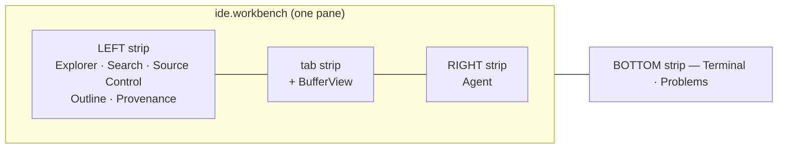
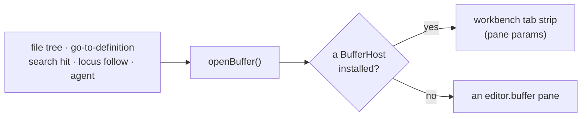

# IDE workbench

The `ide` module is **one pane that is a code editor with its sidebars** — the shape
every developer already has in their fingers, and the one arrangement this app had
every part of but no single surface for.

The parts predate the module. [`editor.buffer`](editor.mdx) is CodeMirror with a
language server, [`files.tree`](file-explorer.mdx) is a file explorer,
[`code.outline`](symdex.mdx) follows the cursor, [`terminal.instance`](terminal.mdx)
is a real PTY, and the `scripting` workspace preset already arranged them in docks.
What was missing was a surface that composes them, plus three panels nobody had
written: repo-wide text search, source control, and a problems list.

## The composition is declarative

The workbench renders **only its tab strip and one nested buffer**. Every sidebar is a
`regions:` declaration consumed by the layout shell.

That is forced rather than chosen: `packages/core` cannot import `@horrible/ui` (the
dependency runs the other way), so a pane declared in a module has no way to render
another module's view itself. It turns out to be the better answer anyway — the strips
inherit resize, per-instance persistence, collapse-to-rail, tabbing and drag-out from
the frame engine instead of a second docking engine growing inside a pane. See
[Region strips](../architecture/panel-groups.mdx).

Three rules govern the `regions:` array (`packages/core/src/modules/ide/manifest.ts`)
and each is silent when broken, so each has a test:

- **A view id may appear at most once.** `setRegionView` and the pick resolver both
  match first-by-id, so a second entry is unreachable.
- **The right strip holds exactly one view.** The shell tabs the left and bottom
  strips but renders a right strip of two or more views as equal vertical bands.
- **No pick letter may be `t`, `n` or `b`** — the universal position toggles.

`code.search` is deliberately *not* a strip: `mod+p` already opens the symbol-search
modal, and a second symbol surface in-pane would be the competing home the `embedded`
flag exists to prevent.

## Opening a file lands in one place

`editor/host.ts` is the seam. The workbench installs itself while it is mounted and
clears itself when it is not, so a closed workbench is invisible and every existing
caller keeps its old behaviour with no change of its own. Without it, clicking a file
in the workbench's *own* Explorer strip splits off a second `editor.buffer` pane
holding the same URI — two live CodeMirror views registered under one source, where
saving is last-writer-wins.

The seam has a second method, `adopt`, for Save As: a nested buffer's instance id is
synthetic, so `retargetPane` cannot find it and a saved file would sit in a tab still
reading `untitled` forever.

### Where the open files live

In the **pane's `params`**, which are serialized into the workspace blob — so tabs
survive a reload the way VS Code's do, and are dropped when the pane genuinely closes.
Not component state (the workbench unmounts whenever you look at another document) and
not `paneUiBag` (explicitly not persisted).

A background tab's **dirty dot** comes from `editor/unsaved.ts`, not from
`editor/buffers.ts`: that registry is mount-scoped and only the active tab is mounted,
so every background tab would otherwise show clean no matter what you had typed.

## Contributions

### Panels

| Panel | Id | Role | What |
| --- | --- | --- | --- |
| Workbench | `ide.workbench` | singleton document, **captures the keyboard** | Tab strip over open files + the nested buffer. Titled "Workbench" because the registry warns on a duplicate view title and "Editor" is `editor.buffer`'s. |
| Search | `ide.textSearch` | singleton, **embedded** | Repo-wide text search. |
| Source Control | `ide.scm` | singleton, **embedded** | Staged/unstaged/untracked/conflicted, staging, diff, commit. |
| Problems | `ide.problems` | singleton, **embedded** | Language-server diagnostics for open files. |

The three panels are `embedded`: their home is a strip, and a standalone opener would
present a second, competing one.

### Region strips

| Position | Views |
| --- | --- |
| left (open by default) | `files.tree` `e` · `ide.textSearch` `f` · `ide.scm` `v` · `code.outline` `o` · `git.provenance` `g` |
| right | `agent.chat` `a` |
| bottom (open by default) | `terminal.instance` `j` · `ide.problems` `m` |

### Commands and keybindings

`ide.open` (`/ide`, `mod+shift+i`), `ide.findInFiles` (`/find-in-files`),
`ide.showScm`, `ide.showProblems`, `ide.showExplorer`, `ide.toggleTerminal`,
`ide.toggleAgent`, `ide.closeTab` (`mod+w`, **desktop only**), `ide.nextTab`,
`ide.prevTab`.

Every chord is modified and carries `capturePassthrough`. The pane declares
`capture: { mode: 'keyboard' }`, which suppresses *unmodified* bindings while it has
focus — deliberately, so typing `t` in a buffer does not toggle a strip. The frame's
plain-letter region picks still exist and work when a strip has focus; these are the
duplicates that survive while you are typing. `mod+w` is desktop-only because the
browser takes it and declares it unpreventable in `keymap/reserved.ts`.

### Backend routes

| Route | What |
| --- | --- |
| `POST /api/files/search` | Repo-wide text search. POST, not GET: a regex is full of `&`, `#` and `+`. |
| `GET /api/git/scm-status` | The working tree grouped for source control, with git's two status characters kept apart. |
| `GET /api/git/diff?path=&staged=` | Working-tree (or index) diff for a path. |
| `POST /api/git/stage` · `POST /api/git/unstage` | `git add` / `git restore --staged`. |

Every path crosses the workspace-root boundary (`_resolve`/`_roots`) before reaching
git or the filesystem, the same rule `git.commit` follows.

### Agent tools (on `ide.workbench`)

| Tool | What |
| --- | --- |
| `ide.open` | Open the workbench, optionally on a file (**gated**). |
| `ide.openFile` | Open a file and scroll to a line. Navigation only. |
| `ide.listOpenFiles` | Open tabs, which is active, which are dirty. |
| `ide.closeFile` | Close a tab (**gated** — can discard work). |
| `ide.findInFiles` | The text search, capped lower than the panel's. |
| `ide.problems` | Diagnostics, with the scope stated in the response. |
| `ide.scmStatus` · `ide.diff` | Read the working tree. |
| `ide.stage` · `ide.unstage` | Change the index (**gated**). |

Every name begins `ide.` because the orchestrator groups tools by **name prefix** —
there is no field that names the group. Deliberately absent: a commit tool
([`git.commit`](git.mdx) exists and stamps the provenance trailers the blame view
reads), a terminal tool (`terminal.exec`), a file-write tool (`files.write`), a symbol
tool (`symbols.*`). This group is the workbench, not a re-export of everything
reachable from it.

## Three limits, stated rather than discovered

**Problems covers opened files only.** Diagnostics come from live language-server
sessions, which exist for buffers that have been opened. There is no project-wide
check, no `workspace/diagnostic` pull and no compiler run behind the panel. A file
never opened contributes nothing, the empty state says so, and `ide.problems` returns
the scope in a `scope` field — a Problems list that showed nothing and *implied* a
clean project would be worse than no panel.

What lifts it above a mirror of the active buffer's gutter is `retainDiagnostics`: the
LSP registry drops a file's diagnostics when its CodeMirror view is destroyed, which
happens on every tab switch, so without retention the panel would list exactly the one
file already showing its errors.

**Search uses ripgrep when the machine has it, and a pure-Python walk otherwise.**
`rg` is not a dependency — supported, never bundled, the same rule as
[SearXNG](search.mdx) and the headless Chromium. The `engine` field says which
answered, and `truncated` (hit the result cap) and `timed_out` (hit the wall clock)
are kept separate from an empty tail, because "we found no more" and "we stopped
looking" are different facts. `backend/tests/test_files_search.py` pins that the two
engines return the same results on the same tree — installing ripgrep must not change
what the app finds.

**The region terminal takes no `cwd`.** Region views are rendered with no params, so
the workbench's terminal opens where a terminal opens by default. Use
`files.openTerminalHere` from the tree for a directory-specific shell.

## Related

[Editor](editor.mdx) · [File explorer](file-explorer.mdx) · [Terminal](terminal.mdx) ·
[Git provenance](git.mdx) · [Symbol index](symdex.mdx) ·
[Region strips](../architecture/panel-groups.mdx) ·
[Keybindings](../architecture/keybindings.mdx)
