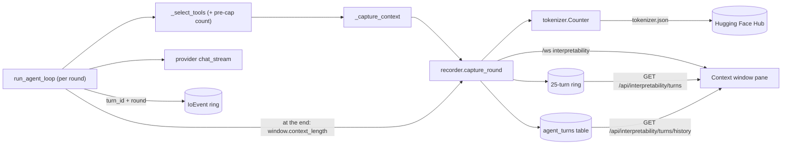
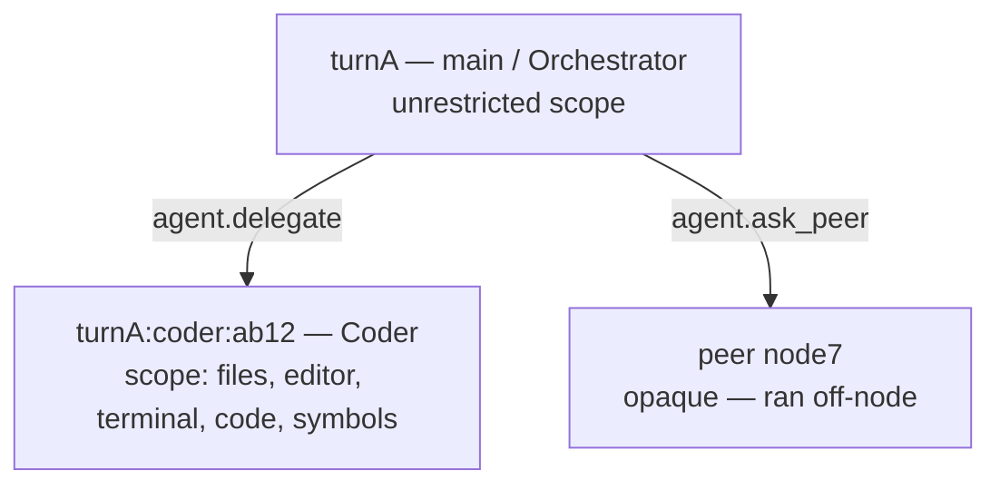
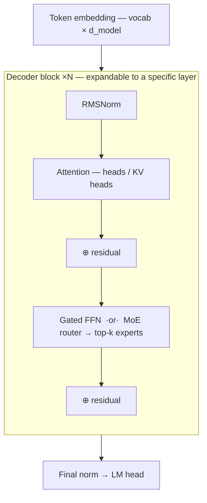
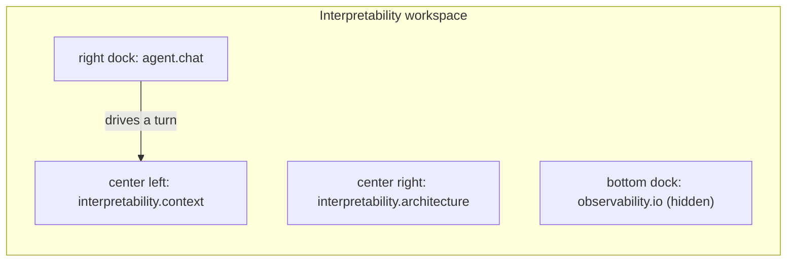

# Module: interpretability

See exactly what the model is being handed. The agent loop rebuilds its context
every round — system prompt, tool guides, replayed history, the focused editor
buffer, the user turn, and a tool list that progressive disclosure recomputes as
the model calls `load_tools` — and until this module none of it was observable.

**Status: implemented** — frontend in
`packages/core/src/modules/interpretability/`, backend in
`backend/modules/interpretability/`, capture hook in
`backend/modules/agent/orchestrator.py`.

## What it shows, and why that's the useful part

The interesting question about a local model is rarely "what did it say" — it's
"what did it actually see". Three things drive agent behaviour that were
previously invisible:

- **The tool schemas.** Serialized tool JSON is usually the single largest block
  of an agent's context, and progressive disclosure changes it every round. The
  pane breaks it down per group and per tool, in real tokens.
- **Silent tool-budget truncation.** `_select_tools` caps the list at
  `TOOL_BUDGET` (44) and drops the overflow with nothing but a `logger.warning`.
  If the model "ignored" a tool you were sure it had, this is why — the pane says
  so in a full-width warning, with the dropped count.
- **The gap between requested and real context length.** `num_ctx` is what we
  *ask* for; the model has what it has. Asking for more gets you the model's real
  limit silently. The header shows both.

## Prompt, weights, activations — three surfaces, three modules

This module inspects the **prompt**. That is a real boundary and not a temporary
one: activations, attention, KV cache contents and gradients are unavailable
through the HTTP API of every provider it can talk to, which returns tokens and
counts and nothing else. Everything on this page is measured from the request the
backend is about to send.

The model explorer covers the **weights**: reading the GGUF directly gives the
real tensor inventory — every name, shape and quantization — so the structure
shown is measured rather than described. It stops at the file; nothing here runs
a forward pass.

The computation between them is now covered too, and it lives **next door in
[llamacpp](./llamacpp.mdx)** rather than here, because it needs a different
engine and a different install. A traced run captures ggml's per-node `cb_eval`
tensors into a **snapshot on disk**, scrubbed offline rather than streamed (one
pass with attention on is about a gigabyte), and is read in the `traces` section
of the llama.cpp pane.

That page also now carries the **lens** — the same snapshot read as *words*
rather than as numbers, a layer × position grid of what the model was disposed to
say at each point, which is [Neuronpedia's Jacobian
Lens](https://github.com/anthropics/jacobian-lens) with the identity transport.
It needs no autograd and no fitted artifact, so the rule below still holds: this
backend has no torch and should not grow one. Its correctness argument is the
same shape as everything else here — at the last layer the lens must reproduce
the trace's own captured logits, and a grid that cannot show that says
`unavailable` rather than presenting itself as checked. That path still avoids autograd entirely — the backend has
no torch and should not grow one; heavy dependencies live in per-project uv envs
(`backend/modules/training/envs.py`) or optional extras, and tracing is
`uv sync --extra llamacpp`, lazy-imported and CPU-only.

The seam between this page and that one matters: a trace and a chat turn are
**different runs until proven otherwise**. Chat goes through a downloaded
`llama-server` binary, tracing through the wheel's own libllama, so the two may
only be shown together when both the build and the model hash agree
(`traces.matches_run`). Overlaying them regardless would put a forward pass under
an answer it did not produce — which is exactly the kind of confident wrongness
this module exists to refuse.

## Architecture

Capture is a read-only observer inside the agent loop. It runs once per round,
just before the provider call, and is wrapped so that a failed capture can never
cost the user their turn.

### Two rings and a table

The ring is what the pane opens on: 25 turns, in process, gone on restart. The
`agent_turns` table behind it is what makes a turn answerable tomorrow — 5000 rows,
each the full snapshot. Both are written by the same `capture_round`; they differ
only in how long they last, so `GET /turns/{turn_id}` tries the ring and then falls
back to the table. Without that fallback every turn older than the ring lists in the
history and 404s when opened.

The third ring in the diagram is the telemetry one, and it is a different kind of
record: `IoEvent` is *what went over the wire*, where a `RoundSnapshot` is *what the
model was shown*. `run_agent_loop` stamps every request it makes with `turn_id` and
`round` (`telemetry/turn.py`, a contextvar rather than a parameter — the recording
happens in httpx's response hook, several layers below the loop that knows the
answer), which is what lets the two be lined up without matching them by timestamp.
A sub-turn restores its parent's stamp when it leaves rather than clearing it.

Two invariants hold the design together, both enforced in tests:

1. **Capture never raises.** It runs inside the turn; a bad message list costs a
   snapshot, never an answer.
2. **Capture never mutates.** It only reads `messages`/`tools`. The pane's entire
   premise is that it shows the real prompt, so observing it cannot change it.

## Multi-agent: delegation and peers

`main` is not the only agent that runs. It orchestrates two different ways, and the
pane distinguishes them because they have very different visibility.

| | `agent.delegate` | `agent.ask_peer` |
| --- | --- | --- |
| Runs on | this node, this browser connection | another user's node |
| Tools | full — relayed to your frontend, gated under the sub-agent's mode | none (tool-less, read-only) |
| Depth | one level (specialists set `can_delegate: false`) | n/a |
| Visible in this pane | fully — it's a real captured turn | **opaque node only** |

A delegated turn needs no special capture: `run_delegate` reuses
`orchestrator.run_agent_loop`, which is exactly where the capture hook lives, so the
sub-agent is recorded like any other turn with its own `agentId`. What it *did* need
was the link — `parent_turn_id` is threaded from `run_delegate` into the loop so the
pane can rebuild the handoff tree instead of showing unrelated siblings.

Each turn carries the identity its context was actually assembled from: agent name,
declared `toolGroups` scope, and permission mode. Scope is the operative field —
a specialist can only ever load tools from its declared groups, so "the agent
ignored my request" is frequently really "that agent was never given that
capability", and the pane can now show which.

:::note `toolGroups: null` ≠ `[]`
`null` means unrestricted — every group loadable, which only `main` is. An empty
list means the opposite: no groups at all. They must never be collapsed.
:::

### Why peers stay opaque

A peer turn is recorded with its `peerId` and the prompt that was sent, and nothing
else — **no rounds, no token counts**. The peer's agent assembles its context on its
own machine, and this node genuinely cannot see it (nor should it; see
[network](./network.mdx)). Recording the handoff anyway is what keeps the tree
honest: a delegation that leaves the node shows up as a leaf that says so, rather
than a silent gap the reader has to guess about.

## Model explorer

Beside the context view sits the loaded model: what it *is*, next to what it was
*given*. It is a thing you click through rather than a picture — selecting a stage
of the stack shows the tensors that actually implement it.

The block is drawn **once with a ×N multiplier** rather than repeated — forty-eight
identical rectangles say nothing the number doesn't — but the multiplier expands
into a layer picker, so "block 17 specifically" is one click away.

### Two sources, and why they stay separate

| Source | Available for | What it gives |
| --- | --- | --- |
| The model's own **GGUF header** | the node's own llama.cpp server, Ollama, LM Studio, or any server with `interpretability.ggufPath` set | The **inventory**: every tensor's name, shape, ggml quant type and byte size |
| GGUF `model_info` via `/api/show` | Ollama | The **description**, written from the weights the server loaded |
| `config.json` from a HF repo | any (the only option for LM Studio / vLLM) | The description, but strictly of the *repo* |

The pane labels which it used (`weights` / `repo`, plus a `gguf` chip when the
inventory is present) rather than presenting them interchangeably.

The split is load-bearing. A description can be approximated from a repo when the
weights are unreachable; an **inventory cannot** — a `config.json` lists no tensors —
so `/tensors` returns an error the pane renders as "no GGUF found" rather than a
plausible-looking list. A model can have the description without the inventory, and
the pane stays useful minus the tensor tables.

### What the inventory catches that a schematic can't

Every scalar source reports **one** head count for the whole model. That is often
false. Gemma 4 alternates its attention shape by layer — `blk.0.attn_q` is 3840×4096
where `blk.17.attn_q` is 3840×8192 — so a "× 48" with a single head count beside it
actively misleads. The explorer compares tensor shapes across blocks and, when they
differ, marks the block frame `varies` and names the roles that change. Only the
inventory can see this.

It also reports the **mixed quantization** a K-quant build actually uses (a Gemma 4
12B QAT build is 338 F32 tensors, 328 Q4_0, and exactly one Q6_K — the embedding),
and where the bytes sit: select Attention and the pane says what share of the file
it is.

### Locating the weights

`gguf.resolve_model_path` tries, in order:

1. **`interpretability.ggufPath`**, which wins outright. Auto-discovery reads two
   undocumented on-disk layouts their owners are free to change, so there has to be
   a way to say "it is this file" that no upstream release can break.
2. **The node's own [llama.cpp](./llamacpp.mdx) server**, when one is running and
   its `--alias` matches the configured model. This is the only source that is
   *known* rather than inferred: we chose the file. It is matched on the alias and
   not merely on "a server is running", because `llama-server` can be up while the
   agent talks to Ollama, and answering with the wrong model's tensors is exactly
   the plausible-looking wrongness this module exists to prevent.
3. **Ollama's blob store** — its manifest names the layer whose `mediaType` is
   `…image.model`; that digest is the blob. `OLLAMA_MODELS` relocates the root.
4. **LM Studio's index** (`~/.lmstudio/.internal/model-index-cache.json`), where
   `indexedModelIdentifier` is exactly the id its API serves. Its REST API reports a
   model's arch and quantization but *not* its path, so the index is the only route.
   Taking `entryPoint` matters: a multimodal repo ships an `mmproj-*.gguf` beside the
   weights, and the first file in the directory is a real GGUF that parses cleanly
   and describes the wrong thing.

Step 4 is not gated on the provider being LM Studio — a third-party llama.cpp build
and other OpenAI-dialect servers are often pointed at a model LM Studio also has
indexed, and a hit there is a hit on the same file.

:::note A byte size is not derivable from a shape
A quantized tensor's footprint depends on its block format, so `gguf.py` carries a
`(elements per block, bytes per block)` table. An unrecognized ggml type reports
**no** size rather than a guessed one, and the response's `bytesComplete` goes false
so the total reads as a floor. The table's correctness argument is that on a real
mixed-quant file, `sum(tensor bytes)` equals `file_size - data_offset` to the byte.
:::

GGUF keys are namespaced per architecture (`gemma2.block_count`,
`llama.attention.head_count_kv`), so they're matched **by suffix**. A new family
works without a table entry.

:::note Three-state, not two
`gated` is `true` for known-gated families (SwiGLU/GeGLU), `false` for known-dense
ones, and **`null` for a family in neither list**. "We don't know" and "we know it
isn't" are different claims, and only the second justifies drawing a
single-projection FFN. The same reasoning governs every optional field.
:::

## Model designer

Beside Inspect sits **Design**: the same pane, switched from reading a model to
drawing one. It is a [Blender-shaped node editor](../architecture/model-graph.mdx) —
drag `RMSNorm`, `Attention`, `SwiGLU`, wire a residual `Add` back around a block,
stack it `×N` — and a real PyTorch `nn.Module` subclass materialises beside it on
every edit.

The two modes share a pane because of the bridge between them. Inspect answers "what
is this model"; Design answers "what if it were different", and the obvious way to
start a design is from the thing you are currently reading. Putting a workspace switch
between a question and its follow-up would be the wrong seam.

### What is taken from Blender, and what is refused

| Blender | Here |
| --- | --- |
| Colour-coded **typed sockets** | `tensor` / `int` / `float` / `bool`; a link between different types is refused at the wire |
| **Node groups** (Group input/output) | a group **is** a generated `nn.Module` subclass — the reason the metaphor fits at all |
| A socket that accepts **many links** | `op.add`, so a residual can fold several branches; every other input takes exactly one |
| **Mute** a node (`M`) | ablation: it emits nothing, its input passes through, and it stops being counted |
| **Reroute** nodes, **frames** | the same, and purely cosmetic — codegen walks straight through them |
| **Timings overlay** | a **cost overlay**: each node's share of the parameter count |
| Left→right data flow | enforced by the dagre auto-layout (`rankdir: 'LR'`) |

Not taken: Blender's **implicit socket conversions**. A float becoming a colour is a
convenience; a tensor silently becoming a differently-shaped tensor is the class of
bug this module exists to refuse, so a mismatch is a red wire you fix with an explicit
`Reshape` node.

### The two things it shows that a drawn diagram cannot

**The shape on every wire.** `[B, T, 2048]`, propagated from the Input node in pure
Python, in under a millisecond, on every keystroke. Batch and sequence stay symbolic,
because a symbolic dimension compared against a concrete one is an unknown rather than
a conflict.

**Where the parameters actually are.** Change `d_model` from 512 to 256 and the count
drops from 54.9M to 26.2M, every downstream shape re-labels, and the generated
`__init__` signature changes with it — because config values stay *variables* in the
emitted class rather than being frozen into it.

:::note Estimated until something runs it
Those numbers are **our** arithmetic, and the pane chips them `estimated`. The backend
has no torch and should not grow one, so measuring the real thing means instantiating
the module in a training project's venv — a separate, slower question, and a separate
answer. Where they disagree, the estimate is the one that is wrong.
:::

### Edits go both ways

The code pane is editable. Change a number in the generated module, hit **Apply**, and
it lands on the canvas — because the `.py` is the structural source of truth and the
graph is a projection of it.

Three rules make that safe rather than merely clever:

- **The sync is explicit.** Ctrl-S or Apply, never per keystroke. Parsing mid-word
  would replace your graph with whatever half-typed source currently means.
- **Your positions survive.** Every emitted line carries `# horrible:node=<id>`, so
  re-reading the file recovers node identity and the layout sidecar still describes the
  graph. A round trip that re-arranged the canvas would make the pane useless for
  anything but a glance.
- **A file we cannot read changes nothing.** It is read whole or not at all: the graph
  stays, your edit stays, and the reason is shown. Half a graph silently replacing a
  whole one is the worst outcome available here.

Source that does not match the shape the generator emits is **not** refused — it is
preserved verbatim as a `custom.module` node, and the pane names the classes it kept
that way. An opaque import nobody is told about is indistinguishable from a wrong one.

:::note The file is the fixed point
The guarantee under test is `emit(parse(emit(g))) == emit(g)`, byte for byte, for every
template. It is a stronger promise than IR equality in the way that matters: parse and
regenerate and nothing churns, so a save never looks like a change you did not make.
:::

### Blocks are editable, not just instantiable

A group is one generated `nn.Module` subclass, so editing one is editing a class. The
breadcrumb under the toolbar is Blender's context path — the model, then whichever
groups you have stepped into. **Double-click a block** (or *Edit contents* in the
inspector) to go in; click a crumb to come back out. The canvas is handed one level and
knows nothing about groups; the rules live in `designer/scope.ts` as pure functions.

Two ways to make one:

- **New group** drops an empty one here — already wired input to output, because a
  group whose output has nothing connected to it cannot be generated at all — and steps
  into it.
- **Group selection** is Blender's Ctrl-G: the selected nodes move inside, the wires
  that crossed the boundary reconnect to the group's own terminals, and an instance
  lands where the selection was. Select several the way any node editor does —
  Ctrl/Cmd-click to add one, or Shift-drag a box across the canvas.

:::warning A group takes one tensor and returns one
That is what `forward(self, x)` is, and what the ×N stack depends on. So a selection
that would need **two** inputs, or that feeds the rest of the graph from **two** nodes,
is refused with the count rather than wired to whichever one came first. Widening the
selection is the fix. For the same reason, the graph's own Input and Output nodes can
never go inside a group — they are the boundary it sits within, and it brings its own.
:::

Renaming a group renames its class, and two groups compiling to the same class name are
**refused** — the second definition would silently replace the first, and every
instance of the first would quietly start running the second's code. A group nothing
instantiates still shows shapes on its wires while you build it, but its parameters
stay out of the headline count: a class the model never instantiates holds no weights.
The model panel lists every group with its instance count and offers to delete the
unused ones, since they are still written into the file.

### Forking the model you are looking at

**The inspected model** sits at the top of the palette's starting points, named after
whatever the Inspect tab is showing. It turns that model's GGUF (or `config.json`)
metadata into an editable graph — the bridge the two modes share a pane for.

The difficulty is that [`ModelArchitecture`](#the-two-things-it-shows-that-a-drawn-diagram-cannot)
is deliberately full of holes: a dimension the metadata did not state stays `null`
rather than being guessed. A graph has no holes. So the import splits the difference
along one line:

| | |
| --- | --- |
| **Width, depth, vocabulary, head count** | Required. Missing any of them, there is **no import** — and the reason names which. A hidden size we invented would produce a plausible model of nothing |
| **Gated or dense, RMSNorm or LayerNorm, RoPE or not** | Assumed when absent, and **every assumption is listed** in a panel that stays until you close it. These only shape the graph, and the result is a starting point you edit, not a measurement |

:::note The import audits itself
The panel ends with the parameter count our arithmetic derives beside the one the
metadata states. On Llama 3.2 3B those differ by 12% — and the whole difference is the
output head, which that model ties to its embedding while the graph gives it its own
matrix. So the import says that, in those words. A gap it *cannot* account for is
reported as exactly that: a wrong import that stays quiet is worse than one that says
it does not add up.
:::

Two RoPE-shaped caveats worth knowing. Absent rotary parameters are ambiguous — they
mean either "this model has none" or "the metadata omitted them" — and the import
assumes RoPE anyway, because a decoder with no positional encoding at all is certainly
wrong. And head width is left derived (hidden ÷ heads) unless the metadata explicitly
decoupled them, which keeps the generated class parametric; a model like Gemma that
decouples them is called out in the panel.

### Running it for real

Everything above is the pane&apos;s own arithmetic. **Run it** builds the generated module
in a training project&apos;s venv and runs one batch through it — the only thing that can
turn an estimate into a measurement. It reports **three** states, never two:

| | What it means |
| --- | --- |
| **Ran** | Output shape, parameter count and torch version, measured. If the measurement disagrees with the estimate, the pane says so and by how much — the measurement is right and the cost overlay was wrong |
| **Failed** | The traceback, verbatim. Not summarised: the traceback *is* the answer, and paraphrasing throws away the line number |
| **Not checked** | No project, no venv, or no torch — said out loud, with the reason, and with a reminder that the numbers are still estimates |

That third state is the point. A model reported as validated when nothing validated it
is worse than not offering the button at all — the same rule the
[hardware](hardware.mdx) probe exists to enforce.

The probe runs as a subprocess in the project&apos;s venv, never in the backend, which has
no torch and [should not grow one](#prompt-weights-activations--three-surfaces-three-modules).
The script it runs is self-contained and does not import `horrible_train`: an
evals-owned project carries only its benchmark&apos;s requirements, and a probe that failed
on a technicality about our own helper package would read as the model being broken.

:::note The estimate is checked against the real thing in CI
`test_model_graph.py` builds each template in real PyTorch and asserts
`sum(p.numel())` equals what `shapes.py` predicted. All three currently agree **to the
parameter** — including the mixture-of-experts one. The test skips when torch is absent,
because the backend genuinely does not have it.
:::

### Tracing a module that already exists

The other importer reads a *description* of a model; **Trace** reads the model.
`torch.fx.symbolic_trace` records what a `forward` actually does, in order, with real
propagated shapes, and that becomes an editable graph. It runs in a training project's
venv, like the probe and for the same reason.

A trace is in torch's vocabulary, not ours, so some of it will not map onto the
twenty-one node types. Those arrive as `custom.module` placeholders that **raise
`NotImplementedError`**, named after the class they stand for.

:::warning A pass-through stub would be the worst possible default
The tempting placeholder returns its input unchanged. It would compile, run, train —
and be a different model than the one you traced, wrong in a way nothing would ever
report. Raising means the design refuses to run until you fill in the blanks, which is
worth far more than one that quietly computes something else. The pane names every
placeholder rather than only counting them.
:::

### Keyboard

The canvas takes Blender's verbs, declared through
[the keymap](../architecture/keybindings.mdx) — never a `keydown` listener in a
component:

| | |
| --- | --- |
| `Shift-A` | focus the node search |
| `M` | mute (ablate) the selected node |
| `X` | delete it |
| `H` | collapse it |
| `Home` | frame everything |
| `Tab` / `Shift-Tab` | enter / leave a group |
| `Ctrl-G` | fold the selection into a group |

Every one is scoped to the pane **and** guarded with `!textInput`: unguarded, typing a
`d_model` value in the inspector would delete the selected node. A binding naming
`paneFocus` already beats an unscoped global, so the pane does not take capture —
which matters, because the same pane hosts Inspect mode, where swallowing the keyboard
would be wrong.

### Reroutes and frames

Two more borrowings, both deliberately weightless. A **reroute** is a bend in a wire,
drawn as a dot rather than a titled box — codegen walks straight through it, and a box
would look like a node that does something. A **frame** is a labelled rectangle behind
a set of nodes: pure cosmetics, living entirely in the layout sidecar, so the generated
module is byte-identical before and after you draw one. Its rectangle is *derived* from
where its members currently are, never stored, so dragging a member re-draws the frame
around it and there is never a second competing fact about where the frame is.

### Handing it to training

**Send to project** writes the design into a training project as `model.py` and adds a
notebook block that imports and instantiates it. No new execution path — the project's
own kernel, venv and Kaggle/Colab push all apply unchanged.

Two rules keep it from colliding with the [recipe](training.mdx) machinery that writes
into the same notebook. The block carries **its own marker** (`horrible_model`, not
`horrible_recipe`), because sharing the flag would make a recipe regenerate delete the
model definition and a model regenerate delete the trainer config — each silently. And
it lands **above** the recipe block, because a notebook where the trainer is configured
above the model it trains does not run.

### Where a design lives

Two files under `$HORRIBLE_DATA_DIR/model-graphs/`: `<name>.py` — the generated module,
importing nothing from this app, yours to take anywhere — and `<name>.graph.json`,
holding the graph plus the canvas cosmetics Python has nowhere to put. Losing the
sidecar costs you a tidy layout; losing the `.py` costs you the model.

## Block classification

The provider payload is an undifferentiated list of role/content dicts, and four
distinct parts of the prompt all arrive as `role: system`. The recorder recovers
the distinction from assembly order plus two content markers (`<<<BUFFER` and the
skill catalog's header, imported from the module that writes it so a reworded header
can't silently relabel the block):

| Kind | Source | Role |
| --- | --- | --- |
| `system` | `spec.system_prompt` | system |
| `guides` | `_guides_message` — usage notes for preloaded groups | system |
| `skills` | `_skills_message` — the [skill](skills.mdx) catalog | system |
| `history` | prior conversation replayed into the turn | user / assistant |
| `editor` | `_active_editor_message` — the focused buffer | system |
| `user` | this turn's prompt | user |
| `assistant` | the model's output this turn (incl. tool calls) | assistant |
| `tool_result` | a tool's return value | tool |
| `nudge` | the force-tool retry system message | system |

`skills` is deliberately not folded into `guides`: their cost profiles are
opposites. A guide is paid only on turns where its group is active, while every line
of the skill catalog rides *every* round — so merging them would hide the one block
whose growth the user most needs to see.

The prompt/loop boundary is pinned at round 0 so classification stays stable as
the loop appends to the list.

:::warning Order is a contract
Classification depends on the assembly order in `run_agent_turn`. Changing that
order means changing `_classify_prompt` in the same edit — a mislabelled block is
worse than no pane at all.
:::

## Token counting

Counts come from the model's real tokenizer via `tokenizers` (Rust, ~5 MB) — not
`transformers`, because the backend env has no torch and must not grow one. A bare
`tokenizer.json` fetched through the already-present `huggingface-hub` is all that
`Tokenizer` needs.

Resolution order for the tokenizer repo:

1. the `interpretability.modelRepo` setting, if set;
2. the [Hugging Face connector's](./connectors.mdx) token, for gated repos
   (Gemma's is gated — anonymous fetches 401);
3. anonymous, which works for ungated families.

If all three fail, counts fall back to a chars/4 estimate and the snapshot is
marked `exact: false`. **The pane renders that as an "estimated" chip** — an
estimate displayed as a precise number is exactly the failure this module exists
to prevent.

## Contributions to the layout shell

| Kind | ID | Notes |
| --- | --- | --- |
| Layout | `interpretability` | "Interpretability" workspace in the top tab strip |
| Panel | `interpretability.context` | Singleton; role `document` |
| Panel | `interpretability.architecture` | Model explorer **and designer** — two modes, one pane; sits beside the context view |
| Command | `interpretability.open` | Inspect context window |
| Command | `interpretability.openDiagram` | Explore model structure |
| Keybinding | `mod+shift+x` | → `interpretability.open` |
| Setting | `interpretability.modelRepo` | HF repo for exact tokens **and** the description |
| Setting | `interpretability.ggufPath` | Explicit weights file for the tensor inventory |

:::note Layouts saved before the budget widget was merged
`interpretability.budget` was a compact `role: 'tool'` widget duplicating the
context panel's header. It is gone; the budget bar (and its "tools dropped" chip)
lives in `interpretability.context`, which was always one region-strip click away.
`RENAMED_VIEWS` in `layout/serialize.ts` maps the retired id onto the panel, so a
workspace saved before the merge opens without a hole. `interpretability.openDiagram`
keeps its id through the rename — a command id is an API even when its title isn't.
:::

### The Interpretability workspace

A `FramePreset` seeds a dedicated workspace: the context inspector and the model
diagram split the center, the agent chat sits in the right dock, and the
observability data-flow strip is available (hidden by default) along the bottom —
what the model *is*, what it was *given*, and a way to drive it, all at once.

The chat is load-bearing rather than decorative — the pane has nothing to show until
a turn has run, so a layout with no way to drive one would be a dead end. The two
live in **separate visible areas** (center + dock) deliberately: panes in inactive
tabs unmount, which would drop the pane's live `/ws` subscription mid-turn.

Both panes are `role: 'document'`. They were `widget`, which is centre-placeable but
**alone** — and the `lab` preset tabs the context view, the model explorer, the Hugging
Face hub and llama.cpp into one area, which only documents do. They also *are*
documents by the test in [windowing.mdx](../architecture/windowing.mdx): surfaces you
read and work in, not tiles you glance at.

## Backend surface

| Method | Path | Purpose |
| --- | --- | --- |
| GET | `/api/interpretability/turns` | Recent captured turns from the ring, newest first |
| GET | `/api/interpretability/turns/history` | Turn *summaries* from the durable table (`limit`, `agent_id`, `since`, `roots_only`) |
| GET | `/api/interpretability/turns/{turn_id}` | One turn in full — ring first, then the table |
| DELETE | `/api/interpretability/turns` | Clear the ring |
| GET | `/api/interpretability/model` | Model metadata + true context length |
| GET | `/api/interpretability/architecture` | Normalized model structure (the description) |
| GET | `/api/interpretability/tensors` | The GGUF tensor inventory; no fallback source |
| GET | `/api/interpretability/graph/specs` | The designer's node catalog and templates |
| POST | `/api/interpretability/graph/code` | A design graph → a PyTorch module (stateless) |
| POST | `/api/interpretability/graph/validate` | Shape inference and parameter counts (stateless) |
| POST | `/api/interpretability/graph/parse` | A PyTorch module → a design graph (the round trip in) |
| POST | `/api/interpretability/graph/probe` | Build and run the module in a training project's venv |
| GET/PUT/DELETE | `/api/interpretability/graph/{name}` | A saved design |

`/turns/history` is declared **before** `/turns/{turn_id}`: FastAPI matches routes in
declaration order, and the other way round `history` resolves as a turn id — a 404 on
a route that exists. A summary carries no context blocks, only metadata and a round
*count*; content is fetched one turn at a time, which is also the boundary the MCP
export redacts at.

`/api/interpretability/model` reads Ollama's `/api/show`. The OpenAI dialect (LM
Studio, vLLM) has no equivalent, so it returns an `error` the pane renders as
"context length unknown" rather than guessing a number the budget bar would then
be wrong about.

### The window a turn actually ran under

`requestedNumCtx` is what we ask for; `modelContextLength` is what the model has, and
the gap between them is the difference between "my prompt fit" and "my prompt was
silently truncated". Only the server knows, so `run_agent_loop` asks once as the turn
closes (`window.context_length` → `recorder.finish_turn`) and stamps it on the turn.

Every server reports it somewhere different, so the probe branches on the provider
**kind**, not just the dialect — asking `/api/show` alone would have made this dead on
an LM Studio box, which is the common local setup here:

| kind | asked | read |
| --- | --- | --- |
| `ollama` | `POST /api/show` | the `*.context_length` metadata key |
| `llamacpp` | `GET /props` | `default_generation_settings.n_ctx` |
| `lmstudio` | `GET /api/v0/models/{id}` | `loaded_context_length`, else `max_context_length` |
| `vllm` | `GET /v1/models` | that model's `max_model_len` |

A hosted `litellm` provider is not probed at all: no endpoint of ours reports a remote
model's window, and a guess here would be rendered as a measurement. The probe runs in
the loop's `finally` on **every** turn, so it is capped at a 2s timeout and cached for
five minutes — negative answers included, since a server without that endpoint will not
grow one. It is cached rather than permanent because reloading a model at a different
`n_ctx` is a normal thing to do, and a stale denominator is the exact lie this is here
to stop telling.

The live path is the `interpretability` `/ws` channel, which pushes a `round`
event per round as it happens; the HTTP routes back-fill the pane on open.

## Browser vs desktop

| | Browser | Desktop |
| --- | --- | --- |
| Pane + live capture | ✅ | ✅ |
| Exact token counts | ✅ (needs one tokenizer fetch) | ✅ |
| Offline / no HF access | estimates, flagged | estimates, flagged |

No platform branching — the pane is the same component in both layouts.

## Durable turns (`agent_turns`)

The recorder writes each turn through to an `agent_turns` table in `app.db`
(`store.py`) as well as into its ring. The two serve different jobs and neither
replaces the other:

| | Ring (`recorder.py`) | Table (`store.py`) |
| --- | --- | --- |
| Holds | 25 turns | 5000 turns (pruned) |
| Survives restart | no | yes |
| Read by | the pane | historical queries, the [MCP export](mcp.mdx#the-server-we-export) |

The pane never reads the database, so a slow or failed write cannot stall a turn. Every
store call swallows and logs its own errors for the same reason: **observation must not
break the thing it observes**, which is the same rule `capture_round` already follows.

Rounds are stored as a JSON blob rather than a child table — they are only ever read
whole, and a relational `rounds` table would need a migration every time
`RoundSnapshot` gains a field.

One subtlety worth knowing when querying it: `total_tokens` is the **last** round's
total, not the sum across rounds. Rounds are cumulative — each resends the whole
conversation plus whatever the loop appended — so summing them would multiply-count the
same context and report a turn as costing several times what it did.

## Limits

- **The pane's ring is in-process.** 25 turns, cleared on backend restart. The ring
  counts delegated sub-turns and peer nodes as entries, so a heavily-delegating session
  fills it faster; an orphaned child (parent already evicted) is promoted to a root
  rather than dropped. Turns **are** now also persisted to `app.db` (see below), so what
  the *pane* shows is bounded while the underlying history is not.
- **A peer's context is never visible here.** By design — see above.
- **Block previews are clipped** to 4000 characters for transport. Token counts
  always describe the *full* text, and clipped blocks say so.
- **Counts are of what we send.** Ollama applies its own chat template on top, so
  the true prompt is marginally larger than the sum of the blocks.
