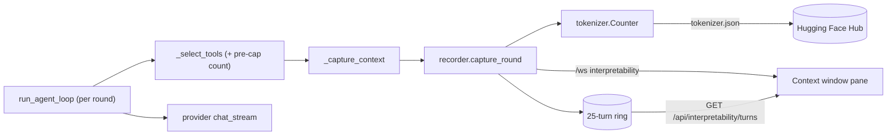
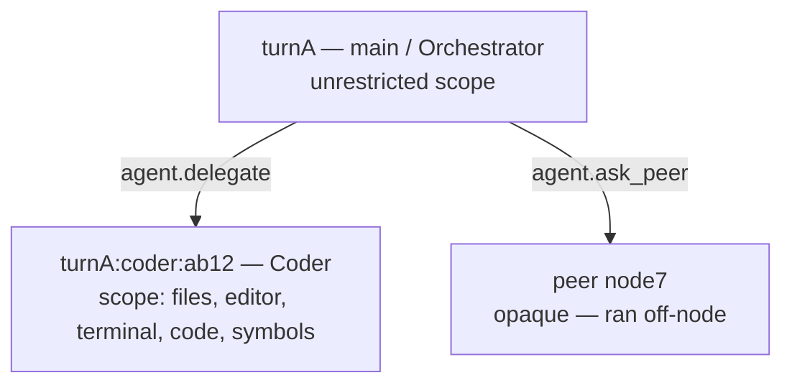
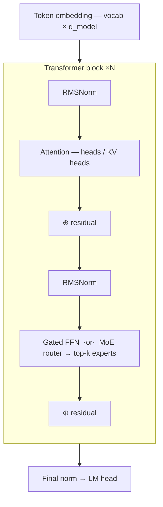
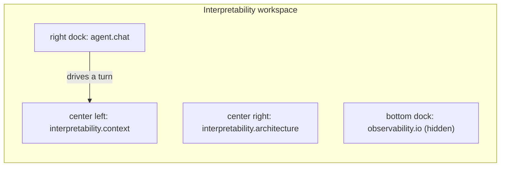

# Module: interpretability

See exactly what the model is being handed. The agent loop rebuilds its context
every round — system prompt, tool guides, replayed history, the focused editor
buffer, the user turn, and a tool list that progressive disclosure recomputes as
the model calls `load_tools` — and until this module none of it was observable.

**Status: implemented** — frontend in
`packages/core/src/modules/interpretability/`, backend in
`backend/modules/interpretability/`, capture hook in
`backend/modules/agent/orchestrator.py`.

## What it shows, and why that's the useful part

The interesting question about a local model is rarely "what did it say" — it's
"what did it actually see". Three things drive agent behaviour that were
previously invisible:

- **The tool schemas.** Serialized tool JSON is usually the single largest block
  of an agent's context, and progressive disclosure changes it every round. The
  pane breaks it down per group and per tool, in real tokens.
- **Silent tool-budget truncation.** `_select_tools` caps the list at
  `TOOL_BUDGET` (44) and drops the overflow with nothing but a `logger.warning`.
  If the model "ignored" a tool you were sure it had, this is why — the pane says
  so in a full-width warning, with the dropped count.
- **The gap between requested and real context length.** `num_ctx` is what we
  *ask* for; the model has what it has. Asking for more gets you the model's real
  limit silently. The header shows both.

## Not a Jacobian lens

This module inspects the **prompt**, not the network. Activations, attention, KV
cache contents, and gradients are all unavailable through Ollama's HTTP API, which
returns tokens and counts — nothing else. Any true mechanistic-interpretability
work (logit lens, tuned lens, Jacobian-based sensitivity) needs autograd against
real weights, which means a torch-backed process outside the backend env — see
the `training` module's spawned envs (`backend/modules/training/envs.py`) for the
shape that would take. The backend deliberately has no torch and should not grow
one.

## Architecture

Capture is a read-only observer inside the agent loop. It runs once per round,
just before the provider call, and is wrapped so that a failed capture can never
cost the user their turn.

Two invariants hold the design together, both enforced in tests:

1. **Capture never raises.** It runs inside the turn; a bad message list costs a
   snapshot, never an answer.
2. **Capture never mutates.** It only reads `messages`/`tools`. The pane's entire
   premise is that it shows the real prompt, so observing it cannot change it.

## Multi-agent: delegation and peers

`main` is not the only agent that runs. It orchestrates two different ways, and the
pane distinguishes them because they have very different visibility.

| | `agent.delegate` | `agent.ask_peer` |
| --- | --- | --- |
| Runs on | this node, this browser connection | another user's node |
| Tools | full — relayed to your frontend, gated under the sub-agent's mode | none (tool-less, read-only) |
| Depth | one level (specialists set `can_delegate: false`) | n/a |
| Visible in this pane | fully — it's a real captured turn | **opaque node only** |

A delegated turn needs no special capture: `run_delegate` reuses
`orchestrator.run_agent_loop`, which is exactly where the capture hook lives, so the
sub-agent is recorded like any other turn with its own `agentId`. What it *did* need
was the link — `parent_turn_id` is threaded from `run_delegate` into the loop so the
pane can rebuild the handoff tree instead of showing unrelated siblings.

Each turn carries the identity its context was actually assembled from: agent name,
declared `toolGroups` scope, and permission mode. Scope is the operative field —
a specialist can only ever load tools from its declared groups, so "the agent
ignored my request" is frequently really "that agent was never given that
capability", and the pane can now show which.

:::note `toolGroups: null` ≠ `[]`
`null` means unrestricted — every group loadable, which only `main` is. An empty
list means the opposite: no groups at all. They must never be collapsed.
:::

### Why peers stay opaque

A peer turn is recorded with its `peerId` and the prompt that was sent, and nothing
else — **no rounds, no token counts**. The peer's agent assembles its context on its
own machine, and this node genuinely cannot see it (nor should it; see
[network](./network.mdx)). Recording the handoff anyway is what keeps the tree
honest: a delegation that leaves the node shows up as a leaf that says so, rather
than a silent gap the reader has to guess about.

## Model diagram

Beside the context view sits a 2D diagram of the loaded model: what it *is*, next to
what it was *given*. It's data-driven — every dimension comes from real metadata, and
anything the source doesn't state is simply not drawn.

The block is drawn **once with a ×N multiplier** rather than repeated. Forty-two
identical rectangles say nothing the number doesn't; the space is better spent on
what differs *inside* a block.

Two details are drawn rather than merely stated, because the number alone doesn't
land:

- **Head grouping** — query heads are drawn sitting on the KV head they share. "28
  heads / 4 KV" is a 7× smaller KV cache than full MHA, and the picture makes that
  immediate.
- **Expert routing** — for an MoE, the expert bank is drawn with the routed top-k
  highlighted, alongside the active fraction (Mixtral: 2 of 8, so 25%).

### Where the numbers come from

| Source | Provider | Confidence |
| --- | --- | --- |
| GGUF `model_info` via `/api/show` | Ollama | **Highest** — written from the weights the server actually loaded |
| `config.json` from a HF repo | any (the only option for LM Studio / vLLM) | Describes the architecture, but strictly describes the *repo* |

The pane labels which one it used (`from weights` / `from repo`) rather than
presenting them interchangeably. OpenAI-dialect servers expose no architecture
endpoint at all, so for those a resolvable repo is required — set
`interpretability.modelRepo` when the model id is a local build name rather than a
repo, which LM Studio's often are.

GGUF keys are namespaced per architecture (`gemma2.block_count`,
`llama.attention.head_count_kv`), so they're matched **by suffix**. A new family
works without a table entry.

:::note Three-state, not two
`gated` is `true` for known-gated families (SwiGLU/GeGLU), `false` for known-dense
ones, and **`null` for a family in neither list**. "We don't know" and "we know it
isn't" are different claims, and only the second justifies drawing a
single-projection FFN. The same reasoning governs every optional field.
:::

## Block classification

The provider payload is an undifferentiated list of role/content dicts, and three
distinct parts of the prompt all arrive as `role: system`. The recorder recovers
the distinction from assembly order plus the `<<<BUFFER` marker:

| Kind | Source | Role |
| --- | --- | --- |
| `system` | `spec.system_prompt` | system |
| `guides` | `_guides_message` — usage notes for preloaded groups | system |
| `history` | prior conversation replayed into the turn | user / assistant |
| `editor` | `_active_editor_message` — the focused buffer | system |
| `user` | this turn's prompt | user |
| `assistant` | the model's output this turn (incl. tool calls) | assistant |
| `tool_result` | a tool's return value | tool |
| `nudge` | the force-tool retry system message | system |

The prompt/loop boundary is pinned at round 0 so classification stays stable as
the loop appends to the list.

:::warning Order is a contract
Classification depends on the assembly order in `run_agent_turn`. Changing that
order means changing `_classify_prompt` in the same edit — a mislabelled block is
worse than no pane at all.
:::

## Token counting

Counts come from the model's real tokenizer via `tokenizers` (Rust, ~5 MB) — not
`transformers`, because the backend env has no torch and must not grow one. A bare
`tokenizer.json` fetched through the already-present `huggingface-hub` is all that
`Tokenizer` needs.

Resolution order for the tokenizer repo:

1. the `interpretability.modelRepo` setting, if set;
2. the [Hugging Face connector's](./connectors.mdx) token, for gated repos
   (Gemma's is gated — anonymous fetches 401);
3. anonymous, which works for ungated families.

If all three fail, counts fall back to a chars/4 estimate and the snapshot is
marked `exact: false`. **The pane renders that as an "estimated" chip** — an
estimate displayed as a precise number is exactly the failure this module exists
to prevent.

## Contributions to the layout shell

| Kind | ID | Notes |
| --- | --- | --- |
| Layout | `interpretability` | "Interpretability" workspace in the top tab strip |
| Panel | `interpretability.context` | Singleton; role `widget` (holds a center area) |
| Panel | `interpretability.architecture` | Model diagram; sits beside the context view |
| Widget | `interpretability.budget` | Role `tool`; docks bottom, region strip to the full pane |
| Command | `interpretability.open` | Inspect context window |
| Command | `interpretability.openDiagram` | Show model diagram |
| Keybinding | `mod+shift+x` | → `interpretability.open` |
| Setting | `interpretability.modelRepo` | HF repo for exact tokens **and** the diagram |

### The Interpretability workspace

A `FramePreset` seeds a dedicated workspace: the context inspector and the model
diagram split the center, the agent chat sits in the right dock, and the
observability data-flow strip is available (hidden by default) along the bottom —
what the model *is*, what it was *given*, and a way to drive it, all at once.

The chat is load-bearing rather than decorative — the pane has nothing to show until
a turn has run, so a layout with no way to drive one would be a dead end. The two
live in **separate visible areas** (center + dock) deliberately: panes in inactive
tabs unmount, which would drop the pane's live `/ws` subscription mid-turn.

Note the role split this forces. A center area accepts `document` or `widget` panes —
`tool` panes are dock-only — so the full inspector is `role: 'widget'` even though it
reads like a tool, and the compact budget readout is the `role: 'tool'` one. Same
inversion as the observability module.

## Backend surface

| Method | Path | Purpose |
| --- | --- | --- |
| GET | `/api/interpretability/turns` | Recent captured turns, newest first |
| GET | `/api/interpretability/turns/{turn_id}` | One turn; 404 if evicted |
| DELETE | `/api/interpretability/turns` | Clear the ring |
| GET | `/api/interpretability/model` | Model metadata + true context length |
| GET | `/api/interpretability/architecture` | Normalized model structure for the diagram |

`/api/interpretability/model` reads Ollama's `/api/show`. The OpenAI dialect (LM
Studio, vLLM) has no equivalent, so it returns an `error` the pane renders as
"context length unknown" rather than guessing a number the budget bar would then
be wrong about.

The live path is the `interpretability` `/ws` channel, which pushes a `round`
event per round as it happens; the HTTP routes back-fill the pane on open.

## Browser vs desktop

| | Browser | Desktop |
| --- | --- | --- |
| Pane + live capture | ✅ | ✅ |
| Exact token counts | ✅ (needs one tokenizer fetch) | ✅ |
| Offline / no HF access | estimates, flagged | estimates, flagged |

No platform branching — the pane is the same component in both layouts.

## Durable turns (`agent_turns`)

The recorder writes each turn through to an `agent_turns` table in `app.db`
(`store.py`) as well as into its ring. The two serve different jobs and neither
replaces the other:

| | Ring (`recorder.py`) | Table (`store.py`) |
| --- | --- | --- |
| Holds | 25 turns | 5000 turns (pruned) |
| Survives restart | no | yes |
| Read by | the pane | historical queries, the [MCP export](mcp.mdx#the-server-we-export) |

The pane never reads the database, so a slow or failed write cannot stall a turn. Every
store call swallows and logs its own errors for the same reason: **observation must not
break the thing it observes**, which is the same rule `capture_round` already follows.

Rounds are stored as a JSON blob rather than a child table — they are only ever read
whole, and a relational `rounds` table would need a migration every time
`RoundSnapshot` gains a field.

One subtlety worth knowing when querying it: `total_tokens` is the **last** round's
total, not the sum across rounds. Rounds are cumulative — each resends the whole
conversation plus whatever the loop appended — so summing them would multiply-count the
same context and report a turn as costing several times what it did.

## Limits

- **The pane's ring is in-process.** 25 turns, cleared on backend restart. The ring
  counts delegated sub-turns and peer nodes as entries, so a heavily-delegating session
  fills it faster; an orphaned child (parent already evicted) is promoted to a root
  rather than dropped. Turns **are** now also persisted to `app.db` (see below), so what
  the *pane* shows is bounded while the underlying history is not.
- **A peer's context is never visible here.** By design — see above.
- **Block previews are clipped** to 4000 characters for transport. Token counts
  always describe the *full* text, and clipped blocks say so.
- **Counts are of what we send.** Ollama applies its own chat template on top, so
  the true prompt is marginally larger than the sum of the blocks.
