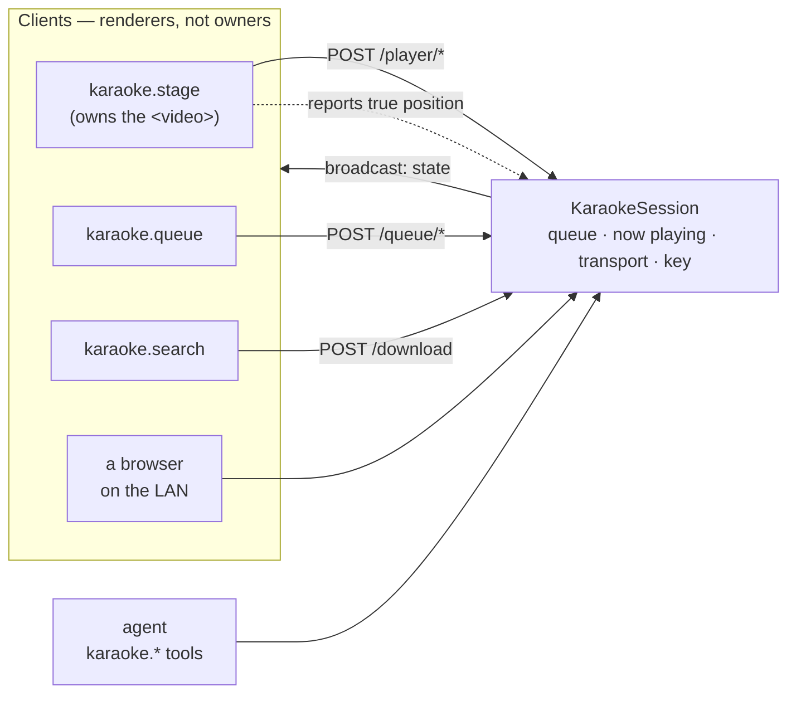

# Module: karaoke

A karaoke machine as a dashboard workspace, modelled on
[PiKaraoke](https://github.com/vicwomg/pikaraoke): search YouTube for karaoke
versions, download them into a local library with **yt-dlp**, queue them up per
singer, and play them on a stage pane built to be read from across a room. The
agent is a first-class operator — `karaoke.queue` takes a song the way a person
would say it.

**Status: implemented.** Search, download, library, queue, transport, pitch shift,
and the agent tool group all work. Not built: scoring, a dedicated guest-facing
mobile page, and playlists — see [Deferred](#deferred).

## The one idea: the session lives on the server

Everything else follows from this. A karaoke night is **one room, one screen,
several people holding phones**, so the queue cannot live in the stage component's
React state. It lives in a process-global `KaraokeSession`
(`backend/modules/karaoke/session.py`); every mutation broadcasts the whole
`PlayerState` on the `karaoke` `/ws` channel, and every client is a pure renderer
of it.



Three consequences, each of which is a bug if you forget it:

- **The stage owns playback; the server owns intent.** `playing` is what the room
  *wants*; the pane holding the `<video>` element reconciles toward it. That is why
  a remote can pause a video it isn't rendering. The stage reports its real
  position back (`POST /player/progress`) so remotes can draw a scrubber — the
  server never claims to know it.
- **Entry ids, not song ids.** The same song queued for three singers is three
  entries. Keying the queue by song id would make "add it again for the next
  singer" a silent no-op, so removals and reorders address the `entry_id`.
- **Every mutation bumps `revision`.** Broadcasts can arrive out of order after a
  reconnect; a client that renders a stale one shows a queue that jumps backwards,
  so the store drops anything older than what it holds.

A pleasant side effect: a workspace switch unmounts the stage pane
([unmount is not close](../architecture/windowing.mdx)) and loses nothing but the
video element — the session is untouched.

## Layout contributions

The **Karaoke** frame preset is the whole layout a host needs: stage in the center,
running order on the left, search on the right.

| View | Id | Role | Notes |
| --- | --- | --- | --- |
| Karaoke stage | `karaoke.stage` | `document` | Singleton. Takes **keyboard capture** so its single-key transport bindings don't fight the shell's, and declares `fullscreen: true` — the stage is pointed at a room, and chrome around the lyrics is chrome the singers read past. |
| Queue | `karaoke.queue` | `tool` (left) | Running order, reorder, history. |
| Find songs | `karaoke.search` | `tool` (right) | YouTube search + the downloaded library, in one pane. |

### Commands and keybindings

`karaoke.open`, `karaoke.findSongs`, `karaoke.showQueue`, `karaoke.playPause`,
`karaoke.next`, `karaoke.restart`, `karaoke.keyUp`, `karaoke.keyDown`.

| Key | Command |
| --- | --- |
| `space` | Play / pause |
| `n` | Next singer |
| `r` | Restart the song |
| `↑` / `↓` | Raise / lower the key |

All five are scoped `when: "paneFocus == 'karaoke.stage'"`. Unscoped, `space` and
`n` would be stolen from every text field in the app.

### Settings

`karaoke.volume` (default volume, 0–1) and `karaoke.searchResults` (how many
YouTube hits to request).

## Search: biased toward karaoke versions

The search route appends `karaoke` to the query unless the user already typed it.
This is the highest-value thing PiKaraoke does with search — nobody opening this
pane wants the original recording — and it's a flag (`karaoke=false`) rather than a
hardcode, so the agent can search literally when asked to.

Searching uses yt-dlp's `ytsearchN:` pseudo-extractor with `extract_flat`, which
returns the result list from **one** page fetch. Resolving each hit's formats is
roughly a second *per result* and makes the search box unusable.

## Downloads

Downloads **do not ride the shared task queue** (`backend.modules.tasks`), which
runs jobs serially — a karaoke download is minutes of network I/O, and putting one
there would park every library ingest behind it. They run as detached asyncio tasks
under a semaphore of 2, so a party can queue songs at once without saturating the
link. Progress lands on the `karaoke` channel as `song` events.

Queueing a song that is still downloading is **deliberate**: the entry holds its
place in the running order and the file arrives long before that singer's turn.
Waiting would push a guest's song behind ones queued after it.

That has a consequence which is easy to get wrong, and did go wrong once: an entry
can reach the **stage** before its file exists. A `<video>` pointed at a media URL
that 404s sets `error.code = 4` and **never retries** — so the first song of the
night would sit black forever, even once its download finished a second later.
Hence `QueueEntry.ready`: the stage renders a waiting screen instead of mounting a
media element, and `session.song_downloaded` flips the flag and rebroadcasts when
the file lands, which is what starts playback. A download that *fails* drops its
waiting entries and advances the stage, rather than stranding the room on a song
that will never play.

The **filename is the row id**, not the title. PiKaraoke encodes metadata into the
filename (`Artist - Title---videoid.mp4`) because its library *is* the directory
listing; here the database is the index, so a filename only has to be unique and
safe on every OS — which a title never is (`AC/DC`, emoji, a 1,200-character
clickbait title, Windows' 260-character path limit).

## Pitch shift

Right the key for a singer with `♭` / `♯`, ±6 semitones. Shifting pitch *without*
changing tempo is three ffmpeg filters, not one:

```
asetrate=44100*r , aresample=44100 , atempo=1/r        r = 2^(semitones/12)
```

`asetrate` plays the stream faster and higher (the tape-speed trick), `aresample`
restores the expected sample rate, and `atempo` slows it back — leaving only the
pitch change. **Dropping `atempo` is the classic bug** and yields chipmunks; a test
pins its presence and its direction. ±6 is the clamp because `atempo` accepts
0.5–2.0 per instance and 2^(6/12) ≈ 1.414 fits in one stage.

This is a **live transcode, not a cached file**. A cached shifted copy would be
seekable and cheaper on a replay, but singers change key *while hunting for their
key* — up two, no, down one — and each change would be a full-length re-encode
before a single note came out. A pipe starts playing in about a second at the cost
of losing seek, which is the right trade for the one control people actually reach
for mid-song. Accordingly `/media/{id}?semitones=N` does **not** advertise
`accept-ranges`, and changing key is a `<video>` *source* change on the client.

ffmpeg is only needed for this. Without it on `PATH`, everything else works and the
transpose endpoint returns 503.

## Backend surface

Mounted at `/api/karaoke`.

| Route | Purpose |
| --- | --- |
| `GET /search?q=` | YouTube search (karaoke-biased). |
| `GET /songs`, `DELETE /songs/{id}` | The downloaded library. |
| `POST /download` | Fetch a video; optionally queue it in the same call. |
| `GET /media/{id}[?semitones=]` | Serve the video. Range-capable at the original key. |
| `GET /player` | The whole `PlayerState`. |
| `POST /queue`, `DELETE /queue/{entry_id}`, `POST /queue/move`, `POST /queue/clear` | Running order. |
| `POST /player/{play,pause,next,restart,stop,seek,volume,transpose,autoplay}` | Transport. |
| `POST /player/progress`, `POST /player/ended` | The stage reporting back. |
| `GET /status` | What this node can do (yt-dlp / ffmpeg present). |

Every session mutation returns the full `PlayerState` *and* broadcasts it, so a
caller never re-fetches after acting.

`GET /media/{id}` implements Range properly, including the suffix form: `bytes=-3`
asks for the **last** three bytes. Reading that number as a start offset is the
classic misread and serves the wrong part of the file; there's a test for it.

### Storage

| What | Where |
| --- | --- |
| Song catalog | `karaoke_songs` table in `$HORRIBLE_DATA_DIR/app.db` |
| Media files | `$HORRIBLE_DATA_DIR/karaoke/songs/<song_id>.<ext>` |
| Session (queue, now playing) | **Memory only** — a night's running order is not a durable record |

## Agent tools

Grouped under `karaoke`, so they're disclosed on demand rather than costing context
on every turn. Six tools, and the split is by *what a host asks for*, not by HTTP
route.

| Tool | Purpose |
| --- | --- |
| `karaoke.status` | What's playing, how far in, what's queued and for whom. Source of `entry_id`s. |
| `karaoke.queue` | **The main one.** Queue a song by name. |
| `karaoke.control` | Every transport verb behind one enum, plus volume/transpose/autoplay. |
| `karaoke.unqueue` | Remove one entry by `entry_id`. |
| `karaoke.search` | Search without queueing, when the user wants options. |
| `karaoke.library` | What's downloaded; never touches the network. |

`karaoke.queue` deliberately takes a **search phrase, not a song id**. Asked to
"put on some Fleetwood Mac", a model given only an id-taking tool has to search,
pick, download and queue across four turns — and reliably fumbles one. This tool
does the whole path: it prefers a copy already in the library (instant, already the
right cut, no bandwidth), otherwise searches, starts the download, and queues the
entry immediately.

Both list panes expose an [agent context](../architecture/agent-tools.mdx)
snapshot, and the queue's includes `entry_id` — a title wouldn't identify a song
queued twice.

```
> queue Africa by Toto for Sam, then put Dancing Queen next
karaoke.queue(query="Africa by Toto", singer="Sam")
karaoke.queue(query="Dancing Queen", next=true)
```

## Browser vs desktop

| | Browser | Desktop (Tauri) |
| --- | --- | --- |
| Stage, queue, search | ✅ | ✅ |
| Search + download | ✅ (backend does the work) | ✅ |
| Pitch shift | ✅ when ffmpeg is on the node's `PATH` | ✅ same |
| Remote control from a phone | ✅ with the backend bound to the LAN (`pnpm dev:lan`) | ✅ `pnpm dev:desktop` binds `0.0.0.0` already |

No platform branching in the module: the session is server-side, so both layouts
are the same client.

## Setup

yt-dlp is a core dependency (`uv sync`) — it's a pure-Python wheel with no native
build. ffmpeg is optional and only gates pitch shift; install it however your OS
prefers and make sure it's on `PATH`.

**Content is not bundled and never will be** — the same rule
[hassault](hassault.mdx) applies to AssaultCube's media and
[search](search.mdx) applies to SearXNG. Songs are fetched from YouTube to the
user's own node, on their own instruction, and stored only there.

## Deferred

- **A guest-facing mobile page.** The architecture already supports it — the
  session is server-held, so a phone pointed at the node is a working remote — but
  there's no stripped-down guest UI or QR code onboarding yet, and no admin
  password gating what a guest may do. PiKaraoke has both.
- **Scoring.** PiKaraoke's is famously random.
- **Playlists / saved set lists**, and importing a local media folder.
- **Drag-and-drop queue reordering.** ↑/↓ buttons today: this pane is most likely
  to be driven from a phone in a dark room, where a precise drag against a
  scrolling list is genuinely hard. `POST /queue/move` takes an index, so a drag
  implementation is a client-only change.
