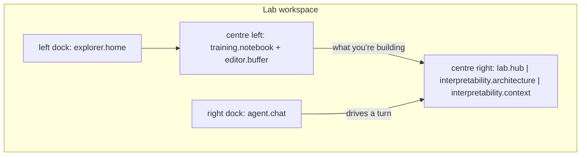

# Module: lab

The workspace for building, studying and fine-tuning models — and the one surface
none of the modules it composes had: a way for a **person** to browse the Hugging
Face Hub.

**Status: implemented** — frontend in `packages/core/src/modules/lab/`, HTTP surface in
`backend/modules/connectors/providers/huggingface_routes.py`.

## An umbrella, not a merge

`interpretability`, `training`, `mcp` and `library` keep owning their panes,
manifests, docs and tests. This module contributes a *composition* of them plus its
own pane. That is the same call the pane consolidation made: compose at the frame,
don't merge manifests.

Why a new frame rather than extending an existing one:

- **`interpretability`** is two inspection panes beside a chat. It has nowhere to
  write anything.
- **`training`** is deliberately thin — an empty centre plus the metrics strip — and
  does not place `training.notebook` at all.

Neither is a place to *write a fine-tuning script* with the model, the agent's
context, and the Hub all in reach. That working position is what the `lab` frame
seeds, and it duplicates no other preset.

The centre-right area is **tabbed rather than tiled**: at that width three stacked
panes would each be too short to read. The notebook brings most of the training
module with it for free — it already hosts metrics, the model graph, rollout, Manim
and peers as region strips — and `explorer.home` already carries Files, Projects and
Notebooks as contributed sections.

## The Hugging Face pane

`lab.hub` is one component with two sections, **Models** (<kbd>m</kbd>) and
**Datasets** (<kbd>d</kbd>). One component, not two: a model repo and a dataset repo
differ in exactly one rendered field (`task`, which only models carry), so two panes
would be two copies of the same browser that drift.

Search or list your own repos, select a hit, and read its card, `config.json` or any
other text file. Files a person actually wants — `README.md`, `config.json`,
`generation_config.json`, `tokenizer_config.json`, `params.json`,
`adapter_config.json` — lead the list as highlighted buttons, because a repo lists up
to 60 filenames and most of them are weight shards nobody can read.

### Why this pane exists at all

The connector has had `huggingface.searchModels` / `searchDatasets` / `repoInfo` /
`readFile` since it landed, so the **agent** could always find a dataset and read its
card. A person could not. The routes behind this pane call the same helpers (see
[Connectors → A browser for the human](./connectors.mdx#a-browser-for-the-human-over-the-same-helpers)),
so the two views cannot drift apart, and the pane inherits the agent's protections —
the 100 KB cap, the binary refusal, the model/dataset namespace split.

### Pin as model repo

The link back to the [model explorer](./interpretability.mdx). A model hit carries a
**Pin as model repo** action that writes `interpretability.modelRepo`, which drives
both exact token counts and the architecture description. Until now, finding the right
repo id meant leaving the app and pasting a string into settings.

Models only — a dataset describes nothing about the running model.

## The Local section: what this node made

`lab.hub`'s third section. Models and Datasets are what the *Hub* has; **Local** is
what *you* have — every GGUF this node converted, with the base model it came from,
the recipe and checkpoint that produced it, its training curves and its eval scores,
in one row.

Backed by `GET /api/training/inventory`, which performs the join
[`training/lineage.py`](training.mdx) recorded and its own docstring proposed. Five
disjoint views of "the models I have" existed before it — the llama.cpp GGUF catalog,
Hugging Face downloads, chat-provider model *names*, per-project checkpoints, and the
lineage table itself — so "which fine-tune is this, and did it beat its base?" was
answered by writing the join by hand in the database console.

Three things it does deliberately:

- **One row per lineage row, not per file on disk.** The llama.cpp catalog lists
  every GGUF the node can serve, Ollama's and LM Studio's included, and those have no
  provenance to report. This answers about models made *here*.
- **Every leg degrades to empty.** A run whose metrics were never mirrored, an eval
  never run, a file since deleted — each is a normal state. An inventory that 500s
  because one leg is missing would be useless exactly when it is most needed.
- **A missing file is reported, not hidden.** `present: false` is the one fact worth
  colouring: a fine-tune whose whole history you can read and which you cannot serve.
  Dropping the row would lose the provenance along with it.

Scores attach by **path**, not by model name. `EvalRun` gained a `model_path` column
(`_ensure_column`, the `case_hash` precedent) because `model` is an alias a server
answers to and may mean a different file tomorrow — which is precisely why the lineage
table is keyed on the path. A run from before that column carries an empty path and is
deliberately **not** attributed: better than attaching a score to a file it may never
have measured.

Each row's actions are param deep links — Recipe, Curves, Score — using the same
mechanism as the rest of the loop (see
[windowing](../architecture/windowing.mdx#opening-a-pane-that-is-already-open)).

The route declares **no `response_model`**, and that is load-bearing: a Pydantic
response model silently drops any field it does not declare, and this payload is a
join over four stores whose shapes move independently. `test_training_inventory.py`
asserts against the HTTP body for the same reason.

## Contributions to the layout shell

| Kind | ID | Notes |
| --- | --- | --- |
| Layout | `lab` | "Lab" 🧪 workspace in the top tab strip |
| Panel | `lab.hub` | "Hugging Face"; singleton, role `widget` (centre-capable) |
| Section | `lab.hub` → `models` | Default section, key <kbd>m</kbd> |
| Section | `lab.hub` → `datasets` | Key <kbd>d</kbd> |
| Section | `lab.hub` → `local` | "Local"; what this node made. Key <kbd>l</kbd> |
| Command | `lab.openHub` | Lab: Browse Hugging Face |

Section commands (`section.show:lab.hub:models`, …) are synthesized by the registry,
so both sections are reachable from the palette without being declared as commands.

The panel is `role: 'document'`. It was a `widget` — chosen only to make it
centre-placeable, since `tool` panes are dock-only — but `widget` means centre-placeable
**alone**, and this module's own `lab` preset tabs the hub with the model explorer, the
context view and llama.cpp in a single area. A pane a preset tabs cannot be a widget.
It is also the honest reading: a repository browser is something you work in, not a
readout you glance at.

## Testing

`backend/tests/test_huggingface_routes.py` covers the HTTP surface with
`huggingface_tools`' network calls stubbed, so nothing touches the Hub or needs a
token. Everything is asserted against the **HTTP response body**, never the helper's
return value — the routes declare `response_model`s, and a Pydantic response model
silently drops any field it doesn't declare, so a test reading the tool's output would
pass while the browser received `undefined`.

Specifically pinned: 409-vs-502 stay distinguishable; `gated: false` and `gated`
absent stay distinguishable; a slash in a repo id survives; a binary file is refused
rather than streamed; a failure is never cached; the cache is bounded.
