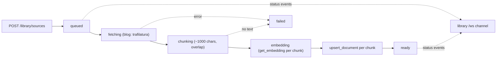

# Module: knowledge library

Build up a personal knowledge base — website blogs and notes today, books
(PDF/EPUB) next — and search it semantically for RAG. The library is a thin
ingestion + retrieval layer **on top of the existing [database](database.mdx) vector
store**; it does not reimplement embeddings or similarity search.

**Status: web + notes slice implemented.** The `library.panel` widget adds a blog
by URL or notes by pasting text, watches each source ingest live (queued → fetching
→ chunking → embedding → ready), and runs semantic search over the current library
with results grouped by source. PDF/EPUB parsing, file upload, a browser clipper
extension, and an embedded browser are designed-for but deferred (see
[Deferred](#deferred)).

## Data model: sources + chunks

Ingested content is structured as **sources** (the human-facing catalog) and
**chunks** (the embedded units), so retrieval returns passages that can be grouped
back to their source for citation.

- A **source** is one ingested item — a `blog`, a `note`, a media asset
  (`image` / `video`), or an artifact-backed blob (`page` / `pdf` — see
  [below](#artifact-backed-sources-page-and-pdf)). Catalog rows live in the
  `library_sources` table in the app's SQLite database
  (`$HORRIBLE_DATA_DIR/app.db`).
- Each source is split into overlapping **chunks**; every chunk is a row in the vector
  store — **LanceDB**, under `$HORRIBLE_DATA_DIR/lancedb` — keyed
  `"<source_id>#<chunk_index>"`, in the table named for the **library** (so
  `search_documents(collection, …)` scopes a search to one library), with metadata
  linking the chunk back to its source.

```
library_sources  (app.db, SQLite)       vector store  (LanceDB, one table per library)
  id          uuid                        id        "<source_id>#<chunk_index>"
  library     collection name             collection = library name
  type        blog | note | image | video  text     chunk text (proxy text for media)
  title, url, author, tags[]              metadata  { source_id, title, type, url,
  status      queued…ready|failed                     author, tags, chunk_index, asset }
  asset       MediaAsset JSON | null      vector    float32[]
  chunk_count, added_at
```

### Media sources

The default embedder is **text-only**, so an `image` / `video` source is embedded by
**proxy**: the words that describe the asset (alt text, caption, nearest heading, page
title), harvested from the live DOM by the
[browser](./browser.mdx#saving-to-the-library)'s `media` op. The bytes are
**referenced, never copied** — `asset.src` addresses the original. A media source is
always **one chunk**: its proxy text is a few phrases about one asset, and splitting it
would scatter an image across chunks that each point back at the same `src`.

Text-only, an asset with nothing describing it is **unfindable** — the best index it
could get is a filename like `IMG_4821.png`, which no realistic query matches — so
saving it is refused rather than burying a row nothing can reach. **CLIP lifts that
restriction**; see below.

## Visual search (CLIP)

Optional, off by default. Enable `library.clipEnabled` and install the extra:

```bash
uv sync --extra clip     # onnxruntime + tokenizers (~60 MB); weights (~350 MB) on first use
```

With it on, media is indexed a second time by **what it looks like**, so an image with
no alt text at all is still findable — the point of the feature.

### Two spaces, fused

| table | holds | vector |
| --- | --- | --- |
| `<library>` | every source (prose + media proxy text) | app embedder (384/768/1024-dim) |
| `<library>__clip` | media only | CLIP ViT-B/32 image encoder (512-dim) |

They can't share a table: **LanceDB fixes vector width per table**, so the sibling is
additive — same doc id, no migration of the text vectors. Sharing the id also means
deletes cascade for free (`delete_document` sweeps every table by id), and the sibling
is hidden from the "all collections" sweeps so the [database](./database.mdx) panel
doesn't count every media row twice.

A query is encoded **once per space** — by the app embedder against `<library>`, and by
**CLIP's own text encoder** against the sibling (CLIP is capped at 77 tokens, which is
why it only ever encodes queries, never document text). The two ranked lists are fused
with **Reciprocal Rank Fusion**, deliberately rank-based rather than score-based: the
lists come from different models, so their cosine scores share no scale — `0.31` from
CLIP and `0.31` from all-MiniLM mean unrelated things, and averaging them would be
arithmetic on incomparable units. Ranks are all they have in common.

Each `SearchGroup` reports `matched_by: ["text" | "clip"]`. A **clip-only hit has no
`chunks`** — no passage matched; the picture did.

### Operational notes

- **ONNX Runtime, not torch** — ~60 MB against ~1-2 GB, and `pillow` / `numpy` /
  `huggingface-hub` are already core deps, so the extra installs on every OS. The model
  is **pinned by revision**: a silent upstream re-export would change the vector space
  under stored embeddings, and nothing would look broken — searches would just quietly
  get worse.
- **Enabling CLIP does nothing retroactively.** Media ingested earlier has no CLIP
  vector until `POST /api/library/reindex-clip`, which enqueues **one task per source**
  (the task queue is serial, so a monolithic backfill would block every new ingest
  behind it). `GET /api/library/clip` reports coverage.
- **It reverses a security property.** Text-proxy ingest fetched nothing server-side;
  CLIP needs the actual pixels, so every captured `asset.src` becomes a backend request.
  It routes through the browser module's SSRF guard (`safe_fetch_bytes` — same
  validate-every-redirect-hop policy as reader mode, plus an image content-type
  allowlist and a streaming size cap), and Pillow decoding is capped against
  decompression bombs.
- **A CLIP failure never fails a source.** It's an additive space on top of a text proxy
  that already succeeded — a dead image URL degrades the source, it doesn't lose it.
- Video is embedded from its **poster frame** if the page provides one; real keyframe
  sampling would need ffmpeg and isn't done.

A **library** is just a collection name; the default is `default`. Switching or
creating a library in the panel changes which collection ingestion and search use.

## Ingestion pipeline

`POST /library/sources` records the source as `queued`, returns immediately, and
runs the pipeline as a **detached background task** so a slow fetch or embed never
blocks the request or the `/ws` receive loop. Each status transition is broadcast on
the `library` `/ws` channel and the panel upserts by source id.



- **Fetch/extract (blogs):** `extract.py` uses `trafilatura` for main-content
  extraction + metadata (title/author), with a regex tag-strip fallback. Imported
  lazily so a missing install can't break boot.
- **Chunking:** `chunking.py` packs paragraphs into ~`library.chunkSize`-char
  windows (hard-splitting over-long paragraphs) and prepends an overlap tail to each
  chunk. Dependency-free.
- **Embed + store:** reuses `get_embedding` (Ollama / LM Studio / vLLM with a local
  fallback) and `upsert_document` from the database module.

## Backend surface

`backend/modules/library/` — routes under `/api/library`:

| Route                                | Purpose                                             |
| ------------------------------------ | --------------------------------------------------- |
| `POST /library/sources`              | add a source (blog `url`, note `text`, or image/video `asset`); starts ingest |
| `GET /library/clip`                  | visual-search availability + coverage                   |
| `POST /library/reindex-clip`         | backfill CLIP vectors for existing media                |
| `GET /library/sources`               | catalog list (`?library=&type=&tag=`)               |
| `GET /library/sources/{id}/chunks`   | a source's stored chunks (detail view)              |
| `DELETE /library/sources/{id}`       | delete a source and its chunk rows                  |
| `GET /library/libraries`             | libraries with source/chunk counts                  |
| `POST /library/search`               | semantic search; hits grouped by source with scores |

Live **ingestion status** ships on the `library` `/ws` channel: a process-global
broadcaster (`broadcast.py`, mirroring the file-watcher split) fans source snapshots
out to each browser via `push_library_events`, wired in `backend/app.py` alongside
the other channel tasks.

## Agent integration

Declared on the `library.panel` widget, so they reach the capability manifest. The
tools are the **retrieval half of RAG** — the orchestrator generates the answer from
the cited chunks these return:

- **`library.search(text, library?, limit?)`** — semantic search; returns matches
  grouped by source with citation info (title, url) and the matching chunks.
- **`library.listSources(library?)`** — sources and their ingestion status.
- **`library.addSource(type, url?/text?, …)`** (`sideEffect`) — add and ingest a
  source in the background.

The panel's `getAgentContext` exposes the current library and its source titles, so
the agent can answer "what's in my library?" and cite what it retrieves.

## Settings

- `library.defaultLibrary` (default `default`) — the library the panel opens on.
- `library.chunkSize` (default `1000`) — target chunk size, read by the backend
  ingest pipeline via the settings store.

## Artifact-backed sources: `page` and `pdf`

Two source types added with the [research](research.mdx) module are backed by the
**artifact store** rather than a URL or inline text: their catalog rows carry an
`artifact_id` pointing at a stored blob under `$HORRIBLE_DATA_DIR/artifacts/`.

- `pdf` — a stored PDF (uploaded via `POST /api/artifacts/upload`, fetched by URL
  via `POST /api/research/pdf`, or synced from ArXiv). Ingestion extracts text
  with pypdf (`artifacts/pdftext.py` — moved from the Drive provider so both
  share one extractor) and chunks/embeds it like a blog.
- `page` — a self-contained captured HTML page (the browser's Save button or
  `POST /api/research/capture`). Ingestion runs the article extractor over the
  stored HTML — no re-fetch, the archive is the source.

`POST /api/library/sources` validates that the referenced artifact exists and its
kind matches the source type; search hits and `SourceModel`s carry `artifact_id`
so a result opens directly in the PDF/page viewer. Blog ingest itself was also
hardened in the same change: it now fetches through the browser module's SSRF
guard (`fetch_readable`) instead of a bare HTTP client.

## Deferred

- **EPUB parsing** as a source `type` — the pipeline absorbs it by adding an
  extractor branch, same as `pdf` did.
- **Browser clipper extension** (Obsidian-web-clipper style): a separate
  distributable that POSTs to `/api/library/sources` — that endpoint is its contract.
