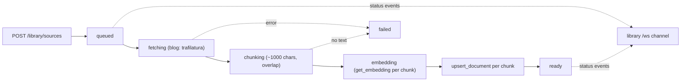

# Module: knowledge library

Build up a personal knowledge base — website blogs and notes today, books
(PDF/EPUB) next — and search it semantically for RAG. The library is a thin
ingestion + retrieval layer **on top of the existing [database](database.mdx) vector
store**; it does not reimplement embeddings or similarity search.

**Status: web + notes slice implemented.** The `library.panel` widget adds a blog
by URL or notes by pasting text, watches each source ingest live (queued → fetching
→ chunking → embedding → ready), and runs semantic search over the current library
with results grouped by source. PDF/EPUB parsing, file upload, a browser clipper
extension, and an embedded browser are designed-for but deferred (see
[Deferred](#deferred)).

## Data model: sources + chunks

Ingested content is structured as **sources** (the human-facing catalog) and
**chunks** (the embedded units), so retrieval returns passages that can be grouped
back to their source for citation.

- A **source** is one ingested item — a `blog` or a `note`. Catalog rows live in a
  new `library_sources` table in the **same** SQLite file as the vector store
  (`vector_store.db`), so the built-in `app` database connection sees the whole
  knowledge base as one file.
- Each source is split into overlapping **chunks**; every chunk is a row in the
  existing `documents` table, keyed `"<source_id>#<chunk_index>"`, with
  `collection` = the **library** name (so `search_documents(collection, …)` scopes a
  search to one library) and metadata linking the chunk back to its source.

```
library_sources                         documents  (shared vector store)
  id          uuid                        id        "<source_id>#<chunk_index>"
  library     collection name             collection = library name
  type        blog | note                 text      chunk text
  title, url, author, tags[]              metadata  { source_id, title, type,
  status      queued…ready|failed                     url, author, tags, chunk_index }
  chunk_count, added_at                   embedding BLOB (float32)
```

A **library** is just a collection name; the default is `default`. Switching or
creating a library in the panel changes which collection ingestion and search use.

## Ingestion pipeline

`POST /library/sources` records the source as `queued`, returns immediately, and
runs the pipeline as a **detached background task** so a slow fetch or embed never
blocks the request or the `/ws` receive loop. Each status transition is broadcast on
the `library` `/ws` channel and the panel upserts by source id.



- **Fetch/extract (blogs):** `extract.py` uses `trafilatura` for main-content
  extraction + metadata (title/author), with a regex tag-strip fallback. Imported
  lazily so a missing install can't break boot.
- **Chunking:** `chunking.py` packs paragraphs into ~`library.chunkSize`-char
  windows (hard-splitting over-long paragraphs) and prepends an overlap tail to each
  chunk. Dependency-free.
- **Embed + store:** reuses `get_embedding` (Ollama / LM Studio / vLLM with a local
  fallback) and `upsert_document` from the database module.

## Backend surface

`backend/modules/library/` — routes under `/api/library`:

| Route                                | Purpose                                             |
| ------------------------------------ | --------------------------------------------------- |
| `POST /library/sources`              | add a source (blog `url` or note `text`); starts ingest |
| `GET /library/sources`               | catalog list (`?library=&type=&tag=`)               |
| `GET /library/sources/{id}/chunks`   | a source's stored chunks (detail view)              |
| `DELETE /library/sources/{id}`       | delete a source and its chunk rows                  |
| `GET /library/libraries`             | libraries with source/chunk counts                  |
| `POST /library/search`               | semantic search; hits grouped by source with scores |

Live **ingestion status** ships on the `library` `/ws` channel: a process-global
broadcaster (`broadcast.py`, mirroring the file-watcher split) fans source snapshots
out to each browser via `push_library_events`, wired in `backend/app.py` alongside
the other channel tasks.

## Agent integration

Declared on the `library.panel` widget, so they reach the capability manifest. The
tools are the **retrieval half of RAG** — the orchestrator generates the answer from
the cited chunks these return:

- **`library.search(text, library?, limit?)`** — semantic search; returns matches
  grouped by source with citation info (title, url) and the matching chunks.
- **`library.listSources(library?)`** — sources and their ingestion status.
- **`library.addSource(type, url?/text?, …)`** (`sideEffect`) — add and ingest a
  source in the background.

The panel's `getAgentContext` exposes the current library and its source titles, so
the agent can answer "what's in my library?" and cite what it retrieves.

## Settings

- `library.defaultLibrary` (default `default`) — the library the panel opens on.
- `library.chunkSize` (default `1000`) — target chunk size, read by the backend
  ingest pipeline via the settings store.

## Deferred

- **PDF/EPUB parsing** + a **file-upload dropzone** and `POST /library/upload`
  multipart route. The `type` enum and pipeline are built to absorb `pdf`/`epub` by
  adding an extractor branch.
- **Browser clipper extension** (Obsidian-web-clipper style): a separate
  distributable that POSTs to `/api/library/sources` — that endpoint is its contract.
- **Embedded browser** for in-app clipping.
