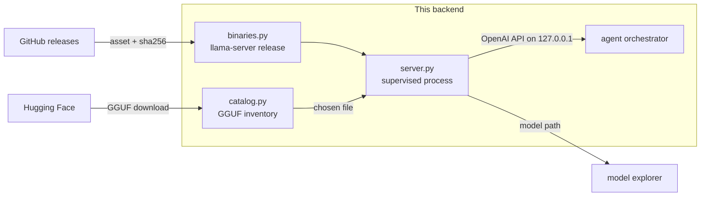

# Module: llamacpp

The node serving its own weights. Ollama and LM Studio are *applications* the user
installs and runs elsewhere; this module makes the backend itself fetch a
`llama-server` build, keep a catalog of GGUF files, and supervise the process the
agent talks to.

**Status: implemented** — backend in `backend/modules/llamacpp/`, frontend in
`packages/core/src/modules/llamacpp/`, tests in `backend/tests/test_llamacpp.py`.

## Why this is not just another provider entry

Every other local provider answers "which model are you running?" with a *name*. It
cannot tell you which file that name resolves to, what quantization it is, or how
big it is — which is why [`interpretability`](./interpretability.mdx) has to
reverse-engineer a path out of Ollama's blob store and LM Studio's undocumented
index just to read a tensor table. Here the node picked the file, so the path is
**known rather than inferred**, and the model explorer gets its highest-confidence
source for free.

The second reason is that it removes the last hard dependency on somebody else's
app. A packaged node can serve a model with nothing else installed.

## Three artifacts, three lifetimes

| | Where it comes from | Where it lives | Who owns it |
| --- | --- | --- | --- |
| The binary | Upstream GitHub release, downloaded on demand | `$HORRIBLE_DATA_DIR/llamacpp/bin/<tag>-<variant>/` | us |
| The weights | Hugging Face, or already on disk | `$HORRIBLE_DATA_DIR/llamacpp/models/`, or Ollama's / LM Studio's store | mixed |
| The process | Spawned by `server.py` | pid + a loopback port | us |

Nothing is bundled. That is the same call as SearXNG, AssaultCube content and the
DB-IP database: we support it, we fetch it on request, we ship none of it.

### Asset selection is matched, not hardcoded

Release asset names have changed shape several times, so pinning exact strings
guarantees a break on some future release. `select_asset` matches on the tokens that
carry meaning — OS, arch, accelerator — with two rules that are the whole test suite:

- **An accelerator build is never substituted for `cpu`.** A CUDA archive's name
  contains every token a CPU one does, plus one. Downloading it onto a machine with
  no NVIDIA driver produces a binary that fails to load its runtime, which reads
  like a corrupt download.
- **The name must start with `llama-`.** Releases also carry
  `cudart-llama-bin-win-cu12.4-x64.zip`, the CUDA *runtime redistributable*, which
  matches every other token, is shorter than the real CUDA build, and contains no
  server at all.

When nothing matches, the error names the assets it *did* see, rather than failing
blind on a release whose naming moved again.

### Verification says what it actually knows

GitHub publishes a `digest` for release assets. When it is there, a mismatch aborts
the install and **nothing is written** — an unverified half-install that a later
`newest_install()` hands to the spawner is worse than no install. When it is absent,
the digest we computed is recorded and the install is marked `verified: false`,
which the pane renders as a chip. Recording a self-computed hash and calling it
verification would be theatre.

## The catalog

Three origins, and the distinction is load-bearing:

- **`managed`** — under our models directory. Downloadable, deletable, counted
  against the disk budget.
- **`ollama` / `lmstudio`** — files those apps own. **Serveable, never touched.**
  `llama-server` memory-maps a GGUF read-only, so pointing it at LM Studio's copy
  costs nothing, and duplicating a 20 GB file to "own" it would be absurd. But a
  delete route that can reach into another app's store is a footgun, so the origin
  gates deletion — and `is_managed` resolves both paths, because a `..` segment in a
  caller-supplied path is exactly how a delete route becomes an
  arbitrary-file-delete route.
- **`extra`** — directories added via `llamacpp.modelDirs`.

`mmproj-*.gguf` is skipped everywhere. A multimodal repo ships its vision projector
beside the weights: a real GGUF that parses cleanly and cannot be served as a chat
model, so offering it in the picker is a guaranteed bad spawn. It is the same trap
the [model explorer](./interpretability.mdx) hits from the other direction.

The quantization label is the **most common tensor type**, not `general.file_type`:
that KV is an enum id whose meaning has shifted between llama.cpp releases, and a
mixed-quant build (most K-quant files keep some tensors at F32) is the norm. Header
facts are memoized on `(path, size, mtime)` — scanning a directory of 20 GB files on
every status poll would otherwise re-read all of them.

### The disk budget is pre-flight

A download is refused **before a byte is written**, against the size the server
declares in a `HEAD`. Checking as it goes means discovering the disk is full 30 GB
into a 40 GB transfer. The ceiling is `llamacpp.diskBudgetGb` (default 80).

Downloads write to a `.part` file and rename on success, so an interrupted transfer
can never be picked up by the catalog scan as a servable model — a truncated GGUF
fails at load time with an error that reads like a corrupt *model*.

## The server

### `--jinja` is passed explicitly, never inherited

It selects the model's **own** chat template, which is what carries its tool-call
syntax. Upstream currently defaults it on — verified on b10362, where a server
started without it reports the same template — but the default has flipped before,
`--no-jinja` exists, and it also reads `LLAMA_ARG_JINJA` from the environment. So
whether the agent can call tools would otherwise depend on which build happened to
be downloaded and what is in the user's env.

Without the model's template, `llama-server` accepts only "commonly used" templates
and falls back to a generic one for the rest — and that failure is **silent**: 200,
a perfectly fluent answer, and every tool in the schema simply never called, which
is indistinguishable from "this small model is bad at tool use". Hence the explicit
flag, and the test that pins it.

### Ready is not the same as running

Loading a large GGUF takes tens of seconds, during which the process is up and every
request is refused. `wait_ready` polls `/health`; the status the pane reads
distinguishes `running` from `ready`, and a process that dies during load reports
its last log lines rather than a timeout.

### Two more things that would otherwise bite

- **The port is negotiated, not assumed.** Hyper-V reserves ranges that swallow
  ordinary dev ports on this machine, and 8080 is a popular one, so the manager
  binds the default if it can and takes an ephemeral port if it cannot. This is why
  `_endpoint_for` checks the **live manager before the saved config** for this
  provider alone — a saved `:8080` would point at nothing while the real server sat
  elsewhere.
- **Spawning goes through `subprocess.Popen` on a thread.** Under
  `uvicorn --reload` on Windows the loop is a `SelectorEventLoop`, where asyncio
  subprocess creation raises — the same reason the LSP and PTY managers do it this
  way. The app's lifespan stops the server on shutdown, or an orphan survives a
  reload holding gigabytes of mapped weights and a bound port.

## Chat integration: four lines, not a new dialect

`llama-server` speaks the OpenAI API, so this is one `PROVIDERS` entry with
`dialect="openai"` and `can_spawn=True`. Everything already built on that dialect —
streamed reasoning, tool-call assembly from indexed deltas, the
`tool_choice="required"` retry — works unchanged.

A bespoke dialect would have meant six new branches in `providers.py` **and would
have silently lost that retry**, which is gated on `info.dialect == "openai"`.

It is deliberately not `can_pull`: weights are fetched by this module's catalog, not
by asking the inference server to pull them the way Ollama does.

## Per-agent provider selection

`model`, `temperature`, `contextSize`, `maxTokens` and `topP` have been per-agent
since the roster landed. `provider` and `endpoint` were not — which made "run the
coder on the node's llama.cpp server and leave the orchestrator on Ollama"
unexpressible, because the only per-agent knob was a model *name*, and a name means
nothing on a server that does not have that model.

`roster.resolve_provider(config, agent_id)` resolves both, per key:
`agent.<id>.provider` → `agent.orchestrator.provider` → the saved global config. An
override naming an unknown provider is **ignored, not fatal** — a stale settings
value must not take the agent down.

:::warning Every call site, or the override is a lie
`run_agent_loop` is called from three places: the orchestrator
(`orchestrator.py`), local delegation (`delegate.py`), and the flow executor's Agent
node. A site left on `provider_for(config.provider)` does not fail — it quietly runs
that path on the *global* provider, which is how a delegate ends up on a different
model than the one its settings show.
:::

## Contributions to the layout shell

| Kind | ID | Notes |
| --- | --- | --- |
| Panel | `llamacpp.server` | "llama.cpp" 🦙; singleton, role `widget` |
| Section | `llamacpp.server` → `server` | Default, key <kbd>s</kbd> — build + process + log |
| Section | `llamacpp.server` → `models` | Key <kbd>m</kbd> — catalog + downloads |
| Command | `llamacpp.open` | llama.cpp: Server and models |
| Setting | `llamacpp.modelDirs` | Extra GGUF directories to scan |
| Setting | `llamacpp.diskBudgetGb` | Ceiling for the managed directory |

One pane, two sections — the build and the weights are one workflow in a strict
order (no build, no server; no weights, nothing to serve), so splitting them would
give two panes of which one is usually an instruction to open the other. The pane is
also tabbed into the [Lab](./lab.mdx) frame beside the Hub and the model explorer:
find weights → serve them → look at what you served is one working position.

Provider and endpoint overrides are edited in **Settings → Agent orchestrator**,
beside the model override they have to agree with.

## Backend surface

| Method | Path | Purpose |
| --- | --- | --- |
| `GET` | `/api/llamacpp/status` | Build, process, readiness, log tail |
| `POST` | `/api/llamacpp/install` | Download + unpack a build (NDJSON progress) |
| `POST` | `/api/llamacpp/install/remove` | Delete a build (refused while it runs) |
| `GET` | `/api/llamacpp/models` | Catalog + disk usage + starter repos |
| `GET` | `/api/llamacpp/repo?repo=` | GGUF files in a Hugging Face repo, with sizes |
| `POST` | `/api/llamacpp/models/download` | Fetch one GGUF (NDJSON progress) |
| `POST` | `/api/llamacpp/models/delete` | Delete a managed model (403 otherwise) |
| `POST` | `/api/llamacpp/start` | Spawn on a chosen GGUF, optionally waiting for ready |
| `POST` | `/api/llamacpp/stop` | Terminate |

Progress rides **NDJSON on the request**, not a `/ws` channel — the shape
`/agent/pull` already uses, and it keeps a multi-gigabyte transfer scoped to the
request that asked for it: navigating away cancels it rather than leaving a
broadcast running for nobody. The shared client helper is `streamNdjson` in
`packages/core/src/api.ts`.

A Hugging Face token is used when the connector is connected, and not required: the
great majority of GGUF repos are public, so gating weights on an OAuth flow nobody
needs would be backwards.

## Browser vs desktop

No difference. The server is a backend child process and the pane is ordinary HTTP —
both layouts drive the same node. The only asymmetry is the usual one: a browser
layout pointed at someone else's backend manages *that* machine's models, which is
what "the node serves its own weights" means.

## Testing

`backend/tests/test_llamacpp.py`. The tests worth keeping are the ones pinning
failures that are otherwise **silent**:

- `--jinja` present on every spawn, so the model's own chat template is never left
  to a build default or an env var.
- An accelerator build is never selected for a `cpu` request, and `cudart-*` is
  never mistaken for a server.
- A digest mismatch leaves **no install behind**.
- An asset with no published digest installs as `verified: false`.
- `delete` refuses a path outside the managed directory, including one that walks
  out of it via `..`.
- The disk budget refuses before writing.
- A per-agent provider override reaches resolution, an unknown one degrades to the
  configured provider, and an unoverridden agent is untouched.

## Not done here

The **tracer** — `ggml_abi`, the subprocess tracer, and snapshot traces on disk — is
the next phase and a separate artifact with a different distribution story
(`llama-cpp-python`, pinned `==`, via an extra). Keeping it off this path is
deliberate: the chat provider must not depend on the risky code, and the pane must
refuse to overlay a trace on a chat turn unless `llama_build` and `model_sha` both
match. See [interpretability](./interpretability.mdx).
