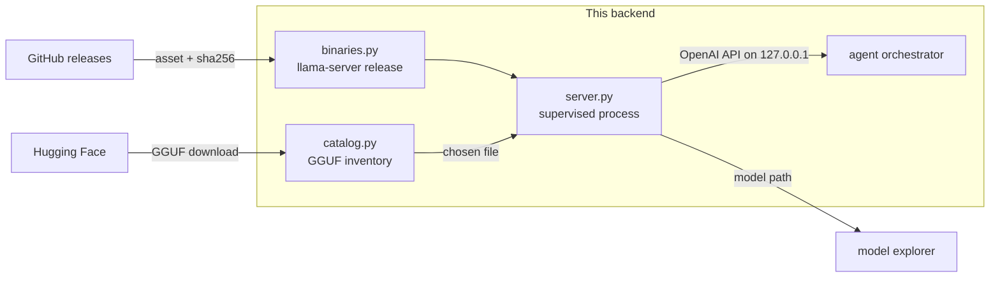

# Module: llamacpp

The node serving its own weights. Ollama and LM Studio are *applications* the user
installs and runs elsewhere; this module makes the backend itself fetch a
`llama-server` build, keep a catalog of GGUF files, and supervise the process the
agent talks to.

**Status: implemented** — backend in `backend/modules/llamacpp/`, frontend in
`packages/core/src/modules/llamacpp/`, tests in `backend/tests/test_llamacpp.py`.

## Why this is not just another provider entry

Every other local provider answers "which model are you running?" with a *name*. It
cannot tell you which file that name resolves to, what quantization it is, or how
big it is — which is why [`interpretability`](./interpretability.mdx) has to
reverse-engineer a path out of Ollama's blob store and LM Studio's undocumented
index just to read a tensor table. Here the node picked the file, so the path is
**known rather than inferred**, and the model explorer gets its highest-confidence
source for free.

The second reason is that it removes the last hard dependency on somebody else's
app. A packaged node can serve a model with nothing else installed.



## Three artifacts, three lifetimes

| | Where it comes from | Where it lives | Who owns it |
| --- | --- | --- | --- |
| The binary | Upstream GitHub release, downloaded on demand | `$HORRIBLE_DATA_DIR/llamacpp/bin/<tag>-<variant>/` | us |
| The weights | Hugging Face, or already on disk | `$HORRIBLE_DATA_DIR/llamacpp/models/`, or Ollama's / LM Studio's store | mixed |
| The process | Spawned by `server.py` | pid + a loopback port | us |

Nothing is bundled. That is the same call as SearXNG, AssaultCube content and the
DB-IP database: we support it, we fetch it on request, we ship none of it.

### Asset selection is matched, not hardcoded

Release asset names have changed shape several times, so pinning exact strings
guarantees a break on some future release. `select_asset` matches on the tokens that
carry meaning — OS, arch, accelerator — with two rules that are the whole test suite:

- **An accelerator build is never substituted for `cpu`.** A CUDA archive's name
  contains every token a CPU one does, plus one. Downloading it onto a machine with
  no NVIDIA driver produces a binary that fails to load its runtime, which reads
  like a corrupt download.
- **The extension is per-OS.** Upstream ships `.zip` for Windows and `.tar.gz`
  everywhere else. Matching only `.zip` — as this did until it was caught — reduced
  the whole module to a Windows feature, and reported it in upstream's voice:
  _"release b10373 publishes no cpu build for ubuntu/x64"_. Both formats now match
  and `_extract` picks the reader by extension rather than by OS, because the
  extension is what the bytes actually are.
- **The name must start with `llama-`.** Releases also carry
  `cudart-llama-bin-win-cu12.4-x64.zip`, the CUDA *runtime redistributable*, which
  matches every other token, is shorter than the real CUDA build, and contains no
  server at all.

When nothing matches, the error names the assets it *did* see, rather than failing
blind on a release whose naming moved again.

### The picker knows before you click install

`select_asset` used to run only *after* the user picked a variant and hit
Install — a release publishing no CUDA build for Linux surfaced as an error only
once the download was already "starting." `GET /llamacpp/install/variants` runs
the same match ahead of time, for every variant against the current release and
this OS/arch, and the pane's `<select>` greys out (`disabled`) any option that
comes back unavailable, labelled with the release tag. It reuses `select_asset`
rather than a second notion of "available" that could disagree with what
actually gates the download; a failed lookup (offline, GitHub down) leaves every
option enabled, since "we could not ask" must never be shown as "unavailable."

### Which variant, though — the hardware probe decides

`variant` used to default to a flat `cpu`, which is correct on a machine with no
GPU and silently wrong on every machine with one. It now defaults to `"auto"` and
is resolved by the [hardware probe](hardware.mdx), which still falls back to `cpu`
whenever it could not determine what the machine has — the asymmetry above still
holds, and "we could not ask" must never install a CUDA build.

**The card alone does not decide the variant; the OS does too.** Upstream
publishes CUDA for **Windows only** — there is no `ubuntu-cuda-*` asset in any
release, because Linux NVIDIA users are expected to build it or run the Vulkan
build. So an NVIDIA card on Linux resolves to `vulkan`, with a reason string that
says why. Getting this wrong is not a slow build, it is *no install at all*, and
it only became reachable when the default moved from `cpu` to `auto`.
`test_upstream_publishes_no_linux_cuda_build` pins the upstream fact, so if a
Linux CUDA asset ever appears the special case can be deleted on a failing test
rather than on a hunch.

The same probe supplies `gpuLayers` and `threads` at spawn and `tokenCap` for a
trace. Those request fields are **nullable**, and the resolution is an `is None`
check rather than a falsiness one: an explicit `0` is a request for pure CPU and
has to survive.

### Verification says what it actually knows

GitHub publishes a `digest` for release assets. When it is there, a mismatch aborts
the install and **nothing is written** — an unverified half-install that a later
`newest_install()` hands to the spawner is worse than no install. When it is absent,
the digest we computed is recorded and the install is marked `verified: false`,
which the pane renders as a chip. Recording a self-computed hash and calling it
verification would be theatre.

## The catalog

Three origins, and the distinction is load-bearing:

- **`managed`** — under our models directory. Downloadable, deletable, counted
  against the disk budget.
- **`ollama` / `lmstudio`** — files those apps own. **Serveable, never touched.**
  `llama-server` memory-maps a GGUF read-only, so pointing it at LM Studio's copy
  costs nothing, and duplicating a 20 GB file to "own" it would be absurd. But a
  delete route that can reach into another app's store is a footgun, so the origin
  gates deletion — and `is_managed` resolves both paths, because a `..` segment in a
  caller-supplied path is exactly how a delete route becomes an
  arbitrary-file-delete route.
- **`extra`** — directories added via `llamacpp.modelDirs`.

`mmproj-*.gguf` is skipped everywhere. A multimodal repo ships its vision projector
beside the weights: a real GGUF that parses cleanly and cannot be served as a chat
model, so offering it in the picker is a guaranteed bad spawn. It is the same trap
the [model explorer](./interpretability.mdx) hits from the other direction.

The quantization label is the **most common tensor type**, not `general.file_type`:
that KV is an enum id whose meaning has shifted between llama.cpp releases, and a
mixed-quant build (most K-quant files keep some tensors at F32) is the norm. Header
facts are memoized on `(path, size, mtime)` — scanning a directory of 20 GB files on
every status poll would otherwise re-read all of them.

### Models you trained land here too

The [training](./training.mdx) module converts a finished checkpoint into a GGUF in
the **managed** directory, so it shows up in this catalog like any download and is
served the same way. That is the loop closing: train it here, serve it here, look
inside it here. A LoRA result is labelled an adapter, because `llama-server` takes
it with `--lora` beside a base model rather than serving it alone.

### The disk budget is pre-flight

A download is refused **before a byte is written**, against the size the server
declares in a `HEAD`. Checking as it goes means discovering the disk is full 30 GB
into a 40 GB transfer. The ceiling is `llamacpp.diskBudgetGb` (default 80).

Downloads write to a `.part` file and rename on success, so an interrupted transfer
can never be picked up by the catalog scan as a servable model — a truncated GGUF
fails at load time with an error that reads like a corrupt *model*.

## The server

### `--jinja` is passed explicitly, never inherited

It selects the model's **own** chat template, which is what carries its tool-call
syntax. Upstream currently defaults it on — verified on b10362, where a server
started without it reports the same template — but the default has flipped before,
`--no-jinja` exists, and it also reads `LLAMA_ARG_JINJA` from the environment. So
whether the agent can call tools would otherwise depend on which build happened to
be downloaded and what is in the user's env.

Without the model's template, `llama-server` accepts only "commonly used" templates
and falls back to a generic one for the rest — and that failure is **silent**: 200,
a perfectly fluent answer, and every tool in the schema simply never called, which
is indistinguishable from "this small model is bad at tool use". Hence the explicit
flag, and the test that pins it.

### Ready is not the same as running

Loading a large GGUF takes tens of seconds, during which the process is up and every
request is refused. `wait_ready` polls `/health`; the status the pane reads
distinguishes `running` from `ready`, and a process that dies during load reports
its last log lines rather than a timeout.

### Two more things that would otherwise bite

- **The port is negotiated, not assumed.** Hyper-V reserves ranges that swallow
  ordinary dev ports on this machine, and 8080 is a popular one, so the manager
  binds the default if it can and takes an ephemeral port if it cannot. This is why
  `_endpoint_for` checks the **live manager before the saved config** for this
  provider alone — a saved `:8080` would point at nothing while the real server sat
  elsewhere.
- **Spawning goes through `subprocess.Popen` on a thread.** Under
  `uvicorn --reload` on Windows the loop is a `SelectorEventLoop`, where asyncio
  subprocess creation raises — the same reason the LSP and PTY managers do it this
  way. The app's lifespan stops the server on shutdown, or an orphan survives a
  reload holding gigabytes of mapped weights and a bound port.

## Chat integration: four lines, not a new dialect

`llama-server` speaks the OpenAI API, so this is one `PROVIDERS` entry with
`dialect="openai"` and `can_spawn=True`. Everything already built on that dialect —
streamed reasoning, tool-call assembly from indexed deltas, the
`tool_choice="required"` retry — works unchanged.

A bespoke dialect would have meant six new branches in `providers.py` **and would
have silently lost that retry**, which is gated on `info.dialect == "openai"`.

It is deliberately not `can_pull`: weights are fetched by this module's catalog, not
by asking the inference server to pull them the way Ollama does.

## Per-agent provider selection

`model`, `temperature`, `contextSize`, `maxTokens` and `topP` have been per-agent
since the roster landed. `provider` and `endpoint` were not — which made "run the
coder on the node's llama.cpp server and leave the orchestrator on Ollama"
unexpressible, because the only per-agent knob was a model *name*, and a name means
nothing on a server that does not have that model.

`roster.resolve_provider(config, agent_id)` resolves both, per key:
`agent.<id>.provider` → `agent.orchestrator.provider` → the saved global config. An
override naming an unknown provider is **ignored, not fatal** — a stale settings
value must not take the agent down.

:::warning Every call site, or the override is a lie
`run_agent_loop` is called from three places: the orchestrator
(`orchestrator.py`), local delegation (`delegate.py`), and the flow executor's Agent
node. A site left on `provider_for(config.provider)` does not fail — it quietly runs
that path on the *global* provider, which is how a delegate ends up on a different
model than the one its settings show.
:::

## Contributions to the layout shell

| Kind | ID | Notes |
| --- | --- | --- |
| Panel | `llamacpp.server` | "llama.cpp" 🦙; singleton, role `widget` |
| Section | `llamacpp.server` → `server` | Default, key <kbd>s</kbd> — build + process + log |
| Section | `llamacpp.server` → `models` | Key <kbd>m</kbd> — catalog + downloads |
| Section | `llamacpp.server` → `traces` | Key <kbd>t</kbd> — the activation scrubber |
| Command | `llamacpp.open` | llama.cpp: Server and models |
| Setting | `llamacpp.modelDirs` | Extra GGUF directories to scan |
| Setting | `llamacpp.diskBudgetGb` | Ceiling for the managed directory |
| Setting | `llamacpp.traceBudgetGb` | Ceiling for stored traces (default 2 GB) |

One pane, three sections — the build, the weights and the traces are one workflow in
a strict order (no build, no server; no weights, nothing to serve; nothing served,
nothing to look inside), so splitting them would
give panes of which most are usually an instruction to open another. The pane is
also tabbed into the [Lab](./lab.mdx) frame beside the Hub and the model explorer:
find weights → serve them → look at what you served is one working position.

Provider and endpoint overrides are edited in **Settings → Agent orchestrator**,
beside the model override they have to agree with.

## Backend surface

| Method | Path | Purpose |
| --- | --- | --- |
| `GET` | `/api/llamacpp/status` | Build, process, readiness, log tail |
| `POST` | `/api/llamacpp/install` | Download + unpack a build (NDJSON progress) |
| `POST` | `/api/llamacpp/install/remove` | Delete a build (refused while it runs) |
| `GET` | `/api/llamacpp/models` | Catalog + disk usage + starter repos |
| `GET` | `/api/llamacpp/repo?repo=` | GGUF files in a Hugging Face repo, with sizes |
| `POST` | `/api/llamacpp/models/download` | Fetch one GGUF (NDJSON progress) |
| `POST` | `/api/llamacpp/models/delete` | Delete a managed model (403 otherwise) |
| `POST` | `/api/llamacpp/start` | Spawn on a chosen GGUF, optionally waiting for ready |
| `POST` | `/api/llamacpp/stop` | Terminate |
| `GET` | `/api/llamacpp/traces` | Stored traces, disk usage, and whether tracing is available at all |
| `POST` | `/api/llamacpp/traces/estimate` | Pre-flight cost, from the GGUF header |
| `POST` | `/api/llamacpp/traces` | Run one traced forward pass (NDJSON progress) |
| `GET` | `/api/llamacpp/traces/{id}` | Manifest, record list, tokens |
| `GET` | `/api/llamacpp/traces/{id}/record/{i}` | One record's values, decoded server-side |
| `GET` | `/api/llamacpp/traces/{id}/tensors` | The raw blob, honouring `Range` |
| `DELETE` | `/api/llamacpp/traces/{id}` | Delete a trace |

Progress rides **NDJSON on the request**, not a `/ws` channel — the shape
`/agent/pull` already uses, and it keeps a multi-gigabyte transfer scoped to the
request that asked for it: navigating away cancels it rather than leaving a
broadcast running for nobody. The shared client helper is `streamNdjson` in
`packages/core/src/api.ts`.

A Hugging Face token is used when the connector is connected, and not required: the
great majority of GGUF repos are public, so gating weights on an OAuth flow nobody
needs would be backwards.

## Browser vs desktop

No difference. The server is a backend child process and the pane is ordinary HTTP —
both layouts drive the same node. The only asymmetry is the usual one: a browser
layout pointed at someone else's backend manages *that* machine's models, which is
what "the node serves its own weights" means.

## Testing

`backend/tests/test_llamacpp.py`. The tests worth keeping are the ones pinning
failures that are otherwise **silent**:

- `--jinja` present on every spawn, so the model's own chat template is never left
  to a build default or an env var.
- An accelerator build is never selected for a `cpu` request, and `cudart-*` is
  never mistaken for a server.
- A digest mismatch leaves **no install behind**.
- An asset with no published digest installs as `verified: false`.
- `delete` refuses a path outside the managed directory, including one that walks
  out of it via `..`.
- The disk budget refuses before writing.
- A per-agent provider override reaches resolution, an unknown one degrades to the
  configured provider, and an unoverridden agent is untouched.

## The tracer

Everything above serves tokens. This part serves **activations**: a traced forward
pass, captured node by node out of ggml and written to disk.

It is a **separate artifact from the chat path and stays that way**. Chat runs a
downloaded `llama-server` binary; tracing runs whatever libllama the
`llama-cpp-python` wheel bundled, installed by `uv sync --extra llamacpp` and pinned
with `==` rather than `>=`. The chat provider must not depend on the risky code, and
the two llama.cpps genuinely disagree — which is why a trace may only be overlaid on
a chat turn when **both** `llamaBuild` and `modelSha` match (`traces.matches_run`).
A pane that overlaid them anyway would be showing a forward pass that did not
produce the answer above it.

### Why snapshots, not a stream

Attention scores alone are fp32 `[n_kv, n_tokens, n_head]` — roughly 33 MB *per
layer per pass* at 512 tokens and 32 heads, about a gigabyte across 32 layers. A
live tensor feed is therefore a websocket carrying a gigabyte a second to a pane
that can render none of it. A run writes a snapshot and the pane scrubs it
afterwards, which also makes a trace something you can keep, compare and delete.

```
$HORRIBLE_DATA_DIR/llamacpp/traces/<trace_id>/
  manifest.json   # provenance + every record (name, layer, pass, op, dtype,
                  # ne[4], nb[4], offset, length, fidelity)
  tokens.json     # the tokens the pass actually ran on
  tensors.bin     # one append-only blob, records in capture order
```

One blob rather than a file per layer — hassault's cube-grid precedent literally.
Per-layer files give thousands of handles and *still* cannot address a single node
inside a layer; blob plus `Range` gives both, and the range handling (including the
suffix form, where `bytes=-3` is the **last** three bytes) is copied from karaoke
along with its tests.

### The ggml ABI is the top risk, and it is contained three ways

`struct ggml_tensor` is internal C with no stability promise, and
`llama-cpp-python` declares the `cb_eval` callback type and **zero ggml accessors** —
so the callback hands over a `void *` that nothing in the wheel can read.
`ggml_abi.py` closes that gap as narrowly as possible:

1. **Mirror as little as possible.** Only the first four fields (`type`, `buffer`,
   `ne[4]`, `nb[4]`). Name, op and data are read through functions ggml *exports* —
   the same instinct as serving `plane_order` instead of hardcoding it.
2. **A self-check gates every trace.** On the first tensor, `nbytes` is recomputed
   from `(type, ne, nb)` using ggml's own formula and compared against
   `ggml_nbytes()`, and a dimension count derived from `ne` against `ggml_n_dims()`.
   A field inserted upstream shifts the layout and the two disagree immediately.
   On mismatch the run **aborts and writes nothing** — a trace that parses but is
   garbage is worse than no trace.
3. **The tracer is a subprocess.** `python -m backend.modules.llamacpp.tracer
   <spec.json>`, spawned with `subprocess.Popen` on a worker thread (never
   `asyncio.create_subprocess_exec` — under `uvicorn --reload` on Windows the loop
   cannot spawn subprocesses at all). A segfault inside a ggml callback is then an
   exit code the runner reports, not a dead FastAPI backend mid-turn. A non-zero
   exit with no error line is reported as exactly that.

Those exported functions live in **`ggml-base`, and only there**. A modern wheel
splits the build into several shared libraries, and `llama.dll` re-exports none of
the ggml API — nor does `ggml.dll` (the backend registry) or `ggml-cpu.dll`. Nor is
the CDLL reliably reachable from `llama_cpp._ggml` under a fixed attribute name (it
has been both `lib` and `libggml`). So `_ggml_candidates()` yields every plausible
holder — each CDLL bound on `_ggml`, then `*ggml-base*` from the wheel's `lib/`
directory, then the old single-library `llama_cpp.llama_cpp._lib` — and each is
**probed for `ggml_nbytes` before being accepted**. Picking a library by name
instead surfaces later and further away, as `AbiMismatch: ggml exports none of
ggml_type_name` out of `bind()`, which reads like an upstream ABI break rather than
the wrong file being open.

### Four things that fail silently if forgotten

- **Flash attention must be disabled explicitly.** With it on,
  `ggml_flash_attn_ext` is one fused node and the score matrix never materialises —
  attention capture would produce *nothing*, reading as a bug in the name filter
  rather than a missing flag. Recent llama.cpp auto-enables it, so the default is
  not safe; `_disable_flash_attn` sets `flash_attn_type` (or the older `flash_attn`
  bool, whichever this build has).
- **The `CFUNCTYPE` instance is held in a module global.** Built inline, it is
  garbage-collected the moment the call that created it returns and the next graph
  node jumps into freed memory.
- **Quantized tensors are recorded as metadata only.** Dequantizing in Python would
  be a second implementation of ggml's block formats — wrong in one corner and
  plausible everywhere else. There is no dequantizer here, and `traces.decode`
  refuses a quantized dtype rather than guessing.
- **No chat template is applied.** The prompt is traced as raw text; rendering a
  template ourselves would put a *different* token sequence through the model than
  the one shown beside it. The manifest carries `chatTemplate: false` and says so.

### Everything declares what it is

The module's three-state honesty applies unchanged:

- Every record carries a **`fidelity`** — `full` (the tensor), `fp16` (a downcast of
  it), or `summary` (statistics **instead of** the tensor). A summary record has no
  bytes by construction: `TraceWriter.append` refuses a payload for one, the record
  route returns empty `values`, and the pane draws the statistics as statistics.
- **`modelSha` says what it hashed.** Digesting 20 GB to open a pane would be
  absurd, so it is the GGUF's first megabyte plus its size, and every manifest
  carries `modelShaScope: "gguf-header-1mib+size"`. It is enough to catch "a
  different model" and does not pretend to be a whole-file checksum.
- **The estimate is labelled an estimate.** `POST /traces/estimate` costs the run
  from the GGUF header (`block_count`, `embedding_length`, `attention.head_count`)
  *before* it starts, because the difference between a 200 MB trace and a 12 GB one
  is one checkbox and a progress bar that has already started is too late. The
  manifest's `blobBytes` is what actually happened.

Cost control is three layers: a hard `MAX_TRACE_TOKENS` cap (512) regardless of what
the caller asks for, attention off by default and per-layer opt-in, and a global
byte budget (`llamacpp.traceBudgetGb`, default 2 GB) pruned oldest-first after every
run.

### Testing

`backend/tests/test_llamacpp_trace.py`, and it needs **no native library** — `bind()`
is duck-typed against a stub ggml, so the ABI check is exercised as arithmetic over
ctypes structures built in Python memory. The tests pin: the self-check passing on a
consistent tensor and **failing** on a mutated one (both the `nbytes` and the
`n_dims` disagreement), the quantized block branch (misreading `nb[0]` as a stride
overstates a q5_0 row by 32×), manifest/blob round-trip including a zero-length
summary record, `Range` requests including the suffix and open-ended forms,
server-side decoding of both dtypes, a summary record returning **no** values,
oldest-first pruning, the overlay guard refusing when either the build or the model
differs, and a trace id that tries to walk out of the trace directory with `..`.

## Not done here

`topk` fidelity is declared as an idea and not implemented — only `full`, `fp16` and
`summary` are written, and the enum lists exactly those. Traces are not yet overlaid
on a chat turn in the interpretability pane: `traces.matches_run` is the guard that
work will need, but the pane wiring is not built. The tracer also samples greedily
and traces a raw prompt, so it reproduces a *forward pass*, not a chat turn.
