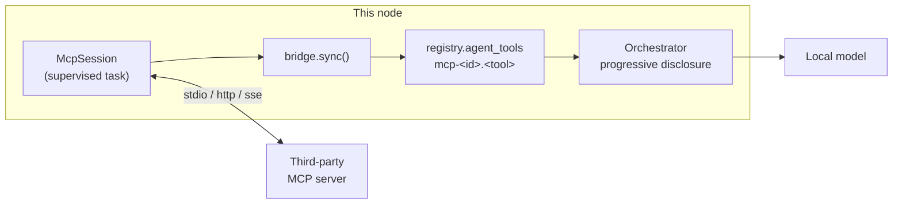

# Module: MCP

Connect this node to third-party **MCP** ([Model Context Protocol](https://modelcontextprotocol.io))
servers, and hand everything they expose — tools, prompts, resources — to the agent.

MCP is the *vertical* axis of interop: one agent reaching its tools and context. It is
orthogonal to the [peer fabric](../architecture/distributed.mdx), which is the
*horizontal* axis (agent ↔ agent across nodes). See the
[interop analysis](../architecture/agent-commons.mdx#interop--standards-a2a--mcp--ap2--a2ui)
for why both exist.

**Status:** client implemented (stdio + http/sse transports, tools, prompts, resources,
servers pane) **and** the exported server implemented (read-only trajectory + telemetry
introspection, off by default — see [The server we export](#the-server-we-export)).
Backend `backend/modules/mcp/`; frontend `packages/core/src/modules/mcp/`.

## Contributions to the layout shell

- **Panels** — `mcp.servers` ("MCP Servers", 🔌, `role: 'tool'`, `defaultDock: 'left'`,
  singleton). Configuration you consult while working, not a document you work in.
- **Commands** — `mcp.openServers`, `mcp.addServer`, `mcp.status`.
- **Chat** — `/mcp` lists servers inline, `/mcp open` runs `mcp.openServers`.
- **Keybindings / settings** — none.

## One server is one tool group

This is the entire integration, and everything else follows from it:

| MCP concept | Becomes |
| --- | --- |
| server `<id>` | tool group `mcp-<id>` |
| tool `<name>` | agent tool `mcp-<id>.<name>` |
| server `instructions` + `prompts` + `resources` | the group's **guide** |
| `readOnlyHint` annotation | `side_effect=False` (skips the permission prompt) |

The orchestrator derives a tool's group from the namespace before its first dot
(`_group_of`), so MCP tools inherit
[progressive disclosure](agent-chat.mdx#hierarchical-tools--progressive-disclosure), the
`list_tool_groups` catalog, the permission gate, and roster scoping **for free**. A
specialized agent can load an MCP server by naming its group:

```python
AgentSpec(id="coder", tool_groups=["files", "editor", "mcp-github"], ...)
```



### Why the `mcp-` prefix

Without it, an MCP server called `github` would land in the **same group** as the
[GitHub connector](connectors.mdx#github) — one blurb, one guide, two unrelated tool
sets silently merged. The prefix makes that collision structurally impossible, and it
tells the model (which reads group names) where a capability comes from.

## Prompts are the documentation win

A server's `instructions` and named prompts become the group's **guide** — the second
tier of disclosure. The blurb answers "would this group help?"; the guide answers "how
do I use it without getting it wrong?", and it is only ever injected once the group is
active, so it costs **nothing** on turns that never touch that server.

Third-party guide text is fenced with an explicit note that it is server-supplied and
must not be followed as user instruction. That does not make a hostile server safe — it
makes an opportunistic one legible. Guides are capped at 4000 characters so a chatty
server cannot crowd out the rest of the context.

## Why we ship our own stdio transport

The SDK's `stdio_client` spawns via `anyio.open_process` → `asyncio.create_subprocess_exec`,
which on Windows is implemented **only** on the `ProactorEventLoop`. uvicorn runs the app
on the `SelectorEventLoop` whenever `--reload` is set — which `pnpm dev` always passes.
The result is a bare `NotImplementedError` at spawn time: every stdio MCP server would
silently fail to start for anyone developing on Windows.

`transport.py` spawns with blocking `subprocess.Popen` on a worker thread and pumps
stdout on a daemon thread, bouncing sends back to the loop with
`run_coroutine_threadsafe`. That is loop-agnostic — Proactor, Selector and uvloop alike.
It is the same fix the [LSP pipe](editor.mdx) and the terminal PTY already use, and
`ClientSession` cannot tell the difference: it only ever sees a pair of anyio memory
streams.

Windows also needs `.cmd` shim resolution (`npx` → `npx.cmd`) and `CREATE_NO_WINDOW`, or
most servers either fail to launch or flash a console window on the user's desktop.

## Each session owns a task

The SDK exposes transports and `ClientSession` as async context managers, and anyio
requires the entering task to be the exiting one. A session therefore cannot be opened in
one request and used by the next. Each server gets a **dedicated supervisor task** that
enters the stack, initializes, discovers the catalog, then parks on a stop event —
keeping the session callable from any other task until teardown.

Discovery is eager and cached: a turn that loads an MCP group must not pay a round-trip
to enumerate tools while the model waits.

## Failure is a status, not an exception

A server that will not start reports `state: "error"` with the reason. It never raises
into the lifespan — a broken MCP server must not stop the backend from booting, exactly
as the [plugin loader](../architecture/backend-plugin-sdk.mdx) surfaces per-plugin
failures. The pane shows the resolved `argv` and the error text, because "command not on
PATH" is the normal failure and a red dot alone is unactionable.

## Credentials

Server configs live in `.data/mcp-servers.json` — plaintext, and deliberately so: a
command line or URL is not a secret and the UI should show it. A bearer token is not
stored there. It goes to the Fernet-encrypted secrets store under `mcp:<id>`, and is
**write-only** across the API: submitted once, reported thereafter only as `hasToken`.

An MCP token must never be a setting — `GET /api/settings` hands the whole settings bag
to the browser. The config store enforces this with a key allow-list, so a `token` field
submitted alongside a config is dropped rather than persisted.

Note that a stdio server is an **arbitrary local process** the user configures. That is
the same trust model as [backend plugins](../architecture/backend-plugin-sdk.mdx):
trusted and unsandboxed in v1, localhost-oriented.

## Backend surface

Mounted at `/api/mcp`:

| Method | Path | Purpose |
| --- | --- | --- |
| `GET` | `/servers` | Every configured server + live state (never a token) |
| `POST` | `/servers` | Add or update, then connect if enabled |
| `DELETE` | `/servers/{id}` | Disconnect and forget, including the stored token |
| `POST` | `/servers/{id}/connect` | (Re)connect — the retry after a failure |
| `POST` | `/servers/{id}/disconnect` | Drop the session, keep the config |
| `POST` | `/servers/{id}/resource` | Read one resource by URI |

Enabled servers connect during the app lifespan and are torn down on shutdown — stdio
servers are child processes, and leaving them behind on reload would strand orphaned
`node`/`python` processes.

## Browser vs desktop

| | Browser layout | Desktop layout |
| --- | --- | --- |
| Servers pane | ✅ | ✅ |
| stdio servers | ✅ (backend spawns them) | ✅ |
| http/sse servers | ✅ | ✅ |

No difference: sessions live on the backend, so both layouts are thin clients over the
same connections.

## The server we export

The other direction: horrible-dashboard **as** an MCP server, so an external agent
(Claude Desktop, another node, a CI job) can ask what this node's agent has been doing.

It is an **interpretability surface, not a control surface**. Every exported tool is
read-only — nothing can open a pane, run a command, edit a file, or start a turn. A test
asserts that every tool carries `readOnlyHint`, because a write tool here would turn a
bearer token into remote control of the node.

| Tool | Answers |
| --- | --- |
| `describe_node` | Which agents exist and what they're scoped to |
| `list_agent_turns` | Which turns ran, when, for which agent |
| `get_agent_turn` | One turn's rounds, token costs, loaded tools |
| `get_turn_tree` | How work was delegated (`main` → `coder`, peer leaves) |
| `get_trajectory_stats` | Totals, time range, per-agent breakdown |
| `list_io_events` | Recent network I/O — **metadata only** |
| `get_io_summary` | Aggregate counts and error rate per source |

### Off by default, and why

Two independent reasons, either sufficient on its own:

1. **`IoEvent` captures raw headers and bodies.** Its model docstring says the buffer
   "can hold credentials and personal data" — it is a local introspection tool that
   deliberately does not sanitize. Serving it verbatim would be a credential
   exfiltration endpoint with a friendly name.
2. **Turn snapshots contain the user's prompts**, the focused editor buffer, and tool
   results — the contents of whatever they were working on.

So the server mounts only when `HORRIBLE_ENABLE_MCP_SERVER=1`, requires a generated
bearer token (held in the encrypted secrets store under `mcp_server_token`, revealed
only by an explicit `POST /api/mcp/export/token`), and **redacts content by default**:

- Telemetry is an **allow-list** of metadata fields — a new `IoEvent` field must be
  consciously opted in rather than leaking because nobody remembered to exclude it.
  Bodies and headers are never exported, regardless of settings.
- Turn *listings* carry no context blocks at all.
- Turn *detail* returns block **shape and token cost** but not text, unless
  `mcp.server.exposeContent` is explicitly enabled. The response's `contentRedacted`
  field says which applied.

Redaction lives in `_event_summary` and `_turn_detail` — the only two paths out — so a
new tool cannot forget it.

### Mounted sub-apps do not get lifespan events

The one non-obvious wiring detail. `streamable_http_app()` normally starts its session
manager in its own lifespan, but **Starlette does not propagate lifespan to apps
attached with `Mount`**. Without intervention the mount succeeds, the route exists, and
every MCP request fails with `RuntimeError: Task group is not initialized` — a 500 that
reads like a protocol bug rather than a missing hook.

So the app lifespan enters `mcp_export.session_lifespan()`, which drives the session
manager and is a no-op when the export is disabled.

## Roadmap

- **Resources → library.** Ingest MCP resources into a [library](library.mdx) as
  sources, making a server's documents searchable by RAG rather than only readable on
  demand.
- **Editor/format tools on the export.** Exposing buffers and format conversion through
  the exported server, so an external agent can read what's open — a bigger disclosure
  question than trajectories, and deliberately not bundled with them.
- **Sampling.** MCP lets a server call *back* into the client's model. Deferred — it
  re-enters the orchestrator and needs its own loop/permission story.
