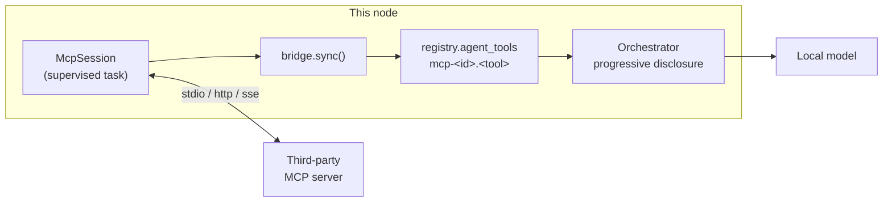

# Module: MCP

Connect this node to third-party **MCP** ([Model Context Protocol](https://modelcontextprotocol.io))
servers, and hand everything they expose — tools, prompts, resources — to the agent.

MCP is the *vertical* axis of interop: one agent reaching its tools and context. It is
orthogonal to the [peer fabric](../architecture/distributed.mdx), which is the
*horizontal* axis (agent ↔ agent across nodes). See the
[interop analysis](../architecture/agent-commons.mdx#interop--standards-a2a--mcp--ap2--a2ui)
for why both exist.

**Status:** client implemented (stdio + http/sse transports, tools, prompts, resources,
servers pane, **registry discovery, pre-install inspection, per-server context
accounting and a JSON-RPC transcript**); **authoring implemented** (scaffold a server
into its own environment, edit it here, restart on save, invoke a tool from a generated
form, and run a [conformance suite](#the-conformance-suite)); and the exported server
implemented (read-only trajectory + telemetry introspection, off by default — see
[The server we export](#the-server-we-export)). Backend `backend/modules/mcp/`;
frontend `packages/core/src/modules/mcp/`.

## Contributions to the layout shell

- **Panels** — `mcp.servers` ("MCP Servers", 🔌, `role: 'document'` + `dockable: 'left'` — four sections including an authoring surface do not fit a 280px rail, and `dockable` keeps the rail glyph for consulting one beside your work,
  singleton). Configuration you consult while working, not a document you work in.
  Four **sections**: `servers` (<kbd>s</kbd>, default), `discover` (<kbd>d</kbd>),
  `author` (<kbd>a</kbd>) and `export` (<kbd>x</kbd>).
- **Commands** — `mcp.openServers`, `mcp.addServer`, `mcp.discover`, `mcp.author`,
  `mcp.export`, `mcp.status`.
  `section.show:mcp.servers:discover` is synthesized by the registry; `mcp.discover`
  exists because that command only reveals a section of an *already open* pane.
- **Chat** — `/mcp` lists servers inline, `/mcp open` runs `mcp.openServers`.
- **Keybindings** — none. **Settings** — `mcp.server.exposeContent`, and it is now
  rendered in the Export section beside the server it describes as well as in the
  generic settings page.

One pane with four sections rather than four panes: finding a server, writing one,
running one and *being* one are the same object at four moments. Discover hands its result straight to
Servers, and a scaffolded project *becomes* an ordinary row in Servers the moment it is
provisioned. Splitting them would mean three copies of the config shape and a hand-off
across every pane boundary.

## Discovering a server

The [official registry](https://registry.modelcontextprotocol.io) is queried live and
merged with a **curated overlay** we ship (`curated.json`) — the same shape the
[search](search.mdx) module uses for engines, and for the same reason. The registry is
comprehensive and unopinionated, thousands of entries, many published once by one
person; the overlay is six entries with a sentence each about *why you would want
this*. Neither alone is a good browse.

Two details are load-bearing:

- **The registry's rows are versions, not servers.** `GET /v0/servers` returns one row
  per published version, so an unfiltered browse is routinely three copies of one
  server. `version=latest` is passed on every call.
- **A registry outage is not an empty result.** `registryOnline: false` means the list
  is the shipped overlay alone, and the pane says so — otherwise "the registry is down"
  reads as "nothing matched".
- **An overlay entry may pin its runtime dependencies.** `uvx`/`npx` resolve a
  server's deps fresh at launch, so a server that lags its own SDK dies at import
  with a traceback the user has no way to read as "not your fault". The `fetch`
  entry therefore carries `runtimeArguments` of `--with mcp<2`: the Python SDK's
  2.0 renamed `McpError` → `MCPError` and `mcp-server-fetch` still imports the old
  name.

### An entry is a description, not a command line

An entry carries `packages` (an npm/pypi/oci identifier with argument and environment
declarations) and `remotes` (a URL). `catalog.install_options` turns both into configs
this node could actually launch, which is where the sharp edges live:

| Trap | What happens without the fix |
| --- | --- |
| `runtimeHint` is frequently absent | Nothing to spawn. Inferred from `registryType`: npm → `npx`, pypi → `uvx`, oci → `docker` |
| `npx` prompts before installing | Its stdin **is** the protocol pipe, so the prompt is never answered and the connect dies 90s later. `-y` is added when the entry didn't declare it |
| An argument declared with no value | A `--root` the *user* must supply is not a value we have. Emitting the flag alone yields an argv that fails unreadably, so valueless declarations are skipped |
| An unmappable registry type | Returned with an empty command and a reason, rather than a command line that fails confusingly |

Remotes are listed first: a hosted server needs nothing installed and executes none of
the publisher's code on this machine.

### Inspect before you add

**`POST /api/mcp/probe`** connects a *candidate* once — in a scratch session that is
never saved, never registers an agent tool, and gets its own transcript ring — then
reports the server's real tools, its `readOnlyHint` annotations, its prompts and
resources, and its own `instructions`. Then it tears the session down in a `finally`,
because a probe that leaves an `npx` process running is a leak with no UI to find it.

The point is the gap it closes: an entry's description is written by its publisher,
while this is the running server describing itself. Adding a server used to mean
committing to it and finding out afterwards.

It does **run the server**. For a stdio package that means fetching and executing
third-party code locally — the same act as adding it, minus the persistence — so the
pane says so next to the button rather than in a tooltip.

### The card is a shared primitive

Discover is a feed of `ResourceCard`s (`packages/core/src/ResourceCard.tsx`), not a
pane-local `<div>`. A catalog entry has an identity, a publisher's sentence, a command
worth reading before you commit, two or three inputs and a pair of buttons — and it was
drawing all of that with 32 inline `style={{}}` objects, each choosing its own font size
and gap. See [Theming](../architecture/theming.mdx#the-card-a-list-item-you-fill-in).

Three things about the entry are design decisions rather than layout:

- **`curated` and a version are different kinds of fact**, so they are drawn
  differently. The first is this node vouching for the entry and gets a status chip
  with a dot; the second is a number the publisher chose and stays neutral.
- **The command's leading word is set in the accent** — `npx`, `uvx`, `http`. That word
  is the whole of what you are deciding when you press Inspect (will this node *execute
  a package* or *call a URL*), and it answers before the line is read.
- **An env var you cannot fill is not a field.** The non-secret ones are set in the
  server's own environment after adding, so they are listed as a caption; rendering them
  as inputs made the form look like it had failed to populate itself. A secret one *is*
  a field, and a separate one, because it never reaches the config file.

The warning about Inspect running third-party code is now the card's footer caption —
small and muted beside the buttons rather than body text spanning the action bar, where
it read as an error message the pane had just produced.

## What a server costs you

`GET /servers/{id}/cost` counts the **provider-shaped** payload (`orchestrator._tool`),
not the description text: what reaches the model is serialized JSON schema, and a
server with eight tools and forty-property inputs is expensive in a way a tool *count*
never shows. Guide tokens are counted alongside, because the two load together.

Counts come from the model's real tokenizer via the
[interpretability](interpretability.mdx) module's `Counter`, and fall back to a chars/4
estimate flagged `exact: false` — which the pane renders as "estimated". An estimate
displayed as a precise number is the failure that module exists to prevent.

The same response answers "who can actually use this": the roster agents whose
`tool_groups` name the group, plus those with no scope limit at all. `tool_groups=None`
means unrestricted and `[]` means nothing — collapsing the two would report a
specialist as having access to everything, so the distinction is carried out as
`explicit`.

## The wire

`GET /servers/{id}/transcript` is the recent JSON-RPC conversation. "The tool returned
nothing" is three different bugs — the request never went out, the server answered an
error, or the answer came back in a shape the bridge flattened away — and only the wire
distinguishes them.

Recorded by **teeing the streams, not the transport**. `ClientSession` is handed a
`(read, write)` pair of anyio memory streams and neither knows nor cares what produced
them, so wrapping that pair records stdio, streamable-http and SSE with one mechanism.
Instrumenting `transport.popen_stdio_client` would have been simpler and covered stdio
only — and then "the transcript is empty" would mean "wrong transport" rather than
"nothing was sent", which is exactly the ambiguity the view exists to remove.

The ring is small (200 messages, 4 KB each) and in-process: this is a debugging view,
not an audit log, and tool arguments frequently carry the user's own text. It
**survives a reconnect** — the handshake of the attempt that failed is usually what you
came to read — but not a delete, or a later server reusing the id would inherit
someone else's conversation.

## One server is one tool group

This is the entire integration, and everything else follows from it:

| MCP concept | Becomes |
| --- | --- |
| server `<id>` | tool group `mcp-<id>` |
| tool `<name>` | agent tool `mcp-<id>.<name>` |
| server `instructions` + `prompts` + `resources` | the group's **guide** |
| `readOnlyHint` annotation | `side_effect=False` (skips the permission prompt) |

The orchestrator derives a tool's group from the namespace before its first dot
(`_group_of`), so MCP tools inherit
[progressive disclosure](agent-chat.mdx#hierarchical-tools--progressive-disclosure), the
`list_tool_groups` catalog, the permission gate, and roster scoping **for free**. A
specialized agent can load an MCP server by naming its group:

```python
AgentSpec(id="coder", tool_groups=["files", "editor", "mcp-github"], ...)
```



### Why the `mcp-` prefix

Without it, an MCP server called `github` would land in the **same group** as the
[GitHub connector](connectors.mdx#github) — one blurb, one guide, two unrelated tool
sets silently merged. The prefix makes that collision structurally impossible, and it
tells the model (which reads group names) where a capability comes from.

## Prompts are the documentation win

A server's `instructions` and named prompts become the group's **guide** — the second
tier of disclosure. The blurb answers "would this group help?"; the guide answers "how
do I use it without getting it wrong?", and it is only ever injected once the group is
active, so it costs **nothing** on turns that never touch that server.

Third-party guide text is fenced with an explicit note that it is server-supplied and
must not be followed as user instruction. That does not make a hostile server safe — it
makes an opportunistic one legible. Guides are capped at 4000 characters so a chatty
server cannot crowd out the rest of the context.

## Why we ship our own stdio transport

The SDK's `stdio_client` spawns via `anyio.open_process` → `asyncio.create_subprocess_exec`,
which on Windows is implemented **only** on the `ProactorEventLoop`. uvicorn runs the app
on the `SelectorEventLoop` whenever `--reload` is set — which `pnpm dev` always passes.
The result is a bare `NotImplementedError` at spawn time: every stdio MCP server would
silently fail to start for anyone developing on Windows.

`transport.py` spawns with blocking `subprocess.Popen` on a worker thread and pumps
stdout on a daemon thread, bouncing sends back to the loop with
`run_coroutine_threadsafe`. That is loop-agnostic — Proactor, Selector and uvloop alike.
It is the same fix the [LSP pipe](editor.mdx) and the terminal PTY already use, and
`ClientSession` cannot tell the difference: it only ever sees a pair of anyio memory
streams.

Windows also needs `.cmd` shim resolution (`npx` → `npx.cmd`) and `CREATE_NO_WINDOW`, or
most servers either fail to launch or flash a console window on the user's desktop.

## Each session owns a task

The SDK exposes transports and `ClientSession` as async context managers, and anyio
requires the entering task to be the exiting one. A session therefore cannot be opened in
one request and used by the next. Each server gets a **dedicated supervisor task** that
enters the stack, initializes, discovers the catalog, then parks on a stop event —
keeping the session callable from any other task until teardown.

Discovery is eager and cached: a turn that loads an MCP group must not pay a round-trip
to enumerate tools while the model waits.

## Failure is a status, not an exception

A server that will not start reports `state: "error"` with the reason. It never raises
into the lifespan — a broken MCP server must not stop the backend from booting, exactly
as the [plugin loader](../architecture/backend-plugin-sdk.mdx) surfaces per-plugin
failures. The pane shows the resolved `argv` and the error text, because "command not on
PATH" is the normal failure and a red dot alone is unactionable.

## Credentials

Server configs live in `.data/mcp-servers.json` — plaintext, and deliberately so: a
command line or URL is not a secret and the UI should show it. A bearer token is not
stored there. It goes to the Fernet-encrypted secrets store under `mcp:<id>`, and is
**write-only** across the API: submitted once, reported thereafter only as `hasToken`.

An MCP token must never be a setting — `GET /api/settings` hands the whole settings bag
to the browser. The config store enforces this with a key allow-list, so a `token` field
submitted alongside a config is dropped rather than persisted.

**Environment secrets take the same split.** A discovered server routinely wants an API
key in its environment, and `env` is persisted in that plaintext file — so a value put
there would sit on disk in the clear. An entry's `isSecret` variables are carried in the
config by **name only** (`secretEnv`), the values go to `mcp:<id>:env:<NAME>` in the
encrypted store, and they are resolved exactly once, in `_open`, at the moment of
spawning. A name is not a secret: the registry publishes it.

A declared secret with nothing stored is reported as `missingSecretEnv` and shown in the
pane. Without it, the failure surfaces as the server's own start error, which is rarely
legible.

Note that a stdio server is an **arbitrary local process** the user configures. That is
the same trust model as [backend plugins](../architecture/backend-plugin-sdk.mdx):
trusted and unsandboxed in v1, localhost-oriented.

## Backend surface

Mounted at `/api/mcp`:

| Method | Path | Purpose |
| --- | --- | --- |
| `GET` | `/servers` | Every configured server + live state (never a token) |
| `POST` | `/servers` | Add or update, then connect if enabled |
| `DELETE` | `/servers/{id}` | Disconnect and forget, including the stored token |
| `POST` | `/servers/{id}/connect` | (Re)connect — the retry after a failure |
| `POST` | `/servers/{id}/disconnect` | Drop the session, keep the config |
| `POST` | `/servers/{id}/resource` | Read one resource by URI |
| `GET` | `/servers/{id}/cost` | Context cost + which agents have the group in scope (409 when not connected) |
| `GET`/`DELETE` | `/servers/{id}/transcript` | The JSON-RPC wire, and clearing it |
| `GET` | `/discover` | Registry search with the curated overlay in front |
| `POST` | `/probe` | Connect a candidate once, report what it is, discard it |
| `POST` | `/servers/{id}/call` | Invoke one tool by hand (409 when not connected) |
| `POST` | `/servers/{id}/conformance` | Run the conformance suite against a live session |
| `GET` | `/projects` | Authored projects + whether `uv`/`npm` exist on this machine |
| `POST` | `/projects` | Scaffold one; registers its server **disabled** |
| `GET` | `/projects/{id}` | One project: files, provisioning state, log |
| `POST` | `/projects/{id}/provision` | Build its environment, then enable its server |
| `POST` | `/projects/{id}/register` | Put an unregistered project back in the server list |
| `POST` | `/projects/{id}/restart` | Restart it without touching a file |
| `GET`/`POST` | `/projects/{id}/file` | Read / save a source file (a save restarts) |
| `DELETE` | `/projects/{id}` | Unregister; `?deleteFiles=true` also removes the tree |

Enabled servers connect during the app lifespan and are torn down on shutdown — stdio
servers are child processes, and leaving them behind on reload would strand orphaned
`node`/`python` processes.

## Authoring a server

The second half of this module: write an MCP server *here*, and run it here. The loop is
scaffold → provision → edit → save → invoke → check, and none of it leaves the app —
which matters because the alternative loop (editor, terminal, restart the client, hope)
is where most of the friction in writing an MCP server actually lives.

### An authored server is not a second kind of server

The whole design rests on this. Scaffolding writes a project directory and then
registers an ordinary **stdio entry in `mcp-servers.json`** pointing at it. The session
supervisor, the transcript tee, the bridge, the cost view and the conformance suite all
work on it unchanged; the Author section owns only what is genuinely different — the
files, the toolchain, and the restart. The alternative (a parallel "dev server" concept
with its own lifecycle) would have meant a second implementation of everything, and the
thing you tested would not have been the thing you later ran.

Two fields are added to a server's config: `origin` and `project`.

### Provenance is a label, not a gate

The plan called for gating spawned servers the way the games module gates code
execution. On inspection that would have been **theatre**: `POST /api/mcp/servers` has
always accepted an arbitrary `command` + `args` for a stdio server and spawned it, so
authoring adds no capability that isn't already reachable — it adds *files we wrote*. A
gate on the authoring routes alone would advertise a boundary that doesn't exist.

What is genuinely useful, and what shipped, is **labelling**. `origin` distinguishes:

| `origin` | Means | Shown as |
| --- | --- | --- |
| `manual` | A command the user typed themselves | (nothing) |
| `registry` | Third-party code installed from the MCP registry | `third-party` |
| `authored` | A project scaffolded in this pane | `yours` |

It is recorded at the one moment it is knowable — when the server is added — because
nothing about a running `npx` process reveals it afterwards. An unrecognized `origin` is
coerced to `manual` on save rather than trusted: a value we don't recognize is not
evidence the code is ours.

### Templates and provisioning

Two templates, each provisioned into **its own environment** so a server never depends on
what the backend happens to have installed:

| Template | Scaffolds | Provisioned with | Runs as |
| --- | --- | --- | --- |
| `python` | `server.py` (FastMCP), `pyproject.toml` | `uv venv .venv` + `uv pip install --python <project venv> mcp` | the project's own interpreter |
| `node` | `server.mjs`, `package.json` | `npm install` | `node server.mjs` |

The Node template uses the official **TypeScript SDK from plain ESM JavaScript** — no
build step, deliberately. The edit loop here is "save, restart", and a `tsc` pass between
them means a stale binary running against fresh source, which is a class of confusion the
pane cannot explain to you.

Provisioning spawns blocking `subprocess.Popen` on a worker thread, never
`asyncio.create_subprocess_exec` — under `uvicorn --reload` on Windows the loop is a
`SelectorEventLoop` where asyncio subprocess spawn fails outright. Same pattern, and same
reason, as `backend/modules/training/envs.py` and the LSP manager.

A project is registered **disabled** at scaffold time and enabled only once provisioning
succeeds. Enabled from the start, it would try to spawn an interpreter that does not
exist yet and report a spawn error instead of "not provisioned". Missing toolchains are
named in the pane *before* a project is created, not after it fails to build.

### Hot restart is an honest restart

MCP gives a client no way to ask a server to re-read its own source, and a
`tools/list_changed` notification a server never sends will not arrive because we edited a
file. So saving a source file **restarts the process** — after which the bridge re-syncs
from live state and the agent's catalog follows the edit. The response says which:
`restarted`, plus `restartError` when the server failed to come back, which is the common
case immediately after introducing a syntax error. Reporting only "Saved" there would hide
the one thing worth knowing.

A README edit does not restart anything (`touches_runtime`) — otherwise every keystroke in
the notes costs a process spawn — while a `server.py` edit always does, since a pane
listing tools that no longer exist is the worse lie.

### The file guard

Editing is confined to the project directory, and the check is on the **resolved** path,
not the string: `..`, an absolute path (`Path(root) / "/etc/passwd"` discards the root
entirely) and a symlink out of the tree all produce something that looks relative.
`.venv`/`node_modules` are excluded from listing and editing — they would bury the three
files the user actually wrote — and only text suffixes are editable, since a binary
round-tripped through a JSON string field is corrupt by the time it lands.

**Remove keeps the source.** A list-row button is not consent to delete a source tree, and
there is no undo. The directory therefore outlives the server config, so the project stays
listed as `registered: false` with an "Add to servers" button rather than being hidden —
hiding it would mean scaffolding the same id again fails on "a directory already exists"
while the pane shows nothing that could explain why.

## Invoking a tool by hand

The **Run** view in a server's inspector generates a form from the tool's own
`inputSchema` and calls it through `McpSession.call_tool` — the same entry point the
bridge uses, so what you see is what the model would get, flattening included (which is
frequently the thing that's actually wrong).

A form, not a JSON text box: a text box makes you guess argument names and then reports
your typo as the server's error. And it is generated from exactly the schema the model is
handed, so a schema that is confusing here is confusing there. Fields the flat form can't
express (nested objects, arrays of objects) fall back to a per-field JSON textarea rather
than being dropped. An untouched optional field is **omitted**, not sent as an empty
string — most servers distinguish absent from empty.

It is deliberately **not** gated on `readOnlyHint`. That gate exists to stop a *model*
taking an action the user didn't ask for; here the user is pressing the button, and
refusing to run their own write tool would make the view useless for its purpose. The pane
says plainly when a tool isn't annotated read-only.

`elapsedMs` is reported because latency is a property of a tool the pane can measure and
the agent cannot: a nine-second tool will make every turn that touches it feel broken, and
that is invisible in a result body.

## Browsing a server's resources

The inspector's **Resources** view lists every resource the server advertises and reads
one on click.

`readResource` had been exported from the API client since the module landed with **no
consumer at all**: the tool list showed a count and the first URI followed by an
ellipsis, so a server offering forty documents looked the same as one offering two and
neither could be opened.

Content is rendered raw, for the same reason the skill preview is: a resource is
whatever the server says it is, and prettifying it here would hide exactly the malformed
payload you opened the view to look at. A resource with no text is reported by MIME type
and byte count rather than decoded — guessing at an encoding is how a binary ends up in
a `<pre>` as mojibake.

## The conformance suite

Run from the inspector's **Check** view against any connected server, third-party ones
included. Eight checks:

| Check | Catches |
| --- | --- |
| `handshake` | `initialize` without a `serverInfo` name/version or a negotiated protocol version |
| `capabilities` | Serving tools/prompts/resources without declaring the capability |
| `schemas` | A non-object `inputSchema`, a `required` naming a property that doesn't exist, a name the bridge has to rewrite, a missing description |
| `annotations` | `readOnlyHint` **and** `destructiveHint` on one tool; unannotated (therefore gated) tools |
| `unknown-tool` | A call to a tool that cannot exist returning success — or hanging until the client timeout |
| `missing-arguments` | A tool that declares required arguments and succeeds without them |
| `guide` | No `instructions` and no prompts, or a guide truncated at `MAX_GUIDE_CHARS` |
| `resources` | A resource URI with no scheme |

### What it cannot tell you

Everything above checks the server's **own declarations** for coherence and its protocol
edges for sane behaviour. None of it can check whether a declaration is *true*: a tool
annotated `readOnlyHint` may delete your files, and nothing short of reading the server's
source would reveal that. That is precisely why `bridge.py` treats an unannotated tool as
gated, and why the report says what it checked. A suite that implied "green means safe"
would be worse than no suite, so the pane spells the limit out under every run.

Note the direction of the `annotations` verdict: an unannotated tool is a **warning**,
never a failure. It is already in the safe state — gated. Failing it would train the user
to annotate everything read-only to clear the report, which is the exact opposite of what
the check is for.

### It never calls a declared tool with valid arguments

Two checks do call the server: one with a tool name that cannot exist, one with arguments
a tool declares required and which are absent. Neither can succeed by design, and the
second is aimed **only** at a tool the server itself annotated read-only — skipping
entirely when there is no such tool rather than guessing. A conformance run whose side
effect was emptying a bucket would be an unusable feature.

## Browser vs desktop

| | Browser layout | Desktop layout |
| --- | --- | --- |
| Servers pane | ✅ | ✅ |
| stdio servers | ✅ (backend spawns them) | ✅ |
| http/sse servers | ✅ | ✅ |

No difference: sessions live on the backend, so both layouts are thin clients over the
same connections.

## The server we export

The other direction: horrible-dashboard **as** an MCP server, so an external agent
(Claude Desktop, another node, a CI job) can ask what this node's agent has been doing.

It is an **interpretability surface, not a control surface**. Every exported tool is
read-only — nothing can open a pane, run a command, edit a file, or start a turn. A test
asserts that every tool carries `readOnlyHint`, because a write tool here would turn a
bearer token into remote control of the node. The pane says this out loud, because "MCP
server" reads like "remote control" to most people and the distinction is the whole
safety argument.

### It has a UI now

All of the above shipped with **no frontend consumer whatsoever**: `GET /api/mcp/export`
and `POST /api/mcp/export/token` existed and nothing called them. There was no way to see
whether the export was mounted, no way to reveal or rotate the bearer token, and nowhere
that named the environment variable which enables it. The one thing that did surface was
`mcp.server.exposeContent`, sitting in the generic settings page describing a server the
user had no way to know existed.

The `export` section renders that state: whether it is mounted, the mount path, whether a
token exists, and the content-disclosure toggle in the place it actually applies.

Two details are deliberate. The **token is never in the status payload** — `hasToken` is,
and revealing the value is a separate explicit action, because it grants read access to
this node's trajectories and telemetry. And **rotating asks first, naming the
consequence**: the old token stops working immediately, so any Claude Desktop config or
CI job already holding it breaks until it is updated.

| Tool | Answers |
| --- | --- |
| `describe_node` | Which agents exist and what they're scoped to |
| `list_agent_turns` | Which turns ran, when, for which agent |
| `get_agent_turn` | One turn's rounds, token costs, loaded tools |
| `get_turn_tree` | How work was delegated (`main` → `coder`, peer leaves) |
| `get_trajectory_stats` | Totals, time range, per-agent breakdown |
| `list_io_events` | Recent network I/O — **metadata only** |
| `get_io_summary` | Aggregate counts and error rate per source |

### Off by default, and why

Two independent reasons, either sufficient on its own:

1. **`IoEvent` captures raw headers and bodies.** Its model docstring says the buffer
   "can hold credentials and personal data" — it is a local introspection tool that
   deliberately does not sanitize. Serving it verbatim would be a credential
   exfiltration endpoint with a friendly name.
2. **Turn snapshots contain the user's prompts**, the focused editor buffer, and tool
   results — the contents of whatever they were working on.

So the server mounts only when `HORRIBLE_ENABLE_MCP_SERVER=1`, requires a generated
bearer token (held in the encrypted secrets store under `mcp_server_token`, revealed
only by an explicit `POST /api/mcp/export/token`), and **redacts content by default**:

- Telemetry is an **allow-list** of metadata fields — a new `IoEvent` field must be
  consciously opted in rather than leaking because nobody remembered to exclude it.
  Bodies and headers are never exported, regardless of settings.
- Turn *listings* carry no context blocks at all.
- Turn *detail* returns block **shape and token cost** but not text, unless
  `mcp.server.exposeContent` is explicitly enabled. The response's `contentRedacted`
  field says which applied.

Redaction lives in `_event_summary` and `_turn_detail` — the only two paths out — so a
new tool cannot forget it.

### Mounted sub-apps do not get lifespan events

The one non-obvious wiring detail. `streamable_http_app()` normally starts its session
manager in its own lifespan, but **Starlette does not propagate lifespan to apps
attached with `Mount`**. Without intervention the mount succeeds, the route exists, and
every MCP request fails with `RuntimeError: Task group is not initialized` — a 500 that
reads like a protocol bug rather than a missing hook.

So the app lifespan enters `mcp_export.session_lifespan()`, which drives the session
manager and is a no-op when the export is disabled.

## Roadmap

- **Watching the filesystem.** A save made *in this pane* restarts the server; a save
  made in an external editor does not, because nothing is watching the project
  directory. The restart is a route, not a watcher.

  This is also why the Author section still has its own textarea rather than opening
  the file in the [editor](editor.mdx), which would be a better text control in every
  other respect. The editor writes through the files module, which knows nothing about
  MCP, so the swap would trade a bare textarea for a save that silently leaves the
  running server on the old code. The textarea does now carry a dirty marker and warns
  before discarding an edit, which were the parts that were simply broken.
- **Publishing an authored server.** Scaffolding produces a project that runs here; it
  has no path to the registry, a git remote, or a package. That is a real gap for anyone
  who writes something worth sharing.
- **Resources → library.** Ingest MCP resources into a [library](library.mdx) as
  sources, making a server's documents searchable by RAG rather than only readable on
  demand.
- **Editor/format tools on the export.** Exposing buffers and format conversion through
  the exported server, so an external agent can read what's open — a bigger disclosure
  question than trajectories, and deliberately not bundled with them.
- **Sampling.** MCP lets a server call *back* into the client's model. Deferred — it
  re-enters the orchestrator and needs its own loop/permission story.
