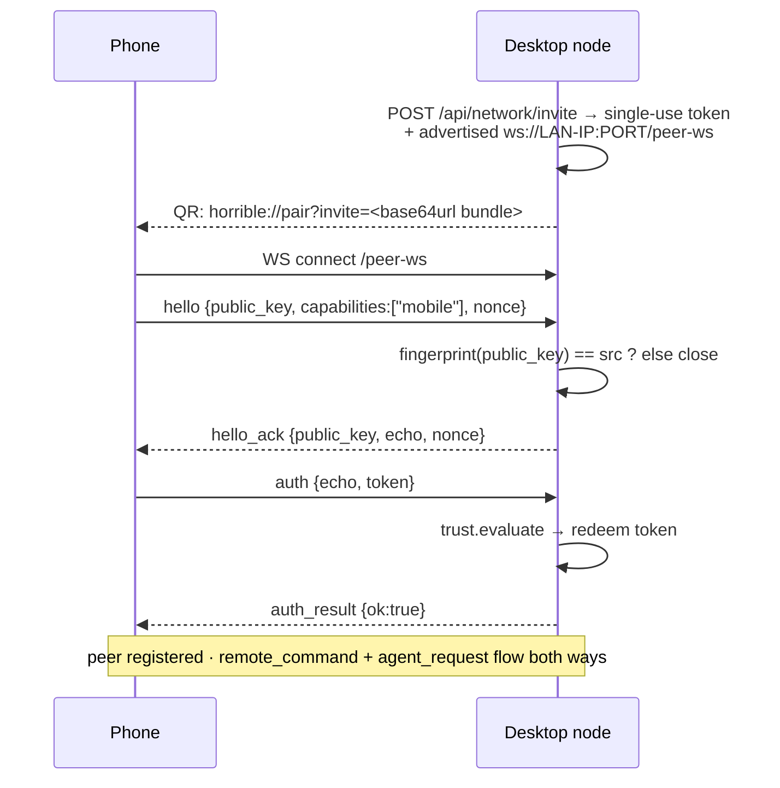

# Module: mobile-android

A native Android **companion app** that pairs with your desktop node by scanning a
QR code, then drives it remotely: open panes, play media, ask your agent a
question and watch it stream back, browse your games friends list. It is not a
second dashboard — it is a **peer on the fabric**, indistinguishable to the
backend from another user's desktop node except for the `mobile` capability it
advertises.

**Status: implemented**, except screen watching — see
[Remote view](#remote-view-screen-watching). App in `apps/mobile-android/`
(Kotlin + Jetpack Compose); its desktop-side counterparts are
`backend/modules/network/remote_control.py`, `agent_bridge.py`,
`remote_view.py` and `mobile_tools.py`.

Because the phone is a peer, everything in [Network](network.mdx) and
[Distributed peer fabric](../architecture/distributed.mdx) applies unchanged —
Ed25519 node identity, the signed `PeerEnvelope` wire, the trust ladder. This page
covers what is specific to the phone.

## Pairing

The QR is rendered by `MobilePairingDialog.tsx` from the home page's integration
row. The phone scans it with CameraX + ML Kit (`ui/PairingScreen.kt`), or receives
it through the `horrible://pair` deep link.

The invite bundle carries the **address the phone will dial**, so
`trust.advertised_address()` must name something a phone can reach.  It defaults
to this machine's LAN IPv4 (`trust.lan_ip()`); `network.advertisedAddress` still
overrides it for a public hostname or a forwarded port. It used to default to
`ws://localhost:…`, which a phone resolves to *itself*.

Pairing is single-use and consumes the token, but the peer record persists
(`network-peers.json`), so later reconnects are admitted on
`is_trusted(node_id)` alone.

## Cross-language protocol conformance

:::danger The phone reimplements the wire; both sides must agree byte-for-byte
Every envelope is signed over a **canonicalization** of its authenticated fields,
and node ids are a fingerprint of the public key. A second implementation that
disagrees on one character is rejected during the handshake with no diagnostic
beyond a **closed socket** — no error frame, no log line on the phone.
:::

Kotlin mirrors of the Python protocol live in `app/src/main/kotlin/.../network/`:

| Kotlin | Python | Contract |
|---|---|---|
| `Identity.fingerprint` | `identity.fingerprint` | `base32(sha256(pubkey))`, unpadded, lowercased, first 16 chars. **Base32, not base64url** — the alphabets overlap enough that a base64url id looks plausible and never matches. |
| `CanonicalJson.dumps` | `json.dumps(sort_keys=True, separators=(",",":"))` | Recursively sorted keys, compact separators, `ensure_ascii`. |
| `Protocol.canonicalBytes` | `protocol.canonical_bytes` | Excludes `sig`/`dst`/`ttl` (a relay may rewrite the latter two); **always** emits `re`, even as `null`. |

Four rules a JVM implementation gets wrong by default — each one silently breaks
signing rather than raising:

1. **`re` is always present.** Moshi (and most JSON writers) omit null fields;
   Pydantic's `model_dump` does not.
2. **Keys sort recursively.** A Kotlin `mapOf` keeps insertion order, so nested
   `data` objects come out shuffled even when the top level is sorted.
3. **Floats use Python's `repr`.** `Double.toString(1.7536e9)` is `"1.753632E9"`;
   Python writes `"1753632000.0"`. Java switches to scientific notation at 1e7,
   Python at 1e16 — and every envelope carries a `ts` in exactly that gap.
   `CanonicalJson.pythonRepr` reimplements CPython's shortest-round-trip repr.
4. **Non-ASCII is escaped.** Python defaults to `ensure_ascii=True`; Moshi emits
   raw UTF-8. A device name with an accent was enough to break pairing.

Canonicalization runs over the **raw wire JSON**, never a re-encode of the parsed
object: Moshi widens every JSON number to `Double`, which would turn the desktop's
`"v":1` into `1.0` and fail verification of every inbound envelope.

`backend/tests/test_network_mobile_conformance.py` pins these vectors so the
Python side cannot drift away from the Kotlin.

### Debugging a failed handshake

`PeerHub.accept_link` logs every step of the acceptor side — HELLO received,
identity verified, HELLO_ACK sent, AUTH received, complete — and logs a distinct
warning for each rejection (wrong first frame, identity mismatch, bad AUTH, trust
evaluation refused), so `logs/backend.log` now says *which* check closed the
socket rather than leaving a bare disconnect. It also catches unexpected
exceptions instead of letting them escape the accept path. The phone mirrors this
with `Log.d("PeerHub", …)` around each handshake step, including the signature
length on the outbound HELLO.

## Screens

| Screen | File | What it does |
|---|---|---|
| Pairing | `ui/PairingScreen.kt` | QR scan (CameraX + ML Kit), plus a manual `IP:port` fallback when the scan resolves to an unreachable address. |
| Remote control | `ui/RemoteControlScreen.kt` | The home screen: a launcher-style grid of tiles. Agent / Friends / Monitor navigate in-app; Browser, Media and Settings issue `open_pane`. An ask bar at the bottom sends straight to the desktop agent. |
| Agent | `ui/AgentScreen.kt` | Chat with the desktop agent over `agent_request`, with `agent_stream` tokens and reasoning rendered live. Opens on a `get_summary` briefing. A **Stop** button sends `agent_cancel`. |
| Friends | `ui/FriendsScreen.kt` | The games friends list, fetched via the `get_friends` command. Per-row actions for voice and screen-watch are **placeholders** except Watch, which opens the Watch screen. |
| Watch | `ui/RemoteViewScreen.kt` | Requests a screen stream with `view_request` and renders inbound `view_frame` JPEGs. **Backend not implemented — see below.** |

### Navigation

`MainActivity` keeps an explicit `mutableStateListOf<Screen>` navigation stack
(`Pairing`, `Control`, `Agent`, `Friends`, `Watch`) rather than a nav library, with
a `BackHandler` popping it and `AnimatedContent` cross-fading between screens.
Connection state is tracked separately from navigation: `PeerHub.onPeerConnected`
/ `onPeerDisconnected` drive a `connectedNodeId`, so a dropped link no longer
strands the UI on a screen whose peer is gone.

`PeerHub.registerDiscoveredPeer` now **auto-reconnects**: if no peer is connected
and mDNS turns up the node id stored in `last_node_id`, it dials it without user
action.

## Commands the phone sends (`remote_command`)

Handled by `remote_control.handle_remote_command`, which drops anything from an
untrusted peer. Commands that reply do so with `re` set to the request's
`msg_id`.

| Command | Params | Effect on the desktop |
|---|---|---|
| `open_pane` | `pane_id` | Broadcasts `layout`/`open_pane` to the browser. |
| `play_media` | `url`, `title` | Opens `browser.view` on the URL and emits `mobile`/`media_status`. |
| `say` | `text` | Emits `system`/`notification` with `title` (`Message from <peer>`), `text` and `peer_id`. |
| `get_friends` | — | Replies with the games friends list. |
| `get_summary` | — | Runs a gated agent turn and replies with a short briefing, streaming tokens as `agent_stream`. |
| `cancel_agent` | `request_id` (optional) | Delegates to `agent_bridge.handle_remote_agent_cancel`; omit `request_id` to cancel every turn this peer started. |

:::caution `pane_id` takes a *view* id, not a module id
`open_pane` is forwarded verbatim to the frame engine, so it wants `browser.view`,
`library.panel`, `settings.home` — not `browser`, `library`, `settings`. A module id
matches no view, so the command succeeds, acks, and opens nothing.
:::

## Cancelling a remote agent turn

The phone's Stop button sends `agent_cancel` (`PeerHub.cancelAgent`), handled by
`agent_bridge.handle_remote_agent_cancel`, which cancels the tracked
`asyncio.Task` in `_active_remote_turns[node_id][request_id]`.

This only works because `handle_remote_agent_request` **detaches** the turn onto a
task and returns immediately. The session pump awaits handlers inline
(`hub._dispatch`), so a handler that awaited the turn would block the receive loop
for its entire duration — the very `agent_cancel` meant to stop it could never be
read — and the resulting `CancelledError` would unwind into the pump and tear down
the peer link. The detached task owns the `agent_result` reply on every path,
including cancellation, because the phone blocks on a reply keyed to the request's
`msg_id`.

## Remote view (screen watching)

:::warning Scaffolding — the desktop never sends a frame
The wire types, the handler registration and the whole phone-side renderer exist,
but `remote_view._stream_pump` has its `send_to` call **commented out** and only
sleeps. Tapping Watch shows "Waiting for stream…" indefinitely. Treat this as an
unfinished slice, not a feature.
:::

| Type | Direction | Status |
|---|---|---|
| `view_request` | phone → desktop | Sent and handled; starts a (silent) pump task. |
| `view_frame` | desktop → phone | Phone decodes base64 JPEG into a Compose `Image`. Desktop never emits it. |
| `view_accept` | desktop → phone | Constant defined on both sides, never sent or handled. |

Two gaps to close before this works:

1. **Nothing captures a frame.** The desktop has no screen source wired in — the
   obvious candidate is the embedded Chromium's existing JPEG frame path from the
   [browser](browser.mdx) module rather than an OS-level screenshot.
2. **There is no stop.** `remote_view.handle_view_stop` exists but is
   **unreachable**: there is no `VIEW_STOP` protocol constant, nothing registers
   it, and the phone never sends one. A stream is only ever torn down by a second
   `view_request` from the same peer, so leaving the Watch screen leaks the task
   for the life of the session.

Trust gating is in place — `handle_view_request` drops anything from an untrusted
peer — but note that a trusted peer needs no further consent to start a stream.
Any real implementation should add an explicit desktop-side prompt.

## Commands the desktop sends (agent tools)

Registered by `mobile_tools.register_mobile_tools()` under the `mobile` group;
both pick the first connected peer advertising the `mobile` capability.

| Tool | Effect |
|---|---|
| `mobile.notify` | Vibrates the phone and shows the text. |
| `mobile.capture_photo` | Asks the phone for a camera frame. **Currently returns mock data** — the capture path is stubbed in `MobileTools.kt`. |

`network/ContactsManager.kt` hashes contact identifiers for a future
`match_contacts` friend-discovery flow; it is **stubbed** (mock addresses, no
`ContentResolver` read, no `READ_CONTACTS` permission requested).

## Building and running

Open `apps/mobile-android/` in Android Studio and run the `app` configuration —
that is the only supported path today. `minSdk` 26, `compileSdk`/`targetSdk` 35,
Kotlin 2.0.21 with the Compose compiler plugin; dependencies are pinned in
`gradle/libs.versions.toml`.

- `local.properties` (the absolute `sdk.dir` path) is **git-ignored** — Android
  Studio regenerates it; from a shell, set `ANDROID_HOME`.
- There is **no committed Gradle wrapper** (`gradlew`), so command-line builds
  need a local Gradle matching AGP 8.7.2. Adding a wrapper is the obvious next
  step for CI.
- Cleartext traffic is allowed (`network_security_config.xml`) because peer links
  on a LAN are plain `ws://`. The envelope signatures — not TLS — are what
  authenticate the wire today.

### Getting the desktop to accept the connection

1. **Bind the backend to the LAN.** `pnpm dev` listens on `127.0.0.1` only; use
   `pnpm dev:lan` (`--host 0.0.0.0`) or the phone cannot reach `/peer-ws` at all.
   `pnpm dev:desktop` already binds `0.0.0.0` — pairing a phone is most of why it
   defaults that way (see [setup](../setup.mdx)).
2. **Same network.** Phone and desktop on the same subnet, with client isolation
   off on the access point.
3. **Allow the port through the firewall.** On Windows the first bind prompts;
   if it was dismissed, inbound TCP on the backend port (8000, or
   `HORRIBLE_DEV_BACKEND_PORT`) stays blocked and the phone sees a silent
   connect timeout.
4. **Re-pair after a node-id change.** The phone's identity lives in
   `filesDir/network-identity.key`; the id derived from it changed when the
   fingerprint was fixed, so a phone paired against the old build must scan a
   fresh QR.

Optional: turn on `network.enableLanDiscovery` and the phone's NSD browser
(`network/LanDiscovery.kt`) will find the desktop over mDNS and rewrite a
loopback invite address to the discovered one.

## Security notes

- The phone holds a normal peer identity. Anything it can do, a trusted peer can
  do — `remote_command` is gated only on `session.info.trusted`.
- `get_summary` runs a **real agent turn** on the desktop, under
  `network.remoteAgentMode` (default `plan`, read-only).
- Agent-to-agent from the phone additionally requires `network.allowRemoteAgent`.
- The pairing QR contains a **live single-use credential**. Treat it like a
  password: don't screenshot it into a shared channel.
