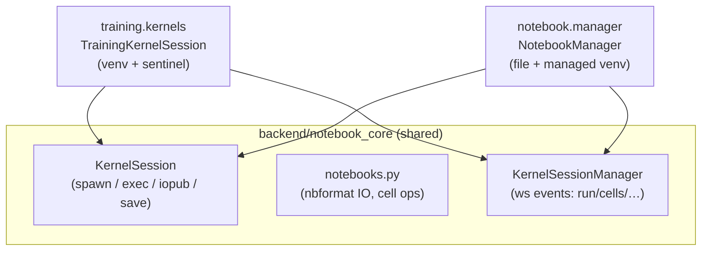

# Module: notebook

A **domain-neutral reactive notebook** — JupyterLab-style `.ipynb` cells **plus** a
marimo-style reactive dataflow mode, with interactive widgets and animations. Where the
[training module](./training.mdx) is notebooks bound to ML projects and venvs, the
notebook module is a general computational surface: open any `.ipynb` under a root
folder, run it on a shared managed kernel, toggle between **reactive** (edit or run a
cell and every downstream cell re-runs automatically) and **classic** (linear Jupyter)
execution.

**Status: Phases 0–3 implemented** — the generic notebook (file catalog, create, open,
cell execution, markdown rendering), the **marimo-style reactive dataflow engine**
(dependency DAG, cascade re-execution, stale-variable deletion, diagnostics),
**interactive ipywidgets** (the Jupyter comm protocol; core widgets render as native
controls), **custom `anywidget` views** (`_esm`/`_css` front-ends executed in the
browser), **reattach-resync** (a pane that reopens a running kernel re-hydrates its live
widgets from a backend comm snapshot), and **agent tools** (cell CRUD/run/mode) over the
shared kernel core. Frontend in `packages/core/src/modules/notebook/`
(+ the shared kit `packages/core/src/notebook/`), backend in `backend/modules/notebook/`
(+ the shared engine `backend/notebook_core/`, whose `reactive.py` holds the dataflow
analysis and `session.py` the comm handling). The one remaining Phase 3 tail — an opt-in
bridge from widget values into reactive re-runs — is deferred.

## Shared kernel core

The notebook and training modules share one kernel engine so there is no duplicated
Jupyter plumbing:

`notebook_core` is parametrized by a `SessionConfig(python_executable, cwd,
notebook_abs_path, rel_path, channel)` rather than any domain model; each module fills it
and overrides the open seams. The kernel spawns via `jupyter_client`'s sync API on daemon
threads (event-loop-agnostic — works under uvicorn `--reload` on Windows), the in-memory
nbformat doc is authoritative and flushed atomically to disk, and sessions are
**process-global** (closing a pane leaves the kernel running; reopening reattaches). The
frontend counterpart lives in `packages/core/src/notebook/` — `CellEditor` (CodeMirror),
`OutputRenderer` (nbformat MIME + ANSI), the generic `SessionStore`
(`useSyncExternalStore`), and the channel-parametrized `kernelClient`.

## Notebooks on disk

Notebooks are plain nbformat v4.5 `.ipynb` files under the `notebook.root` setting
(default `~/horrible/notebooks`); paths are escape-guarded against traversal outside the
root. The execution mode is persisted in `metadata.horrible.execution_mode`
(`reactive` | `classic`).

## Kernel interpreter

Cells run on a **single managed uv venv** under the data dir
(`$HORRIBLE_DATA_DIR/notebook-venv`), bootstrapped on first open with `ipykernel` +
`ipywidgets` (blocking `uv` via `Popen` on a thread — the Windows-safe pattern shared with
LSP/terminal/training). The `notebook.python` setting overrides it with an existing
interpreter (which must have ipykernel + ipywidgets); `notebook.python.version` pins the
managed venv's Python.

## Execution modes

- **Classic** — run cells manually in any order on a shared namespace (standard Jupyter).
- **Reactive** — each code cell is statically analyzed (via stdlib `symtable`, so
  scoping, comprehensions, `global` and closures resolve correctly) for the module-level
  names it **defines** and the free names it **reads**. A dependency DAG (`reactive.py`)
  drives automatic re-execution of a cell's transitive dependents in topological order
  when it is run; deleting or redefining a cell **drops the now-undefined names** from the
  kernel namespace so dependents raise `NameError` instead of reading stale values.
  Single-definition (`multiple_defs`) and cycle violations surface as per-cell
  diagnostics. Toggled per notebook from the pane header (⚡/↳); persisted in `.ipynb`
  `metadata.horrible.execution_mode`.

## Interactive widgets (ipywidgets)

Standard `ipywidgets` code works unchanged — `widgets.IntSlider()`, `Button`, `Checkbox`,
`Text`, `Dropdown`, etc. The kernel speaks the Jupyter **comm** protocol: a widget's
`comm_open` carries its initial model state (with a `application/vnd.jupyter.widget-view+json`
display output whose `model_id` === the comm id), and `comm_msg` carries incremental
state updates. The backend forwards these over the `notebook` channel; the frontend's
per-session `WidgetManager` tracks model state and `WidgetView` renders the common core
widgets as **native controls** (a real `<input type=range>` for a slider, etc.) — no
heavy `@jupyter-widgets` view stack. Changing a control sends a `comm_msg` back to the
kernel, so in-kernel `observe`/`on_click` callbacks fire and linked widgets update.

The **shell-socket threading rule**: the sync `jupyter_client` shell socket is not
thread-safe and the worker thread already reads it, so browser→kernel `comm_msg`s are
queued (`comm_q`) and **sent by the worker thread** — drained both when idle and
mid-execution (inside `_await_reply`), so widgets stay live even while a long cell runs.
Binary comm buffers are base64-encoded across the wire.

## Kernel lifecycle: two rules teardown gets wrong

The same threading rule that governs `comm_msg` governs **closing** a channel, and that
half was missing. `stop_channels()` closes the very sockets the two pump threads
(`_iopub_loop`, `_worker_loop`) are blocked reading — and it ran on whichever thread
served the `restart`/`shutdown` event. Closing a zmq socket under a concurrent recv is
undefined behaviour in libzmq, which is why the symptoms looked unrelated to each other:
an occasional `ZMQError: not a socket`, an occasional teardown that never returned, and
an occasional segfault. Restart was the worst case — it tore the channels down and
immediately built new ones with both pumps still live.

So `_stop_pumps` (`notebook_core/session.py`) is now the only way in: it sets `closing`,
posts the worker's poison pill, and **joins both threads** before any channel is touched.
Every blocking read a pump makes is capped at `POLL_INTERVAL_S`, so this returns in a
fraction of a second; the join deadline is a deadlock bound, not a schedule. That poll
interval is what restart/shutdown latency is made of — hence 0.25s rather than the 1s the
sockets were originally read with. If a pump refuses to leave, teardown proceeds anyway —
an abandoned kernel process is worse than the risk — but it is logged, because that is
the one remaining path that can corrupt a socket.
`restart` and `shutdown` also take a per-session lock: they both rebuild `km`/`kc`, and
nothing else orders them.

The second rule is **where** a blocking kernel call runs. Not `asyncio.to_thread`:
that uses the loop's default executor, which is joined unconditionally by `asyncio.run`'s
teardown *and* by `concurrent.futures`' interpreter-exit hook, neither with a timeout. A
call that never returns therefore stopped being a stuck kernel and became a process that
would not exit, with a traceback pointing at loop teardown. It could not be defended
against from the caller either — `asyncio.wait_for` cancels the *await*, not the thread,
so the orphaned worker sits in the executor and the join finds it regardless. Kernel
calls go through `notebook_core/detach.py` instead (`run_detached` to await one,
`fire_and_forget` for restart/shutdown), which is the same daemon-thread contract on a
thread nobody joins. A private `ThreadPoolExecutor` would *not* be enough — the
interpreter-exit hook joins those too.

`shutdown_all` shuts every session down in parallel with a deadline, since it runs inside
the backend's lifespan shutdown, where blocking blocks the process.

### Custom widgets (anywidget)

Widgets whose model ships its own front-end — an [**anywidget**](https://anywidget.dev)
`_esm` ES-module string (exporting `render({ model, el })`, optionally `initialize`) and
optional `_css` — render via `AnyWidgetView`. It executes the `_esm` in the browser (a
`Blob` + dynamic `import()`) and hands `render` a Backbone-flavoured **model shim** backed
by the same `WidgetManager`: `model.get/set/save_changes` ride the comm (`set` stages
locally, `save_changes` flushes a `comm_msg` update), `model.on('change:…' | 'change' |
'msg:custom', …)` fans kernel updates and custom messages out, and `model.send` posts a
custom message back. `anywidget` is installed into the managed venv. Same trusted-local
posture as HTML output — the `_esm` is the user's own kernel code, run unsandboxed. Classic
third-party widgets that ship AMD view bundles (`@jupyter-widgets/…`) are **not** loaded;
those unknown models show a compact fallback.

### Reattach-resync

Kernels are process-global, and the frame unmounts inactive tabs — so a pane can reopen a
notebook whose kernel already holds live widgets. The backend is the source of truth for
comm state (it sees every `comm_open` and folds each `update` patch into a per-comm
snapshot), so the `opened` payload carries a `comms` snapshot and the frontend seeds its
`WidgetManager` from it — no `comm_info` round-trip to the kernel. Widgets rehydrate to
their current values on reattach (and after a full page reload) as long as the kernel is
alive; widget outputs from a dead prior kernel can't be resynced and show the fallback.

## ws protocol (`notebook` channel)

Client → server: `open` `{path}`, `run_cell` `{sessionKey, cellId}`, `run_all`
`{sessionKey}`, `cells` `{sessionKey, ops}` (insert/edit/delete/move; insert may carry a
client-assigned `cellId`), `set_mode` `{sessionKey, mode}`, `comm_msg`
`{sessionKey, commId, data}` (widget update), `interrupt`, `restart`, `shutdown`.
Server → client: `opened` `{sessionKey, path, notebook, kernel, mode}`, `kernel_status`,
`execution_state` `{cellId, state, execCount?}`, `output` `{cellId, output}` (raw nbformat
dict), `cells_changed` `{notebook}`, `mode` `{mode}`, `graph`
`{edges, defs, diagnostics}` (the reactive DAG), `comm_open`/`comm_msg`/`comm_close`
`{comm, buffers}` (ipywidgets), `error` `{sessionKey?, message}`.

## Backend surface

`/api/notebook/*` (pydantic models in `backend/modules/notebook/models.py`):

| Method + path | Purpose |
| --- | --- |
| `GET /notebook/files` | list `.ipynb` under the root |
| `GET /notebook/doc?path=` | load a document (`NotebookModel`) |
| `POST /notebook` | create a notebook (starter cells + mode) |
| `PUT /notebook/mode` | set the execution mode |
| `GET /notebook/env` | whether the kernel interpreter is ready |

## Contributions to the Layout Shell

- **Panels** — `notebook.browser` (singleton, left: file catalog + create) and
  `notebook.editor` (non-singleton, center: the cell UI, params `{path}`).
- **Opening a notebook** — always through `openNotebook(path)`
  (`modules/notebook/open.ts`), never a bare `openPanel`. It calls
  [`openDocument`](../architecture/windowing.mdx) with the instance id
  `notebook.editor:<path>`, so picking a notebook from the browser **focuses**
  the pane already showing it, or **takes over** an open notebook pane in place
  when that pane has no unsaved edits — rather than splitting the area and
  leaving two "Notebook" documents open. Notebook cells sync to the kernel
  session as you type, so a clean pane holds nothing to lose; the reuse
  predicate is therefore "any clean notebook pane". To get two notebooks
  side by side, split the area first and open the second from the empty area's
  view picker.
- **Commands** — `notebook.open` (open the catalog).
- **Regions** — `notebook.editor` hosts the notebook browser as a left region strip (`k`). The browser is no longer a dock tool of its own: it is the **Notebooks** section of [Explorer](explorer.mdx) (`embedded`), which is exactly the doubling `embedded` exists to remove.
- **Layout preset** — `notebook`.
- **Settings** — `notebook.root`, `notebook.python`, `notebook.python.version`.

## Roadmap

- **Phase 1** *(done)* — reactive dataflow engine (`notebook_core/reactive.py`): static
  analysis, the cell DAG, cascade re-run of downstream cells, stale-variable deletion,
  `multiple_defs`/`cycle` diagnostics.
- **Phase 2** *(done)* — ipywidgets Comm protocol (sliders, buttons, checkboxes, text,
  dropdowns) via a lightweight `WidgetManager` + native `WidgetView`; worker-owned shell
  sends keep widgets live during execution.
- **Phase 3** *(done, minus the reactive bridge)* — custom `anywidget` (`_esm`/`_css`)
  views via `AnyWidgetView`, `comm_info` reattach-resync (backend comm snapshot → frontend
  seed), and agent tools (`notebook.list_cells`/`read_cell`/`insert_cell`/`edit_cell`/
  `delete_cell`/`run_cell`/`run_all`/`set_mode`/`kernel_status`). Classic AMD-bundle
  `@jupyter-widgets` views remain a fallback. **Deferred:** an opt-in bridge from widget
  values into reactive re-runs.

## Documentation in cells

Cells had no hover, no completion, and no docs at all — `CellEditor` wired only
history, a keymap, and a language. They now have the
[documentation popup](docs-popup.mdx): hover, plus <kbd>Shift</kbd>+<kbd>Tab</kbd>
into an inline panel under the cell.

A cell asks `kernel` first and gets an answer about the object that **actually
exists in its namespace**, which is strictly better than anything a language
server could say — and it drops `lsp` from its chain entirely, since a cell has no
language server and leaving it in would spend a step on a resolver that is never
registered.

The kernel side is `KernelSession.inspect`, and the care it needs (worker-thread
affinity, routing shell replies by parent msg_id so an execute reply and an
inspect reply cannot eat each other) is described in
[Documentation popup](docs-popup.mdx#the-kernel-source-and-the-threading-trap).

## Browser vs desktop

| Capability | Browser | Desktop (Tauri) |
| --- | --- | --- |
| Cell UI, run, outputs | ✅ | ✅ |
| Managed venv + kernel subprocess | ✅ (backend-side) | ✅ (backend-side) |
| Reactive dataflow mode | ✅ | ✅ |
| Interactive widgets (core ipywidgets) | ✅ | ✅ |
| Custom `anywidget` (`_esm`/`_css`) views | ✅ | ✅ |
| Widget reattach-resync (live kernel) | ✅ | ✅ |
| Classic AMD `@jupyter-widgets` views | ⏳ (fallback) | ⏳ (fallback) |
