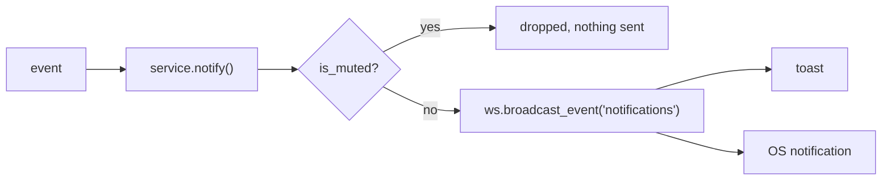

# Module: notifications

:::note This module contributes no panes
It is a service plus one setting. Notifications arrive as toasts (and, on desktop,
as OS notifications); the rules that decide which ones arrive live on the backend
and are edited by talking to the agent.
:::

Proactive messages: a friend you asked to be told about coming online, an invite,
a message that arrived while you were doing something else. Two halves:

- **`backend/modules/notifications/`** — the rules. What gets through
  (`store.py`), the single delivery door (`service.py`), and the agent tools that
  write rules in plain language (`agent_tools.py`).
- **`packages/core/src/modules/notifications/`** — the arrival. A `/ws` channel
  subscriber that raises a toast and, if permitted, an OS notification.

## What was missing before this

Three gaps, each of which made the feature impossible rather than merely absent:

1. **No "came online" signal.** `roster.broadcast_roster()` pushed the whole
   snapshot on every peer event and diffed nothing, so no subscriber could tell
   *arrived* from *still here*.
2. **Nothing could hold a standing instruction.** There was no watch, rule or
   trigger table anywhere — `tasks/queue.py` is fire-once, and the flow canvas's
   cron/webhook triggers are documentation, not code. *"Let me know when Andrew
   logs in"* had nothing to attach to.
3. **No mute of any kind.** The only `mute` in the repository was a microphone.

## Presence is diffed once, in the roster

`social/roster.broadcast_roster()` now compares the new snapshot against the
previous *answer* and emits a `presence` event naming what changed:

```json
{ "person_id": "…", "display_name": "Andrew", "presence": "online", "online": true }
```

The diff lives there rather than in each consumer because the browser, the
notification rules and the agent's watches all want the same answer, and three
independent diffs of one snapshot are three chances to disagree about who just
arrived.

**A person seen for the first time is not "coming online."** `_last_presence`
starts empty and is correctly empty after a restart, so the first roster would
otherwise announce every friend who happens to be connected — noise, not news.
Presence itself is still *derived* from the hub's connection table and never
stored; `_last_presence` is only the previous answer, held in memory.

## The mute check runs at the producer

`service.notify()` is the single door every proactive message goes through, and
`store.is_muted()` is checked **inside it**, before anything is sent:



That placement is the design. Filter in the browser instead and a muted
notification has already crossed the socket and buzzed a phone before the filter
ran.

`person_id` on a notification is therefore **not decoration** — it is what a
per-person mute matches on. Omit it and "mute Andrew" cannot apply to a
notification that is about Andrew.

### Rule shapes

`notification_mutes` rows are scoped three ways, and the third is the one the
feature exists for:

| Rule                          | Silences                        |
| ----------------------------- | ------------------------------- |
| `category`                    | everything in that category     |
| `category` + `person_id`      | that category, from that person |
| `category` + `except_person`  | that category from **everyone but** that person |

`except_person` is what makes *"mute any messages except for him"* one rule
instead of a mute per friend plus a promise to undo them all later. `expires_at`
is what makes *"for a bit"* expressible; expired rules are swept on read, because
there is no other clock in the module and an expired rule is indistinguishable
from one that was never there.

`CATEGORIES` is closed on purpose (`message`, `presence`, `invite`,
`friend_request`, `watch`, `review`, `all`). An open vocabulary means a typo in an
agent-authored rule silently mutes nothing, forever, with no error.

`review` is raised by [records](records.mdx) when an agent files a field proposal.
It is a notification rather than a pane-local badge for the same reason `watch` is:
propose is the write path that is safe to run unattended, so the user being
somewhere else is its normal case — and an extraction run filing forty of them has
to be silenceable like anything else.

## Watches

`agent_watches` is a standing instruction evaluated against events rather than a
clock: `kind` names the event, `subject` names who it is about, `predicate` says
what to wait for (`{"online": true}` for an arrival, `false` for a departure), and
`one_shot` decides whether it survives firing.

A one-shot is retired **whether or not it was delivered** — a watch the user muted
is one they chose not to hear, not one still owed to them.

Presence is deliberately *not* notified about by default. A toast every time any
friend's laptop connects is the notification everyone turns off first; making it
opt-in per person is the whole point of a watch.

## Agent tools

The sentence this exists for:

> let me know when Andrew logs in, and mute any messages except for him for a bit

resolves to `watch.create` + `notify.mute` in **one turn**.

| Tool                            | Does                                                    |
| ------------------------------- | ------------------------------------------------------- |
| `watch.create`                  | tell me when someone comes online (or goes offline)     |
| `watch.list` / `watch.cancel`   | inspect and revoke                                      |
| `notify.mute` / `notify.unmute` | by category, by person, or everyone-except-one          |
| `notify.status`                 | what is currently silenced, and for how much longer      |

Names resolve through `social/agent_tools._resolve`, which already accepts a
username, friend code or display name and **refuses an ambiguous name rather than
guessing** — exactly the behaviour "when Andrew logs in" needs.

:::warning Two conventions here fail silently
**A tool's group is its name prefix, not its `group=` field.** The orchestrator
computes it with `name.split(".", 1)[0]`, so `watch.create` lands in group `watch`
whatever `group=` says; the field only decides core-vs-deferred. Name and group
must agree.

**None of these may be core.** The always-on core is 11 tools against a budget of
38, because local models stop reasoning past roughly 40 definitions. Six
always-loaded tools for an occasional feature would cost every turn in the app.
:::

Both groups register a blurb in `_GROUP_DESCRIPTIONS` and keywords in
`_GROUP_KEYWORDS` so the ask stays one-shot. The keywords are phrases, not bare
words, wherever the bare word is common — `"let me know when"` rather than
`"know"`. `"presence"` is left to the `social` group: a word in two groups
preloads both and spends the budget twice.

## Arrival, frontend side

`initNotifications()` subscribes to the `notifications` channel and to `system` —
the latter has been broadcast to since remote control landed
(`network/remote_control.py`) with **nothing listening**, so every "say" relayed
from a paired phone was dropped on arrival.

It is called at boot in `apps/web/src/main.tsx`, next to `initSocial()`, which was
itself only ever called from the Friends tab's mount. A notification you receive
only once the right pane is open is not a notification.

## The inbox: a toast is a cache, the row is the truth

A toast shows for four seconds and then it is gone, and until there was a table
behind it, so was the notification: the feed behind the bell was a JavaScript array,
so a page reload emptied it, and anything that arrived while the app was closed was
never seen by anyone.

`notify()` now writes a **`notifications` row in `app.db` before it broadcasts**,
and the frontend hydrates from `GET /api/notifications/feed` at boot. Every surface
is a *view* of one durable row rather than the only copy of it.

Written **after** the mute check, deliberately: a suppressed notification leaves no
row, because a mute that still filled the bell would be a mute in name only.

Read and cleared state are server-side (`POST /notifications/read`,
`POST /notifications/clear`) rather than per-browser, so dismissing something on the
desktop does not leave another surface still showing it as new.

### `dedupe`, and why every answerable notification needs one

One event can land as a toast, a feed row, an in-game overlay card and an OS
notification. `dedupe` is the single key tying those together, and it does two jobs:

- a repeat **replaces** the live row (partial unique index on
  `dedupe WHERE cleared_at IS NULL`) instead of stacking a second identical card —
  so re-inviting somebody who has not answered refreshes their invite;
- `service.retract(dedupe)` clears the row **and broadcasts a `retract` event**, so
  answering on one surface retires it from the rest.

Without it you get the classic four-copies-of-one-invite problem. The key is built
in exactly one place on each side — for match invites that is
`hassault/invite-notify.ts` and `fabric._notify_invite`, both spelling
`hassault-invite:<node>:<room>`. Two spellings would be a bug that looks like
nothing: everything still works, notifications just never clear.

### Actionable toasts

`Toast` permits **exactly one** action, and that constraint is kept: the click *is*
the answer, and anything with a second choice belongs in the inbox. A notification
names its action by string (`data.action`), and the module that produces it
registers the handler with `registerNotificationAction`.

A registry rather than a `switch` here, because the handler belongs to the producing
module — joining a match is HorribleAssault's business, and `notifications`
importing it would invert the dependency and drag a three.js pane into the boot path
of the notification feed. See
[hassault's invite delivery](hassault.mdx#delivery-a-toast-is-a-cache-the-inbox-is-the-truth).

:::note The bell is desktop-only today
The feed's UI lives in `packages/ui/src/desktop/taskbar/ClockPanel.tsx`. The browser
layout has no surface for it, so on that layout a missed toast is still missed even
though the row is now durable. The data is there; the view is not.
:::

### OS notifications

`notifyDesktop` has always checked `Notification.permission === 'granted'`, and
`Notification.requestPermission()` appeared **nowhere in the repository** — so on
a fresh profile that branch was a permanent no-op. `desktop.ts` asks for the
permission **lazily, on the first notification the user opted into**, never at
boot: a permission prompt on page load is the one every browser vendor tells you
not to show, and a `denied` answer is sticky, so a badly-timed ask permanently
costs the feature.

Gated by the `notifications.system` capability (desktop only) and the
`notifications.desktop` setting.

## Settings

| Key                      | Default | Meaning                                                |
| ------------------------ | ------- | ------------------------------------------------------ |
| `notifications.desktop`  | `true`  | Also raise an OS notification, asking permission once. |

The *rules* are deliberately not settings. A mute has a scope and a duration that
no boolean on a settings page could hold, and it is enforced at the producer —
which is server-side, where a setting read in the browser could not reach.

## Tests

`backend/tests/test_hassault_invites.py` pins the delivery ladder end to end from a
real producer: that an invite reaches the `notifications` channel and not only the
game pane's own, that it survives in `app.db`, that a repeat refreshes rather than
stacks, and that a retraction clears it. Note its fixture patches
`broadcast_event` in **two** places — `fabric` imports it inside the function, while
`notifications.service` imports it at module scope, which binds the name at import
time and makes it immune to patching the source module.

`backend/tests/test_notifications.py` pins the three things that fail silently:
the producer-side mute check, the `except_person` inversion, and that every tool
is grouped with a group matching its prefix. It also pins the presence diff
itself, including that a first sighting announces nothing.
