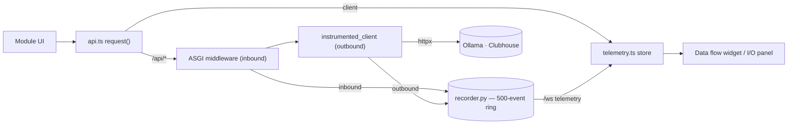

# Module: observability

Observe the app's data flow — frontend↔backend↔external — the way Docker
Desktop shows a container's network I/O. The compact "Data flow" widget is part
of the seeded Dashboard workspace; the full I/O panel is opened on demand.

**Status: implemented** — frontend in
`packages/core/src/modules/observability/`, instrumentation in
`backend/modules/telemetry/` plus `packages/core/src/{telemetry,ws}.ts`.

## The instrumentation, not the widget, is the point

A useful observability view can't be per-module logging — it instruments the
**chokepoints once** so every module's traffic shows up for free (like the
Docker daemon already seeing all container I/O). Three sources feed one stream:

- **`client`** — every frontend→backend round-trip, recorded in the API client's
  `request<T>` ([packages/core/src/api.ts](../../packages/core/src/api.ts)).
- **`inbound`** — every request the backend receives, via an ASGI middleware
  (`backend/modules/telemetry/instrument.py`).
- **`outbound`** — the backend's calls to external services (Clubhouse, Ollama),
  via `instrumented_client()` wrapping httpx; agent and clubhouse use it. This is
  the part the frontend can't see on its own.

So a single user action reads end to end: `client GET /agent/status` →
`inbound /api/agent/status` → `outbound GET …/api/tags` (Ollama).

## Detail is captured redacted — never raw

Every event carries metadata (method, target, status, duration, byte counts)
plus **redacted detail** for the expandable row view: headers with
credential-bearing values masked (`authorization`, `cookie`, anything matching
token/secret/api-key/session), bodies truncated to a configurable size
(`observability.maxBodyChars`, default 2 KB; hard-capped at 64 KB regardless),
and bodies on
sensitive routes suppressed entirely (Clubhouse paths/hosts — phone numbers,
SMS codes, tokens; the Clubhouse token never reaches the browser). Outbound
URLs are recorded scheme+host+path only (query/fragment stripped). Response
bodies are captured on `client` events and on all `outbound` calls — so the
request↔response pair to the LLM reads end to end — redacted and truncated like
request bodies:

- **Non-streaming** outbound responses (e.g. the agent's `stream:false`
  `/api/chat` tool-calling round) are read in the response hook; httpx caches the
  read, so the caller's `.json()` still works.
- **Streaming** outbound responses (Ollama chat/pull NDJSON, OpenAI SSE — detected
  by `content-type`) can't be read in the hook without consuming the stream. The
  hook records the event with no body yet, then `tee_stream` — wrapping the two
  streaming call sites (`providers.generate_stream`, `routes._proxy_ndjson`) —
  passes each line through to the caller while accumulating a capped copy, and
  `recorder.amend` fills the body into the same event once the stream finishes
  (capped at 64 KB of capture so a long generation can't grow unbounded).

Inbound response bodies aren't captured (the `client` event for the same
round-trip shows the payload). The redaction lives at the capture chokepoints
(`instrument.py`, `api.ts`) — never record a raw header or body.

## Transport

The backend keeps a 500-event ring buffer (`recorder.py`) and streams events to
the frontend over the **shared `/ws` socket** on the `telemetry` channel — the
first real use of that socket. On connect it replays the recent backlog, then
pushes live. `GET /api/telemetry/recent` exposes the same backlog for polling.
The frontend store (`telemetry.ts`) merges `client` events with the streamed
`inbound`/`outbound` events into one capped list, **upserted by `(source, id)`**
so an amended event (a filled-in streaming body, re-emitted under the same id)
replaces its row in place rather than duplicating it.

## Contributions to the layout shell

- **Panels:** `observability.logs` (singleton, `defaultPlacement: bottom`) — the
  full I/O table (time, source badge, method, target, status, ms, size) with a
  Clear button. Rows with captured detail show a caret and expand on click to
  the redacted headers/bodies.
- **Widgets:** `observability.io` ("Data flow") — compact summary (call/error
  counts + last few, expandable the same way), opened as a pane. Part of the
  seeded Dashboard workspace; also addable to any workspace from the palette
  ("Open widget: Data flow") or the tab-strip picker.
- **Commands:** `observability.open` (opens the panel).
- **Settings:** `observability.recentCount` (number, default 5) — how many recent
  calls the Data flow widget lists; read live via `useSetting`.
  `observability.maxBodyChars` (number, default 2048) — how many characters of
  each captured request/response body to keep for the expandable detail view.
  Unlike `recentCount`, this one is consumed on the **backend** (the truncation
  happens at capture, in `instrument.py`, which reads the persisted value via the
  settings module's `get_value`); it's still hard-capped at 64 KB. See
  [settings.md](settings.mdx).

## Backend surface

`backend/modules/telemetry/` — `GET /api/telemetry/recent` (backlog) and the
`/ws` telemetry stream. The telemetry endpoints are excluded from recording to
avoid feedback noise.

## Browser vs desktop

Identical. The store also captures real client-side round-trip latency, which
reflects wherever the backend lives (local or remote).

## Not yet

Filtering/search, client-side streaming calls (the agent chat/pull streams
bypass `request<T>`, so they show as outbound on the backend but not as client
events), inbound response bodies (see above), and persistence across reloads
(the buffer is in-memory).
