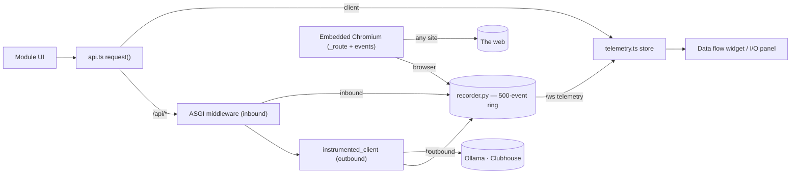

# Module: observability

Observe the app's data flow — frontend↔backend↔external — the way Docker
Desktop shows a container's network I/O. The compact "Data flow" widget is part
of the seeded Dashboard workspace; the full I/O panel is opened on demand.

**Status: implemented** — frontend in
`packages/core/src/modules/observability/`, instrumentation in
`backend/modules/telemetry/` plus `packages/core/src/{telemetry,ws}.ts`.

## The instrumentation, not the widget, is the point

A useful observability view can't be per-module logging — it instruments the
**chokepoints once** so every module's traffic shows up for free (like the
Docker daemon already seeing all container I/O). Five sources feed one stream:

- **`client`** — every frontend→backend round-trip, recorded in the API client's
  `request<T>` ([packages/core/src/api.ts](../../packages/core/src/api.ts)).
- **`inbound`** — every request the backend receives, via an ASGI middleware
  (`backend/modules/telemetry/instrument.py`).
- **`outbound`** — the backend's calls to external services (Clubhouse, Ollama),
  via `instrumented_client()` wrapping httpx; agent and clubhouse use it. This is
  the part the frontend can't see on its own.
- **`ws`** — individual frames of the multiplexed `/ws` socket (agent, collab,
  network, lobby, terminal…), captured at the two chokepoints: outbound at
  `WsConnection.send_json` (via a telemetry-free observer hook the app registers),
  inbound in the `/ws` receive loop. The `telemetry` channel itself is skipped so
  the push stream doesn't observe its own output. The frame's JSON payload is the
  body; the direction (`send`/`recv`) is the method.
- **`browser`** — every request the embedded Chromium makes, at the `_route` egress
  hook plus Chromium's own request/response events
  ([browser](./browser.mdx#network-observability)). Distinct from `outbound`: those are
  calls *the app* chose to make, these are made by **pages the user visits**, which is
  both the largest volume and the least trusted. Carries two extra fields —
  `resource_type` (document/script/image/xhr/…) and `verdict` (`allowed`/`blocked`), so
  a request the SSRF guard aborted stays visible instead of vanishing. Full mode only;
  an iframe's requests are made by the user's own browser and never reach the backend.

So a single user action reads end to end: `client GET /agent/status` →
`inbound /api/agent/status` → `outbound GET …/api/tags` (Ollama).

## Detail is captured raw — this is a local Wireshark

The panel is the app's built-in protocol analyzer, so it deliberately hides
nothing at the application layer: every event carries metadata (method, target,
status, duration, byte counts) plus the **full headers and bodies, unredacted**,
for the inspector. Almost nothing is masked or suppressed — credential headers
(`authorization`, `cookie`, tokens) and sensitive bodies (Clubhouse phone
numbers, SMS codes) are shown verbatim. The only general limit is **size**: bodies
are truncated to a configurable cap (`observability.maxBodyChars`, default 16 KB)
and never read past a 1 MB hard ceiling. Outbound URLs are recorded
scheme+host+path only (query/fragment stripped). Treat the in-memory buffer as
sensitive — it is a local introspection tool, and the data never leaves the
machine.

### The one exception: password bodies

Paths matching `_REDACT_BODY_PREFIXES` (`instrument.py`) — currently the
HorribleAssault/games **native email+password** sign-in, `/api/games/auth/local/*`
on the node and `/auth/local/*` on the game server — are recorded **without
either body**. They carry a plaintext password up and a freshly-minted session
token back, and the node proxies the browser's sign-in to the game server, so the
same credential crosses the inbound middleware, the outbound httpx hook, and the
frontend client recorder. Capturing it would make this panel the leak; "it's only
local" is not an argument, because a local buffer is exactly what an inspector
reads.

This is a **redaction** list, not a skip list: the event still appears with its
method, path, status and timing, which is what you actually need to debug a
sign-in. It is keyed on **path prefix** in all three seams rather than on a flag
at the call site, so a new auth route inherits the protection by where it lives
instead of by someone remembering to annotate it. See
[the games module](games.mdx) for the flow itself.

Response bodies are captured on `client` events and on all `outbound` calls — so
the request↔response pair to the LLM reads end to end — truncated like request
bodies:

- **Non-streaming** outbound responses (e.g. the agent's `stream:false`
  `/api/chat` tool-calling round) are read in the response hook; httpx caches the
  read, so the caller's `.json()` still works.
- **Streaming** outbound responses (Ollama chat/pull NDJSON, OpenAI SSE — detected
  by `content-type`) can't be read in the hook without consuming the stream. The
  hook records the event with no body yet, then `tee_stream` — wrapping the two
  streaming call sites (`providers.generate_stream`, `routes._proxy_ndjson`) —
  passes each line through to the caller while accumulating a capped copy, and
  `recorder.amend` fills the body into the same event once the stream finishes
  (capped at the 1 MB ceiling so a long generation can't grow unbounded).

Inbound response bodies aren't captured (the `client` event for the same
round-trip shows the payload). Capture and truncation live at the chokepoints
(`instrument.py`, `api.ts`).

## Transport

The backend keeps a 500-event ring buffer (`recorder.py`) and streams events to
the frontend over the **shared `/ws` socket** on the `telemetry` channel — the
first real use of that socket. On connect it replays the recent backlog, then
pushes live. `GET /api/telemetry/recent` exposes the same backlog for polling.
The frontend store (`telemetry.ts`) merges `client` events with the streamed
`inbound`/`outbound` events into one capped list, **upserted by `(source, id)`**
so an amended event (a filled-in streaming body, re-emitted under the same id)
replaces its row in place rather than duplicating it.

## Contributions to the layout shell

- **Regions:** `observability.io` hosts `observability.logs` as its bottom
  [region strip](../architecture/panel-groups.mdx) — the **`⊡ Inspector`**
  toggle in the pane's region controls opens the full Wireshark-style view
  without leaving the tool.
- **Widgets/tools:** `observability.io` ("Data flow", role `tool`, bottom dock)
  — compact summary (call/error counts + last few, expandable the same way).
  Part of the seeded Dashboard workspace's bottom dock (hidden by default);
  openable anywhere from the palette or the activity rail.
- **Panels:** `observability.logs` (singleton, role `widget`, **`embedded`** — the
  expanded inspector behind `observability.io`'s bottom strip, reached by revealing
  that region rather than by opening a pane of its own; see
  [Embedded views and sections](../architecture/windowing.mdx#embedded-views-and-sections)) — a
  Wireshark-style **master-detail**: a packet-list table (time, source badge,
  method, target, status, ms, size) over an **inspector** for the selected row.
  The inspector shows General metadata, then request/response headers and bodies
  (for a `ws` frame, a single "Frame payload"); bodies are JSON pretty-printed and
  syntax-highlighted with a **Raw⇄Pretty** toggle and **Copy**. A toolbar
  **filter** narrows rows live (client-side): a free-text query over
  method+target+**body**, a source selector (all / client / inbound / outbound /
  ws), and an **errors only** toggle; the count reads `shown / total` while a
  filter is active. A Clear button empties the buffer. Accessible only via the
  toggle strip on the Data flow widget (use the `⊡ Inspector` toggle) — not
  openable as a standalone command.
- **Commands:** `observability.open` (opens the Data flow widget — the primary).
- **Settings:** `observability.recentCount` (number, default 5) — how many recent
  calls the Data flow widget lists; read live via `useSetting`.
  `observability.maxBodyChars` (number, default 16384) — how many characters of
  each captured request/response body (and `ws` frame) to keep for the inspector.
  Unlike `recentCount`, this one is consumed on the **backend** (the truncation
  happens at capture, in `instrument.py`, which reads the persisted value via the
  settings module's `get_value`); it's still hard-capped at 1 MB. See
  [settings.md](settings.mdx).

## Backend surface

`backend/modules/telemetry/` — `GET /api/telemetry/recent` (backlog) and the
`/ws` telemetry stream. The telemetry endpoints are excluded from recording to
avoid feedback noise.

## Browser vs desktop

Identical. The store also captures real client-side round-trip latency, which
reflects wherever the backend lives (local or remote).

## Agent context

Both the widget and the panel expose a `getAgentContext()` snapshot (total calls,
error count, and the most recent calls with source/method/target/status/duration),
so the agent can reason about live traffic — e.g. "did that request fail?". See
[agent tools](../architecture/agent-tools.mdx#reading-widget-state-getagentcontext).

## Not yet

Client-side streaming calls (the agent chat/pull streams bypass `request<T>`, so
they show as outbound on the backend but not as client events), inbound response
bodies (see above), and persistence across reloads (the buffer is in-memory). The
panel filter is panel-local state, so it resets when the pane is unmounted.
