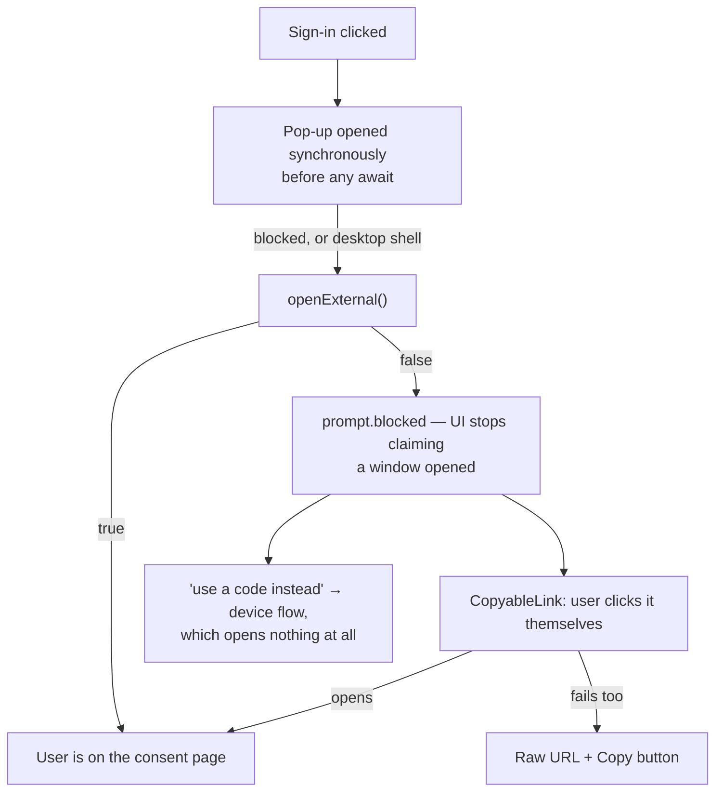

# Onboarding: one front door

The intro page's **"Get set up"** flow — three labelled steps that cover everything
a fresh node needs before it can do anything: a local model, an account, and the
connectors your agent reaches through.

**Status: implemented.** `packages/ui/src/home/SetupCard.tsx`, rendered from
`HomeView`. The sign-in half is `packages/core/src/SignInCard.tsx`; shared state is
`packages/core/src/account-store.ts` and `packages/core/src/connectors/store.ts`.

## Why it exists

The three things a new user has to do lived in three unrelated places, and only one
of them was on the home page.

- **The model** was a card on home (`OnboardingCard`), shown only while the agent
  was unconfigured.
- **The account** existed *only* inside the games lobby and HorribleAssault's front
  door. The way to discover this app has an account at all was to open a game.
- **The connectors** were a row of tiles above the ask bar with no label explaining
  what they were for.

So the flow is one card with three numbered steps. A step already satisfied
collapses to a check and a one-line summary rather than vanishing, so the card
doesn't reflow underneath you and you can see what you already have. It hides
itself entirely once all three are done, and `home.setupDismissed` hides it early;
the **Show setup** command (`shell.setup`) brings it back.

`shell.setup` clears `home.setupDismissed` and forces the desktop to the `splash`
backdrop, so it is only ever wired to a control that *means* "show me setup" — the
Start menu and app-menu entries. It is deliberately **not** how any other surface
reaches a connector; see [Connectors](connectors.mdx).

## Identity and connectors are two steps, on purpose

They look like the same thing — both say "GitHub", both open a consent page — and
they are not. Collapsing them into one button would quietly change what a click
grants.

| | Sign-in (step 2) | Connector (step 3) |
| --- | --- | --- |
| What it proves | who you are | what your agent may reach |
| Who holds the client secret | the **game server** (a separate process) | your node |
| Provider token after the flow | **discarded** | kept, Fernet-encrypted in `secrets.db` |
| What is stored | a JWT for our own server, in `.data/games_token.json` | `connector:<id>` credential record |
| Scopes | `read:user` / `email profile` | `read:user`+`repo`, `drive.readonly`, … |
| Wire shape | `{signed_in, account, handle}` | `{connected, scopes, account}` |
| Routes | `/api/games/auth/*` | `/api/connectors/*` |

One button doing both would ask for `repo` scope in order to answer "who are you".
The two halves can also fail independently, which is far harder to explain after
the fact than it is to show as two steps up front. See
[Connectors › Why this is not the games sign-in](connectors.mdx).

## One sign-in, not three

`SignInCard` is the app's only sign-in UI. It renders in four places: the setup
card's step 2, the games lobby sidebar, the games first-run hero, and
HorribleAssault's [boot overlay](hassault.mdx).

There used to be three separate copies, and the reason to care is what happened to
them: they drifted. HorribleAssault's had a fallback for a blocked pop-up; the games
first-run hero still called the *device-only* entry point, so it never opened a
consent page at all and its prompt rendered `Enter code  at ` with both values
blank. Nothing about that was visible from either file.

It lives in `packages/core`, not `packages/ui`, because `hassault` and `games` are
core modules and a core module must not import `packages/ui` — the same reason
`Avatar3D` is there.

## The failure ladder

Every "open this page for the user" in the app is a ladder, and each rung can fail
silently. That is the whole difficulty: `window.open` returns `null` when a blocker
eats it and the Tauri `invoke` *rejects* — neither throws anything a caller notices
by default.



Three rules hold it together:

1. **`openExternal` returns whether it opened**, and callers that need the user to
   *arrive* somewhere must check it. A blocked pop-up otherwise leaves a button
   reading "Waiting…" for fifteen minutes while the flow polls, correctly, for a
   page nobody was ever shown.
2. **The blocked prompt outlives the attempt.** It is cleared on success only. It
   used to be cleared in a `finally`, so the address vanished the moment the flow
   timed out — taking away the one thing the user had just been told to go and use.
3. **The bottom rung is not a link.** `CopyableLink` (`packages/core`) shows the
   raw address with a Copy button once opening has failed, because clicking is
   precisely what just failed.

`installExternalLinkBridge` must report failure for the same reason: it cancels the
browser's own navigation before substituting its own, so a failed substitute means
the click is simply gone. It now announces through `onExternalOpenFailed`, which
`AppShell` turns into a persistent toast carrying the URL.

### The bug that motivated all of it

Tauri v2 gates app commands behind the ACL: a command needs an `allow-*` permission
**defined** in `apps/desktop/src-tauri/permissions/*.toml` **and listed** in
`capabilities/default.json`. `open_external` was added, registered in
`generate_handler!`, and shipped with neither.

So `invoke('open_external')` was rejected, `openExternal` caught it and returned
`false`, and the link bridge discarded that `false` — which meant OAuth sign-in and
*every external link in the desktop app* (docs links, the Ollama install link,
connector consent pages) did nothing at all, with no error anywhere. Three layers of
correct-looking code and one missing line of TOML.

`acl_coverage::every_command_is_permitted_and_capable` in
`apps/desktop/src-tauri/src/main.rs` now parses `generate_handler!` and asserts both
halves exist for every command. Adding a permission TOML means adding it to
`PERMISSION_FILES` there, since `include_str!` needs literal paths.

## Shared state

Two module-level stores, both `useSyncExternalStore`-shaped, both with a `reset()`
test seam.

**`useAccount()`** — one fetch of `/api/games/status`, many subscribers. Each
surface used to keep its own copy, so signing in on one left the others on a
signed-out screen until they happened to remount. A failed refresh reports
`phase: 'unavailable'` and **keeps the account it already had**: a backend blip must
not present as a sign-out.

**`useConnectors()` / `useConnector(id)`** — the same for the connector list, which
previously had exactly one caller in the repo (the home tile row, holding it in
`useState`). A pane asking "is Google connected?" had no way to ask.

`useConnector` reports `connected` and `known` separately. A gate that hid its pane
on `!connected` alone would flash "connect this" at an already-connected user on
every single mount.

## `ConnectionGate`

What a pane renders instead of dead-ending on the backend's 409:

```tsx
<ConnectionGate connector="github">
  <RepoPicker onPick={...} />
</ConnectionGate>
```

It never builds a connect UI of its own — it calls `requestConnect(id)`, an event
`ConnectorDialog` answers at the shell level by opening the real popover as a modal
over whatever you were looking at. One connect flow, reachable from anywhere, and
reaching it is never a navigation: nothing about connecting a connector sends you
to the splash surface or re-opens this card. The reference case is the GitHub repo viewer
(`packages/core/src/modules/github/RepoViewer.tsx`).

## Which game server sign-in talks to

`pnpm dev` used to force `GAMES_SERVER_URL=ws://localhost:9090`, and the bundled
game server it starts has no OAuth client id or secret. Since the env var beats the
`games.serverUrl` setting, the effect was that GitHub and Google sign-in were dead
in the browser layout while `pnpm dev:desktop` — which never set the variable —
worked. Two launchers, two answers to "can I sign in", for a reason nothing on
screen could explain.

Both launchers now default to the hosted server, like a packaged node.
`--local-gameserver` (or `HORRIBLE_DEV_LOCAL_GAMESERVER=1`) points at the bundled
one, which still starts either way. `pnpm dev` prints which it chose.

A provider the server reports as supporting *neither* flow still renders disabled —
but the card names the server, because the reason lives there and a bare greyed-out
button is indistinguishable from a broken one.

## Testing

| File | Covers |
| --- | --- |
| `packages/core/src/__tests__/external.test.ts` | `openExternal`'s boolean under a blocker and under a rejecting Tauri invoke; the bridge announcing failure |
| `packages/core/src/__tests__/account.test.ts` | the blocked prompt surviving a failed attempt; cleared on success; `prefer: 'device'`; the redirect→device fallback |
| `packages/core/src/__tests__/stores.test.ts` | both stores: shared publication, request de-duplication, a blip not reading as a sign-out, the connect-request bus |
| `apps/desktop/src-tauri/src/main.rs` | every registered command has an ACL permission and a capability entry |
