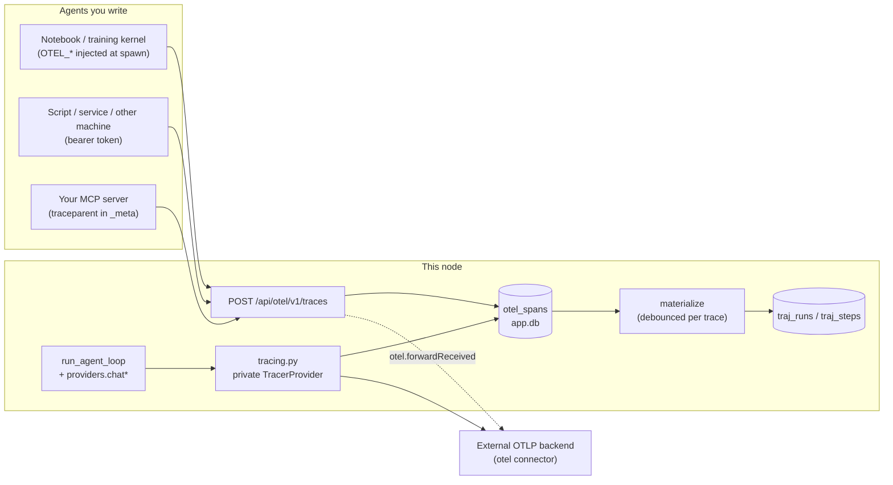

# Module: otel

**OpenTelemetry for agents, in both directions.** The node is an **OTLP/HTTP
collector** for agents you write (Pydantic AI, LangGraph, the OpenAI Agents SDK, Google
ADK, raw `opentelemetry-sdk`), and its **built-in agents emit GenAI-semconv spans**.
Those spans are always stored locally and can optionally be exported to Phoenix,
Langfuse, Jaeger, Tempo, Honeycomb or any other OTLP/HTTP backend.

There is no pane of its own. Received traces become runs in
[Trajectories](trajectories.mdx). Every run with a trace gets a **Trace** view (the span
tree), and the Trajectories **Connect** section is where you wire an agent up.

## The rules that shape it

- **`turn_id` stays the one identity.** A built-in turn's trace id is *derived*,
  `sha256(root_turn_id)[:16]` (`ids.py`), where the root is the part of `turn_id`
  before the first `:`. That puts delegate sub-turns (`parent:spec:hex`) in their
  parent's trace. There is no new id column, and anything holding a `turn_id` can
  compute its trace. `GET /api/otel/turn/{turn_id}` does exactly that.
- **Raw spans are the truth; a run is a projection.** Exporters flush in batches,
  child spans first and the root last, so a trace cannot be written as a run
  batch-by-batch. Spans land idempotently in `otel_spans` (PK `(trace_id, span_id)`,
  so a retried batch doubles nothing). A per-trace debounce (~1 s) then rebuilds the
  run through `trajectories.store.ingest_run(external_id=trace_id)`, which replaces
  the run's steps wholesale. The run stays `running` until a parentless span arrives.
  After 120 s of silence it is finalized anyway and marked `meta.otel.partial`.
- **Local turns are never projected.** The orchestrator already records its own
  runs. Its spans (and anything sent back under one of its trace ids) show in that
  run's Trace view instead of filing a second run.
- **Content is opt-in.** A span carries model, tokens, cost, duration, tool name and
  outcome. Prompts, completions and tool arguments/results are added only with
  `otel.captureContent`, passed through `trajectories.outbound.redact` first. This
  matches the GenAI conventions' own default, and matters because spans may leave the
  machine.
- **Tokens: absent means unmeasured.** A round the provider reported no usage for
  has no `gen_ai.usage.*` attribute at all. It never carries a zero (see
  [Trajectories → Tokens and cost](trajectories.mdx)).

## Receiving: `POST /api/otel/v1/traces`

The path is chosen so an unmodified exporter works with
`OTEL_EXPORTER_OTLP_ENDPOINT=http://127.0.0.1:<port>/api/otel`, because the SDKs
append `/v1/traces` themselves. The endpoint takes:

- `application/x-protobuf` (the Python default) and `application/json`;
- `Content-Encoding: gzip`, with a 64 MB inflation ceiling and a 32 MB raw ceiling.

### gRPC

The OTel spec's **default** protocol is gRPC, so an exporter whose owner never set
`OTEL_EXPORTER_OTLP_PROTOCOL` talks to :4317. The node can serve that too, but it is
**off unless `otel.grpcPort` is set** — it binds a *second* listening port, and a
module that opens one on every node is not something to find out about from
`netstat`. `otel.grpcHost` defaults to loopback for the same reason: the node's own
HTTP port may be loopback-only, and an unrelated setting must not widen that.

Auth is the HTTP rule unchanged — loopback needs nothing, anything else needs the
ingest token, here as the `authorization` **metadata** entry, which is where a gRPC
exporter puts `OTEL_EXPORTER_OTLP_HEADERS`.

The port is read once, at startup, so changing it needs a backend restart. The
Connect section advertises the endpoint only when a port is actually **bound**: a
configured port that was already taken is not an endpoint, and
`add_insecure_port` reports that by returning 0 rather than raising.

OTLP/JSON is walked by hand rather than through protobuf's `json_format`. OTLP/JSON
encodes ids as **hex**, while protobuf's JSON mapping would read the `bytes` fields
as base64 and corrupt every id without an error.

### Two vocabularies

`mapping.py` reads both, because the target frameworks split across them:

| Framework | Convention | Anchor span |
| --- | --- | --- |
| Pydantic AI, Google ADK, raw SDK, this node | OTel GenAI (`gen_ai.operation.name`) | `invoke_agent` |
| LangChain / LangGraph, OpenAI Agents SDK | OpenInference (`openinference.span.kind`) | `AGENT`, else root `CHAIN` |

- An LLM span becomes an assistant `message` step.
- A tool span becomes **one** `action` step: the call and its result together, the
  trajectories convention.
- Anything else becomes an `observation` step.
- Nesting is `parent_seq`. `round` is the index of the enclosing LLM call.
- Only LLM-class spans are summed for tokens. OpenInference repeats totals on the
  enclosing chain, and Pydantic AI repeats them on the agent span.
- The dataset is the resource attribute `horrible.dataset`, falling back to `otel`.

Fixtures per framework are pinned in `backend/tests/test_otel_mapping.py`.

### Who may send

- **Loopback needs nothing.**
- **Everything else needs `Authorization: Bearer <token>`**, using the node's ingest
  token (`otel:ingest_token` in `secrets.db`). Set it with
  `OTEL_EXPORTER_OTLP_HEADERS=Authorization=Bearer%20…`.
- The token is only ever returned to a loopback caller (`GET /api/otel/ingest`,
  `POST /api/otel/ingest/rotate`).

Under `pnpm dev` every request arrives from the Vite proxy on 127.0.0.1, so the proxy
now sets `X-Forwarded-For` (`xfwd`). The header is trusted **only when the direct peer
is loopback**, and only its **last** entry counts: that entry is the address the proxy
appended, while earlier entries are whatever the client claimed.

The inbound telemetry capture drops these requests' bodies and blanks their
credential-shaped headers. The I/O ring otherwise records headers raw, and on a
LAN-bound node the ring is readable by the network the token exists to keep out.

### Zero-config kernels

Notebook and training kernels (and training scripts) are spawned with these variables:

- `OTEL_EXPORTER_OTLP_ENDPOINT`, built from `server_port` and never a literal 8000;
- `OTEL_EXPORTER_OTLP_PROTOCOL=http/protobuf`;
- `OTEL_SERVICE_NAME`;
- `OTEL_RESOURCE_ATTRIBUTES=horrible.dataset=…`;
- `OTEL_METRICS_EXPORTER=none` and `OTEL_LOGS_EXPORTER=none`.

The setting is `otel.injectEnv` (`env.py`). **Your own configuration wins.** If the
backend was started with an `OTEL_EXPORTER_OTLP_*` endpoint, nothing is injected.

## Emitting: the built-in agents

`tracing.py` holds a **private** `TracerProvider`. It never claims the global one,
which is first-writer-wins and which chromadb/litellm instrumentation also reach for.
It produces three span shapes:

- **`invoke_agent <agent>`** wraps `run_agent_loop`, entered beside
  `telemetry_turn.enter`. A delegate's sub-turn nests under the
  `execute_tool agent.delegate` span that spawned it; context propagates through the
  await, so this needs no plumbing.
- **`chat <model>`** comes from the `@traced_chat` decorator on `providers.chat` and
  `chat_stream`. Because it sits at the chokepoint, research, games policies, the judge
  and the voice agent are traced too. The forced-tool-call retry is two calls, so it
  produces two spans.
- **`execute_tool <name>`** wraps every call, denied/gated/simulated ones included.
  Status comes from the result's `{"error": …}` shape.

Spans are written to `otel_spans` (`origin='local'`) by the SDK's own
`BatchSpanProcessor` thread, which keeps sqlite off the turn's hot path.

### Propagation

- **MCP**: `traceparent` goes into `params._meta` **per call** (not a transport
  header, which would stamp every call with whichever turn opened the connection). An
  OTel-instrumented MCP server that exports here nests its spans under the calling
  `execute_tool` span.
- **Peers**: `agent.ask_peer` carries an optional `traceparent`. The callee continues
  the trace, and a malformed or absent value just starts a fresh one.
- **Outbound HTTP** (`otel.propagateHttp`, default off): requests made through
  `instrumented_client` carry `traceparent` **only to loopback and private
  addresses**, so a service you run yourself can continue the agent's trace. A hosted
  provider has no use for our trace id, and a header is sent whether or not the far
  side reads it. A hostname that is not a literal address counts as public — resolving
  it would put a DNS lookup on every outbound request.

## Games

A games agent's **move** is one span (`policy.AgentPolicy._run`): one drive of the
harness, with the model calls it makes nested inside it. That is what turns "the
provider was called nine times" into "this move cost nine calls". A coded agent gets
the span too — the code is the agent.

Each move is its **own trace**, because the moves of a match are independent runs of
the same harness. Their ids are `game.<key>.<rand>`, with dots: `:` is the delegate
separator in a turn id (`ids.root_turn` splits on it), so a colon here would hand
every move of the game the same derived trace id.

`games/model_client.py`'s **anthropic** branch is the one model call in the app that
does not pass through `providers.chat`, so it opens the `chat` span itself.

## Exporting: the `otel` connector

This connector follows the `trackers` precedent field for field:

- It is an `api-key` form holding the endpoint and the headers, both secret (a
  collector URL can carry userinfo).
- They are stored under `otel:export_*` in `secrets.db`.
- Blank means *keep*.
- The standard `OTEL_EXPORTER_OTLP_*` env vars win over the stored values.
- It contributes **no agent tools**: where the node's traces go is not the agent's
  call.

The exporter is a `BatchSpanProcessor(OTLPSpanExporter)` swapped live into a slot on
the provider. `TracerProvider` can add processors but never remove one, hence the slot.
Exporting to this node's own `/api/otel` is refused, because it would loop every span
back in as "received".

`otel.forwardReceived` also relays received traces **byte for byte** to the same
backend. It uses plain httpx, not `instrumented_client`, because the relay carries the
exporter's auth header.

## API

| Route | |
| --- | --- |
| `POST /api/otel/v1/traces` | OTLP/HTTP receiver (auth above) |
| `GET /api/otel/ingest` | endpoint, received-trace count, last-received time, the bound gRPC endpoint; the token for loopback only |
| `POST /api/otel/ingest/rotate` | new ingest token (loopback only) |
| `GET /api/otel/traces?origin=&limit=` | trace summaries |
| `GET /api/otel/traces/{trace_id}` | a trace's spans |
| `DELETE /api/otel/traces/{trace_id}` | drop a trace |
| `GET /api/otel/turn/{turn_id}` | a built-in turn's spans (derived trace id) |

Retention is 7 days or 200k spans, whichever comes first. It prunes **whole traces**,
never single spans, because a trace missing its middle projects into a run with steps
silently absent.

## Settings

| Key | Default | |
| --- | --- | --- |
| `otel.enabled` | `true` | Trace the built-in agents |
| `otel.captureContent` | `false` | Include prompts / tool data in spans (redacted) |
| `otel.injectEnv` | `true` | Set `OTEL_*` for notebook and training kernels |
| `otel.forwardReceived` | `false` | Relay received traces to the export connector |
| `otel.grpcPort` | `0` | OTLP/gRPC receiver port (`0` = off; `4317` is the OTel default). Read at startup |
| `otel.grpcHost` | `127.0.0.1` | Which address that receiver binds |
| `otel.propagateHttp` | `false` | Send `traceparent` on outbound requests to loopback/LAN targets |

## Still outstanding

- **Metrics and logs** signals: traces only. `OTEL_METRICS_EXPORTER` and
  `OTEL_LOGS_EXPORTER` are set to `none` for spawned kernels so their SDKs do not
  retry into a 404 every few seconds.
- **Live rebind of the gRPC port**: the setting is read at startup only.
- **Frontend spans**: the browser layout emits none; a turn's trace starts at the
  backend.
