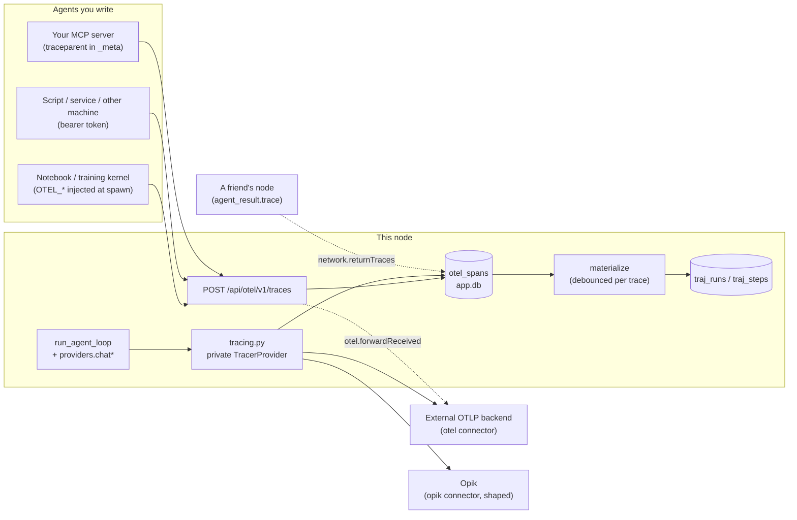

# Module: otel

**OpenTelemetry for agents, in both directions.** The node is an **OTLP/HTTP
collector** for agents you write (Pydantic AI, LangGraph, the OpenAI Agents SDK, Google
ADK, raw `opentelemetry-sdk`), and its **built-in agents emit GenAI-semconv spans**.
Those spans are always stored locally and can be exported to **Opik** (its own
connector, which shapes spans for Opik's mapping) and to Phoenix, Langfuse, Jaeger,
Tempo, Honeycomb or any other OTLP/HTTP backend — several at once. A friend's agent
that answers yours can send back its half of the trace.

There is no pane of its own. Received traces become runs in
[Trajectories](trajectories.mdx). Every run with a trace gets a **Trace** view (the span
tree), and the Trajectories **Connect** section is where you wire an agent up.

```mermaid
flowchart LR
  subgraph yours["Agents you write"]
    nb["Notebook / training kernel<br/>(OTEL_* injected at spawn)"]
    ext["Script / service / other machine<br/>(bearer token)"]
    mcp["Your MCP server<br/>(traceparent in _meta)"]
  end
  subgraph node["This node"]
    rx["POST /api/otel/v1/traces"]
    spans[("otel_spans<br/>app.db")]
    mat["materialize<br/>(debounced per trace)"]
    traj[("traj_runs / traj_steps")]
    loop["run_agent_loop<br/>+ providers.chat*"]
    tracer["tracing.py<br/>private TracerProvider"]
  end
  backend["External OTLP backend<br/>(otel connector)"]
  opik["Opik<br/>(opik connector, shaped)"]
  peer["A friend's node<br/>(agent_result.trace)"]
  nb --> rx
  ext --> rx
  mcp --> rx
  rx --> spans --> mat --> traj
  loop --> tracer --> spans
  tracer --> backend
  tracer --> opik
  peer -. "network.returnTraces" .-> spans
  rx -. "otel.forwardReceived" .-> backend
```

## The rules that shape it

- **`turn_id` stays the one identity.** A built-in turn's trace id is *derived*,
  `sha256(root_turn_id)[:16]` (`ids.py`), where the root is the part of `turn_id`
  before the first `:`. That puts delegate sub-turns (`parent:spec:hex`) in their
  parent's trace. There is no new id column, and anything holding a `turn_id` can
  compute its trace. `GET /api/otel/turn/{turn_id}` does exactly that.
- **Raw spans are the truth; a run is a projection.** Exporters flush in batches,
  child spans first and the root last, so a trace cannot be written as a run
  batch-by-batch. Spans land idempotently in `otel_spans` (PK `(trace_id, span_id)`,
  so a retried batch doubles nothing). A per-trace debounce (~1 s) then rebuilds the
  run through `trajectories.store.ingest_run(external_id=trace_id)`, which replaces
  the run's steps wholesale. The run stays `running` until a parentless span arrives.
  After 120 s of silence it is finalized anyway and marked `meta.otel.partial`.
- **Local turns are never projected.** The orchestrator already records its own
  runs. Its spans (and anything sent back under one of its trace ids) show in that
  run's Trace view instead of filing a second run.
- **Content is opt-in.** A span carries model, tokens, cost, duration, tool name and
  outcome. Prompts, completions and tool arguments/results are added only with
  `otel.captureContent`, passed through `trajectories.outbound.redact` first. This
  matches the GenAI conventions' own default, and matters because spans may leave the
  machine.
- **Tokens: absent means unmeasured.** A round the provider reported no usage for
  has no `gen_ai.usage.*` attribute at all. It never carries a zero (see
  [Trajectories → Tokens and cost](trajectories.mdx)).

## Receiving: `POST /api/otel/v1/traces`

The path is chosen so an unmodified exporter works with
`OTEL_EXPORTER_OTLP_ENDPOINT=http://127.0.0.1:<port>/api/otel`, because the SDKs
append `/v1/traces` themselves. The endpoint takes:

- `application/x-protobuf` (the Python default) and `application/json`;
- `Content-Encoding: gzip`, with a 64 MB inflation ceiling and a 32 MB raw ceiling.

### gRPC

The OTel spec's **default** protocol is gRPC, so an exporter whose owner never set
`OTEL_EXPORTER_OTLP_PROTOCOL` talks to :4317. The node can serve that too, but it is
**off unless `otel.grpcPort` is set** — it binds a *second* listening port, and a
module that opens one on every node is not something to find out about from
`netstat`. `otel.grpcHost` defaults to loopback for the same reason: the node's own
HTTP port may be loopback-only, and an unrelated setting must not widen that.

Auth is the HTTP rule unchanged — loopback needs nothing, anything else needs the
ingest token, here as the `authorization` **metadata** entry, which is where a gRPC
exporter puts `OTEL_EXPORTER_OTLP_HEADERS`.

The port is read once, at startup, so changing it needs a backend restart. The
Connect section advertises the endpoint only when a port is actually **bound**: a
configured port that was already taken is not an endpoint, and
`add_insecure_port` reports that by returning 0 rather than raising.

OTLP/JSON is walked by hand rather than through protobuf's `json_format`. OTLP/JSON
encodes ids as **hex**, while protobuf's JSON mapping would read the `bytes` fields
as base64 and corrupt every id without an error.

### Two vocabularies

`mapping.py` reads both, because the target frameworks split across them:

| Framework | Convention | Anchor span |
| --- | --- | --- |
| Pydantic AI, Google ADK, raw SDK, this node | OTel GenAI (`gen_ai.operation.name`) | `invoke_agent` |
| LangChain / LangGraph, OpenAI Agents SDK | OpenInference (`openinference.span.kind`) | `AGENT`, else root `CHAIN` |

- An LLM span becomes an assistant `message` step.
- A tool span becomes **one** `action` step: the call and its result together, the
  trajectories convention.
- Anything else becomes an `observation` step.
- Nesting is `parent_seq`. `round` is the index of the enclosing LLM call.
- Only LLM-class spans are summed for tokens. OpenInference repeats totals on the
  enclosing chain, and Pydantic AI repeats them on the agent span.
- The dataset is the resource attribute `horrible.dataset`, falling back to `otel`.

Fixtures per framework are pinned in `backend/tests/test_otel_mapping.py`.

### Who may send

- **Loopback needs nothing.**
- **Everything else needs `Authorization: Bearer <token>`**, using the node's ingest
  token (`otel:ingest_token` in `secrets.db`). Set it with
  `OTEL_EXPORTER_OTLP_HEADERS=Authorization=Bearer%20…`.
- The token is only ever returned to a loopback caller (`GET /api/otel/ingest`,
  `POST /api/otel/ingest/rotate`).

Under `pnpm dev` every request arrives from the Vite proxy on 127.0.0.1, so the proxy
now sets `X-Forwarded-For` (`xfwd`). The header is trusted **only when the direct peer
is loopback**, and only its **last** entry counts: that entry is the address the proxy
appended, while earlier entries are whatever the client claimed.

The inbound telemetry capture drops these requests' bodies and blanks their
credential-shaped headers. The I/O ring otherwise records headers raw, and on a
LAN-bound node the ring is readable by the network the token exists to keep out.

### Zero-config kernels

Notebook and training kernels (and training scripts) are spawned with these variables:

- `OTEL_EXPORTER_OTLP_ENDPOINT`, built from `server_port` and never a literal 8000;
- `OTEL_EXPORTER_OTLP_PROTOCOL=http/protobuf`;
- `OTEL_SERVICE_NAME`;
- `OTEL_RESOURCE_ATTRIBUTES=horrible.dataset=…`;
- `OTEL_METRICS_EXPORTER=none` and `OTEL_LOGS_EXPORTER=none`.

The setting is `otel.injectEnv` (`env.py`). **Your own configuration wins.** If the
backend was started with an `OTEL_EXPORTER_OTLP_*` endpoint, nothing is injected.

## Emitting: the built-in agents

`tracing.py` holds a **private** `TracerProvider`. It never claims the global one,
which is first-writer-wins and which chromadb/litellm instrumentation also reach for.
It produces three span shapes:

- **`invoke_agent <agent>`** wraps `run_agent_loop`, entered beside
  `telemetry_turn.enter`. A delegate's sub-turn nests under the
  `execute_tool agent.delegate` span that spawned it; context propagates through the
  await, so this needs no plumbing.
- **`chat <model>`** comes from the `@traced_chat` decorator on `providers.chat` and
  `chat_stream`. Because it sits at the chokepoint, research, games policies, the judge
  and the voice agent are traced too. The forced-tool-call retry is two calls, so it
  produces two spans.
- **`execute_tool <name>`** wraps every call, denied/gated/simulated ones included.
  Status comes from the result's `{"error": …}` shape.

Spans are written to `otel_spans` (`origin='local'`) by the SDK's own
`BatchSpanProcessor` thread, which keeps sqlite off the turn's hot path.

### Propagation

- **MCP**: `traceparent` goes into `params._meta` **per call** (not a transport
  header, which would stamp every call with whichever turn opened the connection). An
  OTel-instrumented MCP server that exports here nests its spans under the calling
  `execute_tool` span.
- **Peers**: `agent.ask_peer` carries an optional `traceparent`. The callee continues
  the trace, and a malformed or absent value just starts a fresh one.
- **Outbound HTTP** (`otel.propagateHttp`, default off): requests made through
  `instrumented_client` carry `traceparent` **only to loopback and private
  addresses**, so a service you run yourself can continue the agent's trace. A hosted
  provider has no use for our trace id, and a header is sent whether or not the far
  side reads it. A hostname that is not a literal address counts as public — resolving
  it would put a DNS lookup on every outbound request.

## Games

A games agent's **move** is one span (`policy.AgentPolicy._run`): one drive of the
harness, with the model calls it makes nested inside it. That is what turns "the
provider was called nine times" into "this move cost nine calls". A coded agent gets
the span too — the code is the agent.

Each move is its **own trace**, because the moves of a match are independent runs of
the same harness. Their ids are `game.<key>.<rand>`, with dots: `:` is the delegate
separator in a turn id (`ids.root_turn` splits on it), so a colon here would hand
every move of the game the same derived trace id.

`games/model_client.py`'s **anthropic** branch is the one model call in the app that
does not pass through `providers.chat`, so it opens the `chat` span itself.

### Where a trace came from

Every entry span — an `invoke_agent` or `chat` span with no parent, or whose parent
arrived from another node — says what started it, as `horrible.source`:

| Source | Started by |
| --- | --- |
| `chat` | a turn from the agent chat (`run_agent_turn`) |
| `delegate` | `agent.delegate` (any `run_agent_loop` with a parent turn) |
| `fork` | agentpedia's fork |
| `peer` | a friend's agent, through `agent.ask_peer` |
| `mobile` | the phone app's summary request |
| `evals` | an eval case; `horrible.eval_case` names it |
| `evals-judge` | the judge grading a case |
| `games` | a board move, a bug-hunt session, an AgentTown tick |
| `flow` | a flow run (each Agent node nests inside it) |
| `research` | a research run (each step is a child span) |
| `dataset-synth` | dataset synthesis |

`tracing.labels(**kv)` is how code that is not the agent loop adds such facts
(`requested_by` for a friend's eval offer, `peer_caller` for a peer's turn). It stamps
`horrible.<key>` on entry spans only; children inherit nothing.

A chat turn also carries its chat session as `gen_ai.conversation.id` (the `ask` event's
`sessionId`), which agent-trace tools group as a thread. And when content is wanted
(see below), the `invoke_agent` span carries the turn's own question and final answer
in `gen_ai.input.messages` / `gen_ai.output.messages`.

### Forks are their own trace

A fork's turn id is `<original>:fork:<hex>`. `ids.root_turn` treats `:fork:<hex>` as a
trace boundary, so a fork and its delegates are one trace of their own, not a second
root inside the original's. A second root would replace the original's trace header in
Opik, which builds the trace record from a root span. Flow runs and research runs are
rooted the same way: one root per run, with everything else nested.

## Exporting: destinations

Spans can go to several places at once. Each **destination** is one
`BatchSpanProcessor` in its own slot on the provider (`tracing.export_slot(name)`;
`TracerProvider` can add processors but never remove one, hence the slots), wrapped by
`destinations.DestinationExporter`, which:

- strips content unless *this* destination asked for it;
- applies the destination's `transform` (Opik's shaping, below);
- records how each export went. The SDK's exporter only logs a failure, so a rejected
  key used to look exactly like a quiet node. The status — last success, last error,
  span counts, never headers — is on `GET /api/otel/export`, in the connector's
  `error`, and on the Trajectories → Connect "Exporting to" card.

### Content per destination

Content is **recorded** whenever anyone wants it (`tracing.content_wanted`: the global
`otel.captureContent`, or a destination that registered for it) and **removed** on the
way to everyone who did not ask. The generic `otel` destination and the local store
follow the global setting, so turning content on for Opik changes nothing anywhere
else.

### The `otel` connector

This connector follows the `trackers` precedent field for field:

- It is an `api-key` form holding the endpoint and the headers, both secret (a
  collector URL can carry userinfo).
- They are stored under `otel:export_*` in `secrets.db`.
- Blank means *keep*.
- The standard `OTEL_EXPORTER_OTLP_*` env vars win over the stored values.
- It contributes **no agent tools**: where the node's traces go is not the agent's
  call.

Exporting to this node's own `/api/otel` is refused, because it would loop every span
back in as "received". An Opik endpoint (`/private/otel`) is refused too, with a
pointer to the Opik connector.

`otel.forwardReceived` also relays received traces **byte for byte** to the same
backend. It uses plain httpx, not `instrumented_client`, because the relay carries the
exporter's auth header.

### The `opik` connector

[Opik](https://www.comet.com/docs/opik/) (Comet Cloud or self-hosted) ingests OTLP/HTTP
at `<base>/api/v1/private/otel/v1/traces`, with the API key in `Authorization`, the
workspace in `Comet-Workspace` and the project in `projectName` (`otel/opik.py`).

- **Fields**: URL (default `https://www.comet.com/opik`), workspace, project (default
  `horrible-dashboard`), API key (secret, blank keeps), and an *include prompts and
  tool data* toggle — the connector form's one `kind: "toggle"` field. Stored under
  `opik:*` in `secrets.db`. The Opik SDK's own variables win: `OPIK_URL_OVERRIDE`,
  `OPIK_API_KEY`, `OPIK_WORKSPACE`, `OPIK_PROJECT_NAME`.
- **Content defaults on only for a loopback URL** — a Docker Opik on this machine is
  not a third party; Comet Cloud is.
- **Checked before it is stored.** `probe()` lists one project with the given
  credentials (401/403 → bad key or workspace), then tells "not Opik" from "Opik
  erred" with `/api/is-alive/ping`, using `requests` — the exporter's own HTTP stack, so
  `localhost` resolves the same way.
- **The :5173 trap.** Opik's Docker UI binds `0.0.0.0:5173`; the Vite dev server binds
  `127.0.0.1:5173`. Under `pnpm dev`, `http://127.0.0.1:5173` is our dev server and
  `http://[::1]:5173` is Opik. The probe names this when it happens.

**Why spans are reshaped for Opik.** Opik matches each attribute against mapping rules,
and **files any attribute no rule matches under the span's input**. Shipped as-is, every
span's input — and the trace's, through the root span — would be our bookkeeping
(`horrible.turn_id`, `horrible.round`…). `opik.opik_span` runs on a copy of each span,
for this destination only:

- Attributes Opik does not map (`horrible.*`, prefix stripped, plus
  `gen_ai.request.max_tokens`/`top_p`, which the `gen_ai.request.*` input rule would
  catch) are packed into one `opik.metadata` JSON object.
- `invoke_agent` loses `gen_ai.request.model` (into metadata) and its prompt/answer move
  to `input`/`output`, so it is typed *general*. `gen_ai.*` I/O and `request.model`
  would type it as an LLM call.
- `chat` gets `gen_ai.usage.cost` from `horrible.cost_usd` (chat spans only, so the
  trace counts it once) and `gen_ai.usage.cache_read.input_tokens`.
- Entry spans get `opik.tags` = `agent:<id>`, `source:<source>`, `node:<8>` and
  `thread_id` from `gen_ai.conversation.id`; Opik copies a root span's tags, metadata
  and thread to the trace.
- Any inbound `opik.*`, `thread_id`, `input` or `output` is dropped first:
  `opik.trace_id` / `opik.parent_span_id` would re-attach spans to another trace.

Checked against Opik 2.2.87: the agent span reads as `general` with the turn's prompt and
answer, chat spans as `llm` with model, provider and usage, tool spans as `tool`, and a
session's turns as one thread. When a provider reports no cost (NVIDIA's free
endpoints), Opik estimates one from the model name.

### Peers return their spans

When this node's agent asks a friend's agent (`agent.ask_peer`, or a research peer
sub-agent — both go through `agent_bridge.request_peer_agent`), the request carries a
`traceparent`, `want_spans: true`, and the **fingerprints** of this node's Opik
destinations (`sha256(base|workspace|project)[:16]`). If the friend allows it
(`network.returnTraces`, **off** by default), it captures that turn's spans
(`tracing.capture()`, a ContextVar bucket fed by a processor, so two concurrent requests
in one trace never mix) and returns them in `agent_result.trace`:

- OTLP protobuf, gzipped, base64; at most 256 KiB, the deepest and latest-ending spans
  dropped first (never the entry span), `truncated` counting them.
- **Never content, never `opik.*`**, whatever either node's settings say.

The caller (`peer_spans.ingest`, off the event loop) keeps only spans of the trace id it
sent, hanging off the span id it sent; drops any that claim one of its own span ids;
stamps the resource with `horrible.peer.node_id` from the **authenticated envelope**;
stores them as `origin="peer"`; and passes them to each export destination that is not
in the callee's `exported_to` (`otel.exportPeerSpans`, default on). The trace view
badges them with the friend's node id. In a chain (A asks B, B asks C) C's spans reach A
inside B's answer.

**The callee's own Opik.** Opik creates a trace record only from a root span, so a
peer's turn — whose parent is the caller's span — would be orphan spans in the callee's
own project. The Opik shaping therefore **re-roots** a remote-parented entry span (tags
`source:peer`, `caller:<8>`, metadata `remote_traceparent`) unless the caller sent this
node's own fingerprint: then both export to the same project, the turn keeps its parent
and nests in the caller's trace, and the callee lists that fingerprint in `exported_to`
so the caller does not send its spans a second time.

## API

| Route | |
| --- | --- |
| `POST /api/otel/v1/traces` | OTLP/HTTP receiver (auth above) |
| `GET /api/otel/ingest` | endpoint, received-trace count, last-received time, the bound gRPC endpoint; the token for loopback only |
| `POST /api/otel/ingest/rotate` | new ingest token (loopback only) |
| `GET /api/otel/export` | export destinations and how the last export to each went (no secrets) |
| `GET /api/otel/traces?origin=&limit=` | trace summaries; `origin` is `received`, `local` or `peer` |
| `GET /api/otel/traces/{trace_id}` | a trace's spans |
| `DELETE /api/otel/traces/{trace_id}` | drop a trace |
| `GET /api/otel/turn/{turn_id}` | a built-in turn's spans (derived trace id) |

Retention is 7 days or 200k spans, whichever comes first. It prunes **whole traces**,
never single spans, because a trace missing its middle projects into a run with steps
silently absent.

## Settings

| Key | Default | |
| --- | --- | --- |
| `otel.enabled` | `true` | Trace the built-in agents |
| `otel.captureContent` | `false` | Include prompts / tool data in spans (redacted) — for the local store and the `otel` connector; Opik has its own toggle |
| `otel.exportPeerSpans` | `true` | Pass a friend's returned spans on to the export destinations |
| `network.returnTraces` | `false` | Send a friend's agent the spans of the answer it asked for (no content) |
| `otel.injectEnv` | `true` | Set `OTEL_*` for notebook and training kernels |
| `otel.forwardReceived` | `false` | Relay received traces to the export connector |
| `otel.grpcPort` | `0` | OTLP/gRPC receiver port (`0` = off; `4317` is the OTel default). Read at startup |
| `otel.grpcHost` | `127.0.0.1` | Which address that receiver binds |
| `otel.propagateHttp` | `false` | Send `traceparent` on outbound requests to loopback/LAN targets |

## Still outstanding

- **Metrics and logs** signals: traces only. `OTEL_METRICS_EXPORTER` and
  `OTEL_LOGS_EXPORTER` are set to `none` for spawned kernels so their SDKs do not
  retry into a 404 every few seconds.
- **Live rebind of the gRPC port**: the setting is read at startup only.
- **Frontend spans**: the browser layout emits none; a turn's trace starts at the
  backend.
