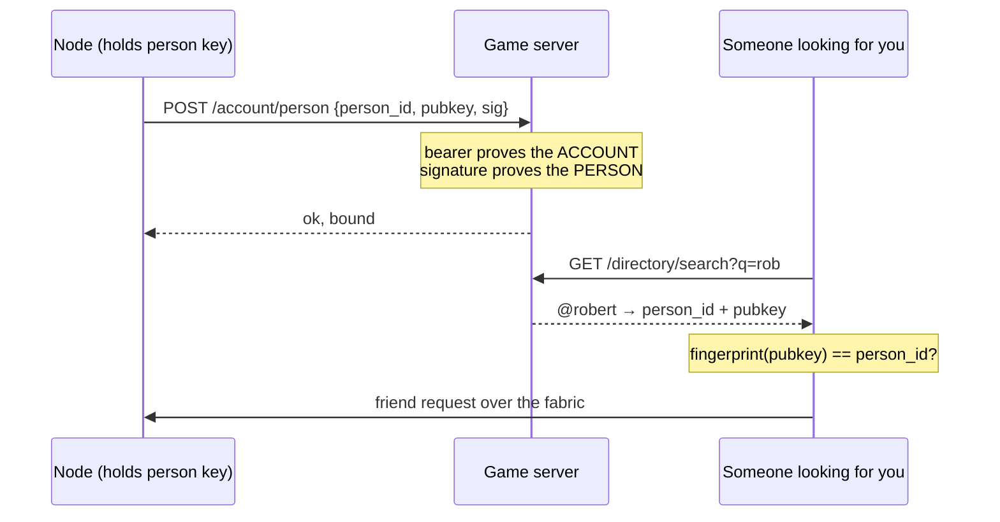

# Module: People

**One pane for everyone you know**, replacing nine. `people.home` is a `tool`
(right dock) with five [sections](../architecture/windowing.mdx#embedded-views-and-sections):

| Section | What it is | Came from |
| --- | --- | --- |
| **Friends** | The roster, keyed by person; their machines fold underneath | `social.friends` |
| **Messages** | Peer chat | `network.chat` |
| **Discover** | Callsign search, and the agent commons directory | `commons.directory` |
| **Requests** | The inbound inbox | `commons.requests` |
| **Me** | Your callsign, friend code, devices, profile, diagnostics | `commons.profile` |

## Why nine became one

Five of the retired panes moved whole. The other four —
`network.peers`, `network.monitor`, `network.lobby`, `network.relay` — were
**infrastructure that became destinations**: a raw node list, a metrics readout, a
rendezvous client, and a traffic log with two permission toggles. They were panes
because a pane was the only way to show anything.

"Peers" was the clearest case. It answered *which machines are connected*, when the
question a person actually has is *which of my friends is around* — and it did so in
a vocabulary (node ids, transports, trust flags) that means nothing unless you built
the fabric. People answers the real question, by person.

Nothing was deleted from the system, only from the list of places to go: transports,
trust and rendezvous remain services (`network/ws.ts`, `lobby.ts`, `peerchat.ts`),
their knobs are on the settings page, and the two diagnostics readouts fold away
under **Me** rather than each owning a pane.

`network`, `social` and `commons` therefore contribute **settings, services and
components, but no panes**. That is a legitimate shape for a module here — it is
what "the module registry is the public API" buys you.

### Every old name still works

Merging a pane must never reduce reachability, so `show("Peers")`,
`show("social.friends")`, `show("Commons Requests")` and the rest all still resolve,
through `VIEW_ALIASES` in `layout/controller.ts`, to the section that holds them
now. A saved *layout* is disposable and reseeds from its preset; the vocabulary the
user and the agent have learned is not. Pinned by a table-driven test in
`layout/__tests__/sections.test.ts`.

## `@callsign` — one name for a person

A human used to have **two** identities with nothing connecting them:

- a **handle** on the game server — globally unique, OAuth-derived, shown on the
  ladder and in HorribleAssault; and
- a **`person_id`** on the peer fabric, rendered as an `HD-XXXX-…` friend code.

So one screen asked for an "Account ID" while the pane beside it asked for a friend
code, and neither could answer "who is this?" about the other's answer. Adding
someone meant reading a 25-character code aloud.

The game server is the only uniqueness authority every node agrees on, so the
mapping lives there: `accounts.person_id` + `person_public_key`, **unique in both
directions** (migration `_m8_person_binding`). One account is one person — sharing a
handle across two person keys would make `@rob` ambiguous, and letting one person
hold two handles would put them on the same ladder twice.

### What the two proofs are for

The bearer token proves *account*; the signature proves *person*. **Both** are
required: a bearer alone would let anyone claim to be any person, and a signature
alone would let anyone bind a person to any account.

The signed challenge **includes the account id** — without it, a signature proving
"I hold this person key" could be lifted from any other context and replayed to bind
someone else's person to your account.

### A handle is a directory name, not an authority

`handles.resolve` checks that the returned `person_id` really is the fingerprint of
the key it came with, so a compromised directory can **withhold** someone but never
substitute a different key for them. Beyond that, a handle is a claim the game
server vouches for — which is exactly why the **friend code stays first-class**: it
is derived from the person's own key, so it works offline, on a LAN, and with no
server to trust. Callsign search is the convenience; the code is the guarantee.

The presence record published to Atlas carries `handle` too, and that copy is
**a claim, not proof** — `verify_record` checks the record was signed by the person
key it names, which says nothing about who owns the callsign. Resolve a callsign
through the game server, never by trusting a presence record.

### Search is deliberately narrow

`GET /directory/search` is **prefix**, not substring, with a **3-character minimum**
and bots excluded. A substring match over a short query is close enough to a scrape,
and `LIKE 'q%'` can use the handle index while `LIKE '%q%'` cannot.

LIKE wildcards in a query are **escaped, not stripped**, and the length gate applies
to the raw query. Stripping them after the check let `"%%%"` through as an empty
prefix — `LIKE '%'`, i.e. every account in one request. And `_` is a legal handle
character, so stripping it would quietly make `rob_smith` unfindable by anyone who
typed the underscore.

### Where `@handle` is accepted

`roster.resolve_target` is the shared entry point: `@callsign` first (exact and
globally unique), then a friend code or bare person id. It backs `add_friend`, and
`agent_tools.resolve_row` adds it to `social.message`, `social.ask_agent` and
`hassault.invite`.

A **display name is never accepted** by `resolve_target` — resolving one needs the
roster, and this runs before someone is on it. The agent's `resolve_row` will try a
display name, but only when it is unambiguous: silently picking the closest fuzzy
match is how an agent messages the wrong person.

`friendcode.resolve_person_id` stays sync and pure. Its length-based discrimination
is load-bearing, and it deliberately does **not** fall back to "treat it as a raw
id" when the checksum fails — that fallback would dial a mistyped code as if it
were real.

## The duplicated crypto

The game server deploys on its own (Fly) and must not import the node's module
graph, so `games_server/crypto.py` re-implements two primitives: the person
fingerprint (`base32(sha256(pubkey))[:16]`, lowercase, unpadded — **not**
base64url) and the Ed25519 verify.

That duplication fails **silently and open** when it drifts, so it is pinned the way
the Kotlin wire is: `backend/tests/test_games_person_binding.py` replays both copies
against the node's implementations, and asserts the two sides build byte-identical
challenge bytes. The fixture pins *agreement*; each side's own tests pin correctness.

## The Steam shape

The pane got the shape Steam settled on years ago, because it answers the two
questions people actually have at a glance: **who is around**, and **is anything
waiting for me**.

- **Friends** — one row per person: face, name, level, what they're up to, an
  unread badge, and a `⋯` menu (View profile / Message / their machines / Remove /
  Block). Grouped **Online** then **Offline**, with offline dimmed rather than
  hidden — the trick that makes the list scannable. A search box appears past three
  friends. Adding a friend, linking a machine and renaming yourself moved into a
  fold at the bottom: they are setup, not daily use.
- **Messages** — a conversation list with unread badges beside a thread, keyed by
  person and persisted server-side. See [Messages](social.mdx#messages).
- **Requests** — one inbox for friend requests *and* commons meet requests, which
  used to be a click apart. See [Requests](social.mdx#requests-one-inbox).
- **Profiles** — clicking a friend's name opens their
  [profile](games.mdx#profiles--the-part-other-people-can-see) inside the pane:
  banner, face, status, level, showcases and comment wall, with a Back button.

### Faces are decoration, and must be

Avatars and levels come from the game server, fetched once per roster in a single
batched call (`profile-cards.ts` → `POST /api/games/profiles/cards`) and cached for
the session. The roster itself is **local**, so every consumer has to work without a
card: a friend with no callsign, a signed-out node and an unreachable game server
are all the same case — render the name, the presence dot and an initial, carry on.
The roster must never acquire a network dependency to draw.

## Contributions

- **Widget:** `people.home` (`tool`, right dock, 5 sections). **One**
  `useAgentContext` provider, per the sections contract — section bodies render
  inside this pane's instance id, so two providers would silently overwrite each other.
- **Commands:** `people.open`, `people.find` (jumps to Discover), `people.me`.
- **Routes:** `POST /api/social/handle/bind`, `GET /api/social/directory/search`.
- **Game server:** `POST /account/person`, `GET /directory/resolve`,
  `GET /directory/search`, `POST /directory/people` (the reverse lookup: fabric
  people → their ladder accounts, which a node needs to discover that a friend it
  already trusts is the same human as an account it already sees),
  `POST /profiles/cards`.
- **Shared pieces:** `Avatar.tsx` (one face renderer, with the presence dot as a
  child so it follows the face at any size), `profile-cards.ts` (the batched cache),
  `conversation.ts` (which thread Messages is showing — a store rather than a prop,
  because the two sides are sibling *sections* with no parent between them).
- **Agent tools:** unchanged and still `social.*` — the pane was renamed, the tool
  namespace was not. Renaming it would silently re-group the tools (grouping is
  name-prefix only) and break saved permission rules and Flow graphs at once.

## Not done yet

- `mobile.capture_photo` / `mobile.notify` now take an optional `device`, and refuse
  rather than guess when several phones are connected — but there is still no UI for
  naming one.
- The peer/relay metrics fold away under **Me**; they are not yet an observability
  `peer` IoSource, which is where they belong.
- Own-device presence reads `offline` for the machine you are sitting at: presence
  derives from peer-hub sessions, and a node is not a peer of itself.
