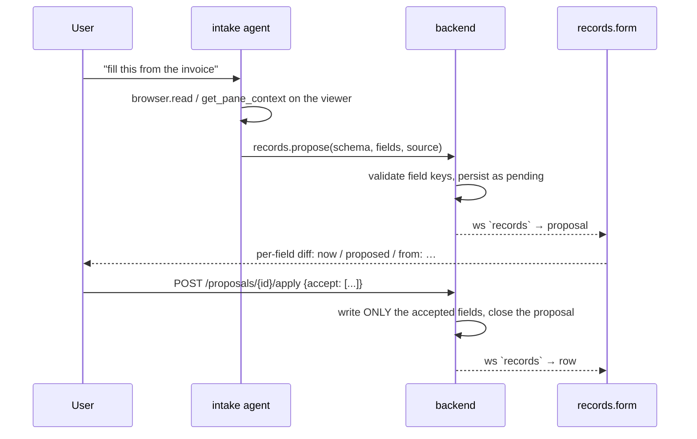

# Records

User-defined tables — CRM contacts and deals, intake forms, anything row-shaped —
as three views of one store, plus an agent write path that **proposes** rather than
commits.

The module is deliberately generic. There is no CRM module and no data-entry
module: there is one `records` substrate, and CRM and Data Entry are *schemas and
layouts* on top of it. Adding "track my job applications" is a schema, not a
feature.

## Storage: real tables in `app.db`

Two levels, both in the node's own SQLite database (`$HORRIBLE_DATA_DIR/app.db`,
via `database/app_db.py` like every other module that keeps a table there):

- `record_schemas` — the catalog. One row per user table: `id`, `name`, `icon`,
  `fields` (JSON), `board_column`, `title_column`.
- `rec_<schema_id>` — the data. A **physical** table with a real column per field,
  plus `id`, `created_at`, `updated_at`.

Physical tables rather than one generic `(schema_id, data JSON)` blob table,
because the payoff is concrete: a CRM built here is immediately queryable from the
[database](database.mdx) console's built-in `app` connection, from `dash`, and by
the `dba` agent, with no records-specific code anywhere. `SELECT stage, count(*)
FROM rec_deals GROUP BY stage` just works.

The cost is schema evolution, so v1 is **additive only**:

| change | effect |
| --- | --- |
| add a field | `ALTER TABLE … ADD COLUMN` |
| rename a label, reorder, change options | catalog only |
| remove a field | the *declaration* goes; the **column stays** |

Dropping a column would mean silently destroying data because someone edited a
form, and SQLite's `DROP COLUMN` has enough caveats (indexes, generated columns)
that it isn't worth it. Retire a field by marking it `hidden` instead. Deleting a
whole schema keeps its data table unless `?drop_table=true` — the catalog row is
cheap to recreate, the rows are not.

`table_name()` **validates** the schema id against `^[a-z][a-z0-9_]{0,39}$` rather
than escaping it: identifiers can't be bound in SQLite, so that pattern check is
the injection defense for every statement in the module. Field keys are checked the
same way, and `id`/`created_at`/`updated_at` are reserved.

Field types: `text`, `longtext`, `number`, `date` (ISO strings — they sort
correctly and SQLite has no date type), `select` (with `options`), `url`, `email`,
`ref` (with `ref_schema`).

## Panes

| view id | role | what it is |
| --- | --- | --- |
| `records.grid` | document | The rows as an editable table. Double-click a cell to edit. |
| `records.form` | document | One record, field by field — and the **proposal review** surface. |
| `records.board` | document | Kanban by the schema's `board_column`; drag a card to write that field. |
| `records.list` | tool (left dock) | Table switcher, search, and the pending-proposal count. |

All four contribute `useAgentContext`, which is what makes the workspace ambient
context (see [agent-chat](agent-chat.mdx)) pay off here: the agent sees "board:
deals, form: contact 42 open, 3 empty fields" with no tool round-trip.

**Pinned vs shared grids.** Unpinned, the grid follows the shared selection — one
active table, one open record, three views of it. Given `params.schemaId` it
becomes a standalone table with its own rows and its own selection. That's not a
detail: the CRM workspace shows the activity log under the record form, and without
pinning the log would hijack the workspace's active table for the board and form
too. A pinned grid listens to the `records` `/ws` channel directly (`onRowEvent`)
since the shared store only tracks the active schema.

## The propose/approve loop

`records.propose` never writes. It files a **proposal** — per-field values, each
carrying a citation — which surfaces in the open form as an accept/reject diff:

Why it works this way:

- **Propose is not a side effect** (`side_effect=False`), so it doesn't hit the
  permission gate and is safe to leave running unattended — nothing it does can
  reach a table. `records.commit` and `records.createSchema` *are* side-effecting
  and do go through the gate.
- **Provenance per field.** A review is only faster than typing if each value says
  where it came from; a field the user can't verify at a glance is worse than a
  blank one. The `intake` agent's prompt requires it.
- **Persisted, not in-memory.** A reload mid-review doesn't lose the queue.
- **Accepting nothing is a rejection**, not an empty write — leaving a
  half-reviewed proposal open would show it again on the next load.
- Field keys are validated at *propose* time, so a bad extraction fails in the
  agent's tool result rather than sitting in the queue until someone hits Accept.

This mirrors the editor's `proposeEdit` diff — the same convention for any agent
write a human should see first.

## Agent tools (group `records`)

| tool | side effect | purpose |
| --- | --- | --- |
| `records.listSchemas` | – | Tables with their fields, types and row counts. Call first — field keys are not guessable. |
| `records.query` | – | Rows, filtered by exact values (`where`) or text `search`. |
| `records.get` | – | One row by id. |
| `records.propose` | – | Propose field values for review. **The normal write path.** |
| `records.commit` | ✔ | Write straight through. Only for changes the user explicitly asked for. |
| `records.createSchema` | ✔ | Define a new table from a description. |

`propose` accepts both `{key: value}` and `{key: {value, source, confidence}}` — a
local model reliably produces the flat form however the schema is described, and
refusing it would just cost a retry round; a call-level `source` fills in for any
field that didn't cite its own.

The group name **is** the `records.` name prefix. `AgentTool.group` only marks a
tool as progressively disclosed; it does not name the group (see
[agent-tools](../architecture/agent-tools.mdx)).

## Workspaces

Both declare their agent, so switching to them switches who answers.

- **CRM** (`crm`, agent `crm`) — board + grid tabbed on the left, the record form
  and a pinned activity grid on the right, tables rail left, agent right. The `crm`
  agent scopes to `records, browser, search, github, google, library`: it enriches
  a contact from the open web or a connected account, and proposes what it found.
- **Data Entry** (`intake`, agent `intake`) — the source document (PDF viewer or
  browser) and the form, half and half, because the workflow is reading one and
  confirming the other and neither is secondary. The `intake` agent is forbidden
  `records.commit` by its prompt: it proposes, cites, and never invents a value
  that isn't in the document.

The built-in schemas (`contacts`, `deals` with a `stage` board, `activities`,
`intake`) are seeded on demand the first time a records pane finds an empty
catalog — at most once per session, so a user who deleted every table isn't fought
by re-seeding — never at boot, so a node that never opens the CRM doesn't grow four
empty tables. They're starting points, expected to be edited.

## HTTP + `/ws`

- `GET|POST /api/records/schemas`, `PATCH|DELETE /api/records/schemas/{id}`,
  `POST /api/records/seed`
- `GET|POST /api/records/{schema}/rows`, `GET|PATCH|DELETE /api/records/{schema}/rows/{id}`
- `GET /api/records/proposals/pending`, `POST /api/records/proposals/{id}/apply|reject`
- `records` `/ws` channel (push-only, like the library's): `proposal`,
  `proposal_closed`, `row`.
