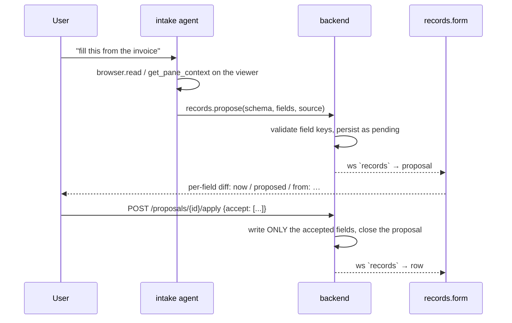

# Records

User-defined tables — papers to read, job applications, contacts, anything
row-shaped — as views of one store, plus an agent write path that **proposes**
rather than commits.

The module is deliberately generic. There is no CRM module and no data-entry
module: there is one `records` substrate, and a schema is all a new use case takes.
Adding "track my job applications" is a schema, not a feature.

The **review surface is the point of the module**, not the grid. An agent reading a
document proposes field values with citations; you accept them one by one. That is
why the panes are docked into the workspaces where reading happens — Research, Web
Ops and Data Entry — rather than living in a records-only workspace.

A pipeline workspace (`crm`) and a matching roster agent used to exist, and both
were removed. They presumed a sales workflow the substrate never required, and they
were the reason a generic table store read as CRM software. The agent in particular
was a persona rather than a capability: enriching a table from the open web is what
`researcher` does, now that it carries `records` alongside browser/search/github/
google. Nothing was lost — a contacts table is still a schema you can create in
**Table setup**, and the same agent will fill it in.

## Storage: real tables in `app.db`

Two levels, both in the node's own SQLite database (`$HORRIBLE_DATA_DIR/app.db`,
via `database/app_db.py` like every other module that keeps a table there):

- `record_schemas` — the catalog. One row per user table: `id`, `name`, `icon`,
  `fields` (JSON), `board_column`, `title_column`.
- `rec_<schema_id>` — the data. A **physical** table with a real column per field,
  plus `id`, `created_at`, `updated_at`.

Physical tables rather than one generic `(schema_id, data JSON)` blob table,
because the payoff is concrete: a CRM built here is immediately queryable from the
[database](database.mdx) console's built-in `app` connection, from `dash`, and by
the `dba` agent, with no records-specific code anywhere. `SELECT stage, count(*)
FROM rec_deals GROUP BY stage` just works.

The cost is schema evolution, so v1 is **additive only**:

| change | effect |
| --- | --- |
| add a field | `ALTER TABLE … ADD COLUMN` |
| rename a label, reorder, change options | catalog only |
| remove a field | the *declaration* goes; the **column stays** |

Dropping a column would mean silently destroying data because someone edited a
form, and SQLite's `DROP COLUMN` has enough caveats (indexes, generated columns)
that it isn't worth it. Retire a field by marking it `hidden` instead. Deleting a
whole schema keeps its data table unless `?drop_table=true` — the catalog row is
cheap to recreate, the rows are not.

`table_name()` **validates** the schema id against `^[a-z][a-z0-9_]{0,39}$` rather
than escaping it: identifiers can't be bound in SQLite, so that pattern check is
the injection defense for every statement in the module. Field keys are checked the
same way, and `id`/`created_at`/`updated_at` are reserved.

Field types: `text`, `longtext`, `number`, `date` (ISO strings — they sort
correctly and SQLite has no date type), `select` (with `options`), `url`, `email`,
`ref` (with `ref_schema`).

## Panes

| view id | title | role | what it is |
| --- | --- | --- | --- |
| `records.grid` | **Rows** | document | The rows as an editable table. Double-click a cell to edit. |
| `records.form` | **Review** | document | The **proposal review** surface, and one record field by field. |
| `records.board` | **Board** | document | Kanban by the schema's `board_column`; drag a card to write that field. |
| `records.schema` | **Table setup** | document | Define or reshape a table: name, icon, fields, row label, board column. |
| `records.list` | **Tables** | tool (`embedded`) | Table switcher, search, "+ New table", and the review queue. The **Tables** section of [Explorer](explorer.mdx). |

The titles are deliberate. The module, the pane and the row were all called some
inflection of "record", which said nothing about any of them; `records.form` is
named **Review** because that is its actual job, and being a data-entry form is
secondary.

All of them contribute `useAgentContext`, which is what makes the workspace ambient
context (see [agent-chat](agent-chat.mdx)) pay off here: the agent sees "board:
papers, form: row 42 open, 3 empty fields" with no tool round-trip.

**Pinned vs shared grids.** Unpinned, the grid follows the shared selection — one
active table, one open record, several views of it. Given `params.schemaId` it
becomes a standalone table with its own rows and its own selection, so a second
grid can show a fixed table beside the shared one without hijacking it. A pinned
grid listens to the `records` `/ws` channel directly (`onRowEvent`) since the shared
store only tracks the active schema.

## Defining a table

`records.schema` ("Table setup") is reached from the **+ New table** button in the
Tables rail, the ⚙ beside the active table, or the `records.newTable` command.

It exists because `createSchema`/`updateSchema`/`deleteSchema` shipped in `api.ts`
with **no caller at all**: a table could only be defined by the agent or by hand
over HTTP, and the rail's empty state pointed at a *workspace* because there was no
action to point at. A substrate whose only author is the agent is one the user
cannot start using on their own.

Two backend rules the pane surfaces rather than hides:

- The **id is the physical table name**, so it is pattern-validated, narrower than
  the display name, and immutable after creation. The pane shows `rec_<id>` as you
  type, because that name is how the table is reached from the
  [database](database.mdx) console.
- **Field removal is additive-only.** Removing a field here drops the declaration
  and keeps the column. Dropping a table asks twice, and keeps the rows unless you
  say otherwise — the catalog row is cheap to recreate, the rows are not.

## The propose/approve loop

`records.propose` never writes. It files a **proposal** — per-field values, each
carrying a citation — which surfaces in the open form as an accept/reject diff:

Why it works this way:

- **Propose is not a side effect** (`side_effect=False`), so it doesn't hit the
  permission gate and is safe to leave running unattended — nothing it does can
  reach a table. `records.commit` and `records.createSchema` *are* side-effecting
  and do go through the gate.
- **Provenance per field.** A review is only faster than typing if each value says
  where it came from; a field the user can't verify at a glance is worse than a
  blank one. The `intake` agent's prompt requires it.
- **Persisted, not in-memory.** A reload mid-review doesn't lose the queue.
- **Accepting nothing is a rejection**, not an empty write — leaving a
  half-reviewed proposal open would show it again on the next load.
- Field keys are validated at *propose* time, so a bad extraction fails in the
  agent's tool result rather than sitting in the queue until someone hits Accept.

### Arrival is announced, not just broadcast

The `records` `/ws` channel updates an **already-open** review pane. That is not
enough on its own, because propose is explicitly the write path that is safe to run
unattended — which makes "the user is looking at something else" its normal case,
not its edge case. Two things follow:

- **The watch starts at boot** (`initRecordsWatch` in `main.tsx`), not on pane
  mount. It used to start only when a records pane mounted, so a proposal filed
  while you were elsewhere was received by nobody and counted on nothing. Same bug,
  and the same fix, as `initSocial` — see [notifications](notifications.mdx).
- **Propose raises a `review` notification** through
  `notifications.service.notify`, so it reaches the bell, a toast and (optionally)
  the OS. It goes through the service rather than being raised locally so the mute
  rules apply at the producer: an extraction run filing forty proposals must be
  silenceable.

The rail's badge counts **every** table, not the selected one. `getProposals()` is
schema-filtered on purpose — the review pane must not hijack an open record with an
unrelated diff — but the badge reads `getAllProposals()`, because an agent files
against whatever table it was asked about, and a queue you can only find by first
guessing the right table is one you never find.

This mirrors the editor's `proposeEdit` diff — the same convention for any agent
write a human should see first.

## Agent tools (group `records`)

| tool | side effect | purpose |
| --- | --- | --- |
| `records.listSchemas` | – | Tables with their fields, types and row counts. Call first — field keys are not guessable. |
| `records.query` | – | Rows, filtered by exact values (`where`) or text `search`. |
| `records.get` | – | One row by id. |
| `records.propose` | – | Propose field values for review. **The normal write path.** |
| `records.commit` | ✔ | Write straight through. Only for changes the user explicitly asked for. |
| `records.createSchema` | ✔ | Define a new table from a description. |

`propose` accepts both `{key: value}` and `{key: {value, source, confidence}}` — a
local model reliably produces the flat form however the schema is described, and
refusing it would just cost a retry round; a call-level `source` fills in for any
field that didn't cite its own.

The group name **is** the `records.` name prefix. `AgentTool.group` only marks a
tool as progressively disclosed; it does not name the group (see
[agent-tools](../architecture/agent-tools.mdx)).

## Where the panes live

The module owns **one** workspace and contributes its review surface to three:

- **Data Entry** (`intake`, agent `intake`) — the module's own preset. The source
  document (PDF viewer or browser) and Review, half and half, because the workflow
  is reading one and confirming the other and neither is secondary. The `intake`
  agent is forbidden `records.commit` by its prompt: it proposes, cites, and never
  invents a value that isn't in the document.
- **Research** and **Web Ops** (in the `layouts` module, agent `researcher`) — the
  Review pane tabs with the library panel, because those are the two things you do
  with a finding: keep the page, or put its fields in a table. Reviewing an
  extraction beside the document it came from is the whole reason the records panes
  are docked here rather than in a workspace of their own.

That last one has a dependency worth stating: `researcher`'s `tool_groups` includes
`records`. A reading workspace that can *show* a proposal but whose agent cannot
*file* one is a dead button.

The starter schemas (`contacts`, `deals` with a `stage` board, `activities`,
`intake`) are seeded on demand the first time a records pane finds an empty
catalog — at most once per session, so a user who deleted every table isn't fought
by re-seeding — never at boot, so a node that never opens records doesn't grow four
empty tables. They are starting points, expected to be edited or deleted; the
`records.seed` command re-creates any that are missing.

## HTTP + `/ws`

- `GET|POST /api/records/schemas`, `PATCH|DELETE /api/records/schemas/{id}`,
  `POST /api/records/seed`
- `GET|POST /api/records/{schema}/rows`, `GET|PATCH|DELETE /api/records/{schema}/rows/{id}`
- `GET /api/records/proposals/pending`, `POST /api/records/proposals/{id}/apply|reject`
- `records` `/ws` channel (push-only, like the library's): `proposal`,
  `proposal_closed`, `row`.
