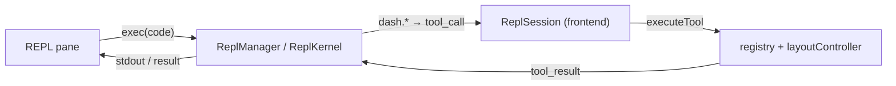

# Module: repl

An embedded **Python REPL** pane with a small **SDK** (`dash`) for scripting the
dashboard — panes, widgets, workspaces, window operations — programmatically.

**Status: implemented.** The `repl.console` panel is a cell-based interpreter (not
a PTY): you type Python, Enter runs the cell, a trailing expression echoes its
`repr`, and state persists across cells. Each console is backed by a per-`/ws`
kernel on the backend whose injected `dash` object relays UI operations to the
same browser. It is the programmatic twin of the
[agent orchestrator](./agent-chat.mdx): both drive the UI through the one shared
`executeTool` relay surface, so anything the agent can do, the REPL can do.

## Contributions to the layout shell

- **Panels:** `repl.console` (one kernel per instance, default: bottom dock tab
  group; non-singleton — open as many as you like, tab/split/float them).
- **Commands:** `repl.new` ("Python REPL: New console").
- **Workflow layout:** the console is part of the built-in **Scripting** layout
  (files · editor · REPL + terminal) in the shell rail — see
  [windowing](../architecture/windowing.mdx).

## The `dash` SDK

Every session's namespace is seeded with one object, `dash`. Calls are ordinary
**synchronous** Python — under the hood each blocks the cell on a round-trip to the
browser, but you write it like a normal function call. The table below is the quick
map; the [**Python SDK reference**](../architecture/python-sdk.mdx) is the canonical
doc (return shapes, error handling, recipes, how to extend it).

| Call                          | Relayed tool          | Does                                        |
| ----------------------------- | --------------------- | ------------------------------------------- |
| `dash.panes.available()`      | `list_available_panes`| Every openable pane (panel + widget)        |
| `dash.panes.open_list()`      | `list_open_panes`     | Panes open in the active workspace          |
| `dash.panes.open(id)`         | `open_pane`           | Open a panel/widget by id                   |
| `dash.panes.close(id)`        | `close_pane`          | Close an open pane                          |
| `dash.workspaces.list()`      | `list_workspaces`     | Named workspaces + which is active          |
| `dash.workspaces.create(name)`| `create_workspace`    | New workspace, switched to                  |
| `dash.workspaces.switch(id)`  | `switch_workspace`    | Switch workspace tab                        |
| `dash.context(instanceId)`    | `get_pane_context`    | Read a live widget's state snapshot         |
| `dash.call(name, **args)`     | _any_                 | Escape hatch: relay any tool by name        |

`dash.call` reaches every per-widget `agentTool` and agent-exposed command, so new
capabilities are scriptable the moment they exist — no SDK change needed.

```python
dash.panes.available()                 # discover ids
dash.panes.open("settings.home")       # open Settings
ws = dash.workspaces.list()            # inspect workspaces
panes = dash.panes.open_list()         # find a live instanceId
dash.context(panes["panes"][0]["instanceId"])  # read its state
```

## Backend surface

`backend/modules/repl/` owns the interpreter — **backend implemented.** A
`ReplManager` lives per `/ws` connection (like `TerminalManager`) and routes the
`repl` channel; kernels are dropped when the socket closes.

- **`kernel.py`** — `ReplKernel`: one persistent namespace per session. A cell is
  parsed with `ast`; a trailing bare expression is split off and `eval`'d for its
  `repr` (IPython-style echo), the rest `exec`'d. Errors come back as a formatted
  traceback (the kernel's own frame stripped), never raised.
- **`manager.py`** — runs each cell in a worker thread (`asyncio.to_thread`) so a
  slow line never stalls the event loop; stdout/stderr stream live to the pane.
- **`sdk.py`** — the `dash` facade. Each method calls a synchronous bridge that
  hops to the event loop with `run_coroutine_threadsafe`, sends a `tool_call`, and
  blocks the worker thread on the browser's `tool_result` — reusing
  `WsConnection.pending` (the same future map the agent uses, keyed by a unique
  `callId`).



Channel protocol (`{channel:'repl', event, data}`):

| Direction     | event                          | data                              |
| ------------- | ------------------------------ | --------------------------------- |
| client→server | `start` / `exec` / `close`     | `{id, code?}`                     |
| server→client | `started` / `stdout` / `stderr`| `{id, banner?/data?}`             |
| server→client | `result`                       | `{id, ok, repr?, error?}`         |
| server→client | `tool_call`                    | `{id, callId, name, args}`        |
| client→server | `tool_result`                  | `{id, callId, ok, result, error}` |

## Agent integration

The REPL pane exposes its recent transcript via `getAgentContext()`, so the agent
can read what a console has been doing. The REPL does **not** declare gated agent
tools of its own.

## Browser vs desktop

| Concern              | Browser                                                                 | Desktop                          |
| -------------------- | ----------------------------------------------------------------------- | -------------------------------- |
| Where Python runs    | on the backend host (local dev: your machine; remote backend: the server) | localhost backend = your machine |
| UI operations        | relayed to the originating tab via `executeTool` (identical surface)    | identical                        |
| Console UX           | identical (shared frontend pane)                                        | identical                        |

## Security note

The REPL is **arbitrary backend code execution** plus **ungated UI mutation** — by
design, matching the trusted, local-app posture (the same trust model as the
[terminal](./terminal.mdx) pane: a console is the user's own direct intent, so its
`dash.*` calls are **not** routed through the agent permission gate). This is safe
while the backend is bound to localhost. Any future remote-access story must
address auth at the backend boundary — exposing the backend beyond localhost
exposes a Python interpreter on that host.
