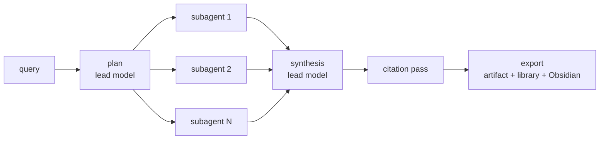

# Module: research

Collect, read, and (soon) synthesize research material. The research module is the
home of the **artifact store** viewers and the flows that fill it: capture any URL
as a **self-contained HTML archive**, store and read **PDFs**, and mirror everything
into an **Obsidian vault**. Later phases add the ArXiv browser and the durable
deep-research engine, and the `research` workspace preset composes it all with the
[browser](browser.mdx) and [library](library.mdx) panes.

**Status: implemented** (all four phases) — artifact store, page capture
(engine + fallback), PDF pipeline + viewer, saved-page viewer, Obsidian export,
the ArXiv browser, the **durable deep-research engine** + console, the
**Research workspace preset**, and full `research.*` / `arxiv.*` agent
awareness.

## The Research workspace

The **Research** entry in the top tab strip (declared with the other
cross-module presets in `packages/core/src/modules/layouts/index.ts`) seeds a
discovery/reading split: the deep-research console, ArXiv browser, and a
browser tab share the left area; the PDF/page viewers stack over the library on
the right, so opening a paper never steals the console; the agent chat docks
right (the researcher persona one keystroke away) with the observability I/O
strip hidden in the bottom dock. As with every preset, unknown views are
skipped, user rearrangements persist per workspace, and `layout.reset` reseeds.

## The artifact store

The node's first on-disk blob store (`backend/modules/artifacts/`):

- Blobs live at `$HORRIBLE_DATA_DIR/artifacts/<sha256[:2]>/<sha256>` —
  **content-addressed**, so saving the same PDF twice stores one blob, and the
  serving path is derived only from the hash: path traversal is impossible by
  construction.
- Rows live in an `artifacts` table in `app.db` (id, sha256, kind, mime, filename,
  size, origin_url, meta). Kinds: `pdf`, `page`, `report`.
- `GET /api/artifacts/:id` is the byte route the viewers load from. Captured pages
  are served with `Content-Security-Policy: sandbox; default-src 'self' data:` on
  top of the viewer's iframe sandbox — stored third-party HTML never gets scripts
  or an origin.
- `POST /api/artifacts/upload` accepts PDF multipart uploads (100 MB cap);
  `DELETE` refcounts the blob (it's unlinked only when the last row referencing
  its hash goes).

The [library](library.mdx) gained two artifact-backed source types — `page` and
`pdf` — whose catalog rows carry an `artifact_id`. Ingestion reads the stored blob
(pypdf text extraction for PDFs; trafilatura article extraction for pages), chunks
and embeds it like any other source, and search hits carry the `artifact_id` so a
result opens straight into a viewer.

## Page capture (SingleFile-style, but native)

SingleFile itself is **AGPL**, and this repo ships no AGPL code (the same rule
that picked pypdf over PyMuPDF). Capture is therefore native, with an opt-in
escape hatch:

- **Engine path** — the browser pane's `capture` op (full mode): serializes the
  live **post-JS DOM** (`page.content()`), fetches subresources *with the
  session's cookies* through the same egress policy as navigation (public-host
  check per redirect hop), and inlines images and stylesheets as `data:` URIs.
  The artifact is stored server-side; only ids cross `/ws`.
- **Fallback path** — `POST /api/research/capture` with no engine: the page and
  every subresource are fetched through the browser module's SSRF guard
  (`safe_fetch_html` / `safe_fetch_bytes`), then inlined the same way.
- The inliner core (`backend/modules/research/capture.py`) is pure and two-pass —
  `list_resources` → caller fetches → `build_page` — which is exactly what lets
  the sync engine thread and the async guard share one implementation. Scripts,
  inline handlers, `javascript:` URLs, meta-refresh, and any pre-existing
  `<base>` are stripped; a fresh `<base href>` keeps un-inlined links meaningful.
  Caps: 5 MB per resource, 25 MB per page; an un-fetched resource just stays an
  absolute URL (the viewer's CSP blocks it from loading — archives are inert).
- **Known v1 losses**: cross-origin iframe content, JS-lazy assets that never
  entered the DOM, `@import` chains beyond one level of `url(...)`.
- **single-file-cli** (optional): set the `research.singleFileCli` setting to a
  user-installed executable and URL captures shell out to it instead
  (`--dump-content`, 60 s timeout). The AGPL boundary is the process boundary;
  nothing is bundled. Its fetches are its own — only the initial URL is
  validated against the egress policy.

The browser pane's **Save → page** (`browser.save` with `target: "page"`) now
files the capture as a `page` source pointing at the artifact, and falls back to
the old text-only `blog`-by-URL ingest if the capture op isn't available.

## Viewers

- **`research.pdfViewer`** (multi-instance, document role) — pdf.js over
  `GET /api/artifacts/:id`. Canvas pages with a selectable text layer, zoom, and
  text-layer find (jumps to the next matching page). Opened with params
  `artifactId | sourceId | url` and optional `page`. The worker is a Vite-native
  module worker (`new Worker(new URL('pdfjs-dist/build/pdf.worker.min.mjs', …))`)
  — no asset copying, same code in web and Tauri.
- **`research.pageViewer`** (multi-instance, document role) — a **fully
  sandboxed** iframe (`sandbox=""`, `referrerPolicy="no-referrer"`) over the
  stored HTML, with the origin URL one click from opening live in the browser
  pane, and an Export-to-Obsidian button.

Commands: `research.capturePage` (capture by URL), `research.openPdf` (upload a
file), `research.savePdfUrl` (fetch a PDF by URL — SSRF-guarded, 50 MB cap, and
the `%PDF-` magic decides, not the server's content-type header).

## ArXiv browser

`backend/modules/arxiv/` wraps the keyless arXiv Atom API
(`export.arxiv.org/api/query`) with the etiquette it asks for: a process-wide
lock enforces ≥3 s between requests, and a 10-minute TTL cache absorbs repeats
(a panel refining a query and an agent retrying are the same query many times).
Parsing is stdlib `ElementTree`; arXiv ids are validated against both id
grammars (`2107.03374v2`, `cs/0112017`) before any URL is built from them.

- `GET /api/arxiv/search?query=&category=&sort=&start=` — Atom search
  (relevance / newest / recently-updated, category filter, pagination).
- `GET /api/arxiv/paper/{id}` — full metadata for one paper.
- `POST /api/arxiv/download {arxiv_id, library?}` — fetch the PDF **through the
  SSRF guard** (one egress policy, no exceptions for known hosts) into the
  artifact store, and file it as a `pdf` source with the paper's real title and
  authors, the **abstract page** as the citable URL, and an `arxiv` tag.

The **`research.arxiv`** pane (singleton, document role) is the human surface:
search + category/sort filters, a results list, the abstract view, and
**Open PDF** / **Save to library** buttons — Open PDF lands directly in the PDF
viewer pane. Agent tools `arxiv.search` / `arxiv.get` (read-only) and
`arxiv.download` (side effect, gated per `{arxiv_id}`) expose the same flow
server-side.

## Deep research: durable multi-agent runs

`POST /api/research/runs {query, effort?}` starts a **run**: an
orchestrator-worker research pipeline that survives backend restarts and ends
in a cited markdown report filed into the library (and the Obsidian vault, if
configured). The `research.console` pane manages runs and streams progress.

### The durable runner

There is **no Temporal server** — durability is a discipline, not a
dependency. Every stage is a row in `research_steps` (`app.db`), and a step's
output + full message transcript are persisted **in the same UPDATE that marks
it done**, so there is no completed-but-unsaved window. The process-global
`ResearchRunner` (`backend/modules/research/runner.py`, started from the app
lifespan):

- **Resumes on boot**: non-terminal runs re-enqueue; steps stuck `running`
  (a crash caught them in flight) reset to `pending` keeping their attempt
  count. Restarting the backend mid-run costs at most the step in flight.
- **Retries with backoff**: `min(5·2^attempt, 120)` seconds, up to
  `max_attempts` (3). A permanently failed **subagent** does *not* fail the
  run — synthesis proceeds with the survivors. A permanently failed
  plan/synthesis/citations/export step does.
- **Cancels cooperatively** (`POST /runs/{id}/cancel`, checked between rounds
  and steps) and **retries manually** (`POST /runs/{id}/retry` — failed steps
  get a fresh attempt budget; done steps keep their checkpoints).
- Enforces a per-run **token budget** (`research.tokenBudget`, default 200k,
  estimated where providers don't report usage): past it, remaining subagents
  are `skipped` and the run synthesizes what it has.

The deliberately *separate* job system: `tasks/queue.py` stays the serial
short-job queue (library ingest, Drive sync) — a ten-minute research run on
that worker would starve every ingest behind it.

### The pipeline

Built directly on the agent module's provider layer (`providers.chat` /
`chat_stream`) — **not** `agent.delegate`, which is tied to a `/ws` connection
with a 300 s timeout; runs must outlive the browser tab. Provider/model come
from `research.provider` / `research.model` (empty = the node's configured
agent, so the default stays local); cloud keys ride in through the litellm
dialect's encrypted-secrets lookup. `research.subagentModel` lets subagents run
on a smaller model than the lead.

1. **plan** — the lead model decomposes the query under an explicit
   effort-scaling rubric (quick = 1 subagent / 3–10 calls; standard = 2–3 / ≤15;
   deep = ≤`research.maxSubagents` / ≤25) into **detailed task specs**:
   objective, output format, tool guidance, boundaries, call budget. Strict
   JSON with one repair round.
2. **subagents** — run in parallel under `research.subagentParallelism`
   (default 2 — local providers serialize poorly). Each is a bounded tool loop
   over the internal toolset: `arxiv_search`/`arxiv_get`, `fetch_page`
   (SSRF-guarded reader), `library_search`, `save_source` (archives evidence
   as `page` artifacts), and `web_search` — DuckDuckGo's keyless HTML endpoint
   behind the `research.webSearch` setting, degrading to an explanatory tool
   result when its markup drifts or it rate-limits. Past the call budget the
   tools are withdrawn and the subagent must report: findings + a `SOURCES:`
   list.
3. **synthesis** — the lead model writes the report over the merged findings,
   citing a globally numbered, URL-deduped source list as `[n]`; deltas stream
   to the console (`delta` events, ~4 Hz).
4. **citations** — a separate pass (the synthesis model's reasoning never
   grades its own attribution): markers verified/corrected, `## References`
   appended, and a deterministic post-check strips any `[n]` that doesn't
   resolve.
5. **export** — the report lands as a `report` artifact + a library note
   (tagged `research-report`) + an Obsidian note when a vault is configured.

### Tracing

Every step's complete message transcript is persisted and served
(`GET /api/research/runs/{id}/steps?transcript=true`) — the console's step
drill-down and the observability pane read the same record. Run/step snapshots
and synthesis deltas stream on the **`research` `/ws` channel**.

## Obsidian export

The node is the source of truth; the vault gets a **readable mirror**. With
`research.obsidianVault` set (and optionally `research.obsidianFolder`, default
`Horrible Research`), `POST /api/research/export` writes:

- a `.md` note — frontmatter (`source`, `source_id`, `artifact_id`, `url`,
  `saved_at`, `tags`, `type`) plus the extracted text (pages/PDFs) or the report
  markdown itself;
- the original blob copied under `attachments/` and linked with `![[...]]`
  (reports skip this — the note *is* the artifact).

Titles are sanitized to Windows-legal, Obsidian-safe names (no `#`, `[[`,
reserved characters; 120-char cap), collisions get ` (2)`, ` (3)`…, and a
`resolve()` + `is_relative_to` assertion backstops the sanitizer so nothing can
write outside the vault.

## Agent tools

Backend tools (group `research`, disclosed progressively; they work with no
browser pane attached):

| Tool | Effect |
| --- | --- |
| `research.start` | Launch a durable deep-research run; returns the run id (side effect) |
| `research.status` | Status of recent runs or one run (read-only) |
| `research.report` | A finished run's report markdown (read-only) |
| `research.capture` | Save a URL as a self-contained page artifact + library source (side effect) |
| `research.savePdf` | Download a PDF by URL into the store + library (side effect) |
| `arxiv.search` | Search arXiv (read-only) |
| `arxiv.get` | Full metadata for one paper (read-only) |
| `arxiv.download` | Pull a paper's PDF into the store + library (side effect) |

Frontend (UI-touching) tools on the console pane: `research.openConsole`,
`research.openPdf`, `research.openPage` — thin pane-openers, so the agent can
put what it fetched in front of the user. Group blurbs and preload keywords
("deep research", "cite", "paper", "preprint", …) are registered with the
orchestrator's progressive-disclosure tables, and the **researcher persona**
(`roster.py`) is scoped to `browser/library/github/google/research/arxiv` with
`research`, `library`, and `arxiv` preloaded; its prompt tells it when to
answer directly vs. start a durable run.

## Security notes

- Every server-side fetch in this module rides the browser module's SSRF guard —
  scheme allowlist, public-IP resolution check per redirect hop, content-type
  allowlists, and in-transfer size caps. Phase 1 also closed the long-standing
  gap where **library blog ingest** fetched with a bare httpx client: it now goes
  through `fetch_readable` like everything else.
- Stored pages are inert: scripts stripped at capture, `sandbox=""` at render,
  and CSP `sandbox; default-src 'self' data:` at the byte route. Three layers,
  any one of which would have to fail *and* the other two with it.
- The artifact byte route validates ids as 32-hex before touching the database,
  and blob paths derive from stored hashes only.
