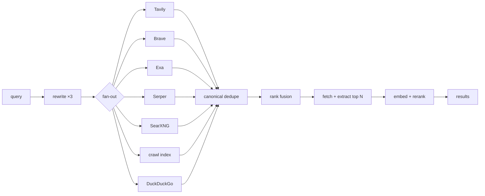
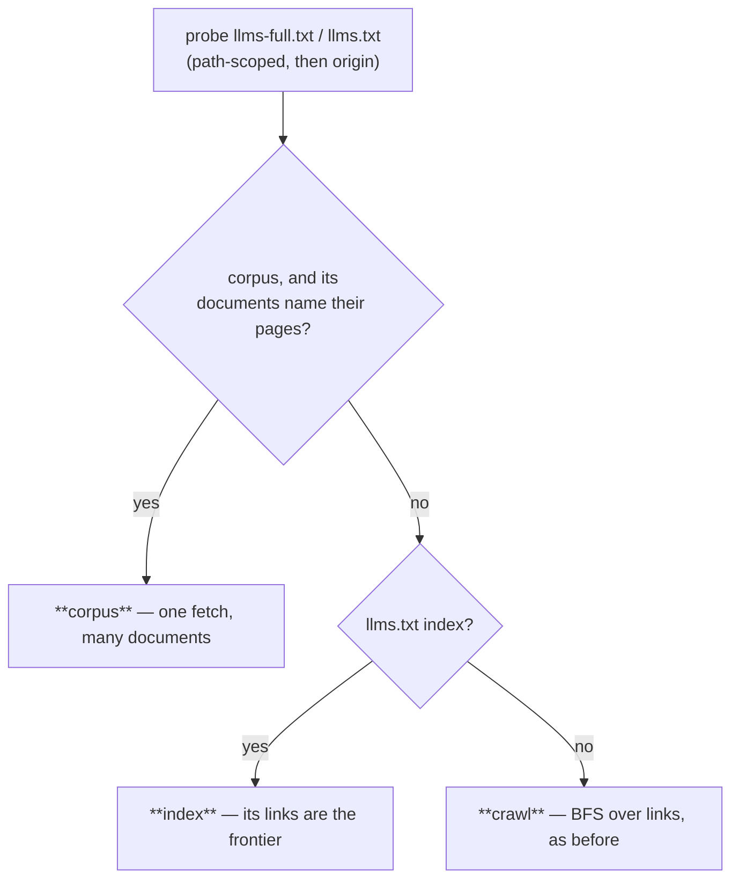

# Search

Web search for the agent and for deep research: pluggable engines, a layer of our own
on top, and a small index this node crawls for itself.

Before this module existed, the only way anything in the app found a URL on the open
web was a regex scrape of DuckDuckGo's HTML page, reachable only by deep-research
subagents. The interactive agent had no search tool at all — it could read a URL it
already knew, and that was it.

## The shape



Every engine is a `SearchProvider`: one `search(query, …)` returning ranked
`SearchResult`s. The node's own crawl index is just another one, which is what makes
"fuse local hits with live web hits" free rather than a special case.

## Engines

| Engine | Key | Notes |
| --- | --- | --- |
| Tavily | yes | Built for agents; filters and returns cleaned content. Strongest default. |
| Brave | yes | Its own index, not a Google reseller — genuinely different results, so a good fan-out partner. |
| Exa | yes | Neural/semantic. Answers "find me things *like* this" where keyword engines can't. |
| Serper | yes | Google's SERP, cheapest per query, no extraction (we extract ourselves anyway). |
| SearXNG | no | Self-hosted metasearch over 70+ engines. Keyless, private, no per-query cost. |
| Focused index | no | This node's own crawl. Instant, free, covers only seeded sites. |
| DuckDuckGo | no | An HTML scrape. The zero-config fallback, dropped from the fan-out as soon as anything better is configured. |

**Nothing needs configuring.** With no keys and no SearXNG the fallback answers, so
search works on a fresh install.

### Keys live in a connector, never in settings

`GET /api/settings` hands the whole settings bag to the browser, so an API key can
never be a setting. Keys go in the **Web Search connector** on the home page —
Fernet-encrypted in `secrets.db` under `search:<provider>`, never returned to the
browser. One connector holds all four, because a connector's `id` must equal its
agent-tool prefix and four connectors would mean four tool groups for one capability.

Environment variables win over stored keys (`SEARCH_TAVILY_API_KEY` and friends); a
pinned field says so and discards what you type rather than storing a value that will
never be read.

The engine *choice* is an ordinary setting (`search.provider`) — a vendor's name is
public. Only the key is secret.

### SearXNG is supported, not bundled

SearXNG is AGPL-3.0 and a full uwsgi service, so it is never vendored — the same call
this repo made for PyMuPDF (in favour of pypdf) and SingleFile. Run your own:

```bash
docker run -d -p 8888:8080 --name searxng searxng/searxng
```

then set `search.searxngUrl` to `http://localhost:8888`.

**Then enable JSON output**, which is off by default and is the single most common
reason the provider returns nothing: add `json` to `search.formats` in the instance's
`settings.yml` and restart it. A JSON-disabled instance answers HTML with a 200, so
the failure looks like "no results" — the provider detects this and says so instead.

## Two entry points

`quick_search` is the fan-out and fusion only, and returns in well under a second.
`deep_search` adds query rewriting, page fetching and reranking, and takes 2–8s.

That split is a latency contract, not a quality knob. An eight-second tool call in the
middle of a chat turn is unusable, so the interactive agent gets `search.web` (quick)
by default and research subagents get the deep path.

The `search` group is scoped to `main` and **`researcher`** (see
[agent-chat](agent-chat.mdx)). The latter is not optional decoration: the Web Ops
workspace docks this module's panel *and* opens as `researcher`, so without it the
agent sitting beside the search results could not run a search itself.

## Ranking

Fusion is **rank-based** (Reciprocal Rank Fusion, `search/fusion.py`), never
score-based. Tavily's `0.83`, Exa's `0.83` and a cosine distance from our own index
are three different units; averaging them is arithmetic on incomparable numbers. Ranks
are all the lists have in common — and a page several independent engines agree on
accumulates from each, which is why fusion beats any single engine.

The same module backs the library's hybrid text+CLIP search, which needed it first.

The embedding rerank **refuses to run on hash-fallback vectors**. When the embedding
provider is down, `get_embeddings` degrades to a deterministic hash; cosine over those
is noise that would actively worsen a ranking that was fine without it.

## Egress

Three legs, three different rules. This is the easiest thing here to get wrong:

| Traffic | Path |
| --- | --- |
| Vendor APIs (`api.tavily.com`, …) | plain `httpx`, hardcoded hostnames — not attacker-influenced, same as every connector |
| SearXNG base URL | plain `httpx`, **loopback allowed** — trusted because it comes from a setting; never from model output |
| Every result URL, every crawled URL | `_fetch_guarded` — a search engine can return *any* URL, so this leg is the SSRF sink |

## The focused crawler

A deliberately small crawl of sites you read constantly — framework docs, a few ML
blogs, an API reference. General web indexing loses to a search API below roughly 60M
queries/month; a curated corpus wins on the axis APIs are worst at: instant, free per
query, and complete for the handful of sites that matter to you.

Seeds ship in `backend/modules/search/crawl/seeds.json` — 22 of them: the Hugging Face
stack (Transformers, Datasets, TRL, PEFT, Accelerate, Hub), PyTorch, JAX, scikit-learn,
NumPy, pandas, Python, FastAPI, LanceDB, the Claude API, OpenAI, Google ADK, Ollama,
MDN, Distill, Karpathy and Lil'Log. Add your own via `POST /api/search/seeds`.

## Three ingest paths, in order of preference

Most modern doc sites publish their own machine-readable index, and taking it is
strictly better than following links: it is the pages the publisher *considers*
documentation, with no crawl-depth guesswork and no `/genindex` to deny-pattern away.
`crawl/llmstxt.py` probes for both files and the crawler falls through:



Which one ran is reported as `source` on the crawl stats, so a seed that silently fell
back to BFS is visible rather than inferred.

### Path-scoped before origin-rooted

The convention puts these files at the origin. The web disagrees often enough that both
are probed, scoped path first: `huggingface.co/docs/transformers/llms.txt` is 726
curated links while `huggingface.co/llms.txt` is a 404, and `docs.claude.com` is the
exact reverse. Taking the origin file first would index the wrong product on every
multi-product host.

### A corpus must name its pages

`llms-full.txt` is the whole corpus in one file — one conditional GET replaces two
hundred, and an unchanged corpus is a single **304 for the entire seed**. But it is only
usable as *content* when its sections carry source URLs (a `Source:` line, a bare URL
under the heading, or a linked heading; `docs.ollama.com` does this for 53 of its 65
sections).

Without them every chunk would share one URL — and since chunks are grouped back into
pages by URL and `canonical_url` drops fragments, the whole corpus would collapse into a
single search hit that opens a multi-megabyte text file instead of the page that
answered the question. Below half attributable, the corpus is discarded and the index
path runs instead. Google's ADK corpus is 229 sections with **zero** source URLs, so
this fallback is what makes that site indexable at all.

A corpus over 8 MB is also refused: `docs.claude.com/llms-full.txt` is 25 MB, roughly
25,000 chunks for one seed, and its `llms.txt` index honours `max_pages` instead.

### Curated links skip the deny patterns

Deny patterns exist to keep *link-following* out of junk. A publisher's own index
contains none by construction, and applying them anyway breaks a real case: Hugging
Face's index links pinned `/docs/transformers/v5.14.0/…` URLs, which the seed's
`/v[0-9]` pattern would reject — discarding all 726 entries. Domain and allow patterns
still apply, so an index cannot drag the crawl off-site.

Those links are also `.md` twins, which trafilatura extracts *nothing* from — it parses
HTML. A body that doesn't look like HTML is therefore indexed as the markdown it is,
headings and all.

## Versioned docs

A docs URL is not a version claim: `huggingface.co/docs/transformers/index` serves
whatever is current. So a seed declares its **package** instead, and the crawl asks the
registry what the latest stable release is before writing a single page:

```json
{ "id": "huggingface-trl", "package": { "registry": "pypi", "name": "trl" } }
```

`pypi`, `npm` and `github` are supported (a GitHub *draft* release is rejected — it
names a tag nobody can install). The resolved version is stored on `crawl_seeds`, on
each `crawl_pages` row, and in every `webindex` chunk's metadata. Seventeen of the 22
built-in seeds declare one; the rest (Python, MDN, the blogs) genuinely have no package.

### A version change defeats both skip levels

The cheap paths compare content, and a page whose text didn't change would otherwise
keep chunk metadata naming the previous release — and then vanish from a
version-filtered search. So when the resolved version differs from what a page holds,
the conditional headers are **withheld** (a 304 returns no body to reindex) and the
hash comparison is skipped.

Compared by `major.minor`, not exact version: docs are written per series, and
comparing patch versions would re-embed two hundred pages for every point release. A
seed with no package resolves no version and never restales, so its crawls are
byte-for-byte what they were before.

### What's installed here beats what's latest

A doc answer that disagrees with the user's installed package is worse than no answer —
it reads as authoritative and is wrong in a way that costs a debugging session. So
`versions.installed_versions` reads `*.dist-info` metadata from the backend env and from
every [training](./training.mdx) project venv (on disk, not by spawning an interpreter),
and crawl hits describing a series you don't have are **demoted**.

Demoted, not excluded, and only slightly: docs for an adjacent release are usually still
right. And nothing installed is *no signal*, not a mismatch — penalizing docs for a
package you haven't installed yet would bury exactly the docs you read before installing
it. Fusion downstream is rank-based, so reordering within this provider's list is the
whole of the lever; the score never leaves the provider.

### Re-crawls are nearly free

Three escalating levels of "nothing to do":

1. the server answers **304** to our `If-None-Match` — no body transferred, no
   extraction, no embedding;
2. the body came back but its **content hash is unchanged** — no embedding, which is
   the expensive half;
3. only a genuine change costs chunking, embedding and a write.

Measured on the Karpathy blog seed: a first crawl indexed 25 pages / 1388 chunks; the
re-crawl checked all 25, got 21 × 304 and 4 unchanged, and wrote **nothing**.

The hash is of the *extracted text*, not the HTML — docs sites embed build ids and
rotating banners in their markup, so hashing HTML would report a change every time and
defeat the whole thing.

The frontier is seeded from previously-indexed URLs as well as the start URLs. Without
that, a re-crawl checks exactly one page: the start page answers 304, so there is no
HTML to extract links from, and everything else goes unnoticed forever.

### Politeness

`robots.txt` honoured via stdlib `urllib.robotparser` (including `Crawl-delay`, which
can raise the configured delay but never lower it), one in-flight request per host, an
honest contactable User-Agent, and a global concurrency cap.

### Where the index lives

A dedicated `webindex` LanceDB collection, **not** a user library — twenty thousand
crawled chunks in `default` would swamp every `library.search` and pollute the source
catalog. A `webindex.meta.json` sidecar records the embedding model and vector width,
because a collection's width is fixed at creation: a crawl started while the embedder
was down would otherwise pin it to hash vectors permanently.

Writes are batched **across pages**, not per page. `upsert_documents` is a whole-table
`merge_insert` costing ~1.5s per call regardless of batch size, so flushing per page
would spend five minutes in Arrow to index two hundred pages.

### Known cost

The task queue is a single serial worker, so a crawl holds up other background work
(library ingests) for the few minutes it runs. Accepted rather than worked around: a
crawl's durability already lives in `crawl_pages`, and a second worker pool would buy
concurrency at the price of a whole scheduler.

No JavaScript rendering. A Playwright crawl is roughly 100× the cost per page; JS-only
docs sites simply don't index.

## Agent tools

Five, under the `search` group. Group size is context budget, so crawl *seed
management* is an HTTP/UI concern and deliberately absent — the agent can start a
crawl, not curate one.

| Tool | Use |
| --- | --- |
| `search.web` | The default. Fast, fans out across every configured engine. |
| `search.deep` | Rewrites, reads pages, reranks. Seconds — for when the cheap search came back thin. |
| `search.read` | One URL as extracted article text (cached). |
| `search.index` | The local crawl index only. Empty means "not in the index", never "not on the web". |
| `search.crawl` | Re-crawl a seed. Side-effecting, minutes long. |

The group's catalog blurb comes from the Web Search connector rather than a duplicate
entry in the orchestrator, and `backend/modules/connectors/guides/search.md` is the
SKILL.md-style guide delivered when the group loads.

## Caching

Cached at the **provider-call** level (`search_cache`, 60min) rather than per
pipeline invocation — that is what makes 3× query fan-out and overlapping research
subagents cheap. Extracted page text is cached separately (`search_page_cache`, 24h),
which stops five subagents in one run each re-downloading the same article.

Both are pure caches: a miss is always correct, and any failure degrades to doing the
work.

## HTTP

| Route | Purpose |
| --- | --- |
| `POST /api/search/query` | Run the pipeline (`depth: quick\|deep`) |
| `GET /api/search/providers` | Which engines exist, which can run, and why the rest can't |
| `POST /api/search/read` | Extract one URL |
| `POST /api/search/index/query` | Local index only |
| `GET/POST /api/search/seeds`, `DELETE /api/search/seeds/{id}` | Crawl seeds (a seed carries `package`, `prefer_llms_txt`, `llms_txt_url`, `llms_full_url`; the response carries the resolved `version`) |
| `POST /api/search/crawl` | Enqueue one seed, or every seed that's due |
| `GET /api/search/crawl/status` | Seeds + index status |
| `POST /api/search/cache/clear` | Empty both caches |

Reads are POSTs because a query is user text, and a query string is the one place it
must not go — URLs land in logs, referrers, and the observability panel's `target`.

Live crawl progress streams on the **`crawl`** `/ws` channel (`seed`, `progress`
throttled to ~2 Hz, `page`). Control is HTTP-only, so the channel is push-only.

## Plugins

`host.add_search_provider(provider)` (see
[backend plugin SDK](../architecture/backend-plugin-sdk.mdx)) contributes an engine
that joins the same fan-out and fusion as the built-ins. Reusing a built-in's `id`
overrides it.

## See also

- [Research](research.mdx) — the deep-research pipeline that consumes this
- [Library](library.mdx) — the knowledge base and its RRF-fused hybrid search
- [Browser](browser.mdx) — the SSRF guard every result URL goes through
- [Connectors](connectors.mdx) — where the API keys live
