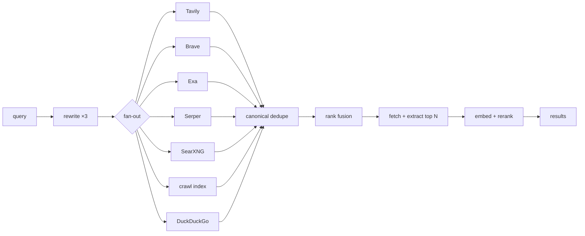

# Search

Web search for the agent and for deep research: pluggable engines, a layer of our own
on top, and a small index this node crawls for itself.

Before this module existed, the only way anything in the app found a URL on the open
web was a regex scrape of DuckDuckGo's HTML page, reachable only by deep-research
subagents. The interactive agent had no search tool at all — it could read a URL it
already knew, and that was it.

## The shape



Every engine is a `SearchProvider`: one `search(query, …)` returning ranked
`SearchResult`s. The node's own crawl index is just another one, which is what makes
"fuse local hits with live web hits" free rather than a special case.

## Engines

| Engine | Key | Notes |
| --- | --- | --- |
| Tavily | yes | Built for agents; filters and returns cleaned content. Strongest default. |
| Brave | yes | Its own index, not a Google reseller — genuinely different results, so a good fan-out partner. |
| Exa | yes | Neural/semantic. Answers "find me things *like* this" where keyword engines can't. |
| Serper | yes | Google's SERP, cheapest per query, no extraction (we extract ourselves anyway). |
| SearXNG | no | Self-hosted metasearch over 70+ engines. Keyless, private, no per-query cost. |
| Focused index | no | This node's own crawl. Instant, free, covers only seeded sites. |
| DuckDuckGo | no | An HTML scrape. The zero-config fallback, dropped from the fan-out as soon as anything better is configured. |

**Nothing needs configuring.** With no keys and no SearXNG the fallback answers, so
search works on a fresh install.

### Keys live in a connector, never in settings

`GET /api/settings` hands the whole settings bag to the browser, so an API key can
never be a setting. Keys go in the **Web Search connector** on the home page —
Fernet-encrypted in `secrets.db` under `search:<provider>`, never returned to the
browser. One connector holds all four, because a connector's `id` must equal its
agent-tool prefix and four connectors would mean four tool groups for one capability.

Environment variables win over stored keys (`SEARCH_TAVILY_API_KEY` and friends); a
pinned field says so and discards what you type rather than storing a value that will
never be read.

The engine *choice* is an ordinary setting (`search.provider`) — a vendor's name is
public. Only the key is secret.

### SearXNG is supported, not bundled

SearXNG is AGPL-3.0 and a full uwsgi service, so it is never vendored — the same call
this repo made for PyMuPDF (in favour of pypdf) and SingleFile. Run your own:

```bash
docker run -d -p 8888:8080 --name searxng searxng/searxng
```

then set `search.searxngUrl` to `http://localhost:8888`.

**Then enable JSON output**, which is off by default and is the single most common
reason the provider returns nothing: add `json` to `search.formats` in the instance's
`settings.yml` and restart it. A JSON-disabled instance answers HTML with a 200, so
the failure looks like "no results" — the provider detects this and says so instead.

## Two entry points

`quick_search` is the fan-out and fusion only, and returns in well under a second.
`deep_search` adds query rewriting, page fetching and reranking, and takes 2–8s.

That split is a latency contract, not a quality knob. An eight-second tool call in the
middle of a chat turn is unusable, so the interactive agent gets `search.web` (quick)
by default and research subagents get the deep path.

## Ranking

Fusion is **rank-based** (Reciprocal Rank Fusion, `search/fusion.py`), never
score-based. Tavily's `0.83`, Exa's `0.83` and a cosine distance from our own index
are three different units; averaging them is arithmetic on incomparable numbers. Ranks
are all the lists have in common — and a page several independent engines agree on
accumulates from each, which is why fusion beats any single engine.

The same module backs the library's hybrid text+CLIP search, which needed it first.

The embedding rerank **refuses to run on hash-fallback vectors**. When the embedding
provider is down, `get_embeddings` degrades to a deterministic hash; cosine over those
is noise that would actively worsen a ranking that was fine without it.

## Egress

Three legs, three different rules. This is the easiest thing here to get wrong:

| Traffic | Path |
| --- | --- |
| Vendor APIs (`api.tavily.com`, …) | plain `httpx`, hardcoded hostnames — not attacker-influenced, same as every connector |
| SearXNG base URL | plain `httpx`, **loopback allowed** — trusted because it comes from a setting; never from model output |
| Every result URL, every crawled URL | `_fetch_guarded` — a search engine can return *any* URL, so this leg is the SSRF sink |

## The focused crawler

A deliberately small crawl of sites you read constantly — framework docs, a few ML
blogs, an API reference. General web indexing loses to a search API below roughly 60M
queries/month; a curated corpus wins on the axis APIs are worst at: instant, free per
query, and complete for the handful of sites that matter to you.

Seeds ship in `backend/modules/search/crawl/seeds.json` (PyTorch, Transformers,
scikit-learn, NumPy, JAX, pandas, FastAPI, LanceDB, Claude API, Ollama, MDN, Distill,
Karpathy, Lil'Log). Add your own via `POST /api/search/seeds`.

### Re-crawls are nearly free

Three escalating levels of "nothing to do":

1. the server answers **304** to our `If-None-Match` — no body transferred, no
   extraction, no embedding;
2. the body came back but its **content hash is unchanged** — no embedding, which is
   the expensive half;
3. only a genuine change costs chunking, embedding and a write.

Measured on the Karpathy blog seed: a first crawl indexed 25 pages / 1388 chunks; the
re-crawl checked all 25, got 21 × 304 and 4 unchanged, and wrote **nothing**.

The hash is of the *extracted text*, not the HTML — docs sites embed build ids and
rotating banners in their markup, so hashing HTML would report a change every time and
defeat the whole thing.

The frontier is seeded from previously-indexed URLs as well as the start URLs. Without
that, a re-crawl checks exactly one page: the start page answers 304, so there is no
HTML to extract links from, and everything else goes unnoticed forever.

### Politeness

`robots.txt` honoured via stdlib `urllib.robotparser` (including `Crawl-delay`, which
can raise the configured delay but never lower it), one in-flight request per host, an
honest contactable User-Agent, and a global concurrency cap.

### Where the index lives

A dedicated `webindex` LanceDB collection, **not** a user library — twenty thousand
crawled chunks in `default` would swamp every `library.search` and pollute the source
catalog. A `webindex.meta.json` sidecar records the embedding model and vector width,
because a collection's width is fixed at creation: a crawl started while the embedder
was down would otherwise pin it to hash vectors permanently.

Writes are batched **across pages**, not per page. `upsert_documents` is a whole-table
`merge_insert` costing ~1.5s per call regardless of batch size, so flushing per page
would spend five minutes in Arrow to index two hundred pages.

### Known cost

The task queue is a single serial worker, so a crawl holds up other background work
(library ingests) for the few minutes it runs. Accepted rather than worked around: a
crawl's durability already lives in `crawl_pages`, and a second worker pool would buy
concurrency at the price of a whole scheduler.

No JavaScript rendering. A Playwright crawl is roughly 100× the cost per page; JS-only
docs sites simply don't index.

## Agent tools

Five, under the `search` group. Group size is context budget, so crawl *seed
management* is an HTTP/UI concern and deliberately absent — the agent can start a
crawl, not curate one.

| Tool | Use |
| --- | --- |
| `search.web` | The default. Fast, fans out across every configured engine. |
| `search.deep` | Rewrites, reads pages, reranks. Seconds — for when the cheap search came back thin. |
| `search.read` | One URL as extracted article text (cached). |
| `search.index` | The local crawl index only. Empty means "not in the index", never "not on the web". |
| `search.crawl` | Re-crawl a seed. Side-effecting, minutes long. |

The group's catalog blurb comes from the Web Search connector rather than a duplicate
entry in the orchestrator, and `backend/modules/connectors/guides/search.md` is the
SKILL.md-style guide delivered when the group loads.

## Caching

Cached at the **provider-call** level (`search_cache`, 60min) rather than per
pipeline invocation — that is what makes 3× query fan-out and overlapping research
subagents cheap. Extracted page text is cached separately (`search_page_cache`, 24h),
which stops five subagents in one run each re-downloading the same article.

Both are pure caches: a miss is always correct, and any failure degrades to doing the
work.

## HTTP

| Route | Purpose |
| --- | --- |
| `POST /api/search/query` | Run the pipeline (`depth: quick\|deep`) |
| `GET /api/search/providers` | Which engines exist, which can run, and why the rest can't |
| `POST /api/search/read` | Extract one URL |
| `POST /api/search/index/query` | Local index only |
| `GET/POST /api/search/seeds`, `DELETE /api/search/seeds/{id}` | Crawl seeds |
| `POST /api/search/crawl` | Enqueue one seed, or every seed that's due |
| `GET /api/search/crawl/status` | Seeds + index status |
| `POST /api/search/cache/clear` | Empty both caches |

Reads are POSTs because a query is user text, and a query string is the one place it
must not go — URLs land in logs, referrers, and the observability panel's `target`.

Live crawl progress streams on the **`crawl`** `/ws` channel (`seed`, `progress`
throttled to ~2 Hz, `page`). Control is HTTP-only, so the channel is push-only.

## Plugins

`host.add_search_provider(provider)` (see
[backend plugin SDK](../architecture/backend-plugin-sdk.mdx)) contributes an engine
that joins the same fan-out and fusion as the built-ins. Reusing a built-in's `id`
overrides it.

## See also

- [Research](research.mdx) — the deep-research pipeline that consumes this
- [Library](library.mdx) — the knowledge base and its RRF-fused hybrid search
- [Browser](browser.mdx) — the SSRF guard every result URL goes through
- [Connectors](connectors.mdx) — where the API keys live
