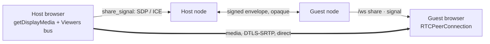

# Module: share

Put another person inside this workspace.

The app can already put two people on the same **pane** — that is the
[`collab` channel](network.mdx#collaborative-shared-panes): one document,
rev-checked last-writer-wins, addressed to a person through the roster. What it
could not do is put two people in the same **session**, and it could not show
anything at all to somebody who has never installed it.

`share` is both, because they serve different people. A **friend on the fabric**
gets the high-fidelity, interactive thing. A **stranger with a link** gets a video
stream and a chat box with no setup at all. One module, two egress paths off one
origin.

**Status: Phases 1-6 implemented** (Phase 6 partially — see below) — the session, the permission model, the
**semantic mirror**, the **pixel stream** between friends, and the **public link**.
A host opens a session, invites friends by person, moves each guest along a grant
ladder that every guest action is checked against, and a guest sees a live
redacted map of the host's workspace and — when the host starts a capture — their
actual screen. Anyone else can be handed a URL that plays in a plain browser with
no install and no account, served by the
[share relay](../architecture/share-relay.mdx). Guest actions are wired to real
capabilities through two gates, and everything a guest does — or was refused —
is written down where the host can read it.

## Contributions to the layout shell

- **Panels:** `share.session` (role `tool`, singleton, right dock at 340px) —
  the host's control surface. It is a *permission* surface, not a video one; see
  [why that ordering](#why-the-pane-is-a-permission-surface). `share.mirror`
  (role `document`, singleton) — the guest's window onto the host's workspace.
- **Commands:** `share.open`, `share.openMirror`, `share.start`, `share.stop`,
  `share.stopScreen`, `share.revokeAll` ("Share: Drop every guest to view-only" —
  phrased as what it does, because somebody reaching for it in the palette is in a
  hurry).
- **Keybindings:** none. Nothing here should be one keystroke away.
- **Neither share pane declares `share`**, so neither ever appears in a
  projection. A guest looking at the host's own grant controls would be the
  module leaking itself.

## The grant ladder

Friendship grants **reachability, not authority** — the same rule
[`agent.ask_peer`](agent-chat.mdx) already enforces. Being trusted enough to reach
this node says nothing about what you may do inside a session on it, so every
guest action passes `gate.require` before it touches anything.

```
view  →  cursor  →  edit  →  terminal  →  agent  →  control
```

| Rung | What it buys |
|---|---|
| `view` | See shared panes. Change nothing. **The rung every guest joins at.** |
| `cursor` | Also show their pointer and selection. |
| `edit` | Edit panes that support collaborative editing. |
| `terminal` | Run commands — subject to your own agent permission rules. |
| `agent` | Drive your agent — subject to your own agent permission rules. |
| `control` | Full control. Grant only to someone you would hand the keyboard. |

A participant sits at exactly **one** rung, and a rung answers every capability
question below it. A ladder rather than a grid of independent flags on purpose:
the interesting failure here is granting `terminal` to somebody you meant to give
`edit`, and an ordered ladder makes "more than I meant" visible at a glance
instead of hiding it in a checkbox matrix.

Three rules that are bugs if forgotten:

- **An unknown rung reads as the weakest.** A peer on a newer build can name a
  rung this one has never heard of, and the safe reading of "something I do not
  understand" is `view`, never `control`.
- **`terminal` and `agent` carry no permission logic of their own.** They hand off
  to `backend/modules/agent/permissions.py`, so a guest can never exceed what the
  host's own agent rules allow. One gate, not two — a second, laxer implementation
  of "may this run?" is exactly where the gap appears.
- **A public-URL viewer holds no rung at all.** Relay viewers are not participants
  and never enter a session's roster, so there is nothing for `require()` to be
  reached on their behalf with. Interactivity requires an authenticated person on
  the fabric.

`share.revoke_all` drops every guest back to `view` in one move without ending the
session: the panic button should not dump anybody out mid-sentence, it should just
mean nothing anyone holds can still act.

### The agent can take rights away, never hand them out

`share.grant` is deliberately **not** an agent tool, while `share.revoke_all` is.
Raising a guest to `terminal` is a decision about how much of your machine
somebody else gets, and a model that can make it from a sentence is a model that
can be talked into making it. The asymmetry is the design.

## The semantic mirror

A guest sees a **map of the host's workspace**, not a copy of it, and that
distinction is load-bearing. A pane component renders *local* data, so seeding the
host's `FrameState` into a guest's dashboard would open that guest's own editor
and their own terminal, arranged like the host's — a layout copy wearing a
mirror's clothes, and a dangerous thing to put in front of somebody who has been
told they are looking at another person's screen. So each tile states exactly what
is known: which pane is there, whether it is shared, and whether the host is
looking at it. Content arrives per pane type — a `collab` pane already has a
protocol for it, and the video stream drops into this same pane next phase.

### Deny by default

A pane is shared only if it declares `share` in its manifest
([`PaneShareDecl`](../architecture/plugin-sdk.mdx)):

| `mode` | Guest sees |
|---|---|
| *(absent — the default)* | **A redacted tile.** The pane exists and takes up this much room. That is all. |
| `collab` | Live and editable through the pane's existing collab room. |
| `mirror` | Live, read-only, structured. |
| `pixels` | Visible only in the video stream. |

Declared so far: `scratch.note` (`collab` — it already had a room, so a guest gets
real editable content for free), plus `editor.buffer`, `terminal.instance` and
`agent.chat` (`mirror`). Everything else — `settings`, `connectors`, the database
console, and every pane written next year that forgets to declare — is redacted
with no further work.

`params` are a **second** allowlist: declaring a pane shareable does not declare
its params shareable, because params are routinely where the sensitive part lives
(a file path, a URL, a row id). A pane gets no params at all unless it names keys.

### Where redaction happens, and why there

In the **host's own browser**, before anything reaches the wire. That is the only
place it can be:

- The **backend cannot** do it. Pane declarations live in the frontend registry,
  so the server has no idea what `editor.buffer` is or whether it may be shared.
  It holds the projection opaquely and never reinterprets it — a backend that
  reached in to help would be a second authority on a decision that already has
  one.
- The **guest's browser must not** do it. That is the untrusted end, and asking
  it to hide things is asking the wrong machine.

So an undeclared pane is not merely *unrendered* by the guest: its view id, its
params and its instance title never leave the host.

One trap worth stating, because it was a real bug the tests caught: a pane's
**instance id encodes its view id** (`editor.buffer#3`). Dropping the `viewId`
field while forwarding the id leaves the view id in the payload anyway, in the one
field that looks like plumbing. Redacted panes therefore carry a hashed stand-in,
and `focusedInstanceId` and `activeTool` are mapped through the same table — the
host is often looking at a pane the guest cannot see.

### What a redacted tile may say

The module's **manifest** title — "Editor", "Settings" — never the instance title.
A manifest title comes from the registry and so can never be a filename, a URL or
a row id; an instance title very much can. The layout stays legible without the
title leaking anything, and the guest is told the count outright ("3 hidden")
rather than left to wonder about unexplained gaps.

Split geometry is preserved exactly, so "the pane on the left" means the same
thing to both people. The backdrop is dropped (a backdrop ref can carry a
wallpaper path), and so is `presentedInstanceId`, which is not serialized anywhere
else either.

### Traffic

The host publishes on layout change, and two things keep that sane — both
comparing the **projection**, never the frame:

- Nothing is sent when the redacted view is unchanged. The common case — the host
  typing inside a pane, or working entirely in panes the guest cannot see —
  produces no traffic at all.
- Changes coalesce to at most one send per 400ms, leading edge plus a trailing
  one. A purely trailing throttle makes every change feel late; a purely leading
  one drops the final position of a drag, which is the one that matters.

The host is told what they are exposing: the session pane shows
"1/4 panes visible", counted by the host's own browser and sent alongside the
projection. A redaction model nobody can audit from the outside is a redaction
model nobody trusts — and it is also the check the pixel phase needs before it
can start a stream. The count is **counted by the sender**, never derived on the
server: the backend holds the projection opaquely, and a server that walks its
tree to count panes is one refactor from a server that filters them.

Publishing is bound to the **session**, not to a pane: a host who never opens the
share pane is still hosting. A joining guest is handed the stored projection
immediately and the host republishes on their arrival, so the first thing they see
is current rather than however stale the last layout change left it.

## The pixel stream

The host's **browser** is the single media origin. `getDisplayMedia()` captures
the dashboard once, and that one `MediaStream` is what every guest receives. The
nodes carry SDP and ICE and nothing else.



**Why the nodes never touch the media.** Routing pixels through Python would mean
a browser-to-node leg, a node-to-node leg and PyAV in the middle — two hops and a
near-certain re-encode of a stream the browser has already encoded. The fabric is
excellent at exactly one thing here: delivering a signed, authenticated,
person-addressed message to a machine that is already trusted. So it carries the
handshake, and `share_signal` stays the documented pass-through it was built as in
Phase 1.

It is a **mesh, not a broadcast**: the host holds one `RTCPeerConnection` per
guest and sends the same track down each. That is the right shape for the handful
of people in a workspace session and the wrong shape for an audience — which is
what the relay in Phase 4 is for, and why `rtc.ts` has no fan-out logic to grow
into one.

### The pre-flight check

**A video frame does not know what a pane is.** The semantic mirror can withhold a
pane because it forwards structure and can omit it; a capture forwards *light*, so
every pane the host can see is in the stream whether or not it was declared.

So the guarantee changes shape between the two modes, and the pre-flight exists to
say so before the capture starts rather than after. It lists the **visible** panes
that never declared themselves shareable, by name, and blocks until the host
either closes them or explicitly chooses to share anyway.

Two rules keep the warning trustworthy:

- **Any declaration counts, not only `mode: 'pixels'`.** A pane declaring `collab`
  or `mirror` has already agreed to be seen; being in the video too tells a guest
  nothing new. Reading `pixels` as a stricter permission would flag every shared
  pane in the workspace and train the host to click through.
- **Only panes actually on screen are checked** (`visiblePanes`). A background tab
  and a minimized window are not in the light, and a warning with false positives
  is one people learn to dismiss.

This is a warning, not a boundary. `redactFrame` enforces; `preflight` explains.
Saying otherwise would be the most dangerous thing this module could do.

### Capture support is probed, then checked against the shell

Display capture does not split along the `Capability` service's browser/desktop
line: it works in a browser, works in Tauri on Windows (WebView2 shows its **own**
native picker — no Rust-side handler is needed) and on Linux (WebKitGTK from
2.42), and is broken in WKWebView on macOS. A flat per-host list would have to
claim one answer for "desktop" and be wrong on one platform, so `capture.ts`
feature-detects the exact API it is about to call rather than standing a
`window.__TAURI__` check in for it.

The probe reports **four** states, the hardware module's rule: available,
unavailable, `insecure-context`, or `unsupported-shell`. The `insecure-context`
state is real and distinct — a page served over plain HTTP off localhost has no
`mediaDevices` at all, and reporting that as "your browser cannot do this" blames
the browser for an origin problem.

`unsupported-shell` exists because feature detection has exactly one blind spot,
and macOS sits in it. **WKWebView exposes `getDisplayMedia` and then rejects it**
with `NotAllowedError` — the same error, indistinguishable, that the host produces
by dismissing the picker. So the API detects as present, the call fails, and
`startStream` stays silent because it is right to read that error as a cancel:
click Share screen, nothing happens, no message anywhere. Nothing observable from
the page separates the two, so the shell asserts it instead — the
`media.displayCapture` capability is granted by `desktopCapabilities(platform)`
everywhere except the macOS desktop, and the probe checks it **before** believing
the API. Moving that check after the feature detection silently restores the bug.

Every state carries a sentence, and the pane renders it as **visible text**, not
just the button's `title`: a tooltip never appears on a touch device, is never
read aloud, and cannot be seen at all on the disabled button most people look at.

A dismissed picker is likewise **not an error**: `CaptureError.cancelled` tells a
deliberate cancel apart from a real refusal, so the UI stays quiet about the first
and loud about the second.

### What the viewers hear

A **`Viewers` bus** in the [audio mixer](audio.mdx), whose output is a
`MediaStreamDestination` instead of a device. "What the viewers hear" is then an
ordinary column in the matrix: karaoke to the viewers but not to your headphones,
or your microphone to both, are one checkbox each — which is precisely the
VoiceMeeter-shaped problem the audio module exists to solve.

It starts with **nothing routed to it**, the same rule `addBus` follows and for a
stronger reason: this output is another person's ears, and defaulting it to carry
whatever the host is playing would make starting a screen share silently broadcast
their music and their notifications. The share pane says so, so silence reads as a
choice rather than a bug.

The bus deliberately has **no `<audio>` element** — this is what other people hear,
and playing it locally too would double every sound the host is already listening
to and echo their own microphone back at them.

`getDisplayMedia({audio:true})` is requested as well, but never required: it yields
tab or system audio on Chromium and nothing at all elsewhere, so treating it as
mandatory would break capture entirely on Firefox and Safari. The mixer bus is the
portable path; the capture's own track is a bonus when the engine offers one.

#### Two different silences

`ensureShareBus` **awaits `ensureLoaded()`** rather than assuming the mixer document
is there. Sharing a screen can be the first thing in a session to want a bus, and
nothing on that path mounts the mixer pane; returning early on an unloaded document
left the bus uncreated, so the stream went out with no audio path at all while the
pane told the host to route a strip into a bus that did not exist.

That makes the two silences distinguishable, which is the point:

| What happened | What the pane says |
| --- | --- |
| The bus exists, nothing is routed to it | "Guests hear nothing. Route a strip to the **Viewers** bus…" |
| The mixer never came up, so there is no bus | `audioFault` — "no Viewers bus to carry sound", video only |

Whether audio is flowing is read from the **routing document**
(`busHasSource`), never from the outgoing track count: a
`MediaStreamAudioDestinationNode` always carries exactly one audio track, silent or
not, so counting tracks reports every share as "screen + audio" the moment the bus
exists — a stream claiming to send sound it is not sending. A **muted** strip still
counts as routed; it is one click from audible and the mixer already shows it as
muted. The chip follows the matrix live, because routing a strip is exactly what a
host does *after* reading the hint.

### Stopping

The capture can end from four places — the pane's Stop button, the browser's own
"Stop sharing" bar, the session ending in another tab, or the agent. `stream.ts`
owns all of them, because the failure worth preventing is a stream that is
*partly* stopped: a capture released while a peer connection still claims to be
live leaves the UI confident about a picture nobody is receiving.

A guest whose host stops gets an explicit `bye` frame rather than a dropped
connection, so the pane can say "they stopped sharing" instead of leaving a frozen
frame that looks like a broken network.

## Backend surface

`backend/modules/share/`, mounted at `/api/share`.

| Route | Purpose |
|---|---|
| `GET /api/share` | Everything this node knows: what it hosts, what it has joined, live invitations |
| `POST /api/share/session` | Open a session (retitles rather than orphaning guests if one is live) |
| `DELETE /api/share/session` | Close it, telling every guest |
| `GET /api/share/invitees` | Friends who could join right now |
| `POST /api/share/invite` | Invite one **person** — every online machine of theirs |
| `POST /api/share/grant` | Move a person to a rung |
| `POST /api/share/revoke-all` | Everyone back to `view` |
| `POST /api/share/join` · `/leave` | The guest side |

The session is **process-global on the host node** (`session.py`), the same shape
as [karaoke](karaoke.mdx)'s and [hassault](hassault.mdx)'s: the server owns intent
and every client is a renderer. Every mutation bumps a `revision` and rebroadcasts
the whole state, so a second tab, a phone on the LAN and the agent with no pane
open all see the same thing without any of them owning it — and a client drops an
out-of-order broadcast instead of showing a participant list that jumps backwards.

A node hosts **at most one session**. That is a limit, not a stub: a session
mirrors *this node's workspace*, and there is only one of those — a second
concurrent session would be the same thing with a different guest list, which is a
grant list, not a session. The guest side is plural: this node may have joined
several sessions hosted elsewhere.

### The `/ws` `share` channel

| Direction | Event | Data |
|---|---|---|
| in | `state` | `{}` — pull the snapshot |
| in | `start` / `stop` | `{title, mode}` / `{}` |
| in | `invite` | `{personId}` |
| in | `grant` / `revoke_all` / `kick` | `{personId, grant}` / `{}` / `{nodeId}` |
| in | `join` / `leave` / `dismiss_invite` | `{sessionId, hostNode}` |
| in | `mirror` | `{frame}` — the redacted projection, passed through untouched |
| out | `remote_mirror` | `{sessionId, frame}` — a host's projection, for the mirror pane |
| in · out | `signal` | `{to, payload}` — SDP/ICE, passed through untouched |
| out | `state` · `session` · `ended` | the whole session, revision-stamped |
| out | `invite` · `joined` · `left` · `remote_session` | the guest side |
| out | `action` | a guest did something inside their rung — the audit trail |
| out | `error` | `{message}` |

Inbound mutations are dispatched with `create_task` rather than awaited: each one
dials or messages a peer, and a handler that blocks the receive loop would stall
every other channel on the same socket.

`share/signal`, `share/mirror` and `share/remote_mirror` are **excluded from the
observability recorder**
(`_SKIP_WS_EVENTS` in `telemetry/instrument.py`). The signal frame is a WebRTC SDP
blob relayed verbatim between two browsers — kilobytes of codec lines this node
never interprets — and the mirror is a few KB of structure republished on every
layout change. The rest of the `share` channel is small and genuinely useful in
the panel, which is why the existing channel-level skip would have been the wrong
instrument.

### The peer wire

`backend/modules/share/fabric.py` declares its own message types
(`share_invite`, `share_join`, `share_leave`, `share_state`, `share_end`,
`share_action`, `share_signal`, `share_mirror`, `share_error`) rather than adding them to
`network/protocol.py` — the training-ads and hassault precedent: a module owns its
own vocabulary and registers handlers for it, so adding a feature never edits the
fabric core.

Every inbound handler gates on `session.info.trusted` first. Note what that is
*not* enough for: **knowing a session id is not membership**, so a trusted friend
presenting the wrong id gets the same answer as a stranger — no such session, with
nothing confirmed about its shape.

Invitations are addressed to a **person** and fan out to every machine of theirs
that is online; you invite a human and they pick a box. An invite to an offline
machine is **held by the sender** (`_pending`) rather than lost — `peer_hub.send_to`
is a direct send with no relay in the path, so an offline friend does not mean a
queued invite somewhere, it means nothing was sent and nobody would ever find out.
It is deliberately not persisted: it expires with `INVITE_TTL` (300s), and a
session does not outlive the process hosting it.

A departing peer is swept out of the participant list by `_on_peer_event`. A guest
has no browser socket on this node, so nothing else would ever notice they left —
without the sweep they sit in the list forever, holding whatever rung they had.

`share` is advertised in `hub.capabilities()`, so a friend's UI offers only people
whose machine could actually accept. A friend on an older build is **listed but not
offerable**, rather than absent and unexplained.

## Why the pane is a permission surface {#why-the-pane-is-a-permission-surface}

The obvious first version of this module is a video tile. It is the wrong thing to
build first. What has to be right before any pixels move is that a host can see
every rung at a glance and take all of them away in one click — which is why the
grant sits on the participant row itself rather than behind a dialog, and why
anything past `edit` is drawn as a warning. "Somebody else can run commands here"
should never be a quiet row.

## Roadmap

Phases 1 to 5 ship complete. Phase 6 ships its **RTMP half**: a shared screen can
be broadcast to Twitch, YouTube Live or any RTMP server, via an ffmpeg subprocess
off the relay's existing ingest, with the stream key held in a `streaming`
connector (Fernet-encrypted in `secrets.db`, never a setting, never sent to the
browser). See [share relay](../architecture/share-relay.mdx#restreaming-to-rtmp).

Two parts of Phase 6 are deliberately **not** built, for reasons rather than time:

- **The HLS branch** — the answer to the SFU ceiling for large audiences. ffmpeg
  would segment happily, but Chrome does not play HLS natively, so serving it
  while keeping the viewer page's no-CDN promise means vendoring hls.js. That is
  a decision, not an afternoon. The RTMP path covers "broadcast to an audience"
  today by handing the problem to a platform that has already solved it.
- **TikTok** — out of reach rather than unimplemented. It has no generally
  available live-ingest API; endpoints are issued per-account through a partner
  programme.

Two limitations worth stating now rather than discovering later:

- **Pixel mode cannot redact.** A video frame does not know what a pane is, so the
  per-pane deny-by-default model protects the semantic path only. The
  [pre-flight check](#the-pre-flight-check) names the panes that would be exposed
  and blocks until the host agrees — but it is a warning, not a guarantee, and the
  semantic path is the one that is actually safe.
- **macOS desktop cannot capture at all.** WKWebView exposes `getDisplayMedia` and
  rejects it, so the shell withholds `media.displayCapture` there and the pane says
  so in visible text before the click rather than failing silently after it.
  Semantic mode works everywhere; pixel mode is browser-layout and Windows/Linux
  desktop until a native capture path lands.
- **A mesh does not scale.** One peer connection per guest means the host's
  upstream carries a copy of the stream per person. Fine for a working session,
  wrong for an audience — which is what the relay is for: the host sends **one**
  copy to it and it fans out. The relay has its own ceiling (tens of viewers per
  small machine), documented in
  [share relay](../architecture/share-relay.mdx#scaling-and-the-ceiling).

## The public link

Minting is **never implicit**. Starting a share does not create a URL, and
`share.copyLink` copies the existing one rather than making one — a command that
silently published a screen to the open internet because somebody was looking for
a link would be the most surprising thing this module could do. The pane puts it
on its own row with its own button, and an optional passphrase beside it.

Five things about the link are worth knowing:

- **The view URL is public; the ingest URL is authority.** The session model
  carries only the first, because that model is broadcast verbatim to every
  guest. Anyone holding the ingest URL could push their own video into the host's
  stream, so it is served only to the host's own browser from
  `GET /api/share/link`.
- **The relay leg fails independently.** Friends on the fabric can be watching
  happily while the relay is unreachable, so `relaying` and `relayError` are their
  own fields rather than folded into the stream's `error`. A relay that is down
  is a chip and a sentence, never a stopped share.
- **Revoking is immediate and node-side.** It works with the pane closed, after a
  tab crash, and from the agent, because the token lives on the node — and
  stopping the session revokes the link rather than leaving it to expire.
- **Minting attaches an already-running share.** Minting is deliberately
  independent of sharing, so a share is often live before a link exists. The
  relay publish used to happen only at stream start, which made the *order*
  silently decide whether the feature worked: mint-then-share published,
  share-then-mint produced a link nobody could ever watch. The host saw
  `relaying`; every viewer sat on an endless 409 "not started yet". `makeLink`
  now calls `attachRelay()`, which is a no-op when nothing is being captured.
- **The relay is polled, because nothing else reports it dying.** A successful
  WHIP POST proves the relay accepted us *once*; it is not a subscription. The
  relay keeps its registry in **one process's memory**, so a crash, an OOM kill
  or a redeploy drops every token while the host's peer connection sits there
  believing it still has a peer — WebRTC to a dead relay does not raise, it just
  stops. So `stream.ts` asks `GET /api/share/link/status` every 5s while it is
  streaming, and that route asks the relay's `GET /streams/{token}`. This is not
  hypothetical: it is what put `relaying` on the pane over a link that served
  "this link has expired" to everyone who opened it.

### The four relay states

`LinkStatusOut.state` carries four values and the pane renders all four, because
collapsing them swaps one wrong chip for another:

| state     | chip            | means                                              | the fix          |
| --------- | --------------- | -------------------------------------------------- | ---------------- |
| `live`    | `relaying`      | the relay is holding published media for this token | nothing          |
| `idle`    | `no picture`    | the token is valid, nothing is arriving             | republish        |
| `gone`    | `link dead`     | the relay answered and disowned the token           | mint a new link  |
| `unknown` | `relay unknown` | we could not ask                                    | nothing yet      |

The load-bearing distinction is **`gone` vs `unknown`**. Both look identical from
the host's side — no picture is reaching viewers either way — but they call for
opposite reactions, and a flaky hop between node and relay rendered as "your link
is dead" sends the host off to re-mint and re-share a URL that was fine all
along. `reconcileRelay` therefore leaves `relaying` **untouched** on `unknown`
rather than clearing it, in both directions: it will not resurrect a link already
known dead either. Same three-state rule the
[hardware probe](hardware.mdx) and the audio providers follow — found it, looked
and it is absent, and could not ask.

`viewers` on this route is the **relay's** watcher count, deliberately not merged
with `StreamState.peers` (fabric guests). They are different audiences and one
number would misreport both.

The mapping is a pure function in its own file (`relay-status.ts`) for the reason
`net.ts` is: `stream.ts` owns a capture, a peer connection and the audio graph,
so it cannot be imported in a unit test — and this mapping is precisely the part
that was wrong.

The relay URL is a setting (`share.relayUrl`, public — it is in every link); the
relay **key** is env-only (`SHARE_RELAY_KEY`). A node with no relay configured is
fabric-only, which is the default and a perfectly good state; minting then reports
what to configure rather than failing with a status code.

## What a guest may actually do

Every guest action passes **two** gates, in this order, and neither can be
skipped:

1. **The ladder** (`gate.require`) — is this participant on a high enough rung?
2. **The host's own permission engine** (`agent/permissions.evaluate`) — for the
   rungs that map onto tools the host's agent can also call.

Actuation happens only after both, and the audit log is written on every path
including both refusals.

`actions.py` is the whole vocabulary, and it is **deny by default**: an action
name this build has never heard of is refused rather than falling through to a
permissive base case. That is what makes it safe for a peer on a newer build to
ask for something new.

Three things here are load-bearing and quiet if wrong:

- **The `needs` rung on the wire is advisory and ignored.** The requirement comes
  from the registry, keyed by action name. Letting the caller nominate the
  permission its own action needs is letting the caller pick its own lock — a
  guest on `view` could claim their terminal command needs `view`.
- **The tool names must be the host's real ones.** `terminal.exec`, not a
  share-local spelling: that exact name is in `permissions.SHELL_TOOLS`, and that
  membership is what selects shell-aware per-subcommand rule matching and arms
  the `rm -rf` circuit breaker. A plausible near-miss like `terminal.run` would
  pass the ladder, match no host rule, skip the breakers, and read as *allowed*.
  Same for the layout tools, which are bare `open_pane`/`close_pane`.
- **`ask` stops.** When the host's rules say a tool call needs a human, the
  action is refused for now and recorded as `asked`, not `denied` — the policy
  did not refuse it, it asked for approval. Actuating on `ask` without that human
  is precisely the gap the two-gate design exists to prevent.

The `agent` rung maps onto **no tool at all**. A remote agent turn is not a tool
call; it is the path `network/agent_bridge.py` already owns and already gates, so
`agent.ask` delegates to that node's existing `network.allowRemoteAgent`
admission. A guest holding the second-highest rung on a node whose owner has not
enabled remote agents still gets nothing — a session grant is reachability, not
authority, the same rule friendship follows.

## The audit log

A grant ladder nobody can audit is a grant ladder nobody should trust. The pane
lets a host hand a friend `terminal`; the only honest way to offer that is to show
afterwards, in order, exactly what was run.

- **Denials are recorded and are the more interesting half.** A refused guest
  leaves no other trace anywhere, so a log of successes only would be silent in
  exactly the case a host wants to know about.
- **Bounded and in-memory** (the last 250 entries), cleared when the session
  ends. A session is a live thing, not a compliance record — and carrying one
  session's actions into the next would attribute them to whoever is in the room
  then.
- **Host-only.** It is broadcast on the local `/ws` channel and never over the
  fabric: one guest reading it would learn what every other guest did.
- **Cursor movement is actuated but not logged.** Otherwise the log is nothing
  but cursor rows and the terminal command that matters scrolls off the top.

## Broadcasting

A public link can be pushed onward to a platform. It sits below the link in the
pane and only appears once a link exists, because the relay restreams *that*
stream — and, like minting, it never happens implicitly: starting somebody's
public broadcast is not a side effect of anything.

The stream key never reaches the browser. It is stored in the `streaming`
connector, resolved on the node, and sent node → relay; the pane is given a label
("Twitch") and never the target URL. A node with no key stored is told which
connector to add one to, and where the provider shows it.

Revoking the link or stopping the share **stops the broadcast too** — a link that
dies while the stream carries on to Twitch is the worst possible reading of
"stop".

## Guest cursors

A guest on the `cursor` rung reports their pointer as **fractions of their
viewport**, never pixels — the two ends are different windows at different sizes,
and a pixel offset from somebody else's screen means nothing on this one. It is
throttled to ~20/s and drawn over the host's session pane with
`pointer-events: none`, so a host never finds their own clicks landing on
somebody else's pointer.

Stale cursors are dropped rather than left frozen. A guest who closes their tab
sends no goodbye, and a pointer that stopped moving three minutes ago
misrepresents where somebody is looking, which is the entire content of the
feature.

## Browser vs desktop

| | Browser | Desktop (Tauri) |
|---|---|---|
| Session, invites, grants | ✅ | ✅ |
| Semantic mirror | ✅ | ✅ |
| Pixel capture | ✅ | Windows/Linux only — WKWebView has no capture API |
| Viewers audio bus | ✅ | ✅ |

## See also

- [Distributed peer fabric](../architecture/distributed.mdx) — identity, envelopes, transports
- [Network protocol & scenarios](../architecture/network-protocol.mdx) — the lobby and the WebRTC signaling seam
- [Module: social](social.mdx) — the roster an invite is addressed through
- [Module: network](network.mdx) — the `collab` channel this builds beside
