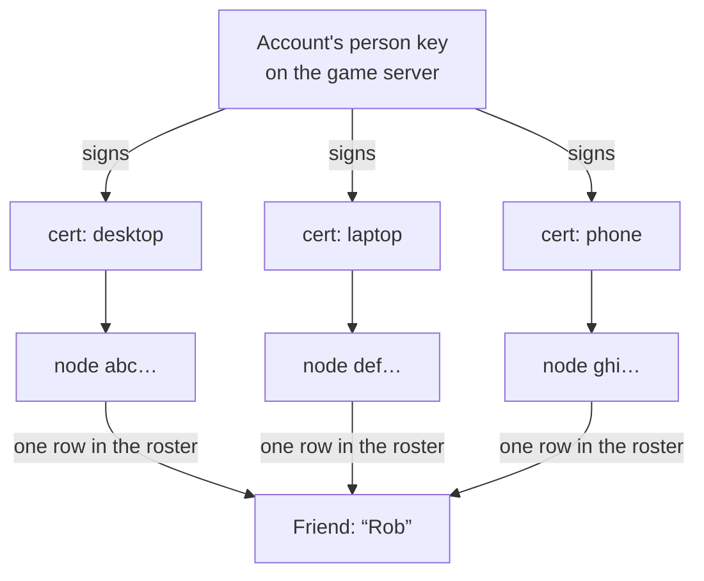
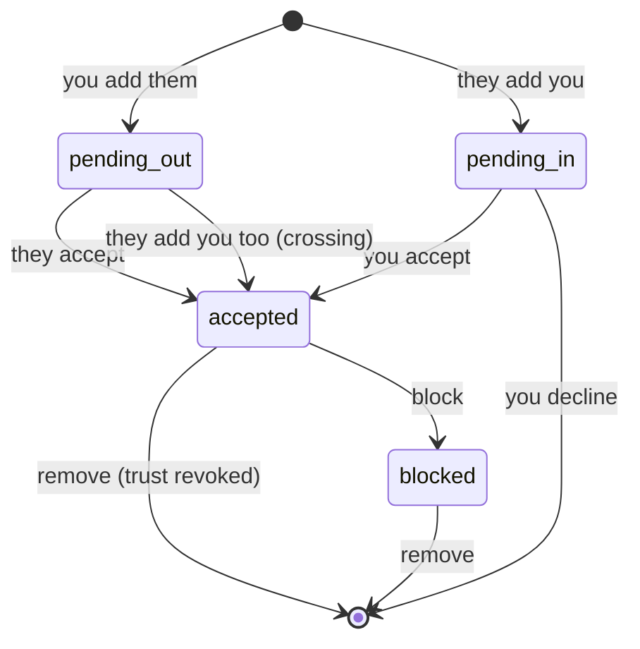

# Module: social

:::note This module contributes no panes
Its surfaces are sections of the **[People](people.mdx)** pane
(`people.home`). Everything below still describes the services, settings and
components; only the "where do I click" answer changed. Old names keep resolving —
`show("Peers")`, `show("social.friends")` and the rest land on the right section.
:::

The friends layer: a roster of **people** you know, built on the
[peer fabric](network.mdx). Where the network module deals in machines — node
ids, transports, trust — this module deals in humans, and grants the fabric trust
that makes everything else between friends work.

Adding a friend is what turns two unrelated nodes into peers that can message each
other, share panes, and let their agents talk. There is no second pairing step.

## Why a person is not a node

The fabric's `node_id` names one machine. People run several, so friending at the
node level has two bad consequences: a friend with a desktop and a laptop shows up
in your roster twice, and your *own* second computer has to be added as a
"friend".

So this module adds a second, longer-lived Ed25519 keypair — the **person key** —
and derives a `person_id` from it exactly the way the fabric derives a node id:

```
person_id = base32(sha256(person_public_key))[:16]
```

Self-certifying, like everything else on the fabric: nobody can claim a person id
whose key they don't hold.

### Device certificates

A machine proves it belongs to a person by presenting a **device certificate** —
the person key's signature over `(person_id, person_public_key, node_id,
node_public_key, label, issued_at)`. Verification is offline and has three parts,
and the third is the one that matters:

1. `person_id` is the fingerprint of the presented person public key,
2. the signature is valid under that key, **and**
3. `node_id` is the node the certificate actually arrived from.

`identity.verify_device_cert` does (1) and (2) and deliberately leaves (3) to its
caller, because only the caller holds the session and knows who it is really
talking to. Skipping it would let anyone replay a friend's certificate and
impersonate them — `roster._accept_cert` is the one place that check lives, and
`test_cert_for_another_node_is_not_accepted_off_the_wire` pins it.

Once you sign in, **the account is the identity**: its person key is held by the
game server, which signs the certificate of every machine signed in to that account
(see [One account, every machine](#one-account-every-machine)). A signed-out machine
falls back to a local key of its own. There is **no revocation** in this slice: a
certificate is valid until the person key is rotated, which invalidates every
certificate at once.



## Friend codes

A `person_id` is 16 base32 characters — fine for a machine, miserable to read
aloud. A **friend code** wraps it with a checksum and groups it:

```
HD-5I7O-XZC5-4US3-ERM2-SIU3
   └────── person id ─────┘└──┘
                          checksum
```

The checksum exists to tell a *typo* apart from a *stranger*. Without it both
surface as "not found" and the user can't tell which happened.

Two parsing details are load-bearing:

- Base32 never produces `0`, `1`, `8` or `9`, so those are safely folded onto the
  letters they get mistaken for (`0→O`, `1→I`, `8→B`, `9→G`). `1→I` rather than
  `L` is a guess; a wrong guess is exactly what the checksum catches.
- `resolve_person_id` tells a code from a bare id by **length**, not by whether
  parsing succeeds. Falling back to "treat it as a raw id" when the checksum fails
  would defeat the checksum entirely — a mistyped code would sail through and be
  dialed as a real person.

## Contributions to the layout shell

- **Widgets:** `social.friends` (Friends, role `tool`, docks right).
- **Commands:** `social.open` (Friends: Open friends list).
- **Settings:** none. Your display name is part of your *identity*, not
  configuration — it is persisted alongside the person key and edited from the
  panel, so it can't drift from what your certificates say.

## Backend surface

`backend/modules/social/`, mounted at `/api/social`.

| Route | Purpose |
| --- | --- |
| `GET /api/social/roster` | Full roster + your own profile |
| `GET,POST /api/social/me` | Read / rename your profile |
| `POST /api/social/friends` | Send a friend request by code |
| `POST /api/social/friends/respond` | Accept or decline a pending request |
| `DELETE /api/social/friends/{person_id}` | Remove a friend (revokes trust) |
| `POST /api/social/friends/{person_id}/block` | Block |
| `POST /api/social/handle/bind` | Enroll this machine in the signed-in account now (it also runs on every sign-in) |

The person private key never crosses this boundary — only the public half and the
friend code derived from it.

### Peer-wire messages

Declared in `roster.py` rather than in `network/protocol.py`, so the social module
extends the fabric without the fabric knowing it exists — the same way
`training/fabric.py` contributes `training_ad`.

| Type | Meaning |
| --- | --- |
| `social_hello` | who I am: device certificate + display name, sent on every connect |
| `social_friend_request` | please add me |
| `social_friend_response` | accepted / declined |

### `/ws` `social` channel

Pushes `roster` snapshots and `friend_request` notifications. Presence is
**derived, never stored**: a person is online exactly when one of their machines
has a live session, which is a fact about the hub's connection table rather than
about the database. Mutating events are dispatched with `create_task` so a dial
never stalls the shared receive loop.

### Storage

`social_friends`, `social_devices` and `social_messages` in
`$HORRIBLE_DATA_DIR/app.db`, joined on `person_id`. The roster is **local**: a friendship is a pair of signed public keys
this node chose to trust, so it keeps working on a LAN with no internet and
survives any directory service disappearing. A directory is only ever consulted to
answer "what address is this person at right now" — never "who are my friends".

Both tables are created with `CREATE TABLE IF NOT EXISTS`, which never adds a
column to a table that already exists — any field added later needs an explicit
`ALTER` probe in `init_social_db`.

## One person, one friends list

There used to be two friend systems that did not know about each other:

|       | Fabric roster                            | Ladder (game server)          |
| ----- | ---------------------------------------- | ----------------------------- |
| Key   | `person_id` (`HD-XXXX-…`)                | `account_id` + `@username`    |
| Where | local `app.db`, per node                 | the hosted game server        |
| Has   | presence, device certs, **fabric trust** | avatar, bio, xp, level        |
| Lacks | **any profile data at all**              | any trust or transport        |

They met at exactly one point — `accounts.person_id`, the binding written when you
sign in — and nothing was built on it. So the People pane's Messages tab listed raw
machines by `node_name` while Friends listed people, and "peer" felt broken: a peer
is a *device*, a friend is a *person*, and the UI mixed them.

Now `social_friends` caches each friend's `handle` and `account_id`
(`set_ladder_identity`, filled in by `ladder.reconcile`), and one roster row is one
human on both systems. Two rules keep that from becoming a hole:

- **Every resolved entry is re-checked** against its own key fingerprint
  (`person_identity.fingerprint(key) == person_id`) before it is written. A
  directory can withhold a record; it must never be able to point you at an
  impostor.
- **Ladder friendship never grants fabric trust.** Trust comes from accepting a
  friend request on the fabric, where you have verified a device certificate.
  Mirroring it the other way would let the game server's friends list open peer
  connections on your node.

A friend with no `handle` is a completely normal roster row, not a failure: they
have simply never signed in to the game server. They render by display name and
friend code, exactly as before. What a handle unlocks is the **profile** — their
avatar, level and comment wall (see [games](games.mdx)).

## Messages

Direct messages are keyed by **person** and written to
`social_messages` in `app.db`.

What that replaces: conversations lived in an in-memory `deque(maxlen=200)` keyed
by `node_id`. Three consequences, each of which read as the app being broken:

1. **Restarting the backend erased every conversation.**
2. **A friend on two machines was two conversations** — message their laptop, get a
   reply from their desktop, and the thread forked.
3. **There was no unread count**, because nothing knew what you had read.

The `node_id` is still recorded on each message, as the route it took rather than
as its identity. Sending is addressed to a person and the backend picks whichever
of their machines is online; you are never asked which of someone's own computers
to send to.

An inbound message **nobody is looking at** raises a notification through
[`notifications.service.notify`](notifications.mdx), which is where the mute rules
are enforced — that is what makes *"mute any messages except for Andrew"* mean
something. A message arriving in the conversation you have open is marked read on
arrival and raises nothing.

A message from a node with no device row (a stranger, or a peer paired before this
layer existed) is still delivered — just unfiled, in memory, with a null
`personId`. An unfiled message beats a dropped one.

| `peerchat` event | Direction | Meaning |
| --- | --- | --- |
| `open` | → | subscribe and fetch a conversation (marks it read) |
| `send` | → | send to a person; the node picks the machine |
| `read` | → | mark a conversation read without opening it |
| `unread` | → | subscribe to badges only, for a friends list |
| `history` / `message` / `unread` / `error` | ← | backlog, one message, badge counts, failure |

## Requests: one inbox

Incoming **friend requests** and commons **meet requests** both land in the
People pane's Requests section. They used to be a click apart — friend requests
rendered inside the Friends list, meet requests had their own section — which is
how you end up ignoring both.

They stay visibly distinct, because they grant genuinely different access: a
friend request is from someone who already has your friend code and accepting
grants their machines fabric trust, while a meet request is from a *stranger*
found through the [commons](commons.mdx) and keeps its own consent handshake and
trust tiers.

## Adding someone anywhere, by username

Two people at two homes add each other by `@username` and become friends. No
invite, no shared network, no linking step. Nothing about that is LAN-only; a
direct connection on the same network is just the fast path when there is one.
Four things make it work, and until 2026-09-16 each one was missing:

| Step | What happens | What used to go wrong |
| --- | --- | --- |
| Resolve | `@ben` → person key, from the game server's directory (fingerprint-checked) | The account-to-person binding ran only when a username was first *claimed*, so any other account was never findable. Machines now enroll on every sign-in and at startup (`server_auth.schedule_enrollment`) |
| Find | person → their machines, from the **same directory entry**: device certificates signed by the account's person key, each dialable as `relay:<node_id>` | Machines came only from the Atlas presence record, which an ordinary install has no credentials for, and which held only LAN and tailnet addresses |
| Reach | direct candidates race for 4 s, then **`relay:<node_id>`** through the relay broker | The relay was off by default, so two homes had no route at all |
| Admit | their node accepts us as a **stranger** that may deliver a friend request | The handshake rejected anyone not paired by invite: "pairing required" |

### Strangers

A node that proves its identity in the handshake but is not trusted is admitted as
a **stranger** rather than rejected. The hub enforces what that means in one place,
not in each of its dozens of handlers:

- It may send and be sent only `social_hello`, `social_friend_request` and
  `social_friend_response` (`hub.allow_from_strangers`). Everything else is dropped
  at dispatch, and `send_to` / `request` refuse to address a stranger with anything
  else.
- It is absent from `peer_hub.peers` and `list_peers()`. About twenty-five call
  sites use those to decide who gets work, invitations, embeddings or a research
  subagent, and filtering at the source keeps every one correct. Browsers get no
  `peer_update` for it.
- It is closed after `STRANGER_TTL_S` (two minutes) unless trust arrives, and at
  most `MAX_STRANGER_SESSIONS` (64) are held at once. The rest are refused as `busy`.
- **The dialer decides its own trust too.** Every successful dial used to write a
  trusted peer record. Now it trusts the node it reached only if it redeemed that
  node's invite, already trusted it, or runs open-LAN trust.

When a person accepts, `_grant_trust` upgrades the **live** session in place
(`hub.set_trusted`), so the new friend works at once instead of after a reconnect.
Removing or blocking closes the session.

### One account, every machine

A username is claimed at sign-up (email, or the chooser a new OAuth account lands
on) and is unique. It is the way people add each other, and it must lead to the
same person from every computer you sign in on.

It used to not. Each machine minted its own person key and bound it to whatever
account it signed in to, so two computers on one account took turns owning the
username, whichever had started last, and showed up as two people who had to
friend each other. Now:

- The game server holds **one person key per account** (`account_identities`, a
  table of its own so the key never rides along on an account read), minted on
  first use.
- On every sign-in and at startup a machine **enrolls**
  (`handles.enroll_device` → `POST /account/devices`). The bearer proves the
  account; a signature by the **node** key over `store.enroll_challenge` (account
  id, node id, timestamp) proves the machine holds the key it names. Without that
  proof a signed-in user could list someone else's machine under their own username,
  and everyone who added them would dial a stranger.
- The server signs the machine's certificate, label-less because the directory
  answers anyone, and lists it in `person_devices` (the 8 newest). The machine
  adopts it (`identity.adopt_cert`) and speaks as the account from then on. The
  reply carries the account's other machines, which are recorded with
  `relay:<node_id>` addresses.
- Your own machines **trust each other on sight**: a `social_hello` whose
  certificate names the account this machine is enrolled in grants trust
  (`roster._is_own_machine`), and the reconnect loop redials them like friends.
- Claiming a username enrolls again, so a sign-in whose enrollment failed does not
  wait for a restart to become findable. The People pane's Me section and Friends
  header render `AccountGate` (core) until the account has a username: the sign-in
  card when signed out, a chooser pre-filled from the account name when signed in
  without one. Both used to say "sign in to get a username" with no control, even to
  an account that was already signed in.
- Signing out unlists the machine (`DELETE /account/devices/{node_id}`, awaited
  before the token is deleted) and drops the adopted certificate.
- `GET /directory/resolve` returns the certificates as `devices`; a friend's node
  checks each against the entry's person key (`handles.verified_devices`).

This replaced the invite-based **link another machine** flow, and the
`social_device_cert` wire message it used. The trade is explicit: whoever holds the
game server's database and JWT secret can enroll a machine under any account. A key
only your own machines hold would prevent that, at the cost of needing one of them
online to approve every new computer. `test_games_account_identity.py` pins the
enrollment checks and that the node and server build the same challenge bytes.

### The relay

`network.relayUrl` blank means the game server's relay (`wss://<game server>/relay-ws`),
since that is the one public service every node already talks to. `off` disables it,
and `HORRIBLE_RELAY_URL` overrides both (the test suite sets it to `off`). The
broker (`backend/relay_broker.py`, at the backend root because the game server hosts it and must not import the node's module graph):

- **authenticates registration.** It sends a challenge, and the node answers with its
  public key and a signature. The node id must be that key's fingerprint.
  Registration used to be a bare `{"register": id}`, which on a shared broker would
  let anyone receive a friend's traffic.
- **pins frames to their sender.** A frame's `src` must be the registered node.
- **answers a frame to nobody** with `undeliverable`, so a dial to someone offline
  fails at once with "not online".

The transport never blocks startup and reconnects with backoff when the broker
restarts. Its frame limit is 16 MiB, because one oversized message on the shared
connection would otherwise drop every relayed friend at once. **The broker can read
relayed traffic:** envelopes are signed, not encrypted, and TLS ends at the broker.

### Friends reconnect on their own

Nothing used to redial a friend. A session lasted only while both nodes stayed up,
and after a restart everyone read offline until someone connected by hand.
`roster.reconnect_round` runs every minute and dials each accepted friend (and each
pending request) that has no live session. Per person it backs off from one minute
to thirty, and a pending request is resent when the person is reached. A friend's
hello records a dialable address: `relay:<node_id>` always, because it names the
node rather than a place, and a direct URL only when we dialed it. So reconnecting
works even with the presence directory down. `_dial` also tries `relay:<node_id>`
for **every machine already on the roster**, recorded address or not: friendships
made on a LAN before the relay existed saved only that LAN address, and would
otherwise never be found once either side left that network.

## Trust, and what friendship actually grants

Accepting a friend writes every one of their devices into the network module's
known-peers store as `trusted`. That is the whole point: it is what lets
[peer chat](network.mdx#peer-chat), [shared panes](scratch.mdx), and
`agent.ask_peer` work between friends with no separate pairing. Removing or
blocking revokes it again.

Friendship grants **reachability, not authority**. A friend's agent asking yours a
question is still gated by your `network.allowRemoteAgent` and
`network.remoteAgentMode` settings, which default to off and read-only.

Two states are worth calling out:

- **Crossing requests.** If you each add the other before either answers, that is
  mutual consent — it settles as accepted on both sides rather than deadlocking as
  two forever-pending rows.
- **Blocked.** A blocked person gets silence, not a decline, so they can't tell
  being blocked from being offline.

## Friend states



## Your own machines

Sign in on each of them with the same account; see
[One account, every machine](#one-account-every-machine). They appear in the roster
flagged `is_self`, so "play against my other computer" needs no special case.

## The presence directory (MongoDB Atlas)

The roster is local; the directory answers exactly one question, and deliberately
the smallest one that still makes friending work across the internet:

> given a person id, what addresses is that person reachable at right now?

**Nothing about who your friends are is ever written to Atlas.** The social graph
stays on your machine, so the cluster going away downgrades discovery to "you need
their address once" rather than breaking the roster.

Records are self-published and self-certifying: a node writes its own person id,
public key, and dialable addresses, signed by its person key. A reader verifies
both the signature and the `person_id`-is-the-key-fingerprint invariant before
trusting an address. A hostile or compromised directory can therefore withhold
records or serve stale ones, but **cannot point you at an impostor** — and the
peer handshake would reject one anyway, since node ids are self-certifying too.

Only the machine holding the person key publishes; a linked machine cannot sign as
the person, and its addresses reach you through the primary regardless. Records go
stale after 15 minutes rather than being deleted, so a brief outage doesn't erase
someone.

### Keeping a record current

`lookup` ignores a record older than `TTL_SECONDS` (15 minutes), and for a long time
the record was published **exactly once, at startup** — while the module's own comment
claimed it was republished "whenever its address changes". So any node that had been
up for more than fifteen minutes was invisible to `roster._dial`, and a friend's
reconnect through the directory failed with nothing to say why.

A running node now keeps it current with `directory.refresh_loop`, started beside the
startup publish in `network/setup.py` and cancelled in `stop_network()`:

- **Every `REFRESH_SECONDS` (TTL / 3, five minutes)**, so one missed round — Atlas
  briefly unreachable — still leaves a current record.
- **Early, when the local addresses change**: a laptop moving networks, Tailscale
  coming up. The check runs every minute against the host candidates only, so it
  never costs a STUN round trip.
- **A failed publish is retried on the next check**, including a failed startup
  publish, without a full refresh interval of invisibility. Nothing in a round can
  end the loop; a loop that dies on its first surprise is the same bug, only later.
- **Not started at all** when Atlas is not configured. A linked machine runs it but
  publishes nothing, because `build_record` returns `None` for it.

Shutdown **does not unpublish**, deliberately. Records are keyed by person, so
deleting on every stop would make you unfindable across a restart, and under
`--reload` a restart is every save. A stopped node stops refreshing and its record
goes stale on its own, which also covers the crash no shutdown hook would see.

### The test suite never publishes

Every test that enters `with TestClient(app)` runs the full lifespan, including the
publish above — and `backend/__init__.py` loads `.env`, so the real credentials were
present during `pytest`. Each test's temporary data dir mints a fresh person key, so
each run left new records in a directory other people's nodes read: on 2026-09-16 the
collection held 677 records, **674 of them stale junk** from two developers' machines.

`backend/tests/conftest.py` sets every `ATLAS_*` variable to an **empty string** in
`pytest_configure`, before anything imports `backend`, and again per test.
`_load_dotenv` never overrides a variable that is already present, so the empty value
beats the file, and every reader treats blank as not configured.
`test_atlas_isolation.py` pins it, including that booting the app publishes to
nothing. A test that needs credentials sets fake ones itself.

`scripts/presence_stale_records.py` lists stale records whose `person_id` is not one
you keep, optionally narrowed by `--name`, and deletes exactly that list only with
`--delete`.

### What gets published, and the reachability catch

A record carries the node's full **ICE candidate list**, not one address: LAN host
candidates first, then the STUN server-reflexive (public) candidate.

This matters more than it looks. `trust.advertised_address()` auto-detects the
**LAN** IP, so a record built from it alone publishes something like
`ws://10.0.0.18:8100/peer-ws` — perfectly good for finding your own second machine
on the same network, and completely useless to a friend across the internet. The
public candidate only appears when **`network.iceEnabled` is on**, and even then a
home router drops the connection without a port forward.

So a record also carries **`relay:<node_id>`** whenever the node runs the relay
transport, which is the default. That is the candidate a friend anywhere can use; see
[Adding someone anywhere, by username](#adding-someone-anywhere-by-username).

Every candidate carries the port the backend is **actually serving on**, not an
assumed 8000 (see [network](network.mdx#the-advertised-port)). A record with the wrong
port looks valid, verifies, and dials nothing: that was a friend's node advertising
`:8000` while listening on `:8100`, and `_dial` → `directory.lookup` failed every
reconnect without a word. If the first request reveals a different port from the one
assumed at startup, the record is republished.

The directory's job is rendezvous, not traversal: it says *where* a person is, and
the relay candidate is how a friend actually gets there.

Configuration is environment-only — `ATLAS_DB_USER`, `ATLAS_DB_PASS`, and
`ATLAS_CLUSTER_HOST` in `.env`, never settings, because `GET /api/settings`
returns the whole bag to the browser. The shared client lives at
`backend/atlas.py` rather than inside this module, since HorribleAssault will need
the same cluster and modules must not import each other's internals.

Those credentials let this node publish and read *its own* presence lookups; they do
**not** open the cluster to ad-hoc queries. Browsing or editing it from the database
console is a separate, default-off opt-in (`ATLAS_ADMIN`) — see
[database](database.mdx#the-atlas-built-in-admins-only). Every node on the fabric holds
these credentials, so "the credentials are configured" would be a meaningless gate.

`_dial` consults the directory **last** — after an existing session, a
caller-supplied address, and each device's last known address. A LAN address you
already have is both faster and likelier to work than a published one, and the
ordering is what keeps the whole flow working with Atlas absent.

## Agent tools

Grouped under the `social` prefix (the orchestrator groups by name prefix).

| Tool | Purpose |
| --- | --- |
| `social.list_friends` | The roster, with presence and per-device node ids |
| `social.message` | Send a chat message to a friend by name or code |
| `social.ask_agent` | Ask a friend's agent a question, and return its answer |

`social.message` routes through the chat manager rather than straight onto the
wire, so an agent-sent message lands in the same conversation history the panel
shows instead of vanishing — and it addresses a **person**, so the manager picks
a live machine rather than the agent guessing at a node id.

The `watch.*` and `notify.*` tools in [notifications](notifications.mdx) are the
other half of the social surface: they are what let *"let me know when Andrew logs
in"* survive the end of a chat turn.

Name resolution is exact (case-insensitive) and refuses ambiguous matches —
silently picking the closest fuzzy match would let the agent message the wrong
person.

## Browser vs desktop

Identical in both layouts. The panel needs no platform capability check; all
identity and networking lives on the backend.

## Known limitations

- **No certificate revocation.** Unlinking a machine removes it from your roster
  but does not invalidate the certificate it already holds. Rotating the person
  key invalidates all of them, and changes your friend code.
- **Adding by username needs the game server.** It is the uniqueness authority for
  usernames, the list of a person's machines and the relay. A friend code still
  works without it, given an address such as `relay:<their node id>`, and friends
  already made are redialed from their recorded address.
- **A username lists machine ids publicly.** The directory entry carries each
  machine's node id and public key, which is what lets anyone who knows your
  username reach you. It carries no hostname: the server issues every certificate
  with an empty label.
- **The game server can vouch for a machine under any account.** It holds every
  account's person key. That is the price of signing in anywhere and being
  yourself.
- **Relayed traffic is readable by the relay operator.** Envelopes are signed
  end to end, not encrypted.
- **Profiles need the game server.** Avatars, levels and comment walls come from
  the ladder, so a friend with no username renders with an initial and no level,
  and every face falls back to an initial when that server is unreachable. The
  roster itself is local and always renders — that separation is deliberate.
- A signed-out machine's local person key is stored unencrypted at
  `$HORRIBLE_DATA_DIR/social-person.key` (mode `0600`), matching the node identity
  key. An account's key is stored the same way, in the game server's database.

## Starting a machine over

`scripts/reset_identity.py` makes a machine nobody again: it removes the sign-in,
the person and machine keys, paired peers and invites, and the friends and devices
tables in `app.db`, and leaves settings, models, chats and libraries alone. Stop the
backend first (the script refuses while one is listening on 8000 or 8100); it is a
dry run without `--yes`.

## See also

- [Module: network](network.mdx) — the fabric this is built on
- [Distributed architecture](../architecture/distributed.mdx)
- [Module: mobile-android](mobile-android.mdx) — a phone is another device
- [Module: hassault](hassault.mdx) — the roster's first real consumer: invite a
  friend to a match, and play in theirs across the fabric with no second pairing
