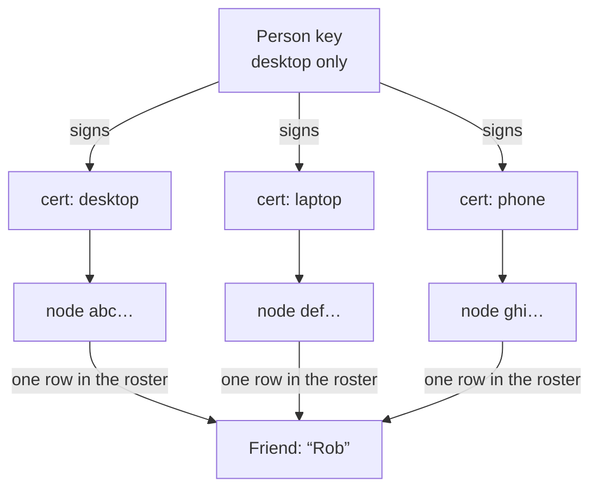
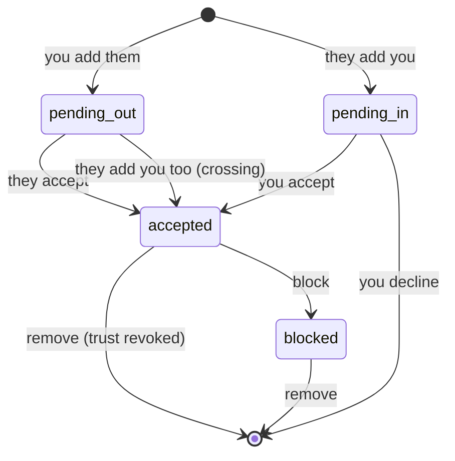

# Module: social

The friends layer: a roster of **people** you know, built on the
[peer fabric](network.mdx). Where the network module deals in machines — node
ids, transports, trust — this module deals in humans, and grants the fabric trust
that makes everything else between friends work.

Adding a friend is what turns two unrelated nodes into peers that can message each
other, share panes, and let their agents talk. There is no second pairing step.

## Why a person is not a node

The fabric's `node_id` names one machine. People run several, so friending at the
node level has two bad consequences: a friend with a desktop and a laptop shows up
in your roster twice, and your *own* second computer has to be added as a
"friend".

So this module adds a second, longer-lived Ed25519 keypair — the **person key** —
and derives a `person_id` from it exactly the way the fabric derives a node id:

```
person_id = base32(sha256(person_public_key))[:16]
```

Self-certifying, like everything else on the fabric: nobody can claim a person id
whose key they don't hold.

### Device certificates

A machine proves it belongs to a person by presenting a **device certificate** —
the person key's signature over `(person_id, person_public_key, node_id,
node_public_key, label, issued_at)`. Verification is offline and has three parts,
and the third is the one that matters:

1. `person_id` is the fingerprint of the presented person public key,
2. the signature is valid under that key, **and**
3. `node_id` is the node the certificate actually arrived from.

`identity.verify_device_cert` does (1) and (2) and deliberately leaves (3) to its
caller, because only the caller holds the session and knows who it is really
talking to. Skipping it would let anyone replay a friend's certificate and
impersonate them — `roster._accept_cert` is the one place that check lives, and
`test_cert_for_another_node_is_not_accepted_off_the_wire` pins it.

Only the machine holding the person private key can mint certificates. There is
**no revocation** in this slice: a certificate is valid until the person key is
rotated, which invalidates every certificate at once.



## Friend codes

A `person_id` is 16 base32 characters — fine for a machine, miserable to read
aloud. A **friend code** wraps it with a checksum and groups it:

```
HD-5I7O-XZC5-4US3-ERM2-SIU3
   └────── person id ─────┘└──┘
                          checksum
```

The checksum exists to tell a *typo* apart from a *stranger*. Without it both
surface as "not found" and the user can't tell which happened.

Two parsing details are load-bearing:

- Base32 never produces `0`, `1`, `8` or `9`, so those are safely folded onto the
  letters they get mistaken for (`0→O`, `1→I`, `8→B`, `9→G`). `1→I` rather than
  `L` is a guess; a wrong guess is exactly what the checksum catches.
- `resolve_person_id` tells a code from a bare id by **length**, not by whether
  parsing succeeds. Falling back to "treat it as a raw id" when the checksum fails
  would defeat the checksum entirely — a mistyped code would sail through and be
  dialed as a real person.

## Contributions to the layout shell

- **Widgets:** `social.friends` (Friends, role `tool`, docks right).
- **Commands:** `social.open` (Friends: Open friends list).
- **Settings:** none. Your display name is part of your *identity*, not
  configuration — it is persisted alongside the person key and edited from the
  panel, so it can't drift from what your certificates say.

## Backend surface

`backend/modules/social/`, mounted at `/api/social`.

| Route | Purpose |
| --- | --- |
| `GET /api/social/roster` | Full roster + your own profile |
| `GET,POST /api/social/me` | Read / rename your profile |
| `POST /api/social/friends` | Send a friend request by code |
| `POST /api/social/friends/respond` | Accept or decline a pending request |
| `DELETE /api/social/friends/{person_id}` | Remove a friend (revokes trust) |
| `POST /api/social/friends/{person_id}/block` | Block |
| `POST /api/social/devices/link` | Claim another of your machines |

The person private key never crosses this boundary — only the public half and the
friend code derived from it.

### Peer-wire messages

Declared in `roster.py` rather than in `network/protocol.py`, so the social module
extends the fabric without the fabric knowing it exists — the same way
`training/fabric.py` contributes `training_ad`.

| Type | Meaning |
| --- | --- |
| `social_hello` | who I am: device certificate + display name, sent on every connect |
| `social_friend_request` | please add me |
| `social_friend_response` | accepted / declined |
| `social_device_cert` | a certificate minted for a machine being linked |

### `/ws` `social` channel

Pushes `roster` snapshots and `friend_request` notifications. Presence is
**derived, never stored**: a person is online exactly when one of their machines
has a live session, which is a fact about the hub's connection table rather than
about the database. Mutating events are dispatched with `create_task` so a dial
never stalls the shared receive loop.

### Storage

`social_friends` and `social_devices` in `$HORRIBLE_DATA_DIR/app.db`, joined on
`person_id`. The roster is **local**: a friendship is a pair of signed public keys
this node chose to trust, so it keeps working on a LAN with no internet and
survives any directory service disappearing. A directory is only ever consulted to
answer "what address is this person at right now" — never "who are my friends".

Both tables are created with `CREATE TABLE IF NOT EXISTS`, which never adds a
column to a table that already exists — any field added later needs an explicit
`ALTER` probe in `init_social_db`.

## Trust, and what friendship actually grants

Accepting a friend writes every one of their devices into the network module's
known-peers store as `trusted`. That is the whole point: it is what lets
[peer chat](network.mdx#peer-chat), [shared panes](scratch.mdx), and
`agent.ask_peer` work between friends with no separate pairing. Removing or
blocking revokes it again.

Friendship grants **reachability, not authority**. A friend's agent asking yours a
question is still gated by your `network.allowRemoteAgent` and
`network.remoteAgentMode` settings, which default to off and read-only.

Two states are worth calling out:

- **Crossing requests.** If you each add the other before either answers, that is
  mutual consent — it settles as accepted on both sides rather than deadlocking as
  two forever-pending rows.
- **Blocked.** A blocked person gets silence, not a decline, so they can't tell
  being blocked from being offline.

## Friend states



## Linking your own machines

Generate an invite in the Peers widget on the second machine, paste it into
**Link another of your machines** on the machine holding your person key. That
machine dials the other, mints it a certificate, and records it as one of your
devices; the other end adopts the certificate.

A machine that already holds a person key **refuses** an inbound certificate — a
peer must not be able to talk a node out of its own identity. A linked machine
carries a certificate but cannot mint new ones, so it can't link further machines
or rename you; the panel says so.

Your own machines appear in the roster flagged `is_self`, so "play against my
other computer" needs no special case.

## The presence directory (MongoDB Atlas)

The roster is local; the directory answers exactly one question, and deliberately
the smallest one that still makes friending work across the internet:

> given a person id, what addresses is that person reachable at right now?

**Nothing about who your friends are is ever written to Atlas.** The social graph
stays on your machine, so the cluster going away downgrades discovery to "you need
their address once" rather than breaking the roster.

Records are self-published and self-certifying: a node writes its own person id,
public key, and dialable addresses, signed by its person key. A reader verifies
both the signature and the `person_id`-is-the-key-fingerprint invariant before
trusting an address. A hostile or compromised directory can therefore withhold
records or serve stale ones, but **cannot point you at an impostor** — and the
peer handshake would reject one anyway, since node ids are self-certifying too.

Only the machine holding the person key publishes; a linked machine cannot sign as
the person, and its addresses reach you through the primary regardless. Records go
stale after 15 minutes rather than being deleted, so a brief outage doesn't erase
someone.

### What gets published, and the reachability catch

A record carries the node's full **ICE candidate list**, not one address: LAN host
candidates first, then the STUN server-reflexive (public) candidate.

This matters more than it looks. `trust.advertised_address()` auto-detects the
**LAN** IP, so a record built from it alone publishes something like
`ws://10.0.0.18:8100/peer-ws` — perfectly good for finding your own second machine
on the same network, and completely useless to a friend across the internet. The
public candidate only appears when **`network.iceEnabled` is on**, so with ICE off
the directory is a LAN convenience rather than real remote discovery.

Even with a public candidate, a friend still has to actually reach you: a home
router will drop an unsolicited connection without a port forward. The existing
relay and WebRTC transports are the answer there — the directory's job is
rendezvous, not traversal.

Configuration is environment-only — `ATLAS_DB_USER`, `ATLAS_DB_PASS`, and
`ATLAS_CLUSTER_HOST` in `.env`, never settings, because `GET /api/settings`
returns the whole bag to the browser. The shared client lives at
`backend/atlas.py` rather than inside this module, since HorribleAssault will need
the same cluster and modules must not import each other's internals.

Those credentials let this node publish and read *its own* presence lookups; they do
**not** open the cluster to ad-hoc queries. Browsing or editing it from the database
console is a separate, default-off opt-in (`ATLAS_ADMIN`) — see
[database](database.mdx#the-atlas-built-in-admins-only). Every node on the fabric holds
these credentials, so "the credentials are configured" would be a meaningless gate.

`_dial` consults the directory **last** — after an existing session, a
caller-supplied address, and each device's last known address. A LAN address you
already have is both faster and likelier to work than a published one, and the
ordering is what keeps the whole flow working with Atlas absent.

## Agent tools

Grouped under the `social` prefix (the orchestrator groups by name prefix).

| Tool | Purpose |
| --- | --- |
| `social.list_friends` | The roster, with presence and per-device node ids |
| `social.message` | Send a chat message to a friend by name or code |
| `social.ask_agent` | Ask a friend's agent a question, and return its answer |

`social.message` routes through the chat manager rather than straight onto the
wire, so an agent-sent message lands in the same conversation history the panel
shows instead of vanishing.

Name resolution is exact (case-insensitive) and refuses ambiguous matches —
silently picking the closest fuzzy match would let the agent message the wrong
person.

## Browser vs desktop

Identical in both layouts. The panel needs no platform capability check; all
identity and networking lives on the backend.

## Known limitations

- **No certificate revocation.** Unlinking a machine removes it from your roster
  but does not invalidate the certificate it already holds. Rotating the person
  key invalidates all of them, and changes your friend code.
- **Discovery needs Atlas, or an address.** Off your LAN, resolving a friend code
  to a machine you have never met needs the presence directory below. With Atlas
  unconfigured, supply their `ws://…/peer-ws` address once; known devices are
  redialed from their stored address automatically after that.
- The person key is stored unencrypted at `$HORRIBLE_DATA_DIR/social-person.key`
  (mode `0600`), matching the node identity key. It is not in the Fernet secrets
  store.

## See also

- [Module: network](network.mdx) — the fabric this is built on
- [Distributed architecture](../architecture/distributed.mdx)
- [Module: mobile-android](mobile-android.mdx) — a phone is another device
- [Module: hassault](hassault.mdx) — the roster's first real consumer: invite a
  friend to a match, and play in theirs across the fabric with no second pairing
