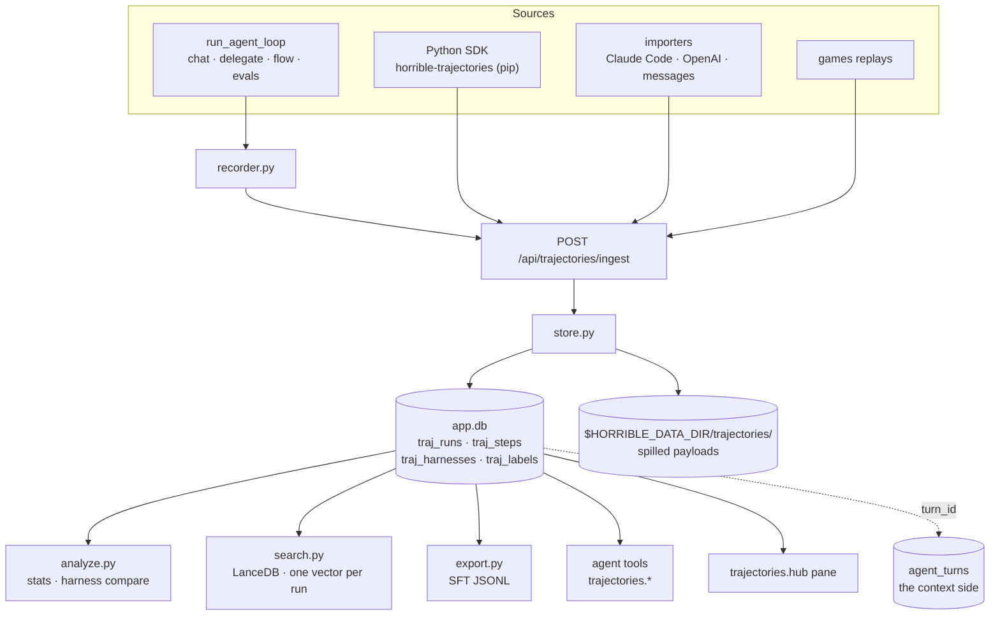

# Module: trajectories — what the agents actually did

**Status: implemented.** The store, the HTTP surface, live capture through
`run_agent_loop`, the harness comparison, the agent tools, the external Python SDK
and the `trajectories.hub` pane are all in. What is left is listed under
[Still outstanding](#still-outstanding).

:::note Not to be confused with
[Agent ⇄ editor trajectories](../architecture/agent-editor-trajectories.mdx), which
uses the word in a different sense — sequence diagrams of how the agent reaches the
editor's language intelligence. This page is about trajectories as **stored data**.
:::

## The gap it fills

The node runs agents constantly and retained almost none of it. Four stores held
fragments, and each answered a different question:

| Store | What it holds | Why it was not enough |
| --- | --- | --- |
| `agent_turns` (interpretability) | per-round context blocks — what the model was *shown* | tool calls only as serialized text; no queryable steps |
| `eval_results` | `[{name, arguments}]` for one graded case | no results, no timings, and `EvalConnection.events` was discarded |
| `research_steps` | the best per-step model in the repo | deep-research runs only |
| `EpisodeStep` (games) | a true obs → action → reward record | lives on the remote games server |

So "which tool does the coder waste the most rounds on", "did last week's
system-prompt edit help", and "show me runs that got stuck the way this one is"
had no data behind them. This module is that data.

It is **not** a replacement for `agent_turns`. That table holds what the model was
shown; this one holds what it did. Both are keyed by `turn_id`, and the join is the
design — duplicating a 4 KB prompt into both would mean two copies drifting apart.



## The conventions

The schema follows from these; they are stated in full in
`backend/modules/trajectories/models.py` and `store.py`.

1. **A step is one decision, and an action carries its own observation.** A tool
   call and its result are *one* `action` row. Splitting them means every query
   re-pairs by name and ordinal, which is silently wrong the moment a round calls
   the same tool twice.
2. **The harness is content-addressed.** The fingerprint is
   `sha256(canonical_json(system_prompt, sorted tool names, tool schemas, model, provider, params))[:16]`.
   Without that join key, "did my change help" has nothing to group by. The label
   is deliberately *not* in the hash — renaming a harness must not fork it.
3. **Grading is late-bound and additive.** `outcome`/`reward` are nullable;
   judgments land in `traj_labels` carrying a `source`. A human thumbs-down and an
   LLM critic's guess are not the same evidence.
4. **A sealed run is immutable.** `running → complete | failed | abandoned`; the
   store refuses to append to a sealed run, which is what makes an export
   reproducible from `(dataset, filter)` months later.
5. **Payloads spill, they never truncate.** Inline to 16 KiB; above that the
   payload goes to `$HORRIBLE_DATA_DIR/trajectories/<run_id>/` and the column
   holds `blob:<name>`. A clipped tool result is the thing you opened the
   postmortem to read.
6. **Ids sort by time** — `{epoch_ms:013d}-{hex8}`, so `ORDER BY id` is
   chronological.
7. **A run with no actions is still a run.** "The agent answered instead of
   acting" is the finding, not the absence of one.
8. **A step's `ts` is when it *started*.** `RunRecorder.action` is called after the
   tool has been awaited, so the store's own default would record the moment it
   *finished* — and a waterfall drawn from that sits one whole duration to the right
   of the truth while still looking entirely plausible. The orchestrator stamps
   `started_wall = time.time()` before dispatch and passes it explicitly.
9. **Prose the model emits alongside its calls is recorded.** A round that both
   narrates and acts writes a `message` step *before* its actions. Without it a run
   read as a bare list of calls with no account of why any of them happened, which is
   the half a postmortem is usually looking for.

## Capture is off by default

Nothing from the local orchestrator is recorded until a dataset has `capture = 1`,
set from the pane's **Datasets** section. At most one dataset captures at a time.
With capture off, the recorder is one indexed `SELECT` per agent turn.

The seam is **`run_agent_loop`** — all four internal callers (chat, `delegate`, the
flow executor's Agent node, the evals runner) go through it, so hooking it once
captures every internal source. Recording sits beside the existing
`_capture_context` call and follows the same rule: **an observer that can break the
thing it observes is a bug**, so every entry point swallows and logs.

## Data is stored raw and redacted on the way out

Tool arguments are stored **verbatim**, credentials included. This is the stance
`telemetry` already takes for I/O bodies: a debugger that has already dropped the
value cannot help you. It has a real consequence worth stating plainly:

:::warning
With capture on, `app.db` holds whatever your agent passed to a tool — API keys,
file contents, tokens. The database is local and unencrypted.
:::

`store.redact()` is the boundary, shape-matching key suffixes via
`SECRET_KEY_SUFFIXES`, and it is applied where data *leaves* the node: SFT export,
peer share, and MCP content exposure. A credential still belongs in a connector.

## Comparing two harnesses

`GET /compare?a=&b=` is the reason the module exists. It reports each side's
success rate, average steps and per-tool call frequency (normalised **per run**, so
a harness with more runs does not look like one that calls everything more), plus
the goals one handles that the other does not.

It also refuses to overclaim. Two harnesses are almost never run on the same tasks,
and if A ran ten easy goals and B ran ten hard ones, B's lower rate says nothing
about B. So the report separates the **paired** comparison (goals both attempted —
a real A/B, with regressions and fixes listed by name) from the **marginal** rates,
and sets `comparable: false` with an explaining `note` when fewer than
`MIN_PAIRED = 5` goals are shared. A success rate over zero graded runs is reported
as `null`, not `0` — rendering "unknown" as "0%" invents a finding.

## The continual-learning loop

`trajectories.search` is the read path: the agent looks up how it handled a similar
task before and uses that as context. One default is load-bearing — **retrieved
examples are successes unless asked otherwise**, because handing a model its own
failed runs as few-shot context teaches the failure. It is the same insight
`evals/export.py` states about exporting the *ideal* trajectory rather than the
model's, applied to retrieval. `include_failures` exists for "how do I usually get
this wrong", and the tool's response says which mode it used.

## The external Python SDK

`horrible-trajectories` is a **separate distributable package**
(`sdk/horrible-trajectories/`), not a backend module. That is the point: it is meant
to be installed into somebody else's agent, so it must not be able to import
anything from `backend.*` — and a test asserts exactly that, because the suite runs
inside this repo where `backend` happens to be importable and the mistake would
otherwise go unnoticed until someone tried to install it.

```bash
pip install horrible-trajectories
```

```python
from horrible_trajectories import TrajectoryRecorder

rec = TrajectoryRecorder(dataset="my-coding-agent")   # HORRIBLE_URL, or base_url=
h = rec.harness(system_prompt=PROMPT, tools=TOOL_SCHEMAS, model="claude-opus-5")

with rec.run(goal="fix the failing test", harness=h) as run:
    run.message("assistant", "I'll run the tests first.")
    run.action("bash", {"cmd": "pytest"}, {"rc": 1}, ok=False, ms=1200)
    run.label("outcome", "success")
```

Three properties it has on purpose:

- **It never raises into your agent.** Every network failure is logged at `debug`
  and dropped. If the dashboard is down, your agent does not notice.
- **It never blocks your loop.** Steps queue; a worker thread drains them.
  `Run.__exit__` flushes synchronously so a short script does not exit with data
  still queued.
- **It is idempotent.** Each run carries an `external_id`, so a retry replaces the
  run rather than filing a second copy.

An exception escaping the `with` block seals the run as `failed` and keeps the
steps — a crashed run is the most interesting kind.

Its only dependency is `httpx`. It is wired into this repo as an **editable dev
dependency** (`[tool.uv.sources]`) so the tests exercise the published package
rather than a copy; the backend itself does not depend on it.

:::note
This diverges from `backend/sdk/localtrack/`, which is still an in-tree module
importable only as `backend.sdk.localtrack`. This is the better arrangement of the
two — a client SDK that can only be imported from inside the application it reports
to is not a client SDK.
:::

## Semantic search

`trajectories.search` and `POST /search` embed the query and search a `trajectories`
LanceDB collection. **One vector per run, not per step**: the unit you retrieve is
"how did I handle a task like this", and per-step vectors would be tens of thousands
of rows for marginal recall — while `merge_insert` is a whole-table operation, so it
would make indexing quadratic in the wrong variable.

The document is composed, not dumped: goal, agent and model, outcome, the tool names
**in order**, and the final answer. Order matters — "read then edit then test" and
"test then read then edit" are different strategies, and a bag of tool names cannot
tell them apart.

Two behaviours worth knowing:

- **Hash-fallback vectors are never persisted.** `get_embedding` degrades to a
  deterministic hash when no embedder is reachable. Storing those would poison the
  collection permanently, because LanceDB fixes a table's vector width at first
  write — so indexing *skips* and reports `skipped`, and `POST /reindex` picks the
  runs up once an embedder is back.
- **The response says which search you got.** `method` is `semantic`, `substring`
  (no embedder answered) or `recent` (empty query). A caller told it ran a semantic
  search and got nothing concludes no similar run exists; the truth may be that
  nobody could embed the query.

Indexing runs after `/ingest` (awaited — an ingest is already a bulk operation) and
after a live-captured run is sealed (detached, so the user is not waiting on an
embedding round-trip). `POST /reindex?full=true` rebuilds from scratch, which is
also how you recover a collection pinned to the wrong vector width.

## SFT export

`POST /export` writes a JSONL of `messages` + `tools`, ready for the `training`
module's recipe form.

**This exports the model's ACTUAL trajectory — the opposite of `evals/export.py`,**
and the contrast is why both exist. The evals exporter builds an example from the
*case*: the prompt, the tools, and the call `expect` says was correct. It exports the
**ideal** trajectory, because for a failed case the model's own trajectory is the
mistake you are removing.

Here there is no `expect`. A trajectory records what happened, and the claim that it
was good comes from a label somebody attached afterwards. So **only graded successes
are exported and `outcome` is not optional** — exporting ungraded runs would train on
whatever the agent happened to do, which is how you distil a model's failure modes
back into it. `label_source="human"` narrows it further, and is what to reach for
when the training run matters: an `agent-critic` label is a model grading a model.

The two traps are inherited verbatim. **One system message** — a strict Jinja
template *raises* on a second one, a 500 from the engine rather than a warning.
**Never pre-render the chat template** — examples are `messages` + `tools`, because
rendering here bakes in one model's template and silently mistrains anything else;
`meta.drawn_from` records the model the data came off so a mismatch stays visible.

A run that cannot be turned into a faithful example (no user turn, or it stops
mid-tool-call) is **reported in `skipped`, never patched over**. A silently repaired
trajectory is training data nobody checked.

## Importers

`POST /import` takes `{dataset_id, format, content}` for three formats, each a pure
`(text) -> list[TrajectoryWrite]` function so it is testable against a fixture:

| Format | Notes |
| --- | --- |
| `claude-code` | The JSONL session transcript. A `tool_use` block and its `tool_result` live in **different records**, keyed by `tool_use_id`; re-pairing them is the whole job. |
| `openai` | A chat-completions message list, or a request body with `messages`. Tool arguments arrive as a JSON *string*; malformed JSON is preserved as written, because a model emitting broken JSON is a fact about the run. |
| `messages` | A plain `[{role, content}]` list. No actions. |

Imports land **ungraded** (`outcome: null`). Nothing in a transcript says the session
went well, and inventing `success` would push unvetted runs straight into the SFT
export. A wrong format is a **400 that names the problem** (with the line number, for
JSONL) — an importer that quietly produces zero runs is indistinguishable from an
empty file, and the user concludes the feature is broken.

`POST /import/replay/{id}` imports a games replay through `server_auth.replay_get`.
A replay becomes **one run per seat**, not one per match: two agents each deciding
from their own observations are two trajectories, and folding them together would
interleave two policies and void every per-harness aggregate. A timed-out move is
recorded as a failed action rather than a normal one, and a replay with no winner and
no returns stays ungraded rather than guessed at.

## Peer runs

There is no peer importer, because there is nothing to import. A turn a peer asks for
runs on **this** node through the ordinary orchestrator loop
(`network/agent_bridge.handle_remote_agent_request` -> `run_agent_turn`), so the live
recorder already captures it. All it lacked was provenance: `recorder.begin` reads
`is_remote`/`dst` off the connection and files the run as `source="peer"` with the
requesting `node_id`. Recording it as `local` would mix another node's questions into
your own dataset with no way to tell them apart.

## Sharing with friends

A friend can **list** your shared datasets, **pull** a copy of a finished run, and
**watch** a run live while in a share session you host. The wire vocabulary lives in
`backend/modules/trajectories/fabric.py` — `traj_list`, `traj_fetch`, `traj_live` —
declared there rather than in `network/protocol.py`, the share/hassault precedent.

### Three gates, none skippable

1. **`session.info.trusted`** — the envelope came from a friend. Reachability only;
   an untrusted node gets silence, not an error.
2. **`traj_datasets.shared`**, default off, set per dataset from the Datasets section
   behind a confirmation that says what cannot be undone: switching sharing off stops
   *new* pulls, but copies already pulled stay on your friends' machines. A missing,
   unshared or peer-sourced dataset all answer the same `not shared`, so the reply does
   not confirm what exists.
3. **For live watching only**, the friend is a participant in the share session this
   node is **hosting** and passes `share.gate.require(participant, "view")`. Being a
   friend is not enough — a trusted peer who has not invited you into a session cannot
   push its agent's work onto your screen, and a guest who leaves stops receiving.

**A friend's runs are not yours to share onward.** A pulled run lands in a
`peer-<node_id>` dataset (`source_kind="peer"`), and `store.update_dataset` refuses
`shared=True` there with `SharingRefused` (409 on the route). The serving side also
refuses peer-sourced runs outright, so a row edited directly in `app.db` still cannot
turn this node into a relay.

### Redaction happens on the sending node

`outbound.py` runs before the envelope is signed. It is **not** `store.redact`, which
matches dotted settings-key suffixes and so misses `api_key`, `Authorization`,
`x-api-key` and `cookie`. Two independent passes: key names normalized and matched
against credential words (bare `key` deliberately excluded — it is how key-value tools
name ordinary arguments), and string contents scanned for credential-shaped tokens —
bearer values, vendor key prefixes, JWTs, PEM private keys, `password=` pairs, URL
userinfo. The scheme-word pattern requires a digit in the value, because without it
"the token generation step" and "basic arithmetic" were masked; an explicit
`Authorization:` label is masked regardless of shape. `turn_id`, `external_id`,
`person_id`, `node_id`, `parent_run_id` and `meta` are never sent at all. This is best
effort, and the confirmation says so: a secret typed as prose has no shape to find.

### Replies are paged, because of who dialed whom

The dialing side of a peer link runs a `websockets` client whose `max_size` is 1 MiB;
one larger inbound message closes the **entire** link — chat and shared panes with it.
The accepting side is uvicorn, at 16 MiB. An unpaged reply would therefore work for
some friend pairs and sever others depending only on who connected first. `traj_fetch`
fills a reply up to `PEER_REPLY_MAX` (512 KiB), always at least one step, and the puller
asks again from `next_seq` — which it treats as untrusted: pages that do not move
forward, or more than `MAX_PAGES`, are refused. A single payload over 128 KiB becomes an
explicit `{"_omitted": …, "bytes": n}` marker. Spilled `blob:` payloads are resolved to
their content before sending; the pointer is a path on the serving disk.

Serving runs off the event loop (`asyncio.to_thread`) and `traj_fetch` is registered
`detach`, since a page is the heaviest thing this module does and an inline handler is
head-of-line delay for everything else on that friend's link.

### Pulling

`POST /api/trajectories/peers/{node_id}/runs/{run_id}/pull` assembles every page,
validates the whole payload, and only then writes — a malformed reply used to leave an
empty `peer-…` dataset behind. Provenance comes from the fabric (the authenticated node
id, and the person the local roster maps it to), never from the payload. Re-pulling is
idempotent on `external_id = node:run`; the friend's labels are cleared and re-applied
rather than appended, and arrive as `source="import"` so a friend's grade never
averages with your own human labels. A local grade you added to a pulled run survives a
re-pull. **A run still in progress cannot be pulled**: its snapshot would be sealed
here as if finished — watch it live instead.

Every friend route checks the node is a connected, trusted peer first (404 otherwise),
or this node would relay requests to anything it happened to be connected to.

### Watching live

The share mirror relays *layout* only, so a mirrored trajectories pane would show a
guest their own runs. Live runs therefore get their own content stream, `traj_live`,
hung off the same `stream._send` that feeds the local pane — a watcher sees exactly the
events this node's own Live view does, from every source — while authority comes
entirely from the share session. On the guest, frames arrive on the local
`trajectories` channel as `peer` events, tagged with the host, and are kept in a
separate map keyed `host:runId` (run ids are only unique per node). A guest joining
mid-run catches up through `GET /api/trajectories/watching` and the paged fetch.

### Found with two real nodes

The unit suite uses a loopback hub that enforces the 1 MiB frame limit. Two things only
appeared with two real backends friended over the fabric:

- **The shared-dataset count was stale.** The `trajectories` capability advertises
  `sharedDatasets`, computed at handshake. A friend connected before you shared saw
  `0` for the life of the link. Changing `shared` (or deleting a shared dataset) now
  calls `peer_hub.announce_presence()`, the fabric's mechanism for a provider whose
  answer changed; it debounces at 5 s.
- **The watched host was labelled with a person id.** `RemoteSession.host_name` held
  the host's person id. Fixed in share, which now resolves it from the roster at join
  (see [share](share.mdx#the-peer-wire)); the feed and `/watching` pass it through.

## Publishing to the commons

Friends are people you chose. The [agent commons](commons.mdx) is strangers, re-served
by an index you do not run — and **a federated index has no recall**: withdrawing a
digest stops the index serving it and reaches no copy already fetched. So what a run
publishes is a **digest of its shape** (`CommonsTrajectoryDigest`, built by
`backend/modules/trajectories/commons.py`), never the run:

| Kept | Dropped |
| --- | --- |
| harness fingerprint, model, provider kind, tool names | every `args` / `result` / `content` payload |
| tool-call sequence by name; per step `ok`, `duration_ms`, `gated`, `round` | `turn_id`, `external_id`, `person_id`, `parent_run_id`, `meta` |
| rounds, status, outcome, reward, token counts, duration | labels, the system prompt (the fingerprint stands in) |
| `goal` — **only** if opted in for this run, scrubbed, first 500 characters | |

Two things are not anonymous, and the publish panel says so instead of hiding them:

- **It is signed with this node's key**, so it names this node. That is the price of
  verification: an unsigned digest could be forged under anyone's name, and only its
  signer can withdraw it.
- **Tool names are shape, and can still say something.** An MCP server id is whatever
  its owner called it.

### The confirmation is bound to the content

A toggle would be wrong for something with no recall. **Publish to commons…** on a
finished run shows the exact digest, then asks you to type a short code printed under
it — the first characters of the digest's content hash. The backend rebuilds the digest
at send time and refuses if the code does not match, so a confirmation cannot be
replayed onto different content: turning the goal on after the preview, or a status
that changed since, changes the code and nothing is sent. A friend's pulled run and a
run still in progress are refused outright.

### What the index checks

`commons_server.py` verifies three things before storing a digest: `node_id` is the
fingerprint of `public_key`, the signature covers the digest, and **`digest_id` is the
digest's actual content hash**. The last is not implied by the signature — a publisher
could sign a digest carrying *someone else's* content hash, and if the index trusted the
id, the real digest would then be answered `duplicate` and never stored. A republish of
the same run dedupes on that id; the index keeps at most 200 per node and **refuses**
past that rather than evicting the oldest, which nobody would notice. Only a connection
that has published the signing node's profile can withdraw a digest.

The **Commons** section lists digests on the connected index — everyone's, or yours with
Withdraw — and says *not connected* rather than rendering an empty list that would read
as nobody having published anything.

## Tokens and cost

`traj_runs.tokens_in / tokens_out / cost_usd` carry what the **provider reported**,
summed across the turn's rounds. They were NULL for every local run until this
landed: `ChatResult` dropped the usage block on every dialect, so the columns existed
and nothing ever filled them.

Where the numbers come from, per dialect:

| Path | Source |
| --- | --- |
| ollama (stream and not) | top-level `prompt_eval_count` / `eval_count` — the streamed one rides the `done` chunk, which was already in scope and discarded by the `break` |
| openai dialect, non-stream | `usage.{prompt_tokens,completion_tokens}` + `usage.prompt_tokens_details.cached_tokens` |
| openai dialect, **stream** | a usage-only frame, which arrives **only** if `stream_options: {include_usage: true}` was sent |
| litellm | `response.usage`, plus `_hidden_params["response_cost"]` — litellm prices its own call |

Two silent failures this shape exists to avoid:

- **A streamed OpenAI-dialect response carries no usage block unless asked.** Add the
  parsing without the request and it returns `None` forever, and the obvious
  conclusion — "this provider doesn't report usage" — is wrong. Not every local
  server accepts the field, so a 400 disables it for that endpoint for the rest of
  the process (`_NO_STREAM_USAGE`), the same shape as the existing `think=True`
  retry: one failed request per server, never one per turn.
- **The usage frame has an empty `choices` list.** It has to be read before the
  `(frame.get("choices") or [{}])[0]` below it turns it into a blank choice.

**The forced-tool-call retry calls `chat_stream` twice** and reassigns `result`, so
usage is captured at each call site and `RunRecorder.usage()` **sums**. A single
capture at the end of the round would under-report exactly the turns that needed
repairing — the ones already costing double.

### Cost, and why zero is not null

`backend/modules/agent/cost.py` resolves in a strict order of trust:

1. **The provider's own figure** (litellm's `response_cost`). It priced the call it
   made, against the model that served it, with a table that ships with the package.
2. **The bundled table** `backend/modules/agent/pricing.json`, overlaid with the
   `agent.modelPricing` setting. fnmatch globs, **longest pattern wins** so a dated
   snapshot beats its family; first-match-wins would make the answer depend on dict
   ordering, which is a silent way for an override to be ignored. A routing prefix
   (`anthropic/…`) is stripped first, or a prefixed id matches nothing.
3. **Zero**, for a provider kind that runs on hardware nobody bills for
   (`cost.LOCAL_KINDS`). `nim` is deliberately excluded: it is the same dialect
   whether it is a local container or NVIDIA's metered API, and calling a billed API
   free is the worse error.

Anything else is `None`. **`0.0` and `None` are different facts** — a local run costs
a known nothing, an unpriced hosted model costs an amount we do not know — and the
pane keeps them apart: `free` for the first, nothing at all for the second. The same
rule governs the token line, where each half is rendered independently so a provider
reporting only completion tokens shows `—↓ 340↑` rather than a measured-looking `0↓`.

These are a different number from interpretability's `agent_turns`, which holds a
*tokenizer estimate* of what the model was shown. The estimate exists so a context
window can be drawn before a request is made; the report exists so a bill can be
reconciled after one. Keeping them in separate tables keeps them from being averaged
together.

## The live channel

Runs stream as they happen on the shared `/ws` channel `trajectories`. Three events:

| Event | Payload | When |
| --- | --- | --- |
| `run` | the whole `TrajectoryRun` | a run opens, and on any change to its header |
| `step` | `{runId, step}` | one step appended |
| `seal` | `{runId, status, steps, rounds, duration_ms}` | the run is sealed |

**Published from the store, not the recorder.** `store.append_step` / `start_run` /
`finish_run` is the one chokepoint every source passes — the chat orchestrator, the
evals runner, the flow executor, `delegate`, `agentpedia.fork`, the SDK's `/ingest`,
file import and a run pulled from a peer. Hanging the broadcast off `RunRecorder`
instead would have been a smaller change and would have streamed exactly one of
those, leaving the other seven silently static.

`backend/modules/trajectories/stream.py` captures the event loop from the app
lifespan (`trajectories_stream.init_loop()` in `backend/app.py`) rather than
discovering it lazily: `append_step` is a sync function reached from HTTP handlers
and worker threads, and a thread has no running loop to find — the event would vanish
with only a debug line. Publishing never raises into a writer.

Two shapes are worth knowing:

- **Payloads are elided above `STREAM_PAYLOAD_MAX` (2 KiB).** The wire carries
  `args_bytes`/`result_bytes` and a null payload; the pane fetches the real bytes from
  `GET /runs/{id}` when the row is opened. A byte count of `null` means there was
  nothing, and a number means there is something you have not fetched — the two must
  not render alike.
- **A bulk write is one event.** `append_step(..., notify=False)` is what `ingest_run`
  passes for every step, and a single `run` event follows once the run is whole.
  Importing a 200-step file is one thing that happened, not two hundred.

### Reconciling on the client

`packages/core/src/modules/trajectories/ws.ts` subscribes **before** it fetches, then
merges. The other order drops every step that lands between the two, silently and
permanently — the race that is still live in `telemetry/stream.py`, which drains its
backlog and only then subscribes, and the reason this file does not copy it.

`traj_steps.seq` is a per-run monotonic primary key, so it is the cursor for free: a
buffered step is a duplicate exactly when the snapshot already holds its `seq`. No
server-side cursor, no `since` parameter, no per-subscriber state.

Two cases that are easy to miss and were each a bug first:

- **The socket has no past.** A run that started before the tab connected emits
  nothing until its next step, so the view opens empty however much work is in flight.
  `GET /runs?status=running` is fetched on start and on every reconnect.
- **A `run` frame can arrive for a run already several steps old** — the pane opened
  mid-turn, or the writer suppressed per-step frames. The header alone renders
  "0 steps" beside a live pulse, which reads as an agent that has done nothing rather
  than one we joined late; the store hydrates when `run.steps > 0` and it holds none.

On reconnect every still-live run is refetched whole. Steps emitted while the socket
was down are gone from the wire and no server keeps them, so refetching is the only
honest recovery — treating the buffer as complete would render a run with a hole in it
and nothing to say there was one.

## Backend surface

Routes are mounted under `/api/trajectories`.

| Method | Path | Purpose |
| --- | --- | --- |
| `GET` `POST` | `/datasets` | list, create |
| `GET` `PATCH` `DELETE` | `/datasets/{id}` | read, toggle capture, delete |
| `GET` | `/runs` | filter by dataset, source, harness, outcome, agent, status, `q` |
| `GET` `DELETE` | `/runs/{id}` | detail with steps; delete (and its blobs) |
| `POST` | `/runs/{id}/labels` | attach a judgment |
| `POST` | `/ingest` | batch — the SDK, importers and adapters all use this |
| `GET` | `/harnesses`, `/harnesses/{fp}` | list, read |
| `GET` | `/stats`, `/tools` | aggregates |
| `GET` | `/compare?a=&b=` | the harness diff |
| `POST` | `/search` | semantic search; reports which method it used |
| `POST` | `/reindex` | build the vector index (`full=true` rebuilds) |
| `POST` | `/export` | SFT JSONL of graded successes |
| `POST` | `/import` | a Claude Code / OpenAI / messages file |
| `POST` | `/import/replay/{id}` | a games replay, one run per seat |

### Agent tools

| Tool | Description | Side effect |
| --- | --- | --- |
| `trajectories.search` | Past runs by goal; successes by default | No |
| `trajectories.get` | One run's steps, trimmed head-and-tail if long | No |
| `trajectories.stats` | Outcomes, average steps, tool call/failure counts | No |
| `trajectories.compare` | Two harness fingerprints | No |
| `trajectories.label` | Attach a judgment, always as `agent-critic` | **Yes** |

Names are `trajectories.<verb>` because the orchestrator derives a tool's group
from the **name prefix** (`_group_of`), not from `AgentTool.group`. The group is
progressively disclosed, so it costs nothing when unloaded.

`trajectories.label` always records `source="agent-critic"` regardless of what the
model passes — a model that could stamp its own guess `human` would launder it
into evidence.

## Querying it directly

Everything lands in `app.db`, so the `database` console's built-in `app`
connection and `dash` can query it with no new API:

```sql
-- which tools fail most
SELECT name, COUNT(*) AS calls, SUM(1 - ok) AS failures
FROM traj_steps WHERE kind = 'action' GROUP BY name ORDER BY failures DESC;

-- the join to the context side
SELECT r.goal, t.total_tokens
FROM traj_runs r JOIN agent_turns t ON t.turn_id = r.turn_id;
```

## Frontend

One pane, `trajectories.hub` (`role: document`, singleton), four sections:

| Section | Key | What it is |
| --- | --- | --- |
| **Runs** | `r` | Run index + timeline + step-by-step detail, with grading, deletion and search |
| **Live** | `l` | Runs happening right now, socket-fed |
| **Datasets** | `d` | Collections, the capture toggle, headline counts, tool usage, import/export |
| **Harness** | `h` | The A/B comparison and the harness inspector |
| **Friends** | `p` | Friends' shared datasets and runs; pull a finished one |
| **Commons** | `c` | Digests published to the agent commons index; withdraw your own |

Four sections rather than four panes, per the pane-consolidation rule: they are four
views of one object. No `RENAMED_VIEWS` entry is needed — no view id was removed.

**Live has no polling fallback, deliberately.** A poll would paper over a broken
channel and make "the stream is down" indistinguishable from "nothing is running",
which is the one ambiguity the view exists to remove.

Each section lives in `panels/` (`RunsSection`, `RunDetail`, `DatasetsSection`,
`HarnessSection`, plus a shared `common.tsx`); `TrajectoriesHub.tsx` is only the
switch. That split is what let the pane move onto the shared primitives —
`PaneHeader`, `DataList`/`DataRow`, `SplitPane`, `Button`, `Chip`, `EmptyState`,
`RollingNumber` — and onto the theme scale.

Three things the restyle fixed, each of which had been invisible:

- **The pane rendered dark under the light themes.** It styled itself from a local
  object of raw pixels and *legacy alias* tokens, and an undefined `var()` falls
  silently through to its hex fallback. `no-hex-literals.test.ts` holds every file
  here at **zero** hardcoded colours, and its list names each `panels/` path —
  splitting a guarded file moves its code out from under the guard, so the new paths
  had to be added in the same change.
- **Every section showed its empty state while loading.** "No trajectories yet —
  capture is off by default" flashed on each mount and read as an answer. There is now
  an explicit loading branch, and errors carry `role="alert"`.
- **The 340px fixed list column did not survive a 320px dock.** It is a `SplitPane`
  (`initial 320`, `min 240`, `minOther 360`, `narrowBelow 720`).

A run's row carries the goal, its verdict as the leading rail, and two figures.
Ungraded is stated in the row *body* rather than a badge: a badge shares the head
line with the figures, and at the column's 240px floor the two land on top of each
other.

Iconography inside the pane is inline stroke SVG (`icons.tsx` and the shared
`glyphs.tsx`) rather than native emoji. The manifest's `icon:` field is the
activity-rail glyph, typed as a string, and follows the rail's existing emoji
convention.

### The timeline

`panels/Timeline.tsx` draws a run as rounds down the page and wall-clock left to
right; the geometry is in `timeline-model.ts`, kept separate so it is testable with no
DOM. It sits **above** the flat step list rather than replacing it — they answer
different questions, and a 200-step run is unreadable as bars while a 12-step one is
unreadable as rows. Clicking a bar scrolls to and highlights its step.

A waterfall is fully derivable here because the orchestrator runs a round's tool calls
strictly in sequence — one `await` per call — so there is no concurrency to
reconstruct. The only nesting that exists is delegation, and that lives on
`parent_run_id` rather than between steps.

Three things the model is careful about:

- **A step with no duration is an instant, not a zero.** A `message` drawn at its true
  width is zero pixels and simply absent, which reads as a missing step. It gets a
  minimum width and is flagged `instant` so the renderer can say which it is.
- **The run's own `started_at` is used only when it precedes the first step.** An
  imported run carries another machine's clock, and a start that postdates its first
  step yields negative offsets and bars off the left edge.
- **The gap before the first call is kept.** That gap is the model thinking, and
  collapsing it would attribute think time to the tool that followed.

**Network** sits under the timeline, collapsed until asked for
(`panels/IoLane.tsx`, `GET /runs/{run_id}/io`). It reads the turn's stored wire traffic
from `telemetry_events` — see [observability](observability.mdx#persistence-for-agent-turns).
The route returns `joinable: false` for a run with no `turn_id` (anything imported or
pushed in by the SDK) rather than an empty list, because an empty list reads as "this
run made no requests", which is a claim nobody has evidence for; the pane hides the
control entirely for those runs. Rows are keyed by `(boot_id, ev_id)`, the table's own
identity, since `ev_id` alone restarts every boot.

### MCP steps

A step named `mcp-<server>.<tool>` shows what the step itself cannot know: which server
answered, how long the round trip took on the wire, whether a failure was the tool or
the connection, and — on request — the JSON-RPC exchange
(`panels/McpStepDetail.tsx`, `GET /runs/{run_id}/mcp`, `GET /runs/{run_id}/mcp/{seq}/wire`).

A call row cannot record its step, because the step is written after the call returns.
So `_pair_mcp` joins on `(round, agent-facing tool name)` plus ordinal within that group
— exact, since a round's calls run strictly in sequence and both rows come from the one
invocation. Names are compared through `bridge.tool_name`, which applies the sanitizing
the agent saw; a raw MCP tool name like `list.dir` would otherwise never match the step
`mcp-fs.list_dir`. A step with no partner stays unpaired rather than taking a guess.

The wire is looked up by the call's JSON-RPC ids **and its connection**, since ids restart
on every reconnect ([mcp](mcp.mdx#a-messages-identity-is-its-connection-plus-its-id)).
The summary is durable and the wire is not: the transcript is a small in-memory ring.
The wire route returns `available: false` when the exchange has been forgotten, and the
pane says so — an empty list would read as a call that sent nothing. The run fetches
MCP detail only when it has a `turn_id` and at least one MCP step.

**Step nesting — `traj_steps.parent_seq`.** A nullable column, and every step this
node records leaves it `NULL`, which means "derive the layout from `round`". It exists
for the sources that are genuinely nested and had nowhere to say so: SDK ingest of a
LangGraph subgraph or a Pydantic AI tool group, and parallel tool execution if the loop
ever gains it. Added with `_ensure_column` — `CREATE TABLE IF NOT EXISTS` does nothing
to a table that already exists, so an upgraded install would otherwise fail every
append on an unknown column. `test_an_existing_steps_table_gains_parent_seq` builds the
old table and pins that.

Deliberately *not* extracted into a shared `viz/Timeline`. There is one consumer, and
the generic version would need a colour mapper, a nesting strategy and a label
renderer as props — three abstractions invented for a second caller that does not
exist.

### What the pane surfaces

Search runs a **mode toggle**, not a second box. Plain mode is `GET /runs?q=`
(substring over goals); Semantic mode is `POST /search`, and **the method it
actually used is shown as a chip** — `semantic`, `substring` ("no embedder
answered") or `recent` ("the query was empty"). The backend degrades rather than
failing, and a silent fall back to `recent` looks exactly like a semantic search that
found nothing relevant. Semantic mode searches every outcome, unlike the route's
successes-only default: that default is right for retrieval feeding examples to a
model, and wrong for a human reading failures.

Export reports what it **skipped** (`{examples, candidates, skippedCount}`), because
"42 examples" with no mention of the 300 ungraded runs it passed over reads as a
complete dataset. It asks for `label_source: 'human'` — an `agent-critic` label is a
model grading a model.

The Datasets scope selector is server-side (`GET /stats?dataset=`,
`GET /tools?dataset=`), not a filter over an already-truncated page. A run's
**Inspect** button opens the Harness section on that fingerprint
(`GET /harnesses/{fingerprint}`) with its system prompt, tool list and sampling
params — a fingerprint is a hash, and "a3f2 beats 91cd" is unusable without it.

### Settings

| Key | Default | Effect |
| --- | --- | --- |
| `trajectories.retentionRuns` | `5000` | Prune a dataset to this many runs, oldest first |
| `trajectories.captureDelegates` | `true` | Record delegated sub-agent turns as linked child runs |
| `agent.modelPricing` | `''` | JSON overriding the bundled price table (declared by the agent module; see Tokens and cost) |

## Browser vs desktop

No difference. The pane is the same component in both layouts, all state is
server-side, and nothing here touches a platform capability.

## Still outstanding

- **Filtering inside the vector search.** Dataset and outcome filters are applied
  after the LanceDB query, so it over-fetches to keep `limit` reachable. Pushing them
  into the query is an optimisation, not a correctness fix.
- **Publishing to PyPI.** The package builds (`uv build sdk/horrible-trajectories`)
  and installs from its wheel into a clean environment; it has not been uploaded.
