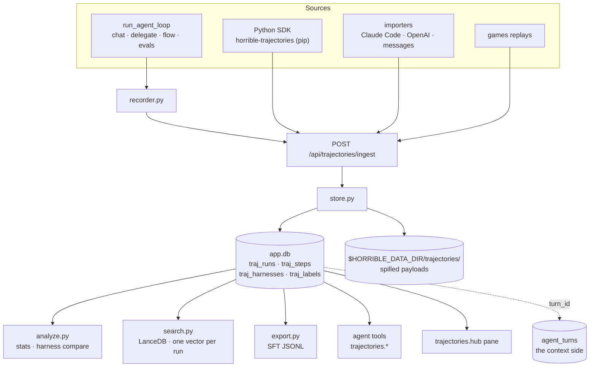

# Module: trajectories — what the agents actually did

**Status: implemented.** The store, the HTTP surface, live capture through
`run_agent_loop`, the harness comparison, the agent tools, the external Python SDK
and the `trajectories.hub` pane are all in. What is left is listed under
[Still outstanding](#still-outstanding).

:::note Not to be confused with
[Agent ⇄ editor trajectories](../architecture/agent-editor-trajectories.mdx), which
uses the word in a different sense — sequence diagrams of how the agent reaches the
editor's language intelligence. This page is about trajectories as **stored data**.
:::

## The gap it fills

The node runs agents constantly and retained almost none of it. Four stores held
fragments, and each answered a different question:

| Store | What it holds | Why it was not enough |
| --- | --- | --- |
| `agent_turns` (interpretability) | per-round context blocks — what the model was *shown* | tool calls only as serialized text; no queryable steps |
| `eval_results` | `[{name, arguments}]` for one graded case | no results, no timings, and `EvalConnection.events` was discarded |
| `research_steps` | the best per-step model in the repo | deep-research runs only |
| `EpisodeStep` (games) | a true obs → action → reward record | lives on the remote games server |

So "which tool does the coder waste the most rounds on", "did last week's
system-prompt edit help", and "show me runs that got stuck the way this one is"
had no data behind them. This module is that data.

It is **not** a replacement for `agent_turns`. That table holds what the model was
shown; this one holds what it did. Both are keyed by `turn_id`, and the join is the
design — duplicating a 4 KB prompt into both would mean two copies drifting apart.



## The conventions

The schema follows from these; they are stated in full in
`backend/modules/trajectories/models.py` and `store.py`.

1. **A step is one decision, and an action carries its own observation.** A tool
   call and its result are *one* `action` row. Splitting them means every query
   re-pairs by name and ordinal, which is silently wrong the moment a round calls
   the same tool twice.
2. **The harness is content-addressed.** The fingerprint is
   `sha256(canonical_json(system_prompt, sorted tool names, tool schemas, model, provider, params))[:16]`.
   Without that join key, "did my change help" has nothing to group by. The label
   is deliberately *not* in the hash — renaming a harness must not fork it.
3. **Grading is late-bound and additive.** `outcome`/`reward` are nullable;
   judgments land in `traj_labels` carrying a `source`. A human thumbs-down and an
   LLM critic's guess are not the same evidence.
4. **A sealed run is immutable.** `running → complete | failed | abandoned`; the
   store refuses to append to a sealed run, which is what makes an export
   reproducible from `(dataset, filter)` months later.
5. **Payloads spill, they never truncate.** Inline to 16 KiB; above that the
   payload goes to `$HORRIBLE_DATA_DIR/trajectories/<run_id>/` and the column
   holds `blob:<name>`. A clipped tool result is the thing you opened the
   postmortem to read.
6. **Ids sort by time** — `{epoch_ms:013d}-{hex8}`, so `ORDER BY id` is
   chronological.
7. **A run with no actions is still a run.** "The agent answered instead of
   acting" is the finding, not the absence of one.

## Capture is off by default

Nothing from the local orchestrator is recorded until a dataset has `capture = 1`,
set from the pane's **Datasets** section. At most one dataset captures at a time.
With capture off, the recorder is one indexed `SELECT` per agent turn.

The seam is **`run_agent_loop`** — all four internal callers (chat, `delegate`, the
flow executor's Agent node, the evals runner) go through it, so hooking it once
captures every internal source. Recording sits beside the existing
`_capture_context` call and follows the same rule: **an observer that can break the
thing it observes is a bug**, so every entry point swallows and logs.

## Data is stored raw and redacted on the way out

Tool arguments are stored **verbatim**, credentials included. This is the stance
`telemetry` already takes for I/O bodies: a debugger that has already dropped the
value cannot help you. It has a real consequence worth stating plainly:

:::warning
With capture on, `app.db` holds whatever your agent passed to a tool — API keys,
file contents, tokens. The database is local and unencrypted.
:::

`store.redact()` is the boundary, shape-matching key suffixes via
`SECRET_KEY_SUFFIXES`, and it is applied where data *leaves* the node: SFT export,
peer share, and MCP content exposure. A credential still belongs in a connector.

## Comparing two harnesses

`GET /compare?a=&b=` is the reason the module exists. It reports each side's
success rate, average steps and per-tool call frequency (normalised **per run**, so
a harness with more runs does not look like one that calls everything more), plus
the goals one handles that the other does not.

It also refuses to overclaim. Two harnesses are almost never run on the same tasks,
and if A ran ten easy goals and B ran ten hard ones, B's lower rate says nothing
about B. So the report separates the **paired** comparison (goals both attempted —
a real A/B, with regressions and fixes listed by name) from the **marginal** rates,
and sets `comparable: false` with an explaining `note` when fewer than
`MIN_PAIRED = 5` goals are shared. A success rate over zero graded runs is reported
as `null`, not `0` — rendering "unknown" as "0%" invents a finding.

## The continual-learning loop

`trajectories.search` is the read path: the agent looks up how it handled a similar
task before and uses that as context. One default is load-bearing — **retrieved
examples are successes unless asked otherwise**, because handing a model its own
failed runs as few-shot context teaches the failure. It is the same insight
`evals/export.py` states about exporting the *ideal* trajectory rather than the
model's, applied to retrieval. `include_failures` exists for "how do I usually get
this wrong", and the tool's response says which mode it used.

## The external Python SDK

`horrible-trajectories` is a **separate distributable package**
(`sdk/horrible-trajectories/`), not a backend module. That is the point: it is meant
to be installed into somebody else's agent, so it must not be able to import
anything from `backend.*` — and a test asserts exactly that, because the suite runs
inside this repo where `backend` happens to be importable and the mistake would
otherwise go unnoticed until someone tried to install it.

```bash
pip install horrible-trajectories
```

```python
from horrible_trajectories import TrajectoryRecorder

rec = TrajectoryRecorder(dataset="my-coding-agent")   # HORRIBLE_URL, or base_url=
h = rec.harness(system_prompt=PROMPT, tools=TOOL_SCHEMAS, model="claude-opus-5")

with rec.run(goal="fix the failing test", harness=h) as run:
    run.message("assistant", "I'll run the tests first.")
    run.action("bash", {"cmd": "pytest"}, {"rc": 1}, ok=False, ms=1200)
    run.label("outcome", "success")
```

Three properties it has on purpose:

- **It never raises into your agent.** Every network failure is logged at `debug`
  and dropped. If the dashboard is down, your agent does not notice.
- **It never blocks your loop.** Steps queue; a worker thread drains them.
  `Run.__exit__` flushes synchronously so a short script does not exit with data
  still queued.
- **It is idempotent.** Each run carries an `external_id`, so a retry replaces the
  run rather than filing a second copy.

An exception escaping the `with` block seals the run as `failed` and keeps the
steps — a crashed run is the most interesting kind.

Its only dependency is `httpx`. It is wired into this repo as an **editable dev
dependency** (`[tool.uv.sources]`) so the tests exercise the published package
rather than a copy; the backend itself does not depend on it.

:::note
This diverges from `backend/sdk/localtrack/`, which is still an in-tree module
importable only as `backend.sdk.localtrack`. This is the better arrangement of the
two — a client SDK that can only be imported from inside the application it reports
to is not a client SDK.
:::

## Semantic search

`trajectories.search` and `POST /search` embed the query and search a `trajectories`
LanceDB collection. **One vector per run, not per step**: the unit you retrieve is
"how did I handle a task like this", and per-step vectors would be tens of thousands
of rows for marginal recall — while `merge_insert` is a whole-table operation, so it
would make indexing quadratic in the wrong variable.

The document is composed, not dumped: goal, agent and model, outcome, the tool names
**in order**, and the final answer. Order matters — "read then edit then test" and
"test then read then edit" are different strategies, and a bag of tool names cannot
tell them apart.

Two behaviours worth knowing:

- **Hash-fallback vectors are never persisted.** `get_embedding` degrades to a
  deterministic hash when no embedder is reachable. Storing those would poison the
  collection permanently, because LanceDB fixes a table's vector width at first
  write — so indexing *skips* and reports `skipped`, and `POST /reindex` picks the
  runs up once an embedder is back.
- **The response says which search you got.** `method` is `semantic`, `substring`
  (no embedder answered) or `recent` (empty query). A caller told it ran a semantic
  search and got nothing concludes no similar run exists; the truth may be that
  nobody could embed the query.

Indexing runs after `/ingest` (awaited — an ingest is already a bulk operation) and
after a live-captured run is sealed (detached, so the user is not waiting on an
embedding round-trip). `POST /reindex?full=true` rebuilds from scratch, which is
also how you recover a collection pinned to the wrong vector width.

## SFT export

`POST /export` writes a JSONL of `messages` + `tools`, ready for the `training`
module's recipe form.

**This exports the model's ACTUAL trajectory — the opposite of `evals/export.py`,**
and the contrast is why both exist. The evals exporter builds an example from the
*case*: the prompt, the tools, and the call `expect` says was correct. It exports the
**ideal** trajectory, because for a failed case the model's own trajectory is the
mistake you are removing.

Here there is no `expect`. A trajectory records what happened, and the claim that it
was good comes from a label somebody attached afterwards. So **only graded successes
are exported and `outcome` is not optional** — exporting ungraded runs would train on
whatever the agent happened to do, which is how you distil a model's failure modes
back into it. `label_source="human"` narrows it further, and is what to reach for
when the training run matters: an `agent-critic` label is a model grading a model.

The two traps are inherited verbatim. **One system message** — a strict Jinja
template *raises* on a second one, a 500 from the engine rather than a warning.
**Never pre-render the chat template** — examples are `messages` + `tools`, because
rendering here bakes in one model's template and silently mistrains anything else;
`meta.drawn_from` records the model the data came off so a mismatch stays visible.

A run that cannot be turned into a faithful example (no user turn, or it stops
mid-tool-call) is **reported in `skipped`, never patched over**. A silently repaired
trajectory is training data nobody checked.

## Importers

`POST /import` takes `{dataset_id, format, content}` for three formats, each a pure
`(text) -> list[TrajectoryWrite]` function so it is testable against a fixture:

| Format | Notes |
| --- | --- |
| `claude-code` | The JSONL session transcript. A `tool_use` block and its `tool_result` live in **different records**, keyed by `tool_use_id`; re-pairing them is the whole job. |
| `openai` | A chat-completions message list, or a request body with `messages`. Tool arguments arrive as a JSON *string*; malformed JSON is preserved as written, because a model emitting broken JSON is a fact about the run. |
| `messages` | A plain `[{role, content}]` list. No actions. |

Imports land **ungraded** (`outcome: null`). Nothing in a transcript says the session
went well, and inventing `success` would push unvetted runs straight into the SFT
export. A wrong format is a **400 that names the problem** (with the line number, for
JSONL) — an importer that quietly produces zero runs is indistinguishable from an
empty file, and the user concludes the feature is broken.

`POST /import/replay/{id}` imports a games replay through `server_auth.replay_get`.
A replay becomes **one run per seat**, not one per match: two agents each deciding
from their own observations are two trajectories, and folding them together would
interleave two policies and void every per-harness aggregate. A timed-out move is
recorded as a failed action rather than a normal one, and a replay with no winner and
no returns stays ungraded rather than guessed at.

## Peer runs

There is no peer importer, because there is nothing to import. A turn a peer asks for
runs on **this** node through the ordinary orchestrator loop
(`network/agent_bridge.handle_remote_agent_request` -> `run_agent_turn`), so the live
recorder already captures it. All it lacked was provenance: `recorder.begin` reads
`is_remote`/`dst` off the connection and files the run as `source="peer"` with the
requesting `node_id`. Recording it as `local` would mix another node's questions into
your own dataset with no way to tell them apart.

## Backend surface

Routes are mounted under `/api/trajectories`.

| Method | Path | Purpose |
| --- | --- | --- |
| `GET` `POST` | `/datasets` | list, create |
| `GET` `PATCH` `DELETE` | `/datasets/{id}` | read, toggle capture, delete |
| `GET` | `/runs` | filter by dataset, source, harness, outcome, agent, status, `q` |
| `GET` `DELETE` | `/runs/{id}` | detail with steps; delete (and its blobs) |
| `POST` | `/runs/{id}/labels` | attach a judgment |
| `POST` | `/ingest` | batch — the SDK, importers and adapters all use this |
| `GET` | `/harnesses`, `/harnesses/{fp}` | list, read |
| `GET` | `/stats`, `/tools` | aggregates |
| `GET` | `/compare?a=&b=` | the harness diff |
| `POST` | `/search` | semantic search; reports which method it used |
| `POST` | `/reindex` | build the vector index (`full=true` rebuilds) |
| `POST` | `/export` | SFT JSONL of graded successes |
| `POST` | `/import` | a Claude Code / OpenAI / messages file |
| `POST` | `/import/replay/{id}` | a games replay, one run per seat |

### Agent tools

| Tool | Description | Side effect |
| --- | --- | --- |
| `trajectories.search` | Past runs by goal; successes by default | No |
| `trajectories.get` | One run's steps, trimmed head-and-tail if long | No |
| `trajectories.stats` | Outcomes, average steps, tool call/failure counts | No |
| `trajectories.compare` | Two harness fingerprints | No |
| `trajectories.label` | Attach a judgment, always as `agent-critic` | **Yes** |

Names are `trajectories.<verb>` because the orchestrator derives a tool's group
from the **name prefix** (`_group_of`), not from `AgentTool.group`. The group is
progressively disclosed, so it costs nothing when unloaded.

`trajectories.label` always records `source="agent-critic"` regardless of what the
model passes — a model that could stamp its own guess `human` would launder it
into evidence.

## Querying it directly

Everything lands in `app.db`, so the `database` console's built-in `app`
connection and `dash` can query it with no new API:

```sql
-- which tools fail most
SELECT name, COUNT(*) AS calls, SUM(1 - ok) AS failures
FROM traj_steps WHERE kind = 'action' GROUP BY name ORDER BY failures DESC;

-- the join to the context side
SELECT r.goal, t.total_tokens
FROM traj_runs r JOIN agent_turns t ON t.turn_id = r.turn_id;
```

## Frontend

One pane, `trajectories.hub` (`role: document`, singleton), three sections:

| Section | Key | What it is |
| --- | --- | --- |
| **Runs** | `r` | Run index + step-by-step detail, with grading, deletion and search |
| **Datasets** | `d` | Collections, the capture toggle, headline counts, tool usage, import/export |
| **Harness** | `h` | The A/B comparison and the harness inspector |

Three sections rather than three panes, per the pane-consolidation rule: they are
three views of one object. No `RENAMED_VIEWS` entry is needed — no view id was
removed.

Each section lives in `panels/` (`RunsSection`, `RunDetail`, `DatasetsSection`,
`HarnessSection`, plus a shared `common.tsx`); `TrajectoriesHub.tsx` is only the
switch. That split is what let the pane move onto the shared primitives —
`PaneHeader`, `DataList`/`DataRow`, `SplitPane`, `Button`, `Chip`, `EmptyState`,
`RollingNumber` — and onto the theme scale.

Three things the restyle fixed, each of which had been invisible:

- **The pane rendered dark under the light themes.** It styled itself from a local
  object of raw pixels and *legacy alias* tokens, and an undefined `var()` falls
  silently through to its hex fallback. `no-hex-literals.test.ts` holds every file
  here at **zero** hardcoded colours, and its list names each `panels/` path —
  splitting a guarded file moves its code out from under the guard, so the new paths
  had to be added in the same change.
- **Every section showed its empty state while loading.** "No trajectories yet —
  capture is off by default" flashed on each mount and read as an answer. There is now
  an explicit loading branch, and errors carry `role="alert"`.
- **The 340px fixed list column did not survive a 320px dock.** It is a `SplitPane`
  (`initial 320`, `min 240`, `minOther 360`, `narrowBelow 720`).

A run's row carries the goal, its verdict as the leading rail, and two figures.
Ungraded is stated in the row *body* rather than a badge: a badge shares the head
line with the figures, and at the column's 240px floor the two land on top of each
other.

Iconography inside the pane is inline stroke SVG (`icons.tsx` and the shared
`glyphs.tsx`) rather than native emoji. The manifest's `icon:` field is the
activity-rail glyph, typed as a string, and follows the rail's existing emoji
convention.

### What the pane surfaces

Search runs a **mode toggle**, not a second box. Plain mode is `GET /runs?q=`
(substring over goals); Semantic mode is `POST /search`, and **the method it
actually used is shown as a chip** — `semantic`, `substring` ("no embedder
answered") or `recent` ("the query was empty"). The backend degrades rather than
failing, and a silent fall back to `recent` looks exactly like a semantic search that
found nothing relevant. Semantic mode searches every outcome, unlike the route's
successes-only default: that default is right for retrieval feeding examples to a
model, and wrong for a human reading failures.

Export reports what it **skipped** (`{examples, candidates, skippedCount}`), because
"42 examples" with no mention of the 300 ungraded runs it passed over reads as a
complete dataset. It asks for `label_source: 'human'` — an `agent-critic` label is a
model grading a model.

The Datasets scope selector is server-side (`GET /stats?dataset=`,
`GET /tools?dataset=`), not a filter over an already-truncated page. A run's
**Inspect** button opens the Harness section on that fingerprint
(`GET /harnesses/{fingerprint}`) with its system prompt, tool list and sampling
params — a fingerprint is a hash, and "a3f2 beats 91cd" is unusable without it.

### Settings

| Key | Default | Effect |
| --- | --- | --- |
| `trajectories.retentionRuns` | `5000` | Prune a dataset to this many runs, oldest first |
| `trajectories.captureDelegates` | `true` | Record delegated sub-agent turns as linked child runs |

## Browser vs desktop

No difference. The pane is the same component in both layouts, all state is
server-side, and nothing here touches a platform capability.

## Still outstanding

- **Filtering inside the vector search.** Dataset and outcome filters are applied
  after the LanceDB query, so it over-fetches to keep `limit` reachable. Pushing them
  into the query is an optimisation, not a correctness fix.
- **Publishing to PyPI.** The package builds (`uv build sdk/horrible-trajectories`)
  and installs from its wheel into a clean environment; it has not been uploaded.
