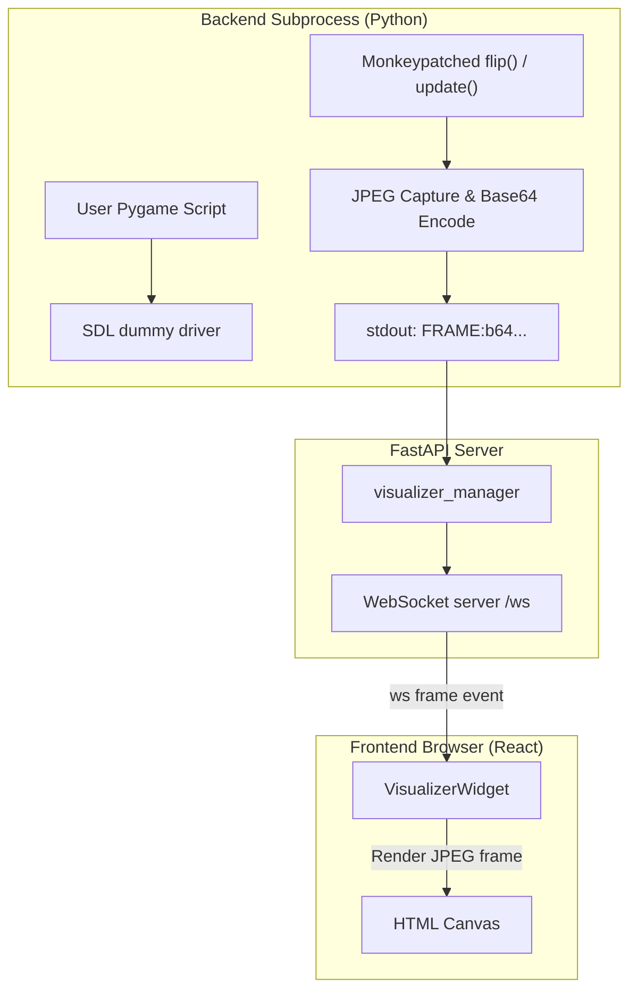

# Module: visualizer

A dynamic workspace visualizer widget that allows the user and agent to generate, edit, run, and control animations, drawings, and simulations.

**Status: implemented** — frontend in `packages/core/src/modules/visualizer/`, backend in `backend/modules/visualizer/`.

## Architecture & Rendering Engines

The Visualizer module supports two execution environments for animations:

### 1. Client-Side JavaScript Animations
JS visualizations execute in the main browser thread to achieve high-performance WebGL/2D canvas rendering (60 FPS).
- **Libraries**: Native HTML5 Canvas 2D, **Three.js** (WebGL, pre-loaded), and **Babylon.js** (WebGL, loaded dynamically via CDN at runtime on first request).
- **Lifecycle Contract**: Scripts compiled via `new Function(...)` may return an object implementing the lifecycle interface:
  ```javascript
  return {
    init: (canvas, THREE, BABYLON) => {
      // Initialize scene, camera, mesh, renderer, and lights
    },
    tick: (time, canvas) => {
      // Frame loop called via requestAnimationFrame
      // Use time (ms) to animate objects
    },
    cleanup: () => {
      // Discard geometries, materials, renderers, and event listeners
    }
  }
  ```
- **Standalone scripts also work**: a script that doesn't return hooks (e.g. an LLM-generated
  Three.js scene with its own `animate()` loop) runs as-is. `canvas`, `THREE`, and `BABYLON`
  are injected into scope; `new THREE.WebGLRenderer()` is bound to the pane canvas (so the
  renderer renders in-pane even without a `{ canvas }` arg), `requestAnimationFrame` is tracked
  so the loop is cancelled on stop/re-run, and `document.body.appendChild(...)` is a no-op to
  keep a detached canvas from escaping the pane. This makes weak models' typical output render
  without them having to emit the hook shape.

### 2. Backend-Side Headless Pygame Simulations
Python simulations run inside an isolated subprocess on the backend, streaming frames in real-time.
- **Headless Mode**: Sets `os.environ["SDL_VIDEODRIVER"] = "dummy"` before importing `pygame` to allow running on headless servers.
- **Display Interception**: Monkeypatches `pygame.display.flip()` and `pygame.display.update()` to capture the current frame buffer.
- **Frame Streaming**: Encodes the captured frame into JPEG, formats it as a Base64 string, and prints `FRAME:<base64_data>` to `stdout`.
- **WebSocket Relay**: The backend reads `stdout` in an async task and pipes each frame back to the frontend over a multiplexed WebSocket.



## Contributions to the Layout Shell

- **Widgets**: `visualizer.home` — opens the Visualizer workspace widget, which contains:
  - **Canvas Viewer**: A responsive layout wrapper displaying the output `<canvas>`.
  - **Control Strip**: Controls for Play/Pause, Restart, Engine selector (Canvas 2D, Three.js, Babylon.js, Pygame), and target buffer selection.
  - **Editor Link**: Dynamically binds to the active editor buffer or any other open file. Detects edits and automatically hot-reloads the animation in real-time (500ms debounce).
- **Commands**: `visualizer.open` (`Visualizer: Open Pane`) — opens the visualizer widget.

## WebSocket Protocol

All Pygame control and frame streaming are multiplexed over the shared `/ws` socket under the `"visualizer"` channel.

| Direction | Event | Data Shape / Purpose |
| --- | --- | --- |
| client → server | `start_pygame` | `{"code": str}` — Start a new Pygame subprocess with code. |
| client → server | `stop_pygame` | `{}` — Terminate the active Pygame subprocess. |
| server → client | `frame` | `{"frame": "data:image/jpeg;base64,..."}` — Streamed JPEG frames. |
| server → client | `error` | `{"message": str}` — Subprocess execution/syntax trace or missing package error. |

## Agent Tools

The visualizer registers tools with the agent orchestrator to allow agents to generate and preview animations dynamically:

| Tool Name | Description | Parameters | Side Effect |
| --- | --- | --- | --- |
| `visualizer.render_js` | Compiles and executes a 2D Canvas, Three.js, or Babylon.js script in the browser. | `code` (str) | Yes |
| `visualizer.run_pygame` | Runs a Pygame script on the backend, streaming frames to the canvas. | `code` (str) | Yes |
| `visualizer.clear` | Stops any running animation (JS loop or Python subprocess) and clears the canvas. | None | Yes |
| `visualizer.get_state` | Retrieves the active mode and script source currently loaded in the widget. | None | No |

## Browser vs Desktop

- **Browser Layout**: Direct browser WebGL/Canvas execution. Headless Pygame runs on the backend server host and streams frames.
- **Desktop (Tauri) Layout**: Reuses the exact same frontend canvas and WebSockets layer connecting to the local backend process.
