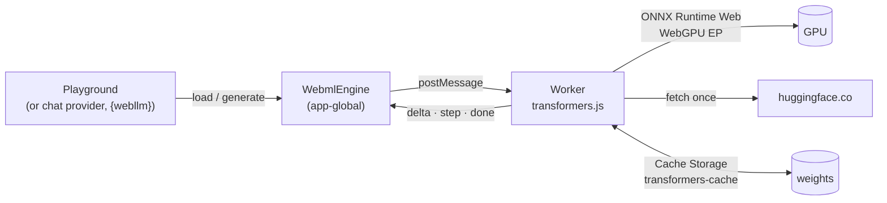
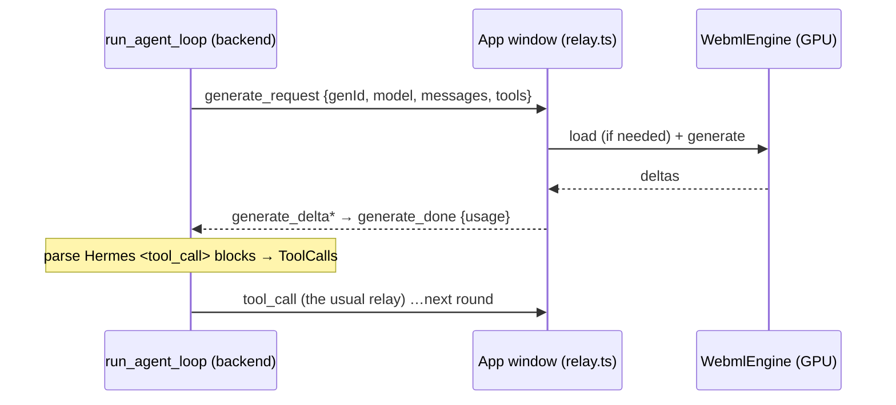

# WebML

**Status: Phases 0–5 of 6 implemented** (foundation, playground, `browser` chat
provider, and Scrive's `{space}`, `{app}`, `{webllm}` and `{tokenviz}` — see
[Scrive](./scrive.mdx#hugging-face-spaces)). Phase 6, our own WGSL engine for GGUF, is
built through stage 6.6
([WebML GGUF engine](../architecture/webml-gguf-engine.mdx)): `llama`, `qwen2`,
`qwen3`, `gemma3` and `smollm3` files in F32 to Q4_K_M, matching llama.cpp. The engine
prefills in batches, reuses the KV cache across replies, and samples on the GPU. It
runs in the playground, behind the `browser` chat provider and in published Scrive
pages, and runs this node's own GGUFs (the llama.cpp catalog, training's conversions)
straight from its disk through **Run in this window**. With the logit lens on, every
token carries a per-layer readout, shown in the token strip and the model explorer. Language models that
run **in this window, on its GPU**, through WebGPU: no backend round-trip, no
provider, nothing typed leaves the machine. Modelled on the Hugging Face "webml"
static Spaces (SmolLM WebGPU, Gemma 4 / Bonsai WebGPU kernels, Agate).

- **Engine package:** `packages/webml` (`@horrible/webml`) — GPU probe, model
  worker, client, weight cache, catalog. No React, so Scrive's published blocks can
  reuse it.
- **Frontend module:** `packages/core/src/modules/webml/`
- **Backend surface:** `backend/modules/agent/browser_provider.py` (the `browser` chat
  provider's relay); no routes of its own.
- **Plan:** `~/.claude/plans/the-webgpu-huggingface-spaces-logical-dragon.md` (Phases
  0–5); Phase 6 in [WebML GGUF engine](../architecture/webml-gguf-engine.mdx).

## Contributions to the layout shell

- **Panels:** `webml.playground` (WebML Playground, document, singleton) and
  `webml.lens` (Logit Lens, document, singleton; sections **Reply** `r`, **Guess**
  `g`, **Compare** `c`).
- **Commands:** `webml.openPlayground`, `webml.openLens`, `webml.unload`.
- **Boot:** `initWebmlRelay()` (beside `initAgentRelay`) answers relayed generations and
  keeps the backend told what this window can run.
- **Settings:** `webml.defaultModel`, `webml.temperature`, `webml.topk`,
  `webml.lens`, `webml.thinking`.
- **Agent context:** the playground reports the WebGPU adapter, the loaded model and
  the last reply's speed (read-only; no agent tools).

## How a model runs

- **Two workers behind one engine.** Hub ONNX repos run in transformers.js. GGUF
  files, addressed as `gguf:<owner>/<repo>/<file.gguf>`, run in our own WGSL engine
  (`gguf.worker.ts`, see [WebML GGUF engine](../architecture/webml-gguf-engine.mdx)).
  Both speak the same protocol. Loading a model for the other engine replaces the
  worker, which is the only way to free its GPU memory.
- **One engine for the app** (`engine.ts`). A loaded model is a gigabyte of GPU
  memory and seconds of shader compilation, and every surface wants the same one, so
  it is app-global like a notebook kernel: closing the playground does not unload
  it; `WebML: Unload` or loading another model does.
- **The worker** (`packages/webml/src/engine/transformers.worker.ts`) holds one model
  and runs one generation at a time — a second request while one runs is refused,
  not queued. It warms the model with a one-token generation after loading, so the
  first reply's TTFT measures the model, not WGSL compilation.
- **GGUF weights** download once into OPFS (`webml-gguf/`), resuming if
  interrupted. "On this device" lists them beside the ONNX cache and flags partial
  downloads.
- **Weights** download once from the Hub and live in Cache Storage
  (`transformers-cache`, keyed by Hub URL). ONNX Runtime's WASM runtime comes from
  jsDelivr on first use and is cached the same way.
- **No cross-origin isolation.** WebGPU does not need COOP/COEP, and adding
  `require-corp` would break the browser pane and the third-party SDKs. The cost:
  the WASM CPU fallback runs single-threaded.

## The protocol

`packages/webml/src/protocol.ts`. Host → worker: `load`, `generate`, `interrupt`,
`unload`. Worker → host: `progress`, `ready`, `error`, `delta`, `step`, `done`,
`unloaded`; every generation event carries its `id`.

`step` events are opt-in (`topK > 0`). Each is the distribution the token was
**sampled from** — recorded by a logits processor appended after the model's own
(repetition penalty, temperature, top-k), so it is what the sampler saw. Logits come
back to the CPU every step anyway, so this costs one pass over the vocabulary, not a
GPU readback.

`generate` with **`forced`** (GGUF only) does not sample. The reply is the given
text, fed a token at a time, and each `step` reports what the model predicted at that
position at temperature 1: the forced token's probability, the alternatives and, with
`lens`, every layer. Special tokens in the text are parsed, so a reply rebuilt from
its own steps reads back as the same tokens. It is how the Logit Lens compares two
models on identical text (`session.ts`, tested against llama.cpp's logits).

## The playground

Model picker (catalog, any ONNX Hub id, or a GGUF file from a Hub repo, whose
header is checked before Load enables), weight variant, a download-size warning before
the first click, per-file progress, then chat with live **tok/s**, **TTFT**, token
count and stop reason. Each reply's **token-probability strip** shades every token
by its probability; hovering shows the alternatives and the distribution's entropy.
With **`webml.lens`** on and a GGUF model loaded, the hover also shows the **logit
lens**: per layer, the token the model would have said from its residual stream
there, its probability, and the stream's norm. It roughly halves decode speed (see
[WebML GGUF engine](../architecture/webml-gguf-engine.mdx#66-later-each-optional)).
"On this device" lists cached models with their size and deletes them.

## The Logit Lens

`webml.lens` looks at the lens properly. The window's engine keeps the latest reply
that ran with the lens on, whichever surface asked (`lens-run.ts`), so this pane, and
the model explorer's grid, fill in while the reply is written. Code is in
`modules/webml/lens-lab/`, the arithmetic in `model.ts` (unit-tested).

- **Reply.** Every token against every layer on one canvas heatmap. A cell is the
  probability that layer gives the token finally chosen (from the layer's top 5;
  blank when it is not there), so a column fills in as the prediction forms.
  Outlined cells are where that token is the layer's best, and a tick marks where it
  **settles**: the first layer from which it stays best to the end. Under the reply,
  each token's underline is as thick as its settle layer is deep, and dashed for a
  sampled token the model never preferred. Picking a token shows its stack: the
  residual norm and the readout's entropy by layer, and every layer's best token.
- **Guess — "When does it know?".** Five tokens of the reply, one at a time, shown
  with the text before them. Guess the layer it settled at, then see that token's
  real column. Exact scores 100, falling to 0 a quarter of the stack away. Tokens
  that settle at layer 0, never settle, or are whitespace are not asked. The best
  score is kept in this browser.
- **Compare — "What did my fine-tune change?".** Pick a base (A) and a fine-tune
  (B) from this node's GGUFs, the ones kept in this browser, or the loaded model. A
  model this node trained is offered as B first, with its recorded base named. A
  writes a greedy reply; then each model is made to **read that same reply** with
  `forced` and the lens on. Reading identical tokens is the point: two free
  generations diverge at their first different token, and every position after
  that would compare two different sentences. The result:
  - Perplexity of the reply under each, and how many positions B's own top choice
    differs.
  - Where each token settles under A and under B, and its output probability under
    each.
  - A diverging heatmap of B's probability minus A's for the reply's token at every
    layer and position: accent where B is surer, `--danger` where it is less sure,
    blank where they agree. Values come from the top-5 readouts, so a token outside
    a layer's top 5 counts as 0 there, and the tooltip says so.
  - Any position's two stacks side by side.
  The window holds one model at a time, so a comparison loads A, then B, and leaves B
  loaded. Models that tokenize the reply differently are compared by index, with a
  warning.

## The `browser` chat provider

The agent loop runs in the backend; only the model moved. A round for provider
`browser` is relayed to the window whose socket started the turn:

- **Which window:** `current_ws_conn` (a context variable) is set once per `/ws`
  connection in `backend/app.py`; every task spawned from that socket inherits it.
  Callers without one (evals, games, synthetic data, `/agent/complete` over HTTP) get
  `BrowserProviderUnavailable` — an `httpx.HTTPError`, so they treat it as "provider
  down" rather than hanging.
- **Reachability:** each window pushes `webml_manifest` (WebGPU or the reason it has
  none, cached models, the loaded one) on connect and whenever a load or delete
  changes it. The status probe lists only those models, so picking one never starts
  a download behind the user's back.
- **Tool calls:** in-browser models write them as text. **Hermes**
  (`<tool_call>{"name","arguments"}</tool_call>`, Qwen3 and SmolLM3) is parsed in the
  backend; the markup is held back from the streamed answer (`HermesFilter`). Catalog
  models with no tool format get no tool preamble at all. An unparseable block becomes
  a call carrying `arg_error`, never a call with empty arguments.
- **Only the asking window may answer** (`genId` is checked against the socket), and
  the chat's Stop sends `generate_cancel`, which interrupts the worker.

**Chunked prefill.** The onnx-community exports have no `num_logits_to_keep` input,
so one forward over an agent turn's prompt (system prompt + ~25 tool schemas ≈ 4k
tokens) returns logits for every position: 4k × a 152k vocabulary = 2.4 GB, past ONNX
Runtime Web's 32-bit heap (`std::bad_alloc`). The worker therefore feeds prompts over
256 tokens into the KV cache in 256-token chunks, then generates from the warm cache.

**Measured (2026-10-07, Intel Gen12 iGPU):** SmolLM2-360M chat at ~27 tok/s,
TTFT ~0.7 s; an agent round with Qwen3-0.6B (≈4k-token prompt, re-sent every round)
takes ~50 s, almost all prefill. The relay round-trips correctly — Qwen3-0.6B emits a
valid Hermes `list_open_panes` call and the result reaches the next round — but at
0.6B it then repeats the call instead of answering. Use Qwen3-1.7B or SmolLM3-3B for
agent work; the small models are for chat.

## Catalog

`packages/webml/src/catalog.ts`: text-generation repos checked to ship q4/q4f16 ONNX
weights (sizes from the Hub, 2026-10-07). `q4f16` needs the adapter's `shader-f16`
feature; without it the picker falls back to `q4`. Multimodal checkpoints (Gemma 4
E2B, Qwen3.5) are not listed — they load through a processor, not
`AutoModelForCausalLM`.

## Browser vs desktop

| | Browser | Desktop (WebView2) |
| --- | --- | --- |
| WebGPU | Chrome/Edge 113+, secure context (localhost counts) | on by default; no GPU flags in `WEBVIEW2_ARGS` |
| Weight cache | per origin | per app origin |
| Hosted (Vercel) | works — the GPU is the visitor's | n/a |
